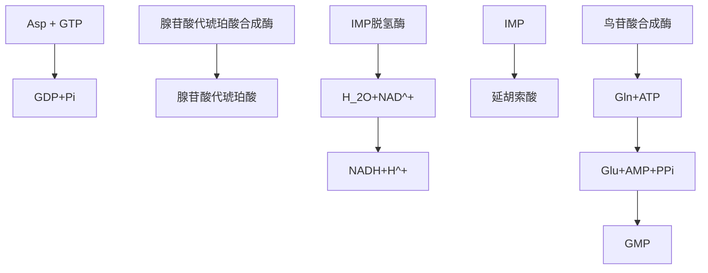

<!-- Page 1 -->
```markdown
# 生化红皮书

## 高分笔记 > 2025

| | |
|---|---|
| **1** | 带背以及激活视频课请加第2页群 |

本资料为求臻B站课程讲义，严禁复制、出版、商用。
```

<!-- Page 2 -->
```markdown
# **25版生物化学高分笔记使用前必看说明**

1、如下二维码是本笔记配套讲解课程，如果你还买了其他刷题、真题、专题等课程，请记得加入售后群见群公告。售后群见下文（3）带背售后群


**基础课程**
```
| 基础课程 |
| --- |
|  |
```

2、如果使用本笔记以及课程感觉到有难度学习有困难, 那么你需要再夯实基础, 打基础请看我们零基础课程

3、仅仅靠自己学可能难以高效学习, 故由学长学姐开设高分笔记带背售后群

| 带背批次 | 带背时间 |
| --- | --- |
| 第一期 | 6月20日~7月20日 |
| 第二期 | 4月20日~8月20日 |
| 第三期 | 9月20日~10月20日 |
| 第四期 | 10月20日~11月20日 |

4、购买了全程资料同学你还有强化以及冲刺阶段资料需要给你补发; 强化资料在5月左右补发；冲刺资料在7月左右补发：请一定加上述群查看群公告填写补收件信息不填的同学默认不补发。

5、学习高分笔记复习全书或做题时候有疑问可以在生化答疑小程序“知识星球”问(进入后搜求臻生物化学), 能够每天完成任务同学也可以在知识星球 (进入后搜求臻生物化学 ) 完成打卡。
```

<!-- Page 3 -->
```markdown
## 基础阶段

**3月1日~7月31日**

### 主讲:小万老师、安学长

| 视频课程 | 配套资料 |
| --- | --- |
| 生物化学基础课, 小万老师 | 无资料，仅电子版ppt |
| 生物化学高分笔记课, 安学长 | 《生物化学高分笔记》 |
| 生物化学习题课, 安学长 | 《生化通关必刷880题》 |

* 基础较为薄弱或零基础同学要先跟生物化学基础课。无需看厚重的教材，只需要学习课程中ppt，旨在搭建知识框架以及核心知识。
* 基础比较好的同学或自己已经过完一轮的同学直接看《生物化学高分笔记》，听配套生物化学高分笔记课。
* 在学习的过程中要做配套习题册《生化通关必刷880题》，习题册每一题均有视频讲解


## 强化阶段

**8月1日~10月31日**

### 主讲：小万老师、安学长

| 视频课程 | 配套资料 |
| --- | --- |
| 历年真题讲解 , 学长学姐 | 《历年真题与答案解析》 <br> 《真题狂背》 |

* 8月、9月做真题套卷，至少做两遍，每一道题都要翻阅教材或资料找寻答案，必须要有自我总结答案的过程
* 10月份背真题及相关知识，背套卷也可以背按照章节整理的《真题狂背》


## 冲刺阶段

**11月1日 ~ 12月22日**

### 主讲 : 安学长

| 视频课程 | 配套资料 |
| --- | --- |
| 背诵手册带背视频 | 《生物化学背诵手册》 |
| 专题讲解 | 生物化学冲刺专题（含生化实验） |

* 在背完真题的基础上，学有余力要背《生物化学背诵手册》，《生物化学背诵手册》里收录了更多考研可能考的必背题，《真题狂背》没有背完情况下《背诵手册》就不要背了
* 最后一个月为了解决计算题、实验题、综合难题最后使用生物化学冲刺专题


---

基础阶段高分笔记是指总结考研常考知识点，通关必刷题是配套习题，每题均有解析；强化阶段真题与答案解析是按照年份排列的试卷与答案解析，用于刷真题，真题狂背是按照章节汇总的真题与答案，用于后期直接背诵; 冲刺的背诵手册是更多考研可能考的题 ; 冲刺专题为了解决计算题、诺贝尔奖、实验设计题、综合分析题等书里学不到的内容 ，用于拔高冲高分

通用版就是不区分院校，院校定制版会考虑到各高校考试参考书目、考试侧重点 。在 25 版系列资料 中，基础阶段考虑到要打基础、搭框架全面复习 故 各高校基础阶段以参考书目为区别 A 与 B 校院参考书一致则基础阶段高分笔记、通关习题册一样而强化阶段、冲刺阶段 是进一步结合 真题、考试大纲考察侧重点为区别 所有高校版本均不一样。

```


<!-- Page 4 -->
| | |
| --- | --- |
| **专题一：生命的分子基础** | ...5 |
| **专题二：氨基酸、肽和蛋白质** | ...9 |
| **专题三：蛋白质的三维结构** | ...23 |
| **专题四：蛋白质的生物学功能** | ...30 |
| **专题五：蛋白质的性质、分离纯化和鉴定** | ...38 |
| **专题六：酶的催化作用** | ...44 |
| **专题七：酶动力学** | ...50 |
| **专题八：酶的作用机制和酶活性调节** | ...61 |
| **专题九：糖类和糖生物学** | ...69 |
| **专题十：脂质和生物膜** | ...84 |
| **专题十一：核酸的结构和功能** | ...97 |
| **专题十二：核酸的物理化学性质和研究方法** | ...111 |
| **专题十三：维生素和辅酶** | ...123 |
| **专题十四：激素和细胞信号** | ...129 |
| **专题十五：新陈代谢总论** | ...132 |
| **专题十六：生物能学** | ...135 |
| **专题十七：六碳糖的分解和糖酵解作用** | ...137 |
| **专题十八：柠檬酸循环** | ...148 |
| **专题十九：氧化磷酸化作用** | ...157 |
| **专题二十：戊糖磷酸途径** | ...168 |
| **专题二十一：糖异生和糖的其他代谢途径** | ...173 |
| **专题二十二：糖原的分解和生物合成** | ...179 |
| **专题二十三：光合作用** | ...186 |
| **专题二十四：脂质代谢** | ...188 |
| **专题二十五：蛋白质降解和氨基酸的分解代谢** | ...205 |
| **专题二十六：氨基酸的生物合成和生物固氮** | ...215 |
| **专题二十七：核酸的降解和核苷酸的代谢** | ...220 |
| **专题二十八：新陈代谢的调节控制** | ...232 |
| **专题二十九：基因和染色体** | ...235 |
| **专题三十：DNA 的复制和修复** | ...240 |
| **专题三十一：DNA 的重组** | ...251 |
| **专题三十二：RNA 的生物合成和加工** | ...255 |
| **专题三十三：蛋白质的合成、加工和定位** | ...263 |
| **专题三十四：基因表达的调节** | ...271 |
| **专题三十五：基因工程、蛋白质工程及相关技术** | ...278 |
| **专题三十六：基因组学和蛋白质组学** | ...282 |

第 4页

资料仅供求臻云课堂学员使用，任何组织或个人翻印、商用所产生法律责任自行承担,侵权将受到求臻生物考研依法起诉与追责

<!-- Page 5 -->
```markdown
# 求臻生物考研2025级考研，学长V: zxr4470

## 专题一：生命的分子基础

| 生命的分子基础 | - |
| --- | --- |
| 生命属性与生物化学 | 
| 生物化学与分子生物学 | 
| 生命物质的化学组成 | 
| 生物分子的三维结构：构型和构象 | 
| 生物系统的非共价相互作用 | 
| 生命的基本单位——细胞 |

### 考点一 : 生命属性与生物化学

#### 1、基本概念（不考, 阅读下即可）

##### (1) 生物化学:
```
是研究生命属性的化学本质的科学。简言之就是生命的化学。
它是研究生命物质的化学组成、结构及生命活动过程中各种化学变化的基础生命科学。
```

##### (2) 生物分子 :
```
自然界中生命活动的产物都是含碳有机化合物，
主要是蛋白质、核酸、糖类、脂质及它们的单体亚基等有机分子。
生物分子在生物体内不是随机堆积而是组织成严谨有序的结构。
```

##### (3) 生物大分子 :
```
多糖、蛋白质、核酸分别由几种称为单体亚基的较小分子共价聚合而成的线性高分子,
称为生物大分子.
脂质聚集体有大分子性质而被视为“准生物大分子” .
它们在所有生物体内各自都有相同结构模式和生物功能。
```

##### (4) 生物是有结构层次的 , 层次从低到高:

```
单体亚基、 大分子、超分子复合体、 细胞器直至细胞。

对多细胞的生物来说，在细胞这一层次以上还有组织、器官、 系统直至生物个体。
```

#### 二、新陈代谢

##### 新陈代谢 :

```
指生物体内进行的所有化学变化的总称,

是生物体一切生命活动的基础，

生命机体和无生命物体的根本区别在于前者可通过新陈代谢不断自我更新(★)

一般性重要的名词解释考点)
```

##### （1）分为合成代谢 和分解代谢：

各代謝途径相互交织在一起形成一个 在分子、细胞整体三个水平上受到严格调控代谢网络使新陈代谢在时空 上严整有序 ，有条不紊。

##### 合成代谢 ：

```
指由小分子前体合成大分子细胞成分如蛋白质、 核酸等或将外界环境中取得 的物质转化为自身组成物质的还原需能反应 如糖原合成脂肪酸合成、

蛋白质合成 及其单体亚基合成等 。 其主要代谢功能 是利用分解代谢释放并贮存在 ATP NADPH 等的能量 进行大分子生物合成。
```

##### 分解代谢：

```
指有机营养物分子如糖类、脂质、蛋白质等被降解成中间物进而降解成终产物 或将自身组成物质转化为外界环境中的物质的氧化产能反应 如糖酵解途径 TCA 循环、氧化呼吸链和脂肪酸氧化 . 其主要代谢功能是产生能量 并便于利用的化学能形式贮存于ATP NADPH 等分子 中。
```
```

<!-- Page 6 -->
```markdown
# 求臻生物考研2025级考研，学长V: zxr4470

| 细胞大分子 | 含能营养物 |
| --- | --- |
| 蛋白质 | 糖类 |
| 多糖 | 脂肪 |
| 核酸 | 蛋白质 |

### 三、活生物获得能量的方式

1. **活生物主要以两种方式获得能量：一种是以日光（辐射能）形式被光自养生物贮存；另一种是以有机营养物形式被异养生物摄取。**

#### 四、遗传信息

1. **繁殖过程中，亲代将遗传信息传递给子代，子代按照所得的遗传信息进行生长，获得跟亲代相同或相似的性状，称为遗传；而亲代和子代之间性状之间的差异，称为变异。**
2. **遗传信息的主要载体是DNA，除此之外还有少量生物以RNA作为遗传信息的载体。模板DNA以半保留复制的方式将遗传信息传递给子代。**


#### 考点二：生物化学与分子生物学

##### 生物化学与分子生物学

1. 近代细胞学说和达尔文进化论的发现推动了现代生物化学的发展。
2. *两个历史突破*:
   - (①)证实酶作为生物催化剂的存在；
   - (②)证实核酸作为遗传信息载体的作用。

3. *两座历史丰碑*: 
    - (①)1953年DNA双螺旋结构的发现;
    - (②)21世纪初人类基因组计划对人类基因组草图的构建。前者对分子生物学具有开创性意义,后者大大推动了分子生物学的发展。

4. **生物化学发展的三个阶段**:

   （1）静态阶段：酶、维生素和激素的发现等。<br>
   
   （2）动态阶段：多种代谢途径的确立，呼吸，光合作用的深入研究等。<br>

   （3）现代阶段：DNA结构、中心法则、操纵子学说、DNA重组技术、RNA具有酶的功能等。<br>

J.B.Summer在1926年获得世界上第一个结晶的酶——脲酶，并证实它是一种蛋白质。Sanger 在1955 年确定了牛胰岛素的化学结构，并于1958年获得诺贝尔化学奖。因设计出一种测定 DNA 的核苷酸序列的方法获1980年诺贝尔化学奖。

6. 我国生化学科发展：吴宪开创了我国的生化科学。王应睐是我国的生物化学奠基人之一，创办了上海生物化学研究所，1965年人工合成结晶牛胰岛素，1983年采用有机合成和酶促合成结合法合成了酵母丙氨酸转移核糖核酸。（★）

#### 考点三：生命物质的化学组成

##### 生命物质的化学组成

第6页资料仅供求臻云课堂学员使用任何组织和个人翻印商用所产生法律责任自行承担侵权将受到求臻生物考研依法起诉与追责
```

<!-- Page 7 -->
```markdown
| 求臻生物考研2025级考研，学长V：zxr4470 |
| --- |
| - | **1**．常量元素: C、H、O、N、P、S、K、Na、Ca、Mg、Cl。微量元素:Mn、Fe、Co、Cu、Zn等。（★）（选择题、填空题考点）
|   * | **2**蛋白质:氨基酸通过酰胺键连接而成的多聚体,构成细胞除水以外的最大部分，在生物体内起动态功能和结构元件的作用。
|   * | **3核酸:**以核苷酸为基本结构单位通过$'3', '5'$磷酸二酯键连接形成的无支链线形或环形多聚体可被酸碱酶水解分为核糖核酸(RNA) 和脱氧核糖核酸(DNA）。两者基本化学结构相同仅所含戊糖不同其功能主要是贮存和传递遗传信息。
|   * | **4多糖**:由 $10个以上单糖单位通过糖苷键连接形成的聚合物 多糖链可以是线形或带有分支 分为水解时只产生一种单糖或单糖衍生物的同多糖和水解时产生一种以上单糖或/和单糖衍生物的杂多糖 主要功能:(①作为富能的燃料储库; (②作为细胞壁的刚性结构成分;(③作为胞外识别元件与其他细胞上的蛋白质结合.
|   * | **5脂质:**水不溶性的烃类衍生物 , 为生物膜的结构成分 高能的燃料贮库色素和胞内信号等。

* 考点四 : 生物分子的三维结构: 构型和构象

* 一、构型和构象(本章比较重要的知识点)
	+ 蛋白质构型指有相同结构式的蛋白立体异构体的各原子或基团在空间中的相对取向分 D 型和 L 型 其改变必须发生共价键断裂和重新形成并发生蛋白分子光学活性的改变。
	+ 蛋白质构象指有相同结构式和构型的蛋白分子由于单链旋转式键角的改变而形成的各种空间结态 即蛋白分子中各原子或基团在空间中的排列分布及肽链走向 其改变不需发生共价键断裂和重新形成蛋自分子光学活性不发生改变.

* 二、同分异构(在糖类部分会展开,本章仅作了解)

	+ 同分异构是指存在两种或多种化学组成 相同即分子式相同的化合物的现象 异构现象主要有结构异构和立体异构两种:
		- 结构异构 是指具有相同分子式的分子因原子的连接次序不同 因而形成的化学键不同 即分子的构造不同产生的 结构异构须用结构式来区别 .
		- 立体异构 是指具有相同结构式的分子因原子的空间排列不同引起的 .立休异构一般分为几何异构 （顺反）、旋光异构 或称光学异构 \((D / L)\).

* 三、基本概念(在蛋白质、糖类部分会展开,本章先行预习了解）

	+ 手性中心: 指具有 $\mathrm{n}$ 个不同取代基团的四面体碳原子也称手性碳原子一般来说有 n 个手性碳原子 就有 ${ }^{2} "个旋光异构体。( 名词解释考点 )
	+ 对映体互为不能叠合的镜像 的立体异构体非对映体彼此不能成像的旋光异构体。
	+ 差向异构体一个手性碳原子的构型不同的非对映异构体称为差向异构体.( \(D\)-甘露糖\(D\)葡萄糖、D一半乳糖为双相异构体).
	+ 旋光异构体同种分子由于手性分子中原子或基团的空间排列不同而对平面偏振光的偏振面发生不同影响引起异构现象。
	+ 生物分子构象的立体化学可采用 X射线晶体学方法研究 此方法精度很高 可测出分子中每一原子的位置要求待测样品是晶体 核磁共振可提供生物分子在溶液中的三维结构信息因此 NMR 和X射线衍射技术 在研究三维结构方面彼此可以很好的互补 。( ★ ) (填空题考点 )

* 考点五 ：生物系统的非共价相互作用

* 一、生物系统的非共价相互作用(本章比较重要的知识点此处在蛋白质部分会再讲)

	+ 1生 物系 统 中 的 非 共 力 价 有 离 子 相 互 作 用氢 键范 德华力 和疏 水 相 互 作 用。
	+ 2离子相互作用又称为离子键盐键和盐桥是在发生在带电荷基团之间的一种静电相互作用带异种电荷基团之间为引力 带同种电荷基团之间为斥力 它对环境极敏感 加入盐类可减弱加入非极性溶剂可增强在疏水环境中介电常数比水中低此时异种电荷基团之间的引力相应增大。
	+ 3氢键本质是静电相互作用由电负性较大的原子和氢原子形成有方向性饱和性氢键形成有协同性即一个氢键的形成可促进其余氢键的形成。
	+ 4范德华力广义范德华力包括 3 种较弱的静电相互作用定向效应发生在极性物质之间诱导


资料仅供求臻云课堂学员使用任何组织或个人翻印商用所产生的法律责任自行承担侵权将受到求臻生物考研依法起诉与追责第页
```

<!-- Page 8 -->
```markdown
| 效应发生在极性物质与非极性物质之间；分散效应是非极性物质之间仅有的一种范德华力。 |
| --- |
| -5 疏水相互作用：指在介质水中的疏水分子或基团倾向于聚集在一起的现象，在维持蛋白质、DNA等生物大分子的三维结构方面有重要作用。 |

### 考点六 生命的基本单位——细胞

#### 一、生命的基本单位——细胞

1. 细胞生物主要分为真核细胞和原核细胞。二者的主要区别在于遗传物质是否有核膜包裹着，有核膜包裹着的是真核细胞,裸露的为原核细胞。
2. 根据生物如何获得合成细胞材料所需的能量和碳对它们进行分类。按能量来源不同可以分成两大类: (①)光养生物捕获并利用日光能;（(2）化养生物从氧化化学燃料获取能量有些化养生物是无机营养型他们氧化无机燃料有些是有机营养型们氧化环境中可利用的各种有机化合物 光养生物和化养生物各自又可分为:(自养生物从 CO 中获得全部所需 的碳异养生物从有机营养物中得到所需的碳。

学习高分笔记复习全书或做题时候有疑问可以在生化答疑小程序“知识星球”问进入后搜求臻生物化学),能够每天完成任务同学也可以在知识星球进人后搜求臻生物化学完 成打卡
```


<!-- Page 9 -->
```markdown
# 求臻生物考研2025级考研，学长V: zxr4470

## 专题二：氨基酸、肽和蛋白质

| | |
| --- | --- |
| **氨基酸——蛋白质的单体亚基** | 
| * 氨基酸的分类 |
| * 氨基酸的酸碱化学 |
| * 氨基酸的化学反应 |
| * 氨基酸的光学性质和光谱性质 |
| * 氨基酸混合物的分析和分离 |
| **肽** |
| * 蛋白质的组成、分类、分子大小和结构层次 |
| * 蛋白质的一级结构 |
| * 蛋白质测序的一些常用方法 |
| * 氨基酸序列与生物进化 |
| * 肽和蛋白质的化学合成 —— 固相肽合成 |

第9页资料仅供求臻云课堂学员使用,任何组织或个人翻印商用所产生法律责任自行承担侵权将受到求臻生物考研依法起诉与追责
```

<!-- Page 10 -->
```markdown
## 考点一：氨基酸——蛋白质单体亚基

### 1、蛋白质的水解

#### 酸水解（记住特殊氨基酸的情况）

- 条件: \(6 \text{mol/L} \, \mathrm{HCl}\) 或 \(4\,\text{mol/L}, \, H_2SO_{4}\), 回流煮沸\(20h\)  
- 优点: 不起消旋作用，得到L-氨基酸 
- 缺点:
    - (1)色氨酸被破坏,
    - （2）天冬酰胺和谷氨酰胺的酰氨基水解，分别转化成了天冬氨酸和谷氨酸。
    - （3）丝氨酸Ser、苏氨酸Thr小部分分解。

#### 碱水解(记住特殊氨基酸的情况)

- 条件: \(5\,\text{mol/L NaOH}\)，共煮\(10–20 h\)
- 优点: 色氨酸稳定
- 缺点: 多数氨基酸遭到不同程度的破坏，产生消旋现象。得D-, L-氨基酸混合物；精氨酸脱氨→鸟氨酸和尿素 

#### 酶水解:

- 缺点: 持续时间较长，部分水解
- 优点: 不产生消旋，也不破坏氨基酸
- 酶的部分水解用于蛋白质的一级结构分析。


图 氨基酸的结构通式


|   |     |
|---|-----|
| $\begin{array}{l}\left.\mid\right\rangle \\[-8pt]\end{array}$<br>侧链基团 | $-\quad C_{a}-C-OH$ |

* **二**从蛋白质水解产物中分离出来的常见氨基酸只有20种。(19种氨基酸和一种亚氨基酸即脯氨酸）。除脯氨酸及其衍生物外，这些氨基酸在结构上的共同点是与羧基相邻的α-C原子(Co上都有一个氨基因此称为 α-氨基酸连接在α碳上的还有一个氢原子和一个各异的侧链称R 基各种氨基酸的区别就在于 R 基的不同。
* * **三**α-氨基酸在中性pH介质中以兼性离子形式存在具有等电点。α-羧基以COO~ 形式存在，
	+ α-氨基以NH₃⁺ 形式存在。
* * **四**α-氨基酸除甘氨酸(R 基为氢之外其α-碳原子是一个手性碳原子因此都具有旋光性。（手性碳原子以及旋光性会在氨基酸的光学性质考点再介绍）
* * **五**α-氨基酸白色晶体高熔点有特殊结晶形状可用于鉴别各种氨基酸），除胱氨酸和酪氨酸外，都可溶于水；脯氨酸和羟脯氨酸可溶于乙醇或乙醚。
* * **六**α-氨基酸作为蛋白质的构件分子原因：α-氨基酸之间通过α碳上的氨基和羧基形成酰胺键使肽链骨架上的一些原子靠得更近 更易于彼此间相互作用使蛋白质的空间结构更紧凑更稳定所以组成蛋白质的氨基酸都为α-氨基酸。


### 考点二 : 氨基酸的分类


#### 一、氨基酸的名称与缩写

|      |       |
|------|-------|
| 氨基酸$\{$ <br>$-$非蛋白质氨基酸<br>| 常见的蛋白质氨基酸 ： 具有密码子<br><br>不常见的蛋白质氨基酸|

* **七**1、蛋白质氨基酸 即参与蛋白质组成的氨基酸包括常见的氨基酸和若干种不常见的氨基酸。常见氨基酸也称基本氨基酸有20 种; 不常见的氨基酸它们都是在已合成的肽链上由常见的氨基酸经专—酶催化的化学修饰转化而来的 。2 种不常见的氨基酸含硒半胱氨酸存在于含硒蛋白之中 ) 和吡咯赖氨酸仅存在于一些原核生物体内 ，作为与产甲烷代谢有关 的某些酶的组分人体中含有含硒半胱氨酸 )
* **八**2、非蛋白质氨基酸 存在于生物体内但不组成蛋白质约150 种多为L-氨基酸衍生物及反应中间产物如瓜氨酸、鸟氨酸和羟脯氨酸。
* **九**3、基本氨基酸的缩写
```

<!-- Page 11 -->
```markdown
| 名称 | 三字母符号<sup>①</sup> | 单字母符号<sup>2</sup> | 名称 | 三字母符号 | 单字母符号 |
| --- | --------------------- | -------------------- | ---- | ---------- | ----------- |
| 丙氨酸 (alanine) | Ala                  | A                    | 亮氨酸(leucine)| Leu        | L           |
| 精氨酸(arginine)   | Arg                  | R                    | 赖氨酸lysine    | Lys         | K           |
| 天冬酰胺(asparagine)     | Asn                 | N                   | 甲硫氨酸(methionine)(蛋氨酸)      | Met       | M          |
| 天冬氨酸(aspartic acid) | Asp                | D                   | 苯丙氨酸(phenylalanine)            | Phe       | F          |
| 半胱氨酸(cysteine)    | Cys                 | C                   | 脯氨酸(proline)               | Pro       | P          |
| 谷氨酰胺(glutamine)   | Gln                 | Q                   | 丝氨酸serine             | Ser       | S          |
| 谷氨酸(glycine)      | Glu                 | E                   | 苏氨酸(threonine)              | Thr       | T          |
| 组氨酸(histidine)<sup>3</sup>| His                | H                   | 酪氨酸(tyrosine)              | Tyr       | Y          |
| 异亮氨酸(isoleucine) | Ile                 | I                   | 缬氨酸(valine)              | Val       | V          |

### **二、蛋白质氨基酸的分类**

1. 各种氨基酸的区别在于侧链R基的不同。因此组成蛋白质的20种基本氨基酸可以按R基的化学结构以及性质（如大小，酸碱性极性是否带电荷）分类。（：由于甘氨酸的侧链是H, 所以不会产生空间位阻也不含手性碳所以在空间结构中有特殊作用）

#### （1）按照化学结构分

* 脂肪族（含有烃链或烃类衍生物）
	+ - 氨基一羧基的氨基酸: Gly ,Ala,Val,Leu,Ile,Ser,Thr,Cys,Met
	+ - 氨基一羧基的酰胺:Asn,Gln
	+ - 氨基二羧基的氨基酸（酸性氨基酸 带负电): Asp,Glu
	+ - 二氨基一羧基的氨基酸（碱性氨基酸 带正电):Arg,Lys
	+ 另外Pro也认为脂肪族氨基酸
* 芳香族（含有苯环）Phe,Tyr Trp
* 杂环族（含有环）His,Pro

#### （2）按照极性分

* 氨基酸极性是指在生物PH约7.0下与水相互作用的倾向非极性特点是疏水的不溶于水高极性特点亲水的（溶于水)
* 如果仅根据R基团对水分子的亲和性可将氨基酸简单地分为两类:
	+ -(1) 极性（亲水）氨基酸Ser,Thr,CysSec,AsnGln,Asp,Glu,Pyl,ArgLys,His多位于蛋白质外部纸层析中距离较近。
	+ -(2) 非极性（疏水）Gly,Ala,Val,Leu,Ile,Pro,Met.Phe 和TyrTrp多位子蛋白质内部纸层析中距离较远疏水相互作用稳定蛋白质结构重要的作用力)

	Tyr.Gly这两个氨基酸在不同版本教材中分类不一样本资料分到疏水氨基酸中。

* 在疏水氨基酸之中Gly和Met 的疏水性与其他疏水氨基酸相比要差原因是Gly侧链为氢原子不是碳氢链Met侧链含有氧原子性质相似S 因此有人把这两种氨基酸放到亲水氨基酸之中或者干脆将它们另立一类中性氨基酸。
* 要特别注意的是所有的氨基酸一般都溶于水原因都是他们都含有亲水的氨基和羧基只是水溶性有高有低。

#### （3）同时考虑化学结构极性分

* 非极性（疏水）可分为脂肪族芳香族含硫族极性（亲水）可分为极性不带电碱性（带


第 11页


资料仅供求臻云课堂学员使用任何组织个人翻印商用所产生法律责任自行承担侵权将受到求臻生物考研依法起诉与追责
```

<!-- Page 12 -->
```markdown
# 求臻生物考研2025级考研，学长V：zxr4470

正电）、酸性（带负电）。故20种常见氨基酸的可分类如下(★★★)

| A．非极性脂肪族R基氨基酸 |
| --- |
| | COO<sup>-</sup> | H3N−C−H | CH3 | H2C/CH2 | H3N−C−H | CH2 | H3C/CH3 | H3N−C−H | CH2 | H3C/CH3 | H3N−C−H | CH2 | H3S−C−S |
|甘氨酸 Gly (α–氨基乙酸) |丙氨酸 Ala (α–氨基丙酸)|脯氨酸 Pro (β–吡咯烷基-a–羧酸)|缬氨酸 Val (a–氨基-b–甲基丁酸)|亮氨酸 Leu (a–氨基-y–甲基戊酸)|异亮氨酸 Ile (a–氨基-b–甲基戊酸)|甲硫氨酸(Met)(a–氨基-g–甲硫基丁酸)| |

B．芳香族 R 基氨基酸
| B. 芳香族 R 基氨基酸 |
| --- |
| | COO<sup>-</sup>| H3N−C−H | CH2 | OH | H3N−C−H | CH2 | H3N−C−H | CH2 | H3N−C−H | CH2 | H3N−C−H | CH2 |
|苯丙氨酸 Phe (α–氨基-b–苯基丙酸)|酪氨酸 Tyr (α–氨基-b–对羟基苯丙酸)|色氨酸 Trp (α–氨基-b–吲哚基丙酸)|丝氨酸 Ser (α–氨基-b–羟基丙酸)|苏氨酸 Thr (α–氨基-b–羟基丁酸)|半胱氨酸 Cys (α–氨基-b–巯基丙酸)| |

D. 带正电荷的(R基氨基酸)
| D. 带正电荷的(R基氨基酸) |
| --- |
|赖氨酸 Lys (α,ε–二氨基己酸)|精氨酸 Arg (α–氨基-d–胍基戊酸)|组氨酸 His (α–氨基-b–咪唑基丙酸)|天冬酰胺 Asn|
|COO<sup>-</sup>H3N−C−HH3N−C−HCNH2+HN=C\=/NH||COO<sup>-</sup>H3N−C−HH3N−C−HCNH2+HN=C\=/NH||COO<sup>-</sup>H3N−C−HCNH2+HN=C\=/NH|

E. 带负电荷的(R基氨基酸)
| E. 带负电荷的(R基氨基酸) |
| --- |
|天冬氨酸 Asp (α–氨基丁二酸)|谷氨酸 Glu (α–氨基戊二酸)|COO<sup>-</sup>H3N−C−HCNH2+HN=C\=/NH||COO<sup>-</sup>H3N−C−HCNH2+HN=C\=/NH||
```


<!-- Page 13 -->
```markdown
| 分类 | 氨基酸 | 性质 |
| --- | --- | --- |
| 非极性脂肪族 | 丙氨酸、缬氨酸、亮氨酸和异亮氨酸 | 在蛋白质分子内倾向于成串聚集，借疏水相互作用稳定蛋白质的结构。异亮氨酸具有两个手性中心。
甘氨酸 | 是唯一的不含手性碳原子的氨基酸，不具旋光性，是氨基酸中结构最简单的。它的侧链R基仅是一个氢原子，对疏水相互作用没有做出实质性的贡献，介于非极性和极性之间，有时甚至把它归入不带电荷的极性类。
甲硫氨酸或称蛋氨酸 | 是两个含硫的氨基酸之一，在它的侧链中有一个非极性的硫酸基，它是体内代谢中甲基的供体。
脯氨酸 | 具有一个特殊的环状结构的脂族侧链。脯氨酸残基的二级氨基（亚氨基）处于刚性构象, 此构象使含有脯氨酸的多脑区域的结构柔性降低, 增加顺式构型肽键的出现频率；脯氨酸是一个亚氨基酸，参与形成的肽键易形成顺式结构；
芳香族 R 基氨基酸 | 酪氨酸 | 酪氨酸的羟基能形成氢键，并且是某些酶的重要功能基。酪氨酸含苯环及酚羟基。有弱碱性，在碱性条件下有较强的失 H+ 能力。酚羟基化学性质活泼，易与金属离子结合，易发生多种化学修饰反应，酚基可与重氮化合物结合形成橘黄色化合物。
色氨酸 | 色氨酸在植物和某些动物体内能转变为烟酸或称尼克酸，是维生素 PP 的一种。
苯丙氨酸 | 酪氨酸和色氨酸的极性明显比苯丙氨酸大; 这是因为酪氨酸的羟基和色氨酸的吲哚环氮的缘故：血浆或尿中苯丙氨酸浓度的测定被用于苯丙酮尿症的诊断指标;
苯丙氨酸吸收紫外光的能力比色氨酸和酪氨酸要弱得多 (Trp>Tyr>Phe) |

| 极性、不带电荷的 R 基氨基酸 | 丝氨酸、苏氨酸 | 硫氨酸和苏氨酸的极性由它们的羟基提供，可与水形成氢键并易发生 O -连接的糖基化及可逆磷酸化修饰: 苏氨酸具有两个手性中心.
半胱氨酸 | 半胱氨酸的极性来自它的巯基．半胱氨酸很容易氧化成共价连接的二聚氨基酸,
称为胱氨酸。胱氨酸中的两个半胱氨酸分子或残基通过二硫键或称二硫桥连接在一起 , 二硫键连接的残基是强疏水的(非极性的).
天冬酰胺和谷氨酰胺 | 天冬酰胺和谷氨酰胺的极性是由由于它们的酰胺基 .这两个酰胺化合物在生理 pH （约7.0 )范围内其酰胺基不被质子化因此此侧链不带电荷 。天冬酰胺 和谷氨酰胺分别是蛋白质中存在的另两个氨基酸天冬氨酸和谷氨酸的酰胺。天冬酰胺和谷氨酰胺很容易被酸或碱水解成它们的游离氨基酸。

| 带正电荷的 (碱性) 氨基酸 | 赖氨酸 | 赖氨酸在脂族侧链有一个 ε=二氨基 ，可以作为亲核基团参与酶促反应 .
精氨酸 | 精氨酸含有一个带正电荷的胍基 ; Arg 是碱性最强的氨基酸，侧链上的胍基是已知碱性最强的有机碱组氨酸 | 组氨酸有一个芳香族的弱碱性咪唑基。组氨酸是唯一的一个 R 基的 pKa(pkR)值在中性附近的氨基酸。组氨酸由于起着质子供体/接纳体的作用，经常用作电子供体和受体 :是在生理 pH 条件下唯一具有缓冲能力的氨基酸 His 在酶的酸碱催化机制中起重要作用它往往存在于许多酶的活性中心

| 带负电 (酸性) 氨基酸 | 天冬氨酸和谷氨酸 | 这两种氨基酸都含有两个羧基，并且第二个羧基在 pH 7.0 左右也完全解离，
因这分子带有净负电荷


一些结论（考试常考）:
* 侧链为烃链的非极性氨基酸：丙氨酸、异亮氨酸、亮氨酸、缬氨酸、甘氨酸（此外还含有甲硫氨酸和脯氨酸和芳香族也为非极性氨基酸，但 R 基不为烃链）
* 侧链含硫原子的氨基酸：半胱氨酸（两个半胱氨酸合成一个胱氨酸）、甲硫氨酸（Met 生物合成中是一种重要的甲基供体，蛋白质合成的第一个氨基酸但是作为直接供给甲基的为 S-腺苷甲硫氨酸(SAM)，它在动植物体内广泛存在，它是由底物 L-甲硫氨酸和 ATP经S-腺苷甲硫氨酸合成酶酶促合成的)
* 侧链有羟基的氨基酸：丝氨酸（出现在酶的活性中心），苏氨酸（和异亮氨酸具有两个手性中心）、酪氨酸（侧链为酚羟基一般不计算在内）
* 侧链含有羧基或酰胺基的氨基酸：天冬氨酸、谷氨酸（在 N端时容易成环，形成焦谷氨酸）、天冬酰胺、谷氨酰胺
* 侧链含有碱性基团的氨基酸：组氨酸（生理 pH 下可以作为电子供体和受体，酶活性中心最常见的氨基酸）、精氨酸、赖氨酸发动亲核进攻
* 侧链带有苯环的芳香族氨基酸：苯丙氨酸、酪氨酸、色氨酸三种芳香族氨基酸在紫外光区都吸收紫外光，在中性 pH 条件下，色氨酸和酪氨酸的紫外吸收峰在280nm而苯丙氨酸的在260nm大多数蛋白质中都含有色氨酸和酪氨酸或其中的一种所以溶液中280nm 吸收的测量常用来估算蛋白质的浓度也与蛋白质自发荧光有关
* 蛋白质中参与结合金属离子的氨基酸：半胱氨酸、组氨酸、天冬氨酸、谷氨酸
* 碱性氨基酸在组蛋白中较多有些氨基酸虽然不常见但在某些蛋白质中存在即不常见的蛋白质氨基酸他们都是由相应的常


第13页资料仅供求臻云课堂学员使用任何组织个人翻印商用所产生法律责任自行承担侵权将受到求臻生物考研依法起诉与追责
```

<!-- Page 14 -->
```markdown
| 见氨基酸经修饰而来的，一般没有对应的密码子。 |
| --- |
| - 胶原蛋白中的4–羟脯氨酸和5–羟赖氨酸。（脯氨酸、赖氨酸演变而来） |
| - 肌球蛋白含有甲基组氨酸。 |
| - γ –羧基谷氨酸最先在凝血酶原中发现。 |
| - 焦谷氨酸在细菌紫膜质中。 |
| - 硒代半胱氨酸：含硒半胱氨酸只存在于含硒蛋白之中, 终止密码子的（UGA) 编码的, 由丝氨酸衍生而来 (不是合成后修饰）。 |
| - 吡咯赖氨酸仅存在于一些真细菌和古细菌体内,作为与产甲烷代谢有关的某些酶的组分 ,终止密码子(UAG )编码 。 |

### 三、非蛋白质氨基酸

- **不能直接掺入到蛋白质分子之中**, 或者是蛋白质氨基酸翻译后修饰产物。(1)L−α − 氨基酸的衍生物; （2）D-a -氨基酸；(3)β 、γ 、δ -氨基酸。例如:瓜氨酸、鸟氨酸和羟脯氨酸。主要有 β -丙氨酸、γ -氨基丁酸、 D环丝氨酸、高半胱氨酸、L一瓜氨酸和 L二鸟氨酸。

#### 考点三 : 氨基酸的酸碱性质

##### 一、氨基酸的解离

- 兼性 (两性)离子,zwitterion ：指在同一分子上带有能释放质子的正离子基团和能接受质子的负离子基团。兼性离子本身既是酸又是碱。因此它既可以和酸反应 ，也可以和碱反应。
- 氨基酸在水溶液中为兼性离子形式存在。兼性离子既起酸的作用, 又起碱的作用。20 种氨基酸中，在生理 pH7 左右，仅有组氨酸具有明显的缓冲能力，因为其 pKa 在 7附近。组氨酸在生理状态下，既可以作为 H+ 的受体，也可以作为供体。<font color="#FF0000">(考试的重点)</font>
- 氨基酸的解离：解离式中 Ka 和 Ka 分别代表 α碳原子上-COOH 和-NH +的表现解离常数。当羧基一半解离时,Ka = [H ]; 当氨基一半解离时, Ka= [H ], 所以此时pH=pKa=-lg[H ]<font color="#FF0000">。</font>

##### 填空题、简答题考点）

(689,688),(701,700){\(\star\)}

(689,700),(701,712){\(\star\)}

(689,712),(701,724){\(\star\)}

(689,724),(701,736){\(\star\)}

(689,736),(701,748){\(\star\)}

(689,748),(701,760){\(\star\)}

(689,760),(701,772){\(\star\)}

(689,772),(701,784){\(\star\)}

(689,784),(701,796){\(\star\)}

(689,796),(701,808){\(\star\)}

(689,808),(701,820){\(\star\)}

(689,820),(701,832){\(\star\)}

(689,832),(701,844){\(\star\)}

(689,844),(701,856){\(\star\)}

(689,856),(701,868){\(\star\)}

(689,868),(701,880){\(\star\)}

(689,880),(701,892){\(\star\)}

(689,892),(701,904){\(\star\)}

(689,904),(701,916){\(\star\)}

(689,916),(701,928){\(\star\)}

(689,928),(701,940){\(\star\)}

(689,940),(701,952){\(\star\)}

(689,952),(701,964){\(\star\)}

(689,964),(701,976){\(\star\)}

(689,976),(701,988){\(\star\)}

(689,988),(701,1000){\(\star\)}

(689,1000),(701,1012){\(\star\)}

(689,1012),(701,1024){\(\star\)}

(689,1024),(701,1036){\(\star\)}

(689,1036),(701,1048){\(\star\)}

(689,1048),(701,1060){\(\star\)}

(689,1060),(701,1072){\(\star\)}

(689,1072),(701,1084){\(\star\)}

(689,1084),(701,1096){\(\star\)}

(689,1096),(701,1108){\(\star\)}

(689,1108),(701,1120){\(\star\)}

(689,1120),(701,1132){\(\star\)}

(689,1132),(701,1144){\(\star\)}

(689,1144),(701,1156){\(\star\)}

(689,1156),(701,1168){\(\star\)}

(689,1168),(701,1180){\(\star\)}

(689,1180),(701,1192){\(\star\)}

(689,1192),(701,1204){\(\star\)}

(689,1204),(701,1216){\(\star\)}

(689,1216),(701,1228){\(\star\)}

(689,1228),(701,1240){\(\star\)}

(689,1240),(701,1252){\(\star\)}

(689,1252),(701,1264){\(\star\)}

(689,1264),(701,1276){\(\star\)}

(689,1276),(701,1288){\(\star\)}

(689,1288),(701,1300){\(\star\)}

(689,1300),(701,1312){\(\star\)}

(689,1312),(701,1324){\(\star\)}

(689,1324),(701,1336){\(\star\)}

(689,1336),(701,1348){\(\star\)}

(689,1348),(701,1360){\(\star\)}

(689,1360),(701,1372){\(\star\)}

(689,1372),(701,1384){\(\star\)}

(689,1384),(701,1396){\(\star\)}


<!-- Page 15 -->
```markdown
| 求臻生物考研2025级考研，学长V：zxr4470 |
| --- |
| - (3) 等电点的特点: |
| | * 主要以兼性离子存在, 净电荷为 $O$ |
| | * 当 $\mathrm{pH}=\pi$, 净电荷 e = O(zwitterion); |
| | * 当 pH>pI , 净电荷 < o(带负电荷): |
| | * 当 pHI<pI ，净电荷 >o（带正电荷）|
| （4）一定 PH 下, 氨基酸带何种电荷 |
| | * 蛋白质等电点时溶解度最小。蛋白质的等电点沉淀。 |

三、氨基酸的化学性质

1. **考点四 : 氨基酸的化学性质**

   - \(\alpha\)-氨基参加的反应:
     - 与亚硝酸反应（用于蛋白质水解程度的测定）、酰化（多用于氨基保护）、烃基化反应(Sanger 反应和 Edman 反应 ) 和西佛碱反应。
     - DNFB 和 PITC 反应, 可以用于肽和蛋白质 N端氨基酸残基和氨基酸序列的测定。（填空和选择常见考点)(乙酰化、环状肽和焦谷氨酸在N端时不能进行测定)
       - PITC 法的基本原理是; 强碱性条件下, 利用异硫氰酸苯酯(PITC) 特异性识别并连接在待测蛋白质 的 \(N\) 端氨基酸上形成 PTC一蛋白复合物；在酸处理条件下, PTC 连接的 \(N\) 端氨基酸被切割, 形成不稳定的PTC—氨基酸复合物 ; 被萃取的PITC —氨基酸复合物 在酸性条件下转化为稳定的苯基乙内酰硫脲 (PTH)衍生物最后利用高效液相色谱 HPLC 鉴定氨基酸种类。

    - DNFB 法的基本原理:D FNB 即 2,-二硝基氟苯，在弱碱性环境(pH=8.0~9.0)下可以与蛋白质\(N\)末端的 \(\alpha-\) 氨基酸结合生成稳定的 2-, 四一二硝基苯氨基酸(DNP-氨基酸)，酸性条件下水解后得到黄色 DNP-氨基酸该产物易溶于有机溶剂如乙醚和乙酸乙酯等，用有机溶剂提取DNP-氨基酸再通过纸层析法或色谱法对其进行鉴定。

2. **\(\boldsymbol{\alpha}\).羧基参加的反应**
   - 酯化（用于羧基保护但容易活化氨基需要提前保护）、酰氯化（活化羧基）和酰胺化。

3. **\(\boldsymbol{\alpha}-\)羧基和 \(\boldsymbol{\alpha}\)-氨基共同参与的反应**
   - 成肽反应一个氨基酸的 \(\alpha-\) 氨基与另一个氨基酸的 \(\alpha-\) 羧基可以首尾相连缩合成肽形成的共价键是酰胺键称肽键。
   - 吡三酮反应 (\(\star \star \star \star)\), 可以检测定量氨基酸吡三酮在弱酸条件下与 \(\alpha-\) 氨基酸共热引起 \(\alpha-\) 氨基氧化脱氨产生的氨还原吡三酮与另一分子反应生成紫色产物可用分光光度计在波长处进行检测用测压法测量二氧化碳释放量也可以计算出参加反应的 \(-a_{i}\)

```
第 15页资料仅供求臻云课堂学员使用任何组织个人翻印商用所产生法律责任自行承担侵权将受到求臻生物考研依法起诉与追责
```

<!-- Page 16 -->
```markdown
# 四、氨基酸的侧链基团的反应 (★★★)

* 化学修饰: 是指在较温和的条件下,以可控制的方式使蛋白质与某种试剂(称化学修饰剂)起特异反应引起蛋白质中个别氨基酸残基侧链官能团发生共价化学改变。关于侧链官能团的反应这里仅举几个例子加以说明。(课外补充，考题可能会涉及)
    * 米伦反应：酪氨酸与亚硝酸汞、硝酸汞及硝酸的混合液反应生成红色沉淀。
    * Pauly 反应：酪氨酸的酚基可以和重氮化合物反应生成橘黄色物质，可用于检测酪氨酸。
    * 色氨酸侧链吲哚环温和条件下可以被 N–溴代琥珀酰亚胺开环，通过分光光度法检测。
    * 坂口反应:(一般指精氨酸） 在碱性溶液中胍基与含有 α -萘酚及次氯酸钠的物质反应生成红色物质。
    * 精氨酸的侧链胍基在硼酸钠缓冲溶液中，与1 ,2 –环己二酮反应，可用于氨基酸序列分析以及蛋白质结构与功能的研究。
    * Ellman 反应 : 半胱氨酸和 DTNB 反应 ， 引起一分子的硫硝基苯甲酸的释放，在412nm 处检测。
    * His 的咪唑基可以和重氮化合物反应生成棕红色物质。

| R 基名称 | 化学反应 | 用途 |
| --- | --- | --- |
| 苯环 | 黄色反应 ：苯环与硝酸发生作用产生黄色物质 。 | 定性分析 Phe 、 Tyr 、 Trp |
| 酚基 | 米伦反应 ：与亚硝酸汞、硝酸汞及硝酸的混合液反应生成红色； Folin 反应：酚基可以还原磷钼酸，磷钨酸生成蓝色（酪氨酸也可以） ;Pauly 反应：酪氨酸的酚基可以和重氮化合物反应生成橘黄色物质。 | 定性分析 Tyr |
| 吲哚环 | 温和条件下可以被N—溴代琥珀酰亚胺开环，通过分光光度法检测;乙醛酸反应：吲哚环与乙醛酸或二甲基氨甲醛反应，生成紫红色物质；Folin反 应。 | 鉴定Trp |
| 胱基 | 坂口反应：在碱性溶液中胍基与含有α —萘酚及次氯酸钠的物质反应生成红色物质。 | 鉴定Arg |
| 咪唑基 | His 的咪唑基可以和重氮化合物反应生成棕红色物质 （这个反应也属于 Pauly 反应类）。 | 定性分析 His 和 Tyr |
| 硫基 | Ellman 反应：半胱氨酸和DTNB反应，引起一分子的硫硝基苯甲酸的释放，在412 nm处检测。半胱氨酸可以打开氮丙啶的环，为胰蛋白酶提供了一个新靶点。 | 鉴定Trp |
| 羧基 | 和乙酸或磷酸反应成酯。 | 保护Ser和Thr |

## 考点五 氨基酸的光学性质和光谱性质

### 一、氨基酸的旋光性和立体化学

* 除R=H的甘氨酸外，其他19种基本氨基酸a−碳原子均有不对称碳原子，有D型和L型两种异构体，因而是光学活性物质，构成蛋白质的氨基酸除Gly外均为 L − 型异构体。氨基酸的构型与氨基酸的旋光方向没有必然的联系，旋光度只能通过仪器测量获得。
* Thr和Ile有两种光学异构体。
* 氨基酸的旋光性（符号和大小）取决于它的R基的性质，并与溶液的PH值有关。（不同 pH 值下带电基团的解离程度不同）
* 构象和构型：构象指一个分子中，不改变共价键结构，仅单键周围的原子放置所产生的空间排布 (
```


<!-- Page 17 -->
```markdown
# 求臻生物考研2025级考研 学长V: zxr4470

## 第二章 蛋白质的构象与光谱性质

### 一、氨基酸光谱性质

#### (1) 氨基酸紫外吸收光谱测定方法

- **原理**：利用芳香族氨基酸在特定波长范围内的紫外线吸收特性，通过测量其吸光度来确定氨基酸含量。
  
    - 具体步骤包括选择合适的光源（如氘灯或氢放电管）、检测器和比色皿，并将样品溶液置于其中进行扫描。

#### （2）核磁共振技术的应用

- 核磁共振(NMR): 是一种基于原子核能级跃迁现象而发展起来的技术。它能够提供分子内部空间信息以及化学环境变化等重要数据；广泛应用于蛋白质二级结构分析中。

---

## 第三节 分离纯化策略

### 点析法分离蛋白混合物

#### 层析法概述及其分类

- 基本概念及应用领域：

   * **层析法**: 又称作色谱, 它是一种用于物质分离提纯的方法之一; 主要依据待测组分之间物理特性的差异来进行操作过程中的分配行为研究;
   
     - 包括但不限于柱式层析(固定相为固体颗粒状载体材料),纸片层析(流动相为有机溶剂)，薄层层析(固态支持介质上涂布一层薄膜作为载体制备而成); 各种形式均适用于不同种类化合物的选择性提取工作;

   * 高效液相色谱(HPLC):

      + 利用水浴加热方式使试样快速挥发并进入气流通道内完成高效净化处理；
      
        
        
       在实际工作中常被用来对复杂体系成分进行定性和定量分析测试任务执行过程中发挥重要作用！

---
```

<!-- Page 18 -->
```markdown
# 考点八：蛋白质组成、结构、分子大小和结构层次

## 一、肽的物理和化学性质

### (1) 天然存在的活性肽的形成途径:
(①通过核糖体途径,相当数量肽类是由蛋白作为前体经翻译后加工形成，例:许多激素和其他肽。几乎都是 L 型;（2）酶促合成途径多数是一些细菌和低等真菌产生的肽类抗生素常有 D型天然肽中含有的 γ -肽键 β -氨基酸 和D型氨酸，在蛋白质中不存在但是使分化了的肽可以免受蛋白水解酶的作用。

#### （3）天然肽中含有γ -肽键β -氨基酸和D型氨酸在蛋白质中不存在但 是使分化的肽可以免受蛋白水解酶的作用。
```

```

<!-- Page 19 -->
```markdown
| 求臻生物考研2025级考研，学长V：zxr4470 |
| --- |
|- 蛋白质(Protein, pr) ：是一切生物体中普遍存在的，由天然氨基酸按照一定的顺序，通过肽键连接而成的一条或多条肽链构成的生物大分子；其种类繁多，各具有一定的相对分子质量，复杂的分子结构和特定的生物功能; 是表达生物遗传性状的一类主要物质。|
|- 蛋白质的元素分析中，主要含有 C、H、O、N以及少量 S 。其中 N 平均含量为16%（★★），作为凯氏定氮法测蛋白质含量的基础 ( ) : 可以在固体的形式下测出蛋白质含量）。|
|- 蛋白质含量 =蛋白氮 ×6 . 25 |

### **二、蛋白质的分类**

**(1)** 根据组成分离

* | 简单蛋白质:仅由氨基酸组成，不含非蛋白成分。如溶菌酶、肌动蛋白等。简单蛋白质可根据溶解性分类为清蛋白、球蛋白、谷蛋白、组蛋白等。
* | 缔合/复合蛋白质 (∗∗): 含有除氨基酸外的其他化学成分作为其永久性结构的一部分。非蛋白质成分称为辅基或配体。辅基跟蛋白质可以通过共价结合或非共价结合，前者需要水解蛋白质才能释放，后者只需温和的变性处理就可分开。缔合蛋白质可按辅基分类为糖蛋白、脂蛋白、磷蛋白、黄素蛋白、金属蛋白等。( ):除去非共价辅基部分称为脱辅基蛋白，含有称为全蛋白)

**(2)** 根据生物学功能分类

* 酶、调节蛋白、转运蛋白、贮存蛋白、收缩和游动蛋白、结构蛋白、支架蛋白、防卫和保护蛋白等。

**(3)** 根据形状和溶解度分类 （）：

* | 纤维状蛋白质: 有较简单规则的线性结构，形状呈短棒或纤维状，在生物体内主要起结构作用，多数不溶于水。如胶原蛋白、弹性蛋白、角蛋白、丝蛋白。不溶于水和稀盐溶液。
* | 球状蛋白质: 形状接近球形或椭球形。其多肽链折叠紧密，疏水侧链位于分子内部，亲水侧链在外部暴露于水溶剂，在水溶液中溶解性好。细胞中大多数可溶性蛋白都属于球状蛋白质。

**③膜蛋白:**与细胞各种膜系统结合而存在。为可与膜内烃链相互作用，疏水氨基酸侧链伸向外部。它不溶于水但可溶于去污剂。组成特点是所含亲水氨基酸残基比胞质蛋白质少。

* | 膜周边蛋白是可溶性球状蛋白，分布在膜脂双层的表面，主要通过与膜内在蛋白质的静电相互作用和氢键键合相互作用与膜结合。
* | 膜内在蛋白（整合蛋白）：通过疏水相互作用与脂双层强力缔合的膜蛋白。
* | 脂锚定蛋白质：以共价键与脂质结合并通过它们的疏水部分插入膜内。

**(4)** 蛋白质分子形状和大小分类:

* | 蛋白质分子大小的下限一般认为从胰岛素开始，相对分子质量为 5733 .
* | 有些蛋白质仅由一条多肽链构成，如溶菌酶和肌红蛋白，这些蛋白质称为单体蛋白。（记住最主要的例子）
* | 有些蛋白质是由两条或多条肽链构成，如血红蛋白和己糖激酶，这些蛋白质称为寡聚蛋白质或多聚蛋白质 (*★*) ，其中每条多肽链称为亚基，亚基之间通过非共价力缔合。（记住分最主要的例子，要注意多个亚基，如果多多个多肽链之间以共价键相连，则不是多聚蛋白)
* | 少数蛋白质含有两条或多条共价交联的多肽链。例如胰岛素的两条链是由二硫键交联在一起的（胰岛素没有四级结构，不是多聚蛋白）。
* 对于不含辅基的简单蛋白质，用它的相对分子质量除以 110 即可粗略估计其氨基酸残基数目(*★*)(填空题考点)。

## 三、蛋白质分子结构的组织层次

* | 蛋白质构型指有相同结构式的蛋白立体异构体的各原子或基团在空间中的相对取向，分为 D 型 和 L 型。其改变必须发生共价键断裂和重新形成并发生蛋白分子光学活性的改变。
* | 蛋白质构象：指有相同结构式和构型的蛋白分子由于单键旋转使键角的改变而形成的各种空间结 构态，即蛋白分子中各原子或基团在空间中的排列分布及肽链走向，其改变不需发生共价键断裂和重新形成，蛋白分子光学活性不发生改变。
* | 一级结构：指多肽链中氨基酸组成数量、排列顺序、共价连接也称化学结构。主要化学键是肽键也有少量二硫键(*)。它是空间结构差异性、蛋白作用特异性、生物学功能多样性的基础一个蛋白分子为获得复杂结构和功能所需的全部信息都位于其一级结构中。


第 $19$页


资料仅供求臻云课堂学员使用任何组织个人翻印商用所产生的法律责任自行承担侵权将受到求臻生物考研依法起诉与追责


<!-- Page 20 -->
```markdown
## 考点九：蛋白质一级结构

### 一、蛋白质的一级结构的作用

1. **一级结构**:
   - 指通常是指蛋白质肽链的氨基酸残基序列或氨基酸序列，还包括二硫键的数量和位置。但对缀合蛋白还应包括共价连接的部分。
2. **举例说明:**
3. *Sanger* 使用化学法测定了胰岛素多肽链的氨基酸序列；Watson 和 Crick 推定 DNA 双螺旋结构。

4. **胰岛素由胰岛 β 细胞分泌**: 前胰岛素原在内质网腔被切除 N 端信号肽后形成胰岛素原,然后进入高尔基体内切除 B 链 C 端和 A 链 N端的连接转变为成熟胰岛素。(胰岛素是第一种被测量出结构的蛋白质; 牛胰核糖核酸酶测定其一级结构的第一个酶分子第一个测出二级三级结构的蛋白质肌红蛋白第一个侧出四级结构的蛋白质血红蛋白)
5. **胰岛素的氨基酸序列 ():**

6. ### 二、蛋白质的一级结构的测定策略

7. 化学测序要求样品纯度均且在纯度9%以上（直接法）

8. 测序的策略:

    - 确定蛋白质分子中不同多肽链数目;
    - 分解蛋白质分子中的多肽链；
    - 断裂多肽链内的二硫键分析每一多肽链的氨基酸组成鉴定多肽链N端C端残基断裂多肽链成较小片段测定各肽段的氨基酸序列重建完整的多肽类一级结构确定二硫键的位置;

9. 核酸序列推断氨基酸序列目前往往采用从待测蛋白质基因序列反推出蛋白质的一级结构(间接法)

10. 待测蛋白质做抗原免疫动物得抗体再以后者作抗原免疫动物沉淀含有待测蛋白质的核糖体得到待测蛋白质得 mRNA逆转录得 cDNA 测序


### 考点十 : 蛋白质测序的一些常用方法

#### 一、蛋白质的一级结构测定方法

1. 测定蛋白质中多肽链条数
2. 多肽链拆分:(1)拆分非共价键可用尿素处理;(2)拆分二硫键
3. 断开二硫键氧化还原法断裂二硫键常采用过甲酸氧化或者使用二硫苏糖醇还原最常用的试剂是巯基乙醇由于半胱氨酸的疏基极易氧化成二硫键因此打开时需要利用卤化烷等试剂与反应将它保护起来）
4. 多肽链的氨基酸组成分析酸水解辅助以碱水解再用蛋白质分析仪
5. 分析多肽链的末端DNFB 法PITC 法用于检测羧肽酶法还原法肼解法
```

<!-- Page 21 -->
```markdown
| 求臻生物考研2025级考研，学长V：zxr4470 |
| --- |
| - Sanger法/DNP 法。2,4二硝基氟苯在碱性条件下，能够与肽链N端的游离氨基作用，生成 | 
| 二硝基苯衍生物（DNP）。在酸性条件下水解，得到黄色 DNP氨基酸。该产物能够用乙醚抽提分离。不同的 DNP氨基酸可以用色谱法进行鉴定。
|
| 在碱性条件下，丹磺酰氯可以与 N端氨酸残基的游离氨基作用，得到丹磺酰一氨基酸，灵敏度更高。
|
| PITC 法/Edman 法 (准确度只有 5060个氨基酸) ：此法最早用于鉴定 N 端残基。降解试剂苯异硫氰酸酯(PITC ) 與肽链反应只标记和除去一个 N 端残基，肽链的其余肽键不被水解。N 端残基被除去并鉴定后，剩下的肽链暴露出一个新的 N 端残基，可与PITC 发生第二轮反应。实际上分析时常把肽链的羧基端与不溶性树脂偶联，这样每轮 Edman 反应后，只要通过过滤即可回收剩余的肽链以利反应循环进行理论 上讲，进行 n 轮反应就能测出n个残基的序列。
|
| 羧肽酶 A:除 Pro、Arg Lys 外的所有 C 端；羧肽酶 B : 只水解 ArgLys; 羧肽酶 C ; 除羟脯氨酸外的所有的氨基酸残基；羧肽酶 Y 所有的氨基酸残基。（但如果倒数第二个氨基酸为Pro,A,B两种羧肽酶均不能作用，羧肽酶 c 可以水解 C 端倒数第二位的 Pro)
|
| 多肽链部分裂解成较小的片段:
|
| 酶解法胰蛋白酶，糜蛋白酶胃蛋白酶等(其后为 Pro时专一性差）。
|
| 胰蛋白酶(trypsin): 专一裂解 Lys、Arg 的羧基参与形成的肽键。(氮丙啶形成带正电荷点增加半胱氨酸为酶切位点也可以对 Lys 和 Arg 进行保护减少酶切位点）
|
| 糜蛋白酶(胰凝乳蛋白酶): 断裂 Phe Trp Tyr 等疏水 AA 的羧基所形成的肽键。
|
| 胃蛋白酶(Pepsin);断裂 PheTrpTyr 或 Leu 等疏水氨基酸残基的氨基侧肽键。
|
| 化学法溴化氰水解法它能选择性地切割由甲硫氨酸的羧基所形成的肽键。
|
| 测定各短肽段的氨基酸序列: 电泳法离子交换层析等先进行纯化然后采用 Edman 法质谱法但是一般只能测不超过15个氨基酸序列）和利用核苷酸序列推出测定长序列。
|
| 重建完整多肽链的一级结构根据重叠肽对肽段进行排序。
|
| 二硫键位置的确定一对角线电泳先是用专一性适中的蛋白质水解酶将蛋白质降解为若干片段随后进行二维纸电泳，在第一相电泳后用氧化剂处理然后进行第二相电泳经显色后，在对角线上的肽段均不含有二硫键而偏离对角线的肽段是形成二硫键的肽段目前利用质谱技术和 X射线晶体衍射技术也可以测定二硫键.(点样在中间)
|
| 酰胺基位置的确定

### 考点十一：氨基酸的序列与生物进化

#### 一、序列同源性、同源蛋白和蛋白质家族

* 同源蛋白质不同物种中功能相同或相似的蛋白质具有相似的氨基酸序列或具有明显同源性序列的氨基酸它们被称为同源蛋白质其中一个非常重要的例子为泛素。

* 一个蛋白质家族的成员一般有 $25\%$ 更多的序列是相同的其中较长的相似序列被称为域或结构域一般蛋白质家族的成员具有若干共同的立体结构和功能特征但是有些家族序列的相似程度不高只是根据对某一功能是关键性的少数几个氨基酸残基的认可被确定的这几个不变氨基酸残基常分散在一个不太长的肽段中但们的位置是确定的这种具有家族标志性的序列称为模体或序列模体也称基序。

#### 二、同源蛋白间的物种差异

* **同源蛋白的特点**

    * （①**同源蛋白质氨基酸序列具有明显的相似性（同源性）。②某种蛋白质对其生物功能必需的氨基酸残基在整个进化过程中保持不变 是保守的 不变残基高度保守是必需的某 种蛋白质对其生物功能是不必要的氨基酸残基在整个进化过程中可以被另一种氨基酸残基替换个别氨基酸的变化不影响蛋白质的功能通常性质相同的氨基酸之间发生保守替换）

        * ③同源蛋白质多肽链长度相同或相近且他们的氨基酸序列与提取他们的物种的亲缘关系具有同一性。

    * 来自两个物种间的同源蛋白质 其序列间的氨基酸差异数目与物种系统发生差异成正比。


### 考点十二：肽和蛋白质化学合成固相肽合成


第 21页资料仅供求臻云课堂学员使用任何组织或个人翻印商用所产生的法律责任自行承担侵权将受到求臻生物考研依法起诉与追责
```

<!-- Page 22 -->
```markdown
# 求臻生物考研2025级考研，学长V: zxr4470

## - 基团的保护与活化

1958年, 北京大学生物系在国内首次合成了具有生物活性的八肽——催产素。1965 年 9月 ,中国科学院生物化学研究所、有机化学研究所和北京大学化学系协作，在世界上首次合成了结晶牛胰岛素。（合成时保护不接肽的基团 ，保护基团反应时要容易去除）

氨基的保护一般是酰化，要求能够在温和条件酰化及去酰基化；羧基的保护：酯化方法进行保护。

基团的活化 : 在正常条件下, 羧基和氨基之间形成的肽键是不会自发发生的, 通常把羧基活化,

酰氯法 (PC15) 最为常用。
* **二** 多肽的固相合成方法

采用 DCC 缩合剂进行缩合直接接肽（一种羧基活化剂）。

多肽固相合成的方法: 此法的基本过程是将目标多肽 的 C端羧基以共价键形式与一个不溶性的高分子树脂相连,然后以这个氨基酸的氨基作为起点, 与另一个氨基酸羧基作用(用DCC作偶联剂 ) 形成肽键 。不断重复这一过程, 即可得到目标多肽的产品。

合成方向:C端 $\rightarrow$ N端 （生物合成的延伸方向相反）
```

本讲义虽然经过3位学长学姐先后审校,但你也许还会发现有瑕疵之处,向微信公众号“求臻生物考研”发送 “***** ” 可查看大家的讨论与勘误


| 配套视频课 | 带背售后 Q群 |
| --- | --- |

资料仅供求臻云课堂学员使用,任何组织或个人翻印、商用所产生法律责任自行承担侵权将受到求臻生物考研依法起诉与追责
```

<!-- Page 23 -->
```markdown
# 求臻生物考研2025级考研，学长V: zxr4470

## 专题三：蛋白质的三维结构

| 蛋白质三维结构概述 |
| --- |
| 测定蛋白质三维结构的方法 |
| - | 蛋白质二级结构 |
| 纤维状蛋白质 |
| 蛋白质超二级结构和结构域 |
| - | 球状蛋白质与三级结构 |
| 膜蛋白的结构 |
| 四级结构和亚基缔合 |
| 蛋白质的变性、折叠和结构预测 |

### 考点一 : 蛋白质三维结构概述

#### 1. 蛋白质的三维结构

- **考点描述**:
    * 蛋白质的三维结构:一个蛋白质中或一个蛋白质的任一部分中的原子空间排列称为它的三维结构或构象。任何一种处于有功能的折叠构象的蛋白质称为天然蛋白质。
    * **特点**: 
        + (①)蛋白质的三维结构取决于氨基酸序列。(判断题考点)
        + (②)蛋白质大多以一种或少数几种稳定结构存在。
        + (③)蛋白质的功能取决于三维结构。（填空题考点）
        + (④)稳定特定蛋白质结构的是非共价相互作用。
        + (⑤)蛋白质结构有某些共同点。
        + (⑥)蛋白质结构不是静态的。

- **化学力分析**:
    * 稳定蛋白质天然构象的化学力是共价二硫键和非共价相互作用,包括离子相互作用、氢键、范德华力和疏水相互作用。其中疏水相互作用占优势（记住非共价作用的类型和优势作用形式）。氢键常常起引领蛋白质折叠的重要作用。虽然非共价键不如共价键强但数量巨大所以蛋白质最稳定的构象往往是弱相互作用数目最大的时候。蛋白质可能含有的二硫键具有稳定蛋白质的功能对于所有生物的所有蛋白质来说弱相互作用在多肽链折叠成二、三级结构方面显得特别重要多个多肽链缩合成四级结构也是依赖于这些相互作用。

- **肽平面特性**:
    * 肽平面上具有一定双键性质位于同一平面参与肽键形成的六个原子C H O N Cα1 Cα2不能自由转动形成多肽主链的平面即肽平面也叫酰胺平面蛋白质肽链骨架是由N-C α-C 序列重复排列而成的主要由前二者决定）二面角(dihedral angles):两相邻酰胺平面之间能以共同的C α为定点而旋转绕C α-N 键旋转的角度称Φ 角绕C-C α键旋转的角度称ψ 角φ 和ψ 称作二面角亦称构象角二者的转动导致蛋白质丰富


第 23页资料仅供求臻云课堂学员使用任何组织个人翻印商用所产生法律责任自行承担侵权将受到求臻生物考研依法起诉与追责
```

<!-- Page 24 -->
```markdown
# 考点二：测定蛋白质三维结构的方法

## (一)、测定蛋白质三维结构的方法: $(\star \star \star)$

1. X射线衍射法——测定蛋白三维晶体的结构（无法测定单个分子）
2. 核磁共振(NMR)—在原子水平揭示蛋白质和其他生物分子的三维结构；可用于研究处于溶液状态下蛋白结构，有高分辨率, 可提供大量有关动态的信息。（可以用于溶液）。
3. 紫外差光谱—测定蛋白分子中含芳香族和杂环族的在近紫外光区有光吸收能力的共轭环系统(可以用于溶液,但容易受到微环境的影响)
4. 荧光和荧光偏振一一测定 Trp、Tyr 的微环境及蛋白分子构象的变化。
5. 圆二色性(CD)-直接反应蛋白质二级结构的改变;估算蛋白质中 $\alpha-\text { 螺旋 }$ $B-$ 折叠、无规卷曲含量
6. 拉曼光谱——可以用来研究主链构象。

### （考点三 : 蛋白质二级结构）

#### - 一、蛋白质的二级结构

* **二级结构:**指多肽链局部肽段借氢键沿一定方向盘曲折折形成的有规则周期性结构, 即该段肽链主链原子或基团的空间排布而不涉及氨基酸残基侧链的定位和与其他肽段的关系。形成结果是疏水基团埋藏在蛋白分子内部而亲水基团暴露在蛋白分子表面。它是蛋白复杂三维结构的结构基础主要包括$\alpha -$螺旋、$\beta-$折叠、$\beta-$转角、无规卷曲等。(其稳定性主要靠主链上的氢键稳定, 二级结构称为单元和构象元件)(名词解释考点)

#### * 二、二级结构的分类 ($\star \star \star )$

**a 螺旋**

*(1)* $\mathrm{a}$ 螺旋是蛋白质中最常见、最典型和含量最丰富的二级结构元件。 $\mathbf{\alpha}-$ 螺旋是一个重复性结构 ,一个螺圈 (重复单位) 包含 3 . 6 个氨基酸残基, 沿螺旋轴方向上升 \(0.54 n m\) ，称为移动距离或螺距,每个残基绕轴旋转\(100^{\circ}\), 沿轴上升 \(0.15 nm 。\) 残基的侧链(R 基)伸向外侧如果侧链不计在内, 螺旋的直径约为 \(0.5nm。\); 一个 $\boldsymbol{\alpha}^{-}$螺旋段中相邻螺圈之间形成氢键, 氢键的取向几乎与螺旋轴平行。蛋白质中约 \(1 / 4\) 的氨基酸残基以 $\alpha$ 螺旋的形式存在填空题考点):由于 $\alpha$ 螺旋最大程度利用氢键导致其广泛存在).

*(2)* $\alpha$ 螺旋氢键的形成:从 N端出发, 氢键是由每个肽基的 C=O 与C端的第 4 个肽基的N-H之间形成的选择题考点）。由氢键封闭形成的环是 13 元环,也称 \(3.6_{i s}\) 螺旋所形成的氢键几乎都平行于螺旋轴.

*(3)* L-氨基酸组成的 $\alpha-$ 螺旋 (所以不是对映体)， 最稳定的形式 是右手螺旋，左手螺旋很少 (左手螺旋第一个碳和氧接触较近, 不易于稳定构象) .

*(4)* 氨基酸的 R 基团虽然伸展在螺旋表面, 不参与螺旋形成,但是其大小形态和带电状态会影响螺旋的形成和稳定性。(Lys、Met、Ala、Leu常出现 Pro Gly 影响 $\alpha$ 螺旋形成相同电荷氨基酸的聚集不利于 $\alpha$ 螺旋的形成。 $\alpha$ 螺旋常构成跨膜蛋白的跨膜区). 多肽链的一个给定肽段形成 $\alpha-$ 螺旋的倾向性取决于该肽段内氨基酸残基的本性和序列.
    * 影响螺旋稳定的因素:(① $\alpha$ 螺旋的固有倾向 ; ②间隔 3 或 4 个残基的R 基之间的相互作用;
      @相邻 R 基的庞大体积;@Pro 和 Gly的存在;@螺旋末端残基和 $\alpha$ 螺旋特有的电偶极之问的相互作用。(不重要,记住上面的红字即可)
    * B 构象(B 折叠)($\star \star \star$ )

*(1)* $\beta-$构象 中多肽链骨架伸展成锯齿结构,而不是螺旋结构。
    * $\beta$ 折叠结构
    * *(2)* $\beta$ 折叠 主要分为两种形式: 平行 (相邻肽链是同向的, 氢键弯曲 );反平行 :
```


<!-- Page 25 -->
```markdown
相邻肽链是反向的），且平行的β折叠比反向平行的更规则，易形成大结构。β折叠中的肽链往往都有右手扭曲的倾向, 氢键存在于股间。(Gly、Ala等小R基氨基酸容易出现,

有助于 β 折叠的伸展 , 大 R 基的 Val Ile Phe Tyr Trp Thr也会出现; Pro 不出现)

- **两种β折叠形式**

(3) β折叠的存在形式

- 纤维状蛋白质中主要是反平行的；氢键存在于不同肽链间。
- 球状蛋白质中主要是反平行和平行两种 ; 氢键可以存在于不同肽链或不同蛋白质间 ，可以存在于同一肽链的不同肽段。

**· β转角和Ω环**

- **β 转角特点:**
    - (1主链以 \(180^\circ\) 的回折而改变了方向;
    - (2由肽链上4个连续的氨基酸残基组成其中 n位氨基酸残基的 C=O与n+3位氨基酸残基 N-H 形成氢键。
    - (③ Gly 和Pro 经常出现在这种结构之中但并不是有转角一定有这两种氨基酸。
    - (4有利于反平行B折叠的形成。
    - (5 B 转角经常出现在蛋白质表面, 转角中央的两个氨基酸残基能够和水形成氢键并且常常出现在球状蛋白质中占全部残基的\( \frac{1}{4}\)
- **β凸起：也可以改变多肽链的走向。**
- Ω环（多出现在球状蛋白中长度一般为6~8个氨基酸残基最多不超过16个）

无规则卷曲

* 常作为酶的活性部位。（细胞色素c的二级结构）
```

考点四 : 纤维状蛋白


一 .纤维状蛋白

- *纤维状蛋白质一般由单一类型的二级结构组成三级结构较简单 。且内部和表面含有大量的疏水氨基酸所以大多不溶于水 （角蛋白胶原蛋白弹性蛋白丝心蛋白）但也有的可溶性的血纤蛋白原肌球蛋白和原肌球蛋白）。在机体中起支撑定形和外保护的功能*

- $1.\alpha-\text { 角蛋白 }$

*(1 ) 是皮肤及其衍生物的组分毛鳞羽甲等的结构蛋白质是\(\alpha-\)-螺旋蛋白质富含 AlaValLeuIleMetPhe.*

-(2两条右手螺旋的α-螺旋相互缠绕超扭曲形成左手卷曲螺旋纤维强度和其中二硫键含量正比例关系因为其帮助稳定 α-角蛋白四级结构 *

- *(3永久性烫发生化基础简答题考题)\(\quad:\left.\right|_{\mathrm{C}}^{\star} ： \alpha-\)角蛋白湿热条件下可伸展转变为 \(\beta\)构象寒冷干燥时又自发恢复原状。\(\alpha-\)角蛋白侧链 R 基较大不适于处在 \(\beta\) 构象状态 \(\alpha-\) 角蛋白中的螺旋肽段之间有很多二硫键交联它们是外力解除后使肽链恢复原状的重要力量 *
- 步骤把头发卷成一定形状涂上还原剂一般是含-SH化合物并加热还原剂打开链间二硫键湿热破坏氢键引起头发纤维中多肽链的 \(\alpha-\) 螺旋结构伸展除去还原剂涂上氧化剂，在相邻多肽链的 Cys 残基对之间建立新二硫键头发经洗涤冷却后多肽链恢复原 \(\alpha-\) 螺旋构象实践应用需要了解原理流程 )

- $\mathbf{2}$.*丝心蛋白和 \(\boldsymbol{\beta}-$角蛋白*
	- $(1)$ 丝心蛋白存在于昆虫家蚕的茧蜘蛛网丝的纤维成分是 \(\beta\) 折叠蛋白质依靠氢键范德华力稳定结构。
	- (2) 二级结构是反平行的 \(\beta\) 折叠片还具有一定的无规则卷曲和 \(\alpha\) 螺旋无规则卷曲存在使其具有一定伸展性丝心蛋白多肽链序列主要由小侧链甘氨酸丝氨酸丙氨酸所组成，并每隔一个残基就是 Gly(Gly-Ala-Gly-Ala-GlySer甘氨酸侧链在片面一侧丙氨酸丝氨酸另一高抗张强度含有大量 Gly 导致柔软除了这三种残基外还有一些大 R 基的氨基酸残基比如TyrVal等会出现赋予延展性 )
	- ($3$) \(\beta\) 角蛋白会出现在动物皮肤羽毛爪和鳞片等部位。


第 25页资料仅供求臻云课堂学员使用任何组织个人翻印商用所产生的法律责任自行承担侵权将受到求臻生物考研依法起诉追责

<!-- Page 26 -->
```markdown
## 考点五：蛋白质的超二级结构和结构域

### -一、超二级结构

1. **超二级结构（模体）** (★★★) ：蛋白质分子中特别是球状蛋白质分子中，经常可以看到由两个或更多个相邻的二级结构单元 (\(\star\)) : 主要是 \(\alpha\) 螺旋和 \(\beta\) 折叠 ) 和它们的连接部件组合在一起, 彼此互作 , 形成种类不多 ，内能降低、有规则 的二级 结构 组合。
2. **超二级结构的几种基本的组合形式有:** \(a_{ }{ }^{\mathrm{a}}\) （左手螺旋）、\(b^{*} b^{-}\)(包括 \(\beta\) 发夹结构、 \(\beta\)曲折、希腊钥匙)

### -二、结构域

3. **结构域: 指多肽链在二级结构 或超二级结 构基础上形成三级结构局部折叠区,**一般是几个基序结构单元的组合，在空间相对独立的紧密球状实体，也是生物大分子 中具有特异结构和 独立功能区域( ★★★）。一般由 100~200 个氨基酸残基组成。结构域一般承担一定的生物学 功能。

4. **结构域间的裂缝常是酶的活性部位和反应物的出入口)** 它作为蛋白折叠单位、结构单 位、功 能 单位通过遗传复制和重排使蛋白获得新功能而促进蛋白进化。
5. **结构域的结构和功能往往是独立的**
6. **结构域可以分为全 \({ }^{\circledR}{ }^{{ }^{\prime}}\) 类、 全 \(\beta\) 类、 \(\alpha / \beta\) 类、 \(\alpha+\beta\) 类、富含金属或二硫键的结构 域等**

### -考点六：球状蛋白与三级结构

#### -三、三级结构

7. **三级结构 (★★★):指 多肽 链 在二级结构、超二级结构或结构域基础 上因序列相隔较远氨基 酸残基侧链的相互作用面进行进一步、范围更广的盘曲折叠形成的 包括多肽链主、侧链所有原子或**
```

<!-- Page 27 -->
```markdown
| 基团在内的整体空间排布。（：蛋白质中所有原子的空间排布） |
| --- |
| - 多肽链借非共价力盘曲折叠成由一级结构决定的有特定走向的完整球状实体，稳定三级结构的作用力是 R 基团之间形成的各种非共价的弱相互作用以及共价二硫键。 |
| - 三级结构的稳定和一级结构密切相关（★☆）（：判断题考点）（：一级结构对三级结构起决定作用）。 |

### **二、球状蛋白**

- 球状蛋白的特点（：非重点内容，了解即可）:
    * (1)大多数球状蛋白质以螺旋和折叠片构成分子的核心。
    * (2)球状蛋白质三维结构具有明显的折叠层次。
    * (3)球状蛋白质分子是紧密的球状或椭球状实体。
    * (4)球状蛋白质疏水侧链埋藏在分子内部,亲水侧链暴露在分子表面(：疏水中心基本都由 α 螺旋和 β 折叠组成 )。
    * (5)球状蛋白质分子的表面有一个空穴 （活性部位）。

- 球状蛋白三级结构/结构域的解剖学: 见上个考点。

#### **考点七:**膜蛋白的结构

##### **一**、膜蛋白

- 膜蛋白根据在膜上的定位和跟膜脂结合的牢固程度可分为膜周边蛋白质、膜内在蛋白质和脂锚定蛋白质（）（填空题考点）.
* (1)膜周边蛋白质; 分布在脂双层内、外表面的可溶性球状蛋白 , 主要通过静电相互作用和氢键键合作用与膜内在蛋白亲水结构域或膜脂极性头基结合（★★）（名词解释考点）。一般仅用较温和、可干扰、破坏离子键和氢键的方法（改变 pH 或离子浓度加入尿素等）即可把它们从膜上分离 。一般占膜蛋白 的 20%-30% .
* (2) 内在膜蛋白质 : 部分或全部嵌在脂双层 中 ，部分横跨全膜，主要靠与脂双层的疏水相互作用与膜牢固结合（ ★★ ）（ 名词解释考点）。只有用可破坏与脂双层疏水相互作用的介质才可将它们提取出来（去污剂、变性剂、特异性作用的酶等）。一般占膜蛋白的70%-80%. 用作转运蛋白 和离子通道，用作激素、神经递质和生长因子的受体，还参与免疫过程中细胞间的识别，在氧化磷酸化和光合磷酸化过程中发挥作用。
* (3) 脂锚定蛋白 ：这类膜蛋白通过共价相连的脂质固定到质膜 上 ，虽然并不含有跨膜的肽段，但通过共价结合的脂质与膜牢固地结合。由于有些脂锚定蛋白可以有时出现在细胞溶胶，有时出现在膜上，所以也称为兼在膜蛋白。
* 主要分为四类:N–豆蔻酰化锚定、S –软脂酰化锚定、异戊二烯化脂锚定、糖基磷脂酰肌苷(GPI 锚定).

#### **考点八**: 四级结构和亚基缔合

##### **一**、四级结构和亚基

- 四级结构（★★）：指两条或多条有完整一、二、三级结构的多肽链（亚基）通过非共价力（主要是疏水相互作用，其次是氢键和盐键等，无共价连接）互相连接形成的一般为球形的立体结构涉及亚基组成数量各亚基在整个分子中的空间排布、亚基之间的相互作用等。(：稳定四级结构的作用力包括范德华力、氢键、离子键、疏水作用)
- 亚基；具有三级结构的多肽链。四级结构中的亚基也称为单体。
- 由为数不多的亚基组成的蛋白质称为寡聚蛋白质（：大多数寡聚蛋白的亚基数目为偶数），由多个亚基组成的蛋白质称为多聚蛋白质，由一个亚基组成的没有四级结构的蛋白质称为单体蛋白质。
- 四级结构聚合的驱动力往往是疏水相互作用、范德华力和氢键、离子键。
- 多肽链的所有α碳 是不对称的，多肽链几乎总是折叠成不对称或低对称的结构因此球状蛋白质亚基( 包括单体蛋白质都是不对称的分子然而 X 射线晶体学分析和电子显微镜观察揭示多数寡聚蛋白质分子中亚基的排列是对称的 对称性是蛋白质四级结构最重要的性质之一。
- 蛋白质亚基之间紧密接触的界面存在极性相互作用和疏水相互作用（相互作用表面有极性基团和


资料仅供求臻云课堂学员使用任何组织个人翻印商用所产生法律责任自行承担侵权将受到求臻生物考研依法起诉与追责
```

<!-- Page 28 -->
```markdown
# 疏水基团相互排列）。亚基缔合的驱动力主要是疏水相互作用，亚基缔合的特异性是靠氢键和离子键之间提供。

## 二、四级结构的优越性和意义 (★★)

### 四级结构的优越性和意义（：非重点内容,了解即可）:

1. 增强结构的稳定性。
2. 提高遗传经济性和效率。
3. 使催化基团汇聚在一起。可以形成完整的催化部位。
4. 具有协同性和别构效应：

   - 别构效应: 多亚基蛋白一般具有多个结合部位, 结合在蛋白质分子特定部位上的配体对该分子的其他部位所产生的影响。这种蛋白质称为别构蛋白质(★☆★)。
   
5. 同促效应 : 发生作用的部位是相同的 , 即一种配体的结合对在其他部位的同种配体的亲合力影响, 这种影响一般是亲和力加强, 即第一个配体的结合有利于第二、第三个配体的结合。( ：正协同 S型结合曲线 ，负协同平坦 的双曲线）

6. √ 别构激活效应; 效应剂与酶结合后, 酶的催化活性增加,v-[S ] 曲线左移,S 形变小,

7. 可使 $S$形曲线趋向双曲线,即正协同效应减弱 ; 别构抑制效应；效应剂与酶结合后，

8. 酶的催化活性降低,$v-\left[S\right]$ 曲线右移$, \mathrm{~s}$ 形变大, 即正协同效应加强

9. 异促效应: 发生作用的部位是不同的, 即活性部位的结合行为将受到别构部位与效应物结

10. 合的影响。

* 减少翻译出错的机会。
* ⑥有利于酶的活性调控。
* ⑦有利于包装成更大的结构。
* 改变一种蛋白质的功能特异性。


## 考点九：蛋白质的变性、折叠和结构预测


### 一、蛋白质的变性

#### 蛋白质变性的现象 （：变性现象常见选择题考点):

1. 生物活性的丧失这是蛋白质变性的主要特征;
2. 一些侧链基团的暴露有些原来分子内部包藏而不易与化学试剂起反应的侧链基团由于结构的伸展松散而暴露出来；
3. 一些物理化学性质的改变: 蛋白质变性后, 疏水基外露, 溶解度降低球状蛋白变性后, 黏度增高扩散系数降低旋光性和紫外吸收能力的改变;

4. 物化性质的改变, 变性蛋白比天然蛋白更易受蛋白水解酶作用.


#### 变性剂使蛋白质变性的机制 :

1. 尿素盐酸胍可与多肽主链竞争氢键而破坏蛋白质二级结构更重要的原因是尿素或盐酸胍增加疏水侧链在水中的溶解度而降低了维持蛋白质三级结构的疏水相互作用。（二硫键对肽链的正确折叠并不是必要的但它它对稳定折态结构作出贡献）
2. SDS 可破坏蛋白质分子内的疏水相互作用, 使疏水基团暴露于介质水中.
3. 去污剂降低疏水侧链从疏水内部到水介质的转移自由能.


#### 蛋白质复性指变性蛋白分子由于除去引起其变性的因素而恢复原天然构象和生物活性及其他各种性质的现象（般认为蛋白质变性程度很低的情况下才可能发生复性多采用透析或超滤等方法去除变性剂).


### 二、多肽的折叠


- **多肽的折叠**: 多肽链的折叠是自发过程, 蛋白质的折叠结构是生理条件下自由能最低的构象这一过程是分阶段快速完成的需要中间态驱动 力 是 疏水相 互作 用 ) .
- 内部蛋白质的折叠需要肽基脯氨酸异构酶 (催 化蛋 白质肽 键的顺反异 构体内肽键多为反式,
```


<!-- Page 29 -->
```markdown

| 求臻生物考研2025级考研，学长V：zxr4470 |
| --- |

但是X-Pro顺式概率大大提高, 因为它的Pro在后R基无论上下旋转和其他氨基酸 R 基的距离基本不变, 顺式和反式空间位阻相差不大）、分子伴侣家族（多为Hsp热激蛋白家族, 防止蛋白质不恰当聚集,防止和其他蛋白质不合理结合)、蛋白质二硫键异构酶 (有助于二硫键正确配对）的参与。

- 分子伴侣: 细胞一类保守蛋白质, 能识别肽链的非天然构象,通过与疏水肽段 “结合和释放” （需要消耗 ATP), 协助蛋白质转运, 防止蛋白质不正确的折叠, 简化正确折叠途径或提供折叠的微环境, 但是本身不参与形成最终蛋白质产物。


第 29页


资料仅供求臻云课堂学员使用,任何组织或个人翻印、商用所产生法律责任自行承担,侵权将受到求臻生物考研依法起诉与追责


```

<!-- Page 30 -->
```markdown
# 求臻生物考研2025级考研，学长V: zxr4470

## 第四专题：蛋白质的生物学功能

| 蛋白质的功能多样性 |
| --- |
| - | 氧结合蛋白——肌红蛋白：贮存氧 |
| - | 氧结合蛋白——血红蛋白：转运氧 |
| - | 血红蛋白分子病 |
| - | 免疫系统和免疫球蛋白 |
| - | 肌动蛋白、肌球蛋白和分子马达 |

### 考点一：蛋白质功能的多样性

#### 1．蛋白质的功能（★★）：

- (①)行使催化和转化功能的酶；充当生物催化剂即酶, 催化细胞内的各种生化反应(见酶部分内容)。
- (②作为信号分子和信号转导器; 信号转导。例如, 胰岛素及其受体的相互作用导致血糖浓度的下降参看“激素与受体介导的信号传导”)。
- (③)转运专一的分子和物质 ; 例如 , 血红蛋白运输氧气 ，转铁蛋白(transferrin ) 运输 Fe 等。
- (④作 为 结 构 和 支撑成分 : 为 细胞 和机体提供结 构支持 。例 如 ,胶原蛋 白在动物 的结缔组织中就起结构支持的作用。
- (⑤起运动和动力作用 ：例如，肌动蛋白和肌球蛋白的相互滑动导致肌肉细胞收缩或松弛。
- (⑥具有防卫、保护和免疫功能: 毒素、凝血因子参与的反应, 抗体参与体液免疫(免疫球蛋白、淋巴细胞受体)。
- (⑦作为养分储存。
- (⑧起支架和衔接作用:(支架蛋白/脚手架蛋白)。
- (⑨调节其他蛋白质行使特定的生理功能或者调节基因的表达。例如,周期蛋白(cyclin)调节依赖于周期蛋白的蛋白激酶的活性。
- (⑩具有一些奇异的功能。例如, 应乐果甜蛋白(monensin)具有极高的甜度, 是一种天然的甜味剂。(并不是一种蛋白质只有一种功能)

### 考点二：氧结合蛋白—肌红蛋白：贮存氧

#### 1 . 肌红蛋白

- 肌红蛋白(Mb)是哺乳动物体内贮存和分送氧的蛋白质, 存在于需要贮存氧的肌肉细胞。多细胞生物 中 O₂的转移 需要 \(\mathrm{Fe}^{3+}\) 和 Cu \(^{\circledR}{ }_{\text {。 }}\) 在 多细 胞 生物中, 特别是载氧的铁需要远距离被转运的生物中,铁经常要掺入与蛋白质结合的辅基一一血红素中。
- 血红素基存在于肌红蛋白、血红蛋白和其他称为血红素蛋白的许多蛋白质中,由一个复杂的有机环结构——原卟啉 IX组成,一个 \(\operatorname{Fe}(I I)\) 的铁原子与之结合，并且血红素辅基中只有 \(\mathrm{Fe}_{6}^{* *}\) 才可以和氧结合。
- NO 和 CO 与血红素铁配位的亲和力比O_高当CO 分子与血红素结合时,\(_{o}\), _\(O_{z}\) 被排出,这就是C 对


第 30页资料仅供求臻云课堂学员使用任何组织或个人翻印商用所产生法律责任自行承担侵权将受到求臻生物考研依法起诉与追责
```

<!-- Page 31 -->
```markdown
生物剧毒的原因（★）。(：简答题考点)

* 当氧结合时，血红素铁的电子性质发生了变化 (：低价铁和氧结合)；这反映在深紫色的缺氧静脉血到鲜红色的富氧动脉血的颜色变化。机体内通过 Mb 和 Hb 的疏水口袋,以及通过细胞色素 B5 还原酶保护低价铁不被氧化。
* 肌红蛋白(Mb )是珠蛋白家族的成员 ( ： 珠蛋白家族具有相似的一级和三级结构 , 主要起到转运和贮存氧的功能), 是哺乳动物细胞中肌细胞主要的贮存和分配氧的蛋白质,由一条153个氨基酸残基的多肽链和一个辅基血红素构成。单体肌红蛋白主要是促进肌肉组织中氧的扩散。肌红蛋白脱去血红素就成为珠蛋白,它和血红蛋白具有同源性 。由8段α螺旋组成 ，78%的氨基酸都在 α螺旋 中。肌红蛋白还是第一个完整获得三级结构的蛋白质 （ ★）。（ ：填空题考点）
* 肌红蛋白与 O₂可逆结合（蛋白质和配体结合的例子, 配体: 被一个蛋白质可逆结合的分子): - (1) 在肌肉组织中血红蛋白释放的O2 通过质膜进入肌细胞中，并在质膜内表面02与肌红蛋白结合成为氧合肌红蛋白。后者在细胞溶胶中扩散到线粒体。当线粒体中的浓度下降时, 氧合肌红蛋白便把贮存的 $0_{\mathrm{Z}}$, 释放给线粒体, 自身转变为去氧肌红蛋白并回到质膜处。由于在这里的氧浓度较高, 它又重新变成氧合肌红蛋白。( : 可以作为肌红蛋白的功能考察, 简答题考点)
    * 结合曲线 (
        \begin{tikzpicture}
            \draw [->] (-4,-1)--(-4,6);
            \foreach \x in {-4,...,9} {
                \node at (\x+0.5,-1) {\x};
            }
            \foreach \y in {0,...,6} {
                \node at (-4,\y/2) {\y};
            }
            \draw plot coordinates {(0,0)(1,0.5)(2,1)(3,1.5)(4,2)(5,2.5)(6,3)(7,3.5)(8,4)};
            \filldraw circle;
        \end{tikzpicture})
    * 氧合曲线为双曲线 ( ： 填空题、选择题、判断题考点）


P50; 肌红蛋白被氧半饱和时的氧分压。肌红蛋白的 p50 大约为 \(2\)torr。

* 蛋白质结构会影响与配体的结合:比如 CO 结合游离血红素的能力比 $\mathbf{0}$高 25000倍,但是在肌红蛋白中,只比$\mathbf{0}_{2}$高$200$倍。


### 考点三: 氧结合蛋白质———血红蛋白: 转运氧

#### 一、血红蛋白

* 血红蛋白是在血液中转运 ${ }^{0}{ }^{\circ}\left.\right)$ 的。
	+ 外周组织的动脉血中, 氧的饱和程度为 $96 \%$,而在回到心脏的静脉血中, 饱和程度只有 $64 \%$
	+ 血红蛋白有多个亚基, 并且都有${ }^{0} Z$ 的结合部位, 血红蛋白在红细胞质量的占比高达 $34 \%$

##### 血红蛋白的结构

* **(1)** 血红蛋白的亚基组成
	+ 脊椎动物的血红蛋白由 4个多肽亚基组成,每个亚基都有一个血红素基和一个氧结合部位。一个多聚体亚基蛋白之间的相互作用能够允许对配体浓度的小变化有高敏感的应答。血红蛋白在体内主要由红细胞运载 ( 成熟红细胞没有核、 内质网和线粒体,不能繁殖寿命仅有 120天)。
* **人在发育的不同阶段血红蛋白的亚基不同:** √成人血红蛋白最主要的是HbA, 亚基组成是a\(2 \beta 2 ;\) 其次是HbA2, 亚基组成是$a z s$$2;$胎儿为HbF, 亚基组成是 \(a 2 y 2(\star \star \star)\).√人在从低海拔到高海拔后, 体内的BPG 浓度很快上升。
* **(2)** 血红蛋白的结构组成
	+ **①** 血红蛋白(Hb) 分子近似球形,$4$ 个血红素基团分别位于每个多肽链的 E 和 F 螺旋之间的裂隙处, 并暴露在分子的表面;

第 31页资料仅供求臻云课堂学员使用,任何组织或个人翻印商用所产生法律责任自行承担侵权将受到求臻生物考研依法起诉与追责
```

<!-- Page 32 -->
```markdown
| 求臻生物考研2025级考研，学长V：zxr4470 |
| --- |
| - (②)两个不同链之间的亚基相互作用最大,相同链间相互作用很小。用尿素处理血红蛋白可以解离成α−β二聚体,但二聚体保持完整。<br>·(3)血红蛋白 α − 链和 β − 链的三级结构与肌红蛋白链的三级结构相似。<br>-（④）成人血红蛋白和胎儿血红蛋白种类不同主要在于亚基组成上胎儿的 γ 链中 H21为 Ser （ ： 成人中残基为 His），从而减少了 BPG 分子结合部位的正电荷降低了对BPG 的亲合力导致对氧的亲合力增高。（ ★★ ）（ ： 胎儿因此可以从母亲体内获得氧）。 |

### **二、血红蛋白与氧结合能力**

- 结合氧时血红蛋白发生构象变化: 血红蛋白存在两种主要构象态:T 态（ ： 去氧优势构象） 和 R 态。
    * 血红蛋白存在两种主要构象 : T 态和R 态。氧可以与任何一种构象态的血红蛋白结合但是对 R态的亲和力明显高于T 态并且氧的结合更稳定了R 态。氧与一个T 态血红蛋白亚基的结合将引发构象向R 态转变同时稳定T 态的那些离子对和氢键都发生断裂。( ： 正协同发生的原 因)
* 猛烈运动较长时间后 , 体内Hb 与氧的亲和力下降 。体内 T状态的血红蛋白比例增高（★★）
* 血红蛋白与氧结合是协同的（ ★★★ ）（ ：重中之重别构效应定义也需要了解; 个配体与蛋白质上一个结合部位的结合影响同一蛋白质上其他结合部位的亲和力称为别构效应具有别构效应的蛋白质称为别构蛋白质）

- 血红蛋白的氧合具有正协同性同促效应即一个氧气的结合增加同一 HB分子中共余空的氧结 合部位对 OZ 的亲和力O Z既是正常的配体也是正同促效应对物或称正同促调节物。血红蛋 白氧合协同性使它更有效地起输送氧气的作用如果一个 OZ 与HB 分子结合则该 HB 分子中的剩余氧结合部位立即被 OZ 占据即 4 个 OZ 同时与 HB 结合。（ ： OZ 是同促激活调节物)

S型的氧合曲线

{869}


- 协同效应的定量描述:Hill系数是协同程度量程n=1表现为非协同,n<1表现为负协同 n > 1表现为主协同。

- 协同性结合机制的两个模型:MWC模型（协同模型齐变模型）和KNF模型序变模型渐 变模 型 ) 。

- 血红蛋白运送 H+和 CO2（ ★★ )

- 血红蛋白除从肺到组织转运细胞所需的几乎全部氧之外还转运组织中形成的约 $20 \%$总 $\mathrm{H}$ +和CO2 到肺和肾，并在这里被排出体外。

- 血红蛋白与 O2 的结合受环境中其他分子的调节如$\mathrm{H}^{+}, \mathrm{C} 0_{\text {2 }} ， 2 ， 3-$磷酸甘油酸（填空题考点)，这些分子极大影响 $\mathrm{Hb}$ 的氧合性质这就是别构效应中的异促效应。


第 32页


资料仅供求臻云课堂学员使用任何组织个人翻印商用所产生法律责任自行承担侵权将受到求臻生物考研依法起诉与追责
```

<!-- Page 33 -->
```markdown
## 求臻生物考研2025级考研，学长V：zxr4470

### (1) H+和 CO₂促进 O₂的释放（Bohr效应）

* **氧与血红蛋白结合受 pH 和CO₂浓度的影响；**
    * 去氧血红蛋白对H⁺ 的亲和力比氧合血红蛋白大。因此增加H⁺ 浓度,降低pH 将促进O₂从血红蛋白中的释放；
* **Bohr 效应:**指H⁺、CO₂影响血红蛋白与O₂ 结合的亲和力的效果.H⁺浓 度增加(pH下降）或CO₂浓度增加会降低血红蛋白与O₂结合的亲和力使血红蛋白氧合曲线向右移动,促进血红蛋白释放O₂ 。血红蛋白与O₂的结合和与H⁺、CO₂的结合互斥(名词解释和氧合曲线的变化）。外周血中C02浓度高,pH低 ,血红蛋白和O₂亲和力低 ，所以释放O₂;肺泡 中,C02排出,pH 高,血红蛋白和O₂亲和力高吸收O₂也就是说提高 C02 分压会导致O₂和血红蛋白亲和力 下降）
* **氧合曲线变化:**

| pO₂/kPa |   |
| --- | -- |
|     |      |
|       |      |


* **产生 Bohr 效应的原因是血红蛋白中一些pK值处在7附近的可解离基团主要是His(a亚基N端氨基a亚基的 Hisl22咪唑基和β亚基的HisI46咪唑基），其 解离与否 影响血红蛋 白的构象从而影晌血红蛋白 对O₂的亲和 力 :**
* **血红蛋白还能结合CO₂结 合部位 是亚基 N末端α-NH2.CO₂的结合也能促 进O₂的释放。**

**（2）Bohr效应急生理意义:(考试频率高需要仔细记忆)**

* **①血液流经pH较低.C0₂浓度较高的组织特别是肌肉时,促进血 红蛋白释 放O₂较高浓度的Co₂促进血红蛋白和H⁺、CO₂结合补偿由于呼吸作用形成的 Co₂而引起的PH降低起缓冲血液 PH的作用 ;**
* **②血液流经O₂浓度高的肺部时,促进血红蛋白与O₂结合并释放H⁺、CO₂ .CO₂的呼出使血液P上升进氧合血红蛋白形成。**

*BPG降低HB对O₂的亲合力*

* BPG （23二磷酸甘油酸 ) 是血红蛋白的一个重要的别构抑制剂,BPG 与 HB 的相互作 用提供了一个异促别构调节的例子但是缺少BPG不能依靠BP G体 外补充恢复因为 其不透过红细胞膜。
* **BPG浓度越大,Hb的氧分数饱和曲 线越向 右移 动即 BP G 抑制O₂的结合，并增加了正协同效应.BPG的存在可以增加Hb在组 织中的携氧量。(BPG可以稳定T态人 在从低海拔到高海拔后体内 的BPG浓度很快 上升。)
* 肌红蛋白和血红蛋白的结构与功能的异同点(补充了解即可.)

* **相同点**:两者亚基有相似的三级结构表明有相似的氧结合机制及其他性质。*
* 不同点:肌红蛋白是哺乳动物体内贮存和分送O₂蛋白质存在于肌肉细 胞中它是单体蛋白,其氧结合曲线呈双曲线特征有利于O₂的贮存只有当剧烈活动导致血液输氧不足以补偿肌肉消耗而使局部氧分压很低的情况下才放出O₂来应急血红蛋白是在血液中转运O₂的蛋白质存在干红细胞中 它是寡聚蛋白(α₂ β₂),其氧结合曲线呈S形 特征表 明在低O₂时去氧血红蛋白)对O₂有低亲和力，在高O₂时氧气合血红蛋白)对O₂有高亲和力。

### 考点四 ：血红蛋白的分子病

#### α 或β亚基的氨基酸残基发生了更换
```

<!-- Page 34 -->
```markdown
## 镰状细胞贫血:

* **镰刀状细胞贫血病是血红蛋白分子突变引起的, 氨基酸序列发生细微变化 (★)。**
* HbA 和 HbS两种血红蛋白都用胰蛋白酶在同样条件下水解成若干肽段进行双向滤纸层析电泳，对比所得的图谱，称为指纹图谱，只有一个肽段位置不同，其氨基酸序列分别是:
    * $\mathrm{Hb} \mathrm{~A}:$ H2N Val - His-Leu-Thr-Pro-Glu-Glu-Lys COOH
    * $\mathrm{Hb}$ S: H2NVal-His-Leu-Thr-Pro-Val-Glu-LysCOOH

* **患有镰刀状贫血是因为血红蛋白分子中β链上从 N末端开始的第6位的氨基酸残基的 Glu被Val所代替（★★）。(：问答题考点）**

* **镰刀状细胞性贫血症患者体内红细胞数目变少、仅为正常一半，并且形态也不正常；呈现镰刀状新月状还存在大量未成熟的红细胞这种疾病的杂合子可以抵抗非洲的致死性疟疾**。

* **镰刀状细胞血红蛋白形成纤维状沉淀 （了解病理大题常见考点):**

    * **镰刀状贫血病的氨基酸序列的变化显著地降低去氧血红蛋白的溶解度但对氧合形式并无影响。（伸出$\mathrm{HbS}$ 分子表面的Val侧链具有疏水基因与去氧血红蛋白分子上的互补口袋通过疏水作用而结合聚集成纤维状沉淀）。氧合血红蛋白表面无疏水性口袋因此只有在缺氧时红细胞才会成为镰刀状（★★）;**

    * 如果氧压低，镰刀化的程度将增加某些细胞破裂在血管中形成冻胶状而限制血流堵塞血管血液变慢又使组织中的氧压进一步下降生成更多的去氧$\mathrm{HbS}$加重细胞的镰刀化导致组织缺血受伤影响器官的正常功能这是镰刀状细胞贫血患者早死的主要原因。
    
* **镰刀状细胞血红蛋白的治疗性矫正**

    * **体外用氰酸钾处理镰刀状贫血病患者的红细胞可以防止它在去氧状态下形成镰刀状 KCNO 的修饰是不可逆的一个 $-\text { 端区 } V_{\alpha l}\right.$ 的氨基被修饰就能够矫正它的构象使分子重新获得输氧能力。**

### 二、α或β亚基缺失：

* α和 β地中海贫血（了解即可），对疟疾有一定抵抗作用。

#### 考点五：免疫系统和免疫球蛋白

##### 一、免疫系统

* 免疫应答涉及一系列特化的细胞和特化的蛋白质

    * （1）免疫主要由淋巴细胞 B淋巴细胞 T淋巴细胞和巨噬细胞组成。
        * $(1)$B 细胞
            * a．B细胞在骨髓中完成发育表达独特的抗原结合膜受体；
            * b.B细胞受体是一种抗体分子 是单独识别抗原的膜结合的糖蛋白;
            * c . B细胞遇上对它的膜结合受体特异的抗原时 开始迅速分裂 子代分化成记忆细胞和效应细胞 称为浆细胞
    
    * @T细胞 辅助性 T细胞 TH细胞 ) 和细胞毒性 T细胞(Tc细胞)
        * a.T细胞是迁移到胸腺中完成它们的后期发育 ;
        * b 在胸腺内成熟期间 T细胞表达抗原特异的膜受体 叫做 T细胞受体 它是一种异二聚体 只有当抗原与一个称为主要组织相容性复合体(MHC)的膜蛋白结合 才能识别它 :
        * c , 一个 T细胞 当遇上与一个细胞上的 MHC蛋自结合的抗原 则被激活 增殖并分化成记志 T细胞和各种效应 T细胞;
        * d,T细胞在对抗原和MHC的免疫应答中分泌各种生长因子 总称为细胞因子或淋巴因子。
        
    * @(3)巨噬细胞
        * 巨噬细胞也是由骨髓干细胞分化而来，在骨髓中发育成幼单核细胞 进入血液中分化成单核细胞然后迁移到组织 分化成组织特异的巨噬细胞;
        * 它们的功能是吞噬大颗粒和细胞以及作为抗原呈递细胞（★★）.
        
    * （2）免疫反应由两个互补的系统组成 : 体液免疫系统和细胞免疫系统 ( ★ );
        * (3) 体液免疫系统是针对细菌感染 胞外病毒以及进入生物体的外来蛋白质等 。它的核心物质是抗体 或免疫球蛋白 Ig ; 细胞免疫系统是破坏被病毒感染的宿主细胞 某些寄生物和外来的移植组织 它的核心是 T细胞 TH细胞可以产生多种细胞因子 TC细胞可以被激活,


<!-- Page 35 -->
```markdown
# 求臻生物考研2025级考研，学长V: zxr4470

并分化成记忆细胞, 可以杀死被感染的细胞和寄生物。

* 免疫球蛋白由 B 细胞产生,B 细胞也可以产生记忆细胞。单独的抗体和 T 细胞只能结合抗原内一个特定的结构 , 称为抗原决定簇 (可以是氨基酸基团 ，也可以是糖基）。
* （4) 抗原是指能引起免疫反应的任何分子或病原体, 可以是一种病毒、细菌细胞壁或蛋白质或其他大分子（★ ★); 免疫系统对小分子不能引起免疫反应 。有些物质本身无抗原性, 和载体结合后才具有抗原的特点,称为半抗原。
* 超二级结构的几种基本的组合形式有：α α(左手螺旋）、β α β、β β（包括β发夹结构、β曲折、希腊钥匙）

## 二、免疫系统能识别自我和非我

1.MHC蛋自 (了解 MHC 分子的作用即可)

MHC蛋白是内在膜蛋白, 是一种异二聚体分子, 宿主中蛋白质抗原的检测是由 MHC蛋自介导的;

• MHC蛋与细胞内被消化的蛋白质的肽片段结合，并将它们展示在细胞的外表面；

• MHC蛋展出的外来蛋白质的肽段是免疫系统识别为非我的抗原; 

T细胞受体与这些片段的结合, 导致免疫反应的随后步骤.

### MHCI蛋自分类

MHCI蛋自

a. MHCI蛋自存在于几乎所有的脊椎动物细胞的表面, 结合并展示由细胞内随机发生的蛋白质降解和更新衍生的肽:

b . 这些肽和 MHCI蛋自结合形成的复合体是细胞免疫系统中 TC细胞 的 T细胞受体的识别靶,每个TC细胞只含一种T细胞受体但有多拷贝,它对特定 MHCI蛋自一肽复合体是特异的。

#### MHCII蛋自

MHC II蛋自存在于少数几种特化细胞的表面, 这些特化细胞包括巨噬细胞和B淋巴细胞,

它们作为抗原呈递细胞通过吞噬作用或胞吞作用将外来的抗原内化,经消化成小的肽段。

3.细胞表面分子相互作用触发免疫应答部分学校的考点)
```


<!-- Page 36 -->
```markdown
| 求臻生物考研2025级考研，学长V：zxr4470 |
| --- |
| 成病毒蛋白质。某些I类MHC能将病毒蛋白质的肽碎片带到被侵染细胞的表面并在那里被展示出, 这样它们就能被Tc淋巴细胞识别, 随后被 Tc 细胞释放的穿孔素破坏。当被感染 | 
| 细胞很多时, TH细胞分泌白介素, 可以大量增殖 B细胞 (IL -4) 和专一受体的 T细胞( IL -2 ) 。成熟的病毒当从被侵染细胞释放到胞外环境时, 容易受到体液免疫系统的攻击, 某些病毒 | 
| 被巨噬细胞吞噬 , 释放出的病毒肽碎片与巨噬细胞或B细胞 的 II 类 MHC 结合而被展示在它们的表面。这些肽抗原将触发 $ \mathrm{B}$ 细胞产生抗体并产生记忆细胞、 $\mathrm{T} c$ 细胞进行杀伤并产生记 | 
| 忆细胞和TH细胞多条途径的免疫应答 ，且补体也会参与反应。
•	4 . 抗原耗尽后, 被激活的免疫细胞会在几天内死去。少数被激活的$\mathrm{B}$ 细胞和 $\mathrm{T}$ 细胞成熟为记忆细 | 
| 胞。参与再次免疫, 再次免疫速度更快, 更强。这是疫苗的基础。

### 三、抗体

1. 抗体也称免疫球蛋白, 是一类可溶性的血清糖蛋白, 是血清中最丰富的蛋白质之一。
2. IgG/免疫球蛋白的结构（★★★） （ ：问答题考点）


- 抗体是具有 4 条多肽链的对称结构, 其中 2 条较长、相对分子量较大的相同的重链 $(\mathbf{H}\text { 链 }) ;$
- 2 条较短、相对分子量较小的相同的轻链(L链）。链间由二硫键和非共价键联结形成一个由 4 条多肽链构成的单体分子。轻链有k和 $\lambda$两种, 重链有 $\mu 、 \delta 、 y 、 e$ 和a五种。整个抗体分子可分为恒定区和可变区两部分。在给定的物种中, 不同抗体分子的恒定区都具有相同的或几乎相同的氨基酸序列。可变区位于"Y”的两臂末端。在可变区内有一小部分氨基酸残基变化特别强烈, 这些氨基酸的残基组成和排列顺序更易发生变异区域称高变区。高变区位于分子表面, 最多由 17个氨基酸残基构成, 少则只有 \(2 \sim\)3个。高变区氨基酸序列决定了该抗体结合抗原的特异性。一个抗体分子上的两个抗原结合部位是相同的, 位于两臂末端称抗原结合片段(Fab)。“ Y” 的柄部称结晶片段$(F C)$, 糖结合在 FC 上。
- 3脊椎动物中,除了 I g G ($$: 记忆 B 细胞应答的主要抗体,最丰富, 激活白细胞和其他免疫应答组分） 外,还有 IgA($$: 存在于机体分泌物中, 初乳的主要抗体）、ImM（$$: 五聚体形式,
- 分子量很大, 是抗原入侵 B 细胞时的第一个抗体,初次应答早期主要抗体、抑制、凝集和溶解入侵血液的细菌）、IgD（ $$; 存在于 B 细胞 中）、IgE（$$ :变态反应中起作用）
- 4. 抗体与抗原结合是专一而紧密的, 专一性取决于重链和轻链可变区的氨基酸残基。
- 5. 抗原抗体的相互作用是一些重要生化分析的基础。
    * 单克隆抗体（ ★★): 由单一 B 细胞克隆产生的高度均一、仅针对某一特定抗原的抗体。一般采用杂交瘤技术制备。所有抗体均识别同一表位。
        * 杂交瘤抗体技术是在细胞融合技术的基础上, 将有分泌特异抗体能力的效果 B 细胞和有无限繁殖能力的骨髓瘤细胞融合成为 B 杂交瘤细胞。用有此特性的单个杂交瘤细胞培养成细胞群, 可制备单克隆抗体。
* 多克隆抗体(pyclonal antibody):是由多个不同的 B 淋巴细胞在应答一种抗原, 如向一个动物注入一种蛋白质时产生的抗体。每种抗体识别一种抗原表位,即抗原决定簇不一样。
* 酶联免疫吸附测定(EISA)( ★★★ ):可以快速筛查和定量样品中的一个抗原。其是以待测抗原和酶标抗体的特异性反应为基础。通过酶活力测定来确定抗原或抗体含量的技术。（ ：简答题、填空题考点)
* 实验步骤:
```


<!-- Page 37 -->
```markdown
| 考点六：肌动蛋白、肌球蛋白和分子马达 |
| --- |
| - **一、** | * 分子马达可以依靠核苷三磷酸作为能量，进行循环式的构象变化, 推动细胞的运动。<br>* 肌肉中最主要的蛋白是肌球蛋白和肌动蛋白。<br>* 肌肉由很多个肌束组成, 肌束又由肌纤维构成, 肌纤维由大量肌原纤维组成。肌原纤维的结构呈现明带和暗带交替分布, 明带称为 I 带, 暗带称为 A 带, 它们由粗丝和细丝交替重叠排列产生。I 带被 Z 盘分为两半, 它起到锚钩作用, 固定细丝。A 带中央有较明亮的 H 区, 这里只有粗丝无细丝。在 A 带正中间有一个 M 线。
 |

本讲义虽然经过3位学长学姐先后审校, 但你也许还会发现有瑕疵之处, 向微信公众号 “求臻生物考研” 发送“*****”可查看大家的讨论与勘误


```


<!-- Page 38 -->
```markdown
# 求臻生物考研2025级考研，学长V: zxr4470

## 第五专题：蛋白质的性质、分离纯化和鉴定

| 蛋白质在水溶液中的行为 | |
| --- | --- |
| - 蛋白质分离纯化的一般程序 | |
| - 蛋白质分离纯化的方法 | |
| - 蛋白质相对分子质量的测定 | |
| - 蛋白质含量测定与纯度鉴定 |

### 考点一：蛋白质在水溶液中的行为

#### 1．蛋白质的性质：

* **蛋白纯化的酸碱性质**：蛋白质分子除两端的氨基和羧基可解离外, 氨基酸残基侧链中某些基团，在一定的溶液 pH 条件下都可解离成带负电荷或正电荷的基团。（也是两性电解质）
* 当蛋白质溶液处于某一 $\mathrm{pH}$ 时, 蛋白质解离成正、负离子的趋势相等, 即成为兼性离子, 净电荷为零, 此时溶液的 p H 称为蛋白质的等电点 (名词解释考点)。在等电点时蛋白质的溶解度最小 , 在电场中不移动（蛋白质失去了胶体的稳定条件）。
    * $ \text { pH=pI }$ 时, 蛋白质净电荷为零, 蛋白质分子在电场中不移动
    * $\quad \operatorname{ph}>\mathrm{pl}$ 时, 蛋白质净电荷为负, 蛋白质分子在电场中向阳极移动
    * $\qquad \mathrm{pH}<\mathrm{Pl}$ 时, 蛋白质净电荷为正, 蛋白质分子在电场中向阴极移动
* 等离子点 : 没有其他盐类干扰时, 蛋白质质子供体基团解离出来的质子数与质子受体基团结合的质子数相等时的 $\mathrm{pH}$ 称为等离子点 （特征常数，注意和等电点的区别）。
* 蛋白质的胶体性质:
    * 质点大小在 $1-\mathbf{l l o n m}$ 范围;
    * 质点带有同种符号的净电荷, 互相排斥 ;
    * 质点能和溶剂形成溶剂化层, 比如水化层, 导致质点间不易相互聚拢。(双电层和水化层是胶体维持稳定的关键)
        * 由于胶体性质的存在, 蛋白质不能透过半透膜(判断题), 也可以发生丁达尔效应和布朗运动。

* 蛋白质的沉淀 :
    * 去除水化层或双电层, 简答题常见考点)(★★★)

    * 盐析法; 去除水化层 (一般不导致蛋白质变性, 硫酸铵最常用 )。
    * 有机溶剂沉淀 ：去除水化层，并导致介电常数降低（一般导致蛋白质变性）。 
    * 重金属盐沉淀 条件: $\mathrm{pH}>_{>}\left.\right\rangle^{\prime}{ }^{n I}$ 时, 蛋白质带负电, 可以和金属离子结合形成不溶性盐沉淀 。(常用富含蛋白质的物质解除重金属中毒 )
    * 生物碱试剂和某些酸类沉淀 条件: $\mathrm{pH}<\mathrm{PI},$ 蛋白质带正电, 可以和酸根离子结合形成不溶性盐沉淀
    * 加热变性沉淀；蛋白质变性凝固。
    * 等电点沉淀 ; 蛋白质失去了胶体的稳定条件, 即没有相同电荷相互排斥的作用, 所以不稳定。


### 考点二：蛋白质分离纯化的一般程序


#### 1 . 蛋白质分离纯化的步骤 :

* 蛋白纯化的总目的: 是增加制品的纯度或比活力, 以增加单位蛋白质质量中所要的蛋白质的含
```

<!-- Page 39 -->
```markdown
量或生物活性，并希望获得的蛋白质产量达到最高值。

2. 蛋白质纯化的准备工作:
   - (1)明确纯化蛋白的目的;
   - (2)建立蛋白活性测定的方法；
   - (3)选择富含目标蛋白的原材料。（有时候需要用基因表达该蛋白进行纯化）。
   
3. 蛋白质纯化的步骤（最好记忆不同步骤用到的技术）(简答题、填空题考点):
   - 前处理: 把蛋白质从原来的组织或者细胞中以溶解状态释放出来, 并保持原来的天然状态，避免丢失生物活性；
   - 粗分级分离：将目标蛋白与其他杂蛋白分离开来。一般这一步的分级用盐析、等电点沉淀和有机溶剂分级分离等方法 （分离体积较大); 不适用的蛋白质可以选择（超滤、凝胶过滤或冷冻真空干燥);
   - 细分级分离 : 包括凝胶过滤层析、离子交换层析、吸附层析以及亲和层析等。必要时还可以选择电泳法 , 如凝胶电泳、等电点聚焦法 (还可以用于鉴定 );
   - 结晶 ：要得到适度的过饱和溶液 ，可借控制温度，如盐析、加有机溶剂或调节 pH 方法来达到。(纯度越高, 溶液越浓, 越容易结晶。)

### 考点三: 蛋白质分离纯化的方法

#### 分离纯化方法的依据 (每种分离依据记忆 2 种技术即可)
- 影响蛋白质溶解度的外部因素有:pH、温度、介电常数、离子强度等（填空题考点）。 
- 根据溶解度不同分离: 等电点沉析、盐析、有机溶剂分级分离、两相分配、结晶等.
- 根据电荷不同分离:包括纸电泳、聚丙烯酰胺凝胶电泳(PAGE）、毛细管电泳等电聚焦、、双向电泳等和离子交换层析等技术（十二烷基硫酸钠一聚丙烯酰胺凝胶电泳(SDS-PAGE )不是根据蛋白质本身的电荷差别而是它们的质量和表面疏水性不同将蛋白质分离的).
- 根据分子大小不同分离; 超过滤、凝胶过滤、超离心法等 .
- 根据疏水相互作用分类 ; 疏水相互作用层析、SDS-PAGE、染料结合层析等。
- 根据配基亲和力不同分类；免疫亲和层析、凝集素亲和层析、染料亲和层析、金属螯合层析等。
- 根据密度不同分离: 密度梯度离心等.

#### 二、等电沉淀和盐析
- 某种蛋白质处于等电点时, 其净电荷为零, 由于这种蛋白质分子之间没有净电斥力而趋于聚集沉淀 。因此在其他条件相同时, 它的溶解度达到最低点（★）。当pH被调至混合蛋白质中某一成分 的等电 \(\mathrm{pH}\) 时, 这种蛋白质的大部分或全部将沉淀下来, 那些等电点不在此 \(p H\) 的蛋白质则仍留在溶液 中。这样沉淀出来的蛋白质保持着天然构象, 能重新溶解于适当的 p 和一定浓度的盐溶液中。
- 盐析。（盐溶：中性盐增加蛋白质的溶解度。蛋白质分子吸附了某种盐后互相排斥，与水分子间的相互作用加强。）
    * 盐析的定义: 离子强度上升到一定水平时, 蛋白质溶解度开始下降, 并从水溶液中沉淀出来, 这种现象称为盐析。（★★）
* 盐析的原理（ ★): 盐析作用主要是由于大量中性盐的加入使水的活度降低。原来溶液中的大部分甚至全部的自由水转变为盐离子的水化水。此时那些被迫与蛋白质分子表面的疏水基团接触并掩盖它们的水分子变成盐离子的水化水, 留下暴露出来的疏水基团。随着盐浓度的增加, 蛋白质疏水表面进一步暴露, 由于疏水作用蛋白质聚集而沉淀。因此最先聚集的蛋白质是表面上疏水残基最多的蛋白质。盐析法是蛋白质分离过程中最常用的方法之一。（硫酸铵最好，沉淀的蛋白质保持天然构象）

## 三、有机溶剂分离
- 与水互溶的有机溶剂(如甲醇、乙醇和丙酮等)能使蛋白质在水中的溶解度显著降低。在室温 下,
这些有机溶剂不仅能引起蛋白质沉淀, 而且伴随着变性（控制有机溶剂的浓度也可以分离蛋 白质). . 有机溶剂引起蛋白质沉淀的主要原因之一是改变了介电常数。（水溶性非离子聚合物如聚乙二醇也能引起蛋白质沉淀。聚乙二醇的主要作用可能是脱去蛋白质的水化层，在聚乙二


资料仅供求臻云课堂学员使用,任何组织或个人翻印商用所产生法律责任自行承担侵权将受到求臻生物考研依法起诉与追责
```

<!-- Page 40 -->
```markdown
# 四、透析与超滤

1. **（1）透析**：利用蛋白分子不能通过半透膜的性质，使蛋白质和其他小分子物质如无机盐、单糖等分开。过程: 将待纯化蛋白溶液装在半透膜的透析袋里, 放入透析液 (蒸馏水或缓冲液) 中 , 透析液可更换至透析袋内小分子物质浓度降到最少为止。

2. （2） 超滤 : 利用压力或离心力强行使水和其他小分子物质通过半透膜而蛋白质被截留在膜上以达到浓缩和脱盐的目的。若滤膜选择得当 ，还可同时进行粗分级。（切向流过滤；指液体在泵驱动下沿与膜表面相切的方向流动，在膜上形成压力，使部分液体透过膜而另一部分液体切向流过膜表面，将被膜截留的蛋白分子冲走(反流向样品槽)，避免它们在滤膜上堆积造成膜堵塞 。它可对蛋白进行粗分离和除去水、小分子杂质达到浓缩样品的目的）

## 五、密度梯度离心

### 密度梯度离心

#### - 蛋白质颗粒在具有密度梯度的介质中离心时，质量和密度大的颗粒比质量和密度小的颗粒沉降得快，并且每种蛋白质颗粒沉降到与自身密度相等的介质密度梯度时，则停滞不前最后各种蛋白质在离心管中被分离成各自独立的区带分成区带的蛋白质可以在管底刺一个小孔逐滴放出分步收集。
    * 密度梯度离心


## 六、凝胶过滤——大小排阻层析 $(\star \star \star)$

* 凝胶过滤—一大小排阻层析、分子筛 ($\bigcirc$ 名词解释): 根据多孔介质对不同大小和形状分子的排阻能力不同而分离蛋白混合物 当分子大小和形状不同的蛋白分子流经凝胶层析柱时，比凝胶孔径大的分子不能进入凝胶珠而被排阻在外随溶剂在凝胶珠之间的空隙向下移动，流动的距离最短先流出柱外; 比凝胶孔径小的分子可不同程度地自由进入凝胶珠内外，流动距离较长后流出柱外同等质量的分子线状分子在前球状分子在后原理常出现在简答题中)
* 凝胶过滤所用的支持介质其内部是多孔的网状结构。凝胶的交联度或孔度(网孔大小 ) 决定了凝胶的分级 [ 分离 ]范围即能被该凝胶分离开来的蛋白质混合物的相对分子质量范围。凝胶的粒度与洗脱流速和分辨率相关目前经常使用的凝胶有交联葡聚糖也叫 Sephadex 常见的 G-n代表交联度后面阿拉伯数字越大表示交联越小凝胶孔径越大分子量分离范围越大比如 Sephadex $G=100$ 分离的蛋白质小于 Sephadex $\mathrm{G}-200)\text { 、聚丙烯酰胺和琼脂糖等 }$
* 凝胶过滤示意图

| 多孔 | 大分子 |
| --- | --- |
| 粒子 | 多孔凝胶球 |

| 小分子 | 大分子 |
| --- | --- |
| 上样 | 多孔凝胶球 |
| 样品 | 

---

| 小分子 | 
| --- | 
| 多孔凝胶球 |


| 大分子 | 多孔凝胶球 |
| --- | --- |
| 洗脱 | 洗脱 |
| 收集 | 收集 |

| 小分子 | 大分子 |
| --- | --- |
| 洗脱 | 洗脱 |
| 收集 | 收集 |

## 七、凝胶电泳

* 电泳根据荷电分子在外电场中外动方向和移动速率不同而达到分离的技术在外电场作用下荷电分子向与其电荷符号相反的电极方向移动利用介质中蛋白分子所带电荷、分子大小、形状不同而使蛋白分子在电泳体系中向不同方向以不同速率移动。
* 目前使用最广泛的区带电泳是凝胶电泳 它最常用的支持介质有聚丙烯酰胺凝胶和琼脂糖凝胶。(凝胶电泳在用缓冲液配制的支持介质上进行。聚丙烯酰胺凝胶电泳(PAGE)适于分离蛋白质和寡核苷酸 ; 琼脂糖凝胶电泳多用于核酸的分离)

## 八、等电聚焦和双向电泳 $(\star \star \star)$
```


<!-- Page 41 -->
```markdown
| 求臻生物考研2025级考研，学长V：zxr4470 |
| --- |
| - (1) 等电聚焦（IEF）(★★★):也称电聚焦, 是一种高分辨率的蛋白质分离技术, 它主要用于 | 蛋白质等电点的测定。等电聚焦是在具有 pH梯度: 在凝胶中加入两性电解质，在电泳过程 中两性电解质不同组分分布在凝胶不同区域形成 ) 的介质中进行的。现在多用的凝胶介质是聚丙烯酰胺、琼脂糖和葡聚糖凝胶等。
|
| （2）双向电泳 (∗∗∗):指 IEF 和随后的 SDS-PAGE相结合的分离技术。蛋白质在薄胶条上用 IEF 进行第一次分离 , 再把胶条水平向铺设在 PAGE 上用 SDS-PAGE进第二次分离。得到的双向电泳谱上水平向分离反映 pI 的差别 , 垂直向分离反映分子质量的差别 。可分离分子质量相近而 PI 不同或 PⅠ相近而分子质量不同的蛋白分子。( :用于分离多种蛋白质中有相对分子质量接近的和等电点接近的情况)
|

### 九、离子交换层析 (*★★*) (( ):填空题、选择题、简答题考点)

- 离子交换层层析: 根据在给定 \(\mathrm{pH}\) 下蛋白净电荷符号和数量不同进行分离的层析方法。它以离子交換剂为固定相 ，蛋白分子对离子交换剂的结合力取决于互相之间相反电荷基团的静电相互作用，
两者 的电离程度取决于溶液 \(P H\) 。

- 纤维素阳离子交换剂;常用的纤维素阳离子交换剂有 CM一纤维素 (羧甲基-, — O—CHCOOH；弱酸型）、P一纤维素 (磷酸基 -, —O—PO3H2 ; 中强酸型) 和 SE一纤维素 (磺乙基-, —\(0-\mathrm{CH},--\mathrm{CH}^{-}-S O S H:\) 强酸型) 等; 纤维素阴离子交换剂有 AE一纤维素 (氨基乙基-, —_0一CH2一CH2-NH2 ：弱碱型) DEAE一纤维素 (二乙基氨基乙基-, _0一CH2一CH2－N=(CZH5)Z; 强碱型) 和 TEAE一纤维素 (三乙基氨基乙基-, —0一CH2一CH2一N=(CZH5) Z; 强碱型) 等 (记住常见的阳离子和阴离子交换剂大类, 可能出在选择题和判断题题干中))

- 交联葡聚糖离子交换剂相比于纤维素离子交换剂的优点是, 它们既能根据分子的净电荷数量又能根据分子的大 小 (有分子筛效应) 进行分离.

- 层析洗脱可以采用保持洗脱液成分一直不变的方式洗脱,也可以采用改变洗脱剂的盐浓度 或 (和)pH 的方式洗脱 . 后一种方式又可以分为两种: 一种是跳跃式的分段改变;另一种是渐进式的连续改变。采用前一种方式的洗脱称为分段洗脱,后一种方式的洗脱称为梯度洗脱((效果好,

### 十、疏水相互作用层析

- 疏水相互作用层析: 指根据蛋白表面疏水性的不同, 利用蛋白和疏水层析介质疏水表面的可逆相互作用来分离蛋白的方法 (根据疏水性差别发展起来的）。疏水层析要求高盐浓度的存在以促进蛋白质分子表面的疏水区暴露;为了使吸附达到最大, 可将蛋白质样品的 PH调节到等电点附近, 蛋白质吸附后, 可以采用逐渐降低离子强度或增加 \(\mathrm{PH}\) 的洗脱液进行洗脱.
- 疏水层析的问题之一是某些洗脱条件可引起蛋白质变性。另一个实际问题是它的不可预测性 .

### 十一、亲和层析(*★★*)

- 亲和层析: 指根据蛋白分子对其配体分子特有的生物学亲和力建立的层析方法。将待纯化蛋白的特异配体共价连接到载体并装入层析柱当蛋白混合物加入该层析柱时, 待纯化蛋白与配体特异 结合而吸附在层析柱上, 杂蛋白对该配体无亲和力而不被吸附通过洗涤除去杂蛋白, 被特异结台的待纯化蛋白可用含游离相应配体的溶液洗脱下来。（原理类似于免疫共沉淀）

优点: 只需要一步处理就可以将很少的蛋白质分离出来;还可以将失活的杂质去除:

凝聚素亲和层析: 用于糖蛋白的分离; 免疫亲和层析: 用于纯化抗原蛋白金属螯合层析: 用于 分离含有金属的蛋白质：

### 十二、高效液相层析(HPLC)

- 它实际上是离子交换、分子排阻、吸附和分配等层析技术的发展新阶段:
- 高效液相色谱的分离过程: 同其他色谱过程一样,HPLC也是溶质在固定相和流动相之间进行的一种连续多次交换过程。它借溶质在两相间分配系数、亲和力、吸附力或分子大小不同而引起的排阻作用的差别使不同溶质得以分离 .
- 开始样品加在柱头上,假设样品中含有 3个组分,A,B 和 C,随流动相一起进入色谱柱开始在 固定相和流动相之间进行分配。分配系数小的组分 A不易被固定相阻留,较早地流出色谱柱分布系数大的组分 C 在固定相上滞留时间长, 较晚流出色谱柱。组分 B 的分配系数介于A,C之问第二个流出色谱柱若一个含有多个组分的混合物进入系统，则混合物中各组分按其在两相间分配系数的不同先后流出色谱柱, 达到分离之目的。
```


<!-- Page 42 -->
```markdown
## 考点四：蛋白质相对分子质量的测定

用于和曾用于蛋白质分子质量测定的方法有多种，物理化学方法如渗透压、黏度、沉降平衡, 沉降速度、光散射和质谱等, 根据化学组成可以推定最低相对分子质量。

### -一、凝胶过滤法测定

标准蛋白和待测蛋白必须有相似的接近球状的分子形状。分子形状为线形或可与凝胶发生吸附作用的蛋白不可用此法（: 待测样品纯度要求低）。

### 二、SDS-PAGE 法测定 (★★★) （填空题、选择题、判断题、简答题、名词解释考点）

1. SDS 是一种变性剂, 它可以破坏蛋白分子中的氢键和疏水相互作用 , 而巯基苏糖醇可打开二硫键。
2. 在 SDS 或同时有巯基苏糖醇存在下, 蛋白质或寡聚蛋白解离成的亚基的多肽链处于展开状态 。SDS以其烃链与蛋白分子侧链通过疏水相互作用结合成复合体。（约每两个氨基酸结合一个 SD S 分子）
3. SDS 与蛋白质结合的作用( ★★★): (①由于 SDS是阴离子 ，使多肽链覆盖上相同密度 的远超蛋白分子原有电荷量的负电荷；掩盖了不同蛋白之间原有的电荷差别; @改变蛋白分子天然构象，
4. 测定分子质量的偏差较大一般在 \(10 \%\) 左右。( : 偏差较大该方法除了分子质量外还受到疏水相互作用影响 影响 SDS 和蛋白质的结合 导致出现偏差)

### 三、沉降速度法

5. 沉降速率与蛋白分子的大小、形状、密度、溶液密度、黏度有关。

### 四、质谱法

6. 根据质荷比测定蛋白质目前生物学质谱可以测定相对分子质量高达 400000 的生物大分子 ; 精确度达\(0 . \quad 001\%{ }^{\sim} 0 . { }^{*}\), 远高于凝胶过滤法和 SDS-PAGE 法注:
7. 注采取任何单独一种方法鉴定所得的结果只能作为蛋白均一性的必要不充分条件。
```


<!-- Page 43 -->
```markdown
## 考点五：蛋白质的含量测定和纯度鉴定

### 📝一、蛋白质的含量测定

- 总蛋白质的测定方法主要有: 凯式定氮法、双缩脲法、Folin—酚试剂法、紫外吸收法、染料结合法和胶体金测定法等（★）。双缩脲法常用于快速检测，但不准确。Folin—酚试剂是利用 Folin—

酚试剂能与 Cu+反应, Cu+是由蛋白质的易氧化成分 ( : 酪氨酸、色氨酸、半胱氨酸等含有酚羟基和巯基的氨基酸) 还原Cu2 +产生的,Folin —酚试剂中的磷钼酸盐 - 磷钨酸盐在碱性条件下被蛋白质 和 \(\mathrm{Cu}+\) 的络合物还原 ,产生深蓝色物质，并且在一定的条件下 ，蓝色深度与蛋白的量成正相关( : 双缩脲反应是在碱性条件下, 蛋白质中的肽键与铜结合生成紫色复合物)( : Folin酚法测定蛋白质方法的显色原理与双缩脲方法是相同的,只是加入了第二种试剂, 即 Fol in—酚试剂,以增加显色量,从而提高了检测蛋白质的灵敏度 ) 。BCA 法和其原理相同,也是还原 \(\mathrm{Cu}_{\mathbf{Z}}\)+,但是 BCA 和 \(\mathrm{Cu}\)-的反应更强,也更加精确。紫外吸收法精度不高,但是容易操作,样品可以回收,

此外可以粗略估计核酸含量。Bradford 法精度很高 ( : ; 用 Bradford 法进行蛋白质的定量是因为考马斯亮蓝-G250 在结合蛋白质后其最大吸收光值会发生改变); 胶体金测定法的精度最高 (\(* * *)。

- 特定蛋白质含量测定

酶和激素类蛋白质可以分别根据酶的活性和激素的活性来测定含量。有些蛋白质虽然没有酶或激素那样特异的生物学活性，则借抗体抗原反应，可用来测定该蛋白质的含量。对于这些具有生物活性的蛋白质, 活力 (活性) 大小就代表它的含量。
```

二、蛋白质的纯度测定

- **蛋白质纯度鉴定** ：常采用物理化学的方法, 如电泳、沉降、HPLC 法和溶解度分析法。目前采用的电泳分析有等电聚焦、聚丙烯酰胺凝胶电泳、SDS-PAGE 和毛细管电泳等 （选择题填空题）。

- **鉴定方法**

1. N末端分析鉴定。均一单链蛋白中 \(N-\)端残基仅可能有一种氨基酸;
2. @超离心沉降过程中以单一沉降速度移动；
3. ③在一系列不同 pH 条件下进行电泳时均以单一电泳速度移动, 其电泳图谱仅呈现一个条带或峰;

4. ④在 HPLC 洗脱图谱上呈现出单一对称峰。
```

<!-- Page 44 -->
```markdown
# 求臻生物考研2025级考研，学长V: zxr4470

## 专题六：酶的催化作用

| 酶研究的简史 |
| --- |
| - | 酶是生物催化剂 |
| - | 酶的本质及其组成 |
| - | 酶的命名和分类 |
| - | 酶的专一性 |
| - | 酶活力测定和分离纯化 |
| - | 非蛋白质生物催化剂——核酶 |
| - | 抗体酶和酶工程简介 |

### 考点一 : 酶研究的简史

#### 1、酶研究的简史

- **1897年Büchner兄弟** ：用酵母提取液实现发酵获得了1911年的诺贝尔化学奖。
- **1926J.B.Summer** ：首次从刀豆中得到脲酶结晶，并证明其化学本质是蛋白质，获得1949年诺贝尔化学奖。
- **1963年S.Moore 和 W.H.Stein测定了RNase A 的氨基酸序列, 获得1972 年诺贝尔化学奖。**
- **1982年Thomas R Cech发现核酶（ribozyme），并获得1989年诺贝尔奖。**
- **90年代初P.Boyer 和 J.Walker阐明了ATP合酶合成和分解 ATP 的机制 , 获得1997年诺贝尔化学奖**

### 考点二 : 酶是生物催化剂

#### 1、酶是生物催化剂

- **酶作为生物催化剂和一般催化剂相比有共同性 (★★) （简答题考点）:** 
    * 能显著改变化学反应速率 ，缩短化学反应达到平衡的时间，但不能改变反应的平衡常数(K)
        + 判断题考点）
    * 催化剂在反应系统中量很少，在反应前后它的化学本质和数量保持不变；
    * 过改变化学反应途径降低化学反应的活化能(活化分子要比一般分子高出一定的能量称为活化能)，即在反应物转变成产物之前所提供给反应物的能量可定义为； 在一定温度下 \( \mathrm{~mol}^{-}\) 反应物全部进入活化态所需要的自由能单位位为 kJ· mol\(^{-}-\) 。反应当需要的活化能愈高相对地活化分子数愈少，反应速率就愈慢 ) 提高化学反应速率。

```
第 44页资料仅供求臻云课堂学员使用任何组织或个人翻印商用所产生法律责任自行承担侵权将受到求臻生物考研依法起诉与追责
```

<!-- Page 45 -->
```markdown
| 求臻生物考研2025级考研，学长V：zxr4470 |
| --- |
|  |

### 反应速率与活化能的关系:
1. **碰撞理论**: 碰撞所需要的能量越高,说明处在活性状态的分子越少有效碰撞越难发生反应速度越慢。
2. **过渡态理论**: 化学反应需要形成一个短暂的过渡态或活化复合物(即稳定的过渡态不稳定中间复合物形式）。

#### 酶通过降低反应活化能提高反应速率

* **邻近效应:**指双分子酶促反应中两个底物分子被束缚在酶分子表面使之彼此接近从而使底物浓度在酶活性中心的有效浓度大大增加。
* **定向效应:**是指两个底物的反应基团之间和底物反应基团与酶催化基团之间的正确定位取向。
* 底物形变诱导契合。

## 考点二、酶作为生物催化剂的特点（简答题考点）

*(1)* 易失活: 酶是由细胞产生的生物大分子凡能使生物大分子变性的因素也能使酶失去催化活性。  
*(2)* 酶的催化效率极高; 酶催化反应速率对非催化反应速率的比例定为酶的催化力。酶催化反应的反应速率比非催化反应高 $10^{8} \sim 10^{3}$ 倍, 比非生物催化剂高 $\mathrm{I}_{\text {TnKeq }}$倍。  
*(3)*专一性所谓高度专一是指酶作用的反应物和催化的反应有严格的选则性 (锁钥匙模型引导契合模型三点附着模型是酶和其他催化剂最主要的差别）。  

*(4)* 酶的活性受到调节
	+ *①调节酶的浓度:* 通过诱导抑制酶合成或者调节酶降解。
	+ *②通过激素调节酶的活性*
	+ *③反馈抑制调节酶的活性.*
	+ *④抑制剂和激活剂对酶活性的调节*
	+ *⑤其他途径的调节,*比如酶原激活共价修饰别构调节等*

*(5)*反条件温和且反应条件敏感易失活。  
*(6)*许多酶的活性还需要辅助因子的存在。


## 考点三 : 酶的化学本质及其组成


### - 酶的化学本质

* 酶的化学本质除具有催化活性核酶 (具有的单链 RNA 分子 ) 和脱氧核酶 ( 具有催化活性和结构识别能力的单链 DNA 分子之外都是蛋白质不能说所有的蛋白质都是酶只是具有催化作用的蛋白质才称为酶判断题考占)
* 酶是活细胞产生的一类具有催化功能的蛋白质核酸亦称生物催化剂


### 二、酶的组成

从化学组成来看酶可分为单纯蛋白质和缀合蛋白质两类填空题考点属于单纯蛋白质的酶类除了蛋白外不含其他物质名词解释如脲酶蛋自酶淀粉酶脂肪酶和核糖核酸酶等于记忆例子 属于缀合蛋白质的酶类除了蛋白质外还要结合一些热稳定的小分子物质金属离子前者称为辅酶后者称为辅因子脱辅酶与辅因子结合后所形成的复合物称为全酶 名词解释重要考点 即全酶=脱辅酶 + 辅因子 在酶催化时一定要有脱辅酶和辅因子同时存在起作用二者各自单独存在均无催化作用 如 DNA聚合酶多种脱氢酶多种激酶
```

<!-- Page 46 -->
```markdown
| 酶的辅因子，包括金属离子及有机化合物, 根据它们与脱辅酶结合的松紧程度不同 | 可分为两类 |
| --- | --- |
| 即辅酶和辅基。通常辅酶是指与脱辅酶结合比较松弛的小分子有机物质（：一般以非共价键连接），通过透析方法可以除去如辅酶 I 和辅酶 II 等；辅基是以共价键和脱辅酶结合不能通过透析除去需要经过一定的化学处理才能与蛋白分开例如细胞色素氧化酶中的铁卟啉丙酮酸氧化酶中的黄素腺嘌呤二核苷酸 (FAD) ，都属于辅基。（ ：判断题、填空题考点） |

### 考点四 : 酶的命名和分类

#### -一、酶的命名和分类

把酶分为6大类即氧化还原酶类催化底物进行氧化还原反应的酶类 如脱氢酶 氧化酶过氧化氢酶转移酶类 催化底物之间进行某些基团的转移或交换的酶类 如转甲基酶转氨酶己糖激酶磷酸化酶 DNA聚合酶等水解酶类催化解底物发生水解反应的酶类例淀粉酶蛋白质脂肪酶磷酸酶等裂合酶类催化一个底物分解为两个化合物或两个化合物合成成为一个化合物的酶类往往涉及到双键的合成或消失例如柠檬酸合酶醛缩酶等脱羧酶水合酶裂解酶异构酶类催化各种同分异构体之间相互转化的酶类例如磷酸丙糖异构酶消旋酶变位酶等 ) 连接酶类(催化两分子底物合成为一分子化合物同时一般还会有 ATP 的磷酸键断裂的酶类这是它和裂合酶的区别例如谷氨酰胺合成酶氨基酸 tRNA 连接酶羧化酶等 （: 注意顺序要对应）

23456 来表示。

#### -考点评五 : 酶的专一性

##### -一、酶的专一性

• **酶对底物的专一性**

1 结构专一性有时酶对底物的要求非常严格只作用于一种底物为绝对专一性有时候酶对底物的要求不太严格可作用于结构类似的一类底物为相对专一性有时只要求作用于底物一定的键。
*立体异构专一性：旋光异构专一性(D型和 L型)，几何异构专一性顺式和反式)，构象异构专一性(B型和a型)

**酶的专一性假说**
*(诱导契合假说：酶分子是高柔性的动态构象分子当酶分子与底物分子接近时酶蛋白受底物分子诱导其构象发生有利于底物结合的变化酶与底物在此基础上互补契合进行反应锁钥匙假说认为酶活性中心构像是固定不变的只有底物和酶结构非常契合才会结合三点附着假说认为酶在活性中心有三个结合点只有都与底物结合时才促使酶催化反应的发生*

#### -考点评六 : 酶活力的测定和分离纯化 (★★★)
```


<!-- Page 47 -->
```markdown
# 求臻生物考研2025级考研，学长V：zxr4470

## -、酶活力的测定

1. 酶活力:也称为酶活性,酶的活力测定实际上就是酶的定量测定。指酶催化某一化学反应的能力,
   酶活力的大小可以用在一定条件下所催化的某一化学反应的反应速率来表示,两者呈线性关系 (名词解释考点), 测定时底物往往是过量的）。酶催化的反应速率越大, 酶的活 力越高; 反应速率越小, 酶的活力就越低。所以测量酶的活力就是测定酶促反应的速率。酶催化的反 应速率可用单位时间内底物的减少量或产物的增加量来表示。
   
    

2. 测定酶活力, 应测定酶促反应的初速率或初速度。由于反应初速 率与酶量呈线性关系, 因此可以用初速率来测定制剂中酶 的含量，并且测定酶活力要在最适条件下进行, 即最适温度、 最适 pH、最适底物浓度和最适缓冲液离子强度等,只有 在最适 条件下测定才能真实反映酶活力的大小。测定酶活力时,为了保证 所测定的速度是初速率 ,通常以底物浓度的变化在起始浓 度的 \(5 \%\)以内 的速率为 初速率（选择判断题考点）。

3. 酶的活力单位 \((\mathrm{U}) ：\)
    
    * 酶活力的大小即酶含量的多少, 用酶活力单位表示, 即酶单位(U) 。酶单位的定义 是 :在一 定条件内将一定时间 内 将一 定量的底 物转化为产 物所需的酶量( 名词 解释 考点 ) ，这样酶的含 量就可以用每克酶制剂 或每毫升酶制 剂含有 多少酶单 位来表 示 (\(\left.\right|_{/ g}\) 或 U/ml)(具体根据题目来判断）

* 国际单位(IU)表示酶活力规定为: 在最适反应条 件 ( 温度\(25^{\circ} \mathrm{C}\)) 下, 每分钟内催化 1 微摩尔(u mol) 底物转 化为产物所需 的酶量定一个酶活力单位, 即 IU=I umol \(-m i n^{-}-1)\).

* 酶的比活力:代表酶的纯度, 用每 mg蛋白质所含的酶活力单位数表示对同一种酶来说, 比活力愈大, 表示酶的纯度愈高 （名词解释考点）。有时用每g酶制剂或每ml酶制剂含有多少个活力单位来表示 \((\mathrm{U} / \mathrm{g}\) 或 \(\mathrm{U} /\) ml). 比活力大小可用来比较每单位质量蛋白 质的催化能力.

* 比活力 = 活力 u/mg蛋 白总活动u 总蛋白mg 计算题考点 )

转换数(TN kcat):一定的条件下每个酶分子转化底物的分子 数或者秒钟每微摩尔酶转变底物的微摩尔数可以反应酶的催化效率。（名词解释考点）
- 转换数=酶活力/微摩尔数, 微摩尔数=蛋白量相对分 子质里。(计算题考点)
- 酶活力的测定方法通过两种方式可进行酶活力测定其一是测定完成一定量反应所需的时间 其二是测定单位时间内酶催化的化学反应量 分光光度法 同位素测定 法荧光法电化 学法》。

### 二、酶的分离纯化

1. 酶的分离纯化 类似于蛋白质这里注明注意事项:
     * (1选材: 选择酶含量丰富的材料常用微生物).
     * (2破碎注意蛋白酶抑制剂的 使用.
     * (3抽提 注意低温操作 .
     * (4分离及纯化: 操作温和, 低温 进行 . 进行含有重金属酶的分离及纯化时, 注意金属螯合剂 (EDTA EGTA) 的使 用防止重金 属 对酶的破坏。
     * (5结晶盐析透析平衡有机溶剂等电点 结晶等。
     * (6保存冰冻干燥用饱和硫酸铵反透析后保存在浓盐 中等不可以保存稀溶液浓度越低越容易变性判断题考点 .

2. 酶的分离纯化评定: 酶的提纯常包括两方面的工作, 一是把酶制剂从很大体积浓缩到比较小的体 积, 二是把酶制剂中大量的杂质蛋白和其他大分子物质分离出去了为了判断分离 提纯 方法优劣一般用两个指标来衡量一是总活力回收；二是比活力提高倍数。总活力的回 收是表示提纯过程中酶损失情况比活力提高的倍数是表示提纯方法的有效程度一个理想的分离提纯方 法希望比活力 和总活力的回收率越高越好但是实际上常常两者不可兼得。

3. 酶的分离纯化效果计 效果计算
```

<!-- Page 48 -->
```markdown
| 总活力 = 活力单位数/mL 酶液 ×总体积 (mL) |
| --- |
| 比活力=活力单位数/mg 蛋白(氮)=总活力单位数/总蛋白（氮）mg |
| 纯化倍数=$\frac{\text {每次比活力}}{第一次比活力}$ |
| 回收率 $(产率)=\frac{\text {每次总活力 }}{\text { 第一次总活力 } \times} x100 \%$ |

### 题的回收类型计算题

6、下表是对某酶分离纯化过程中测定的数据，请完成表中空白处的计算 （比活力，活力回收率和纯化倍数）

| 步骤 | $\begin{array}{l}\text { 总蛋白 mg }\end{array}$ | $\mathrm{T}_{\mathbf{i U}}^{}$ | 比活力 IU $/\left.\right|^{\prime} / m g$ | 活力回收率% | 纯化倍数 |
| --- | --- | --- | --- | --- | --- |
| 原液 | 15000 | 150000 | 10 | 100 | 1 |
| 盐析 | 4600 | 138000 | 30 | 92 | 3 |
| 离子交换层析 | 1278 | 115500 | 90 | 77 | 9 |
| 凝胶过滤层析 | 54 .5 | 60000 | 1100 | 40 | 110 |

$\cdot$

**考点七：非蛋白质生物催化剂——核酶**

#### **一、核酶**

- 核酶: 具有催化活性的 RNA, 即化学本质是核糖核酸(RNA), 却具有酶的催化功能 名词解释考点): 注意区分核糖核酸酶。后者是用来分解核酸的酶 不一定是RNA）。脱氧核酶是利用体外分子进化技术合成的一种具有催化功能的单链 DNA 片段 , 具有高效的催化活性和 结构识别能力。
- 核酶发现的意义:
    - (①RNA 可以充当酶,而且可以催化多种不同的反应)
    - (②现代的细胞里, 有各种不同的 RNA ，它们具有多项不同的功能 。除了作为酶 和某些病毒 的遗传物质以外还有其他多个重要的功能）
    - (③在实践上由于 Ribozyme 内切酶活性可定点切割 mRNA破坏 mRNA 抑制基因表达、病毒和肿瘤治疗提供可行途径)

#### **二、抗体酶简介**

##### *抗体酶*

- 抗体酶(abzyme ) : 是一种具有催化能力的蛋白质其本质上是免疫球蛋白填空题考点)，但是在易变区被赋予了酶的属性所以又称为“催化性抗体”名词解释考点它既具有抗体的高度选择性又有酶的高度催化效率。

##### *二、酶工程*

- 酶工程主要研究酶的生产、纯化固定化技术酶分子结构的修饰和改造以及在工农业医药卫生和理论研究等方面的应用目前主要通过化学方法对酶进行化学修饰和固定化处理提高酶的效率或降低成本 合成新酶) 和基因重组技术 生产酶、修饰酶基因合 新基因) 化学酶工程也可称为初级酶工程是指天然酶化学修饰酶固定化酶及人工模拟酶的研究和应用。
- (1) 化学修饰酶; 化学修饰酶的功能基团交联反应大分子修饰作用。
- (2) 固定化酶物理法有吸附法包埋法；化学法共价偶联法和交联法填空题考点)(酶的固化方法载体结合、交联和包埋三种).
- (3) 模拟酶(人工酶) ：合成和酶类似的分子。人工酶必须具备两个结构要素一个是底


资料仅供求臻云课堂学员使用任何组织个人翻印商用所产生法律责任自行承担侵权将受到求臻生物考研依法起诉与追责
```

<!-- Page 49 -->
| 求臻生物考研2025级考研，学长V：zxr4470 |
| --- |
| 物结合位点, 另一个是催化位点。 |
| - (4) 杂交酶: 将两种不同的酶分子融合在一起, 获得具有新性质和功能的酶。 |
| * 生物酶工程是酶学和以 DNA重组技术为主的现代分子生物学技术相结合的产物, 因此,亦可称为高级酶工程。主要包括3个方面内容 : 用基因工程技术大量生产酶(克隆酶); 对酶基因进行修饰;产生遗传修饰酶（突变酶）；设计新酶基因 , 合成自然界不曾有的新酶 。 |

第 49页

资料仅供求臻云课堂学员使用 ，任何组织或个人翻印、商用所产生法律责任自行承担，侵权将受到求臻生物考研依法起诉与追责

<!-- Page 50 -->
```markdown
# 求臻生物考研2025级考研，学长V: zxr4470

## 专题七：酶动力学

| 酶动力学 | 化学动力学基础 |
| --- | --- |
| 底物浓度对酶促反应速率影响 |

### 生物考研

```
第 50页
资料仅供求臻云课堂学员使用,任何组织或个人翻印、商用所产生法律责任自行承担侵权将受到求臻生物考研依法起诉与追责
```

<!-- Page 51 -->
```markdown
## 考点一：化学动力学基础

### 化学动力学基础

1. **酶促反应动力学**:
   - 是研究酶促反应的速率以及影响此速率的各种因素的科学。
2. 反应速率是以单位时间内反应物或生成物浓度的改变来表示。随着反应的进行，反应物逐渐消耗，分子碰撞的机会也逐渐减少, 因此反应速率也随之减慢。

3. 在化学动力学中研究化学反应速率与反应物浓度的关系时, 有两种分类方法: 即以反应分子数 ( : ) ：反应中真正相互作用的）及反应级数（Q：根据反应速率的方程式) 来分类.

4. 各级反应的特征

    （1）一级反应：凡是反应速率只与反应物的浓度的一次方成正比的, 这种反应就称为一级反应。（ [P ]为产物,c 为反应物的量)( 酶太多 , 底物太少 ，全部底物均参与反应）反应开始时, 底物变化 $5 \%$之内的酶促反应速度称之为初速度.
    
        \[
        -\frac{\mathrm{d} c}{\mathrm{~d} t}=k_{c}
        \]


(2)二级反应：凡是反应速率与反应物质浓度二次方 ( 或两种物质浓度的乘积) 成正比的,

这种反应就称为二级反应。( Q: 二 级反 应是最常见的）

| $\quad-\frac{\mathrm{dc}}{\mathrm{dt}}=k c_{1} e_{2}$ |
| --- |

$\begin{aligned}& \text { 。 } \\& \left.\frac{\mathrm{dx}}{\mathrm{dt}}=\right.k(a-x)\left(b-x^{\prime}\right)\end{aligned}$

7 . (3)零级反应; 凡是反应速率与反应物浓度无关而受它种因素影响而改变的反应称为零级反应,即反应速率为一常数。(酶太少, 底物太多, 全部酶均参与反应)
8 .
9 .

$$\begin{gathered}-\frac{\mathrm{dc}}{\mathrm{dt}}=k,\text { 或 }\frac{\mathrm{dx}}{\mathrm{dt}}=k\\V V m x[\mathbf{s}]\\\hline\end{gathered}$$


• 混合级反应；反应速度不再成正比例加速。
```


<!-- Page 52 -->
```markdown
## 考点二：底物浓度对酶促反应速率的影响

### 一、米氏方程

#### 过渡态稳定学说—中间络合物学说（补充知识点）：

| (1) 没有酶 | 底物 （铁丝） S |
| --- | --- |
| ES |

(2) 酶与底物互补

ES → 磁铁

(3) 酶与过渡态互补

ES → E+P


$v_{0}=\frac{V_{\max } \cdot[S]}{K_{m}+[S]}$

• 米氏方程（常作为计算题考点），酶促反应曲线为典型的双曲线。（★★★）

( ) 常作为填空题考点，不需要知道推导过程)

- $v_{0}= \frac { V _ { m a x } \cdot [ S ]}{ K _ { m } + [ S ]}$

• $(1)$ Km 就是米氏常数, 为米氏酶的特征常数。当 $\left[\mathrm{~s}\right]=\operatorname{km}$时,v$=V / M A X / Z 。由 此 可以看出 km值 的物理意义 , 即 $\mathbf{k}_{n}$ 值 是 当 酶反 应速率达到最大反应速率一半时的底物浓 度 ，单位是 mol·L^{-1}(名词解释考点)，与底物浓度的单位一样。对于遵守米氏动力 学的反应,Km 是酶发生有效催化时, 对所需底物浓度的一种尺度,即具有高 $\mathrm{KM}$ 的酶比具 低 $\mathrm{Km}$ 的酶需要更高的底物浓度才能到达给定的反应速率。( : $\mathrm{Km}$ 越大,亲和力越小)
- $(2)[\$]$表示底物浓度。
- $(3)\quad v_{M A X}$ 表示当酶被完全饱和时, 酶促反应的最大速率。

| $v_{o}-$ | - |
| --- | --- |
| $\frac{\text { I }}{}^{*} y^{\prime}=$ | $y_{\infty}$ |
| $\frac{I}{z} Y_{\min }-$ | $Y_{\max }$ |
| $K_{m}$ | $[S]$ |

资料仅供求臻云课堂学员使用,任何组织或个人翻印商用所产生法律责任自行承担侵权将受到求臻生物考研依法起诉与追责
```

<!-- Page 53 -->
```markdown
# 动力学参数

## I . Km

1. (4) 当 [S] >>Km时（★★★）
2. \( v_0 = \frac{V_{\max}[\mathrm{~s}] }{\left[S]\right)} \)
3. \(v_0= V _ { m a x }\)

(5）当 [S] <<Km 时 （ ★★）

\( v_0=\frac{V_{\text {max }} \cdot[\mathbf{s}]}{K_m}\)


### II．动力学参数的意义


#### I.Km

1. (1) Km 是酶的一个特性常数：Km 的大小只与酶的性质有关，而与酶浓度无关。Km 值随测定的底物、反应的温度, pH 及离子强度而改变（★★★）（判断题、填空题考点）。因此,Km值作为常数只是对一定的底物,pH , 温度和离子强度等条件而言。故对某一酶促反应而言，在一定条件下都有特定的Km值 ，可用来鉴别酶（可以理解为Km是亲和力的量度；对于不同底物酶的亲和力不同; 在不同温度和pH下酶的性质不同所以亲和力会发生改变 )。
2. (2) Km值可以判断酶的专一性和天然底物:有的酶可作用于几种底物, 因此就有几个Km值, 其中 Km值最小的底物称为该酶的最适底物也就是天然底物 。1/Km可近似地表示酶对底物亲和力的大小, 1 /Km愈大，则表明亲和力愈大因为, $/ \mathrm{kM}$ 愈大则 $\mathrm{km}$ 愈小达到最大反应速率一半所需要的底物浓度就愈小（★★★）（判断题考点），显然 最适底物时酶的亲和力最大,$k$ 小。
3. (3) 若已知某个酶的$\mathrm{Km}$ 值就可以计算出在某一底物浓渡时其反应速率相当于 $\operatorname{V}_{\infty X}$百分率。（★★★）（常作计算题考点）
4. (4) 当 k2>>k3 ES 分解生成产物的速度不足以破坏 E 和ES之间的快速平衡)(KS 越大表明亲能力和越弱 解离程度越高）时，Km=$ks(E S\) 的解离常数)，即 km 等于 ES 复合物的解离常数(底物常数), 可以作为酶和底物结合紧密程度的一个度量, 表示酶和底物结合的亲和力大小（在不知道 $\mathrm{Km}$ 实确等于 ks之前, 用 $\mathrm{km}$ 表示酶和底物的亲和力是不确切的）。

| $E+S-\underset{-}{\stackrel{<}{\longrightarrow}} \frac{K_{1}}{K_{2}} \rightarrow E S|$ | $P+E$ |
| --- | --- |
| $\quad \begin{aligned}& \mathrm{Ks}=\\& \mathrm{Km}=\end{aligned}-\frac{\mathrm{k}_2+\mathrm{k}_3}{\mathrm{k}_1}$ |

(5) $\mathrm{Km}$ 值可以帮助推断某一代谢反应的方向和途径催化可逆反应的酶 对正逆两向底物的 $\mathrm{Km}$ 值是不一样的（如果酶对底物的 $\mathrm{Km}$ 值小于对产物的 $\mathrm{Km}$ 值 则反有利于正反应否则有利子逆反应）。


II.Vmax 和 kcat


* *Vmax 和 kcat (催化常数) 的意义 : 在一定酶浓度下 酶对特定底物的 $\vee_{\max }(\because ; \vee_{\max }=\mathrm{k}^{3 *} \mathrm{EO}, \mathrm{k}^{\prime}$代表酶饱和时 $[\mathrm{ES}] \rightarrow P+E$ 的速率常数,Eo 代表此时的酶量也是一个常数。 $\mathrm{VmaX}$ 与 $\mathrm{Km}$相似同一种酶对不同底物的 $\mathrm{Vmax}$ 也不同$p H$, 温度和离子强度也影响 $\mathrm{Vmax}$ 的数值$k c a t (\therefore ; k)$ 称为酶的转换数(TN ), 它是酶的最大催化活力的量度 TN定义为 ：当酶被底物饱和时每秒钟每个酶分子或每个活性部位(多亚基酶而言)将底物转换为产物的分子数转換数也称为分子活力。(★★)（常作计算题和名词解释）
```


<!-- Page 54 -->
```markdown
| 求臻生物考研2025级考研，学长V：zxr4470 |
| --- |
| |甘油醛3磷酸脱氢酶, Mr=40000,4聚体，在4个活性部位。在最适条件下，Sug纯酶每分钟催化28μmol甘油醛3磷酸转变成3磷酸甘油酸。试计算该酶的比活力和每个活性部位的转换数因为 V = 2.8 μmol/min所以1U = 1 μmol/min|
| **I)** 比活力:||**II)** 酶量:**K<sub>cat</sub>/K<sub>m</sub>:|
| $\frac{2.8 \mathrm{~J}}{\left(5 * 10^{-\text {mg }}\right)}=\overline{6} U / m g$ ||$\begin{aligned}& K_{m}=E_{a}\end{aligned}$|
| 或者 $2 . B u o l / n i /\left(\underline{5^{*}-n^{+}}-\operatorname{mg}\right)=B O d t o l / r i n \cdot M G$ ||酶量:$\quad S p g \div A R D O N O=O^{\prime}, C I Z P T L O J$|
| 因为有4个活性中心 ||因为空心圈内是“4”|
| 所以酶的活性中心数目为酶量×4 ||因此空心圆圈内的数字乘法运算的结果等于4|
| 每个活性部位的转换数 $K_{s}=Z /(D) *(A)^{*})=5600 / \min =93/s$ |

### 转换数算法

• 酶的转换数算法：酶的比活力=$酶活力/蛋白量(mg)$ ，转换数是每秒每个酶分子转换底物的分子数；或者每秒每微摩尔酶转换底物的微摩尔数。

#### III.kcat/Km

- 该值的大小可以用于比较不同酶或同一种酶催化不同底物的催化效率（也称为专一性常数）。它可以表示一个酶的催化效率或者完美程度。
    - 大的 kcat 和 (或）小的 Km 将给出大的kcat/Km 值。

##### 图法测定 km 和 vmax

- （其他作图方式了解即可）

###### Lineweaver-Burk 双倒数作图法将米氏方程式两侧取双倒数。（优点是使用方便）
- Eadie-Hofstee 作图法的优点是求 Km 较方便缺点是作图前计算较繁)
- Hanes-Woolf 作图法的优点是求 Km 较方便缺点是作图前计算较繁)

##### Eisenthal and CornishBowden 直线性作图法最好的一种方法不需计算作图方便 结果准确


资料仅供求臻云课堂学员使用任何组织个人翻印商用所产生法律责任自行承担侵权将受到求臻生物考研依法起诉与追责
```


<!-- Page 55 -->
```markdown
| 考点三：酶的抑制作用 |
| --- |

### **一、酶的抑制作用**

1. 失活作用: 使酶蛋白变性而引起酶活力丧失的作用, 变性剂对酶的变性作用无选择性。
2. 抑制作用 : 酶的必需基团化学性质的改变，但酶未变性 , 而引起酶活力的降低或丧失。

#### （1）相对活力分数

$a = \frac{v_i}{v_0}$

3. (2) 抑制分数: 被抑制失去的活力分数。$i= l-a=l-\frac{v_i}{v_0}$
4.
5.

## 二、抑制作用的类型

* 抑制作用的类型:

$\left\{\begin{array}{l}\text { 不可逆抑制 }\quad\left\{\right.\begin{array}{c}\text { 非专一性不可逆抑制 } \\ \text { 专一性不可逆抑制 }\end{array}\\ \hline\\ \text { 竞争性抑制 }\qquad\left\{\right.\begin{array}{c}\text { 非竞争性抑制 } \\ \text { 反竞争性抑制 }\end{array}\\\text { 混合型抑制 }\end{array}\right.$


6. I . 不可逆抑制作用（ $\odot$: 酶的修饰抑制）
7. II. 可逆抑制作用 $(★ ★)$
8. * 抑制剂与酶以非共价键结合而引起酶活力降低或丧失,能用物理方法除去抑制剂而使酶复
9.


资料仅供求臻云课堂学员使用,任何组织或个人翻印商用所产生法律责任自行承担侵权将受到求臻生物考研依法起诉与追责
```

<!-- Page 56 -->
```markdown
# 求臻生物考研2025级考研，学长V：zxr4470

## 可逆抑制和不可逆抑制

### (1) 竞争性抑制: 大多数抑制剂(I) 和底物结构类似, 因此能与酶的活性部位结合, 与酶形成可逆的 EI 复合物, 但 E I不能分解成产物 P , 酶反应速率下降(★★★ )。(名词解释考点）其抑制程度取决于底物及抑制剂的相对浓度这种抑制作用可以通过增加底物浓度而解除（例；磺胺是对氨基苯甲酸的类似物、丙二酸和戊二酸对琥珀酸脱氢酶的抑制, 过渡态类似物是常见的竞争性抑制剂）

### （２）非竞争性抑制剂 : 这类抑制作用的特点是底物和抑制剂同时和酶结合,两者没有竞争作用。酶与抑制剂结合后, 还可以与底物结合。但是中间的三元复合物不能进一步分解为产物, 因此酶活力降低 ( ★★ ). 名词解释考点这类抑制剂与酶活性部位以外的基团相结合, 其结构与底物无共同之处, 这种抑制作用不能用增加底物浓度而解除（例; 明氨酸是精氨酸酶的一种非竞争性抑制剂某些重金属离子也是酶的非竞争性抑制剂)

### (3) 反竞争性抑制剂 ：酶只有与底物结合后才能与抑制剂结合。（常见于多底物反应）

### (４)混合抑制剂：抑制剂和酶结合后影响酶和底物的结合 结果介于竞争抑制和非竞争抑制之间（常见于双底物和多底物酶促反应）
```

图中内容已按照要求转换成了 Markdown 格式，并保持了原有的排版样式。
```

<!-- Page 57 -->
```markdown

| 求臻生物考研2025级考研，学长V：zxr4470 |
| --- |

### 反竞争抑制（★★）( Km变小, K<sup>’</sup><Km , 而且K随[I ]的增加保持不变,Vmax减小图形是重点)

#### 图形与公式：

1.
```
A
v_0
无抑制剂
V_max
(V'_{\text{max}} (变小))
加非竞争性抑制剂
K_m (不变)
[S]
B
1/v_0
无抑制剂
V'_{{\rm max}} \left({{\frac {I}{K_i}}}+1\right) 
[V']_{\text{max}}
1/[S]
```

2.

3.(反竞争抑制)(KM变小,Km′＜Km而且K随[I]的增加保持不变,Vmax减小图像是重点)


#### 公式:

```
v = Vmax [S]
Km + (1+[I]/Ki)[S]
```

---

### （4混合型抑制不重要仅做了解。Vmax变小,Ki<Ki时,Km变大; Ki>Ki′时,Km变小）

#### 计算公式:
```
$\dfrac{1}{{{v}_{o}}}=\dfrac{{{K}_{{m}}}}{{{V}_{{max}}}}\Bigg{(}\!{}^{1+\!\![I]\over {{K}_{{i}}}}\!\Bigg{)}\,\,{\dfrac{1}{[{S}]}}+\dfrac{1}{{{V}_{{max}}}}\bigg{(}\!{}^{{1+[I]}\over {{K'}_{i}}}\!\bigg{)}
$
```

不同可逆抑制剂对Km和Vmax的影响（计算题、选择题考点）
| 正常 | 公 式 | km | vm | 斜率 |
|---|---|---|---|---|
| 竞争性的抑制剂 | v= $\dfrac{V_{\mathrm{max}}[\mathbf{S}]}{km(1+\frac{[I]}{k})}$ | ↑ | 不变 | 增大 |
| 非竞争性抑制剂 | $v={\frac {\operatorname*{Vmax}[s]}{(1+{\frac {[l]}{ki}})\cdot(km+s)}}$ | 不变 | ↓ | 增大 |
| 反竞争性抑制剂 | ${\displaystyle v={\frac {V_{\mathrm{max}}[s]}{km+(1+{\frac {[l]}{ki}})s}}}$ | ↓ | ↓ | 不变 |

直接作图


| Competitive | Non-competitive | Uncompetitive |
| --- | --- | --- |
|  |  |  |
| V<sub>m</sub>不变；K<sub>m</sub>变大 | V<sub>m</sub>变小；K<sub>m</sub>不变 | V<sub>m</sub>及K<sub>m</sub>均变小 |
|  |  |  |
|  |  |  |


第57页资料仅供求臻云课堂学员使用任何组织或个人翻印商用所产生法律责任自行承担侵权将受到求臻生物考研依法起诉追责
```

<!-- Page 58 -->
| 求臻生物考研2025级考研，学长V：zxr4470 |
| --- |
| **3**假设浓度为$2*10^{-6}mol/L$的酶抑制剂（I）可以使酶的活力被抑制 $75\%$ ，求这个非竞争性抑制剂的$\underline{Ki}$值？<br>答: 抑制程度=$(1-\frac{\mathrm{Vi}}{\mathrm{Vo}})*100%=75%\rightarrow \frac{\mathrm{Vi}}{\mathrm{Vo}}=1/4\rightarrow V_0 =4 Vi\dots(①)$无抑制剂时:$\frac{\mathrm{Vo}}{}=\overline{{\mathrm{Vmax}}}*[S]/(\bar{Km}+[S])\dots(②)$·加入非竞争性抑制剂时:<br>$V=\underbrace{\text{V'}_{\max}[S]}/(Km'+[S])=\overline{{\operatorname{V}_{\max}[S]}/((\bar{K}\! m+[S])(1+[\mathbf{I}]/{\underline{Ki}})}\cdots (③),$非竞争性抑制剂存在时:$\overline{{\operatorname{V}_{\max}}}$变小,$\bar{K}_n$不变。由$(①)(②)(③)得$: $\underline{Ki}= [1]/3=6.66*10^{−5} mol L^-$ |
| *一些酶的可逆与不可逆抑制剂<br>* I． 不可逆抑制剂 <ul><li>(1) 非专一性不可逆抑制剂 :作用于酶的一类或几类基团, 包括必需基团 , 作用后使酶失活。</li></ul><p>-有机磷化合物 ：常见的有二异丙基氟磷酸(DFP)，农药敌敌畏、敌百虫，对硫磷等。<br>-这些有机磷化合物能抑制某些蛋白酶及酯酶活力, 与酶分子活性部位的丝氨酸羟基共价结合, 从而使酶失活 。这类化合物强烈地抑制与神经传导有关 的胆碱酯酶活力, 使乙酰胆碱不能分解为乙酸和胆碱, 引起乙酰胆碱的积累, 使一些以乙酰胆碱为传导介质的神经系统处于过度兴奋状态, 引起 神经中毒症状 和呼吸障碍, 因此这类有机磷化合物又称为神经毒剂。有机磷制剂与酶结合 后虽不解离,但用解磷定 或氯磷定能把酶上的磷酸根除去,使酶复活 在临床上它们作为有机磷中毒后的 解毒药物。
</p><div class="image"></div>
<div class="image">图示中包含多个化学反应方程式及其相关注释，请参考原文中的具体描述。</div>|

<!-- Page 59 -->
```markdown
| 求臻生物考研2025级考研，学长V：zxr4470 |
| --- |
| - | 当加入酶愈多,产生的抑制愈大;③Si本身无抑制作用,而生成的I是一种亲和标记抑制物；④酶活性中心的必需基团与Ⅰ的化学计量关系是1:1；<br>⑤真正的底物S能竞争性的阻断Si的抑制作用。以上(4)，(5)两点也运用于Ks型抑制剂。<br>- 青霉素本身是一种自杀底物。革兰氏阳性菌的细胞壁主要由肽聚糖构成,<br>合成肽聚糖的最后一步需要转肽酶（糖肽转移酶）催化形成五肽桥交联起来才能具有功能青霉素内酰胺环上的高反应性肽键会被转肽酶活性中<br>心的丝氨酸羟基亲核攻击, 形成共价复合物, 导致酶失去活性这样细胞<br>壁就会有缺损容易因渗透压变化而破裂致死。（★★）（简答题考点)<br>| II . 可逆抑制剂 |
| * 最常见的是竞争性抑制剂。
* $5^{\prime}$–氟尿嘧啶是一种抗癌药物它的结构与尿嘧啶十分相似 能抑制胸腺嘧啶合成酶的活 性阻碍胸腺嘧啶的合成代谢使体内核酸不能正常合成使癌细胞的增殖受阻起到 抗癌作用磺胺药以对氨基苯磺酰胺为例 它的结构与对氨基苯甲酸十分相似是对 基本苯甲酸的竞争性抑制剂 对氨基苯甲酸是叶酸结构的一部分 叶酸和二氢叶酸 (四氢叶酸的前体 ) 则是核酸的嘌呤核苷酸合成中的重要辅酶——四氢叶酸 （一碳单位 的载体 在核酸合成中作用很大）的前身 如果缺少四氢叶酸 细菌生长繁殖便会受到影响。(★)(简答题考点)
* 磺胺药物可与对氨基苯甲酸相互竞争抑制二氢叶酸合成酶的活性影响二氢叶酸的合 成导致细菌的生长繁殖受抑制从而达到治病的效果而氨甲蝶吟是二氢叶酸还原酶很强 的竞争性抑制剂 氮甲蝶吟结构类似于二氢叶酸还原酶的底物二氢叶酸它对酶的结合能力 是天然底物的 1000倍 强力抑制该酶的活性从面影响了对核苷酸碱基的合成 因 此可用于治疗癌症。(★★)

### 考点四 温度、pH 和激活剂对酶促反应的影响

#### 一温度 pH 和激活剂对酶促反应的影响

- 影响酶促反应速率的主要因素包括 : 酶浓度 底物浓度 反应温度 反应介质的 $\mathrm{pH}$ 和离子强度以及有无抑制剂或激活剂的存在等。


- (1) 酶浓度对酶促反应速率的影响在一定的 $\mathrm{pH}$ 和温度下当底物浓度大大超过酶浓 度时反速度率与酶的浓度呈正比关系。
- (2) 温度对酶促反应速率的影响
    - 在温度较低时 温度对碰撞机会影响较大 反应速率随温度升高而加快但温度超 过一定数值后 酶受热变性的因素占优 反应速率反而随温度上升而下降形倒 V形式曲在线此曲线顶点所代表的温度下 酶活性最高这时的温度被称为酶的最适温度。
    - 最适温度 ：在较低的温度范围内 ，酶反应速率随温度升高而增大 , 但超过一定温 度后反应速率反而下降因此只有在某一温度下 反应速率达到最大值这个温度通常就称为酶反应的最适温度 。(名词解释考点）
    - 一般讲 动物细胞内的酶最适温度在35~$40 \circ C$,植物细胞中的酶最适温度稍高通 常在$\left.\right)^{-} 50{ }^{o}{\text {C }}$之间微生物中的酶最适温度差别较大如Taq DNA聚合酶的最适温度可达 $70{ }^{\circ}\mathrm{C}_{\circ}$.
    - 酶的最适温度不是酶的特征性常数原因是它与反应时间有关不是一个固定的值。酶可 |

资料仅供求臻云课堂学员使用任何组织个人翻印商用所产生的法律责任自行承担侵权将受到求臻生物考研依法起诉与追责
```

<!-- Page 60 -->
```markdown
| 求臻生物考研2025级考研，学长V：zxr4470 |
| --- |
| 在短时间内耐受较高的温度；相反, 延长反应时间, 最适温度便降低。常受到其他条件如底物种类、作用时间、pH 和离子强度等因素影响而改变。（★★）（判断题考点) ( ：酶以固体形式保存较好 ) |

### （3） pH 对酶促反应的影响

#### pH 不仅对酶的稳定性有影响, 还对其活性有影响。

只有在特定的 $\mathrm{pH}$ 下, 酶、底物和辅酶或辅基的解离情况最适于它们相互结合，并发生催化作用，使酶活性最高，这时的 $\mathrm{pH}$ 被称为酶的最适 $\mathrm{pH} 。$ ( : 最适 $p H$ 和酶的最稳定 $P \mathbf{I I}$ 不一定相同 , 和体内环境的 $\mathrm{pH}$ 也未必相同)

$\checkmark$

**最适 $\mathrm{pH}:$**

酶的活力受环境 $\mathrm{pH}$ 的影响，在一定 $\mathrm{pH}$ 下，酶表现最大活力，高于或低于此 $\mathrm{pH}, \operatorname{酶活}{ }^{1}\right.$ 力降低 ，通常把表现出酶最大活力的 $\mathrm{pH}$ 称为该酶的最适 $\mathrm{pH}_{\text {。( }}: 名词解释考点）

$\checkmark$

**最适 $\mathrm{pH}$ 是酶的特性之一**, **但酶的最适 $\mathrm{pH}$ 不是一个常数,** 受许多因素影响, 随底物种类和浓度, 缓冲液种类和浓度的不同而改变( 判断题考点)，因此最适 $\mathrm{pH}$ 只有在一定条件下才有意义 $(Q:$ 应选取适宜的缓冲液,保证酶的活力）。大多数酶的最适 $\mathrm{pH}$ 在 $5^{\sim}8$之间, 动物体的酶多在 $\mathrm{pH} 6 .5^{-}-8$.O 之间,植物及微生物中的酶多在 ph $4.5^{\wedge} 6.5_{n o n e t h e l s i m u r g y b c d f k j x q w z v c x b}$ 精氨酸酶最适 $\mathrm{pH}$ 为9.7。应当指出酶在体外所测定的最适 $\mathrm{pH}$与它在生 物体细胞内的生理 $\mathrm{pH}$ 并不一定相同。因为细胞内存在多种多样的酶）

$\checkmark$

• $\mathrm{pH}$ 的影响原因:

$\checkmark$
①引起酶的空间构象发生改变。
$\checkmark$
②酶反应介质的 $\mathrm{pH}$ 可影响酶分子,特别是酶活性中心上必需基团的解离状况和解离程度,以及催化基团中质子供体或质子受体所需的离子化状态, 同时也可影响底物和辅酶( 或辅基) 的解离状态和解离程度,从而影响到酶与底物的结合。
$\checkmark$
③引起酶的活性部位的构象改变。

**(4)** 激活剂对酶促反应的影响

· 大多数能提高酶促反应速率的是无机离子或比较简单的有机化合物, 许多金属离子和无机阴离子具有该功能,并且很多具有选择性。

*(5)* 底物浓度对酶促反应的影响

* 中间络合物学说:**催某一化学反应时,* *酶首先和底物结合生成中间复合物 *(ES),然后生成产物(P),并释放出酶*

$\checkmark$(1) V.C.R.Henri 用蔗糖酶水解蔗糖做实验,研究底物浓度与反应速率的关系。当酶浓度不变时,可以测出一系列不同底物浓度下的反应速率,以反应速率对底物浓度作图, 可以得到一个双曲线。

$\checkmark$从该曲线可以看出, 当底物浓度较低时, 反应速率与底物浓度的关系呈正比,表现为一级反应。随着底物浓度的增加,反応速率为不再按正比升高, 反应表现为混合级反应。当浓度达到相当高的时候, 底物浓度对反应速率影响变小最后反应速率与底物浓度几乎无关, 反应达到最大速度(Vmax ), 表现为零级反应。


(200,650),(400,700)


<!-- Page 61 -->
```markdown
# 求臻生物考研2025级考研，学长V: zxr4470

## 专题八：酶的作用机制和酶活性调节

| 酶的活性部位 |
| --- |
| 酶催化反应的独特性质 |
| 酶促反应机制 |
| 酶催化反应机制的实例 |
| 酶活性的别构调节 |
| 酶活性的共价调节 |
| 同工酶 |

第61页资料仅供求臻云课堂学员使用,任何组织或个人翻印、商用所产生法律责任自行承担侵权将受到求臻生物考研依法起诉与追责
```

<!-- Page 62 -->
```markdown
## 考点一：酶的活性部位

### -1、酶的活性部位

* **与酶活力直接相关的区域称为酶的活性部位或活性中心。通常又将活性部位分为结合部位和催化部位，前者负责与底物的结合, 决定酶的专一性（与 Km相关）; 后者负责催化底物键的断裂形成新键, 决定酶的催化能力 ( ) （与 kcat 相关）。活性中心以外 , 还有调节部位的存在。（结合部位和催化部位也可以合二为一, 需要辅酶的酶, 辅酶或辅酶上的某一部分也是活性中心的组成成分) (填空题考点)
    * 肽蛋白酶的活性部位


* **调节部位: 某些酶分子中存在着一些可以与其他分子发生某种程度的结合的部位, 从而引起酶分子空间构象的变化, 对酶起激活或抑制作用。
* **酶活性中心的必需基团 :①亲核性基团: 硫氨酸的羟基、半胱氨酸的硫基和组氨酸的咪唑基 ;(2酸、碱性基团: 天冬氨酸和谷氨酸的羧基、酪氨酸的酚羟基。(3赖氨酸的氨基、组氨基酸的咪唑基 。 ()() 即频率最高的为 Ser His Cys Tyr Asp Glu Lys选择题、判断题考点）

### -2、酶的活性部位特点:

* **(1)** 活性部位在酶分子的总体中只占相当小的部分, 通常只占整个酶分子体积 的 \(1 \% \sim 2\%\), 酶分 子中大多数氨基酸残基不与底物接触。（注意丙氨酸也可以出现在活性中心,不能起催化作用,
但可以用来和底物结合）
* **(2)** 酶的活性部位是一个三维实体。酶的活性部位不是一个点,一条线,甚至也不是一个面。活性部位的三维结构是由酶的一级结构所决定且在一定外界条件下形成的.
* **(3)** 酶的活性部位并不是和底物的形状正好互补的,而是在酶和底物结合的过程中, 底物分子 或酶分子,有时是两者的构象同时发生了一定的变化后才互补的,这时催化基团的位置也正好 在所 催化底物键的断裂 和即将生成键的适当位置。这个动态的辨认过程称为诱导契合 .
* **(4)** 酶的活性部位 是位于酶分子表面的一个空穴或裂缝内。底物 分子 (或一部分) 结合到裂 缝内并 发生催化作用 . ( ): 裂缝内是相当疏水的区域,非极性基团较多,但在裂缝内也含有某些极性的氨 基酸残基 ，以便于底物结合并发 生催化作 用 )
* **(5)** 底物通过多种次级键较弱的力结合 到酶上。酶与底物结合成 [ES ]复合 物主要靠次级 键 :
氢键、盐链、范德华 力和疏水相互作用。
* **(6)** 酶活性部位具有柔性或可运动 性。

### -三、研究酶活性部位的方法 ：仅做了解 )

* **(1)** 酶分子侧链基团的化学修饰法:特异性共价修饰(DFP 标记丝氨酸,碘乙酸修饰半胱氨酸）、 非特异性共价修饰和亲和标记(TPCK 标记胰凝乳蛋白酶等。
* **(2)** 动力学参数测定 法: 在不同 pH 下测 定酶活 力, 可以得到与酶活力直 接相 关的可解离基 团的 pKa值,从 而推测出是什么残基。
* **(3)** X 射线晶体结构分析法
* **(4)**定点诱变法

## 考点二: 酶催化反应的独特性质

### -1、酶促反应共有的性质 :

* **(1)** 酶反应回分成两类,一类反应仅仅涉及电子的转移；另一类反应涉及到电子和质子两者或者其
```

<!-- Page 63 -->
```markdown
| 求臻生物考研2025级考研，学长V：zxr4470 |
| --- |

他基团的转移, 大部分反应属第二类。
* (2) 酶的催化作用是由氨基酸侧链上的功能基团和辅酶为媒介的。主要的是 His、Ser、Cys、Lys、Glu 和 Asp 的侧链常常直接参加催化过程。（★★）（选择题、判断题考点）
* （3）酶催化反应的最适 pH 范围通常是狭小的。除少数例外, 最适 pH 接近于中性。
* （4）一般的酶分子与它们的底物分子相比是大得多的。而酶活性部位通常只比底物稍大一些, 这是因为在大多数情况下, 只有活性部位围着底物。(核酸酶、蛋白酶等除外)
* （5）酶可能具有一个以上的催化基团和结合部位, 多个底物反应时可能有多个底物的结合部位, 催化底物反应过程也会形成过渡态复合物。

### **考点三: 酶促反应机制**

#### I . 酶促反应机制

1. 阐明酶催化过程中酶分子与底物分子的相互作用及其反应过程中键的裂解和新键形成的机理,
即称为酶促反应机制。
2. 基元催化反应 : 包括酸碱催化、共价催化、金属离子催化等。(作为了解)

##### II. 酸碱催化(最普遍有效)

*(1)* 酸碱催化 是通过瞬时的向反应物提供质子或从反应物接受质子以稳定过渡态 , 加速反应的一类催化机制 。酸一碱催化是指通过质子酸提供部分质子 ，或是通过质子碱接受部分质子的作用，达到降低反应活化能的过程。（ ：His 是酶的酸碱催化作用中最活泼的一个催化功能团，可以作为质子供体，也可以作为质子受体，其给出或得到电子速度也最快）

*(2)* 影响酸碱催化反应速率的因素有两个, 即酸或碱的强度(pK值 )及质子传递的速度。

*(3)* 参与总酸碱催化作用的酶很多,例如溶菌酶、天冬氨酸蛋白酶类和丝氨酸蛋白酶类等。常见的酸碱催化基团: Ser 的羟基,Cys 的巯基,His 的咪唑基、酸性氨基酸的 R 羰基、碱性氨基酸的R氨基。

##### III. 共价催化多是乒乓动力学机制,往往是亲核进攻的结果 )

*(1)* 又称亲核催化 或亲电子催化。催化时, 酶分子上亲核基团或亲电子基团分别放出电 子或汲取电子并作用于底物的缺电子或负电子中心,迅速形成不稳定的共价中间复合物 (中间复合物处于低能级的状态), 降低反应活化能,使反应加速。

*(2)* 酶上常见的亲核基团; Ser 的羟基, Cys 的疏基 ; His 的咪唑基；亲电基团：辅酶磷酸吡哆醛、焦磷酸硫胺素等。常见的天冬氨酸转氨酶就属于共价催化范畴。

##### IV. 金属离子催化金 属离子作 为酶的激活剂,有的可以相互取代,有的可以相互拮抗)

*(1)* 金属酶: 具有紧密结合的金属离子,多数属于过渡金属离子(Fe2+→Fe3+,Cu++→Cu2+)等。

*(2)* 金属 - 激活酶含松散结合的金属离子, 通常为碱金属和碱土金属离子。

*(3)* 金属离子通常以 3 种方式参与催化作用:(①通过结合底物使其在反应中正确定向定向效应见后); @过金属离子氧化态的变化进行氧化还原反应 (酸碱催化, 电子得失 ); ③通过静电作用稳定或屏蔽负电荷 (稳定过渡态)。

## 二、酶高催化能力的原因

目前认为酶的催化能力之所以比非酶催化剂高, 主要有以下一些因素在降低活化自由能方面起了作用:

邻近效应和定向效应最重要;

底物形变诱导契合;

多元催化协同效 应 ;

活性部位微环境影响。

*(1)* 邻近效应和定向效应 (★ ★ )
* * 邻近效应: 邻近效应是由于底物和酶的亲和性, 底物有向酶的活性中心靠近和结合的倾向,

它的直接结果是底物在活性部位 “有效浓度” 比底物在溶液中的浓度要高得多, 因此反 应速率增加。定向效应: 定向反应是指反应物的反应基团之间和酶的催化基团与底物的反应基团之间的正确取位产生的效应。本质上是由于两个底物被束缚在酶的表面上引起的，

因此一个分子间的反应变成了一个类似分子内的反应。(需要记忆邻近效应和定向效应加速反应的原因 名词解释和问答题考点)
* *(2)* 底物形变和诱导契合
	+ 底物分子发生形变, 底物比较接近它的过渡态,降低了反应活化能,使反应易于发生。( 见诱导契合学说)


第63页


资料仅供求臻云课堂学员使用任何组织个人翻印商用所产生法律责任自行承担侵权将受到求臻生物考研依法起诉与追责
```

<!-- Page 64 -->
```markdown
# 考点四：酶催化反应机制的实例

## 一、酶催化反应机制的实例

### (b) Induced-fit model

1. **多元催化和协同效应**
   - 在酶催化反应中，常常是几个基元催化反应配合在一起共同起作用。例如胰凝乳蛋白酶通过活性部位中 Asp102, His57 和 Ser195 组成的“电荷中继网”，也叫“催化三联体”（）。该网络称为电荷转接系统，在发挥催化功能时行使电荷的接纳与转移作用）。” 催化肽键水解，包括亲核催化和广义碱催化协同作用。
   
2. **活性部位微环境的影响**
   - 酶的活性中心部位处于疏水环境中裂缝中，是一个非极性环境，其介电常数较低，从而使处于其中带电基团之间的静电作用比在极性环境中显著增高，因此有利于催化反应。（补充: 介电常数就是表征屏蔽电场的能力；介电常数越大，则对电场的屏蔽能力越强。一般而言，介电常数越小则增加了相反电荷的相互作用）

3. **考点五：酶活性的别构调节**

4. 溶菌酶(一条肽链组成单体酶): 生物学功能是催化某些细菌细胞壁多糖的水解从而溶解这些细菌的细胞壁。细胞壁多糖是 N–乙酰葡糖胺(NAG)-N–乙酰胞壁酸(NAM) 的共聚物，其中的 NAG 的 C1 及 NAM 的 C4 通过 β –1 , 4 糖苷键而交替排列 （但溶菌酶破坏 NAM 的 CI及 NAG 的C4 通过β –1 ，4 糖苷键而交替排列）。细胞壁多糖的残基数达到6个时就可以作为有效的底物，并且第三个 NAG 作为和蛋白质的结合位点。(NAG ) 是溶菌酶的竞争性抑制剂最活泼的基团是Asp52 和 Glu35 。第一个主要用 X射线衍射法阐明其全部结构与功能的酶它的催化机制包括酸碱催化 共价催化和底物形变）
  
5. 碳酸酐酶含有一个催化活性必需的锌离子使 CO_{2} 水合反应更快
  
6. 肽核糖核酸酶 A 单肽链水解 RNA专一切开 P-O 键Hisl19 和 His l2为酶活性中心必需基团
    
7. 丝氨酸蛋白酶是一类最有特色的酶家族这个家族包括胰蛋白酶胰凝乳蛋白酶弹性蛋白酶凝血酶等
   
8. 胰蛋白酶裂解碱性氨基酸 Arg 或 Lys羧基侧肽键胰凝乳蛋白酶选择裂解芳香氨基酸如Phe 和 Tyr羧基侧肽键 弹性蛋白酶不像前两种酶的专一性它主要裂解小的中性氨基酸残基羧基侧肽键见第二章重要考点)
    
9. 三个极性残基一一 His57asp102 和Ser195()填空题考节点活部形成熟知的催化三联体这3个残基存在于胰蛋白酶和弹性蛋白酶酶活性部位位于酶分子表面凹陷的口袋中(胰蛋白酶和胰凝乳蛋白酶口袋大弹性蛋白酶口袋小可用于鉴别酶对残基的专一性)

10. 没有底物时Ser195-His57-Asp102 形成一个氢键体系His57 是去质子化状态Asp102 的COO—通过氢键定位并固定His57 结合底物时His57从Ser195 接受一个质子增加了Ser195羟基氧原子对底物的亲核攻击性Asp102 的COO —稳定过渡态中His57 正电荷形式这是一种酸碱催化和共价催化共同发挥作用的实例。

11. 天冬氨酸蛋白酶作为一个蛋白水解酶的家族产生于哺乳动物霉菌高等植物 这些酶在酸性 pH或有时中性表现活性并且在活性部位具有两个 Asp 分别是 Asp32 、Asp215天冬氨酸蛋白酶有多底物专一性但是它们通常是断裂两个疏水氨基酸残基之间的肽键胃蛋白酶断裂两侧为疏水氨基酸的肽键HIV-1蛋自酶是哺乳动物天冬氨酸蛋白酶病毒仿制品容易裂解 Phe 和 Pro 残基之间的肽键


资料仅供求臻云课堂学员使用任何组织个人翻印商用所生法律责任自行承担侵权将受到求臻生物考研依法起诉与追责
```

<!-- Page 65 -->
```markdown
# 酶的别构效应和别构酶的性质

## -1、酶的别构效应与别构酶的性质

### * 酶的别构效应

* (1) 酶分子的非催化部位（调节部位）与某些化合物可逆地非共价结合后发生构象改变，进而改变酶活性状态, 称为酶的别构调节 , 又称别构调控 （★★★）。具有这种调节作用的酶称为别构酶。凡能使酶分子发生别构作用的物质称为效应物或别构剂 ，通常为小分子代谢物(可以为底物也可以是产物 ) 或辅因子 。如因别构导致酶活性增加 的物质称为正效应物或别构激活剂 (多为底物)，反之称为负效应物 ( 多为产物)。

* (2) 酶的别构效应包括涉及酶与底物结合时催化部位和催化部位之间的相互作用即同促效 应 (当一个效应物与酶结合后, 影响另一相同的效应物与酶的结合。同促效应一般分为 同促正协同与同促负协同。若一个效应物分子与酶结合之后, 促进另一相同的效应物分子与酶的另一部位的结合则为同促正协同效应, 反之则为同促负协同效应。其中同促正协同较为常见），和涉及酶与调节物结合时调节部位与活性部位之间的相互作用即异促效应（ 当一个效应物与酶结合后, 影响另一不同效应物与酶另一部分结合）

### 别构酶的性质

* (1) 别构酶一般都是寡聚酶 (∗)( ：并不是一定是寡聚酶，常出判断题),通过次级键连接;由多亚基构成在别构酶分子上有和底物结合和催化底物的活性部位,也有 和调节物或效应物结合的调节部位, 这两种部位可能在同一亚基上,也可能分别位于 不同亚 基上；每个别构酶分子可以有一个以上的活性部位和调节部位，因此可以结合一个以上 的底物分子和调节物分子。
* (2) 别构酶的动力学因别构酶有协同效应, 故其 [S ] 对 v 动力学曲线不是双曲线, 而 是 S形曲线 ( 正协同) 或表观双曲线 (负协同 ),两者均不符合米氏方程 ( ★★★ )( 因为协同效应的存在, 不符合米氏方程,需要记住曲线形状)。正协同效应时: 当增加正调节物浓度时,S 曲线向双曲线漂移,Km 减小,亲和力增大, 协同性减小。当增加负调 节物的浓度时, $ \mathrm{~s}$ 曲线加深,$\operatorname{k}_{\text {n }}$ 增加, 亲和力减小, 协同性增大.
* 注意到协同效应需要在多个亚基之间表现出来, 所以蛋白质分子的缔合作用是其 结构基础 (选择题考点)
* 用协同指数 $(C I$, 又称 Hill 系数) 来鉴别不同的协同作用以及协同的程度 $\mathrm{CI}=$ 指酶 分子中的结合位点被底物饱和90%和饱和10%时底物浓度的比值 (名词解释考点).故协同指数又称饱和比值.

| Rs= | 位点被 90 % 饱和时的底物浓 度 |
| --- | --- |
|  | =81$\frac{\mathbf{l}}{}$ |

Rs=位点被 10%饱合时的底物浓度典型 米氏类型的酶 Rs=81 ; 具有正协同效应的别 构酶 Rs<81,R s愈 小, 正协同效应愈显著：具 有负协同效应的别构酶 Rs>81, R s愈大, 负协 同效应愈显著 .
Hill系数(n)来判 断酶属于哪一种类型 . 符合米氏 方程的酶 n=1。具有正协同效应的酶$n>l,n$愈大, 正协同效应也愈大。具有负协同效应的酶 $n<l_{i}, t e n$ 愈大, 负协同效应愈小 .

*(3)* 别构酶经加热或用化学试剂等处理, 可引起别构酶解离,失去调节活性,但催 化活性仍被保留,称为脱敏作用 ( 名词解释考 点) : 脱敏后的酶表现为米氏酶的动力 学双曲线).

## 二、别构模型 (仅做了解)

* *(1)*齐变模型(MWC):不能 解释负协同效应。负协同效应中别构酶的第一个亚基与底 物结合后(R态)$($其他亚基都变成了不能与底物结 合的状态(T))，也就是四个亚基只有一个R，另外三个T,这样不符台齐变模 型四个亚基全R或全 T。因此齐变模型不能用来解释负协同效应。

| 齐步变化 |  |  |  |  |  |  |  | 
| --- | --- | --- | --- | --- | --- | --- | --- | 
|  |  |  |  |  |  |  | 

|  |  |  |  |  |  |  |  
--- | --- | --- | --- | --- | --- | --- | --- | 
|  |  |  |  |  |  |  |  

|  |  |  |  |  |  |  |  
--- | --- | --- | --- | --- | --- | --- | --- | 
|  |  |  |  |  |  |  |  

|  |  |  |  |  |  |  |  
--- | --- | --- | --- | --- | --- | --- | --- | 
|  |  |  |  |  |  |  |  

|  |  |  |  |  |  |  |  
--- | --- | --- | --- | --- | --- | --- | --- | 
|  |  |  |  |  |  |  |  

|  |  |  |  |  |  |  |  
--- | --- | --- | --- | --- | --- | --- | --- | 
|  |  |  |  |  |  |  |  

|  |  |  |  |  |  |  |  
--- | --- | --- | --- | --- | --- | --- | --- | 
|  |  |  |  |  |  |  |  

|  |  |  |  |  |  |  |  
--- | --- | --- | --- | --- | --- | --- | --- | 
|  |  |  |  |  |  |  |  

|  |  |  |  |  |  |  |  
--- | --- | --- | --- | --- | --- | --- | --- | 
|  |  |  |  |  |  |  |  

|  |  |  |  |  |  |  |  
--- | --- | --- | --- | --- | --- | --- | --- | 
|  |  |  |  |  |  |  |  

|  |  |  |  |  |  |  |  
--- | --- | --- | --- | --- | --- | --- | --- | 
|  |  |  |  |  |  |  |  

|  |  |  |  |  |  |  |  
--- | --- | --- | --- | --- | --- | --- | --- | 
|  |  |  |  |  |  |  |  

|  |  |  |  |  |  |  |  
--- | --- | --- | --- | --- | --- | --- | --- | 
|  |  |  |  |  |  |  |  

|  |  |  |  |  |  |  |  
--- | --- | --- | --- | --- | --- | --- | --- | 
|  |  |  |  |  |  |  |  

|  |  |  |  |  |  |  |  
--- | --- | --- | --- | --- | --- | --- | --- | 
|  |  |  |  |  |  |  |  

|  |  |  |  |  |  |  |  
--- | --- | --- | --- | --- | --- | --- | --- | 
|  |  |  |  |  |  |  |  

|  |  |  |  |  |  |  |  
--- | --- | --- | --- | --- | --- | --- | --- | 
|  |  |  |  |  |  |  |  

|  |  |  |  |  |  |  |  
--- |

<!-- Page 66 -->
```markdown
# 求臻生物考研2025级考研, 学长 V: zxr4470

| T态 | TR态 | R态 |
| --- | --- | --- |

## 别构酶的调节与实例

### 别构酶的调节 (可以作为别构调节的意义来出题)

1. （1）体内各种代谢通路中的起始点或在一些分支点常常出现一些关键性的别构酶。它们往往受到代谢通路末端产物的反馈抑制，有些还受到另一些代谢物（一般不是终端产物) 的激活，而这些抑制和激活是通过异促别构效应来实现的。因而这些酶的活动可以很灵敏地受到代谢产物浓度的影响，这对机体的自身代谢控制具有重要意义。
   
   - 底物浓度处于很高或很低水平时，又因处于 S 形曲线的平段，可使反应速率不致改变过大，起到一定的“缓冲”作用。这样既可在底物浓度处于极端时不太明显的影响反应速率；又可使底物浓度适当时，可以灵敏地调节代谢速率。

2. （3）负协同效应提供一个酶反应速率对底物浓度相对不敏感的区域，这或许与体内保证一些重要的不断进行的反应少受其他反应的干扰有关。


#### 别构酶的实例

(1) 天冬氨酸转氨甲酰酶(ATCase)(天冬氨酸的结合具有正协同的效果)，所以反应速度对天冬氨酸浓度作图得到的是S形曲线）

ATCase 被嘧啶途径的终产物反馈抑制，ATCase 是嘧啶核苷酸(CTP) 生物合成多酶体系反应序列中的第一个酶，ATCase 被该生物合成途径的终产物 CTP 反馈抑制。ATP则可以激活该酶的活性，ATP 和CTP 起到竞争抑制的关系。ATP 和 CT P 通过改变T 和R 态之间的平衡来调节 ATCase 的活性。CTP 稳定 T 态，降低酶对底物的亲和力，属于别构抑制剂; ATP稳定 R 态，提高酶对底物的亲和力，属于别构激活剂。


(2) $3-$磷酸甘油醛脱氢酶


$3-\text { 酸甘油醛脱氢酶则是另一类具有负协同效应别的构酶代表 }$, 它的别构行为可用 KNF模型来说说明此酶具有 4个亚基，可以和 4个 $\mathrm{NAD}^{+}$ 结合，但结合常数不同。酶结合 NAD ${ }^{\dagger}$后，发生构象变化。酶结合了两个$\mathrm{NAD}{ }_{\uparrow}^{-}$ 后再要结合第三、第四个 $\mathrm{NAD}_{i} \downarrow$ 就不那么容易($\odot$:半位反应性）。负协同效应使得体内一些重要的代谢过程不会因 $\mathrm{NAD} i$ 浓度的变化而受到影响


## 考点六：酶活性的共价调节

### 一、酶活性的共价调节

• 酶的可逆共价修饰作用是通过共价调节酶进行（定义：酶蛋白分子中的某些基因可以在其他酶的催化下发生可逆的共价修饰，从而导致酶活性的改变称为共价修饰）。共价调节酶通过其他酶对其多肽链上某些基因进行可逆的共价修饰使处于活性与非活性的互变状态，从而调节酶活性由修饰酶催化的共价修饰的方式有：磷酸化 ($\ominus:$ 常发生在 Tyr、Ser、Thr、His）、腺苷酸化 $(\oplus)$ ：常发生在 Ty r ) ，尿苷酸化 $($ : 常发生在 Tyr) , ADP 核糖基化、甲基化 $(\bigcirc):$ 常发牛生 Glu),乙酰化 $(\mathbb{Q}:$ 常发生在 Lys 和a-NH2) 和形成二硫键 (★☆) (( ):填空题选择题考点）。其中磷酸化是最为常见的形式主要发生在真核细胞。腺苷酸化和尿苷酸化很少见仅发现在某些原核细胞。
```

<!-- Page 67 -->
```markdown
## 求臻生物考研2025级考研，学长V：zxr4470

### 共价修饰类型

#### 蛋白质的磷酸化和脱磷酸化是共价调节酶活性的重要方式

1. **蛋白质的磷酸化**是指由蛋白激酶催化的把ATP或GTPγ位磷酸基转移到底物蛋白质氨基酸残基上的过程,其逆过程是由蛋白磷酸酶催化的称为蛋白质的脱磷酸化。一般认为在生理条件下几乎所有的蛋白激酶都以ATP为磷酸基的供体而且几乎所有的磷酸化反应都需要Mg^{2+}其功能是ATP被利用前首先要与Mg^{2+}形成ATP-Mg^{2+}复合物（屏蔽ATP负电荷激活激酶）。
   
   - (2)主要是磷酸化Ser、Thr个别为Tyr(填空题选择题考点）。被磷酸化的氨基酸残基可以是一个两个或多个多数蛋白激酶表现出一定的底物特异性但很少具有绝对特异性。

    （3）蛋白质磷酸化会形成新的静电相互作用，并且产生更多氢键还会产生级联放大效应一种激酶的底物可能是另外一种激酶如此作用具有放大效应
   
     * 级联系统(cascade amplification): 在体内不同部位通过一系列酶的酶促反应来传递一个信息并且初始信号在传递到系列反应最后时信号得到放大这样的一个系列叫作级联系统名词解释考点）

```
| | 别构调节 | 共价修饰 |
| --- | --- | --- |
| 相同点 | 具有两种形式相互转变有构象变化 | 
| 不同点 | 共价键生成或断裂无有 | 活性变化是否需要其他酶不需要需要 |
| 构型改变 | 无有 | 作用区域胞内胞内外整体 |

```


```mermaid
graph TD;
subgraph "肾上腺素" [肾上腺素]
subgraph "胰高血糖素" [胰高血糖素]
end
end
1([无活性]) --> 2(ATP)
2(ATP) --> cAMP
cAMP --> R,cAMP
R,cAMP --> ATP
ATP --> ADP
ADP --> ATPhosphatase
ATPhosphatase --> ADP
ADP --> phosphatase
phosphatase --> ATP
ATP --> AMP
AMP --> GMP
GMP --> GDP
GDP --> GTP
GTP --> CTP
CTP --> UTP
UTP --> TTP
TTP --> A TP
A TP --> B TP
B TP --> C TP
C TP --> D TP
D TP --> E TP
E TP --> F TP
F TP --> G TP
G TP --> H TP
H TP --> I TP
I TP --> J TP
J TP --> K TP
K TP --> L TP
L TP --> M TP
M TP --> N TP
N TP --> O TP
O TP --> P TP
P TP --> Q TP
Q TP --> R TP
R TP --> S TP
S TP --> T TP
T TP --> U TP
U TP --> V TP
V TP --> W TP
W TP --> X TP
X TP --> Y TP
Y TP --> Z TP
Z TP --> AA TP
AA TP --> AB TP
AB TP --> AC TP
AC TP --> AD TP
AD TP --> AE TP
AE TP --> AF TP
AF TP --> AG TP
AG TP --> AH TP
AH TP --> AI TP
AI TP --> AJ TP
AJ TP --> AK TP
AK TP --> AL TP
AL TP --> AM TP
AM TP --> AN TP
AN TP --> AO TP
AO TP --> AP TP
AP TP --> AQ TP
AQ TP --> AR TP
AR TP --> AS TP
AS TP --> AT TP
AT TP --> AU TP
AU TP --> AV TP
AV TP --> AW TP
AW TP --> AX TP
AX TP --> AZ TP
AZ TP --> BA TP
BA TP --> BB TP
BB TP --> BC TP
BC TP --> BD TP
BD TP --> BE TP
BE TP --> BF TP
BF TP --> BG TP
BG TP --> BH TP
BH TP --> BI TP
BI TP --> BJ TP
BJ TP --> BK TP
BK TP --> BL TP
BL TP --> BM TP
BM TP --> BN TP
BN TP --> BO TP
BO TP --> BP TP
BP TP --> BQ TP
BQ TP --> BR TP
BR TP --> BS TP
BS TP --> BT TP
BT TP --> BU TP
BU TP --> BV TP
BV TP --> BW TP
BW TP --> BX TP
BX TP --> BY TP
BY TP --> BZ TP
BZ TP --> CA TP
CA TP --> CB TP
CB TP --> CC TP
CC TP --> CD TP
CD TP --> CE TP
CE TP --> CF TP
CF TP --> CG TP
CG TP --> CH TP
CH TP --> CI TP
CI TP --> CJ TP
CJ TP --> CK TP
CK TP --> CL TP
CL TP --> CM TP
CM TP --> CN TP
CN TP --> CO TP
CO TP --> CP TP
CP TP --> CQ TP
CQ TP --> CR TP
CR TP --> CS TP
CS TP --> CT TP
CT TP --> CU TP
CU TP --> CV TP
CV TP --> CW TP
CW TP --> CX TP
CX TP --> CY TP
CY TP --> CZ TP
CZ TP --> DA TP
DA TP --> DB TP
DB TP --> DC TP
DC TP --> DD TP
DD TP --> DE TP
DE TP --> DF TP
DF TP --> DG TP
DG TP --> DH TP
DH TP --> DI TP
DI TP --> DJ TP
DJ TP --> DK TP
DK TP --> DL TP
DL TP --> DM TP
DM TP --> DN TP
DN TP --> DO TP
DO TP --> DP TP
DP TP --> DQ TP
DQ TP --> DR TP
DR TP --> DS TP
DS TP --> DT TP
DT TP --> DU TP
DU TP --> DV TP
DV TP --> DW TP
DW TP --> DX TP
DX TP --> DY TP
DY TP --> DZ TP
DZ TP --> EA TP
EA TP --> EB TP
EB TP --> EC TP
EC TP --> ED TP
ED TP --> EE TP
EE TP --> EF TP
EF TP --> EG TP
EG TP --> EH TP
EH TP --> EI TP
EI TP --> Ej TP
Ej TP --> Ek TP
Ek TP --> El TP
El TP --> Em TP
Em TP --> En TP
En TP --> Ep TP
Ep TP --> Eq TP
Eq TP --> Er TP
Er TP --> Es TP
Es TP --> Et TP
Et TP --> Eu TP
Eu TP --> Ev TP
Ev TP --> EW TP
EW TP --> Ex TP
Ex TP --> Ey TP
Ey TP --> Ez TP
Ez TP --> FA TP
FA TP --> FB TP
FB TP --> FC TP
FC TP --> FD TP
FD TP --> FE TP
FE TP --> FF TP
FF TP --> FG TP
FG TP --> FH TP
FH TP --> FI TP
FI TP --> Fj TP
Fj TP --> FK TP
FK TP --> FL TP
FL TP --> FM TP
FM TP --> FN TP
FN TP --> FO TP
FO TP --> FP TP
FP TP --> Fq TP
Fq TP --> FR TP
FR TP --> FS TP
FS TP --> FT TP
FT TP --> FU TP
FU TP --> FW TP
FW TP --> FX TP
FX TP --> FY TP
FY TP --> FZ TP
FZ TP --> GA TP
GA TP --> GB TP
GB TP --> GC TP
GC TP --> GD TP
GD TP --> GE TP
GE TP --> GF TP
GF TP --> GG TP
GG TP --> GH TP
GH TP --> GI TP
GI TP --> Gj TP
Gj TP --> GK TP
GK TP --> GL TP
GL TP --> GM TP
GM TP --> GN TP
GN TP --> GO TP
GO TP --> GP TP
GP TP --> GQ TP
GQ TP --> GR TP
GR TP --> GS TP
GS TP --> GT TP
GT TP --> GU TP
GU TP --> GV TP
GV TP --> GW TP
GW TP --> GX TP
GX TP --> Gy TP
GY TP --> GZ TP
GZ TP --> HA TP
HA TP --> HB TP
HB TP --> HC TP
HC TP --> HD TP
HD TP --> HE TP
HE TP --> HF TP
HF TP --> HG TP
HG TP --> HH TP
HH TP --> HI TP
HI TP --> Hj TP
Hj TP --> HK TP
HK TP --> HL TP
HL TP --> HM TP
HM TP -->HN TP
HN TP --> HO TP
HO TP --> HP TP
HP TP --> HQ TP
HQ TP --> HR TP
HR TP --> HS TP
HS TP --> HT TP
HT TP --> HV TP
HV TP --> HW TP
HW TP -->HX TP
HX TP --> HY TP
HY TP -->HZ TP
HZ TP --> IA TP
IA TP --> IB TP
IB TP --> IC TP
IC TP --> ID TP
ID TP --> IE TP

<!-- Page 68 -->
```markdown
# 考点

## (5) 蛋白激酶实例

1. **①蛋白激酶 A: cAMP依赖性蛋白激酶**，多对靶蛋白丝氨酸或苏氨酸磷酸化。
2. **(2) 磷酸化酶激酶（PhK）：是糖原代谢中一个关键的调节酶, 其催化的反应是通过磷酸化作用使无活性的磷酸化酶 b转化成有活性的磷酸化酶a**, 从而加强糖原的分解代谢。
3. **(3) 蛋白激酶 C(PKC): 是受甘油二酯(DG) 和 Ca²⁺ 的激活,** 多对靶蛋白丝氨酸或苏氨酸磷酸化。
4. **(4) 蛋白酪氨酸激酶 （PTK ) ：靶蛋白酪氨酸磷酸化。**
5. **(5) 蛋白激酶 G(PKG ): cGMP依賴性蛋白激酶 , 多对靶蛋白丝氨酸或苏氨酸磷酸化。**

### 三、酶原的激活

#### 酶原的激活——不可逆共价调节 (常伴有一级结构 (构型) 的改变)

- **酶原激活指:**体内合成出的蛋白质,有时不具有生物活性,经过蛋白水解酶专一作用后, 构象发生变化, 形成酶的活性部位, 变成活性蛋白。这个不具备生物活性的蛋白质称为前体如果活性蛋白质是酶, 这个前体称为酶原。(名词解释考点)
    - **(1)** 消化系统中的酶原激活
        * **胰凝乳蛋白酶、弹性蛋白酶和羧肽酶等都具有很强的水解蛋白的能力,** 它们都是以酶原形式在胰脏中产生的。如果在胰脏中就以活化的形式存在,那么胰脏就会被它们水解而破坏, 因此胰脏有一些保护措施,防止它们提早活化。胰蛋白酶原、胰凝乳蛋白酶原、弹性蛋白酶原和羧肽酶原的激活依靠胰蛋白酶可以采用胰蛋白酶抑制剂治疗胰腺炎。

#### 凝血系统中的酶原激活

* **血液凝固是极其复杂的生物化学过程,*涉及一系列酶原被激活形成一个庞大的级联放大系统*, 使血凝块迅速形成为可能*

##### 酶原激活的意义:

1. **保护组织器官本身免受酶的水解破坏;**
2. **保证酶在特定时空发挥催化作用;**
3. **酶原可视作酶的储存形式。**

### 考点七 : 同工酶

#### 一、同工酶

- **同工酶是指催化相同的化学反应,但其蛋白质分子结构、理化性质和免疫性能等方面都存在明显差异的一组酶,** 它们被不同基因编码。（名词解释考点）
- **乳酸脱氢酶(LDH):**
   * **5种形式都是由4个亚基聚合的四聚体,** $2$ 种不同的结构基因编码成两种蛋白亚基即肌肉型 $(\mathrm{M})$ 和心肌型 ($H)$ 亚基氨基酸顺序有75%是相同的这两种亚基在氨基酸组成上有较大差别,$ \mathrm{H}$ 型富含酸性氨基酸, 而 $\mathrm{M}$ 型富含碱性氨基酸因此在电场中很易分开从阴极向阳极排列依次为 LDH5(M4),LDH4(M3H1)，LDH3(M2H2)，LDH2 MH3），LDH1(H4五种形式的同工酶。
- **同工酶具有多种多样的生物学功能**: (了解即可); (1)同工酶与遗传: 同工酶作为遗传标志已广泛被遗传学家用于遗传分析的研究;(2)同工酶和个体发育及组织分化密切相关； 在个体发育过程中, 从早期胚胎到胎儿组织再从新生儿到成年随着组织的分化和发展各种同工酶也有一个分化或转变的过程。(3)同工酶与代谢调节: 同工酶的产生可能是基因分化的产物, 而基因的分化又可能是生物进化过程中为适应愈趋复杂的代谢而引起的一种分子进化故体内存在同工酶的意义即在于适应不同组织或不同细胞器在代谢上的不同需要。(4)同工酶与癌基因的表达研究癌基因的表达在癌的发病机制及探索癌诊断指标中具有重要的意义。(5)同工酶与临床诊断: 血清中的同工酶可作为组织损伤的分子标记物。
```


<!-- Page 69 -->
```markdown
# 求臻生物考研2025级考研，学长V: zxr4470

## 专题九：糖类和糖生物学

| 糖类和糖生物学 | 引言 |
| --- | --- |
| 单糖的结构和性质 | - |
| 重要的单糖和单糖衍生物 | - |
| 寡糖 | 多糖 |
| 糖缀合物 | 糖类作为生物信息分子：糖密码 |

### 考点一 :引言

#### 1、糖类的生物学作用

- **糖类的生物学作用**:
    (①)作生物体的一种结构物质（几丁质、纤维素、肽聚糖等）；(②)是生物体的重要能源（淀粉、糖原等）; (3)糖是生物机体内的碳源,转变成其他物质 （氨基酸、核苷酸和脂肪酸的碳骨架); (4)作为生物信息分子（糖蛋白和糖脂常作为细胞识别的受体抗原抗体结合位点等）

#### 二、糖的化学本质

- **大多数糖类只由 C H O三种元素组成**, 其实验式为 \((\mathrm{CH}(\mathbf{H})_{n}\), 或 \(C n(H)(O)\).其中 \(H\) 和 \(O\) 的原子数目之比为 \(2 ： 1 ，\) 犹如水分子一样。(符合此式的化合物不一定是糖 , 如乙酸 \((\text { CH } 3 \cos ) ; 不 符 合 此 式 的也 属于糖 类的)，如脱氧核糖(CSHOO)。 常做判断题考点)
- **糖的定义**: 糖是多羟基醛或多羟基酮及衍生物,以及可以水解产生这些化合物的物质的总称。（名词解释考点)

#### 三、糖类的命名和分类

- **(1)** 单糖:不能在水解的糖:(一般含有\(3~7个碳,\葡萄糖果糖、核糖等）
- **(2)** 寡糖:能生成 \(2^{\sim} 10\) 个单糖分子的糖;(蔗糖麦芽糖等)
- **(3)** 多糖:能水解生成许多 (\(10以上)) 单糖的高分子化合物包括同多糖和杂多糖.(填空题考
   * **同多糖:** 由一种单糖组成的多糖,(纤维素、糖原、淀粉等)
     * 杂多糖:多种单糖或单糖衍生物组成的单糖。(肽聚糖半纤维素等)
* **(4)** 糖缀合物(糖复合物、结合糖): 糖类分子与蛋白质或脂质等生物分子借共价键形成的缀合物(分子中除糖之外还有其他非糖组分构成的复杂多糖)(糖蛋白,糖占比高;蛋白聚糖,蛋自质占比高;糖脂等)
* **糖缀合物是糖作为功能分子发挥作用的主要形式**

### 考点二 :单糖的结构和性质


第69页资料仅供求臻云课堂学员使用任何组织个人翻印商用所生产法律责任自行承担侵权将受到求臻生物考研依法起诉与追责
```

<!-- Page 70 -->
```markdown
# 单糖

## (一)、单糖

* 单糖已不能再水解成更简单的糖单位。单糖中连接有羟基的碳原子多数是手性中心，因而产生很多天然存在的立体异构体。根据碳原子的数目, 可将单糖分为丙糖、丁糖、戊糖、己糖和庚糖等。

常见的单糖如葡萄糖(glu 或 glc )、果糖(fru) 和半乳糖( gal)(三字母缩写记一下)

| D -甘露糖 | D 葡萄糖 |
| --- | --- |

| CHOH | CHO | HOCH2OH |
| --- | --- | --- |
| H C OH | H C OH | H C OH |
| H C OH | H C OH | H C OH |
| H C OH | H C OH | H C OH |
| CH2OH | CH2OH | CH2OH |
| D = 半乳糖 | 

## （二）、单糖的开链结构

### *（1）丙糖以外的单糖可看成是由丙糖衍生而来的*

其中醛糖衍生于甘油醛, 酮糖衍生于二羟丙酮(*★*)。(填空题考点: 最简单的醛糖和酮糖)。
```
CHO
HO-C-H或H-C-OH
L型
```

```
CHO
HO-C-HC=O
D型
```

甘油醛


```
CH3OH
C=C=
CH2OH
```

**二羟丙酮**

### *(2)* 如果羰基在碳链的末端(醛基形式), 单糖则是醛糖;如果羰基在任一其他位置(酮基形式)，单糖则是酮糖。相应的醛糖和酮糖是同分异构体*(是指有着相同分子式的分子*, 各原子间的化学键也常常是相同的,*但是原子排列却不同的一类物质)* 。


```
CHO    CH2OH   CHO     CH2OH      CHO       CH2OH
CHOH   C=O     CHOH    C=O        CHOH      C=O
CHOH   CHO      CHOH    CHO         CHOH      CHO
CH2OH  CH2OH    CH2OH   CH2OH      CH2OH     CH2OH
```

### *(3)* Fisher 投影式：碳链处于垂直方向, 羰基在上端, 羟甲基在下端, 氢原子和羟基位于碳链左右两端。


## **三、单糖的立体化学**

### *(1)* 立体异构*(有相同分子式的化合物分子中 *, 原子或原子团互相连接的次序相同 ,但在空间的排列方式不同)*一般分为几何异构*(顺反异构)*和旋光异构(D/L 型)。由于分子中存在双键或环限制了取代基围绕键轴自由旋转造成的构象改变称为几何异构体或顺反异构体；旋光异构是由于分子具有手性而引起的。

### *(2)* 手性中心 : 指具有4个不同取代基团的四面体碳原子 ，也称手性碳原子 $ \mathrm{C}^{*}$ 。含有 $\mathbf{n}$ 个手性碳原子的分子有 ${ }_{\text {n }}$ n 个旋光异构体 (*★★*)(填空题、名词解释考点)。

### *(3)* 单糖从丙糖到庚糖,除二羟丙酮外,都含有手性碳原子。甘油醛含一个$\mathrm{C}*$,有两个旋光异构体, 组成一对对映体 ; 丁醛糖含 2 个 $\mathrm{C}^{*}$,可以有 4 个旋光异构体,组成两对不同的对映体;依次类推。所谓单糖的构型是指分子中离羰基碳最远的那个手性碳原子的构型(*)((填空题考点）。自然界中单糖大多以 D 型存在, 少数以 L 型出现。（★★）（判断题考点）

### *(①)* 对映体 ：互为不能叠合的镜像 的立体异构体 (*) (( 名词解释考点))。任何一个旋光异构体都只有一个对映体。
```

<!-- Page 71 -->
```markdown
## 四、单糖的环状结构

1. (1) 环状单糖存在的依据（多发生在醛糖中，由于羰基和羟基同时存在导致）
2. (①许多单糖新配制的溶液会发生旋光度的改变, 这种现象称为变旋。（★）(名词解释考点)(由于溶液中开环造成 α 和 β互变导致的)
```


<!-- Page 72 -->
```markdown
| D−葡萄糖 | 转折并旋转 |
| --- | --- |
| 成环 | 成环 |

$\begin{aligned}& \text { x-D一吡喃型葡荀糖 } \\& \beta-\mathrm{D}-\text {-吡喃型葡荀糖 }\end{aligned}$

(2) 葡萄糖作为多羟基醛，应该显示醛基的特性反应, 但实际上不如简单醛类那样显著。

从羰基的性质了解到, 醇与醛或酮可以发生快速而可逆的亲核加成, 形成半缩醛。
```

（名词解释、填空题考点）。在环状结构中, 半缩醛碳原子也称为异头碳或异头中心。异头中心的羟基跟在Fischer 投影式中连在最远的那个手性中心的羟基处于同一侧的异构体称为 $\alpha$ 异头物, 处于相反一侧的称为 $B_{i}^{*}$ 异头物。a 和 B 异头物在水溶液中可以通过开链形式互相转变, 经一定时间后达到平衡; 就是产生变旋现象的原因。标准的 Haworth 式中羟甲基在环平面上方的为 D 型糖，在环平面下方的为 L 型糖；不论是 D 型糖还是 L 型糖, 异头碳的羟基与末端羟甲基是反式的 (也即原与决定糖构型的 C 上的羟基是同侧的）则是 $\boldsymbol{\alpha}_{1}{ }^{\star *}$ 异头物 , 顺式的则为 $\mathbf{b}$ 异头物 （名词解释、填空题考点）

$\cdot$

| H-C-OH | H-C=O | HO-C-H |
| --- | --- | --- |
| H-C-OH | H-COH | H-C OH |
| H-C-OH | H-C OH | H-C OH |
| CH30H | CH30H | CH30H |
| α-D-葡萄糖 $(36 \%)$ | D -葡萄糖 ($<0.024 % )$ | β-D-葡萄糖 $(64%)$ |

一般说, 具有5个或更多个碳的醛糖和酮糖都可以形成呋喃糖环或吡喃糖环。对醛糖来说,

在水溶液中六元环的吡喃糖环比五元环的呋喃糖环要稳定得多, 水溶液中游离的 D 果糖也可以吡喃糖 (60%) 形式占优势 ( ), 但是在聚合物中呋喃占据优势 (判断题考点)

$\bullet$
```


<!-- Page 73 -->
```markdown
## 五、单糖的构象

（1）葡萄糖也有椅式构象和船式构象，在室温下，椅式与船式的分子之比约为 $1000: 1$ （★）。判断题考点。

| α型 | β型 |
| --- | --- |

(2) 对 D–吡喃葡糖来说 $\beta-$ 异头物比 $\alpha-$ 异头物更稳定, 因为 $\beta-$ 异头物能更好地被溶剂化。除葡萄糖外对几乎所有的己醛糖来说, 它们的 $\alpha-$ 异头物比 B -异头物更稳定; 此现象称为异头效应 ( ) 判断题考点)

(3) 呋喃糖环比吡喃糖环具有更大的柔性, 这可以说明呋喃型核糖被选作 RNA 和 DNA 的组分的原因(DNA 或 RNA 分子可以快速切换构象态的原因)。
```


<!-- Page 74 -->
| 求臻生物考研2025级考研，学长V：zxr4470 |
| --- |
| | D–葡萄糖 | Ba(OH)₂ | H<sub>1</sub>C=O | HO-C-H | HO-C-OH | CH<sub>3</sub>OCH |
| | | | | | | |
| | | | | | | |
| | | | | | | |
| | | | | | | |
| | | | | | | |
| | | | | | | |
| | | | | | | |
| | | | | | | |
| | | | | | | |
| | | | | | | |
| | | | | | | |
| | | | | | | |
| | | | | | | |
| | | | | | | |
| | | | | | | |
| | | | | | | |
| | | | | | | |
| | | | | | | |
| | | | | | | |
| | | | | | | |
| | | | | | | |
| | | | | | | |
| | | | | | | |
| | | | | | | |
| | | | | | | |
| | | | | | | |
| | | | | | | |
| | | | | | | |
| | | | | | | |
| | | | | | | |
| | | | | | | |
| | | | | | | |
| | | | | | | |
| | | | | | | |
| | | | | | | |
| | | | | | | |
| | | | | | | |
| | | | | | | |
| | | | | | | |
| | | | | | | |
| | | | | | | |
| | | | | | | |
| | | | | | | |
| | | | | | | |
| | | | | | | |
| | | | | | | |
| | | | | | | |
| | | | | | | |
| | | | | | | |
| | | | | | | |
| | | | | | | |
| | | | | | | |
| | | | | | | |
| | | | | | | |
| | | | | | | |
| | | | | | | |
| | | | | | | |
| | | | | | | |
| | | | | | | |
| | | | | | | |
| | | | | | | |
| | | | | | | |
| | | | | | | |
| | | | | | | |
| | | | | | | |
| | | | | | | |
| | | | | | | |
| | | | | | | |
| | | | | | | |
| | | | | | | |
| | | | | | | |
| | | | | | | |
| | | | | | | |
| | | | | | | |
| | | | | | | |
| | | | | | | |
| | | | | | | |
| | | | | | | |
| | | | | | | |
| | | | | | | |
| | | | | | | |
| | | | | | | |
| | | | | | | |
| | | | | | | |
| | | | | | | |
| | | | | | | |
| | | | | | | |
| | | | | | | |
| | | | | | | |
| | | | | | | |
| | | | | | | |
| | | | | | | |
| | | | | | | |
| | | | | | | |
| | | | | | | |
| | | | | | | |
| | | | | | | |
| | | | | | | |
| | | | | | | |
| | | | | | | |
| | | | | | | |
| | | | | | | |
| | | | | | | |
| | | | | | | |
| | | | | | | |
| | | | | | | |
| | | | | | | |
| | | | | | | |
| | | | | | | |
| | | | | | | |
| | | | | | | |
| | | | | | | |
| | | | | | | |
| | | | | | | |
| | | | | | | |
| | | | | | | |
| | | | | | | |
| | | | | | | |
| | | | | | | |
| | | | | | | |
| | | | | | | |
| | | | | | | |
| | | | | | | |
| | | | | | | |
| | | | | | | |
| | | | | | | |
| | | | | | | |
| | | | | | | |
| | | | | | | |
| | | | | | | |
| | | | | | | |
| | | | | | | |
| | | | | | | |
| | | | | | | |
| | | | | | | |
| | | | | | | |
| | | | | | | |
| | | | | | | |
| | | | | | | |
| | | | | | | |
| | | | | | | |
| | | | | | | |
| | | | | | | |
| | | | | | | |
| | | | | | | |
| | | | | | | |
| | | | | | | |
| | | | | | | |
| | | | | | | |
| | | | | | | |
| | | | | | | |
| | | | | | | |
| | | | | | | |
| | | | | | | |
| | | | | | | |
| | | | | | | |
| | | | | | | |
| | | | | | | |
| | | | | | | |
| | | | | | | |
| | | | | | | |
| | | | | | | |
| | | | | | | |
| | | | | | | |
| | | | | | | |
| | | | | | | |
| | | | | | | |
| | | | | | | |
| | | | | | | |
| | | | | | | |
| | | | | | | |
| | | | | | | |
| | | | | | | |
| | | | | | | |
| | | | | | | |
| | | | | | | |
| | | | | | | |
| | | | | | | |
| | | | | | | |
| | | | | | | |
| | | | | | | |
| | | | | | | |
| | | | | | | |
| | | | | | | |
| | | | | | | |
| | | | | | | |
| | | | | | | |
| | | | | | | |
| | | | | | | |
| | | | | | | |
| | | | | | | |
| | | | | | | |
| | | | | | | |
| | | | | | | |
| | | | | | | |
| | | | | | | |
| | | | | | | |
| | | | | | | |
| | | | | | | |
| | | | | | | |
| | | | | | | |
| | | | | | | |
| | | | | | | |
| | | | | | | |
| | | | | | | |
| | | | | | | |
| | | | | | | |
| | | | | | | |
| | | | | | | |
| | | | | | | |
| | | | | | | |
| | | | | | | |
| | | | | | | |
| | | | | | | |
| | | | | | | |
| | | | | | | |
| | | | | | | |
| | | | | | | |
| | | | | | | |
| | | | | | | |
| | | | | | | |
| | | | | | | |
| | | | | | | |
| | | | | | | |
| | | | | | | |
| | | | | | | |
| | | | | | | |
| | | | | | | |
| | | | | | | |
| | | | | | | |
| | | | | | | |
| | | | | | | |
| | | | | | | |
| | | | | | | |
| | | | | | | |
| | | | | | | |
| | | | | | | |
| | | | | | | |
| | | | | | | |
| | | | | | | |
| | | | | | | |
|

<!-- Page 75 -->
```markdown
| H | C=O |
| --- | --- |
| H-C-OH | HO-C-H |
| HO-C-OH+3H<sub>2</sub>NNHC<sub>6</sub>H<sub>5</sub><sup>-</sup>(pH4~6)苯肼→HO-C-HH-C-OHH-C-OHCH<sub>2</sub>OHD−葡萄糖 | →HO-C-HH-C-OHH-C-OHCH<sub>2</sub>OHC=N-NHC<sub>6</sub>H<sub>5</sub>C=N-NNH<sub>2</sub>+NH<sub>3</sub>+2H<sub>2</sub>O(葡糖胺)(糖脎为黄色结晶, 难溶于水。可以根据其形状和熔点的不同鉴别单糖) |

### 考点三：重要的单糖和单糖衍生物

#### 单糖
1. **单糖**:
   - 根据碳原子的数目，可将单糖分为丙糖、丁糖、戊糖、己糖和庚糖等。
     * (1）丙糖: 丙糖主要是甘油醛和二羟丙酮，它们的 3–磷酸酯是糖代谢中最重要的中间体。
     * （2）戊糖:D木糖、D核糖（有核糖和脱氧核糖两种，以 β-呋喃糖形式参与成苷）、L阿拉伯糖和 D-核酮糖。
     * （3）己糖 : 自然界重要的己醛糖有 D一葡萄糖（血糖，正常浓度 $5 \mathrm{mmol} / L$ ，是机体重要能量来源和大脑的主要能源 ) , $\mathrm{D}$一半乳糖、$\mathrm{D}-\text { 甘露糖 } 。$ 重要的已酮糖有 $\mathrm{D}_{-\text {-果糖 }}$(最主要的酮糖) 和 L 山梨糖。

#### 单糖衍生物
* (1) 糖磷酸酯 :
    参与许多重要的代谢途径，最主要的是 AMP、ADP 和 ATP.
* (2) 糖醇
    * 肌醇，又称环己六醇或六羟环己烷，是一种环多醇，具有9种异构体（填空题选择题考点），无手性碳原子。肌肌醇是肌醇中唯一具有生物活性的异构体，是酵母和某些动物的重要生长因子，人体能合成。而眼球晶状体内积累山梨醇会导致白内障。
* (3) 糖酸 ：比较重要的有 6 –磷酸葡糖酸。D—葡萄糖醛酸,D半乳糖醛酸,$\mathrm{D}_-$甘露糖醛酸是最常见的糖醛酸。
* (4) 脱氧糖；2_脱氧核糖 是 DNA 的主要成分。
* (5) 氨基糖;氨基糖是分子中一个羟基被氨基取代的单糖，多数是以乙酰氨基的形式存在。胞壁酸和神经氨酸是氨基糖的衍生物，前者是细菌细胞壁的成分，后者常衍生为唾液酸，是细胞膜的糖蛋白和糖脂的重要成分之一，在信号识别方面具有重要作用。此外葡糖胺,N-乙酰葡糖胺也是重要的氨基糖。


资料仅供求臻云课堂学员使用，任何组织或个人翻印、商用所产生法律责任自行承担，侵权将受到求臻生物考研依法起诉与追责


第75页


<!-- Page 76 -->
```markdown
| 求臻生物考研2025级考研，学长V: zxr4470 |
| --- |

### 考点四：寡糖

#### -一、寡糖

1. 寡糖：一般含有2~10个单糖分子, 单糖之间以糖苷键连接, 二糖最为常见 (蔗糖, 乳糖和麦芽糖) 是自然界最为丰富的二糖。
   * 初生寡糖 : 在生物体内以游离形式存在 , 其功能是代谢方面的。
   * 次生寡糖 ：是结构复杂的高级寡糖 ，其功能是主要作为糖缀合物的信息成分。

#### 二、寡糖的结构

* 在书写寡糖序列时, 要表明各单糖的名称及结构, 指出各单糖连链的类型，并将非还原端写在左边。还原性二糖是由一分子单糖的半缩醛羟基与另一分子单糖的醇羟基缩合而成; 非还原性二糖是由二分子单糖的半缩醛羟基脱水而成的 。具有还原端的寡糖, 跟单糖一样能还原 Fehling试剂, 能成脎,有变旋现象, 因此也是还原糖。不具游离异头碳属于非还原糖, 非还原二糖中的异头碳都参与糖苷键的形成。

#### 三、常见二糖:

(1）蔗糖；俗称食糖，是最重要 的二糖为非还原 糖（★★★)(判断题 常见考点)

*(2)* 乳糖 ; 几乎存在于所有研究过的哺乳类乳汁中, 含量约 $5 \%$.

*(3)* 麦芽糖: 主要是作为淀粉等的酶解产物存在于生物体内 （次生寡糖），但已证实在植物中有容量不大的从头合成的游离麦芽糖库, 因此它也是初生寡糖。麦芽糖是一种还原糖。

*(4)* 海藻糖也称 $\alpha$, $\alpha-$海藻糖广泛地分布于藻 类真菌 地衣 和节肢动物 中 它是一 种非还原糖。


| 庚 | O-α-D--吡喃葡萄糖基-(1→2)-β-D--呋喃果糖苷 |
| --- | --- |
| Glcp $(\alpha \rightarrow 2 \beta)$ Fruf | Gal ($\beta 1 \rightarrow 4$ )Glc |
| **麦芽糖** | **海藻糖** |
| $O-\alpha D-$吡喃葡糖基 -(1$\leftarrow_{6}^{a}$D-吡喃葡糖苷 | $O-a D-$吡喃葡糖基-$(1 \leftrightarrow i)-x-D-$吡喃葡糖苷 |
| Glic($\alpha l \rightarrow 4\)Glcl | Gic(a1 $\leftarrow t x)\mathrm{Glel$


#### 四、环糊精

* 环糊精或称环淀粉是芽孢杆菌属的某些种中的环糊精转葡糖基转移酶作用于淀粉生成的。一般由 6、7 或8个葡萄糖残基通过 $($ α $1 \rightarrow 4)$ 糖苷键连接而成, 环糊精无游离异头羟基, 属于非还原糖。
* 环糊精是研究模拟酶的良好材料。
```


<!-- Page 77 -->
```markdown
## 考点五：多糖

### 一、多糖

1. 多糖: 又称聚糖, 指由 10个以上单糖单位通过糖苷键连接形成的聚合物，多糖链可以是线形或带有分支。分为水解时只产生一种单糖或单糖衍生物的同多糖和水解时产生一种以上单糖或/ 和单糖衍生物的杂多糖（填空题考点）。多糖属于非还原糖 , 无变旋现象但却具有旋光性 (注意区分变旋现象和旋光性这两个概念, 前者是与半缩醛羟基有关; 后者是与手性碳有关), 不能成脉, 无甜味,一般不能结晶。

2.
| | |
| --- | --- |
| **未分枝** | 分枝 |
| **两个单体**<br>**未分枝** | **多单体**<br>**分歧** |

3.

4. - 同多糖可以分为贮存同多糖(淀粉、糖原) 和结构同多糖 （纤维素、几丁质） 。前者作为单糖 的贮存形式 ， 单糖常用于燃料分子；后者常作为植物细胞壁和动物外骨骼的成分。杂多糖（果胶、半纤维素、肽聚糖和糖胺聚糖 ) 常为动植物和微生物提供细胞外支撑。另外细胞表面多糖还经常作为信息传递分子。即使是纯多糖, 它的分子量也不均一（判断题考 点）。
5.


6. ### 二、贮存同多糖 : 糖原和淀粉 $(\star \star)$ ：填空题考点）

7.
```
```

<!-- Page 78 -->
```markdown
# 求臻生物考研2025级考研，学长V: zxr4470

## 空题考点。支链淀粉和糖原分子具有多个非还原端(在分子的周边)，但只有一个还原端。

| 异麦芽糖 | 支链淀粉 |
| --- | --- |
| 麦芽糖 | (a1→6)分支点 |
|  | 还原端 |

### 25~30单位一个分支


- **淀粉的检测方法:** 长串的碘络离子与直链淀粉形成深蓝色的络合物（★★★）填空题考点此相互作用是定性检测直链淀粉的常用方法产生特征性的深蓝色需要淀粉螺旋含约36个(6圈或更多个葡萄糖残基。支链淀粉中的支链螺旋只有10到20个残基因此只能形成短串的碘络离子它比直链淀粉螺旋中的长串碘络离子吸收更短波长的光因此支链淀粉遇碘呈紫色到红紫色。糖原结构与支链淀粉很相似但它的支链螺旋长度更短只有8个残基与碘作用呈紫红色至红褐色。
- **淀粉在酸或淀粉酶作用下被逐步降解生成分子大小不一的中间物统称为糊精。糊精依相对分子质量的递减与碘作用呈现由蓝色、紫色、红色到无色**
    - α−淀粉酶是一种内切葡糖苷酶随机作用于淀粉内部的α−l,4−糖苷键不能分解α−1,6−糖苷键耐高温不耐酸产物主要是葡萄糖。
    - β−淀粉酶是一种外切葡糖苷酶耐酸不耐高温专门从淀粉的非还原端开始断裂α−1,4−糖苷键逐个除去二糖单位产物是β−麦芽糖植物中存在。
- （2）糖原
    - **糖原又称动物淀粉** 是动物细胞内的主要贮存多糖糖原与支链淀粉一样也是(a1→4连接的葡萄糖残基多聚物并有(a l→6)的分支所不同的只是糖原的分支程度更高分支链更短平均每8～12个残基发生一次分支比淀粉更致密（★★★）填空题考点人体内糖原主要贮存于肝和骨骼肌中肝脏原和肌糖原是肝脏和肌肉中最丰富的糖骨骼肌中总量更多（★）
        
        * 糖原是人和动物最好的葡萄糖储存分子。它具有比支链淀粉更高的分支程度高度分支有利于分子在水中分散溶解也有利于酶的降解作用。
- **糖原是人和动物餐间以及肌肉剧烈运动时最易动用的葡萄糖贮库而葡萄糖是体内各器官的重要代谢燃料更是大脑唯一直接可利用的燃料当糖原被用作能源时每次从非还原端除去一个残基只作用于非还原端的降解酶可以在多个支链的非还原端同时工作加速多聚体转化为单体有利于即时动用葡萄糖贮库以供代谢的急需**

- **右旋糖酐**
    - 右旋糖酐是一种主要以(a1→6)糖苷键相连的分支多糖通常存在于酵母和细菌中其重复的二糖单位主要是异麦芽糖分支点可能是a1→2、1→3 或1→4糖苷键。


## 结构同多糖：纤维素和几丁质

* **（1）纤维素**
    - 细胞壁里最丰富的有机物质占植物界碳素的50%以上纤维素分子也是不分枝的


```
资料仅供求臻云课堂学员使用任何组织或个人翻印商用所产生的法律责任自行承担侵权将受到求臻生物考研依法起诉与追责
```

<!-- Page 79 -->
```markdown
| 线型同多糖链。纤维素中葡萄糖残基是通过 (β1→4) 糖苷键连接的。(β1→4) 糖苷键不易被 α -淀粉酶和大部分糖苷酶水解。不溶于水，十分稳定。（人和哺乳类动物均缺乏纤维素 | 酶, 只是反刍动物的肠道内共生能产生纤维素酶的细菌, 因而反刍动物可以利用纤维素） |
| --- |
| $\bullet$ |

（2）几丁质

$\cdot \quad\left(\begin{array}{l}\text { 壳多糖也称几丁质或甲壳质 } \\ \hline\end{array}=\right.$ 葡萄糖胺以 $(B 1 \rightarrow 4)$ 糖苷键连接的。壳多糖广泛地分布于生物界, 是自然界中第二个最丰富的多糖;仅次于纤维素;

$\mathrm{n}$ 多糖是大多数真菌和一些藻类细胞壁的成分，在这里常代替纤维素或其他葡聚糖。（去乙酰后成为脱乙酰壳多糖, 广泛用于医药、食品、饲料和化妆品加工领域）

四、细胞壁的杂多糖

植物细胞壁的基质杂多糖: 主要是果胶、半纤维素和琼脂。

细菌细胞壁的结构杂多糖

细菌细胞壁主要是由杂多糖构成, 但也有脂质、蛋白质和其他物质参与。由于细胞壁的化学组成和结构不同, 细菌可分为革兰氏阳性细菌和革兰氏阴性细菌两大类。
```


<!-- Page 80 -->
```markdown
## 求臻生物考研2025级考研，学长V：zxr4470

| | |
| --- | --- |

### （1）磷壁酸

* 革兰氏阳性细菌的细胞壁,除含肽聚糖外尚有磷壁酸是一种酸性多糖主链由醇和磷酸交替排列。磷壁酸按其在细胞表面上的固定方式可分为脂磷壁酸和壁磷壁酸（★）填空题考点。
* 脂多糖(脂和多糖共价连接脂肪蛋白中脂和蛋白之间非共价连接)
	+ -一般由脂质A核心寡糖和O特异链三部分组成（★）填空题考点)。
	+ *脂多糖是脊椎动物免疫系统应答细菌侵染时产生的抗体的原型靶子因此也是细菌菌株血清型的重要决定因子常作为内毒素。

#### (3) 糖胺聚糖又叫粘多糖或酸性粘多糖(多为硫酸酯化)，属于杂多糖，为不分支的长链聚合物，由含己糖醛酸角质素除外和己糖胺成分的重复复合单位构成。常位于动物的软骨、筋腱等部位，是结缔组织间质和细胞间质的主要成分，是组织细胞间的天然黏合剂，在维持细胞环境的相对稳定性和正常生理功能方面起着重要作用。
* 常见的糖胺聚糖有肝素(天然抗凝血剂)、硫酸软骨素透明质酸(结构最简单，不硫酸化高度吸水性，细菌可以分泌透明质酸酶侵入组织精子可以分泌透明质酸酶完成卵子的受精。由D葡糖醛酸和N乙酰葡萄以β→4糖苷键连接）、硫酸角质素唯一不含糖醛酸的糖胺聚糖）、硫酸皮肤素、硫酸乙酰肝素。
* **①**亲水性很强有助于保持疏松结缔组织中的水分；
* **②**其中的透明质酸有很大黏滞性附在关节面上有润滑保护作用;
* **③** 是多价阴离子可调节Na<sup>+</sup>K<sup>+</sup>Ca<sup>2</sup><sup>+</sup> 在组织中的分布:
* **④促进创伤愈合**

### 考点六: 糖缀合物

#### 一、糖缀合物

* 糖缀合物是指糖与蛋白质、多肽、脂质核酸和抗体等生物分子以及其他小分子以共价键相互连结而形成的化合物名词解释常见考点主要是和蛋白质聚合包括蛋白聚糖糖蛋白主要在内质网合成。
* 蛋白聚糖一条或多条硫酸化的糖胺聚糖和一个核心蛋白共价连接而成蛋自聚糖是所有胞外


资料仅供求臻云课堂学员使用任何组织个人翻印商用所产生法律责任自行承担侵权将受到求臻生物考研依法起诉与追责第80页
```

<!-- Page 81 -->
```markdown
**基质的主要成分。蛋白聚糖按质量计算，糖质的比例高于蛋白质，糖含量可达95%或更高；糖部分经常是蛋白聚糖生物活性的主要部位, 提供和其他蛋白相互作用的机会（★★）(填空题、判断题常见考点）。而大多数蛋白聚糖处于胞外基质,有些则为膜内在蛋白**

* **蛋白聚糖聚合体： 是结缔组织如软骨的主要成分 , 给予结缔组织以抗张强度和复原能力，并与细胞的黏附 ，迁移 和信号传递等相关 。由一条透明质酸分子与许多核心蛋白通过连接蛋白非共价联 结形成。每一个核心蛋白都含有多条共价连接的糖胺聚糖 (包括硫酸软骨素和硫酸角质素)**
    * 蛋白聚糖集体


* 糖蛋白:也是糖质与蛋白质的共价缀合物, 含一个或几个不同复杂度的寡糖链 （较短）。糖蛋白 的聚糖跟蛋白聚糖的糖胺聚糖相比, 分子小, 支分、结构多样化。糖蛋白大多是膜蛋白和分泌蛋 白, 存在于细胞膜的外表面、胞外基质和血液中; 在细胞内的一些特殊细胞器中。（主要以蛋白质为主,也就是蛋白聚糖的蛋白质含量少于糖蛋白, 这是判断题考点）

* **糖链结构的多样性**

    - 糖蛋白和糖脂中糖链的序列是多样的,十分丰富,甚至超过了核酸和蛋白质。

* **糖肽键类型**

    - N−糖肽键 ((★☆))（填空题、选择题常见考点）
        - N − 糖肽键是指构型N乙酰葡糖胺与天冬酰胺的N原子共价连接而成的N一糖苷键。
            | Man | Man | Man | Gal |
            | --- | --- | --- | --- |
            | Man | Man | Man | GlcNAc |

            
            高甘露糖型杂合型复合型

    - O−糖肽键((★☆))(填空题、选择题常见考点)
        - O−糖肽键是指单糖的异头碳与氨基酸的羟基0 原子共价结合而成的O—糖苷键。
        - O — 型糖肽键是由寡糖链还原端残基的半缩醛羟基 (一般是N乙酰半乳糖胺 ) 与多肽链 Ser/Thr 残基的羟基缩合形成。(N——糖苷键比O一一糖苷键结构复杂,但是种类较少)
```


<!-- Page 82 -->
```markdown
| O-linked oligosaccharides | N-linked oligosaccharides |
| --- | --- |
|  |

### (3) S糖肽键

S糖肽键是指以半胱氨酸为连接点的糖肽链。

#### 酯糖肽键

酯糖肽键是指以天冬氨酸、谷氨酸的游离羧酸为连接点的糖肽键。
* 糖链分类：N连接的糖链，O连接的糖链。
* 蛋白聚糖和糖蛋白的主要区别：

| 区别 | 蛋白聚糖 | 糖蛋 白 |
| --- | --- | --- |
| 糖含量 | —般多于蛋白 | 一般少于蛋白 |
| 糖组成 | 棉醛酸和乙酰氨基己糖 | 无棉醛酸, 常含Man,Gal , GlcNAc, GalNAc, SA,Fuc |
| 糖苷健 | O型糖苷健 | O或N—型糖苷健 |
| 糖基排列 | 二糖单位连成直链 | 多为分支,重复结构少 |
| 分布 | 细胞外, 结缔组织 | 分布广泛细胞内外都有 |
| 生理功能 | 维持结缔组织功能 | 功能广泛 |

研究多糖的三维结构最常用的方法是核磁共振。


## 考点七: 糖类作为生物信息分子 : 糖密码


### （一）糖链的生物学功能

(1) 糖链与血液循环中蛋白质的寿命有关; 糖链与血浆中老蛋白的清除的机制有关。糖蛋白 \(\mathrm{N}\)-糖链参与新生肽链的折叠, 糖链对维持亚基的正确构象和相互识别和缩合有作用。(2) 糖链与细胞 - 细胞识别和黏着相关。参与分子识别和细胞识别。（凝集素是阅读糖密码和介导生物学过程的重要蛋白质); 糖链帮助精卵识别。(3) 寡糖链与淋巴细胞归巢相关。


###（二）、糖链的相关知识

凝集素: 是一类非抗体性的能与糖类专一结合的蛋白质或糖蛋白, 与糖专一性非共价键结合, 具有凝集细胞或沉积聚糖或复合糖的作用（动物、植物和微生物中均存在）。


资料仅供求臻云课堂学员使用,任何组织或个人翻印商用所产生法律责任自行承担侵权将受到求臻生物考研依法起诉与追责
```

<!-- Page 83 -->
```markdown
## 凝集素在细胞识别和粘着反应中起重要作用，主要是促进细胞间的粘着。

血型的决定簇是寡糖

红细胞膜提取的血型抗原称为凝集原, 凝集原的抗体称为凝集素。
```

| ABO血型（表型）、基因型、凝集原和凝集素 |
| --- | --- | --- | --- |
| **血 型**<br> (表型) | **基 因型** | **凝 集 原**(红细胞表面抗原)| **凝集素**<br>(血清抗体)
A | $p^{2} \beta(A A)$ 或 $\alpha i$ $(\mathrm{AO})|$ | A | 抗B ($\beta$ )
B | $\mu p^{\prime}(BB)$或$\iota_{1}$$(BO)$ | B | 抗A($a$ ) AB | $\mu / b(\mathbf{AB})$ | A和B | 无抗A无抗B O | ii(OO) | 无A无B | 抗A和抗B |

单糖序列的测定方法有苯酚一硫酸法、外切糖苷酶、质谱法、核磁共振谱和高效液相色谱、气相色谱法等。


资料仅供求臻云课堂学员使用,任何组织或个人翻印、商用所产生法律责任自行承担,侵权将受到求臻生物考研依法起诉与追责
```

<!-- Page 84 -->
```markdown
# 各大高校生物考研交流 QQ 群

（每月均会更新，请及时关注微信公众号，或咨询学长 v: zxr4470）

## 学硕考研群：835325374  
## 专硕考研群：710024260  

| 江浙沪 (苏浙沪皖鲁) : | 华南地区(广东福建): | 中南地区(湖南湖北江西广西): |
| --- | --- | --- |
| 南京大学: 740813487<br>南京师范大学: 714630434<br>苏州大学: 687153703<br>华东师范: 750066808<br>中国海洋: 974731268<br>复旦大学生物群: 220752335<br>同济大学: 495686475<br>上海科技大学群: 678874233<br>东南大学群: 928990531 | 厦门大学: 976231542<br>暨南大学: 859095267<br>中山大学: 690022324<br>深圳大学: 741179100<br>华南理工大学: 926915903<br>福州大学生物考研: 595491417<br>华南师范大学: 306982627<br>南方科技大学群: 615689631 | 华中科技大学: 174470630<br>武汉大学: 279275329<br>湖南师范: 856881909<br>华中农业大学: 490361691<br>华中师范: 632681413<br>中南大学: 733917972<br>广西大学: 619761654<br>南昌大学: 697842695 |

| 华北地区(京津冀晋): | 中原地区(鲁豫皖): | 东北地区(黑吉辽): |
| --- | --- | --- |
| 中科院考研群: 748101331<br>南开大学: 700368613<br>首都师范大学: 533711972<br>河北大学: 714893763<br>中国农业大学: 851289644<br>河北师范大学: 905827415 | 中国科学技术大学: 670908290<br>山东大学: 648604772<br>安徽大学: 958919608<br>安徽师范大学: 256058933<br>郑州大学: 749032507<br>合工大考研: 703469153 | 东北师范大学: 586963002<br>东北林业大学: 778048789<br>吉林大学: 254373558<br>东北大学: 562191113<br>哈工大: 176943587 |

| 西北地区(陕甘青): | 西南地区(云贵川渝): | 其他院校 |
| --- | --- | --- |
| 陕西师范大学: 580484473<br>西北大学: 876476925<br>西北工业大学: 206160670 | 四川大学: 523290959<br>云南大学: 776246628<br>西南大学: 747283521 | 生物学硕考研群: 835325374<br>生物专硕考研群: 710024260 |

备考公众号: 求臻生物考研  
学长学姐微信
```

<!-- Page 85 -->
```markdown
# 十：脂质和生物膜

| 脂质概述 |
| --- |
| 贮存脂质——三酰甘油和蜡 |
| 膜结构脂质——磷脂、糖脂和固醇 |
| 活性脂质——作为信号、辅因子和色素 |
| 血浆脂蛋白 |
| 生物膜的组成和结构 |
| 脂质的提取、分离和分析 |

## 考点一: 脂类概述

### 1、脂质的定义

• **脂质也称脂类，是一类低溶或不溶于水而高溶于非极性溶剂的有机分子。对大多数脂质而言, 化学本质是脂肪酸和醇形成的酯及其衍生物。(名词解释) (填空题考点)**

### 2、脂质的组成功分类:

- 简单脂质 :由脂肪酸和甘油或长链醇形成的酯 , 三酰甘油和蜡。
    - *三酰甘油*是一个甘油和三个脂肪酸形成的三酯。

- 复合脂质 ：除含脂肪酸和醇外 。尚有所谓非脂分子成分 ，糖脂、磷脂等。

- 衍生脂质；可视为由前面两类脂质衍生而来并具有脂质一般性质的物质， 类固醇、类二十烷酸等。

### 3、脂质的功能分类：

- 存储脂质; 三酰甘油和蜡。
- 结构脂质 ; 是生物膜的结构成分。磷脂、糖脂、胆固醇。
- 活性脂质; 它们虽是细胞内的小量成分,但具有重要而专一 的生物活性。一些辅因子、一些吸光色素的成分。


## 考点二: 贮存脂质 —— 三酰甘油和蜡


### 4、脂肪酸的结构和命名

- 脂肪酸（FA）：是具有 4 到 36碳长烃链的羧酸。脂肪酸中烃链多数是线性的, 分支或含环的为数很少。（名词解释考点）
- 在某些脂肪酸中烃链完全不含双键(烯键), 称饱和脂肪酸(FA); 另一些脂肪酸的烃链中含一个或多多个双键, 称不饱和脂肪酸(UFA ) 或多不饱和脂肪酸(PUFA)( 名词解释、填空题考点)
- 不同脂肪酸之间的主要区别在于烃链的长度(碳原子数目）、双键数目和位置。
- 简写的标准是写出链长(碳数) 和双键数目,两者之间用冒号(:) 隔开;任一双键的位置是指跟羧
```

<!-- Page 86 -->
```markdown
| 基碳 (标为 C1) 的关系, 用 Δ 右上标的数表示，比如 $18:2 \Delta9$, 12表明 18个碳原子 ,有两个不饱和键 ，分别在 9、12号碳原子 上。 |
| --- |
| | $\begin{array}{ll} & \\ 140 & myristic acid;\\end{array}$ |

| | palmitic acid；（十六烷酸：棕榈酸或软脂酸） |

| stearic acid ; （十八烷酸 : 硬脂酸）

| cis$\triangle^{9}$ oleic acid 油酸 |

| cis$\triangle^{\mathrm{n}, 12}$ linoleic acid亚油酸 |

| cis$\triangle_{\text {a-linonenic }}$ 酸亚麻酸 |

| cis$\triangle^{5,8,11,14}$ arachidonic acid 花生四烯酸 |

| cis$\triangle^{3,8,11,14,7}$ eicosapentaenoic acid(an omega -3 ) |

### 二、生物脂肪酸的结构特点:

- 动物脂肪酸的双键一般有 \(1-\mathbf{4}\), 少数达6个,且细菌中多为饱和脂肪酸,而动植物 中 不饱 和

#### 多种单不饱和脂肪酸中双键的位置几乎总 在 \(\Lambda\) 。(名词解释填空题考点）。在多数不饱和脂肪酸中一一个双键位于 \(\Lambda\); 其余双键位子 \(\Lambda\) :

- 最常见的骨架长度为 \(12^{-}-24\) 个碳,一般不分支天然脂肪酸的碳原子数量几乎总是偶数;

##### 是没有奇数海洋生物有奇数脂肪酸,而细菌有分支脂肪酸)

- 四双键安排形式几乎总不共轭即不是单、双键交替排列而是由一个亚甲基把双键与双键隔开,

只有少数 PUFA 形成共轭双键系统;
```

(-CH_2 CH=CH [CH_2 ] CH=CH CH_2-)```
- 双键构型多数为顺式 (与某些催化剂一起加热可变为反式)，少数为反式 (判断题氨基酸为反式)
```
cis-Oleic acid
Cis double bond
H
C=C
H
O
OH


trans-Oleic acid
Trans double bond
H
C=C
H
O
OH
```
- 反式脂肪酸不易代谢刺激身体合成胆固醇降低 HDL 升高 LDL水平导致心血管疾病的发生。

### 三、多不饱和脂肪酸(PUFA)和必需脂肪酸:
- 人体及哺乳动物能制造多种脂肪酸但不能向脂肪酸中引进超过 \(\triangle 9\) 的双键因而不能合成亚油酸 (\(\omega-6\) 家族可以延长为花生四烯酸能从食物中获得足量) 和 \(\alpha-\)-亚麻酸 (\(\omega-3\)家族对于细胞膜结构功能意义重大易缺乏。\(\omega-3\) 和 \(\omega-6\) 的平衡对心血管健康意义大二者比例在\(1 ： l ： i ： 4)\)(花生四烯酸是否作为必需脂肪酸按照自己学校指定教材。
- EPA DHA均属于 \(\omega-3\) 家族具有一定的保健意义。
- 亚油酸和 \(\alpha--\) 亚麻酸这两种脂肪酸对人体功能是必不可少的必须由膳食特别是植物性食物中获取因此它们被称为必需脂肪酸。(名词解释填空题选择题考点)

### 四、脂肪酸的物理和化学性质 :
- 解度非极性烃链造成脂肪酸水中溶解度低的原因一般脂肪烃链越长双键越少水中的溶解度越低短链脂肪酸微溶于水 (填空题选择题考点).
- 熔点脂肪酸的链越长熔点越高相同链长的不饱和脂肪酸双键越多熔点越低因为饱和的脂肪酸链可以自由旋转完全伸展状态空间阻力最小最稳定不饱和脂肪酸顺异构体的熔点比反式异构体底因顺式双键易于生成结节 (填空题判断题考点).

- 在脊椎动物游离脂肪酸未酯化而具自由羧基的脂肪酸是以蛋白质载体血清蛋白）
```

<!-- Page 87 -->
```markdown
| 求臻生物考研2025级考研，学长V：zxr4470 |
| --- |
| 非共价结合的形式参与血循环的（★★★）(填空题考点)。 |
| - (3)不饱和脂肪酸可以发生加成和氧化作用（酸败、卤化、氢化）。 |
| - (4)脂肪酸可以发生皂化反应。 |

### 五、脂肪酸盐的乳化作用

- 脂肪酸盐具有亲水基(解离的羧基) 和疏水基(长的烃链)，是典型的两亲化合物, 是一种离子去污剂。除此之外还有胆汁酸盐、十二烷基硫酸钠和 Triton X–100 等 （填空题考点, 前两者是离子去污剂, 后者是非离子去污剂）。
- 乳化作用: 油滴作为亲水物体悬于水中形成乳胶的过程。


### 六、三酰甘油的结构

- (1) 动植物油脂的化学本质是酰基甘油, 其中主要是三酰甘油或称甘油三酯(TG ) 。此外还有少量二酰甘油和单酰甘油。

```
H₂C²O-C-R₁
HCβ-O-C-R₂
H₂Cα-O-C-R₃
```

- (2) R1、R2、R3相同时, 该化合物称为简单三酰甘油;任何两个不相同或者 $3$个各不相同时,

称为混合三酰甘油。天然大多数油脂都是简单三酰甘油和混合三酰甘油的混合物。

### 七、三酰甘油的物理性质:

- 纯的三酰甘油是无色、无臭和无味的稠性液体或蜡状固体。密度小于 $\mathrm{lg} / \mathrm{cm}$ ，它为非极性分子，

不溶于水,略溶于低级醇, 易溶于乙醚、氯仿等。其熔点与其脂肪酸组成有关 ,一般随组分中不饱和脂肪酸和相对低分子质量脂肪酸的比例增高而降低（★★）（填空题、判断题考点）

### 八、三酰甘油的化学性质：

- 三酰甘油能在酸、碱或脂酶的作用下水解为脂肪酸和甘油，在碱溶液中水解可以得到脂肪酸盐，
称为皂化作用。（★★★）（名词解释考点）
- (1) 皂化值 : 皂化 $1 g$ 油脂所需的 KOHmg 数称为皂化值。皂化值是三酰甘油中脂肪酸平均链长或三酰甘油平均相对分子质量的量度（★★★）（名词解释、填空题考点）。

```
CH₂-O-C-R¹
CH-O-C-R²
CH₂-O-C-R³
```

```
3KOH
```

```
CH₂-OH + K⁺·O=C-R²
CH-OH   CH₂-OH
```

```
K⁺·O=C-R¹
K⁺·O=C-R³
```

- 皂化值= $(\times 56 .1 \times 1000)$ /Mr
- 皂化值越大, 油脂中三酰甘油的平均相对分子质量越小。
- (2) 氢化:催化剂存在的情况下油脂中的双键与氢发生加成（可能会导致液态变成固态,
也会防止酸败）.
- (3) 卤化: 不饱和油脂中的烯键与溴或碘发生加成反应而饱和的卤化脂。反应脂肪酸中不饱和键的多少（★★）（名词解释、填空题考点).
- (4) 碘值:指 $100 \mathrm{~g}$ 油脂卤化所能吸收碘的克数 .
- (5) 乙酰化值指 $1 \mathrm{~g}$ 乙酰化的油脂所分解出的乙酸用 KOH 中和时, 所需 KOH 的毫克数（用于估计自由羟基数)
```

<!-- Page 88 -->
```markdown
# 求臻生物考研2025级考研，学长V：zxr4470

## 九、油脂酸败和脂质的过氧化

1. (1) **油脂酸败** ：油脂或富含油脂的食物, 长时间暴露在空气中与氧接触会发生变质 ,产生过氧化物 ，随后过氧化物降解，产生低分子量脂肪酸和醛、酮等，产生难闻的气味（主要是易挥发的醛 和酮），这种现象称为酸败。 （名词解释考点）(加入抗氧化剂，如生育酚可以防止氧化的发生）

    - 酸值: 中和 $1 \mathrm{~g}$ 油脂中游离脂肪酸所消耗 $\mathrm{KOH} 的 m g$ 数称为酸值, 可表示酸败的程度 (用于估计酸败程度 )。

2. (2)**脂质过氧化**: 脂质中的多不饱和脂肪酸氧化变质。（由于脂质过氧化过程中常生成丙二醛,

3. 所以其可以作为脂质过氧化的量度）。


4. *脂质过氧化对机体损伤和抗氧化剂的保护作用 : 由于多不饱和脂肪酸广泛存在于磷脂和糖脂中,而二者又是生物膜的成分,所以过氧化终产物和中间产物对生物大分子、膜、细胞和组织具有毒害 。脂质过氧化的直接结果是膜的不饱和脂肪酸减少, 流动性降低。预防型抗氧化剂如超氧化物歧化酶、 过氧化氢酶等和阻断型抗氧化剂如维生素 E 、还原型谷胱甘肽等可以减少脂质过氧化的影响（填空题考点）。还可以使用抗氧化剂和自由基清除剂来阻止过氧化的发生。
* 脂质过氧化跟动脉粥样硬化的斑块和衰老重要标志之一的老年斑或老年色素的形成也有密切关系。


### 十、反式脂肪酸：顺式脂肪酸高温氢化，然后再氧化形成


| C9H19 | C6H12CooH |
| --- | --- |
| Ni,H<sub>2</sub> | + |

$\begin{aligned}&\text { Saturated fatty acidS } \\&\quad+\end{aligned}$


| C8H19 | C6H12CooH |
| --- | --- |
| Cis fatty acid |  |


5. 反式脂肪酸的摄入导致心血管病的高发生率;膳食中避免这些脂肪明显降低冠心病的风险。食物的反式脂肪酸升高血液中胆固醇、三酰甘油和 LDL(LDL 把胆固醇运输至组织,L DL可被氧化成氧化LDL(OX-LDL)，OX-LDL过多时，它携带的胆固醇便积存在动脉壁上，容易引起动脉硬化，导 致其部分沉积在血管，导致血管拥堵，血管内压力升高)( 是 “坏的”)，降低 HDL(HDL 将胆固醇从周围组织 (包括动脉粥样斑块)转运到肝脏进行再循环, 或以胆酸的形式排泄,从而减少脂质 在血管壁的沉积,起到抗动脉粥样硬化的作用)((选择题、填空题考点))。


### 十一、三酰甘油的主要作用是贮存能量和保温。利用三酰甘油作为贮存燃料相对于多糖的显著优点：

1. (①脂肪酸碳原子比单糖碳原子还原性高（软脂酸(C16)彻底氧化生成 7个 NADH 和 7个 FADH₂；8个乙酰辅酶 A ; 一个乙酰辅酶A通过三羧酸循环还可以生成 3个NADH 和 1个FADH₂；葡萄糖 $(\mathrm{C}_{6})$

2. 生产 \(10 \operatorname{NADH}, 2\) FADH₂)

3. (②三酰甘油疏水, 不被水化,携帯脂肪作为燃料的生物体不必携带与贮存多糖结合的额外水化水方便贮存。葡萄糖和糖原容易溶于水中可以被快速利用。


### 十二、蜡的储能和防水作用

1. 由于蜡是长链脂肪酸和长链的一元醇形成的酯, 所以其具有较高的熔点和极低的溶解度。能起到防水和保湿储食能作用。
2. 巴西棕榈蜡是天然蜡中经济价值最高的一种, 可以为抛光剂。


#### 考点三：膜结构脂质——磷脂、糖脂和固醇

##### 一、磷脂：包括甘油磷脂和鞘磷脂

1. 甘油磷脂是第一大类膜结构脂质; 鞘脂是第二大结构脂质, 主要包括鞘糖脂和鞘磷脂; 此外膜结 构中还存在固醇（存在于真核生物中）
```

<!-- Page 89 -->
```markdown
# 求臻生物考研2025级考研 学长V: zxr4470

## 1.甘油磷脂的结构

### - 甘油磷脂：是由sn−3磷酸甘油衍生来的。

| R₂ | O |
| --- | -- |
| C-H | CH₂-O-C-R₁ |
| CH₂-O-P-O-X | |

Glycerophospholipid

### 磷脂酸少量地存在于大多数生物中，它是甘油磷脂的母体化合物,也是甘油磷脂生物合成前体（★）(选择题、填空题考点。磷脂酸还是脂肪合成的前体)。(X-OH)一般为含氮碱如胆碱乙醇胺和丝氨酸等此外是肌醇和甘油 (★★★)(选择题、填空题考点)

| CH₂O-C-R₁ |
| --- |
| CHO-C-R₂ |
| CH₂O-Pi |
| 磷脂酸 |
| 膜脂 |

或甘油二酯

R₁COCoA CoA

转移酶

CH₂O-C-R₃

甘油三酯

储存

### 2.甘油磷脂的性质

#### （1）甘油磷脂用弱碱水解产生脂肪酸盐和3一磷酸醇甘油。用强碱水解则生成脂肪酸盐、醇(XOH) 和3—磷酸甘油。磷酸与甘油之间的键对碱稳定但能被酸水解。
#### （2）磷脂酶 AⅠ和AⅡ分别专一地除去甘油磷脂中 sn-l 或 sn-2碳上的脂肪酸，生成仅含一个脂肪酸的产品称溶血甘油磷脂或溶血磷脂。溶血甘油磷脂是一种很强的表面活性剂能使细胞膜如红细胞膜溶解。

| H₂C-O-C-R₁ |
| --- |
| R₂-C-O-C-H |
| H₂C-O-P-O-R₃ |

#### 3常见的甘油磷脂

##### （1）磷脂酰胆碱也称卵磷脂(Pc)，缩合和全称两对应），磷脂酰胆碱和磷脂酰乙醇胺是细胞膜中最丰富的脂质之一。胆碱作为一种非常重要的甲基供体，在代谢中常和卵磷脂被认为有防止脂肪肝的作用。

结合形式 卵磷脂90%以上 游离形式 胆碱不到10%

##### • 胆碱对脂肪有亲合力可促进脂肪以磷脂形式由肝脏通过血液输送出去或改善脂肪酸本身在肝中的利用，并防止脂肪在肝脏里的异常积聚。
##### （2）磷脂酰乙醇胺；也称脑磷脂(PE）。含氮碱部分乙醇胺，也称胆胺。
##### （3）磷脂酰丝氨酸常见于血小板中，也称血小板第三因子。在组织受损时被激活和其他凝血因子共同发挥作用使凝血酶原活化。
##### （4）4．5一二磷酸磷脂酰肌醇广泛存在于真核细胞的质膜中它足两个胞内信使肌醇-1 ，4 ,5-三磷酸(IP3 )和l .2一一酰基-sn甘油(DAG) 的前体。（填空题考点）

资料仅供求臻云课堂学员使用任何组织个人翻印商用所生法律责任自行承担侵权将受到求臻生物考研依法起诉与追责
```


<!-- Page 90 -->
```markdown
# 求臻生物考研2025级考研，学长V: zxr4470

## 鞘脂酸甘油磷脂：在细菌细胞膜中最丰富。

### (6) 双鞘脂酰甘油又称心磷脂, （注意心磷脂带２个净负电荷）

| 磷脂酸 | -H |
| --- | --- |
| 磷脂酰乙醇胺 | NH<sub>3</sub><sup>-</sup> |
| 胆碱 | CH<sub>3</sub>NCH<sub>3</sub> |
| 心磷脂 | OPO<sub>3</sub>H |

#### 1. 酰键连接的脂肪酰链甘油磷脂;（主要分布在心脏中）
* **醚脂** 中甘油骨架上的两个酯 [肪 ] 键中的一个是以醚键而不是酯键相连的。
* 缩醛磷脂；醚甘油磷脂。（X-OH 包括胆碱、乙醇胺和丝氨酸等） 
* 有一种醚脂，称血小板活化因子是一种强力的分子信号。促进血小板凝集，并在炎症和过敏反应中起着重要作用。
* *古生菌含有独特脂质,*通常是长链分支烃的膜脂*,烃的每个末端都和甘油相连,且连接是通过醚键完成的。


## 鞘脂


它不含甘油成分。鞘脂是由１分子的长链(C18)氨基醇——鞘氨醇或其衍生物，１分子长链脂肪酸和１分子极性头基组成。
脂肪酸通过酰胺键与鞘氨醇C2上的一NH2 基连接形成的化合物称为神经酰胺后者是所有鞘脂(鞘磷脂和鞘糖脂 ) 的结构母体(*选择题填空题考点*)作为神经酰胺衍生物的鞘脂根据其极性头基的不同可分为两类：鞘磷脂和鞘糖脂


```
\begin{tabular}{l l}
$\mathrm{CH}_{3}-(\mathrm{CH})_{12} \stackrel{\text { C }}{-}$ & $\left.\right|^{\prime}\left|\overline{|P H N A I}\right|$ \\
& $+\quad$ 脂肪 \\[-9pt]
$\mathrm{CH}_{3}-($ & $\mathrm{CH}=(-)$ \\
$(\mathrm{CH})^{+}(=)\mid-$ & $(\mathrm{OH})(-\mathrm{O})^{-}$ \\
$\mathrm{CH}_{3}-\mathrm{(CH)}^{\circledR}=$ & $\mathrm{CH}-\mathrm{OH}$ \\
$\mathrm{CH}_{3}-\mathrm{(CH)}^{\infty}=\mathrm{CH}-\mathrm{CH}-\mathrm{OH}$ & ceramides.
\\[-9pt]
$\mathrm{CH}_{3}-\mathrm{(CH)}^{\oplus}=-\mathrm{CH}-\mathrm{CH}-\mathrm{OH}$ & (神经酰胺)
\\[-9pt]
$\mathrm{CH}_{3}-\mathrm{(CH)}^{\ominus}=$ & $\mathrm{CH}-\square$
\\[-9pt]
$\mathrm{CH}_{3}-\mathrm{(CH)}^{\otimes}=$ & $\mathrm{CH}-\mathrm{OH}$
\\[-9pt]
磷酸 + 其他 & $\rightarrow$ 糖
\\[-9pt]
鞘磷脂 & $\downarrow$ 鞘糖脂
\end{tabular}

```

<!-- Page 91 -->
```markdown
|   | 鞘磷脂 |
| --- | --- |
| (头部多是胆碱) <br>（少数乙醇胺） |

### （2）鞘糖脂：主要存在于质膜的外表面；它们具有一个通过糖苷键直接连接于神经酰胺 C1位一 OH 基的单糖或寡糖，但不含磷酸基。根据糖基是否含有唾液酸和硫酸，又分为中性鞘糖脂和酸性鞘糖脂。
* 动物鞘糖脂中的单糖成分主要是 D−葡萄糖、D−半乳糖、N−乙酰葡糖胺、N−乙酰半乳糖胺、岩藻糖和唾液酸。
* 中性鞘糖脂的糖基不含唾液酸成分，糖基多为葡萄糖、半乳糖等单糖。比如脑苷脂（半乳糖和神经酰胺相连, 第一个发现的糖脂）。其糖基在细胞表面, 参与细胞识别; ABO 血型抗原物质也属于此类。
* 酸性鞘糖脂: 硫苷脂是鞘糖脂的糖基被硫酸化形成的, 最简单的硫苷脂是硫酸脑苷脂。神经节苷脂(也称唾液酸鞘糖脂, 是最复杂的一类鞘脂, 它们以寡糖链作为极性头基, 霍乱毒素的受体就是神经节苷脂），在神经末梢含量丰富，在神经冲动传递中起重要作用，还与组织免疫、细胞识别相关。

(305,498),(768,620){CH₆(CH₂₁₂=CH=CH-CH-OH CH-NHC-(CH₂₁₄-CH₃)}

(305,620),(768,742){CH-OH}

(305,742),(768,864){连接（一个半乳糖或葡萄糖）

(305,864),(768,986){脑苷脂（中性鞘糖脂）
 
 半乳糖发生

 硫酸化}
 

(305,986),(768,1108){硫苷脂（酸性鞘糖脂）

 连接（寡糖 和 唾液酸)}
 

 * 细胞表面的鞘脂是生物识别受体。


## 类固醇

* 类固醇中很大一部分称为固醇或甾醇, 是膜结构脂质, 存在于大多数真核细胞的膜系统中（细菌中一般没有）。还有一部分可以作为活性脂质的前体, 用途广泛。
* **类固醇的结构**
    - 类固醇核多以环戊烷多氢菲为基础, 由 $3$个 $6元环和1个5元环组成。是异戊二烯的衍生物


(205,1108),(768,1330){<box>(205,1108),(768,1330)</box>}
 


* 胆固醇
    - 大多数真核生物都能合成固醇，并存在于它们的膜系统中，但细菌不能合成固醇，只有少数几种细菌能把外源的固醇结合到它们的细胞膜中 $(\star)$。（判断题考点）。
    - 胆固醇在脑、肝、肾和蛋黄中含量很高, 它是动物组织中最常见的一种动物固醇。胆固醇能调节细胞膜的流动性, 降低膜的通透性, 减少药物外泄。同时, 可以保持细胞膜的柔韧


第 $\mathbf{9}$ 页资料仅供求臻云课堂学员使用,任何组织或个人翻印、商用所产生法律责任自行承担侵权将受到求臻生物考研依法起诉与追责
```

<!-- Page 92 -->
```markdown
| 性，增强抵抗外界条件变化的能力（★）(填空题、简答题考点)。 |
| --- |
| | |

胆固醇是两亲分子, 极性头弱小, 非极性头强大刚硬, 所以它对膜中脂质的物理状态具有调节作用，并且其参与膜组成，且质膜中的含量高于细胞器膜。
- 胆固醇主要参与动物细胞膜的组成, 但它也是血中脂蛋白复合体的成分之一 , 并与动脉粥样硬化斑块的形成有关。摄入过高会导致胆结石症、冠心病、动脉粥样硬化等。

胆固醇还是类固醇激素、维生素 D (皮肤中的 -7脱氢胆固醇在紫外线的照射下产生维生素 $\mathrm{D}3)$ 和胆汁酸的前体。
- 胆固醇可转化为雄激素、雌激素、糖皮质激素、盐皮质激素和维生素 $D$ 。


植物固醇

最丰富的是 $\beta-$谷固醇。植物固醇很少被人的肠黏膜细胞吸收, 并能抑制胆固醇的吸收, 可以用作潜在的治疗高胆固醇的药物。


固醇衍生物


从胆固醇衍生来的有类固醇激素、维生素 D3 和胆汁酸, 植物中的强心苷配基和某些皂苷的配基也都是固醇衍生物。
- 胆汁酸是在肝内由胆固醇直接转化而来, 它是机体内胆固醇的主要代谢终产物。人胆汁中含有种胆汁酸: 胆酸、鹅 [脱氧 ]胆酸和脱氧胆酸。胆汁盐是结合物的钠盐或钾盐, 它们是很强的去污剂。胆汁酸在肠道内作为乳化剂, 使食物脂肪易于被脂肪酶所作用。


肝脏合成：初级胆酸〔胆酸+ 鹅(脱氧 )胆酸〕 + 

肠道中合成 : 次级胆酸 (脱氧胆酸)


\section*{- 考点四 ：活性脂质——作为信号、辅因子和色素}

一 类二十烷酸 （了解即可）：

局部性的激素

1 . 是一大类由二十碳多不饱和脂肪酸 (至少三个双键) 衍生的具有生物活性的不饱和脂肪酸。合成的前体主要是花生四烯酸 (填空题考点) .
2 . 这些化合物包括几类信号分子: 前列腺素、凝血噁烷和白三烯 (填空题考点); 人和哺乳动物的很多组织和细胞都能合成它们.
3 . 前列腺素 $(P G)$
4 . 凝血噁烷 \((T X)\)
5 . 白三烯(LT)

前列腺素有一系列的生理功能;有的刺激分娩和月经期间子宫肌肉收缩 ; 有的影响进入特定器官的血流、某些组织对激素如肾上腺素和胰高血糖素的反应性；另一些能升高体温 (发烧), 促进炎症并产生疼痛, 还可以扩张血管降低血压, 收缩平滑肌 (受体是专一的).
6 . 引起平滑肌收缩, 微血管通透性增大和冠状动脉缩小;造成肺气管缩小,可能会引发气喘.

阿司匹林属于非类固醇抗炎药物，在医学上用于消炎、镇痛退热阿司匹林通过乙酰化该酶活性中心的 Ser530 羟基, 不可逆地抑制酶的环加氧酶活性, 即抑制前列腺素合成。前列腺素是凝血噁烷的前体,所以阿司匹林也有抗凝血作用 (\(\star\) )(简答题考点)(布洛芬、乙酰氨基酚也属于这类).

资料仅供求臻云课堂学员使用,任何组织或个人翻印、商用所产生的法律责任自行承担,侵权将受到求臻生物考研依法起诉与追责
```

<!-- Page 93 -->
```markdown
| 含有花生四烯酸的磷脂 | 磷酯酶A2 | Lysophospholipid |
| --- | --- | --- |
| 花生四烯酸 | 布洛芬 |

### 二、磷脂酰肌醇和鞘氨醇的衍生物是胞内信使

- 水溶性的肌醇1,4,5三磷酸（IP3）和与膜结合的二酰甘油(DAG) 是十分重要的第二信使。

#### 三、类固醇激素在组织之间运载信息

- 动物中主要包括：性激素(雄激素，雌激素)，孕酮，糖皮质激素和盐皮质激素；胆汁酸和维生素D.

#### 四、许多类异戊二烯是活性脂质

##### - 1.萜

- 萜分子的碳架是由两个或多个C5异戊二烯单位头尾连接形成的。
- 泛醌 (辅酶Q ) 和质体醌的侧链含5到10个异戊二烯单位.
- 双萜是叶绿素分子的成分; 三萜是固醇类的前体: 四萜可形成多种色素 ; 多萜可形成天然橡胶 .

##### - 维生素部分见第十三章 .
##### - 许多植物色素是共轭双烯脂质.


#### 五、聚酮化合物是具有强烈活性的天然产物 （一般都是次级代谢物）

- **红霉素**是一种广谱抗生素 , 可以用来治疗金黄色葡萄球菌感染。 
- **洛伐他汀可以用来作为降低胆固醇的药物 。**

## 考点五 : 血浆脂蛋白


### 一、血浆脂蛋白

- **1 . 脂蛋白是由脂质和蛋白质以非共价键结合的复合体。脂蛋白中的蛋白质部分称为脱辅基脂蛋白 或载脂蛋白(a po). 脂蛋白广泛存在于血浆中 ，因此也称血浆脂蛋白 (★ ★ )( 名词解释考点）。膜中跟脂质融合的蛋白质也可看成是脂蛋白，并称为细胞脂蛋白。**
    
    
    
    

- **2. 血浆脂蛋白的分类 ：以脂蛋白颗粒依密度增加为序可分为乳糜微粒(CM), 极低密度脂蛋白(VLDL）、低密度脂蛋白(LDL) 和高密度脂蛋白(HDL)等（上图从左到右)(对应电泳图的名称)。脂蛋白的表面电荷和在电场中的迁移行为等物理特性，主要与载脂蛋白的组成和含量有关。**
```


<!-- Page 94 -->
```markdown
## 求臻生物考研2025级考研，学长V：zxr4470

| A | HDL | LDL | VLDL | 乳糜微粒 |
| --- | --- | --- | --- | --- |
| 密度1.21 &amp; 1.063 &amp; 1.006 &amp; 0.95 | - | B | 原点 |
| 脂蛋白浓度 | 电泳谱 | 乳糜微粒 | LDL | β-脂蛋白 |
|  | + | LDLC | 前β-脂蛋白 |

### 密度梯度超离心谱

| 空白微粒 | VLDL | IDL | LDL | HDL |
| --- | --- | --- | --- | --- |
| 密度（g/cm³）<br>成分 (%干重) | <0.95<br>蛋白质 | 86%三酰甘油 | 游离胆固醇 | 胆固醇酯 | 磷脂 | 载脂蛋白组成A-I,A-II<br>B-48<br>C-I,C-II<br>C-III | B-100C-I,C-II<br>E | B-100C-I,C-II<br>C-III<br>E | B-100D,E | A-I,A-II<br>C-I,C-II<br>C-III<br>D,E |
|  | 2 %蛋白质 | 8%三酰甘油 | 7%游离胆固醇 | 12%胆固醇酯 | 18%磷脂 | A-I ,A-II<br>B-48<br>C-I ,C-II<br>C-III | C-I ,C-II<br>E | C-I ,C-II<br>C-III<br>E | D-E | A-I ,A-II<br>C-I ,C-II<br>C-III<br>D,E |

#### 注释：

* **血浆脂蛋白的结构与功能:** 血浆脂蛋白都是球状颗粒,由一个疏水脂(包括三酰甘油和胆固醇酯) 组成的核心和一个极性脂 (磷脂和游离胆固醇) 与载脂蛋白参与的外壳层构成。


* **载脂蛋白的主要作用是:**基本功能是运载脂质、稳定脂蛋白结构、作为疏水脂质的增溶剂、细胞膜脂蛋白受体的识别部位、激活脂蛋白酶等。(介导许多病毒的感染) 它们主要在肝部分在小肠中合成。


<!-- Page 95 -->
```markdown
# 考点六：生物膜的组成和结构

## 一、生物膜

### 细胞质膜与内膜系统的总称为生物膜（名词解释，填空题考点）

#### 生物膜的功能：

1. **形成**：以新生HDL前体形式在肝和小肠中合成。
2. **主要功能**：除肝外其他地方胆固醇清除剂。可减少胆固醇沉积甚至除去已形成的斑块中的胆固醇。HDL收集从死细胞及进行更新的膜等释放到血浆中的胆固醇磷脂然后成熟回到肝并在卸下胆固醇是一种有助于缓解动脉粥样硬化冠心病的好脂肪蛋白。

---

### 二、每种膜都有特定的脂质和蛋白质

#### 每种类型的生物膜都含有特定的脂质和蛋白质

##### 功能复杂的膜其蛋白质种类含量较多；简单膜则较少

##### 磷脂是构成膜的主要成分其中甘油磷酸酯最为丰富且普遍常见于神经节苷脂脑苷脂等动物细胞含糖类主要是鞘糖脂如脑苷脂神经节苷脂细菌植物细胞多为甘油糖脂一般讲动物细胞固醇比植物高而质膜又高于内膜系统

#### （判断题）动植物细胞均不含固醇但菌藻例外


---
```
| | |
|---|---|
|   |    |

```


```text
三、生物膜的性质:

(1) 脂双层是膜的基本结构元件;

(2) 膜成分不对称性;
```


```text
四、流动性的原因:
```


```text
五、影响因素:
```


```text
资料仅供求臻云课堂学员使用,任何组织或个人翻印商用所产生法律责任自行承担侵权将受到求臻生物考研依法起诉追责
```


```text
第94页
```


```text
参考资料: 
```

<!-- Page 96 -->
```markdown
# 生物膜的结构模型

## 四、生物膜的结构模型：（★★★）(简答题、问答题考点)

### 简答题考点：

1. **碳氢链之间，不利于疏水尾巴之间紧密有序地聚集**。这时候它反而能够提高膜的流动性 ( ★ )。
2. 卵磷脂/鞘磷脂比值: 胆固醇含不饱和脂肪酸的程度高, 流动性强; 鞘磷脂含不饱和脂肪酸的程度低, 流动性弱。该比值越高, 膜流动性越强;
3. 膜蛋白含量 : 嵌入脂双层疏水区的内在膜蛋白会使周围脂质分子形成界面脂 , 降低膜流动性 。嵌入疏水区的膜蛋白越多 ，界面脂越多，膜流动性越弱；
4. 其他因素 ：如环境 pH 、离子强度等。

   - 绝大多数原核细胞和植物细胞的细胞膜上没有胆固醇，但它们能够通过改变膜脂分子中不饱和脂肪酸和短链脂肪酸的比例来调节膜的流动性。
5. （有三类和膜不同方式结合的膜蛋白）
6. 质膜的内在蛋白参与表面黏着、信号传递和其他细胞过程。（整联蛋白）

### 图表说明:

| | |
| --- | --- |

#### 插图描述:
```
单个脂质呈圆柱形头尾横切面相等)
```


#### 描述文字 :
膜蛋白以各种镶嵌形式与脂双层结合。有的嵌在脂双层表面，有的全部或部分嵌入脂双层中；有的贯穿整个脂双层。这体现膜内外结构的不对称性。大多数膜蛋白是功能蛋白，它们借脂质与蛋白质疏水结构域之间的疏水相互作用结合在一起。(见后) ;

#### 描述文字 :

大多数组蛋白分子和磷脂分子均可以旋转和横向扩散的形式运动，体现膜有一定流动性流动镶嵌模型 ; 生物膜以具有流动性的二维脂双层作为基本骨架，脂双层每层的磷脂分子的亲水头部面向外侧，与水介质相互作用；疏水尾部面向内侧脂双层的核心，在上面镶嵌着各种蛋白质这些蛋白质有的分布在表面，有的横跨整个脂双层相对自由地“浮动” 在脂双层骨架上)( ★ )(简答题目;

#### 描述文字 :

在生物膜外表面上由细胞膜上的膜蛋白与糖类结合形成在细胞生命活动中有重要功能的糖蛋白 / 糖被还有糖类和脂质分子结合形成的糖脂。


## 考点七：脂质的提取分离分析自学即可


资料仅供求臻云课堂学员使用任何组织个人翻印商用所产生法律责任自行承担侵权将受到求臻生物考研依法起诉与追责
```

<!-- Page 97 -->
```markdown
# 求臻生物考研2025级考研，学长V: zxr4470

## - 脂质的提取、分离和分析

| • | 脂质用有机溶剂提取：非极性脂质用乙醚、氯仿或苯提取, 不易因疏水相互作用聚集; 极性脂质 |
| --- | --- |
| * | 用极性乙醇或甲醇提取, 既降低了疏水相互作用, 又减弱了膜脂和膜蛋白之间的氢键和静电相互 |

| 作。 (常用氯仿；甲醇：水=1 : $2 ：$ 0 .8) 。 |

| • | 被提取的脂质可以采用极性不同的原理进行分离。 |

| • | 气一液相色谱有助于挥发性脂质混合物的分析。 |

| • | 专一性水解有助于脂质结构测定。 |

| • | 脂质和其挥发性衍生物的质谱分析是测定烃链长度和双键位置的最佳技术。 |
```

<!-- Page 98 -->
```markdown
# 求臻生物考研2025级考研，学长V: zxr4470

## 十一：核酸的结构和功能

| 核酸的发现和研究简史 | |
| --- | --- |
| - 核酸的种类和分布 | |
| - 核酸的化学组成 | |
| DNA的结构和功能 | |
| RNA的结构和功能 |

### 考点一 : 核酸的发现和研究简史

#### 1、核酸的发现

* **1868年瑞士科学家F.Miescher——核素（酸性），** 1889 年 Altmann 制备了不含蛋白质的一—核酸。

#### 二、核酸的早期研究 (错误的结论了解即可, 主要记忆正确的结论)

* 证明DNA主要存在于细胞核而RNA主要存在于细胞质。开始认识到DNA功能是传递遗传信息,RNA的功能是合成蛋白质。
  
#### 三、DNA双螺旋结构模型的建立

* *1953年,J.Watson 和 F.Crick 提出(填空题考点) 。这个模型建立的依据是DNA 的碱基组成规律和DN的X射线衍射结果*

#### 四、DNA克隆技术的兴起和RNA 研究的重大突破

* DNA重组技术; 基于切割技术 （限制性内切酶连接酶等工具酶的发现）、分子克隆（感受态和转化）和快速测序(DNA 酶法和化学法测序）。发展了分子水平、细胞水平和个体水平的各种生物技术和生物工程。
* RNA的研究；核酶反义RNA同源异形体蛋白质mRNA序列可以编辑、核糖体移码
  
#### 五、人类基因组计划开辟了生命科学新纪元

* 2003年4月14日 , 人类基因组序列图绘制成功 ，人类基因组计划的所有目标全部实现催生出了组学的发展


### 考点二 ：核酸的种类和分布

#### 1、核酸

* 生物体中通常有两类核酸:D NA脱氧核糖核酸 ) 和 R N A (核糖核酸)(前者常为双链后者常为单链) D N A 是主要的遗传物质通过复制而将遗传信息由亲代传给子代.RN A 功能与遗传信息在子代的表达有关(★*)。

#### 二、脱氧核糖核酸

* 在真核细胞中,DNA集中在细胞核内,线粒体和叶绿体中均有各自的D.NA原核细胞没有明显的细
```

<!-- Page 99 -->
```markdown
胞核结构，DNA 存在于称为核心区的地方（每个原核细胞只有一个染色体）病毒的遗传物质可以是 DNA,也可能是 RNA (填空题考点,DNA 和RNA 都可以为单链也可以为双链)。

* 原核生物核心区 DNA、质粒 DNA 真核生物细胞器 DNA都是环状双链 DNA。所谓质粒是指染色体外环状 DNA 分子它们能够自主复制，并给出附加的性状(名词解释）。真核生物染色体是线状双链 DNA末端具有高度重复序列形成的端粒结构 （定义和功能常做考点见后续章节）

### 核糖核酸

*(1)* 参与蛋白质合成的 RNA有三类：转运 RNA(tRNA)，核糖体 RNA(rRNA )信使 RNA(mRNA)(填空题) 。无论是原核生物或是真核生物都有这三类 RNA两者 tRNA 的大小和结构基本相同,rRNA 和 mRNA 却有明显的差异。
* **RNA** 的结构差异


| RNA | 结构和功能 | 特性 |
| --- | --- | --- |
| mRNA | 真核生物mRNA一级结构为单顺反子5'端有帽子结构然后依次是S非编码区、编码区3’非编码区；3端有多聚腺苷酸(polyA)尾巴;原核生物 mRN A以操纵子作为转录单位由先导区插入序列翻译区和末端序列组成没有帽予和3尾巴结构起翻泽蛋自质的作用 | 帽子结构:①防止 mRNA被核酸酶降解2为 mRNA翻译活性所必需;③与蛋白目合成正确起源有关协助核糖体与 mRNA相结含使译作用在 AUG 起始密码子处开始多聚腺苷酸结构保护 mRNA免受核酸外切酶的作用;②与 mRNA翻译活性有关;③与 mRNA从细胞核到细胞质的运输有关4与 mRNA半寿期有关 |

| tRNA | 常由73至93个核苷酸组成沉降常数为4s含有较多稀有碱基主要功能是把氨基酸运转到核糖体上 | 相对分子质量很小相互间连长接近3端都为CCA , S端大多数为pG ，3端为接受氨基端 |

| rRNA | 原核生物由SO s和30两个亚基组成真核由6OS和40S两个亚基组成单独无功能 | 原核生物和真核生物核糖体总体结构相似存在甲基化核苷细胞内含量最多的一类RNA |

*(2)* 原核生物的 mRNA结构比较简单,由编码序列和非编码序列组成。原核生物有些功能相近基因组成操纵子作为一个转录单位产生多顺反子 mRNA 名词解释）。真核生物 mRNA结构复杂,有5'端帽子 ;3'端 poly(A) 尾巴以及非翻译区调控序列 (帽子和尾巴的功能需要知道 见后面),但功能相关的基因不形成操纵子 不产生多顺反子 mRNA . 真核生物细胞器有自身的tRNA.rRNA 和 mRNA,与原核生物较相近。
* 多顺反子 : 见于原核生物意指一个 mRNA分了编码多个肽链这些多肽链对应的 DNA片段则位于同一转录单位内共同拥有一个转录的起点和终点。
* 单顺反子 ：真核生物基因转录产物，在一条 mRNA中只含有一个翻译起始点和一个终止点 编码一个基因片段。
* *(3)* 有些具有特殊功能的 RNA长度约为300多个核苷酸称小 RNA(sRNA); 最新发现很多20多个核苷酸的 RNA大多具有调节作用 称为微 RNA(miRNA)
* *RNA分类常按位置或功能进行划分如核内小 RNA(snRNA）、胞质小 RNA(scRNA）、核仁小 RNA(snoRNA).也可以分为反义 RNA、小分子干扰 RNA(siRNA)参与 RNA 干扰技术）、核酶指导 RNA等。（对应功能和英文名）
| miRNA | siRNA |
| --- | --- |
| 产生 | 细胞内RNA固有的组之一正常〉 | RNAli的活性形式病毒感染和人工插人dsRNA之后诱导而产生异常〉 |
| 来源 | 内源转录本 | 转基因或病毒RNA〈外源〉 |
| 直接来源 | 发夹状pre-miRNA | 长dsRNA |
| 结构 | 单链 | 双链3'端有Z个非配对碱基通常为UU |
| 互补性 | 不完全互补存错配现象 | 完全互补 |
| 对靶RNA特异性 | 相对较低一个突变不影响miRNA的效果 | 较高一个突变即引起RNa沉默效应的改变 |
| 途径 | miRNA途径 | RNa i途经 |
| 对RNA的影响 | 在RNA代谢的各个层面进行调控 | 解除靶mRNA |
| 功能 | 调节内源基因表达在蛋白质合成水平发挥作用与mRNA稳定性无关 | 抑制转座子活性和病毒感染在转录后水平发挥作用影响mRNA稳定牲 |

*RNA干扰技术*
```
第 98页资料仅供求臻云课堂学员使用任何组织个人翻印商用所生法律责任自行承担侵权将受到求臻生物考研依法起诉与追责
```

<!-- Page 100 -->
```markdown
## 四、DNA 和 RNA 的差异

| 性质 | RNA | DNA |
| --- | --- | --- |
| 戊糖 | D– 核糖 | $2^{\prime}-\mathrm{D}$ - 脱氧核糖 |
| 碱基 | 第四个碱基通常是 U | 第四个碱基通常是 T |
| 多聚核苷酸链的数目 | 多为单链 | 多为双链 |
| 在细胞内的双螺旋 | A 型 | B型和 Z型 |
| 种类 | 多种 | 只有一种 |
| 功能 | 功能多样 | 只有一种功能, 即充当遗传物质 |
| 碱溶液下的稳定性 | 不稳定，很容易水解 | 稳定 |

### 考点三：核酸的化学组成

#### 一、核酸

1. **核酸是一种多聚核苷酸**, 它的基本结构单位是核苷酸。（填空题考点）
2. ***核苷酸由核苷和无机磷酸基团组成,**又分为核糖核苷酸和脱氧核糖核苷酸。*


3. **核苷酸结构**
```
基本结
构单位
↓
核苷酸 (nucleic acids)
↑
磷酸
(phosphate)   ↓    ↑     解
核苷
(nucleoside)
↓      →       ←
核糖        戌糖          碱基
(pentose)         AG
脱氧核糖
(base)           CTU
```

资料仅供求臻云课堂学员使用,任何组织或个人翻印、商用所产生法律责任自行承担,侵权将受到求臻生物考研依法起诉与追责
```

<!-- Page 101 -->
```markdown
## 核苷酸与碱基

### 碱基分类及转换关系图解

| Nitrogenous base | Phosphate group |
| --- | --- |
| (糖苷键) | ester bond |
| glycosylic (or glycosidic) bond | OH in RNA |
| H in DNA | Sugar |

**核苷酸主要根据戊糖种类的不同分为脱氧核糖核苷酸和核糖核苷酸。DNA 中的碱基主要有四种：腺嘌呤（A）、鸟嘌呤（G）、胞嘧啶（C）、胸腺嘧啶（T）；RNA 中的碱基主要也是四种，三种与 DNA 中的相同，只是尿嘧啶（U）代替了胸腺嘧啶（★★★）。**

#### （1）嘧啶碱

- **核苷酸中常见的嘧啶有三类：胞嘧啶、尿嘧啶和胸腺嘧啶。其中胞嘧啶为 DNA 和 RNA 两类核酸所共有。胸腺嘧啶主要存在于 DNA 中, 但是 tRNA 中也有少量存在; 尿嘧啶主要存在于 RNA 中, 但是有时候也会出现在 DNA 中。**
  
- 嘧啶是一种六元的芳香杂环, 含有 $2$个 $\mathrm{N}$ 原子, 为一个近似的平面结构。（原子编号需要记忆）

| Pyrimidine | 氯甲酰磷酸 | 天冬氨酸 |
| --- | --- | --- |
| Cytosine | Thymine | Uracil |

* 胞嘧啶去氨基生成尿嘧啶, 胞嘧啶 → 甲基化成 $(5-$ 甲基胞嘧啶 )→去氨基生成胸腺嘧啶 ($\mathbf{T})$

5 - 甲基化的胞嘧啶常常是突变的热点(脱氨基是自发的, 非酶催化)

| Cytosine | Methylation | 甲基化 | Deamination | 脱氨基 | Thymine |
| --- | --- | --- | --- | --- | --- |
| NH<sub>2</sub>| N=O | CH3-C=N-O | O=C-NH | C=NH | NH |
|  |  |  | =CH |  | COOH |

#### （2）嘌呤碱

- **嘌呤碱是嘌呤的衍生物, 核酸中的嘌呤碱有腺嘌呤和鸟嘌呤（此外还有黄嘌呤和次黄嘌呤比较常见）。**

- **嘌呤由六元的嘧啶环与五元的咪唑环融合而成, 环上共有9个原子, 其中有4个$\mathrm{N}$原 子(原子编号需要记忆), 嘌呤环不完全在一个平面, 近似平面。**

嘌呤的结构（记住各原子来源）
```
```

<!-- Page 102 -->
```markdown
# 求臻生物考研2025级考研 学长V: zxr4470

| 天冬氨酸 | $N^{1}$-$C_{6}^{-}-\mathrm{CO}_{2}\rightarrow N$ |
| --- | --- |
| $\leftarrow C_{3}^{\prime \prime}{ }_{8}^{9} C-N^{10}-{ }_{-\text {甲酰 }}-{ }_{-\text {-四氢叶酸 }}$ |

(3) 稀有碱基

* 核酸中还有一些含量甚少的碱基, 称为稀有碱基。稀有碱基种类极多，大多数都是甲基化碱基。tRNA 中含有较多的稀有碱基 , 可高达 \(10 \%\) ( )。
    * tRNA 中稀有碱基的主要作用：反密码子 `3`端邻近部位稀有碱基出现的频率高, 对于维持反密码环的稳定性, 密码子和反密码子之间的配对很重要; 有利于氨基酸和受体臂的正确连接。

常见稀有碱基

| DNA | RNA |
| --- | --- |
| 嘌呤 | mG: 7 -甲基鸟嘌呤 |
|  | N6、N6-2m6A；N6、N6二甲基腺嘌呤 |
|  | N6-m6A:N6一甲基腺嘌呤 |
| 胞嘧啶 | mG: 7-甲基鸟嘌呤 |
| DHU : 二氢尿嘧啶 |
| hm5C: 5羟甲基胞嘧啶 | T ：胸腺嘧啶 |

$\bullet 5-\operatorname{甲基} c o l y d i n e 出现 在 真 核 生 物 的 基 因 组 D N A 上 （表观遗传） ，可抑制特定基因的表达，从而在一个基因序列不变的情况下改变生物的表型。因此, 5-甲基胞嘧啶有时被视为DNA 分子上的第五个碱基（填空题）。


### 三、核苷

* 核苷是一种糖苷, 分别由碱基与D-核糖或D-2脱氧核糖通过β-N 糖苷键（填空题、判断题考点）

```
HOCH₂
```

```
OH OH
```

```
H H
```

```
O O
```

```
H H
```

```
OH OH
```

```
H H
```

```
O O
```

```
H H
```

```
OH OH
```

```
H H
```

```
O O
```

```
H H
```

```
OH OH
```

```
H H
```

```
O O
```

```
H H
```

```
OH OH
```

```
H H
```

```
O O
```

```
H H
```

```
OH OH
```

```
H H
```

```
O O
```

```
H H
```

```
OH OH
```

```
H H
```

```
O O
```

```
H H
```

```
OH OH
```

```
H H
```

```
O O
```

```
H H
```

```
OH OH
```

```
H H
```

```
O O
```

```
H H
```

```
OH OH
```

```
H H
```

```
O O
```

```
H H
```

```
OH OH
```

```
H H
```

```
O O
```

```
H H
```

```
OH OH
```

```
H H
```

```
O O
```

```
H H
```

```
OH OH
```

```
H H
```

```
O O
```

```
H H
```

```
OH OH
```

```
H H
```

```
O O
```

```
H H
```

```
OH OH
```

```
H H
```

```
O O
```

```
H H
```

```
OH OH
```

```
H H
```

```
O O
```

```
H H
```

```
OH OH
```

```
H H
```

```
O O
```

```
H H
```

```
OH OH
```

```
H H
```

```
O O
```

```
H H
```

```
OH OH
```

```
H H
```

```
O O
```

```
H H
```

```
OH OH
```

```
H H
```

```
O O
```

```
H H
```

```
OH OH
```

```
H H
```

```
O O
```

```
H H
```

```
OH OH
```

```
H H
```

```
O O
```

```
H H
```

```
OH OH
```

```
H H
```

```
O O
```

```
H H
```

```
OH OH
```

```
H H
```

```
O O
```

```
H H
```

```
OH OH
```

```
H H
```

```
O O
```

```
H H
```

```
OH OH
```

```
H H
```

```
O O
```

```
H H
```

```
OH OH
```

```
H H
```

```
O O
```

```
H H
```

```
OH OH
```

```
H H
```

```
O O
```

```
H H
```

```
OH OH
```

```
H H
```

```
O O
```

```
H H
```

```
OH OH
```

```
H H
```

```
O O
```

```
H H
```

```
OH OH
```

```
H H
```

```
O O
```

```
H H
```

```
OH OH
```

```
H H
```

```
O O
```

```
H H
```

```
OH OH
```

```
H H
```

```
O O
```

```
H H
```

```
OH OH
```

```
H H
```

```
O O
```

```
H H
```

```
OH OH
```

```
H H
```

```
O O
```

```
H H
```

```
OH OH
```

```
H H
```

```
O O
```

```
H H
```

```
OH OH
```

```
H H
```

```
O O
```

```
H H
```

```
OH OH
```

```
H H
```

```
O O
```

```
H H
```

```
OH OH
```

```
H H
```

```
O O
```

```
H H
```

```
OH OH
```

```
H H
```

```
O O
```

```
H H
```

```
OH OH
```

```
H H
```

```
O O
```

```
H H
```

```
OH OH
```

```
H H
```

```
O O
```

```
H H
```

```
OH OH
```

```
H H
```

```
O O
```

```
H H
```

```
OH OH
```

```
H H
```

```
O O
```

```
H H
```

```
OH OH
```

```
H H
```

```
O O
```

```
H H
```

```
OH OH
```

```
H H
```

```
O O
```

```
H H
```

```
OH OH
```

```
H H
```

```
O O
```

```
H H
```

```
OH OH
```

```
H H
```

```
O O
```

```
H H
```

```
OH OH
```

```
H H
```

```
O O
```

```
H H
```

```
OH OH
```

```
H H
```

```
O O
```

```
H H
```

```
OH OH
```

```
H H
```

```
O O
```

```
H H
```

```
OH OH
```

```
H H
```

```
O O
```

```
H H
```

```
OH OH
```

```
H H
```

```
O O
```


<!-- Page 103 -->
```markdown
# 核苷酸

## 四、核苷酸

### 图表1: 假尿嘧啶核苷与尿嘧啶核苷的比较

| | 尿嘧啶核苷 |
| --- | --- |
| **N1**<br>HO−CH₂O−H<br>H<sub>r</sub><sup>H</sup>| HO−C=NH<sub>N3</sub>O=C<sub>C4</sub>S<sub>G6</sub>=CH<sub>C5</sub>N<sub>H</sub>O=C<sub>C2</sub>N<sub>H</sub>O=C<sub>C1</sub>N<sub>H</sub>O=C<sub>C0</sub>N<sub>H</sub>O=C<sub>C9</sub>N<sub>H</sub>O=C<sub>C8</sub>N<sub>H</sub>O=C<sub>C7</sub>N<sub>H</sub>O=C<sub>C6</sub>N<sub>H</sub>O=C<sub>C5</sub>N<sub>H</sub>O=C<sub>C4</sub>S<sub>G6</sub>=CH<sub>C5</sub>N<sub>H</sub>O=C<sub>C2</sub>N<sub>H</sub>O=C<sub>C1</sub>N<sub>H</sub>O=C<sub>C0</sub>N<sub>H</sub>O=C<sub>C9</sub>N<sub>H</sub>O=C<sub>C8</sub>N<sub>H</sub>O=C<sub>C7</sub>N<sub>H</sub>O=C<sub>C6</sub>N<sub>H</sub>O=C<sub>C5</sub>N<sub>H</sub>O=C<sub>C4</sub>S<sub>G6</sub>=CH<sub>C5</sub>N<sub>H</sub>O=C<sub>C2</sub>N<sub>H</sub>O=C<sub>C1</sub>N<sub>H</sub>O=C<sub>C0</sub>N<sub>H</sub>O=C<sub>C9</sub>N<sub>H</sub>O=C<sub>C8</sub>N<sub>H</sub>O=C<sub>C7</sub>N<sub>H</sub>O=C<sub>C6</sub>N<sub>H</sub>O=C<sub>C5</sub>N<sub>H</sub>O=C<sub>C4</sub>S<sub>G6</sub>=CH<sub>C5</sub>N<sub>H</sub>O=C<sub>C2</sub>N<sub>H</sub>O=C<sub>C1</sub>N<sub>H</sub>O=C<sub>C0</sub>N<sub>H</sub>O=C<sub>C9</sub>N<sub>H</sub>O=C<sub>C8</sub>N<sub>H</sub>O=C<sub>C7</sub>N<sub>H</sub>O=C<sub>C6</sub>N<sub>H</sub>O=C<sub>C5</sub>N<sub>H</sub>O=C<sub>C4</sub>S<sub>G6</sub>=CH<sub>C5</sub>N<sub>H</sub>O=C<sub>C2</sub>N<sub>H</sub>O=C<sub>C1</sub>N<sub>H</sub>O=C<sub>C0</sub>N<sub>H</sub>O=C<sub>C9</sub>N<sub>H</sub>O=C<sub>C8</sub>N<sub>H</sub>O=C<sub>C7</sub>N<sub>H</sub>O=C<sub>C6</sub>N<sub>H</sub>O=C<sub>C5</sub>N<sub>H</sub>O=C<sub>C4</sub>S<sub>G6</sub>=CH<sub>C5</sub>N<sub>H</sub>O=C<sub>C2</sub>N<sub>H</sub>O=C<sub>C1</sub>N<sub>H</sub>O=C<sub>C0</sub>N<sub>H</sub>O=C<sub>C9</sub>N<sub>H</sub>O=C<sub>C8</sub>N<sub>H</sub>O=C<sub>C7</sub>N<sub>H</sub>O=C<sub>C6</sub>N<sub>H</sub>O=C<sub>C5</sub>N<sub>H</sub>O=C<sub>C4</sub>S<sub>G6</sub>=CH<sub>C5</sub>N<sub>H</sub>O=C<sub>C2</sub>N<sub>H</sub>O=C<sub>C1</sub>N<sub>H</sub>O=C<sub>C0</sub>N<sub>H</sub>O=C<sub>C9</sub>N<sub>H</sub>O=C<sub>C8</sub>N<sub>H</sub>O=C<sub>C7</sub>N<sub>H</sub>O=C<sub>C6</sub>N<sub>H</sub>O=C<sub>C5</sub>N<sub>H</sub>O=C<sub>C4</sub>S<sub>G6</sub>=CH<sub>C5</sub>N<sub>H</sub>O=C<sub>C2</sub>N<sub>H</sub>O=C<sub>C1</sub>N<sub>H</sub>O=C<sub>C0</sub>N<sub>H</sub>O=C<sub>C9</sub>N<sub>H</sub>O=C<sub>C8</sub>N<sub>H</sub>O=C<sub>C7</sub>N<sub>H</sub>O=C<sub>C6</sub>N<sub>H</sub>O=C<sub>C5</sub>N<sub>H</sub>O=C<sub>C4</sub>S<sub>G6</sub>=CH<sub>C5</sub>N<sub>H</sub>O=C<sub>C2</sub>N<sub>H</sub>O=C<sub>C1</sub>N<sub>H</sub>O=C<sub>C0</sub>N<sub>H</sub>O=C<sub>C9</sub>N<sub>H</sub>O=C<sub>C8</sub>N<sub>H</sub>O=C<sub>C7</sub>N<sub>H</sub>O=C<sub>C6</sub>N<sub>H</sub>O=C<sub>C5</sub>N<sub>H</sub>O=C<sub>C4</sub>S<sub>G6</sub>=CH<sub>C5</sub>N<sub>H</sub>O=C<sub>C2</sub>N<sub>H</sub>O=C<sub>C1</sub>N<sub>H</sub>O=C<sub>C0</sub>N<sub>H</sub>O=C<sub>C9</sub>N<sub>H</sub>O=C<sub>C8</sub>N<sub>H</sub>O=C<sub>C7</sub>N<sub>H</sub>O=C<sub>C6</sub>N<sub>H</sub>O=C<sub>C5</sub>N<sub>H</sub>O=C<sub>C4</sub>S<sub>G6</sub>=CH<sub>C5</sub>N<sub>H</sub>O=C<sub>C2</sub>N<sub>H</sub>O=C<sub>C1</sub>N<sub>H</sub>O=C<sub>C0</sub>N<sub>H</sub>O=C<sub>C9</sub>N<sub>H</sub>O=C<sub>C8</sub>N<sub>H</sub>O=C<sub>C7</sub>N<sub>H</sub>O=C<sub>C6</sub>N<sub>H</sub>O=C<sub>C5</sub>N<sub>H</sub>O=C<sub>C4</sub>S<sub>G6</sub>=CH<sub>C5</sub>N<sub>H</sub>O=C<sub>C2</sub>N<sub>H</sub>O=C<sub>C1</sub>N<sub>H</sub>O=C<sub>C0</sub>N<sub>H</sub>O=C<sub>C9</sub>N<sub>H</sub>O=C<sub>C8</sub>N<sub>H</sub>O=C<sub>C7</sub>N<sub>H</sub>O=C<sub>C6</sub>N<sub>H</sub>O=C<sub>C5</sub>N<sub>H</sub>O=C<sub>C4</sub>S<sub>G6</sub>=CH<sub>C5</sub>N<sub>H</sub>O=C<sub>C2</sub>N<sub>H</sub>O=C<sub>C1</sub>N<sub>H</sub>O=C<sub>C0</sub>N<sub>H</sub>O=C<sub>C9</sub>N<sub>H</sub>O=C<sub>C8</sub>N<sub>H</sub>O=C<sub>C7</sub>N<sub>H</sub>O=C<sub>C6</sub>N<sub>H</sub>O=C<sub>C5</sub>N<sub>H</sub>O=C<sub>C4</sub>S<sub>G6</sub>=CH<sub>C5</sub>N<sub>H</sub>O=C<sub>C2</sub>N<sub>H</sub>O=C<sub>C1</sub>N<sub>H</sub>O=C<sub>C0</sub>N<sub>H</sub>O=C<sub

<!-- Page 104 -->
```markdown
## 考点四：DNA 的结构和功能

### DNA 的一级结构

1. **蛇毒磷酸二酯酶**：将具有 \(3'\) -OH 末端的单链或双链 DNA 或 RNA，从 \(3' \)-OH 末端游离出 \(5'\) -核苷酸。牛脾磷酸二酯酶从游离的 \(5'-\mathrm{OH}\) 开始逐个水解生成\(3'\)--核苷酸。（填空题、判断题考点）

2.
| 牛脾磷酸二酯酶 | (5’端外切得3’--核苷酸） |
| --- | --- |
| 蛇毒磷酸二酯酶 | （3’端外切得5’–核苷酸） |

#### HIV 的重叠基因

(A)


4. 真生物基因组中存在反转重复,由反方向互补两个 DNA片段组成又叫回文序列它指 DNA某一片段旋转180度后顺序不变的序列回文序列中的单链可形成发夹结构。
```


<!-- Page 105 -->
```markdown
## DNA 的二级结构

1. (1) DNA的二级结构：指DNA在一级结构基础上通过次级键形成的双螺旋或多股螺旋结构，一般DNA以双螺旋形式存在并可呈现不同，在一定条件下可相互转变的构象（名词解释考点）。
2. （2）1950年Chargaff总结出DNA碱基组成的规律,称为Chargaff规则。其主要内容为:①DNA的腺嘌呤和胸腺嘧啶摩尔数相等即A=T；(2鸟嘌呤和胞嘧啶的摩尔数也相等, 即G=C; @含6氨基的碱基数等于含 $6-$ 酮基的碱基数, 即 $\mathrm{A}+\mathrm{C}-\mathrm{G}+T$ ; 四嘌呤的总摩尔数等于嘧啶的总摩尔数, 即 A=G+C+T。（重要的名词解释、选择题和简答题考点）
3. (3) 1953 年,Watson与 Crick 提出DNA 双螺旋结构模型 (里程碑意义 , 记住人名), 揭示了DNA分子结构和功能的关系.
4. (4) DNA双螺旋模型 改变生命科学进程的发现, 重要的问答题考点)
   - (i) 条反向平行的均为右手螺旋的多核苷酸链围绕同一中心轴相互缠绕;
     * 碱基位于双螺旋内侧。磷酸与核糖位于外侧,互相通过 \(3^{\prime}, 5\) '一磷酸二酯键连接形成分子骨架。碱基平面与中心轴垂直, 糖环平面与中心轴平行。多核苷酸链的方向取决于核苷酸之间磷酸二酯键走向, 以 C' \(\rightarrow_{3}\leftarrow_{5}{ }^{*}\right.\). 正向。条配对链偏向一侧, 形成一条大沟和一条小沟 (大、小沟在DNA与蛋白质相互作用。起到了关键的作用);
      * 双螺旋平均直径为 \(2 n m ， 2\)个相邻核苷酸之间的夹角为 \(36^{\circ}\)，2个相邻碱基对之间的高度距离为 \(0 . 34 \mathrm{nM}_{m o l e c u l i s t h r o w b y d i f f e r e n t p o s i t i v e g a r k ~ x / j i z h e q i n g !}\); G与 C配对,形 成 3 个氢键.G-C之问的结合较稳定；
    * 碱基在一 条链上的排列顺序不受任何限制当一条多核苷酸链的序列被确定后根据碱基配对原则即可决定另一互补链的序列遗传信息由碱基序列携带:
        * 维持双螺旋结构最主要的作用力是配对碱基间的氢键和碱基堆积力（碱基堆积力贡献更大包括范德华力和疏水相互作用）。双螺旋模型图
```


<!-- Page 106 -->
```markdown
| 求臻生物考研2025级考研，学长V：zxr4470 |
| --- |

### DNA的三级结构

1. **DNA双螺旋结构**:
   - Watson和Crick所建议的结构代表DNA钠盐在较高湿度下(92%)制得的纤维的结构,称为B型。比较接近大部分DNA在细胞中的构象。
     * A/B/Z螺旋对比（★★★）
       | 外型         | A 型    | B 型      | Z 型        |
       | -------------- | -------- | ---------- | ----------- |
       | 螺旋方式      | 粗短    | 中        | 细长        |
       | 直径          | 右手    | 左手      | 左手        |
       | 每螺旋的碱基对数 | 26A     | 20A       | 18A         |
       | 每碱基对的升距 | 3.4A    |            |             |
       | 螺距          | 2.53    | 3.54      | 4.56        |
       | 糖苷键构型    | 反式    | 反式      | 平坦        |
       | 大沟          | 宽深    |           | 不穿过碱基对|
       | 小沟          | 阔浅    |           | 较窄、很深|

2. **Z-DNA与B-DNA的关系**: 
   - Z型DNA常出现于鸟嘌呤和胞嘧啶碱基交替出现的序列中。

3. **维持DNA稳定性的因素**:

   (1)氢键: A与T相配对形成两个氢键; G与C相配对形成三个氢键；G与C配对更稳定,DNA结构稳定性与GC百分含量成正比；
   
   (2)离子键和范德华力:磷酸基上的负电荷与介质中阳离子之间形成的离子键可以有效地屏蔽磷酸基之间的静电斥力;
   
   (3)碱基堆积力:范德华力的一种形式是维持DNA双螺旋结构稳定的主要作用之一;

4. **三股螺旋和四股螺旋**:(三股螺旋多为寡核糖或寡脱氧核糖核酸)，四股螺旋见于富含鸟嘌呤区域）.

---

## 结论

* （1）DNA 的三级结构指双螺旋DNA分子通过扭曲折叠形成的特定构象包括不同二级结构单元间的相互作用单链与二级结构单元间的相互作用以及DNA拓扑特征（）。最常见的三级结构是超螺旋.


<!-- Page 107 -->
```markdown
| 求臻生物考研2025级考研，学长V：zxr4470 |
| --- |
| - (2)通常可以观察到3种形式的DNA:共价闭环 DNA(cccDNA)，这类DNA常呈超螺旋型；双链环状DNA的一条链断裂,称为开环DNA(ocDNA),分子呈松弛态;环状DNA双链断裂,成为线状DNA(linear DNA)(填空题考点）。迁移速率和DNA的形式有很大程度的相关性,迁移速率: 超螺旋(SC)>线性(L)>开环(OO）（选择题、填空题考点）。 |

| L | M | ocDNA | IDNA | cccDNA |
| --- | --- | --- | --- | --- |
| *1* | *M* | *2* | *3* | *cccDNA* |

### （3)L（连环数)=T（扭转数)+W（缠绕数）

| Remove 2 twists then circularize | Relaxed | Add 2 twists then circularize |
| --- | --- | --- |
| $L=18$ T = 18 W = O | $L=20$ T = 20 W = 0 | $L=22$ T = 22 W = 0 |
| Negatively supercoiled | L = 18 T = 20 W = −2 | Positively supercoiled |

- 不存在超螺旋时,L=碱基对数/10,是DNA中一条链按右手绕另一条链的次数。正超螺旋L变大,负超螺旋L变小。
- $\mathrm{T}=$ 碱基对数 / \(10\), DNA 双链相互缠绕的次数。
- \(\mathbf{w}\) = 双螺旋轴绕超螺旋轴旋转的次数。正超螺旋为正数,负超螺旋为负数。

- (4)细胞的DNA常常是负超螺旋的状态（方便复制时解螺旋），超螺旋密度通常为−\(0.07\)~−0.05.
- (5)超螺旋的存在意义:
    - (①)超螺旋形式是DNA分子复制和转录的需要;
    - (②)生物体内DNA结构是处于动态之中。超螺旋的引入就提高了DNA的能量水平,而超螺旋程度的改变介导了DNA结构的变化。即超螺旋多余的能量可能使DNA双股链分开或局部熔解这种结构上的变化对DNA分子复制和转录等的启动很重要；
    - (③)超螺旋可使DNA分子形成高度致密的状态从而得以容纳于有限的空间；
    - (④增加了DNA 的稳定性。


四、DNA的四级结构

- DNA的四级结构:DNA与蛋白质复合物的结构。基因组DNA与蛋白质形成的复合体最为重要的是染色质或染色体以及DNA病毒颗粒。
   - (1)真核生物的基因组DNA 是高度折叠的，并与一些特殊的蛋白质结合形成一种致密的动力多聚物, 即染色质。染色质是一种动态的结构, 通常在细胞核内被高度压缩成无定形的增长纤维，在有丝分裂的中期呈高度浓缩。染色质的组成包括DNA、蛋白质和少量的RNA（填空题）。在质量上,DNA 和紧密结合的蛋白质差不多各占一半。染色质上的蛋白质有组蛋白和非组蛋白两类。
   - (2) 细胞的染色体数量是固定的,与DNA一致。
   - (3)一般越复杂的生物体, 需要携带的遗传信息越多。但是有一些动植物细胞的DNA含量远大于人类DNA , 称为C值悖论。
   - (4)DNA还是细菌的转化因子和病毒的遗传信息载体。


五点考试点 : RNA的结构和功能


一、RNA的一级结构

- (1)RNA的一级结构:由4种不同NMP通过3',5'-磷酸二酯键连接形成的无支链线形或环形多聚体,其是核苷酸链的核苷酸序列, 包括核苷酸组成、数量、排列顺序, 即共价结构,走向规定


第页
```


<!-- Page 108 -->
```markdown
为 $5^{\prime} \rightarrow3^{'}$ 。除含4种常见碱基外,有时还含某些特殊碱基。（糖环不为脱氧核糖是为了降低稳定性）

（2）RNA 种类甚多，结构各不一样。参与蛋白质生物合成的 RNA有三类：tRNA、rRNA 和 mRNA。

tRNA 含较多稀有碱基 , 可达碱基总数 的 \(10\%\)~\(15 \%\)因而增加了识别和疏水作用 ( rRNA也存在修饰,

真核生物 rRNA 修改的更多, 要注意原核生物的 mRNA 没有修饰碱基）。3’端皆为 CpCpAOH；5' 端

多为 pG ，也有为 PC 的 （填空题考点)。 tRNA约有60 -95个核苷酸组成, 分子量在 25kd 左右,沉降系数 4S左右(分子量三种主要 RNA 中最小 )。
* （3）绝大多数真核细胞 mRNA 3 ’端有一段长 20 ~ 250 的聚腺苷酸。 poly(A) 是在转录后经poly(A)

聚合酶的作用添加上去的。 pol y(A) 聚合酶专一作用于mRNA 对 rRNA 和 tRNA无作用。pol y(A)
尾巴可能与 mRNA从细胞核到细胞质的运输有关。它还可能与 mRNA 半衰期有关, 新生 mRN A 的
poly(A) 较长,而衰老的 mRNA poly(A)较短 (\(\star \star \star)\)(简答题考点)。
* （4）5’端帽子是一个特殊的结构。 它由甲基化鸟昔酸经焦磷酸与 mRNA 的 5’端核苷酸相连, 形成
5’,5'-三磷酸连接键。 帽子结构通常有三种类型,分别称为 O型、I型、II型。这种结构有抗
5’ 外切核酸酶的降解作用，在蛋白质合成过程中, 它有助于核糖体对 mRNA的认识和结合,使翻译得以正确起始 (\(\star \star \star))\) (简答题考点)。
* （5）非编码 RNA:指除 mRNA外的不翻译成蛋白的 RNA包括 rRNA,tRNA,snRNA.snoRNA,microRNA等已知功能的 RNA 和未知功能的 RNA 共同特点是可从基因组转录合成,但不翻译成蛋白, 在 RNA水平上即可行使各自特定的生物学功能,如参与转录、翻译等。根据长度分为长非编码 RNA 和短非编码 RNA。


### II．RNA 的高级结构

- RNA 的二级结构 : 指 RNA在一一级结构基础上通过扭曲折叠形成的较稳定的构象类似 DNA 的A型局部双螺旋, 不配对碱基可排除在双螺旋区外形成突起。 主要取决于一级结构。二极结构中发夹结
构最常见。RNA 在溶液中可通过碱基堆积形成单链右手螺旋。
- 3 种常见 RNA 的高级结构
    * tRNA 的二级结构 (\(\star \star \star \star \star \))
        + (1)tRNA 的二级结构都呈三叶草形 ((\(\star \star \star \star \star \))) (常见填空考点)。由于双螺旋结构所占比例很大; tRNA 的二级结构十分稳定。三叶草形二级结构由氨基酸臂或受体臂、二氢尿嘧啶环(DHU）、反密码子环、额外环或可变环和胸苷—假尿苷—胞苷环等 5 个部分组成。氨基酸臂含有7对碱基, 5 '端为磷酸基, 3 ‘端为 CCA-O H, 可接受活化的氨基䒬 (\(\star \star \star \))(常见填空考点)。
            **二级结构图型**


| Alanine | G | G |
| --- | --- | --- |
| G | G | A |
| G | G | U |
| G | G | C |
| G | G | C |
| G | G | C |
| G | G | C |
| G | G | C |
| G | G | C |
| G | G | C |
| G | G | C |
| G | G | C |
| G | G | C |
| G | G | C |
| G | G | C |
| G | G | C |
| G | G | C |
| G | G | C |
| G | G | C |
| G | G | C |
| G | G | C |
| G | G | C |
| G | G | C |
| G | G | C |
| G | G | C |
| G | G | C |
| G | G | C |
| G | G | C |
| G | G | C |
| G | G | C |
| G | G | C |
| G | G | C |
| G | G | C |
| G | G | C |
| G | G | C |
| G | G | C |
| G | G | C |
| G | G | C |
| G | G | C |
| G | G | C |
| G | G | C |
| G | G | C |
| G | G | C |
| G | G | C |
| G | G | C |
| G | G | C |
| G | G | C |
| G | G | C |
| G | G | C |
| G | G | C |
| G | G | C |
| G | G | C |
| G | G | C |
| G | G | C |
| G | G | C |
| G | G | C |
| G | G | C |
| G | G | C |
| G | G | C |
| G | G | C |
| G | G | C |
| G | G | C |
| G | G | C |
| G | G | C |
| G | G | C |
| G | G | C |
| G | G | C |
| G | G | C |
| G | G | C |
| G | G | C |
| G | G | C |
| G | G | C |
| G | G | C |
| G | G | C |
| G | G | C |
| G | G | C |
| G | G | C |
| G | G | C |
| G | G | C |
| G | G | C |
| G | G | C |
| G | G | C |
| G | G | C |
| G | G | C |
| G | G | C |
| G | G | C |
| G | G | C |
| G | G | C |
| G | G | C |
| G | G | C |
| G | G | C |
| G | G | C |
| G | G | C |
| G | G | C |
| G | G | C |
| G | G | C |
| G | G | C |
| G | G | C |
| G | G | C |
| G | G | C |
| G | G | C |
| G | G | C |
| G | G | C |
| G | G | C |
| G | G | C |
| G | G | C |
| G | G | C |
| G | G | C |
| G | G | C |
| G | G | C |
| G | G | C |
| G | G | C |
| G | G | C |
| G | G | C |
| G | G | C |
| G | G | C |
| G | G | C |
| G | G | C |
| G | G | C |
| G | G | C |
| G | G | C |
| G | G | C |
| G | G | C |
| G | G | C |
| G | G | C |
| G | G | C |
| G | G | C |
| G | G | C |
| G | G | C |
| G | G | C |
| G | G | C |
| G | G | C |
| G | G | C |
| G | G | C |
| G | G | C |
| G | G | C |
| G | G | C |
| G | G | C |
| G | G | C |
| G | G | C |
| G | G | C |
| G | G | C |
| G | G | C |
| G | G | C |
| G | G | C |
| G | G | C |
| G | G | C |
| G | G | C |
| G | G | C |
| G | G | C |
| G | G | C |
| G | G | C |
| G | G | C |
| G | G | C |
| G | G | C |
| G | G | C |
| G | G | C |
| G | G | C |
| G | G | C |
| G | G | C |
| G | G | C |
|

<!-- Page 109 -->
```markdown
# tRNA 的三级结构

（1）tRNA 具有倒 L 形的三级结构 (★★★) （选择题、填空题考点）。tRNA 的三级结构与其生物学功能有密切关系。tRNA 含有大量的修饰核苷酸，它们可能参与三级结构的形成,同时也增加了 tRNA 的识别功能。除参与蛋白质合成外,tRNA 参与了很多物质的合成, tRNA 是转录酶的引物 , tRNA 还可以参与细胞代谢和基因表达的调节。

$\diamond \quad$ tRNA 的三级结构


(2) 在三级结构中, tRNA 的两个功能端被有效地隔离开,携带氨基酸的受体茎位于 $L$

的一端,反密码子位于另一端。在倒 $\mathrm{L}$ 形构象中, 碱基的排列方向都尽可能增加碱基平面之间的疏水堆积力,这也是仅次于氢键的稳定倒 $\mathrm{L}$ 形构象的因素。
* rRNA 的高级结构

*(1)* 构成核糖体的 RNA 被称为核糖体 RNA(rRNA ) 。根据沉降系数大小,rRNA可分为几种不同的类型。原核生物有5SrRNA、16SrRNA 和 23 SrRNA;真核生物有 \(5 S\) rRNA\(、\).8SrRNA、

18SrRNA 和 28SrRNA (*★★*)。（上述考点, \(5 \mathrm{~s}\) rRNA一般没有修饰）。在所有的 rRNA 分子上都发现有大量链内互补的序列,这些序列通过互补配对,使 rRNA 高度折叠。在不同物种的同一类型的 rRNA 上存在十分保守的折叠样式。


| | 小亚基 | 大亚基 | 抽录单位 |
| --- | --- | --- | --- |
| 原核 | 16 | 5 | 23 | 30 |
| 真核 | 18 | 5 (单独转录) | 28 | 5 .8 | 5 +45 |

*(2)* rRNA 占总 RNA 的 \(80 \% ，\)是构成核糖体的骨架,与核糖体结合蛋白一起构成核糖体,

蛋白质只维持 rRNA 的构象,起辅助作用。所有生物的核糖体都是由大小两个亚基组成 (原核为 \(30 / 50 \mathrm{~S} ，\) 真核为 \(40 s / 60 \mathrm{~S}) ，\) 大小亚基分别由几种 rRNA 和数十种蛋白质组成。

$\checkmark \text { 核糖体和翻译 }(\text { 翻译过程需要了解 }, 下册内容)$
```


<!-- Page 110 -->
```markdown
| Translation (Prokaryotes) |
| --- |
| * 进位(entrance/registration)<br> |  |
| * 转肽(transpeptidation)<br>|<br></div></div>
<div class="image"></div>|
| * 移位(translocation)|<br> |

（3）A 型 RNA 螺旋之间相互作用决定了 30S 小亚基的形状，核糖体蛋白结合在外表。核糖体的解码中心位于小亚基上。通过小亚基的晶体结构显示出结合 tRNA 的 A （氨基酸部位或受位：主要在小亚基上, 是接受氨酰基-tRNA 的部位）、P（肽基部位或供位；主要在小亚基上,是释放tRNA 的部位 )、E 结合空载 tRNA ,使核糖体变构,A 位打开以及结合 mRNA 的部位,这些部位有蛋白质, 解码是小亚基 rRNA的功能。

• 大亚基23SrRNA 有6个结构域,彼此连接成为一个整体。大亚基有三个突起, 核糖体蛋白质同样位于外表。肽基转移酶中心位于大亚基上,该反应中心只有rRNA ，肽键的合成是由大亚基 rRNA 所催化。
* mRNA 和核酶的高级结构

- 对各种mRNA 的二级结构的研究很少 。mRNA 分子的二级结构,尤其是两端的二级结构对翻译有一定的影响某些 mRN 正是借助于末端特殊的二级结构,对基因的表达进行调控出现在 mRNA分子上最多的二级结构部件也是茎环结构。
- 核酶: 核酶可以是单独的 RNA 或是 RNA与蛋白质的复合物。大亚基 mRNA是一种核酶类型 I和类型 II自我拼接内含子,RNase P 的 RNA 亚基某此病毒卫星病毒也属于核酶主要有锤头形发夹形斧头形和 VS 形。
- RNA 的四级结构
    - RNA 的四级结构;除 tRNA外几乎全部细胞中的 RNA 与蛋白形成的核蛋白复合物(RNP) RNP称为 RNA 的四级结构。RNA 和RNP 担负细胞各种重要功能。

### 四三.RNA 表达遗传信息填空题问答题)

1. RNA能够转录和加工遗传信息控制蛋白质合成并在细胞内执行各种功能。
2. 转录是一个传真的过程初级转录物 RNA 与被转录 DNA 序列基本一致。RNA 在转录后常常经过一系列的加工才成为成熟的,有功能的 RNA一般性加工包括切割修剪添加修饰和异构化不改变 RNA 编码序列()选择性加工改变编码序列 包括剪接编辑和再编码则改变了携带的遗传信息不同的加工可以得到不同的表达产物因此基因的表达有赖于 RNA解读 加工需要有催化功能的 RNA (核酶)作或在 RNA指导下经酶作用四 .RNA 功能 ()问答题)
   - RNA 参与蛋白质的形成。三类 RNA 控制着蛋白质的合成.tRNA 是转接器或者说是翻译者它携带活化的氨基酸到核糖体上由其反密码子识别 mRNA 密码子起翻译作用.rRNA 是装配者 它与数十种蛋白质组成核糖体使其正确定位并催化肽链的合成.mRNA起指导者作用从DNA处获得遗传信息作为蛋白质合成模板决定蛋白质的氨基酸序列()RNA 通过合成蛋白质使遗传信息得以表达。
```


<!-- Page 111 -->
```markdown
- (2) RNA 具有催化功能。如核糖核酸酶 P 和核糖体。
- I 型内含子剪切

| G-OH | 内含子 |
| --- | --- |
| 外显子A -P -外显子B3' |


- II 型内含子剪切

总的过程 | II类内含子的自我剪接 |
| --- | --- |
| S5'-外显子1 GU PyNCUPu OH AG 外显子2 | APy |
| S5'-外显子1 OH T U AG APy 外显子2 | 套索结构 |
| 外显子1 | 外显子2 |

- （3）作为引物，参与 DNA 复制。
- （4）参与 RNA 前体的后加工, 如 snRNA 参与细胞核 mRNA 前体（hnRNA） 的剪接 , snoRNA 参与真核 rRNA 前体的后加工,gRNA 参与编辑。
- （5）参与基因表达的调控, 如干扰 RNA( RNA 干扰技术最初在秀丽新小杆线虫中发现 )和反义 RNA 参与翻译水平上的基因表达调控 。RNA 内切酶 Dicer 类似于 RNaseI III ，可以识别剪切长的 dsRNA ，产生 $21 \sim 25$ 的短双链 RNA ( 短的干扰 RNA ) 。
- （6）参与染色体结构的组装。端粒酶含有合成端粒 DNA 序列的 RNA 模板, 是一种逆转录酶。染色体异染色质化和染色体的形成也需要非编码 RNA 参与。参与 X 染色体的失活, 这与 Xist RNA有关.
- （7）RNA 可以作为病毒的遗传物质 .
- （8）RNA 具有表型效应。

第 $\mathbf{1}$ 页资料仅供求臻云课堂学员使用,任何组织或个人翻印、商用所产生法律责任自行承担侵权将受到求臻生物考研依法起诉与追责
```

<!-- Page 112 -->
```markdown
# 专题十二：核酸的物理化学性质和研究方法

| 核酸的水解 | |
| --- | --- |
| 核酸的酸碱性质 | |
| 核酸的紫外吸收 | |
| 核酸的变性、复性和杂交 | |
| 核酸的分离和纯化 | |
| 核酸序列的测定 | |
| DNA微阵技术和DNA的化学合成 | |
| 核酸的含量测定 | |

## 考点一: 核酸的水解

### (1) 核酸的水解（★★）


(1) 核酸的酸水解: 糖苷键和磷酸酯键都能被酸水解, 但糖苷键比磷酸酯键更易被酸水解。嘌呤碱的糖苷键比嘧啶碱的糖苷键对酸更不稳定。对酸最不稳定的是嘌呤与脱氧核糖之间的糖苷键。

为了水解嘧啶糖苷键，常需要较高的温度。（酸水解可以用来研究核酸的碱基组成）

(2) 核酸的碱水解: RNA 的磷酸酯键易被碱水解, 产生核苷酸 （得到 $2^{-}$ 或 ${ }^{3}-$ -核苷酸混合物）; DNA 的磷酸酯键则不易被碱水解（由于RNA 中存在 $\mathrm{Z}^{\prime}{ }_{\text {OH }}\) 。生理意义 : DNA 是遗传物质更加稳定；RNA是DNA的信使，完成任务后迅速降解。

(3) 核酸的酶水解: 水解核酸的酶种类很多。
```


<!-- Page 113 -->
```markdown
| 分类依据 | 酶类 | 作用位置 | 作用产物 |
| --- | --- | --- | --- |
| 底物专一性 | 核糖核酸酶 (RNase) | 核糖核酸 | 单核苷酸或寡核苷酸 |
| 脱氧核糖核酸酶(DNase) | 脱氧核糖核酸 | 单脱氧核苷酸或寡脱氧核苷酸 |
| 底物作用的方式 | 核酸内切酶 | 多核苷酸链内部 | 核酸片段 |
|  | 核酸外切酶 | 从多核苷酸链的末端开始，逐个地将核苷酸切断 | 单核苷酸 |
| 磷酸二酯键断裂的方式 | $3^{\prime}$ -磷酸二酯酶 | $\mathrm{OH}^{-}-\text {与磷酸基之间 }$ | ${5}{'}-\text {-磷酸核苷酸或寡核苷酸 }$ |
| 其他分类标准 | 双链酶 | 作用于双链核酸 | 单链核酸 |
|  | 单链酶 | 作用于单链核酸 | 核酸片段 |

### **考点二：核酸的酸碱性质**

#### *一、碱基的解离*

*由于嘧啶和嘌呤化合物杂环中的氮以及各取代基具有结合和释放质子的能力, 所以这些化合物既能碱性解离又能酸性解离。*
```
Cytosine    Thymine   Uracil
胞嘧啶     胸腺嘧啶 尿嘧啶
```


#### *二、核苷的解离*

*戊糖的存在会导致碱基的解离受到影响, 核糖中的羟基也可以发生解离。*

#### *三、核苷酸的解离（★★）:*

*核苷酸的解离(★): 由于磷酸基的存在, 使核苷酸有较强酸性。核苷酸中磷酸基在糖环的位置对其 pK略有影响,一般磷酸基与碱基之间的距离越小, 由于静电场作用,其pK越大。由于核苷酸含磷酸基与碱基为两性电解质它们在不同 pH溶液中解离程度不同，在一定条件下可形成兼性离子。碱基的$p \mathbf{k}_{i}$ 和核苷酸类似其余的两个$\mathrm{pk}$值是由磷酸基团引起的。
```
R-O-P(OH)$^{+}\rightleftharpoons R-O-P(\overline{|O|})$
```

*核苷酸的等电点(pI ) : 在第一磷酸基和含氮环解离曲线交叉处带负电荷的磷酸基与带正电荷的含氮环数量相等, 核苷酸处于等电兼性离子状态此时的pH为此核苷酸的PI 。溶液 $\mathrm{pH}<\mathrm{Pl}, \operatorname{核苷酸带正电荷; 溶液 }\left.\mathrm{pH}>_{>0 l}\right.$ , 核苷酸带负电荷尿苷酸碱基碱性极弱实际测不出其含氮环的解离曲线不能形成兼性离子。

*解离曲线 （ ★★★ ）（尿嘧啶的碱基碱性太弱 含氮环没有解离曲线）
```

<!-- Page 114 -->
```markdown
## 考点三：核酸的紫外吸收

### 一、核酸的紫外吸收

- 嘌呤碱与嘧啶碱具有芳香共轭体系，使碱基、核苷、核苷酸和核酸在240~290 nm 的紫外波段有一强烈的吸收峰, 最大吸收值在260 nm附近（★★★）。不同核苷酸有不同的吸收特性。核酸具有紫外吸收性质, 故可用紫外分光光度计加以定性及定量测定。

| 波长(nm) | 光吸收 |
| --- | --- |
| 18710−350 | ε(P) |

- 核酸样品的纯度也可用紫外分光光度法进行鉴定。读出260 nm与280 nm的吸光度 (A) 即光密度(OD）值,从 A260/A280 的比值即可判断样品的纯度。纯 DNA 的 A260/ A280 应大于 1 . 8 , 纯 RNA应达到 $2 \cdot$ 。样品中如含有杂蛋白及苯酚,A260 / $\mathrm{A} 280$ 比值即明显降低 （$\star * \star$ ) (计算题出题点, 大于 2.0说明有RNA污染, 小于 1.8 说明有蛋白质污染)。通常以 A 值 $(\text { OD } 260)$ 的读数为 1相当于 $50 \mu g/mL双螺旋DNA$, 或 $40 \quad u_{g} / m L单链DN(A或RNA)，或20 ug/mL寡核苷酸计算。
已知DNA A260/280=1.8,RNA A260/280=2.0.
今有一不含蛋白质等杂质的核酸纯品,其A260/280 = 1.9问克该样品中RNA 和DNA各含多少? 注: IA260的DNA为50ug ，IA26O的RNA为40ug)
```


<!-- Page 115 -->
```markdown
| (1) 解题思路：假设样品中DNA的质量占比为X，RNA的质量占比为Y。由于是纯品, 所以可以直接带入方程式进行计算: |
| --- |
| （2）已知: |
| @ DNA A260/DNAA280 = 1.8; RNA A260/ RNAA280=2.0 |
| @ ②1 DNA AA260 =50μg；@RNAA260 =40μg |

(3) 所以有:

① X+ Y = $100 \%$ = 1

（2)(X*DNA A260 +Y *RNA A260)/(X*DNA A280+Y*R NAA280)=19

(1)(2)为一个二元一次方程组、可解X.Y 总的吸光值为DNA.R NA各占比吸光值的和)

(4) 解得 : 此核酸纯晶中DNA 占比 $\mathrm{X} \approx 40 \%$, RNA占比$\mathrm{Y}$约$60 \%$

(5) 故最终:此核酸纯品品中DNA约占0.g,RN A 约占0.$\cdot g$

- 单链多核苷酸的 ε(P ) (摩尔磷吸光系数) 值比双螺旋多核苷酸 的ε $(P)$ 值要高 ,所以核酸发生变性时 ， $\varepsilon(\mathbf{p})$ 值升高，此现象称为增色效应，主要原因是双链解开后更多的共轭双键得以暴露 ($★ ★ ★$ )(名词解释考点）。若变性 DNA 复性重新形成双螺旋结构后,$260 n m$处紫外吸收降低该现象称为减色效应 。天然 DNA 的 $\epsilon(p)$约为 6600 , 而 RNA 的 $\epsilon(p)$ 值约为7700 -7800。

- ①天然 DNA ② 变性 DNA ③ 核苷酸


### 四 . 考点四 ：核酸的变性、复性和杂交


#### 一、变性

- 核酸变性: 是指核酸受到加热、极端的 pH、离子强度的降低或特殊的化学试剂 (尿素、盐酸胍和甲醛等)的作用后, 其双螺旋区因氢键和碱基堆积力被破坏而发生解链, 双链转变成单链,从而使核酸的天然构象和性质发生改变($★★★$)(名词解释, 记住氢键断裂)。核酸链共价键$(3', 5'$磷酸二酯链)的断裂则称为降解, 核酸降解引起核酸链相对分子质量降低。有时核酸变性和降解可同时进行。


#### 二、变性后的 DNA 性质

- ①变性后 DNA 在 $260 nm$ 处紫外吸光度值升高, 黏度降低, 浮力密度升高, 双折射现象消失, 比旋下降, 酸碱滴定曲线改变、超速离心沉降系数改变、流动双折射现象消失等 $($ ★☆$)$ (选择题简答题考点) (生物学功能改变,但是一级结构没有发生变化) (RNA变性后有高级结构的RNA 功能丧失, 没有的不会破坏生物学功能);
```

<!-- Page 116 -->
```markdown
| 求臻生物考研2025级考研，学长V：zxr4470 |
| --- |
| - |  |
| - | (②) DNA的变性的特点是爆发式的, 变性作用发生在一个很窄的温度范围内（要求均一的DNA, 不均匀的范围较宽），有一个相变的过程。 |

### 四、Tm值

- Tm 值: 通常把DNA热变性引起物化性质改变一半时的温度称为该DNA 的熔解温度(名词解释, 常见于PCR反应）。DNA的Tm受溶液离子强度、pH极性溶质、DNA均一性、GC含量和核酸长度等各种因素的影响。一般来说，在离子强度较低的溶液中DNA的Tm 较低；而且变性过程发生在较宽的温度范围内; 离子强度较高时,Tm较高, 变性过程的温度范围较窄。（所以DNA应保存在离子强度较高的缓冲液中, 通常用 $1 \mathrm{~mol} / \mathrm{L}$ 的 $\mathrm{NaCl})$

- DNA的G-C 含量对Tm有较大影响, 在一定条件下 G-C含最与Tm成正比关系。

$((\text { GC })(\%)=(\operatorname{Tm}-69.3) \times 2.44)$ GC含量对Tm的影响和紫外吸光值为S形曲线。
```

```

- 互补双链RNA的变性与DNA的变性相似,但双链 RNA比同样序列的DNA更稳定,$\mathrm{Tm}$更高。单链RNA可以通过回折形成局部双螺旋区, 变性过程各区段逐渐解开双螺旋,因此$\mathrm{Tm}$较低,变性温度范围较宽。


五、复性

- （1）当各种变性因素消失时, 复性时解开的互补单链全部或部分恢复到天然双螺旋结构的现象称为复性。热变性DNA一般经缓慢冷却后即可复性, 此过程称为退火 (名词解释,常见于 PCR反充) 。伴随着DNA复性的是其浮力密度、沉降速率和紫外吸收的减少以及黏度的增加, 其中紫外吸收减少的现象称为减色效应。
```

```

- （2）复性反应的速度受许多因素的影响, 如果控制所有可变因素, 包括温度、离子强度、片段长度等, 复性速度便只决定于基因组大小 , 或者说决定于DNA 序列的复杂性 (羟基磷灰石是一种碱性磷酸钙,因为吸附双链DNA的能力大于单链DNA,常用于分离单链DNA 和双链DNA ) 。

- （3）在标准条件下 (一般定为 $0.18 \mathrm{~mol} / \mathrm{L}$ 阳离子浓度, $400 \mathrm{bp}$ 长的片段) 测得的复性率达 0 . 5 时的Cot值称为 Cotl/2 ，它与DNA序列复杂度成正比（反应复性速率和DNA复杂程度的关系, 和基因组大小成正比）。


六、核酸分子杂交

- （1）核酸杂交 : 是一种利用核酸分子的变性和复性的性质, 将来源不同的核酸片段按照碱基互补
```

<!-- Page 117 -->
```markdown
| 配对规则形成异源双链，进而对特定目标核酸进行定性或定量分析的技术。异源双链可以在 DNA | |
| --- | --- |
| 与 DNA之间,也可在 RNA与DNA之间形成。（序列要相似） | |

**(a)**


**(b)**


**(c)**


**(d)**


（2) 利用核酸杂交技术的检测方法 (★★): （名词解释、简答题）

* **(①Southern Blot:** 将待检测的 DNA 分子用 / 不用限制性内切酶消化后,通过琼脂糖凝胶电泳进行分离,继而将其变性并按其在凝胶中的位置转移到硝酸纤维素薄膜或尼龙膜上固定后再与同位素或其他标记物标记 的 DNA 或RNA 探针进行反应如果待检物中含有与探针互补的序列，则二者通过碱基互补的原理进行结合游离探针洗涤后用自显影或其他合适的技术进行检测从而显示出待检的片段及其相对大小。
* **(②Northern blot:首先通过电泳的方法将不同的 RNA分子依据其分子量大小加以区分然后通过与特定基因互补配对的探针杂交来检测目的片段**


*(③基因探针：即核酸探针是一段带有检测标记且顺序已知的，与目的基因互补的核酸序列(DNA或RNA）。基因探针通过分子杂交与目的基因结合产生杂交信号能从繁杂的基因组中把目的基因显示出来)*


**七、补充考点**: PCR 反应

* *(1) 原理类似于 DNA 的变性和复制过程 即在高温下 待扩增的靶 DNA 双链受热变性成为两条单链 DNA 模板；而后在低温 \((\mathrm{~T}^{\circ}-65\) C )情况下两人工合成的寡核苷酸引物与互补的单链 DNA模板结合 形成部分双链 在 Taq 酶的最适温度 \(7^{0}\left(\right.\)) 下以引物 \(3^{-}{ }_{n}\), 端为合成的起点 以单核苷酸为原料沿模板以 '一'方向延伸 合成 DNA 新链这样每一个双链的 DNA模版经过一次解链退火伸三个步骤的热循环后就成了两条双链 DNA 分子如此反复进行每一次循环所产生的 DNA均能成为下一次循环的模板每—次循环都使两条人工合成的引物间的 DNA 特异性拷贝数扩增倍 PC R产物得以形式迅速扩增 (★)(重点内容基本常识)，经过\(25 " ~ 30)\)个循环后理论上可使基因扩增 \(10^{9}\) 倍以上实际上一般可达 \(10^{8} "\sim 10^{7}\) 倍*
* *PCR反系统的组成主要包括 引物最好 20 -24 个核苷酸上下游引物 GC含量类似避免茎环结构出现 Tm = Tm - $5^{\circ}$C= $(G+C)+$A+T)-$\left.{ }^{\circ} \mathrm{C}\right)$ 寡核苷酸、Ta qDN A聚合酶模板 DNAMg²⁺镁离子在PCR 中的作用是与 dNTP 核酸骨架相互作用影响聚合酶的活性)
* *(3) PCR 反应的特点特异性强灵敏度高简单快捷 对样品纯度要求较低*

**五 考点五 : 核酸的分离和纯化**


<!-- Page 118 -->
```markdown
# 核酸的分离和纯化

## (一)、核酸的分离和纯化

* **核酸分离和纯化过程中需要特别注意的问题是防止核酸的降解和变性，应尽可能保持其在生物体内的天然状态。最常用于分离纯化核酸的方法有：超速离心、柱层析、凝胶电泳、溶液抽提和选择沉淀。（应注意以下几个方面：防止核酸的变性、防止核酸酶的降解、防止化学因素的降解以及防止物理因素的降解）**

## （二）、核酸分离纯化的步骤：

1. *（1）两种核蛋白的分离: RNA以核糖核蛋白, DNA以脱氧核糖核蛋白的形式存在。借助两种核蛋白在不同盐浓度下溶解度的差别可将二者分开常用0.14 mol/L 和 1mol/L NaCl 溶液分别抽取核糖核蛋白和脱氧核蛋白( 脱氧核糖核蛋白在 $1 \mathrm{~m} / \mathrm{l} / \mathrm{LNaC}$ I 溶液中溶解度很高而核糖核蛋白在$0 .14 \mathrm{~mol} / L N_{\text {aCI }}\) 溶液中的溶解度较高）。*

2. *（2）蛋白质的去除得到核蛋白后 需要将与核酸结合的蛋白质除去 去除蛋白质的方法包括蛋白质酶 $\mathbf{k}_{i}{ }^{k i t h k o f l e x}\left(\right.$ 粉/氯仿多次取样 在粉/氯仿提取中 核酸溶解上层水相 蛋白质变性后处于两相界面 。*

3. *（3）核酸的沉淀 : 在酚/氯仿抽取以后 , 水相中的核酸可在一定盐浓度下 使用 $25^{\sim}-3$ 倍体积冷无水乙醇进行沉淀 注意防止RNA降解 )。

4. *进行RNA 的分离时 ，需要破坏RNA 酶防 止 其水解RNA (器具DEPC 处理或高温处理)，同时需要加入强变性剂和RNA 酶抑制剂。*

## 三、核酸分离纯化的方法

### $(1)$ DNA 分离:

#### - (①苯酚法

##### • 用苯酚抽提, 除去杂蛋白 苯酚是强蛋白质变性剂, 与DNP (核蛋白)振荡冷冻离心 后,

DNA 处于上层水相 变性蛋白质残留物位于中间界面 或停留在酚相反复操作多次以除净蛋白质去处蛋白质后 将含DNA 的水相合并，在有盐存在的条件下加 2倍体积 冷的乙醇将DNA 沉淀 最后使用乙醚和乙醇清洗沉淀 得到纯的DNA ($★ ★$)(简答题考点)

#### -(2)氯仿辛醇法

• 用氯仿辛醇 (或异戊醇) 与 DNP 溶液振荡使表面变性除去蛋白质反复操作多次以除净蛋白质操作过程与苯酚法相似

#### - (3SDS 法

- 在细胞悬液 中 加入 2 倍体积 SDS 缓冲溶液 并加入广谱蛋白酶 K 使最后浓 度达 $100 u$

$\mu g/mL$, 在65°C 下保温 $4h$, 使细胞蛋白质全部降解再用苯酚抽提 减净蛋白酶和蛋白质部分降解产物此方法 是目前实验室的常用 方法。
- (4)氯化铯密度梯度离心法由于铯的相对原子质量很大 铵离子在超速离心力场作用下可克服分子热运动而发生沉降反向扩散力与沉降力之间的平衡作用), 形成浓度( 密度)梯度.DNA 的密度很大只有在浓的铯离子溶液中才能产生浮力通过超离心可测定DNA 的密度和得到其制品常用的铯盐为氯化铯 因为它在水中的溶解度极大 制得很高浓度($8.0 m o l / L$)的溶液 不同碱基组成、不同构象以及单链和双链DNA都可借氯化绝密度梯度离心得分隔

#### 分离速度

| | |
| --- | --- |

卫星DNA由一些短的高度重复序列所组成因其碱基组成与DNA的主要部分不同 浮力密度过也就不同

#### (2) RNA 的分离

- (1)酸性胍盐/苯酚/氯仿抽提法 异硫氰酸胍是极强烈的蛋白质变性剂几乎能使所有的蛋白质都变性然后用苯酚和氯仿
```

<!-- Page 119 -->
| 多次除净蛋白质。此法用于制备少量 RNA。
|
| --- |
| - (2) 脯盐/氯化铯法
| * | 用脯盐或者氯化铯将细胞抽提物进行密度梯度离心，离心后蛋白质在最上层、DNA位于中间、RNA沉在底部。用此方法可制备较大量高纯度的RNA。
|
| - 差速离心法
| * | 分离细胞不同部位不同功能的RNA, 需先将细胞核、线粒体、叶绿体、胞质体等各部分分开 , 再从这些部分中分离出RNA.
|
| - 四聚胸腺嘧啶核苷酸亲和层析法
| * | 用寡聚纤维素柱或寡聚琼脂凝胶柱吸附 mRNA ，然后用低离子强度缓冲液回收得到mRNA（★）(填空题考点）。 |

四、核酸的分离纯化的其他方法

1. （超速离心法）
* 常用方法有氯化铯密度梯度离心（常用来分离 DNA），蔗糖垫密度梯度离心等（各种 RNA常用的分离方法，单链DNA也可以使用）。

2. 离心法的用途:
	+ 核酸密度的测定
		- 把DNA样品溶于氯化铯溶液中进行离心, 当DNA样品的沉降速度与扩散速度达到平衡状态时,DNA形成一条稳定的区带,漂浮在氯化铯密度梯度中的一定位置上。此时DNA所处的位置上的氯化铯密度等于DNA的浮力密度。
	+ 测定DNA 中 G-C 的含量
		- G-C的百分含量与DNA的浮力密度之间成正比关系, 密度梯度沉降平衡法能够迅速准确地测定DNA中的碱基成分。
3. 溶液中核酸构象的研究
4. ④用于核酸的制备
5. 凝胶电泳的支持物主要有琼脂糖 (分离较大的片段 ) 和聚丙烯酰胺 (分离较小的片段和 RNA)
6. 琼脂糖电泳
7. **(1)** 琼脂糖凝胶电泳原理: 是常用的用于分离、鉴定DNA、RNA分子混合物的方法, 这种电泳方法以琼脂凝胶作为支持物, 利用DNA分子在泳动时的电荷效应和分子筛效应, 达到分离混合物的目的 (***) 。DNA分子在高于其等电点的溶液中带负电，在电场中向阳极移动。在一定的电场强度下, DNA分子的迁移速度取决于分子筛效应, 即分子本身的大小和构型是主要的影响因素。不同构型的DNA分子的迁移速度不同。（可用于核酸样品的**相对分子量测定)，（含量测定）、（分离和纯化）、（鉴定DNA 或RNA 片段）

(809,10),(910,20){第} 页

<!-- Page 120 -->
```markdown
| 求臻生物考研2025级考研，学长V：zxr4470 |
| --- |
| - |  |

* (②)溴化乙啶（EB）插入DNA中相邻的碱基对之间形成荧光络合物,电泳完毕后,经紫外光照射可发射出红一橙色可见荧光, 可区分出不同的区带( $590 \mathrm{~nm}$ 发出红橙光), 达到分离鉴定筛选的目的。
* (3影响电泳的迁移率的因素:
	+ 核酸分子的大小: 迁移率与相对分子质量对数成反比。
	+ 胶浓度: 迁移率与胶浓度成反比,用于分离 DNA 的胶浓度通常为 \(1 \%\) 。 
	+ DNA 的构象; 不同构象 DNA 的迁移率不同,一般情况下的迁移率为:超螺旋 DNA >线型 DNA>开环 DNA。 
	+ 电压 : 在适当的电压差范围内 , 迁移率与电压大小成正比。

	+ 碱基组成: 碱基组成有一定影响,但影响不大

* 聚丙烯酰胺凝胶电泳(PAGE)
	- 聚丙烯酰胺电泳以聚丙烯酰胺做支持物。单体聚丙烯酰胺加入交联剂后变成聚丙烯酰胺同时因为支持物的孔径比较小,可用米分析分子质量较小 （小于 \(1000 b p)\right.\) ) 的 DNA 或 RNA样品由于RNA双螺旋区较少,聚丙烯酰胺上的RNA样品经溴化乙啶染色后在紫外下发出的荧光较暗, 浓度低的样品需要用亚甲蓝或银染来显色。在变性条件下如8 mol/L尿素或\(98\%\)甲酰胺进行凝胶电泳此时DNA和RNA的二级结构已被破坏其电泳迁移率与单链Mr 对的数呈理想的反比关系 (变性电泳)

*(3核酸柱层析
* *羟基磷灰石柱层析
	- 由于核酸的磷酸基可与羟基磷灰石的钙离子作用从而被吸附其上这种吸附力决定于核 酸的性质受分子大小的影响较小双链核酸的吸附力比单链强双链DNA的吸附力比双链RNA 强而DNA-RNA杂交分子的吸附力则介于两者之间用它分离天然DNA 和变性DNA 单链核酸和杂交核酸常可得到满意的结果
* 寡聚脱氧胸苷酸亲和柱层析
	- 真核生物细胞的 mRNA 在 3'端通常都带有 多聚腺苷酸 [ poly(A)] 尾巴利用与固体支持 物相偶联的寡聚脱氧胸苷酸 oligo(dT)l2～18 ] 与polyA结合即可将polymRNA从总RNA 中分离出来 (\(\star \star \star \))oligo(dt) 常与纤维素相偶联

### **考点六** ：核酸序列的测定

#### 一、核酸序列的测定
* DNA 的酶法测序
	+ Sanger 设计的 DNA 快速测序法称为加减法。以单链 DNA 为模板 加入引物四种脱氧核苷三磷酸和 DNA聚合酶填空题考点然后从反应体系中除去 4 种 dNTP 并将反应物分成组;
	+ (14 组用于加法系统每组分别只加 A G C T一种dNTPDNA聚合酶的 3’ 到 5 ’外切酶将除该核苷酸外所有 3 '末端核苷酸都水解掉 3 ‘末端核苷酸都变成了该核苷酸；
	+ (24 组用于减法系统每组加三种 dNTP,DNA聚合酶能够把片段继续合成下去直到遇上所缺的核苷酸才停止.
	+ (3)年Sanger 对 DNA 的酶法测序技术又做了重要改进提出了双脱氧链终止法 其反应体系也包含待测序的单链 DNA 的模板引物 四种 dNTP其中一种用放射性同位素标记)和 DNA聚合酶共分四组每组按一定比例加入一种底物类似物 2',3'-双脱氧核苷三磷酸 ddATPddGTPddCTPddTTP)(填空题考点）。 它能随机掺人合成的 DNA 链一旦掺入 后 DNA 合成立即终止。(1980 年诺贝尔化学奖）
```


<!-- Page 121 -->
```markdown
# 化学测序法

## 基本原理：化学法测序是用特异的化学试剂作用于 DNA 分子中不同碱基，然后用哌啶切断反应碱基的多核苷酸链。用4组不同的特异反应, 能使末端标记的DNA分子切成不同长度的片段, 其末端都是该特异的碱基。

| 反应体系 | 修饰试剂 | 修饰反应 | 链断裂试剂 | 断裂点 |
| --- | --- | --- | --- | --- |
| G | 硫酸二酯 (DMS) | G甲基化 | 六氢吡啶 | G |
| G+A | 甲酸 | 脱嘌呤作用 | 六氢吡啶 | G和A |
| C+T | 肽 | 吲哚开环 | 六氢吡啶 | C和T |
| C | 胞(加盐) | C | 六氢吡啶 | C |

### RNA 的测序（了解即可）

1. **酶特异性切割RNA**
   - RNase A 水解嘧啶核苷酸的键, 产生寡核苷酸的3'端均为嘧啶核苷酸;
   - RNase Tl 特异性水解鸟苷酸与相邻核苷酸的键；
   - RNase U2 特异性水解腺苷酸的键； 
   - RNase Phy I 水解A、G、U三种核苷酸, 不水解胞苷酸。
   
2. **化学试剂裂解RNA**

3. **逆转录法**  
    将RNA逆转录成cDNA 即可用DNA 测序法来测定序列。

4. **质谱法**

### 第二代和第三代测序技术 （自学考点）
* 第一代测序技术的主要特点是测序读长可达 $1000 \mathrm{bp}$ ，准确性高达99．$99 \%$,但其测序成本高,
通量低等方面的缺点 ,严重影响了其真正大规模的应用 。因而第一代测序技术并不是最理想的测序方法 . 经过不断的技术开发和改进,以Roche公司的454 技术、illumina公司的Solexa,Hiseq技术和ABI公司的Solid技术为标记的第二代测序技术诞生了（填空题, 技术革新）。第二代测序技术大大降低了测序成本的同时, 还大幅提高了测序速度，并且保持了高准确性以前完成一个人类基因组的测序需要 3 年时间,而使用二代测序技术则仅仅需要一周，在序列读长方面比起第一代测序技术则要短很多.
* * *
```
```

<!-- Page 122 -->
```markdown
# 考点七：DNA 微阵技术和 DNA 的化学合成（非重点内容）

## 一、DNA 芯片

* **DNA 芯片** ：又叫做基因芯片或基因微阵列，寡核酸芯片, 或 DNA 微阵列。指在固相支持物上原位合成寡核苷酸或者直接将大量的 DNA 探针以显微打印的方式有序地固化于支持物表面 , 然后与标记的样品杂交 ，通过对杂交信号的检测分析，即可获得样品的遗传信息。
* **DNA 芯片的应用:** (1)测定基因型、基因突变核多态性; (2)DNA 的重测序 ;(3) 检测基因的表达谱；⑷病原微生物的检测等。

## 二、DNA 化学合成 （固相合成法） 合成 DNA)

* 原理: 是将所要合成的寡聚核苷酸链的 $3^{\prime}-$末端先以 $\mathrm{OH}$ -一个不溶性载体, 如多孔玻璃珠 $(\operatorname{CPG})$ 连接, 然后依次从 ${ }^{5} \rightarrow { }^{-0 H}{ }_{H O}\left(\right.$ 方向将核苷酸单体加上去, 所使用的核苷酸单体的活性官能团都是经过保护的, 具体的合成和延伸过程。(合成方向 $3^{\prime} \rightarrow 5$, 填空题考点)
* $5^{\prime}-{ }-\mathrm{OH}$ 用二对甲氧三苯甲基(DMT ) 保护, $3-{ }^{\circledR} \cdot \mathrm{OH}$ 用氨基亚磷酸化合物活化, 碱基上氨基用苯甲酸保护。

### 三、DNA 化学合成步骤

* *脱保护基 : 去除 DMT 。偶联反应: 用缩合剂和活化剂, 形成亚磷酸三酯。（终止反应：将未参与反应的端乙酰化, 防止出现错误。氧化作用：形成稳定的磷酸三酯。

## 考点八 核酸的含量测定 (补充)

### 四、核酸含量测定前处理 (了解即可)

细胞或组织中核酸含量的测定需要先对生物材料做一定的处理, 以便定量提取出核酸的成分。组织预先处理的目的是除去酸溶性含磷化合物及脂溶性含磷化合物, 然后再进行后续的分离纯化操作。


| 生物组织 | 冷的稀酸抽提 |
| --- | --- |
| 酸溶性物质 | 残留物 |
| 有机溶剂抽提 |

碱类物质残留物热酸法冷酸法

| 酸提取液残余物(RNA)(RNA + DNA)| 提取液热酸|(RNA)|
| --- | --- | --- |
| (DNA) | (DNA) | 

#### 五、核酸含量的测定方法

* 核酸含量常用紫外分光光度法、定磷法、定糖法等进行测定（填空题常见考点）。 
    * 定磷法最常用钼蓝比色法来对磷进行测定。首先用浓硫酸或过氯酸将有机磷水解成无机磷，在酸性条件下正磷酸与钼酸作用生成磷钼酸，在还原剂（抗坏血酸）存在下被还原成钼蓝，其最大吸收峰在660nm处，在一定范围内溶液光密度与磷含量成正比，以此来计算出核酸含量（问答题常见考点）
    * 定糖法a RNA 与盐酸共热时核糖转变为糠醛,然后与甲基苯二酚（地衣酚）反应呈鲜绿色, 最大吸收峰在 \(670 \text{n m }\), 反应需要三氯化铁作催化剂。
```


<!-- Page 123 -->
```markdown
## 求臻生物考研2025级考研，学长V：zxr4470

### b．DNA在酸性溶液中与二苯胺共热, 其脱氧核糖可参与反应生成蓝色化合物, 最大吸收峰在 $595 \mathrm{~nm}$ 处。

#### （3）紫外分光光度法

实验室中最常用的是测定样品在 $\mathbf{2}60$ nm 和 $280 n m$ 吸光值的比值, 纯 DNA 的 A260/A280 应为1 . 8 , 纯 RNA应为 2.0 。样品中如含有杂蛋白及苯酚, A260/ A280 比值则明显降低。对于纯的样品, 只要读出A260 则可计算出含量,A260=1时相当于 $50 \mu g / ml$ 双螺旋 DNA 或 $40 u$g/ml 单链 DNA（或RNA），或 $20 \mu g / m l$ 寡核苷酸。
(4)其他测定的具体方法

• (了解即可)

| 方法 | 原理 | 优点 | 缺点 |
| --- | --- | --- | --- |
| 热酸法 | 把组织预处理后的沉淀部分用稀的过氯酸 $(\mathrm{PCA})$ 或三氯乙酸(TCA ) 在 $90^{\circ} \mathrm{C}$ 处理 $15 \min$,两种核酸与大部分不溶性的蛋白质分开, 成为酸溶性物质而抽提出来 | 迅速简单, 此操作后进行定糖的颜色反应时无蛋自质干扰 | 准确度较差,无法使 DNA 与 RNA 分开 |

冷酸法将经酸和有机溶剂处理后的组织用 $1 mol/L P C A$ 干 ${ }^{4}{ }_{i}\left.\right|^{{ }^{-}} h$ 抽提出RNA再用O.NPCa在 $70^{\circ} \mathrm{T}$ 处理 $20 \operatorname{min}$抽提出 DNA

碱法将酸不溶的非脂类含磷化合物与氢氧化钠（氢氧化钾）在 $3 T i$ 宁温过夜, RNA 被分解面 DNA 不被分解加入 PCA或TCA 酸化后,DNA即沉淀下来上清液中为 RNA 的解产物

| 冷酸法 | 抽提液可用定磷、定糖或紫外分光光度法来测定制,不受植物组织含有酸类物质的干扰 | 有些组织材料的DNA 可被冷的PCA 提取出一部分而混余于RNA之中 |
| --- | --- | --- |
| 碱法 | 可使DNA和RNA分开,可用定磷法、定糖法,或紫外分光光度法分别测定两种核酸含量 | RNA 部分还有其他含磷化合物, 定磷法则得的结果偏高 |

本讲义虽然经过 3位学长学姐先后审校,但你也许还会发现有瑕疵之处,向微信公众号“求臻生物考研”发送 “***** ”可查看大家的讨论与勘误


```


<!-- Page 124 -->
```markdown
# 求臻生物考研2025级考研，学长V: zxr4470

## 十三：维生素和辅酶

### 维生素概论

#### 考点一 : 维生素概论

##### 1、维生素概论

- **维生素是参与生物生长发育和代谢所必需的一类微量有机物质。这类物质由于体内不能合成或者合成量不足, 所以虽然需要量很少, 但必须由食物供给 (★)（名词解释考点）。**
  
- **机体缺乏维生素时, 物质代谢发生障碍。因为各种维生素的生理功能不同, 缺乏不同的维生素产生不同的疾病, 这种由于缺乏维生素而引起的疾病称为维生素缺乏症。**

- **通常根据维生素的溶解性质分为脂溶性维生素和水溶性维生素两大类。**

    - *脂溶性有维生素 A、D、E、K(★★)(选择题填空题考点)*。
    
    - *水溶性有维生素 B1、B2 烟酸和烟酰胺、B6 泛酸 生物素 叶酸 和维生素 C等(★★)(选择题 填空题考点)*。

- **其中脂溶性维生素在体内直接参与代谢的调节作用, 而水溶性维生素是通过转变成辅基(辅酶）对代谢起调节作用**。


| 类别 | 脂溶性维生素 | 水溶性维生素 |
| --- | --- | --- |
| 溶解性质 | 不溶于水 , 溶于有机溶剂 | 溶于水 |
| 吸收 | 被小肠吸收后先进入淋巴循环然后再到血液被肠道吸收后直接进入血液游离的形式 |
| 血液运输 | 需要载体蛋白的帮助 | 游离的形式 |
| 贮存 | 量多时与脂肪贮存在一起难以排泄 | 量多时经肾排泄出去 |
| 毒性 | 大量服用时容易达到毒性水平 | 难以达到毒性水平 |
| 实例 | 维生素 D.A.K 和 E | B族维生素和维生素C |

#### 考点二 : 脂溶性维生素

- **维生素A.D.E.K等不溶于水而是溶于脂肪及脂溶剂如苯乙醚氯仿中故称为脂溶性维生素。吸收后的脂溶性维生素可以在体内尤其在肝内储存。**

##### 1、维生素A

- **又名视黄醇通常以视黄醇酯的形式存在醛的形式为视黄醛 视黄醇从动物饮食中吸收或由植物来源的β胡萝卜素合成。**

- **维生素A是由β白芷酮环和两个异戊二烯单位缩合而成的不饱和一元醇有A1和A2两种(A1和A2 的生理功能相同但是A2的生理活性只有A1的一半)**。

- **3 . 由于维生素A侧链含有个双键 故可形成8 种顺反异构体 在体内视黄醇可被氧化成视黄醛 视黄醛中最重要的是9-及11-顺视黄醛(★)(填空题考点)**。

- **4. 食物中的维生素A在小肠黏膜细胞内与脂肪酸结合成酯后掺入乳糜微粒通过淋巴液转运并被肝摄取 β胡萝卜素是维生素A原 。**

- **5. 维生素A 是构成视觉细胞内感光物质的成分 视杆细胞内含有感光物质视紫红质 视紫红质是由11-顺视黄醛形成的一种结合蛋白质而视黄醛是维生素A的氧化产物眼睛对弱光的感光性取决于视紫红质的合成 当维生素A缺乏时11-顺视黄醛得不到足够的补充视紫红质合成受阻导致夜盲症的发生**


第 123页资料仅供求臻云课堂学员使用任何组织个人翻印商用所产生的法律责任自行承担侵权将受到求臻生物考研依法起诉与追责
```

<!-- Page 125 -->
阻,使视网膜不能很好地感受弱光，在暗处不能辨别物体，暗适应能力降低，严重时可出现夜盲症（★）(选择题考点)。

6.维生素A除了视觉功能之外，在刺激组织生长及分化中也起重要作用。维生素 A也能刺激许多组织中的RNA合成当维生素A缺乏时机体的免疫功能会降低且维生素在机体抗氧化作用中也有一定的功能。
二、维生素D

1. 维生素 D为类固醇衍生物具有抗佝偻病作用故称为抗佝偻病维生素维生索家族最重要的成员是麦角钙化醇即维生素D2 及胆钙化醇 (即维生素D3)(维生素由皮肤经紫外线照射以其前体分子7脱氢胆固醇而产生的)

2.两种维生素D 的生理作用基本相同但都没有明显的生理活性维生素先依靠小肠中的胆盐被吸收然后胆钙化醇被转钙化蛋白运输到肝中 在肝细胞内经氧化酶作用下羟基化转变为25羟基维生素D3 然后在肾小管内进行第二次羟基化反应最后形成具有活性的1 ,25 -二羟维生素D3 （填空题考点）

3 . $1 ， 2$ 五一羟维生素 $\mathrm{D} 3 \text { 同两种肽激素降钙素和甲状旁腺激素 }$,行使调节钙和磷的体内平衡 $(\star)$ ) (填空题考点）。因此,$1,25-$ 二羟维生素总的作用效应提高血钙、血磷浓度有利于新骨生成与钙化。

4.维生素D可防治佝偻病软骨病和手足抽搐症等但在使用维生素$\mathbf{D}$时应同时补钙。
三、维生素E

1.维生素 E与动物生育有关 故称生育酚主要存在于植物油豆类蔬菜含量较多。

2.维生素 中以a 生育酚生理活性最高但是就抗氧化作用论生育酚最强生育酚作最弱判断题 填空题考点

3.维生素极易氧化保护其他物质不被氧化 是动物人体中最有效的抗氧化剂自由清除剂 判断题 填空题考点 它能对抗生物膜磷脂中不饱和脂肪酸过氧反因而避免质中过氧化物产生保护生物膜的结构和功能。

4.维生素还可硒 Se 协同通过谷胱甘肽过氧化酶发挥抗氧化作用。

5.维生素还可以调节某些酶的活性如抑制蛋白激酶C的功能。

6.维生素还参与生物氧化呼吸链既可以稳定辅酶Q又可以协助电子传递给辅酶 Q.

7.维生素与动物生殖功能有关 动物缺乏维生素时其生殖器官受损而不育。

8.维生素可以保护红细胞膜的不饱和脂肪酸防止红细胞溶解破裂 缺乏导致红细胞变脆 出现贫血)
四、维生素K

1.维生素 K 具有促进凝血的功能故又称凝血维生素天然的维生素有两种: 维生素 和 K临床使用最多的是维生素 K3 , 凝血活性最高的为维生素 K4 .

2.维生素的主要生理功能是促进肝合成凝血酶原 (凝因子 II). 调节另外种凝血因子 VII IX X 的合维生素是依赖于维生素羧化酶的辅酶可以使凝血因子II VIXX 的γ谷氨酸残基羧基化 更好地结合 Ca+),使其具活力 进血液凝固:

人和哺乳动物肠道中的大肠杆菌可以合成维生素并被肠道吸收 (人体一般不乏).
**考点三：水溶性维生素**

### **一、维生素 B1 和焦磷酸硫胺素**
第一个被发现的维生素

1. 为抗神经炎维生素 (又名抗脚气病维生素)，又称硫胺素。在生物体内常被磷酸成硫胺素焦磷酸(TPP 辅酶形式存在 (★★) (填空题、判断题、选择题考点).

2. 硫胺素焦磷酸 TPP) 是糖代谢过程中α酮酸氧化脱羧酶及转酮酶的辅酶丙酮酸脱羧酶 α酮戊二酸脱羧酶、磷酸戊糖途径转酮酶），涉及糖代谢中羰基碳醛和酮合成裂解反应：

3.由于维生素B1 和糖代谢关系密切 因此多食糖类食物维生素需要量相应增多 当维生素B1 缺乏时糖代谢受阻丙酮酸积累使病人的血尿脑组中丙酮酸含量增多出现脚气病:
4. 当维生素B1 缺乏时造成胃肠蠕动缓慢消化液分泌减少食欲不振 消化不良等消化道症状.
5. 维生素B1 酸溶液较稳定中性和碱性易破坏维生素耐热由于维生素 主要存

<!-- Page 126 -->
```markdown
### 维生素 PP 和烟酰胺辅酶 (B3)

1. **维生素 PP 包括烟酸和烟酰胺，又称抗糙皮病维生素**。二者均属于吡啶衍生物。
2. 动物组织中维生素 PP 大多以尼克酰胺的形式存在（填空题）。尼克酰胺是构成辅酶 I(NAD+) 和辅酶 II(NADP+ ) 的成分之一。烟酰胺与核糖、磷酸、腺嘌呤组成脱氢酶的辅酶, 主要是烟酰胺腺嘌呤二核苷酸( NAD+, 辅酶I) 和烟酰胺腺嘌呤二核苷酸磷酸( NADP+, 辅酶II), 其还原形式为NADH 和 NADPH （选择题）。

| 尼克酸 |   |
| --- | -- |
|  |

4. 尼克酸在人体内可从色氨酸代谢产生（判断题、填空题），但色氨酸转变成尼克酸的数量有限 , 不能满足机体的需要, 因此仍需要从食物中获取。如果缺乏会导致癞皮病。（抗结核药烟肼会导致维生素PP 缺乏）

5. 烟酰胺核苷酸的氧化型和还原型的吸收光谱的 λ 都在 \(260 \mathrm{~nm}\)，摩尔吸收系数也很接近 ，但在\(340\) nm 波长处的光吸收不同，还原型在此有一吸收峰而氧化型则无（特征峰位于 \(340 \mathrm{~nm}) 。\)
利用该原理可以追踪酶促反应进行中烟酰胺辅酶被氧化还原的程度

#### 维生素 B2 和黄素辅酶

1. 氧化型的维生素 B2 呈黄色又名为核黄素。
2. 核黄素在体内经磷酸化作用 可转变为黄素单核苷酸(FMN) 和黄素腺嘌吟二核苷酸(FAD)(填空题、选择题 ), 它们构成各种黄素酶或黄素蛋白的辅基参与机体氧化还原反应 (二氢硫辛酸脱氢酶及琥珀酸脱氢酶、NADH 脱氢酶、黄嘌呤氧化酶、脂酰辅酶 A 脱氢酶等) 黄素 是体内比 NAD + 和 NADP + 更强的氧化剂


| FAD | FMN |
| --- | ---- |
|  |  |

3. 黄素 在氧化型时呈现黄红 或蓝绿色 当其处于还原状态时 则变为无色。
4. 当维生素 B2 缺乏时引起口角炎舌炎等症状临床上用于治疗因缺乏维生素 B 所引起的 各种黏膜及皮肤炎症等。


资料仅供求臻云课堂学员使用任何组织个人翻印商用所产 生法律责任自行承担侵权将受到求臻生物考研依法起诉与追责


<!-- Page 127 -->
```markdown
# 四、泛酸和辅酶 A (B5)

1. 泛酸广泛存在于生物界, 故又名遍多酸。
2. 泛酸是辅酶 \(A\) 和磷酸泛酰疏基乙胺的组成成分，辅酶 \(\mathrm{A}\) 是泛酸的主要活性形式 , 常简写为 CoA（填空题。选择题）。泛酸的另一种活性形式是酰基载体蛋白(ACP）。
3. 辅酶 A 主要起传递酰基的作用 ，是各种酰化反应中的辅酶。
4. 最主要的功能是活化酰基 。广泛用作各种疾病的重要辅助药物。

## 五、维生素 B6

1. 维生素 B6 包括 3 种物质。即吡哆醇、吡哆醛和吡哆胺。维生素 B6 在体内以磷酸酯形式存在,
磷酸吡哆醛(PPLP ) 和磷酸吡哆胺是其活性形式, 是氨基酸代谢中多种酶的辅酶 （填空题）、选择题）
2. 磷酸吡哆醛 (PLP) 和磷酸吡哆胺。它们在体内参与氨基酸的转氨、消旋、某些氨基酸的脱羧、半胱氨酸的脱硫基作用和糖原的磷酸化, 此外还参与血清素去甲肾上腺素、鞘磷脂以及血红素的合成。（磷酸化酶、氨基转移酶、谷氨酸脱羧酶等)
3. 广泛存在于谷类外皮，并且肠道微生物可以合成，所以一般不缺乏。

### 六、维生素 B12 及其辅酶（最后一个发现）

1. 维生素 B12 (氰钴胺素), 是一种抗恶性贫血因子。是一种深红色的含钻晶体（填空题、选择题考点）.
2. 维生素 B12 在体内转变为两种辅酶。主要的辅酶形式是 5’ - 脱氧腺苷钴胺素也称辅酶 B12 (甲基天冬氨酸变位酶），另一个辅酶形式是甲基钴胺素（参与体内的转甲基反应和叶酸代谢，是 N5-
甲基四氢叶酸甲基转移酶的辅酶） .
3. 主要参与分子内重排、核糖核苷酸还原成脱氧核糖核苷酸（仅在某些细菌中）、甲基转移等过程。
4. 维生素 B12 参与 DNA 的合成, 对红细胞的成熟很重要, 当缺少维生素 B12时, 巨红细胞中DNA 合成受到障碍, 影响了细胞分裂不能分化成红细胞, 易引起恶性贫血。人体肠道细菌可以合成，
一般不会缺少。

#### 七、生物素和辅酶生物胞素（维生素 H )

1. 生物素在许多酶促羧化反应中起着活动性的羧基载体作用（填空题、选择题考点）。生 物素作为羧化酶（如丙酮酸羧化酶, 乙酰-CoA 羧化酶等）的辅基, 都是通过酶蛋白上 Lys 残基的 ε-NH2被共价结合到酶上的, 形成的生物素一赖氨酸官能团称为生物胞素残基, 生物胞素是生物素的辅酶形式（填空题、选择题考点）。


| 游离生物素 | $\mid$ |
| --- | --- |

图 $14-8$ 生物素和生物胞素的化学结构


* **长期吃鸡蛋可导致该维生素的缺乏**, 这是因为鸡蛋清中含有—种抗生素素蛋白即亲和素, 此蛋白质与生物素具有很高的亲和力, 可妨碍人体对生物素的吸收（应用于 ELISA 等技术）。
* *长期服用抗生素治疗可抑制肠道正常菌丛, 也可造成生物素缺乏*

\section*{-八、叶酸和四氢叶酸}

1. 绿叶中含量十分丰富,因此命名为叶酸。
2. 叶酸除了 CO2之外, 是各种氧化水平一碳单位的重要受体和供体。四氢叶酸(THF) 是叶酸的辅酶形式, 称为辅酶 F(CoF)，是通过二氢叶酸还原酶连续的还原叶酸而成（在脱氧尿苷酸转变成脱氧胸苷酸的过程中, 胸腺嘧啶中的甲基由 \(\mathrm{N}_{9}, \mathrm{~N}_{0}-亚甲基四氢叶酸提供。又如 \(\left.\mathrm{N}_{b}^{\prime}{ }_{n o}-{ }\right]\)-亚甲基四氢叶


第 126页资料仅供求臻云课堂学员使用,任何组织或个人翻印、商用所产生法律责任自行承担侵权将受到求臻生物考研依法起诉与追责

<!-- Page 128 -->
```markdown
| 酸提供亚甲基使甘氨酸转变成丝氨酸，N -甲基四氢叶酸提供甲基使高半胱氨酸转变为甲硫氨酸）。 |
| --- |
| *3 .二氢叶酸还原酶能使叶酸、二氢叶酸和四氢叶酸相互转换, 几种抗癌药物, 包括氨甲蝶呤、羟 | |

*4由于叶酸与核酸前体核苷酸的合成有关, 当叶酸缺乏时, DNA 合成受到抑制, 骨髓巨红细胞中

DNA 合成减少, 细胞分裂速度降低, 细胞体积较大, 细胞核内染色质疏松, 称作巨红细胞, 这种红

细胞大部分在骨髓内成熟前就被破坏造成贫血, 称巨红细胞性贫血, 也叫恶性贫血。临床上可用于治疗巨红细胞性贫血。

*5 肠道细菌一般能合成, 所以一般不缺乏。
- **九、硫辛酸**
	+1 硫辛酸像生物素一样, 硫辛酸在自然界很少以游离状态存在, 而是同酶蛋白分子中赖氨酸残基 的 ε-NH2 以酰胺键共价结合, 形成的硫辛酰胺残基是硫辛酸的辅酶形式 ( )（填空题考点）.
	+2 硫辛酸或硫辛酰胺是一种酰基载体。它存在于涉及糖代谢的两种多酶复合物中: 丙酮酸脱氢酶 复合物和 α-酮戊二酸脱氢酶复合物, 硫辛酸在α一酮酸氧化和脱羧中起偶联酰基转移和电子转移的作用.

* 在食物中硫辛酸常和维生素 B1同时存在。
- 十、维生素 C
	+1 维生素C具有防治坏血病的功能, 故又称为抗坏血酸(★) （填空题、选择题考点） .
	+2 维生素 C 广泛分布于动物界和植物界, 仅几种脊椎动物 (包括人和其他灵长类) 和一些鸟类等,

他们不能合成所有这些有机体的肝中缺少 L 古洛糖酸—γ 内酯氧化酶 (★)(填空题、选择题考

点), 因此不能合成抗坏血酸, 必须从食物中获得抗坏血酸 .

* 抗坏血酸是一种强的还原剂 , 抗坏血酸的生物化学和生理功能是由于它的还原性质起电子载体作用 。 氧化型的抗坏血酸 ，仍具有维生素 C 的活力（氧化型易被降解）．
* 生理功能
	+*(1)* 维生素 C 主要生理功能:
		-①保持巯基酶的活性和谷胱甘肽还原态, 起解毒的作用。
		-②使红细胞中的高铁血红蛋白(HbM) 还原为 Hb, 恢复其运输 O₂的能力。
		-③促进肠道内 Fe 的吸收, 使难吸收的 \(\mathrm{Fe}^{3}\)-还原成易吸收的 \(\mathrm{Fe}^{2}{ }^{\star},\) 使血浆运铁蛋白中的 \(F e_{\text { }} F e^{3}-\) 还原成肝铁蛋白的 \(F e^{2}{ }^{-}$。
		-④保护维生素 A、B、E 免遭氧化。
		-⑤促进叶酸转变为有活性的四氢叶酸。
	+ *(2)* 维生素 C 参与体内多种羟化反应
		-①促进胶原蛋白合成。当胶原蛋白合成时, 多肽链中的脯氨酸及赖氨酸等残基分别在胶原脯氨酸羟化酶及胶原赖氨酸羟化酶催化下羟化成为羟脯氨酸及羟赖氨酸残基。维生素 C 是羟化酶维持活性所必需的辅因子之一。
		-② 缺乏维生素 C可能影响胆固醇羟基化, 使其不能变成胆酸而排出体外。
		-③参与芳香族氨基酸代谢。
	+(3) 维生素 C 的其他功能
		-①防止贫血和若干转运金属离子毒性的影响。
		-②改善变态反应, 调节组胺代谢。
		-③刺激免疫系统, 防止和治疗感染。
- **十一、维生素的功能汇总**

资料仅供求臻云课堂学员使用,任何组织或个人翻印、商用所产生的法律责任自行承担侵权将受到求臻生物考研依法起诉与追责
```

<!-- Page 129 -->
```markdown
## 求臻生物考研2025级考研，学长V：zxr4470

| 名称 | 主要生理功能 | 来源 | 缺乏症 |
| --- | --- | --- | --- |
| 维生素A（抗干眼病维生素,视黄醇） | **1**构成视紫红质<br>**2**维持上皮组织结构健全与完整<br>**3**参与糖蛋白合成<br>**4**促进生长发育、增强机体免疫力 | 肝、蛋黄、鱼肝油、奶汁、绿叶蔬菜、胡萝卜、玉米等 | 夜盲症<br>干眼病<br>皮肤干燥 |

| 维生素D(抗佝偻病维生素,钙化醇) | **1**调节钙磷代谢,促进钙磷吸收<br>**2**促进成骨作用 | 鱼肝油、肝、蛋黄、日光照射皮肤可制造 D<sub>3</sub> | 儿童:佝偻病成人:软骨病 |

| 维生素E (抗不育维生素,生育酚)| **1**抗氧化作用,保护生物膜<br>**2**与动物生殖功能有关<br>**3**促进血红素合成 | 植物油、莴苣豆类及蔬菜 | 人类未发现缺乏症临床用于习惯性流产 |

| 维生素K （凝血维生素） | *与肝合成凝血因子Ⅱ、Ⅶ、Ⅸ和X有关* | 肝、鱼肉、苜蓿菠菜等肠道菌可以合成 | 偶见于新生儿及胆管阻塞患者表现为凝血时间延长或血块回缩不良 |

| 维生素B₁（硫胺素,抗脚气病维生素） | **1**α一酮酸氧化脱羧酶及转酮酶的辅酶<br><br>**2**抑制胆碱酯酶活性 | 酵母、豆瘦肉谷类外皮及胚芽 | 脚气病多发性神经炎 |

| 维生素PP（烟酸,烟酰胺,抗糙皮病维生素） | 构成脱氢酶辅酶成分, 参与生物氧化体系 | 肉酵母谷类及花生等人体可白色氨酸合成一部分 | 糙皮病 |

| 维生素 B₂（核黄素） | 构成黄酶的辅基成分, 参与生物氧化体系 | 酵母蛋黄绿叶蔬菜等 | 口角炎舌炎唇炎阴囊皮炎等 |

| 泛酸（遍多酸） | 构成Co A 的成分, 参与体内酰基转移作用 | 动植物细胞中均含有 | 人类未发现缺乏症 |

| 维生素B₆（吡哆醇、吡哆醛、吡哆胺） | **1**参与氨基酸的转氨作用, 脱羧作用<br>**2**氨基酸消旋作用<br>**3β− 和γ消除作用 | 米糠大豆蛋黄肉鱼酵母等肠道菌可合成 | 人类未发现缺乏症 |

| 维生素B₁₂（钴胺素） | **1**参与分子内重排<br>**2甲基转移<br>**3促 进 DNA 合 成<br>**4。促进血细跑成熟 | 肝肉鱼等, 肠道菌可合成 | 巨红细胞性贫血 |

| 生物素（维生素H） | 构成羧化酶的辅酶参与CO_{2}固定 | 肝肾酵母蔬菜谷类等,肠道菌可合成 | 人类未发现缺乏症 |

| 叶酸 | 以FH<sub>4 </sub>辅酶的形式参与—碳基团的转移与蛋白质核酸合成,与红细胞白细胞成熟有关 | 肝酵母绿叶蔬菜等,肠道菌可合成 | 巨红细胞性贫血 |

| 硫辛酸 | 转酰基作用 | 肝酵母等 | 人类未发现缺乏症 |

| 维生素C（抗坏血酸） | **1**参与体内羟化反应<br>**2**参与氧化还原反应<br>**3**促进铁吸收<br>**4解毒作用<br>**5改善变态反应提高免疫力 | 新鲜水果蔬菜特别是柑橘番茄鲜枣含量较高 | 坏血病 |

### 考点四 :作为辅酶（辅基）的金属离子（自学）

#### 一、作为辅酶（辅基）的金属离子（自学）
- 1.金属酶（结合牢固）和金属激活酶纯化时金属离子丢失。
- 2含铁酶类主要是血红蛋白和肌红蛋白以及电子载体线粒体蛋白细胞色素c血红素基因组分铁硫蛋白也是一类重要的含铁蛋白。
- 3含铜酶主要属于羟化酶和氧化酶往往和铁一起存在。
- 4含锌酶锌是目前已知唯一一种在六大类酶中存在的金属离子是最通用的金属离子碳酸酐酶DNA聚合酶常见的含锌酶。

第128页资料仅供求臻云课堂学员使用任何组织个人翻印商用所产生法律责任自行承担侵权将受到求臻生物考研依法起诉与追责
```

<!-- Page 130 -->
```markdown
# 求臻生物考研2025级考研，学长V: zxr4470

## 十四：激素和细胞信号

### 考点一：激素通论

#### 1、激素

- **定义**:
    - 激素是生物体内特殊的腺体或组织产生的,直接分泌到体液中通过体液运送到特定的部位从而引起特定生理反应的一群微量有机化合物。（名词解释考点）

<|image>|
|-|

- （1）内分泌的产物被释放到血液运送到全身，在特定器官或组织中作用于靶细胞受体（例如胰岛素和肾上腺素)。
- (2)旁分泌的产物被释放到胞间液扩散到邻近并作用于靶细胞(例如类二十烷酸激素神经组织分泌调节肽)
- (3)自分泌的信号分子通过与细胞表面上的受体结合作用于分泌它们的细胞自身。

#### 二、激素分类:

- **化学本质分类**: 
   * 含氮激素包括肽激素儿茶酚胺类激素甲状腺激素等衍生于Tyr血清素和褪黑素衍生产Trp.
   * 类固醇激素
   * 维生素D激素
   * 类二十烷酸激素
   * 视黄醇激素
   * 氧化氮激素氧化氮类激素是由Arg衍生而来.

- **作用方式分类:**  
     * 水溶性不能通过质膜在靶细胞质膜外侧与质膜受体结合并通过第二信使起作用。如肽、儿茶酚胺、类二十烷酸。
     * 水不溶性能通过质膜与细胞核内受体结合进而调节转录起作用。例如类固醇激素维生素D激素甲状腺激素视黄醇。
     * 能通过质膜激活细胞溶胶中的鸟苷酸环化酶使之产生第二信使而发挥作用。例如NO.


#### 三、激素一般特点:(填空题判断题考点)

* 特异性一种激素只能作用于一类细胞。(受体配对的作用)


```
```

<!-- Page 131 -->
```markdown
| - | 受体可以分为细胞质膜受体、细胞核受体、细胞溶胶受体。 |
| --- | --- |
| * | 水溶性的激素，比如肽和胺激素,以及多数类二十烷酸激素作用于细胞膜受体。（常产生第二信使 , 改变酶的活性 ，这类激素引起的反应往往较快） |

*水不溶性激素，比如类固醇、类视黄醇激素和甲状腺激素作用于细胞核受体。(常调节基因表达)

* 细胞溶胶受体激素往往为氧化氮类, 可以产生第二信使。

* (2)高效性: 激素发挥作用的浓度往往很低。(由于级联放大作用的存在)
* (3)水溶性激素由于无法到达细胞内发挥作用, 所以往往需要第二信使的作用。
* （4脱敏性：一种激素在与其靶细胞长时间接触后，靶细胞倾向于降低其反应性。（脱敏性的产生可能是受体数目的下调或受体经历了共价修饰）
*（5时效性 : 一种激素的作用,从分泌到与受体结合, 再到产生最终的生物学效应不可能持续很久, 否则, 靶细胞会出现功能紊乱甚至死亡。(1)内分泌的产物被释放到血液运送到全身，在特定器官或组织中作用于靶细胞受体(例如胰岛素和肾上腺素)。


### 四、激素释放

* 从激素释放的角度看,人和哺乳动物体内的内分泌腺可以分为上、中、下三个等级,构成 “下丘脑一脑垂体—其他内分泌腺” 控制轴 。 下丘脑 (一级内分泌腺 ) 处于轴上方, 脑垂体 (二级内分泌腺) 居于中间, 其他内分泌腺 (三级内分泌腺)处于轴下方。


## 考点二 ：人和脊椎动物的一些重要激素


#### 一、人和脊椎动物的一些重要激素


* **1** . 肽激素
	+ *(1)* 胰岛素;无四级结构 (唯一降血糖的激素）。a 细胞占胰岛细胞总数 的 \(15\% \sim 25 \%\) 分泌胰高血糖素 ; B 细胞占70%~80%, 分泌胰岛素；δ细芓数量较少, 分泌生长抑素。胰岛素是一个小的蛋白质,具有两个肽链,A链 和B链, 它们通过两个二硫键共价交联而成。胰岛素 在胰脏 中是以一个无活性的单链前体 ( 前胰岛素原) 形式合成的。此前体的氨基端含有一个信号序列 (信号肽),它是引导前胰岛素原进入分泌小泡的。在小泡中信号序列被蛋白酶水解除去,形成 3个二硫键的胰岛素原,后者储存于β细胞的分泌颗粒 (一种充满内质网上合成的蛋白质的膜泡) 中当血中葡萄糖升高至足以触发胰岛素分泌时, 胰岛素原被专一的蛋白酶切断两个肽键转变为成熟的胰岛素分子和 C 肽,它们经胞吐被释放到血液中。
	+*(2)* 胰高血糖素: 总的效应是促进肝合成和释放葡萄糖，并动用脂肪组织的脂肪酸, 用以代替除大脑之外其他组织所需的葡萄糖。胰高血糖素的所有这些效应都是由 cAMP依赖型白质磷酸化介导的。
* 2.儿茶酚胺激素: 肾上腺素和去甲肾上腺素。可以引起兴奋激动。前者 是强心剂, 后者是升压剂。
* 类二十烷酸激素:前列腺素、凝血噁烷和白三烯。
* 类固醇激素: 肾上腺皮质激素、雄激素、雌激素和孕激素。


#### 考点三：信号转导


##### 一、信号转导的方式:


* (1). 细胞的直接接触。
* (2). 细胞通过分泌各种化学物质来调节其他细胞的代谢和功能。
* 第一信使: 神经递质、内分泌激素、局部化学介质、气体信号、自分泌信号。
* 第二信使:第一信号物质经转导刺激细胞内产生的传递细胞调控信号的化学物质, 如:cAMP、cGMP 、Ca2+、DAG、IP3等。\((★ ★)\)(填空题、选择题考点)
* cAMP:激活 cAMP依賴型蛋白激酶 PKA.
```

<!-- Page 132 -->
```markdown
| 求臻生物考研2025级考研，学长V：zxr4470 |
| --- |
| | |

### 二、信号转导的特点

1. IP3: 与内质网和肌浆网上的受体结合, 促使内质网和肌浆网内 Ca²⁺释放。
2. DAG : 在磷脂酰丝氨酸 (PS) 和 Ca²⁺协同下激活 PKC。
3. cGMP; 激活cGMP依赖型蛋白激酶PKG。
4. 钙离子；激活钙调蛋白和其他的钙结合蛋白质。

#### （一）信号转导具有专一性。（配体和受体的作用）

- 受体 ; 是细胞膜上或胞内能特异识别生物活性分子并与之结合的成分 , 能把识别和接受的信号正确无误地放大并传递到细胞内部 ，进而引起生物学效应 的特殊蛋白质（个别是糖脂）。
- 配体 ：能与受体呈特异性结合的生物活性分子。
- （２）信号转导具有敏感性。 (受体和信号分子具有高亲和力,二者的作用具有协同性, 二者的级联放大作用的存在)
- （３）信号转导分子的模块性。
- （４）受体系统的脱敏性。
- （５）转导系统的整合作用(机体将多种信号整合到一起统一应答 ) 。

#### 三、 G蛋自

- G蛋白:是指能与鸟嘌呤核苷酸结合, 具有 GTP水解酶活性的一类信号传导蛋白, 是位于细胞膜胞浆面的外周蛋白,由 α β γ三个亚基组成三聚体调节蛋白。(名词解释考点)

激素 $\longrightarrow$ 受体
$\downarrow$
G蛋白 $-\rightarrow \text { 酶 } \longrightarrow\}$ 第二信使
$\uparrow$

酶或其他功能蛋白
$\downarrow$

生物学效应


#### 四、信号转导的基本类型

- (１) \(G\) 蛋白偶联受体,(2) 受体酪氨酸激酶 (质膜受体), (3) 受体鸟苷酸环化酶 (质膜受体),
- (4) 质膜门控离子通道, (5) 黏着受体, (6) 核内受体。


第 131页资料仅供求臻云课堂学员使用,任何组织或个人翻印商用所产生法律责任自行承担侵权将受到求臻生物考研依法起诉与追责
```

<!-- Page 133 -->
```markdown
# 求臻生物考研2025级考研，学长V: zxr4470

## 十五：新陈代谢总论

### 新陈代谢的基本概念和原理

#### 考点一 : 新陈代谢的基本概念和原理

##### 1、新陈代谢

- **新陈代谢**:
    - 指生物体内进行的所有化学变化的总称, 是生物体一切生命活动的基础。生命机体和无生命物体的根本区别在于前者可通过新陈代谢不断自我更新（名词解释考点）。包括生物体与外界环境之间的物质能量交换及生物体内的物质能量转变过程 (填空题考点) 。分为合成代谢和分解代谢。（代謝过程所包含的化学反应通常不是一步完成 , 由一系列中间代谢过程所组成 , 反应数目虽多 , 但有极强的顺序性）

| 富能营养物 | 糖类 |
| --- | --- |
| 脂肪 | 蛋白质等 |

| 分解代谢(氧化、放能反应)| ATP NADPH ATPTATP NADPHNADPH ATP NADPH小分子前体氨基酸单糖脂肪酸碱基H₂OCO₂NH₃|

| 生物大分子蛋白质多糖脂类核酸 |

```
合成代谢(还原、需能反应)
```

- （1）合成代谢：也称同化作用。指由小分子前体合成大分子细胞成分如蛋白质、核酸等或将外界环境中取得的物质转化为自身组成物质的需能反应 ，如糖原合成、脂肪酸合成、蛋白质合成及它们的单体亚基合成等。其主要代谢功能是利用分解代谢释放并贮存在 ATP、NADH 等的能量进行大分子生物合成。
- （2）分解代谢 ：也称异化作用。指有机营养物分子如糖类、脂质、蛋白质等被降解成中间物进而降解成终产物或 将自身组成物质转化为外界环境中的物质 的产能反应， 如糖酵解途径 TCA 循环、氧化呼吸链 和脂肪酸氧化。 其 主要代谢 功能是产生能量 并以便于 利用的 化 学能形式贮存于 ATP,NADH 等分子里。
- （3）生物体将外界环境中取得的物质转化为自身组成的物质称为同化作用。
- （4）将体内组成物质转化为外界环境中的物质称为异化作用。

##### 二、主要代谢途径

- **主要代谢途径**: 指生物界各类生物的代谢途径中普遍存在的一些共有途径表明生物界有共同起源 名词解释考点例：糖酵解途径。
- *代谢途径的连续酶促反应称为中间代谢； 中间代谢的产品称为中间产物 或中间物*

##### 三、两用代谢途径

* **两用代谢途径:** 也称不定向代谢生 物体内 合 成代谢和分解代谢一般采取不同途径只有在某些代谢环节上两者可共同利用同一途径两种代谢共用的途径称为两用代谢途径 名词解释考 例如TCA循环既是糖 类、脂类蛋白 完全氧化成 CO_{2} 的共同最终代谢途经又可为糖类、氨基酸的生物合成提供所需原料和能量。

##### 四、代谢途径上的酶

*一个代谢途径上的酶可以以 3 种方式结合在一起分散 形式 多 酶复合体或酶系与膜 结合的多*
```

<!-- Page 134 -->
```markdown
# 酶复合物

有时，某一条代谢途径上的某几个酶活性,甚至所有酶活性融合在一条多肽链上或者由同一个蛋白质的不同亚基承担（脂肪酸合酶）。

## 五、新陈代谢反应受热力学支配

按照热力学原理,若一个反应能自发进行其自由能变化为负值即反应释放自由能。反应的自由能变化若为正值必须提供自由能才能使反应发生(生物体内通常将热力学不利的反应与热力学有利的反应偶联以驱动其进行)

| Transition state,S<sup>‡</sup>| 活化能 | 反应速率相关 |
| --- | --- | --- |
| ΔG<sup>‡</sup>(uncatalyzed)ΔG<sup>‡</sup>(catalyzed)| 自由能差 | 平衡常数相关 |
| Substrate | for the reaction | 转化率相关 |
| Product | -量改变 | Reaction progress |

所取得的能量一般贮存在能量载体ATP中它含有高能磷酸键 (高能磷酸键指磷酸化合物中具有高能的磷酸键 其键能在5kcal/mol(lcal=418J以上),也可以通过形成还原型电子载体NADH NADPH以及FADH2的方式贮存。还原型电子载体经电子传递和氧化磷酸化产生ATP又可以还原力形式参与生物合成能够提供能量的核苷酸除ATP外还有GTP UTP CTP等(★★)(填空题考点).

### 六、核苷酸衍生物是能量和活性基团的载体

* ATP GTP UTP CTP （通过转移磷酸基团焦磷酸基团和腺苷酸基团转移能量); NAD+、NADP+ FMN FAD (作为氢原子和电子的载体）、辅酶A（作为转酰基反应的转接器；通过巯基和酰基形成高能硫酯键产能）

| Oxidized formλmax = 450 nm黄 | H3C9a9bRn10gNHCOOHNOCOOH | H + + H + | H3CH3C6789a9bNHCNOOH | H + + H + |
| --- | --- | --- | --- | --- |
| FAD or FMN | Reduced form无色 | FADH₂orFMNH₂ |

以ATP 形式贮存的能量有以下作用:① 提供生物合成所需能量;②机体活动及肌肉收缩所需能量;③营养物跨膜运输所需能量;④DNA RNA蛋白质等合成中保证基因信息正确传递。
* GTP：蛋白质合成、G蛋自活化；UTP 糖原合成过程活化葡萄糖CTP磷脂合成过程


#### 七、新陈代谢的基本要略

* 新陈代谢的基本要素在于形成ATP 还原力和构造元件用于生物合成。


#### 八、新陈代谢反应的特征:

* ①反应该条件温和绝大多数酶的反应条件在37℃、101．3 kpa pH=7；
```


<!-- Page 135 -->
```markdown
# 新陈代谢的调节 (★★)（选择题、简答题考点）

1. 分子水平：包括底物的调节，酶活性的调节和酶量的调节等方面。（变构调节、共价修饰、翻译调控）
2. 细胞水平：包括细胞结构对酶和代谢物的分隔,使不同代谢途径分开在不同结构区域内进行；膜运输控制着各类代谢底物和产物的流通; 膜结构还影响酶的物理状态和性质。
3. 整体水平: 包括神经系统的调节和体液调节。使各组织器官的代谢活动协调一致并对机体内外条件的改变作出反应。

## 十、根据生物由环境中获得碳的化学形式, 生物可分为两大类型

- 自养生物 : 可利用大气中的 CO₂作为唯一碳源构建所有含碳分子 , 如光合细菌和高等植物。
- 异养生物: 不能利用大气中的 \(\mathrm{CO}_{2}\), 必须从环境中获得相对复杂的有机碳分子如葡萄糖, 如高等动物和多数微生物。

### 考点二 ：新陈代谢的主要反应机制和研究方法 （非重点内容）

#### -一、机体的新陈代谢反应可概括为五大类:

(1) 基团转移反应 (酰基转移、磷酸基团转移、糖基转移); (2) 氧化还原反应 ; (3)消除、异构化和重排反应;(4) 碳—碳键的形成或断裂反应 (羟醛缩合、克莱森酯缩合反应 \(B\) 酮酸的氧化脱羧反应);

自由基反应 ( 共价键的均裂 ) 。

#### 二、新陈代谢的研究方法 :

- 利用酶的抑制剂研究代谢途径: 酶的抑制剂可使代谢途径受到阻断, 结果造成某一种代谢中间物的积累,从而揭示该中间代谢物在代谢途径中可能的关系。
- 利用遗传缺陷症研究代谢途径。
- 同位素示踪法 (标记底物或中间物）。
- 基因操作 (基因敲除或基因沉默、转基因技术等)
- 核磁共振技术
- 色谱质谱联用。
```


<!-- Page 136 -->
```markdown
# 求臻生物考研2025级考研，学长V: zxr4470

## 十六：生物能学

### 化学反应中自由能的变化和意义与ATP与磷酰基转移

#### 考点一 :化学反应中自由能的变化和意义

##### 生物能学

1. **生物能学**:
   - 定量研究活细胞中发生的能量转换和作为能量转换基础的化学过程的性质和作用。
     利用量并使它做生物功的能力是所有活生物的基本性质。生物进行多种能量转换,一种能量形式转变为另一形式。

2. **生体可看作恒温恒压体系**, 自由能 (G) 是恒温恒压下体系可以做功的能量, 自由能变化 Δ G是可以测定的, 自由能改变Δ G < 0 , 反应自发进行。为了方便进行生物化学反应的自由能分析, 提出了生化标准生成自由能改变（Δ G’ Θ）生化标准状态规定为; 给定温度,
    101325Pa ，除 [H+] 外反应物和产物的起始浓度均为 \( \mathrm{~mol} / \mathrm{L},[\mathrm{H+}] = { }^{*}{\textstyle{\rm mol}}/{\textstyle{\rm L}},\) 即 pH=7 。与生化标准状态相应,\( \Delta G^{\prime}=∆G'Θ + RT InKeq'\), 反应达到平衡时即\( ∆G = 0\), 所以 \(△G^\primeθ=-RTInKeq'\). （和 \(∆Gθ\) 不同, \(∆G′θ\) 的正负也可以反映反应的方向和程度, 后者是一个常数,而 \(∆G\) 和反应的底物、产物浓度和温度相关）

$$
∆G'=∆G'^o+R T l n \frac {[C]^c[D]^d}{[A]^a[B]^b}
$$


#### 考点二 : ATP 与磷酰基转移

##### 高能化合物

1. **高能化合物**:指生化反应中,机体内的在基团转移或水解反应中因分子内的酸酐键断裂而可释放大量自由能的化合物。包括氮磷键型、磷氧键型、甲硫键型、硫酯键型。

注: 高能磷酸化合物是指水解放释的能量大于 20 .92Kj 的化合物。（判断题考点）
- 高能化合物主要包括四大类:(① 磷氧键型（乙酰磷酸、1,3-二磷酸甘油、氨甲酰磷酸、酰肌腺苷酸、氨酰腺苷酸、焦磷酸、二磷酸腺苷、烯醇式磷酸化合物); @氮磷键型（磷酸肌酸、磷酸精氨酸）；@硫酯键型 (\(3'-腺苷磷酸 5 '-磷酰硫酸、酰基辅酶 A,) ) ④ 甲硫键型（活性甲硫氨酸）。填空题选择题考点)

##### 腺苷三磷酸

- **腺苷三磷酸(ATP)** 是细胞中主要的贮能化合物, 是细胞能量代谢的中心分子。

##### ATP适于担当细胞中能量通货的原因:

简单题考点)
- 分子固有化学性质给予它驱动代谢反应和其他需能反应的能力。
- 在进化过程中已有一个很强的选择压力为其水解反应维持 ATP 的细胞浓度远高于平衡浓度。ATP水平下降, 使燃料的量减少, 燃料本身失去它的效力。


四 对有大而负的标准自由能变化的水解反应, 产物比反应物更稳定的原因

- ①反应用物中由于静电相斥引起的键张力因电离而缓解
- ②产物因电离而稳定
- ③产物因异构化而稳定
- ④产物通过共振而稳定


五、ATP 在基团转移势标度尺的中间位置
```


<!-- Page 137 -->
```markdown
# ATP 在基团转移势标度尺的中间位置。它可从分解代谢产生的高能磷酸化合物携带能量到像ATP这样的化合物，使它们转变成反应性更高的分子。

| 磷酸烯醇式丙酮酸 | P | (磷酸肌酸) |
| --- | --- | --- |
| 油酸磷酸 | ~P | ATp |
| 转移能 | ~P | ~P |
| 3 -磷酸甘油 | ~P | 6 -磷酸葡萄糖 |

## 六、磷酰基转移

1. **ATP 是通过基团转移而不是简单水解提供能量的**：ATP 磷酐键的非催化断裂要求很高的活化能, 它不会自发把磷酰基供给细胞中的水或其他许多潜在受体。仅当专一酶存在把活化能降低时, 才会从 ATP 转移磷酰基。细胞可通过调节各种与 ATP作用 的酶来调整 ATP 携带的能量的分配。ATP为信息大分子组装、主动运输和肌肉收缩供能。
2. 细胞内除 ATP 外的其他核苷三磷酸要不断产生并维持在一定水平, 它们通过磷酰基转移到相应核苷二磷酸（NDP） 和核苷一磷酸 （NMP ) 形成。
3. *磷酸肌酸和磷酸精氨酸以高能磷酸基团的转移作为贮能物质统称为磷酸原* 。神经和肌肉等细胞中 ATP 含量很低, 需由磷酸肌酸转变为 ATP后 提供能量。磷酸肌酸被称为 “ATP” 缓冲剂。磷酸精氨基酸是无脊椎动物肌肉中的贮能物质, 它的作用和磷酸肌酸完全相同, 都能在一定时间内给激烈活动的肌肉细胞提供能量需要，并维持 ATP 的水平。
4. 无机多磷酸( polyP): 指由几十或几百个 Pi残基通过磷酐键连接而成的存在于所有生物中的线型多聚体，在某些细胞中可积累到极高水平。其一个潜在作用是作为磷酸原 , 磷酰基的贮库 ，用于产生 ATP.
5. ATP 借助 ATP/ADP形式, 通过磷酸基团的转移,与其他 反应 或做功过程建立起能量偶联关系, 在放能反应 中 ADP作 为高能磷酸基团的受体, ADP转变为 ATP,储存能量; 在吸能反 应中 ATP 作为高能磷酸基团的供体, ATP 转变为 ADP,释放能量。生物化学称这一机制为 ATP /ADP 循环。
6. 能荷:指在 ATP—ADP —AMP系统中含高能磷酸基团的分数或腺苷酸总池中 ATP及其 当量物 (由于 AMP激酶催 化 $2$ 分子 $\mathrm{ADP}$ 转化为 1 分子 $\operatorname{ATP} \text { 和 } 1\) 分 子 $\mathrm{AMP}, 1 A D P$相当于 $1 / 2 \quad T H)$ 占的 mol 分数, 可作为细胞产能和需能代谢 过程之间变构调节的信号。其值在0 (细胞中的 ATP全部转变为 AMPr~l (细胞中的 AMP 全部转变为 ATP)之问波动。细胞内有一系列调节系统,调节 ATP 的生成以供细胞对能量的需求和调节 ATP 的利用以维持 ATP处于相对稳定状态。
```


<!-- Page 138 -->
```markdown
# 求臻生物考研2025级考研，学长V: zxr4470

## 十七：六碳糖的分解和糖酵解作用

| 糖酵解作用的研究历史 |
| --- |
| | 糖酵解的过程概述 |
| | 糖酵解第一阶段的反应机制 |
| 六碳糖的分解和糖酵解作用 | 糖酵解第二阶段——放能阶段的反应机制 |
| | 葡萄糖转变为2分子丙酮酸能量转变的估算 |
| | 丙酮酸的去路 |
| | 糖酵解作用的调节 |
| | 其他六碳糖进入糖酵解的途径 |

### 考点一 : 糖酵解作用的研究历史

#### 1、糖酵解作用的研究历史

- **葡萄糖含有丰富的能量**:
    - (1)有氧条件丙酮酸进入线粒体, 经三羧酸循环彻底氧化生成 CO₂ 和 H₂O。
    - (2)无氧条件下丙酮酸由 NADH 还原成乳酸 , 高等动物肌肉组织中糖酵解最终产物为乳酸。

- **酶解作用的反应式**: 
   ```C₆H₁₂O₆+2Pi+2ADP→2CH₃CH(OH)COO⁻(乳酸)+2H₂O+2ATP```

- **酒精发酵作用的反应式**:  
   ```C₆H₁₂O₆+2Pi+2ADP→2CH₃CH₂OH（乙醇）+2CO₂+2ATP```
   
- **糖酵解 (★☆★)** :
     - 在细胞溶胶中将一个分子葡萄糖转化为两个分子丙酮酸并净产生两份 ATP 及二个分子NADH 所经历的一系列化学过程。它是生物体共经的葡萄糖分解代谢的前期路径，在供氧不足时给机体提供能源或供应急需要 （名词解释考点）。其生物学意义在于它是在不需供氧的情况下产生 ATP 的一种方式。由于 Embden、Meyerhof、Parnas等人贡献最多 ，故糖酵解过程也叫Embden-Meyerhof-Parnas途 径简称EMP途径 。 

- **3 . 发酵 (∗∗∗):**
      - 微生物细胞将有机物氧化释放电子直接交给底物本身未完全氧化某种中间物同时释放能量并产生各种不同的代谢产物。（ 名词解释考点）

- **在高等植物和动物中**, 葡萄糖的主要代谢途径是作为糖或蔗糖被贮存；通过糖酵解途径被氧化为三碳化合物（丙酮酸），并通过有氧氧化产生 ATP 并形成代谢中间物; 通过戊糖磷酸途径被氧化为五碳糖，生成 5–磷酸核糖和 NADPH.

- **5．糖酵解的发现历史**

---

第 137页资料仅供求臻云课堂学员使用任何组织个人翻印商用所产 生法律责任自行承担侵权将受到求臻生物考研依法起诉与追责
```

<!-- Page 139 -->
```markdown
## 考点二：糖酵解的过程概述

### 糖酵解的过程

1. **糖酵解发生在细胞质基质中（★）** (填空题考点)，如果以葡萄糖为起始物质，整个糖酵解途径就由两个阶段十步反应组成，并且整个过程需要10种酶。这些酶都存在于胞质溶胶中；大部分过程都有Mg^{2+}离子作为辅助因子。产生ATP的能量占总放能的31%。

   - 准备阶段: 
     ```plaintext
     1葡萄糖 →→→ 2分子丙糖磷酸 (-2ATP)
     共包括5步反应。
     ```
   
   - 放能阶段:
     ```plaintext
     2分子丙糖磷酸 →→→ 2分子丙酮酸 (+4ATP),共包括5步反应。
     ```

| 第一阶段 |                |
|----------|----------------|
|          | 葡萄糖         |
|          |                 |
|          | 果糖6-磷酸      |
|          |                 |
|          | 果糖1,6-二磷酸    |

| 第二阶段 |                  |
|----------|------------------|
|          | 甘油醛-3-磷酸 ↔ 二羟丙酮磷酸               |
|          |                                                  |
|          | 2×1,3-二磷酸甘油酸                             |
|          |                                                  |
|          | 2×3-磷酸甘油酸                                 |
|          |                                                  |
|          | 2×2-磷酸甘油酸                                 |
|          |                                                  |
|          | 2×磷酸烯醇丙酮酸                               |
|          |                                                  |
|          | 2×丙酮酸                                       |

2. **糖酵解过程由葡萄糖到所有中间产物都以磷酸化合物形式实现。中间产物磷酸化的意义:** （简答题考点）

   * 带有负电荷的磷酸基团使中间产物具有极性，从而不易透过脂膜而失散；
   * 酶在各反应步骤中对信号起到作用，有利于与结合被催化；
   * 磷酸基团经酵解后最终形成末端磷酸基团因此保存能量的作用。


### 糖酵解的生理意义(★★) (问答题考点)

* 是生物体共有的葡萄糖分解代谢前期途径被认为是最古老、最原始获取能量的一种方法最早阐明了酶促反应系统;
* 生产ATP生命活动提供能量是厌氧获得能量的主要方式有些利用此途径供氧不足条件下给机体供或供应急需要成熟红几乎只以糖酵解获能 ;
* 许多中间物可作其他物质合成原料如HMP途径底物磷酸二羟丙酮是脂质合成的底物;

```
资料仅供求臻云课堂学员使用任何组织个人翻印商用所生产法律责任自行承担侵权将受到求臻生物考研依法起诉与追责
```


第 138页
```

<!-- Page 140 -->
```markdown
## 考点三：糖酵解第一阶段的反应机制

### (一)、葡萄糖+ATP → 6-磷酸葡萄糖+ADP（葡萄糖的磷酸化）

| Glucose | ATP + Mg2+ → ADP |
| --- | --- |
| 己糖激酶或葡萄糖激酶 | HOCH<sub>3</sub>OPO<sub>4</sub><sup>2-</sup>H <br>Glucose 6-phosphate |

1. （1）葡萄糖发生酵解作用的第一步是 D–葡萄糖分子在第 6 位的磷酸化，形成 6–磷酸葡萄糖(G−6-P）。这是一个磷酸基团转移的反应, 即 AT P 的磷酸基团在己糖激酶催化下转移到葡萄糖分 子上( )。此反应必须有 \(\mathrm{Mg}^{2+}\)的存在 (\(\left.\operatorname{Mg}_{\text {用来屏蔽 }}^{\prime}{ }_{A T P}\right)\). 上的两个负电荷）。由于能量损 失 , 反应基本不可逆 ，保证进入细胞的葡萄糖可立即被转化为磷酸化形式。
2. （2）催化反应的是己糖激酶 。激酶是能够在 \(A\) TP 和任何一种底物之间起催化作用, 转移磷酸基团的一类酶（是一类转移酶）。六碳糖激酶存在于所有细胞内。

   - (①已糖激酶的种类:从动物组织中分离得到 4 种电泳行为不同的己糖激酶, 分别称 I II III IV 型, 它们在机体的分布情况不同,催化的性质也不完全相同 在肝脏中存在一种专 —性强的葡萄糖激酶它的 K m值更大所以只有当葡萄糖浓度很高时才会发挥作用且特异性更好生成 6 磷酸葡萄糖 形成糖原这种酶是一种诱导酶由胰岛素诱导合成，在维持血糖的恒定中起作用尤其是进食后血液和肝中的葡萄糖浓度很高时。（简答题考点）
     * **I型:**脑肾
     * **II型:**骨骼肌心肌
     * **III:**肝脏肺
     * **IV**型（葡萄糖激酶):只存在于肝组织
3. (②己糖激酶是一种别构调节酶受它催化的反应产物 G −6-P 和 A DP 的变构抑制无机磷酸可以解除抑制()选择题考点)(Ⅰ型对无机磷酸最敏感但葡萄糖激酶却不受 6 –磷酸葡萄糖的抑制。


| 别名 | 已糖激酶 I、II、III | 己糖激酶 IV |
| --- | --- | --- |
| Hexokinase | 葡萄糖激酶 Glucokinase |
| 主要用于糖的分解主要用于糖的合成 |
| 脑/肾肌肉骨胳/肝 | 肝脏 |
| 葡萄糖果糖等 | 葡萄糖 |
| 对葡萄糖的亲和力Km低, 亲和力高 | Km 高, 亲和力低 |
| Inhibition byG-6-P | yes | No |
| 激素调节 | No | Yes |


* （3）参与上述反应的 ATP 必须与 \(\mathbf{M g ^ { n i}}\)形成为 \(\boldsymbol{N g _ { z t }-\mathrm{T} P}\)复合物。( \(\left.M g^{n l}\right]\)和 Mn \(z+\))可以作为己糖激酶的激活剂)
* （4）这步是糖酵解的第一个限速步骤，己糖激酶是一个限速酶。
    * 限速酶 / 关键酶 / 调节酶 () :指在代谢途径中催化单向反应且催化速度较慢、分子 结构一般有明显的活性部位和调节部位的酶调其活性可影响整个代谢反应速度甚至改 改代谢反应方向 其活性可因与调节物结合而改变分为变构调节酶和共价调节酶有的 酶可进行变构和共价修饰两方面的调节例己糖激酶磷酸果糖激酶丙酮酸激酶是糖 解过程的限速酶 名词解释填空题选择题考点


### 二、6-磷酸葡萄糖异构化形成 6-磷酸果糖 (过程涉及先开环再成环)

```
资料仅供求臻云课堂学员使用，任何组织或个人翻印商用所产生法律责任自行承担侵权将受到求臻生物考研依法起诉与追责
```

<!-- Page 141 -->
```markdown
| 求臻生物考研2025级考研，学长V：zxr4470 |
| --- |
| | |

### (1) 磷酸葡萄糖异构酶活性部位的催化残基可能是赖氨酸（Lys）和组氨酸（His）。


#### （三）、6磷酸果糖形成1,6二磷酸果糖

| H<sub>3</sub>OPO—CH<sub>2</sub>| O—H<sup>H</sup><sup></sup>OH<sup>H</sup><sup></sup>OH<sup>H</sup><sup></sup>OH<sup>H</sup><sup></sup>OH<sup>H</sup><sup></sup>OH<sup>H</sup><sup></sup>OH<sup>H</sup><sup></sup>OH<sup>H</sup><sup></sup>OH<sup>H</sup><sup></sup>OH<sup>H</sup><sup></sup>OH<sup>H</sup><sup></sup>OH<sup>H</sup><sup></sup>OH<sup>H</sup><sup></sup>OH<sup>H</sup><sup></sup>OH<sup>H</sup><sup></sup>OH<sup>H</sup><sup></sup>OH<sup>H</sup><sup></sup>OH<sup>H</sup><sup></sup>OH<sup>H</sup><sup></sup>OH<sup>H</sup><sup></sup>OH<sup>H</sup><sup></sup>OH<sup>H</sup><sup></sup>OH<sup>H</sup><sup></sup>OH<sup>H</sup><sup></sup>OH<sup>H</sup><sup></sup>OH<sup>H</sup><sup></sup>OH<sup>H</sup><sup></sup>OH<sup>H</sup><sup></sup>OH<sup>H</sup><sup></sup>OH<sup>H</sup><sup></sup>OH<sup>H</sup><sup></sup>OH<sup>H</sup><sup></sup>OH<sup>H</sup><sup></sup>OH<sup>H</sup><sup></sup>OH<sup>H</sup><sup></sup>OH<sup>H</sup><sup></sup>OH<sup>H</sup><sup></sup>OH<sup>H</sup><sup></sup>OH<sup>H</sup><sup></sup>OH<sup>H</sup><sup></sup>OH<sup>H</sup><sup></sup>OH<sup>H</sup><sup></sup>OH<sup>H</sup><sup></sup>OH<sup>H</sup><sup></sup>OH<sup>H</sup><sup></sup>OH<sup>H</sup><sup></sup>OH<sup>H</sup><sup></sup>OH<sup>H</sup><sup></sup>OH<sup>H</sup><sup></sup>OH<sup>H</sup><sup></sup>OH<sup>H</sup><sup></sup>OH<sup>H</sup><sup></sup>OH<sup>H</sup><sup></sup>OH<sup>H</sup><sup></sup>OH<sup>H</sup><sup></sup>OH<sup>H</sup><sup></sup>OH<sup>H</sup><sup></sup>OH<sup>H</sup><sup></sup>OH<sup>H</sup><sup></sup>OH<sup>H</sup><sup></sup>OH<sup>H</sup><sup></sup>OH<sup>H</sup><sup></sup>OH<sup>H</sup><sup></sup>OH<sup>H</sup><sup></sup>OH<sup>H</sup><sup></sup>OH<sup>H</sup><sup></sup>OH<sup>H</sup><sup></sup>OH<sup>H</sup><sup></sup>OH<sup>H</sup><sup></sup>OH<sup>H</sup><sup></sup>OH<sup>H</sup><sup></sup>OH<sup>H</sup><sup></sup>OH<sup>H</sup><sup></sup>OH<sup>H</sup><sup></sup>OH<sup>H</sup><sup></sup>OH<sup>H</sup><sup></sup>OH<sup>H</sup><sup></sup>OH<sup>H</sup><sup></sup>OH<sup>H</sup><sup></sup>OH<sup>H</sup><sup></sup>OH<sup>H</sup><sup></sup>OH<sup>H</sup><sup></sup>OH<sup>H</sup><sup></sup>OH<sup>H</sup><sup></sup>OH<sup>H</sup><sup></sup>OH<sup>H</sup><sup></sup>OH<sup>H</sup><sup></sup>OH<sup>H</sup><sup></sup>OH<sup>H</sup><sup></sup>OH<sup>H</sup><sup></sup>OH<sup>H</sup><sup></sup>OH<sup>H</sup><sup></sup>OH<sup>H</sup><sup></sup>OH<sup>H</sup><sup></sup>OH<sup>H</sup><sup></sup>OH<sup>H</sup><sup></sup>OH<sup>H</sup><sup></sup>OH<sup>H</sup><sup></sup>OH<sup>H</sup><sup></sup>OH<sup>H</sup><sup></sup>OH<sup>H</sup><sup></sup>OH<sup>H</sup><sup></sup>OH<sup>H</sup><sup></sup>OH<sup>H</sup><sup></sup>OH<sup>H</sup><sup></sup>OH<sup>H</sup><sup></sup>OH<sup>H</sup><sup></sup>OH<sup>H</sup><sup></sup>OH<sup>H</sup><sup></sup>OH<sup>H</sup><sup></sup>OH<sup>H</sup><sup></sup>OH<sup>H</sup><sup></sup>OH<sup>H</sup><sup></sup>OH<sup>H</sup><sup></sup>OH<sup>H</sup><sup></sup>OH<sup>H</sup><sup></sup>OH<sup>H</sup><sup></sup>OH<sup>H</sup><sup></sup>OH<sup>H</sup><sup></sup>OH<sup>H</sup><sup></sup>OH<sup>H</sup><sup></sup>OH<sup>H</sup><sup></sup>OH<sup>H</sup><sup></sup>OH<sup>H</sup><sup></sup>OH<sup>H</sup><sup></sup>OH<sup>H</sup><sup></sup>OH<sup>H</sup><sup></sup>OH<sup>H</sup><sup></sup>OH<sup>H</sup><sup></sup>OH<sup>H</sup><sup></sup>OH<sup>H</sup><sup></sup>OH<sup>H</sup><sup></sup>OH<sup>H</sup><sup></sup>OH<sup>H</sup><sup></sup>OH<sup>H</sup><sup></sup>OH<sup>H</sup><sup></sup>OH<sup>H</sup><sup></sup>OH<sup>H</sup><sup></sup>OH<sup>H</sup><sup></sup>OH<sup>H</sup><sup></sup>OH<sup>H</sup><sup></sup>OH<sup>H</sup><sup></sup>OH<sup>H</sup><sup></sup>OH<sup>H</sup><sup></sup>OH<sup>H</sup><sup></sup>OH<sup>H</sup><sup></sup>OH<sup>H</sup><sup></sup>OH<sup>H</sup><sup></sup>OH<sup>H</sup><sup></sup>OH<sup>H</sup><sup></sup>OH<sup>H</sup><sup></sup>OH<sup>H</sup><sup></sup>OH<sup>H</sup><sup></sup>OH<sup>H</sup><sup></sup>OH<sup>H</sup><sup></sup>OH<sup>H</sup><sup></sup>OH<sup>H</sup><sup></sup>OH<sup>H</sup><sup></sup>OH<sup>H</sup><sup></sup>OH<sup>H</sup><sup></sup>OH<sup>H</sup><sup></sup>OH<sup>H</sup><sup></sup>OH<sup>H</sup><sup></sup>OH<sup>H</sup><sup></sup>OH<sup>H</sup><sup></sup>OH<sup>H</sup><sup></sup>OH<sup>H</sup><sup></sup>OH<sup>H</sup><sup></sup>OH<sup>H</sup><sup></sup>OH<sup>H</sup><sup></sup>OH<sup>H</sup><sup></sup>OH<sup>H</sup><sup></sup>OH<sup

<!-- Page 142 -->
```markdown
| 求臻生物考研2025级考研，学长V：zxr4470 |
| --- |

### （1）该反应一般情况下由右向左进行,但在细胞中可以逆向进行。3–磷酸甘油醛不断转化成丙酮酸,驱动反应向右进行。
* **（2) 醛缩酶有两种不同的类型: I 和 II 型** 。活性部位是半胱氨酸和组氨酸 , 起到酸和碱的作用。

| 酰缩酶 | 主要分布 | 酶的特性 |
| --- | --- | --- |
| *I型<sup></sup> | 酶 A主要存在于肌肉中 | 含有 4个亚基、分子内有数个游离的-SH 基 . 游离的 -SH 基 是酶催化活性所必需 的 |
| <sup></sup>| 酶 B主要存在于肝脏 | 
| <sup></sup>| 酶 C主要存在于脑组织 | 

II型

| 主要存在于细菌、酵母、真菌以及藻类中 | 含有 2价金属离子。通常是 Zn<sup>2+</sup>, Ca<sup>2+</sup>或 Fe<sup>2+</sup>,也需要 K+ ，催化机制也和Ⅰ型不同 |

## 五、磷酸二羟丙酮转变为 $3$ 磷酸甘油醛

| CH<sub>O</sub><sub>P</sub><sub>C=O</sub><sub>CH<sub>OH</sub></sub> (DHAP) | $\mathrm{CHO}$ H-C-OH 6 or P $(\Delta G^{\prime \circ}=7.5 k J / m o l)$ | DHAP$\stackrel{\text { 丙糖磷酸异构酶 }}{\longrightarrow}$(GAP) |
| --- | --- | --- |
| 4or3 | 5or2 | 6or1 |

(1) 1,6一磷酸果糖裂解后形成的两分子三碳糖磷酸 中, 只有 3 –磷酸甘油醛可继续进入糖酵 解途径, 磷酸二羟丙酮必须转变为 3—磷酸甘油醛才能进人糖酵解途径 (醛酮互变 ) 。
*(2)* 丙糖磷酸异构酶催化此反应的速度非常迅速,DHAP 和 GAP 总是处于平衡状态,且 [DHAP]/ [GAP ]高。但由于 GAP 在酵解途径中不断被消耗,因此 DHAP 不断转变为 GAP 最后实际生成两分子 GAP .
*(3)* 磷酸丙糖异构酶的活性部位是以谷氨酸(Glu)残基的游离羧基与底物相结合。
*(4)* 磷酸丙糖异构酶的催化特点 : 催化反应极其迅速,只要酶与底物分子发生碰撞,反 应就即刻完成任何加速磷酸丙糖异构酶催化效率的措施都不能再提高其反应速度。(判断题考点)

### 考点四 ：糖酵解第二阶段——放能阶段的反应机制

#### 一、3-磷酸甘油醛氧化成 1,3-二磷酸甘油酸

| CHO NAD<sup>+ </sup>H<sub>3</sub>$P_{o}<sub>{4}</sub>NADH + H<sup>-</sup> high-energy bond | O=C~P<sub>{ }<sub>{ }</sub></sub> H-C-OH CH<sub>2</sub>O-P<sub>{ }<sub>{ }</sub></sub> |
| --- | --- |
| H-C-OH甘油醛-3-磷酸脱氢酶 | 1,3-二磷酸甘油酸(glyceraldehyde-(1,3biphosphoglycerate)<sub>{3}-phosphate)</sub>(1,3-BPG) |
| 糖酵解中唯一的脱氢反应 | 高能化合物 |

*(1)*在 3 —磷酸甘油醛脱氢酶的催化下,由NAD'和无机磷酸参加实现的。反应中醛基氧化释放的能量一部分推动了 \(1,3-\)-二磷酸甘油酸 (\((1,3\)BPG)) 形成,\(\left.\right)\),\(1,3-\)BP是一个酰基磷酸具有高能磷酸基团转移势能另一部分被 NADH带走。
*(2)* 该酶由 4个亚基组成每个亚基都有一个活性中心活性中心的Cys 和 NAD’结合每 个亚基和 NAD’的亲合力不同呈现负协同效果。\(\quad\)NAD‘是甘油醛-3-磷酸脱氢酶的辅酶。该酶的活性部位有一个 SH重金属离子和烷化剂如碘乙酸能抑制该酶活性砷酸盐是无机磷酸的结构类似物可形成 1-砷酸-3-磷酸甘油酸 (该化合物不稳定会迅速降解)，在有砷酸盐存在的情况下，醇解


第 141页资料仅供求臻云课堂学员使用任何组织或个人翻印商用所产生的法律责任自行承担侵权将受到求臻生物考研依法起诉与追责
```

<!-- Page 143 -->
```markdown
## 求臻生物考研2025级考研，学长V：zxr4470

过程可以照样进行下去,但不能形成高能磷酸键,即砷酸盐起着解偶联作用（★）。(简答题考点)

1. (3) 此反应是糖酵解中唯一一步氧化反应,是由一个酶催化的氧化和磷酸化２个相关反应。糖酵解过程中第一次产生高能磷酸键，并且产生了还原剂NADH。（★★）填空题考点）

### 二、１,３－二磷酸甘油酸转移高能磷酸基团形成ATP

| C=O | O~P |
| --- | --- |
| CHOCH<sub>2</sub>O-P<sup>(1,3-BPG)</sup> | ADP ATP 磷酸甘油激酶 COOH CHOOH <br/>CH<sub>2</sub>O-P<sup>(3-PG)</sup> |

ΔG° = -18.8 kJ/mol


1. （1）在磷酸甘油激酶的催化下,1,3—二磷酸甘油酸将其以高能酰胺键连接在碳位上的高能磷酸基团转移到ADP分子上形成ATP分子。(此过程中产生了第一个ATP),1,3一磷酸甘油酸则转变为3一磷酸甘油酸。
2. （2）磷酸甘油激酶的催化机制类似己糖激酶,Mg需与ADP形成Mg-ADP复合物才能被酶催化。
3. （3）是糖酵解中的第一次底物水平磷酸化过程（★★）。（填空题考点）


### 三、3-磷酸甘油酸转变为2-磷酸甘油酸

| COOH | CH-O-P |
| --- | --- |
| CHOHOH<sub>2</sub>O-P<sup>3-PG</sup> | CH-OH<sup>2-PG</sup> |

ΔG° = +4.4kJ/mol


1. （1）磷酸甘油变位酶的活性部位结合有一个磷酸基团（位于组氨酸残基处）。当3-磷酸甘油酸作为酶的底物结合到酶的活性部位后,原来结合在酶活性部位的那个磷酸基团便立即转移动物分子上, 形成一个与酶结合的二磷酸中间产物 , \( \mathrm{C}_{\text {Bisphosphoglycerate }}\) ，这个中间产物又立即使酶分子的活性部位再磷酸化同时产生游离的\(2-\)-磷酸甘油酸。


```
```

<!-- Page 144 -->
```markdown
位酶，使其转变为磷酸化形式。在大多数细胞内2,3二磷酸甘油酸(2,3-BPG)有少量存在，主要是通过1,3二磷酸甘油酸（1,3-BPG）形成。(如果1,3二磷酸甘油酸(1,3-BPG)通过这种途径生成

| (1,3-BPG) | C=O |
| --- | --- |
| CHOH | O~P |

$\stackrel{\text { 变位酶 }}{ }$

| $\mathrm{CH}_{\mathrm{C}} \mathrm{O}-\mathbf{p}$ | $|\overline{|c|}=$ |
| --- | --- |
| $\left.\begin{array}{l}\mid \\-\end{array}\right|$ | $\underset{-H_{0}, H_{i o}}{\longrightarrow}$ |

$2$, -三磷酸甘油酸磷酸酶

| $\mathrm{CHOH}$ | $\mathrm{COOH}$ |
| --- | --- |
| $\mathrm{CH}_{2} \mathrm{O}-\mathrm{P}$ | $\mathrm{CH}_{2} \mathrm{O}-\mathrm{P}$ |

$(2,3-$ BPG)

| $(3-P G)$ | $\mathrm{CH}_{2} \mathrm{O}-\mathrm{P}$ |

• （3）2、3一磷酸甘油酸(2,3-BPG)不只在磷酸甘油酸变位酶的催化过程中起着重要的作用，在红细胞对氧的转运中还起着调节剂的作用。它使脱氧血红蛋白稳定化，从而降低血红蛋白对氧的亲和力。没有它，血红蛋白在通过组织的毛细血管时就很难脱下氧（在红细胞内含量很高）。红细胞内的2,3-BPG 的浓度受到负反馈机制的调控。


四、2 磷酸甘油酸转变为磷酸烯醇式丙酮酸

| COOH | COOH |
| --- | --- |
| $\mathrm{H}_{4}^{\prime} \cdot \mathrm{C}=Q^{-} Q^{*}$ | $\mathrm{C}-\mathrm{O}^{-} P$ |
| $\mathrm{CH}_{2} \mathrm{O}-\mathrm{H}$ | $\mathrm{CH}_{2}$ |
| $\frac{(2-\operatorname{phosphoglycerate})}{+H_{z} O}$ | $\frac{\text {( phosphoenolpyruvate })}{(\mathrm{PEP})}$ |

• （1） 催化此反应的酶是烯醇化酶，它在结合底物前必须先结合2价阳离子如Mg${}^{2+}$、Mn${}^{2+}$ ，形成复合物，才能表现出活性。
- （2）氟化物是该酶强烈的抑制剂，原因是氟与 Mg ${ }^{2+}$ 和无机磷酸结合形成一个复合物，取代了酶分子上 M g ${ }^{2+}$的位置，从而使酶失活（★）。问答题考点测定血糖浓度之前，在血样中加入少量氟化钠以阻止糖酵解这样可使测定的结果更准确）

五、磷酸烯醇式丙酮酸转变为丙酮酸并产生一个 ATP 分子

| COOH | ADP | ATP | COOH |
| --- | --- | --- | --- |
| $\mathrm{I}$ | $\mathrm{C}-\mathrm{O}^{-} \mathrm{P}$ | $\mathrm{ATP}$ | $\mathrm{C}=0$ |
| $\mathrm{II}$ | $\mathrm{CH}_{2}$ | $\mathrm{PK}$ | $\mathrm{CH}_{3}$ |
| **磷酰烯醇式丙酮酸** | **ADP** | **ATP** | **丙酮酸(pyruvate)** |
| *(phosphoenoipyrurivate)* | *Mg${}^{2+}$* | *PK*(pep) | *糖酵解过程的第三个关键酶*

• （1）丙酮酸激酶是由4个亚基构成的四聚体，是酵解途径中的一个重要别构酶其催化活性需要2价阳离子参与 如Mg${}^{2+}$ Mn${}^{2+}$ 。 • （2）它是糖酵解途程中的一个重要变构调节酶，通过磷酸化（无活性）去磷酸化（有活性）转变其活性这步反应是糖酵解过程的第二个底物水平磷酸化也是第三个不可逆反应步骤。 • （3）果糖—6二磷酸和磷酸烯醇式丙酮酸对该酶有激活作用；ATP长链脂肪酸乙酰CoA丙氨酸对该酶有抑制作用。（★★）
- （4）丙酮酸激酶至少有三种不同类型的同工酶 在肝脏中占优势为L型肌肉和脑中占优势的为M型其他组织中的为 A型这些同工酶结构相似但调控机制不同。
```


<!-- Page 145 -->
```markdown
## 考点五：葡萄糖转变为2分子丙酮酸能量转变的估算

### 一、葡萄糖转变为2分子丙酮酸能量转变的估算

1. 反应的总方程式:
   ```plaintext
   葡萄糖 + 2Pi + 2ADP + 2NAD⁺ → 2丙酮酸 + 2ATP + 2NADH + 2H⁺ + H₂O
   ```

2. 净产生 ATP 的数量: \(2 \times 2 - 2 =\) 个 ATP（并不是最终产能数量）

| 反 | 应 | ATP |
| --- | --- | --- |
| 葡 糖 | →6磷酸葡萄糖 | −1 |
| 6−磷酸果糖→1,6双磷酸果糖 | －1 |
| 13二磷酸甘油酸→3磷酸甘油酸 | 2×1 |
| 磷酸烯醇式丙酮酸→丙 酮 酸 | 2×1 |

### 六考点六：丙酮酸的去路


#### 一、丙酮酸生成乳酸

COOH  
C=O NADH+H⁺ NAD⁺ COOH  
CH₃ ←→ CHOH  
丙酮酸 乳酸脱氢酶  

葡 萄 糖 + 2Pi + 2ADP ——> 2乳酸 + 2ATP + H₂O


(1) 缺氧条件下，为了使糖酵解持续进行，使3磷酸甘油醛继续氧化，必须提供氧化型的NAD⁺。此时丙酮酸可以作为NADH的氢受体，有助于形成还原型NAD+(题目：无氧条件下为什么丙酮酸还原为乳酸？）。乳酸的羧基是葡萄糖的3号碳原子。

(2)由于糖酵解产生等摩尔NADH和丙酮酸，每分子葡萄糖产生的NADH分子都可以通过利用丙酮酸分子而重新被氧化。
```


<!-- Page 146 -->
```markdown
| 求臻生物考研2025级考研，学长V：zxr4470 |
| --- |
| | COOH<ref>丙酮酸脱羧酶</ref><br>C=O<br>| CH₃<ref>CO₂</ref><br>丙酮酸 | CHO<ref>NADH+H⁺</ref><br>乙醛 | NAD⁺<br>CH₃<ref>乙醇</ref><br>CH₂OH |
| =由葡萄糖转变为乙醇的过程称为酒精发酵：<br>葡萄糖 + 2Pi + 2ADP + 2H⁺ → 2乙醇 + 2CO₂ + 2ATP + 2H₂O |

* (1) 丙酮酸脱羧形成乙醛

    * 催化这一步反应的酶是丙酮酸脱羧酶。该酶在动物细胞中不存在。它以硫胺素焦磷酸(TPP)<br>为辅酶。TPP以非共价键和酶紧密结合。(★)

* （2）乙醛还原成乙醇同时产生氧化型NAD⁺

    * 催化这一反应的酶是含有4个亚基的乙醇脱氢酶。它的每个亚基结合一个NADH 和一个Zn²⁺。

*（3）乙醇发酵在面制品、酿酒工业、酿醋(醋酸杆菌氧化乙醇为乙酸) 工业上意义重大。
```

### 考点七: 糖酵解作用的调节

#### **一、糖酵解作用的调节**

**1．巴斯德效应(★★):**
指在酵母菌无氧酒精发酵时通入 O₂, 葡萄糖消耗速率下降、发酵减慢、停止产生乙醇的效果；即 O₂ 可降低糖类分解代谢并减少 EMP产物积累。有氧条件下可产生较多 ATP; 无氧条件维持 ATP供应稳定需通过EMP消耗更多葡萄糖。（名词解释考点)(机制是由产生的 NADH会进入氧化磷酸化途径而不需要无氧氧化回补所以糖的消耗进入有氧氧化对葡萄糖的消耗速度下降）

**2 对于糖酵解的短期调控:** 糖酵解速率的调节是通过 ATP 的消耗、NADH 的再生及变构调节酶(己糖激酶、磷酸果糖激酶 -1 和丙酮酸激酶 )之间的复杂相互作用实现的( ★★★ )(填空题考点）。对于糖酵解的长期调控,**糖酵解速率受胰高血糖素、肾上腺素和胰岛素的调控**(填空题考点)。

**3 . 葡萄糖的可得性**: 葡萄糖进入细胞受到葡萄糖转运蛋白 GLUT 的调控。GLUT有很多种但是所有细胞中基本上都存在一种Km值很低的GLUT 所以大多数细胞摄取葡萄糖的速度基本上恒定不受血糖影响肝脏肌肉脂肪细胞中含有较高的 Km 的 GLU可以在血糖较高时将其摄入并储存为糖原和脂肪。

**4. 磷酸果糖激酶-I(PFK-I)** 的调控

*(1)* 磷酸果糖激酶 是酵解过程中最重要的调节酶 酵解速度主要取决于该酶活性。<br>(★★★ )

*(2)* 高浓度的 ATP 是该酶的变构抑制剂 ATP 抑制作用可被 AMP 解除。

* PFK-1 分子上有两个 ATP 结合位点一个是酶的活性中心另一个是别构中心它们与 ATP <br>亲合力不一样前者的亲合力比较高后者则比较低当细胞的能量较低时 ATP只会与PFK-1 的活性中心结合 别构中心并无 ATP 结合这时绝大多数酶处于 R 态糖酵解正常进行产生产生 ATP 当能量较高时 ATP只与 PF K-1 的别构中心结合酶发生构象变化 这时绝大多数酶处于 T态 和 F6-P 的亲合力降低。


*(3)*柠檬酸脂肪酸也可抑制该酶活性柠檬酸通过增加 ATP 的抑制作用起抑制作用。

*(4)*加入氧气通过产生更多的 ATP进而抑制该酶的活性。

*(5)*当 pH 下降时 H+对该酶有抑制作用防止缺氧时有过量乳酸形成。

*(6)*当 6-磷酸果糖 ADPAMP 积累这些效应联合起来产生更高酶活性。

*(7)* 果糖−2 , 6二磷酸是磷酸果糖激酶最强激活剂增加该酶与其底物 6-磷酸果糖的亲和力还可以降低 ATP 的抑制作用 。(*★★*)

* 它由磷酸果糖激酶 −2催化 6-磷酸果糖合成由二磷酸果糖磷酸酶 −2 降解两种酶的活性由酶上的一个丝氨酸残基磷酸化决定这两种酶位于同一条肽链是一个多功能酶)
```

<!-- Page 147 -->
```markdown
| 当葡萄糖缺乏时,血液中的胰高血糖素启动cAMP的级联效应引起该双重功能酶的磷酸化。 | 酶的共价修饰激活二磷酸果糖磷酸酶−2并抑制PFK−2，导致2、6一二磷酸果糖减少当葡萄糖过剩时，磷酸基团从酶分子上脱落，激活PFK−2，糖酵解过程加速称为协同控制作用 |
| --- | --- |
| 【葡萄糖】↓→ 胰高血糖素 | cAMP ↓ PKA → 磷酸果糖激酶一2/果糖二磷酸酶—2②← 磷酸果糖激酶一2/果糖二磷酸酶—2 |

5．己糖激酶和丙酮酸激酶对糖酵解的调节作用

（1）己糖激酶的调节作用

• 己糖激酶的催化作用受它催化生成的产物6－磷酸葡萄糖抑制。当磷酸果糖激酶不活跃，

6－磷酸果糖浓度增加必然使6－磷酸葡萄糖的浓度增加使得己糖激酶受到抑制。

• 葡萄糖激酶不受6－磷酸葡萄糖的抑制反而受6－磷酸果糖的抑制(6－磷酸果糖抑制葡

糖激酶调节蛋白使其定位在细胞核)所以当6－磷酸葡萄糖过多积累时仍可以发挥作

用，该酶活性受到肝中葡萄糖的激活。
```

```markdown
### (2) 丙酮酸激酶的调节作用

- （1）、6一一磷酸果糖对丙酮酸激酶有激活作用。
- （2）当能量贮存足够时ATP 对丙酮酸激酶的变构抑制效应使酵解过程减慢。
- （3）丙氨酸对丙酮酸激酶的变构抑制效应也使酵解过程减慢。
- （4乙酰CoA长链脂肪酸也对该酶具有抑制作用。
- （5）丙酮酸激酶是通过磷酸化（不活跃）和去磷酸化（活跃）转变其活性当血液中葡萄糖浓度过低时胰高血糖素释放cAMP依赖的蛋白激酶磷酸化肝中的丙酮酸激酶使其失活从而停止葡萄糖在肝中作为燃料的使用节省的葡萄糖被输送至大脑及其他器官。
```
```image

```


6肿瘤细胞中由于生长速度远超正常细胞因此生长到后期毛细血管的供氧量达不到生长所需细胞内广泛处在一个缺氧条件下主要由糖酵解产生ATP为其供能低氧还会诱导生成转录因子HIF-I促进mRNA生成促进多种糖酵解途径酶合成也促进糖酵解进行


## 八考点八：其他六碳糖进入糖酵解的途径

### - 果糖

#### （1）在肌肉中由己糖激酶作用直接生成6一磷酸果糖进入糖酵解

#### （2）由果糖激酶催化形成1一磷酸果糖，在1一磷酸果糖醛缩酶(醛缩酶B) 催化下裂解为磷酸二羟丙酮和甘油醛前者经异构化变成3一磷酸甘油醛而进入糖酵解后者在甘油醛激酶的催化下形 成3一磷酸甘油醛而进入糖酵解。（★★）简答题考点）
```

<!-- Page 148 -->
```markdown
| 求臻生物考研2025级考研，学长V：zxr4470 |
| --- |
| 果糖 | $\left\{\begin{array}{l}\text { 已糖激酶 } \rightarrow \\[-1ex]\end{array}6-\right.$磷酸果糖$\longrightarrow$ 糖酵解途径 $3-$ 酸甘油醛． |

| 果糖激酶 | - | 脯缩酶B | + | 磷酸二羟丙酮+甘油醛, |

| 丙糖 | 激酶 |

| * | 果糖不耐症: 指缺少醛缩酶 B , 导致大量的 1一磷酸果糖积累, 消耗大量的无机磷酸, 且导致 ATP 含量下降, 糖酵解加速生成大量乳酸, 导致危险。 |

### 二、半乳糖

* (1) 半乳糖需要在半乳糖激酶作用下生成 1-磷酸半乳糖, 随后在尿苷酰转移酶作用下生成 UDP-

半乳糖（UDP–葡萄糖提供 UDP 基团）, 然后在异构酶作用下转变为 UDP—葡萄糖, 转变为 1-磷酸葡

萄糖，并释放一个 UTP ，产物在变位酶的作用下生成 6-磷酸葡萄糖进入糖酵解。

| UDPG差向异构酶 |
| --- |
| ATP ADP |
| 半乳糖 $\stackrel{-}$ 1-磷酸半乳糖 |
| 半乳糖激酶 |
| UDP-G |
| UDP-Gal |
| 1-磷酸半乳糖尿苷酰转移酶 |
| . 1-磷酸葡萄糖 |
| 葡萄糖变位酶 |
| 6-磷酸葡萄糖 |

* （2）半乳糖血症; 是一种遗传病。患者体内不能将半乳糖转化为葡萄糖。原因是缺乏 1-磷酸半乳糖尿苷酰转移酶, 不能使 1-磷酸半乳糖转变为 UDP一半乳糖 $(★)$ 。(名词解释、填空题考点)

结果使血中半乳糖积累, 进一步造成眼睛晶状体半乳糖含量升高, 并还原为半乳糖醇, 造成晶体混浊和白内障。
* **三、甘露糖**

* 甘露糖在己糖激酶的作用下生成 6-磷酸甘露糖, 随后在磷酸甘露糖异构酶的作用下生成 6-磷酸果糖, 进入糖酵解。
* 四、甘油

* 先是在甘油激酶的催化下转变为 3-磷酸甘油, 然后在甘油磷酸脱氢酶催化下, 进一步转变为磷酸二羟丙酮(DHAP)，DHAP 经过磷酸丙糖异构酶的催化而进入糖酵解。（注意；甘油可以由果糖部分产生的甘油醛在醇脱氢酶的作用下产生）
```


<!-- Page 149 -->
```markdown
# 十八：柠檬酸循环

| 柠檬酸 | -丙酮酸转变为乙酰辅酶A |
| --- | --- |
|   | 柠檬酸循环全过程 |
|   | 柠檬酸循环的化学总结算 |
|   | 柠檬酸循环的调控 |
|   | 柠檬酸在代谢中的双重角色 |
|   | 乙醛酸循环 |

## 考点一: 丙酮酸转变为乙酰辅酶 A

### 1、柠檬酸循环

- **无氧条件下**，葡萄糖经分解代谢形成丙酮酸, 丙酮酸继续形成乳酸或乙醇。但在有氧条件下, 丙酮酸可继续进行有氧分解 , 最后完全氧化, 形成 CO2 和水 (柠檬酸循环+氧化磷酸化)。
- **柠檬酸循环**: 发生于原核细胞的细胞质中或真核细胞的线粒体基质中。指在有氧条件下,葡萄糖酵解产生的丙酮酸氧化脱羧形成乙酰 CoA ，乙酰 CoA 再经一系列氧化、脱羧，最终生成 C02和 H2O 并产生能量的过程（★）。(填空题、名词解释考点）由于其发现过程中, 英国科学家 Hans Krebs 做了巨大贡献, 所以又叫 Krebs 循环、三羧酸循环或 TCA 循环。是一种非常重要的两用代谢途径, 是代谢反应的一个核心通路 （糖、脂质和氨基酸完全氧化共同经历的途径, 中间产物也作为许多分子的前体）。


### 二、丙酮酸

- 丙酮酸是极性物质, 不能直接透过线粒体膜, 需要先通过线粒体外膜上非特异性的孔道蛋白通道进入内外膜间隙, 然后由内膜上专一的丙酮酸移位酶转运进入线粒体基质。这步反应是连接糖酵解和三羧酸循环的纽带, 反应由丙酮酸脱氢酶复合体 (多酶复合体 )催化 (三种酶,五种辅因子)。


```


```
```

<!-- Page 150 -->
```markdown
| * | **五种辅助因子** |
| --- | --- |
| $\left\{\begin{array}{l}\mathrm{NAD}^{+}\\ \text {CoASH } \\ \text { 焦磷酸硫胺素( TPP) }\end{array}\right.$ |  |
| (TPP)$B_{1}$ | 黄素腺嘌呤二核苷酸(F AD ) |

| 酶 | 辅酶 | 底物 | 产物 | 作用 |
| --- | --- | --- | --- | --- |
| E1 -丙酮酸脱氢酶 | 焦磷酸硫胺素(TPP)$ B _ { 1 }$ | 丙酮酸 | 氧乙基-T PP | 丙酮酸氧化脱羧 |
| E2 -二氢硫辛酰转乙酰基酶 | 硫辛酰胺（硫辛酸）,也需$\operatorname{Mg}_{i} ^ { + }$ | HSCoA $(B_5)$ | 乙酰辅酶 A | 将乙酰基转移到 CoA |
| E3 -二氢硫辛酰脱氨酶 | FAD$(B_2)$ | NAD* ($\mathbf P(B_3))$ | NADH | 将还原型硫辛酰胺转变为氧化型，将 $H$ 转给NAD· |

• （1）丙酮酸脱羧反应

- 该反应由丙酮酸脱氢酶组分E1催化。该酶以TPP为辅基，它催化的反应式为：

```
CH₃-COOH + TPP → CH₃-OH + CO₂
```

羟乙基TPP


- 丙酮酸脱氢酶复合体还结合着丙酮酸脱氢酶激酶和丙酮酸脱氢酶磷酸酶，它们通过磷酸化和去磷酸化E1调控丙酮酸脱氢酶复合体的活性。

• （2）羟乙基氧化生成乙酰基

- 由羟乙基-TPP生成乙酰二氢硫辛酰胺-E2。
```
CH₃OH
C—S→L
H     S
```

羟乙基TPP   硫辛酰胺'E2    乙酰二氢硫辛酰胺'E2


• （3）由二氢硫辛酰转乙酰基酶(E2) 催化，将其结合的乙酰基转移到CoA-SH分子上，形成游离的乙酰-CoA 分子，从而使二氢硫辛酰转乙酰基酶成为还原型的二氢硫辛酰转乙酰基酶。这是一个酯基转移反应。
```
CH₃O
C~S→L + HS~CoA → [CH₃O]
C~SCOALHS
```

- 丙酮酸脱氢酶系中E2有一个由赖氨酸残基与硫辛酰胺二硫键相连的长臂，即所谓的硫辛酰赖氨酰臂。这个长臂伸长后可达1.4nm ， 它具有极大的转动灵活性，可以将丙酮酸脱氢酶复合体所催化的底物在转变过程中，从一个酶转送到另一个酶。


资料仅供求臻云课堂学员使用，任何组织或个人翻印、商用所产生的法律责任自行承担，侵权将受到求臻生物考研依法起诉与追责
```

<!-- Page 151 -->
```markdown
| 求臻生物考研2025级考研，学长V：zxr4470 |
| --- |

### (1) 还原型二氢硫辛酸转乙酰基酶被二氢硫辛酸脱氢酶（E3）氧化, 形成氧化型的硫辛酰转乙酰基酶。 E3 的辅酶是 FAD。
```
HS_L + FAD → S_L + FADH_2
```

(5) 还原型的 E3 再氧化

还原型 \(\mathrm{E}^{+}\), 又将氢原子转移给 NAD', 于是恢复其氧化型。

FADH \(+\quad\) NAD' \(\longrightarrow\)

(6) 反应形成的各种中间体, 由于硫辛酰胺的存在均无法脱离酶复合体, 而在三种酶的活性中心传递。

(7) 砷化物对硫辛酰胺的毒害作用

①砷化物对机体的毒害不仅限于对糖酵解的抑制作用。

②砷化物的毒害作用机制是与丙酮酸脱氢酶复合体中的 E2 辅基硫辛酰胺的巯基发生共价结合, 使还原型硫辛酰胺形成失去催化能力。这类砷化物抑制丙酮酸脱氢酶复合体的作用同样表现在对 α - 酮戊二酸脱氢酶的抑制作用 （★）。简答题考点）

8 ) 丙酮酸脱氢酶复合体的调控

产物抑制: 受乙酰 CoA 和 NADH 控制; 乙酰 CoA 抑制转乙酰基酶 E2 组分；NADH 抑制二氢硫辛酰脱氢酶 E3 组分。

磷酸化和去磷酸化作用的调节 : 丙酮酸脱氢酶组分 E1 的磷酸化状态无活性 , 反之有活性 。 其磷酸化受 E 上结合的激酶和磷酸酶作用 ( ★ ) 填空题考点 Ca2+ 和胰岛素通过激活磷酸酯酶 ，使丙酮酸脱氢酶组分化活化


Ca²⁺激活


被脂肪酸和 ATP 别构抑制 ; ATP 还可以激活激酶活性、磷酸化该酶复合体使其失活。


考占点二:柠檬酸循环全过程

一、乙酰辅酶 A 和草酰乙酸缩合形成柠檬酸

| HSCoA | 第个调节酶 | citrate)
| --- | --- | --- |
| CH₃CO~SCO₂O=CH-COOH | 关键酶 | HO-C-COOH |
| H₂C-COOH | HSCoA | H₂C-COOH |
| O=C-COOH | 柠檬酸合成酶 | H₂C-COOH |
| H₂O | 1,6   2,5 | 
ΔG° = −32.2KJ/mol反应不可逆
资料仅供求臻云课堂学员使用任何组织或个人翻印商用所产生法律责任自行承担侵权将受到求臻生物考研依法起诉与追责第页

<!-- Page 152 -->
```markdown
| 求臻生物考研2025级考研，学长V：zxr4470 |
| --- |
|- (1)柠檬酸合酶使草酰乙酸构象变化后,再和乙酰辅酶A结合,催化形成中间产物，并形成中间物;最后酶的构象再次变化切开硫酯键释放柠檬酸。这是一个典型的由于底物与酶结合而诱导产生的诱导契合模型。<br> - （2）柠檬酸合酶<br>-（①柠檬酸合酶催化上述反应它是柠檬酸循环中的第一个限速酶(★★)(填空题、选择题考点);<br>-（②柠檬酸合酶属于调控酶活性受ATP NADH琥珀酰-CoA 酯酰-CoA等的抑制。(★)<br>(填空题、选择题考点)</p><li>（3）柠檬酸合酶的抑制剂</li><ul><li>（①氟乙酰-CoA(★★)(填空题考点)a由氟乙酸形成的氟乙酰-CoA可被柠檬酸合酶催化与草酰乙酸缩合成氟柠檬酸它取代柠檬酸结合到顺乌头酸酶的活性部位上从而抑制柠檬酸循环的下一步反应b由氟乙酰-CoA 形成氟柠檬酸的反应称为致死性合成反应这一特性可用于制造杀虫剂或灭鼠药。</li></ul><li>（②丙酮基-CoA</li><ul><li>丙酮基-CoA 是乙酰-CoA 的类似物对乙酰-CoA 反应产生抑制效应因可代替乙酰-CoA 与柠檬酸合酶结合。</li></ul>| CH₃CO-C~SCoA | CH₃-C~SCoA |
|| **二**、柠檬酸异构化成异柠檬酸|
|  |

- (1)反应当平衡时只有＜10% 异柠檬酸形成由于其不断被后续反应消耗使得反应不断向右进行。
- (2)（顺）鸟头酸酶含有由共价键结合的4个Fe²⁺这4个Fe²⁺ 和4个无机硫化物4个半胱氨酸的硫原子一起结合成团称作Fe-S 聚簇Fe-S聚簇与柠檬酸结合并参与底物脱水和再合作用具有严格的立体化学专一性。

- 注意新合成的羟基只会来自于草酰乙酸而不是乙酰辅酶 A。（判断题考点）

### 三、异柠檬酸氧化脱羧形成α-酮戊二酸

| HO-CH-COOH | O=C-COOH | O=C-COOH |
| --- | --- | --- |
| CH=COOH | CH=COOH | CH₂-COOH |
| * | COO* | COO* |
| 异柠檬酸 | 【草酰琥珀酸】 | α-酮戊二酸 |
| (α-KG) |

- (1)异柠檬酸氧化脱羧是一个氧化还原步骤也是柠檬酸循环中两次氧化脱羧反应中的第一个反应(TCA 循环中的第一个氧化步骤)
- (2)异柠檬酸脱氢酶
    - 系统在高等动植物以及大多数微生物中有两种:
        - (①以NAD⁻为辅酶只存在于线粒体中需要有Mg²⁺ 或 Mn²⁺激活;
        - (②以NAD⁺为辅酶既存在于线粒体也存在细胞溶胶中)

- (3)异柠檬酸脱氢酶调节的选择题填空题考点
   - (①异柠檬酸脱氢酶是别构调节酶它的活性受 ADP 别构激活ADP 可增强酶与底物亲合力；
     - (②该酶与异柠檬酸Mn²⁺ / Mg²⁺ , NAD⁺ ，ADP 结合相互协同作用； 
       - (③NADH ATP 对异柠檬酸脱氢酶起别构抑制作用能在荷低情况下NAD⁺ 含量升高有利）
```


<!-- Page 153 -->
```markdown
# 求臻生物考研2025级考研，学长V: zxr4470

## 四、α-酮戊二酸氧化脱羧形成琥珀酰-CoA

| O=C-COOH | α-KG脱氢酶复合体 |
| --- | --- |
| CH₂ | NAD⁺ NADH+H⁺ |
| CH₂-COOH (α-KG) | HSCoA CO₂ 琥珀酰CoA |

1. 这是三羧酸循环中的第二个氧化脱羧过程（★）。催化该反应的α-酮戊二酸脱氢酶复合体和丙酮酸脱氢酶复合体类似,也由3个酶组成分别是由α-酮戊二酸脱氢酶、二氢硫辛酰转琥珀酰酶和二氢硫辛酰脱氢酶(但E₁不受磷酸化修饰且同样E₂可以受到砷化合物的抑制）。
2. 反应需要TPP、硫辛酸、CoA、FAD、NAD⁺Mg²⁺6种辅助因子。（选择题填空题考点）
3. α-酮戊二酸脱氢酶是一个别构调节酶受其产物琥珀酰-CoA 和NADH 的抑制也受高能荷(ATP GTP等)的抑制。(选择题填空题考点)
4. TCA 循环中的第一个氧化步骤。

### 五、琥珀酰-CoA 转化成琥珀酸

| CO~SCOA | 琥珀酰CoA合成酶 |
| --- | --- |
| CH₂ | GDP Pi |
| CH₂-COOH * | GTP HSCO₄ |
| 琥珀酰CoA | CH₂-COOH * |
|   | CH₂-COOH *

1. （1）这是柠檬酸循环中唯一直接产生一个高能磷酸键的步骤也是唯一一次底物水平磷酸化过程。该反应在哺乳动物形成一分子ATP，在植物和微生物直接形成ATP。（填空题考点）

#### 六、琥珀酸脱氢形成延胡索酸

| CH₂-COOH | FAD FAHD₂ |
| --- | --- |
| CH₂-COOH | HOOC-CH HC=COOH 延胡素酸 |

##### （1）琥珀酸脱氢酶

* ①琥珀酸脱氢酶是唯一嵌入到线粒体内膜的酶而其他的酶大多存在于线粒体基质（★★★）。*(选择题填空题考点)*
* ②以FA D作为其脱下电子的受体琥珀酸脱氢酶与FA D是以共价键互相连接因此是酶和辅基的关系(* ★*) 。 *(选择题填空题判断题考点)*

##### （2）琥珀酸脱氢酶的调节

* 丙二酸与琥珀酸脱氢酶的底物在结构上类似可以与琥珀酸脱氢酶结合但是琥珀酸脱氢酶却不能催化其脱氢因此丙二酸是琥珀酸脱氢酶的强抑制剂能抑制细胞呼吸(*) 。*(选择题填空题判断题考点)*

##### （3）TCA 循环中的第三个氧化步骤。

### 七、延胡索酸水合形成L苹果酸

| HOOC-CH | 延胡素酸酶 |
| --- | --- |
| HC=COOH | HO-CH-COOH |
| H₂O | CH₂-COOH 苹果酸 |

• 催化延胡索酸水合形成苹果酸的酶称为延胡索酸酶。该酶的催化反应具有严格的立体专一性质，
```


<!-- Page 154 -->
```markdown
# 八、苹果酸脱氢形成草酰乙酸

| HO | CH | -COOH |
| --- | --- | --- |
|   | CH2-COOH |

**考点三：柠檬酸循环的化学总结**

## 一、三羧酸循环的放能

### 第一步反应：

1. **葡萄糖 →6-磷酸葡萄糖**
   
2. **NAD+ + H+ → NADH + H+**

3. **ATP产生**

4. **第一阶段（糖酵解）:**

5. **第二阶段 (丙酮酸):**

#### 反应步骤:

* 葡萄糖→6-磷酸果糖
    * ATP生成数为0
* 磷酸甘油醛→二羟基丙酮
    * ATP生成数为0
* 异柠檬酸→α-酮戊二酸
    * ATP生成数为0
* α-酮戊二酸→琥珀酰辅酶A
    * ATP生成数为0
* 苹果酸→延胡索酸
    * ATP生成数为0


### 总结:
所以产生的能量为 \(2 \times 2.5 + 4 - 2 + 2.5 \times 2 =\) （旧算法38个）

(计算题考点) 细胞溶胶当中的NADH可能经过两种途径进入呼吸链, 产生2.5或1.5个，所以肌肉和脑中产生30个ATP；肝脏和心脏等产生32个ATP。

### 二、三羧酸循环的特点:

1. **有2个C原子进入循环,**但在随后的反应中有又有两个C原子离开。需要特别注意的是, 离开的这两个C原子并非是最初进人的那2个而是来源于草酰乙酸。（判断题考点）
2. **反应生成了三个NADH 和一个FADH₂**, 进入呼吸链进一步产生ATP。
3. **有一步底物水平磷酸化反应,**产生的能量货币是GTP 或ATP.
4. **有两个水分子被消耗,**分别作为柠檬酸合酶和延胡索酸酶的底物。
5. 氧气并不直接参与循环但它的存在是TCA循环正常进行所必需的。帮助NADH和 FADH₂进入呼吸链重新氧化。(糖酵解在有氧无氧条件下都可以进行)

### 四点考四 : 柠檬酸循环的调控

#### 酶的调控 :

1. 催化丙酮酸转化为乙酰辅酶 A 的丙酮酸脱氢酶复合体；
2. 柠檬酸循环中柠檬酸合酶异柠檬酸脱氢酶和a-酮戊二酸脱氢酶复合体是反应的关键酶。
```


<!-- Page 155 -->
```markdown
# 求臻生物考研2025级考研，学长V: zxr4470

## (★★)。（选择题、填空题考点）

### 图1：柠檬酸循环调控图

| 反应物 | ATP, CoA, NADH |
| --- | --- |
| 调节剂 | 抑制ATP-CoA-NADH激活AMP-CoA-NAD+Ca²⁺ |

### 二、ATP底物和产物的调控

- **柠檬酸循环中酶活性主要靠底物提供的情况推动，并受其生成产物浓度抑制。循环中最关键的底物为乙酰CoA、草酰乙酸和产物NADH**。

### 三、ATP、ADP对柠檬酸循环的调节

- ADP是异柠檬酸脱氢酶的别构促进剂，从而增加了该酶对底物的亲和力。机体活动处于静息状态时，ATP消耗下降、浓度上升，对异柠檬酸脱氢酶产生抑制效应。

### 四、Ca2+对柠檬酸循环的调节

- Ca2+在柠檬酸循环中对丙酮酸脱氢酶磷酸酶有激活作用。(钙离子不仅直接与异柠檬酸脱氢酶α-酮戊二酸脱氢酶结合降低其对底物Km而使酶激活。对异柠檬酸脱氢酶和α-酮戊二酸脱氢酶都有激活作用)

### 五、柠檬酸的双重作用(糖脂蛋白质代谢的枢纽)(三羧酸循环生理意义)(★★★)

#### （问答题考点）

（1）TCA循环是机体获得能量的有效方式；一分子葡萄糖经过EMP-TCA循环呼吸链氧化后可产生32分子ATP能利用率达40%；
- TCA循环是糖类脂肪类和蛋白质彻底氧化分解共同途径; 糖类脂肪质蛋白质体内氧化分解都生成乙酰CoA糖类经EMP生成的丙酮酸经氧化脱羧形成乙酰CoA脂肪酸β-氧化产生产生乙酰CoA氨基酸脱氨后生成对应α-酮酸进一步代谢中产生乙酰CoA乙酰CoA进入TCA循环彻底氧化成CO₂;
- TCA循环为糖类脂肪类蛋白质合成前体和能量供体如草酰乙酸α-酮戊二酸等合成糖氨基酸脂肪原料草酰乙酸可以通过糖异生生成葡萄糖乙酰CoA可以转化为丙二酰ACP参与软脂酸合成草酰乙酸和α-酮戊二酸分别可以在转氨酶的作用下进行转氨基作用生成AspGlu某些代谢物质还能参与嘌呤嘧啶合成TCA循环产生的大量能量可供生物合成使用。
- 循环中的某些中间产物作为别构效应物去调节其他反应比如柠檬酸可以PFK-1和16二磷酸果糖磷酸酶的别构效应物还可以调节乙酰CoA羧化酶活性


### 考点五：柠檬酸在代谢中的双重角色

#### 一、柠檬酸循环

- 柠檬酸循环绝大多数生物体的主要分解代谢途径也是准备提供大量自由能的重要代谢系统许多合成代谢过程中利用柠檬酸循环的中间产物作为生物合成的前体来源因此柠檬酸循环具有分解代谢和合成代谢双重性或称两用性名词解释考

$\begin{aligned}& \alpha-\text { 酮戊二酸 } \rightarrow\end{aligned}$

$\begin{array}{l}\hline \mathrm{\alpha}-\operatorname{keto} \\ -\quad \text {-glutaric acid }\longrightarrow \text { glutamic acid }\\[-8pt]\hline\end{array}$

#### 二、三羧酸循环

- 三羧酸循环不仅是产生ATP的过程它的中间产物也是生物合成的前体草酰乙酸和其他中间产物过度消耗会影响三羧酸循环的顺利进行必须不断补充才能保证三羧酸循环的顺利进行
```


<!-- Page 156 -->
```markdown
这种补充反应称为回补途径（★★★）。 (名词解释考点)

* TCA 循环的回补反应主要在草酰乙酸、α -酮戊二酸、琥珀酰-CoA 和苹果酸这4个位点进行。
	+ 丙酮酸羧化
	+ PEP 的羧化
	+ 苹果酸脱氢
	+ 由氨基酸形成

### 三、TCA循环的回补反应

* 草酰乙酸的回补反应主要通过四种方式:
	1. （1）丙酮酸羧化(动物体内最主要的回补反应): 丙酮酸在以生物素为辅基的丙酮酸羧化酶催化下, 消耗一个 ATP 分子的高能磷酸键形成草酰乙酸。反应发生在线粒体内膜 (∗∗∗)。（简答题，填空题考点）
	2. 高水平的乙酰 CoA 激活丙酮酸羧化酶。(抑制丙酮酸脱氢酶)
3. * 草酰乙酸或循环中任何一种中间产物不足 → TCA循环速度降低 → 乙酰-CoA浓度增加 ↓高水平的乙酰CoA激活产生更多的草酰乙酸 ←→ 丙酮酸羧化酶
4. （2）磷酸烯醇式丙酮酸羧化(植物和细菌)
5. （3）苹果酸脱氢(真核和原核广泛存在)
6. （4）氨基酸转化
7. α –酮戊二酸的回补
8. α–酮戊二酸的回补由谷丙转氨酶催化的转氨基反应, 或者谷氨酸脱氢酶催化的氧化脱氨基反应均可以将谷氨酸转化为 α–酮戊二酸, 且都发生在线粒体基质。

#### 琥珀酰 CoA 的回补

Ile、Val、Met 和 Thr 这四种氨基酸在细胞内均可以被氧化成琥珀酰-CoA 。奇数脂肪酸的氧化也可以转化为琥珀酰 CoA 。

##### 苹果酸的回补

* **由苹果酸酶催化**
```

<!-- Page 157 -->
```markdown
# 考点六：乙醛酸循环

## 一、乙醛酸循环

1. **乙醛酸途径**:
   - 植物、某些微生物（如大肠杆菌和酵母）以及无脊椎动物能够使用乙酸或者其他一些能够在细胞内转化为乙酰-CoA 的物质，来作为唯一的碳源和生物合成的前体。因为在它们的身体存在一种特殊的代谢途径, 即乙醛酸循环。该途径实际上是 TCA 循环的变化形式 ( )。（名词解释考点）

2. **乙醛酸循环体是植物所特有的亚细胞结构**, 包括只存在于乙醛酸循环体中的两种酶: 异柠檬酸裂合酶和苹果酸合酶 ()。(填空题;选择题考点)

3. 它与TCA 循环的主要差别包括:

(1) 在每一轮循环中, 前者有 2 分子乙酰-CoA 进入, 后者只有 1分子乙酰-CoA进入;

②乙醛酸循环只产生 NADH , 不产生 FADH₂ ;

③乙醛酸循环无底物水平磷酸化反应, 因此无法通过此途径合成 ATP ; @乙醛酸循环不生成 CO_2 ，但每一轮 TCA 循环有 2 分子 C02 放射。

4. 细胞能量状态既能够影响到异柠檬酸裂合酶的活性, 又能影响到一种特殊的蛋白质激酶的活性,

从而共同决定细胞是否进行 TCA 或乙醛酸循环。
5. 当细胞的能量状态较低的时候, 高水平的 ADP 和 AMP, 以及糖醇解和 TCA 循环的某些中间产物作为别构效应物, 一方面抑制异柠檬酸裂合酶的活性, 另一方面抑制上述蛋白质激酶的活性, 因此这时候的异柠檬酸脱氢酶以具有活性的去磷酸化形式存在,TCA 循环得以正常地进行，并产生足够的ATP；
6. 在细胞的能量状态较高的时候, 上述的蛋白质激酶的活性被激活,而磷酸酶的活性被抑制，

异柠橡酸脱氢酶被磷酸化成无活性的形式,同时异柠檬酸裂合酶活性被激活, 结果便是 TCA 循环受到抑制, 乙醛酸循环被激活。
7. 乙醛酸循环的生理意义在于 :它使具有此途径的生物能够以乙酸作为唯一的碳源。乙酰-CoA 进入乙醛酸循环, 就跳过了两次脱羧反应, 并无碳单位的损失,而是净合成了糖异生的前体——苹果酸。 苹果酸可离开乙醛酸循环体进人细胞质, 再经苹果酸脱氢酶的催化,转变为草酰乙酸, 草酰乙酸可以作为糖异生的原料；琥珀酸可以进入 TCA 循环产生草酰乙酸。
```


<!-- Page 158 -->
```markdown
# 求臻生物考研2025级考研，学长V: zxr4470

## 十九：氧化磷酸化作用

|   |     |
|---|-----|
| **氧化还原电势**    |       |
| **电子传递和氧化呼吸链**      |        |
| **氧化磷酸化作用**          |         |
| **细胞溶胶内的NADH的再氧化** |

### 考点一 : 氧化还原电势

#### - 生物氧化
* 生物氧化 ：有机分子在机体氧化分解成二氧化碳和水并释放出能量的过程。

#### 特点:
1. (pH 中性、体温)， 在一系列酶、辅酶和中间传递体参与下进行；
2. 能量逐步释放 ，其中一部分直接由高能化合物如 ATP 截获, 另一部分形成还原性辅酶如 NADH ,经过电子传递途径被重新氧化形成ATP ;
3. 不会因氧化过程中能量骤然释放而伤害机体,又能使释放的能量尽可能得到有效的利用。
   
#### 三、氧化还原电势
* 氧化酶、脱氢酶、加氧酶、过氧化物酶常参与生物氧化过程。  
* 电子传递和形成 ATP 过程的偶联即为氧化磷酸化作用 。氧化磷酸化：需氧生物产生 AT P 的主要方式与 细胞对 A TP 的需要相适应指还原型辅酶的电子经呼吸链传递给 O₂ 并利用释放的能量使 ADP 磷酸化形成 ATP 的偶联过程它发生于真核细胞线粒体内膜或原核细胞质膜中（★★）。(名词解释考点)
* 标准还原电势具有较大负值的氧还电对比具有较小负值的氧还电对更倾向于失去电子；换言之标准还原电势的正值越大的，越倾向于获得电子。


### 考点二 : 电子传递和氧化呼吸链


#### 一、电子传递过程
* 电子传递过程包括电子从还原型辅基(FADH₂/NADH)通过一系列按照电子亲和力递增顺序排列的电子载体所构成的电子传递链传递到O₂它们被重新氧化，并生成水的过程这一过程中使用的电子传递链也称为呼吸链 （★ ★）（由一系列电子载体按电子亲和力递增的顺序在真核细胞线粒体内膜或原核细胞质膜排列构成 它将电子从还原型辅酶传递到 O₂ )。（名词解释考点）。这些电子载体都具有氧化还原作用。
```


<!-- Page 159 -->
```markdown
# 求臻生物考研2025级考研，学长V：zxr4470

## (a) Glycolysis

| ADP + P<sub>i</sub> | Glucose |
| --- | --- |
| ATP | NADH |

### (b)

| Citric acid cycle |
| --- |
| Malate |
| Fumarate |
| Succinate |
| GTP GDP + Pi |
| [FADH<sub>2</sub>] |
| NADH |

## 电子传递链 磷酸化（氧化）(ATP合成)

(c)
Electron transport Oxidative phosphorylation
Intermembrane space Proton gradient H<sup>+</sup>
NADH O<sub>2</sub> H<sub>2</sub>O
Mitochondrial matrix ATP

1. （1）电子传递仅发生在相邻电子载体之间, 传递方向取决于每种电子载体的还原势大小。电子传递伴随 $\mathrm{H}^{+}$从膜一侧到另一侧的定向转移, 形成 $ \mathrm{H}^{\star}$梯度而推动 ATP 合成。
2. （2）标准还原电势具有较大负值的氧还电对比具有较小负值的氧还电对更倾向于失去电子 , 换言之, 标准还原电势的正值越大的, 越倾向于获得电子。所以, 电子传递链中电子 的传递方向是从还原电势较低处向还原电势较高处传递 $(\text { 判断题考点 })$。


### 二、电子传递链的详情

- 这条链主要由蛋白质复合体组成, 大致分为 4个部分 ，分别称为 NADH-Q 还原酶、琥珀酸 -Q 还原 酶 、细胞色素还原酶和细胞色素氧化酶 ($\bigcirc \times)$ ) (判断题考点)。

Intermembrane space (p side)
Matrix (n side)
```


<!-- Page 160 -->
```markdown
| 酶复合体 | 相对分子质量（×10³）亚基数 | 辅基 | 电子供受体 |
| --- | ---:---:---:---:---:---:---:---:---:---:---:---:---:---:---:---:---:---:---:---:---:---:---:---:---:---:---:---:---:---:---:---:---:---:---:---:---:---:---:---:---:---:---:---:---:---:---:---:---:---:---:---:---:---:---:---:---:---:---:---:---:---:---:---:---:---:---:---:---:---:---:---:---:---:---:---:---:---:---:---:---:---:---:---:---:---:---:---:---:---:---:---:---:---:---:---:---:---:---:---:---:---:---:---:---:---:---:---:---:---:---:---:---:---:---:---:---:---:---:---:---:---:---:---:---:---:---:---:---:---:---:---:---:---:---:---:---:---:---:---:---:---:---:---:---:---:---:---:---:---:---:---:---:---:---:---:---:---:---:---:---:---:---:---:---:---:---:---:---:---:---:---:---:---:---:---:---:---:---:---:---:---:---:---:---:---:---:---:---:---:---:---:---:---:---:---:---:---:---:---:---:---:---:---:---:---:---:---:---:---:---:---:---:---:---:---:---:---:---:---:---:---:---:---:---:---:---:---:---:---:---:---:---:---:---:---:---:---:---:---:---:---:---:---:---:---:---:---:---:---:---:---:---:---:---:---:---:---:---:---:---:---:---:---:---:---:---:---:---:---:---:---:---:---:---:---:---:---:---:---:---:---:---:---:---:---:---:---:---:---:---:---:---:---:---:---:---:---:---:---:---:---:---:---:---:---:---:---:---:---:---:---:---:---:---:---:---:---:---:---:---:---:---:---:---:---:---:---:---:---:---:---:---:---:---:---:---:---:---:---:---:---:---:---:---:---:---:---:---:---:---:---:---:---:---:---:---:---:---:---:---:---:---:---:---:---:---:---:---:---:---:---:---:---:---:---:---:---:---:---:---:---:---:---:---:---:---:---:---:---:---:---:---:---:---:---:---:---:---:---:---:---:---:---:---:---:---:---:---:---:---:---:---:---:---:---:---:---:---:---:---:---:---:---:---:---:---:---:---:---:---:---:---:---:---:---:---:---:---:---:---:---:---:---:---:---:---:---:---:---:---:---:---:---:---:---:---:---:---:---:---:---:---:---:---:---:---:---:---:---:---:---:---:---:---:---:---:---:---:---:---:---:---:---:---:---:---:---:---:---:---:---:---:---:---:---:---:---:---:---:---:---:---:---:---:---:---:---:---:---:---:---:---:---:---:---:---:---:---:---:---:---:---:---:---:---:---:---:---:---:---:---:---:---:---:---:---:---:---:---:---:---:---:---:---:---:---:---:---:---:---:---:---:---:---:---:---:---:---:---:---:---:---:---:---:---:---:---:---:---:---:---:---:---:---:---:---:---:---:---:---:---:---:---:---:---:---:---:---:---:---:---:---:---:---:---:---:---:---:---:---:---:---:---:---:---:---:---:---:---:---:---:---:---:---:---:---:---:---:---:---:---:---:---:---:---:---:---:---:---:---:---:---:---:---:---:---:---:---:---:---:---:---:---:---:---:---:---:---:---:---:---:---:---:---:---:---:---:---:---:---:---:---:---:---:---:---:---:---:---:---:---:---:---:---:---:---:---:---:---:---:---:---:---:---:---:---:---:---:---:---:---:---:---:---:---:---:---:---:---:---:---:---:---:---:---:---:---:---:---:---:---:---:---:---:---:---:---:---:---:---:---:---:---:---:---:---:---:---:---:---:---:---:---:---:---:---:---:---:---:---:---:---:---:---:---:---:---:---:---:---:---:---:---:---:---:---:---:---:---:---:---:---:---:---:---:---:---:---:---:---:---:---:---:---:---:---:---:---:---:---:---:---:---:---:---:---:---:---:---:---:---:---:---:---:---:---:---:---:---:---:---:---:---:---:---:---:---:---:---:---:---:---:---:---:---:---:---:---:---:---:---:---:---:---:---:---:---:---:---:---:---:---:---:---:---:---:---:---:---:---:---:---:---:---:---:---:---:---:---:---:---:---:---:---:---:---:---:---:---:---:---:---:---:---:---:---:---:---:---:---:---:---:---:---:---:---:---:---:---:---:---:---:---:---:---:---:---:---:---:---:---:---:---:---:---:---:---:---:---:---:---:---:---:---:---:---:---:---:---:---:---:---:---:---:---:---:---:---:---:---:---:---:---:---:---:---:---:---:---:---:---:---:---:---:---:---:---:---:---:---:---:---:---:---:---:---:---:---:---:---:---:---:---:---:---:---:---:---:---:---:---:---:---:---:---:---:---:---:---:---:---:---:---:---:---:---:---:---:---:---:---

<!-- Page 161 -->
```markdown
| - | 辅酶 Q 和 FMN 都是 NADH-Q 还原酶的辅酶。辅酶 Q 和 FMN一样，也能够接受或给出一个或者两个电子, 因为它们都能以稳定的半醌形式存在。<br> |
| --- | --- |
| $\mathrm{CH}_{3}$<br>$\left(\begin{array}{c}\text { ( }\end{array} \right.$<br>| $10^{*+e}$<br>$\stackrel{\mathrm{H}}{\longrightarrow}<br>\mathrm{H}_{2} \mathrm{CO}-$<br>$\underset{\mathrm{OH}}{\mathrm{O}^{\bullet}}-\mathrm{CH}_{3}$<br>$\mathrm{R}$<br><br>$\rightarrow C y t c$ |

(4) 细胞色素还原酶（复合体III）

细胞色素是一类含有血红素辅基的电子传递蛋白质的总称。

细胞色素还原酶除含有细胞色素 b(bH和bL)(非共价连接）外,还含有 \(2 F e-S\) 类铁硫蛋白 ,以及细胞色素 cl （共价连接）。


$\cdot$

细胞色素还原酶中血红素辅基的铁原子，在电子传递中发生可逆的 Fe2 +和Fe3+ 的价态变化。在电子传递链中细胞色素还原酶的作用 是催化电子从Q H2 转移到细胞色素 c 。


每转移一对电子泵出 4个质子 (\(\star \star \star)\)

计算题考点

(5) 细胞色素 c(Cyt)


细胞色素是以铁卟啉为辅基的电子传递蛋白质的总称。通过 Fe3+和 Fe2+的互变传递电子每次只传递一个电子。位于线粒体内膜的外侧。


是一个球形蛋白质 ，为一条单一的一多肽链。它是唯一能溶于水的细胞色素 (\(\star \star \star))\)填空题、判断题考点 )。
- 细胞色素 c交互地与细胞色素还原酶 (复合体 III 中的细胞色素cl 和细胞色素氧化酶 (复合体 IV) 接触,起到 在复合体 II I 和IV之间传递电子的作用。
- 复合体II中的QH将电子传递给细胞色素C不是简单地一次性完成的,而是分为两个阶段总体来说,两个QH参与电子传递使两个细胞色素c还原过程中又产生了一个新的QH 分子这种传递方式称为\(Q循环。(名词解释考点)
```

第一个QH2的氧化第二个QH2的氧化


• QH被氧化成Q,2个Cytc被还原释放到内膜外空间。

(6) 细胞色素氧化酶 (复合体 IV )

又称作细胞色素 c 氧化酶, 是嵌在线粒体内膜的跨膜蛋白质复合体。

哺乳动物细胞色素氧化酶由 13 个亚基构成其中最大的和疏水性最强的三个亚基都由线粒体 DNA 编码该酶共有 4 个氧化还原活性中心分别为两个a型血红素和三个铜离子 (2个CuA,1个CuB),位干亚基I和亚基II上两个血红素分别被称为血红素a(和 Cu A配对)和血红素a3(和Cu B配对)电子传递时,在Fe3+和Fe2间以及Cu+和Cu2间循环。

细胞色素氧化酶传递电子的顺序如下:先由还原型细胞色素c 将所携带的电子传递给Cu双核中心然后再传递给血红素最后传给血红素a-CuB中的双核中心在这里 OZ经过一系列还原反应最后生成H20选择题考点。
```

<!-- Page 162 -->
```markdown
| 求臻生物考研2025级考研，学长V：zxr4470 |
| --- |
| | |

### 图1

| [Fe<sup>3+</sup>] Cu<sup>2+</sup>| e−→[Fe<sup>3+</sup>Cu]<sup>+</sup>e−→[Fe<sup>2+</sup>Cu]<sup>+</sup><br/>高铁中间体过氧中间体 | Fe<sub>3</sub>O<sub>4</sub>=O<sup>2-</sup>Cu<sup>2+</sup>H<sub>2</sub>O·H<sup>-</sup>e+e+2H<sup>+</sup>[Fe<sup>3+</sup>−O<sup>.</sup>O=O<sup>2-</sup>Cu<sup>2+</sup>][Fe<sup>2+</sup>−O<sup>.</sup>O=O<sup>2-</sup>Cu<sup>+</sup>] |
| --- | --- |
| 空易与氧气结合Intermembrane space(P-Phase)CyteFeCu<sub>A</sub>Cyta<sub>F</sub>Cyt<sub>a9</sub>FeCu<sub>B</sub>Matrix(N-Phase)| O<sub>2</sub>2χ2χ2χ2χ2χ2χ2χ2χ2χ2χ2χ2χ2χ2χ2χ2χ2χ2χ2χ2χ2χ2χ2χ2χ2χ2χ2χ2χ2χ2χ2χ2χ2χ2χ2χ2χ2χ2χ2χ2χ2χ2χ2χ2χ2χ2χ2χ2χ2χ2χ2χ2χ2χ2χ2χ2χ2χ2χ2χ2χ2χ2χ2χ2χ2χ2χ2χ2χ2χ2χ2χ2χ2χ2χ2χ2χ2χ2χ2χ2χ2χ2χ2χ2χ2χ2χ2χ2χ2χ2χ2χ2χ2χ2χ2χ2χ2χ2χ2χ2χ2χ2χ2χ2χ2χ2χ2χ2χ2χ2χ2χ2χ2χ2χ2χ2χ2χ2χ2χ2χ2χ2χ2χ2χ2χ2χ2χ2χ2χ2χ2χ2χ2χ2χ2χ2χ2χ2χ2χ2χ2χ2χ2χ2χ2χ2χ2χ2χ2χ2χ2χ2χ2χ2χ2χ2χ2χ2χ2χ2χ2χ2χ2χ2χ2χ2χ2χ2χ2χ2χ2χ2χ2χ2χ2χ2χ2χ2χ2χ2χ2χ2χ2χ2χ2χ2χ2χ2χ2χ2χ2χ2χ2χ2χ2χ2χ2χ2χ2χ2χ2χ2χ2χ2χ2χ2χ2χ2χ2χ2χ2χ2χ2χ2χ2χ2χ2χ2χ2χ2χ2χ2χ2χ2χ2χ2χ2χ2χ2χ2χ2χ2χ2χ2χ2χ2χ2χ2χ2χ2χ2χ2χ2χ2χ2χ2χ2χ2χ2χ2χ2χ2χ2χ2χ2χ2χ2χ2χ2χ2χ2χ2χ2χ2χ2χ2χ2χ2χ2χ2χ2χ2χ2χ2χ2χ2χ2χ2χ2χ2χ2χ2χ2χ2χ2χ2χ2χ2χ2χ2χ2χ2χ2χ2χ2χ2χ2χ2χ2χ2χ2χ2χ2χ2χ2χ2χ2χ2χ2χ2χ2χ2χ2χ2χ2χ2χ2χ2χ2χ2χ2χ2χ2χ2χ2χ2χ2χ2χ2χ2χ2χ2χ2χ2χ2χ2χ2χ2χ2χ2χ2χ2χ2χ2χ2χ2χ2χ2χ2χ2χ2χ2χ2χ2χ2χ2χ2χ2χ2χ2χ2χ2χ2χ2χ2χ2χ2χ2χ2χ2χ2χ2χ2χ2χ2χ2χ2χ2χ2χ2χ2χ2χ2χ2χ2χ2χ2χ2χ2χ2χ2χ2χ2χ2χ2χ2χ2χ2χ2χ2χ2χ2χ2χ2χ2χ2χ2χ2χ2χ2χ2χ2χ2χ2χ2χ2χ2χ2χ2χ2χ2χ2χ2χ2χ2χ2χ2χ2χ2χ2χ2χ2χ2χ2χ2χ2χ2χ2χ2χ2χ2χ2χ2χ2χ2χ2χ2χ2χ2χ2χ2χ2χ2χ2χ2χ2χ2χ2χ2χ2χ2χ2χ2χ2χ2χ2χ2χ2χ2χ2χ2χ2χ2χ2χ2χ2χ2χ2χ2χ2χ2χ2χ2χ2χ2χ2χ2χ2χ2χ2χ2χ2χ2χ2χ2χ2χ2χ2χ2χ2χ2χ2χ2χ2χ2χ2χ2χ2χ2χ2χ2χ2χ2χ2χ2χ2χ2χ2χ2χ2χ2χ2χ2χ2χ2χ2χ2χ2χ2χ2χ2χ2χ2χ2χ2χ2χ2χ2χ2χ2χ2χ2χ2χ2χ2χ2χ2χ2χ2χ2χ2χ2χ2χ2χ2χ2χ2χ2χ2χ2χ2χ2χ2χ2χ2χ2χ2χ2χ2χ2χ2χ2χ2χ2χ2χ2χ2χ2χ2χ2χ2χ2χ2χ2χ2χ2χ2χ2χ2χ2χ2χ2χ2χ2χ2χ2χ2χ2χ2χ2χ2χ2χ2χ2χ2χ2χ2χ2χ2χ2χ2χ2χ2χ2χ2χ2χ2χ2χ2χ2χ2χ2χ2χ2χ2χ2χ2χ2χ2χ2χ2χ2χ2χ2χ2χ2χ2χ2χ2χ2χ2χ2χ2χ2χ2χ2χ2χ2χ2χ2χ2χ2χ2χ2χ2χ2χ2χ2χ2χ2χ2χ2χ2χ2χ2χ2χ2χ2χ2χ2χ2χ2χ2χ2χ2χ2χ2χ2χ2χ2χ2χ2χ2χ2χ2χ2χ2χ2χ2χ2χ2χ2χ2χ2χ2χ2χ2χ2χ2χ2χ2χ2χ2χ2χ2χ2χ2χ2χ2χ2χ2χ2χ2χ2χ2χ2χ2χ2χ2χ2χ2χ2χ2χ2χ2χ2χ2χ2χ2χ2χ2χ2χ2χ2χ2χ2χ2χ2χ2χ2χ2χ2χ2χ2χ2χ2χ2χ2χ2χ2χ2χ2χ2χ2χ2χ2χ2χ2χ2χ2χ2χ2χ2χ2χ2χ2χ2χ2χ2χ2χ2χ2χ2χ2χ2χ2χ2χ2χ2χ2χ2χ2χ2χ2χ2χ2χ2χ2χ2χ2χ2χ2χ2χ2χ2χ2χ2χ2χ2χ2χ2χ2χ2χ2χ2χ2χ2χ2χ2χ2χ2χ2χ2χ2χ2χ2χ2χ2χ2χ2χ2χ2χ2χ2χ2χ2χ2χ2χ2χ2χ2χ2χ2χ2χ2χ2χ2χ2χ2χ2χ2χ2χ2χ2χ2χ2χ2χ2χ2χ2χ2χ2χ2

<!-- Page 163 -->
```markdown
# 求臻生物考研2025级考研 学长V: zxr4470

## 呼吸链的主要功能是通过与氧化磷酸化的偶联产生能量货币ATP。真核生物中的电子传递和氧化磷酸化都在线粒体内膜上发生。

### 自由能变化（单位：KJ/mol）

| ADP+Pi → ATP 合成1mol ATP需30.5kJ |
| --- |

#### 所以，3个ATP共截获的能量为:
$$\frac{3 \times 30.5 K J}{69.5 + 40.5 + 102.5 K J} = 43 \%$$


**二、氧化磷酸化场所——线粒体**

**(1) 结构:**


* **(①)**含有内外两层膜, 中间有膜间隙。
* **(②)**外膜平整光滑, 含有线粒体孔道蛋白构成的与细胞质相通的外膜孔道, 通透性较强。
* **(③)**内膜通透性低, 仅允许不带电荷的小分子物质通过, 大分子物质和离子通过时需特殊转运系统, 是细胞溶胶和线粒体基质之间的主要屏障。有许多称为嵴的向内折叠, 使内膜表面积大大增加, 内膜嵌有ATP合酶。


**(2) 功能:**


* **(①)**是丙酮酸以及脂肪酸等氧化为CO₂ , 同时使NAD⁺ 和FAD还原为 NADH 和 FADH₂ 。这是发生在线粒体基质或面向基质的内膜蛋白质上。
* **(②)**是电子从NADH 和FADH₂传至O₂，并同时形成跨膜质子梯度。
* **(③)**是将贮存于电化学质子梯度的能量由内膜上的ATP合酶复合体合成ATP。


*(3)*磷氧比 : 每消耗 $1$ 个 $\mathrm{O}$ 原子合成约 $(2 . 5)$ 个$\mathrm{ATP}$ 分子。这个比例关系称为磷一氧比即 P/O 比。P/ O 比也可以看作是一对电子通过呼吸链传至 ${ }_{2}\left(\right.$ 所产生的 ATp 分子数 ( ) （名词解释考点）。NADH产生能量的过程中, ATP 在三个不同的部位产生,FADH则为两个。


**(4) ATP合成部位**


* **ATP合成由ATP合酶（复合体 V）催化,**利用电子传递过程中释放的自由能, 其合成部位如下:

    * **(①)**是由复合体 I 将NADH 上的电子传递给CoQ 的过程;
    * **(②)**是由复合体 III 将电子由 Co Q 传递给细胞色素 c的过程；
    * **(③)**是由复合体 IV 将电子从细胞色素c 传递给氧的过程。


**(5) 能量偶联假说**


* **历史上共存在三种主要假说**: 化学偶联假说、结构偶联假说和化学渗透假说（前两种证实为错或无法证实）。
* **化学渗透假说（1978年诺贝尔奖）核心内容是**: 认为电子传递释放的自由能和ATP 的合
```

<!-- Page 164 -->
```markdown
| 成是与一种跨线粒体内膜的质子梯度相偶联。即电子在沿着呼吸链向下游传递的时候，释放的自由能先转化为跨线粒体内膜（或跨细菌质膜）的质子梯度, 随后质子梯度中蕴藏 | |
| --- | --- |
| 的电化学势能被直接用来驱动 ATP 的合成 ( ) （名词解释、问答题考点）。 |

### 化学渗透假说的证据

1. 氧化磷酸化作用的进行需要封闭的线粒体内膜存在;
2. 线粒体内膜对 H+、OH−、K+和 Cl−等离子都是不通透的；
3. 破坏 H+浓度梯度的形成, 都必然破坏氧化磷酸化作用的进行(缅氨霉素) ;
4. 线粒体电子传递所形成的电子流能够将H+从线粒体内膜逐出到线粒体膜间隙;

5. 膜表面不仅能滞留大量质子, 而且在一定条件下 , 质子沿膜表面迅速地转移, 其速度超过在大量水相中的速度；

6. 从线粒体内膜纯化得到的一种酶, 能够直接利用质子梯度合成ATP ，该酶称为 FIFo-ATP 合成酶。

## 四三、质子梯度的形成

1. **由于呼吸链中电子传递体在线粒体内膜中有着特定的不对称分布**, 递氢体**常有 NAD+, 黄素蛋白、辅酶 Q 等,**包括电子传递体 和电子传递体 (铁硫蛋白、细胞色素等)**间隔交替排列, 催化反应是定向的, 线粒体内膜对 \(\mathrm{H}+\)具有不可自由通过的性质, 泵到外侧的 \(\mathrm{H}\)+不能自由返回, 结果形成内膜内外的电化学梯度 (由 \(H^{+}\)) 浓度差产生的电位梯度), 这样产生的电化学梯度即电动势。(线粒体内膜内的 pH本身高于线粒体内膜外, 所以这是一个逆浓度运输, 需要消耗能量)

2. **质子多的一侧, 正电荷多, 故称为 P 侧; 质子少的一侧,负电荷多,故称为N 侧。驱动 ATP合成分的质子梯度通常称为质子驱动力**

四、ATP 的合成机制

1. **ATP 的合成是由一个蛋白质复合体完成的。这个复合体被称为 ATPh酶, 它由两个主要的单元构成,起质子通道作用的单元称为 Fo 单元 (寡霉素敏感型)，催化 ATP 合成的单元称为F1单兀 (填空题考点) 。**
2. **\(F_{\text {I }}\) 和Fo 的结构**
   - *用电显微镜观察到的 FoFl颗粒呈蘑菇状。
     - *F含有个 α亚基、3个 β亚基、1个 γ亚基、1个 δ亚基和1个 ε亚基*(可简写为aβγδε)
       - *催代 ATP 合成的部位在 β亚基上*但 β亚基必须与α亚基结合才有活性。
         - *Fo 是跨线粒体内膜的疏水蛋白质复合体,*它是质子通道。


```
第 163页资料仅供求臻云课堂学员使用任何组织个人翻印商用所产生法律责任自行承担侵权将受到求臻生物考研依法起诉与追责
```


```

<!-- Page 165 -->
```markdown
# 求臻生物考研2025级考研，学长V：zxr4470

## ATP合酶的催化机制——结合变化学说（1997年诺贝尔奖）

### (一)寡霉素对ATP合成酶抑制作用机理

* 寡霉素通过与F_{o}亚基结合来抑制H^{+}跨膜运输。
    * 然而, 寡霉素并不直接结合到敏感蛋白上(位于Fo和F_{l}相连的柄处), 而是结合在a、c两个亚基相互作用表面上。

### (二)DCCD的作用原理

* DCCD是一种脂溶性羧酸试剂。它能特异性地使Fo上的c亚基发生反应从而导致其构象改变并最终引起整个复合体功能丧失。

#### 结合化学模型图解:

| γ | β |
| --- | --- |

$\begin{aligned}& \text { B } \\& \hline\end{aligned}$

$\gamma$ 的第一次 $120^{\circ}\left(\mathrm{T}_{3}, \beta_{i}\right.$ 合成 $\left.\mathrm{ADP}-\mathrm{Pi}\right)$

$\alpha$

$\beta_{j}$

$\beta_{k}$

$\beta_{m}$

$\beta_{n}$

$\beta_{p}$

$\beta_{q}$

$\beta_{r}$

$\beta_{s}$

$\beta_{t}$

$\beta_{u}$

$\beta_{v}$

$\beta_{w}$

$\beta_{x}$

$\beta_{y}$

$\beta_{z}$

$\beta_{A}$

$\beta_{B}$

$\beta_{C}$

$\beta_{D}$

$\beta_{E}$

$\beta_{F}$

$\beta_{G}$

$\beta_{H}$

$\beta_{I}$

$\beta_{J}$

$\beta_{K}$

$\beta_{L}$

$\beta_{M}$

$\beta_{N}$

$\beta_{O}$

$\beta_{P}$

$\beta_{Q}$

$\beta_{R}$

$\beta_{S}$

$\beta_{T}$

$\beta_{U}$

$\beta_{V}$

$\beta_{W}$

$\beta_{X}$

$\beta_{Y}$

$\beta_{Z}$

$\beta_{A}$

$\beta_{B}$

$\beta_{C}$

$\beta_{D}$

$\beta_{E}$

$\beta_{F}$

$\beta_{G}$

$\beta_{H}$

$\beta_{I}$

$\beta_{J}$

$\beta_{K}$

$\beta_{L}$

$\beta_{M}$

$\beta_{N}$

$\beta_{O}$

$\beta_{P}$

$\beta_{Q}$

$\beta_{R}$

$\beta_{S}$

$\beta_{T}$

$\beta_{U}$

$\beta_{V}$

$\beta_{W}$

$\beta_{X}$

$\beta_{Y}$

$\beta_{Z}$

$\beta_{A}$

$\beta_{B}$

$\beta_{C}$

$\beta_{D}$

$\beta_{E}$

$\beta_{F}$

$\beta_{G}$

$\beta_{H}$

$\beta_{I}$

$\beta_{J}$

$\beta_{K}$

$\beta_{L}$

$\beta_{M}$

$\beta_{N}$

$\beta_{O}$

$\beta_{P}$

$\beta_{Q}$

$\beta_{R}$

$\beta_{S}$

$\beta_{T}$

$\beta_{U}$

$\beta_{V}$

$\beta_{W}$

$\beta_{X}$

$\beta_{Y}$

$\beta_{Z}$

$\beta_{A}$

$\beta_{B}$

$\beta_{C}$

$\beta_{D}$

$\beta_{E}$

$\beta_{F}$

$\beta_{G}$

$\beta_{H}$

$\beta_{I}$

$\beta_{J}$

$\beta_{K}$

$\beta_{L}$

$\beta_{M}$

$\beta_{N}$

$\beta_{O}$

$\beta_{P}$

$\beta_{Q}$

$\beta_{R}$

$\beta_{S}$

$\beta_{T}$

$\beta_{U}$

$\beta_{V}$

$\beta_{W}$

$\beta_{X}$

$\beta_{Y}$

$\beta_{Z}$

$\beta_{A}$

$\beta_{B}$

$\beta_{C}$

$\beta_{D}$

$\beta_{E}$

$\beta_{F}$

$\beta_{G}$

$\beta_{H}$

$\beta_{I}$

$\beta_{J}$

$\beta_{K}$

$\beta_{L}$

$\beta_{M}$

$\beta_{N}$

$\beta_{O}$

$\beta_{P}$

$\beta_{Q}$

$\beta_{R}$

$\beta_{S}$

$\beta_{T}$

$\beta_{U}$

$\beta_{V}$

$\beta_{W}$

$\beta_{X}$

$\beta_{Y}$

$\beta_{Z}$

$\beta_{A}$

$\beta_{B}$

$\beta_{C}$

$\beta_{D}$

$\beta_{E}$

$\beta_{F}$

$\beta_{G}$

$\beta_{H}$

$\beta_{I}$

$\beta_{J}$

$\beta_{K}$

$\beta_{L}$

$\beta_{M}$

$\beta_{N}$

$\beta_{O}$

$\beta_{P}$

$\beta_{Q}$

$\beta_{R}$

$\beta_{S}$

$\beta_{T}$

$\beta_{U}$

$\beta_{V}$

$\beta_{W}$

$\beta_{X}$

$\beta_{Y}$

$\beta_{Z}$

$\beta_{A}$

$\beta_{B}$

$\beta_{C}$

$\beta_{D}$

$\beta_{E}$

$\beta_{F}$

$\beta_{G}$

$\beta_{H}$

$\beta_{I}$

$\beta_{J}$

$\beta_{K}$

$\beta_{L}$

$\beta_{M}$

$\beta_{N}$

$\beta_{O}$

$\beta_{P}$

$\beta_{Q}$

$\beta_{R}$

$\beta_{S}$

$\beta_{T}$

$\beta_{U}$

$\beta_{V}$

$\beta_{W}$

$\beta_{X}$

$\beta_{Y}$

$\beta_{Z}$

$\beta_{A}$

$\beta_{B}$

$\beta_{C}$

$\beta_{D}$

$\beta_{E}$

$\beta_{F}$

$\beta_{G}$

$\beta_{H}$

$\beta_{I}$

$\beta_{J}$

$\beta_{K}$

$\beta_{L}$

$\beta_{M}$

$\beta_{N}$

$\beta_{O}$

$\beta_{P}$

$\beta_{Q}$

$\beta_{R}$

$\beta_{S}$

$\beta_{T}$

$\beta_{U}$

$\beta_{V}$

$\beta_{W}$

$\beta_{X}$

$\beta_{Y}$

$\beta_{Z}$

$\beta_{A}$

$\beta_{B}$

$\beta_{C}$

$\beta_{D}$

$\beta_{E}$

$\beta_{F}$

$\beta_{G}$

$\beta_{H}$

$\beta_{I}$

$\beta_{J}$

$\beta_{K}$

$\beta_{L}$

$\beta_{M}$

$\beta_{N}$

$\beta_{O}$

$\beta_{P}$

$\beta_{Q}$

$\beta_{R}$

$\beta_{S}$

$\beta_{T}$

$\beta_{U}$

$\beta_{V}$

$\beta_{W}$

$\beta_{X}$

$\beta_{Y}$

$\beta_{Z}$

$\beta_{A}$

$\beta_{B}$

$\beta_{C}$

$\beta_{D}$

$\beta_{E}$

$\beta_{F}$

$\beta_{G}$

$\beta_{H}$

$\beta_{I}$

$\beta_{J}$

$\beta_{K}$

$\beta_{L}$

$\beta_{M}$

$\beta_{N}$

$\beta_{O}$

$\beta_{P}$

$\beta_{Q}$

$\beta_{R}$

$\beta_{S}$

$\beta_{T}$

$\beta_{U}$

$\beta_{V}$

$\beta_{W}$

$\beta_{X}$

$\beta_{Y}$

$\beta_{Z}$

$\beta_{A}$

$\beta_{B}$

$\beta_{C}$

$\beta_{D}$

$\beta_{E}$

$\beta_{F}$

$\beta_{G}$

$\beta_{H}$

$\beta_{I}$

$\beta_{J}$

$\beta_{K}$

$\beta_{L}$

$\beta_{M}$


<!-- Page 166 -->
```markdown
| 求臻生物考研2025级考研，学长V：zxr4470 |
| --- |

### 考点四: 细胞溶胶内的 NADH 的再氧化

#### - 真核细胞细胞质中产生的 NADH

- **真核细胞**的NADH必须在线粒体中才能经呼吸链氧化并生成ATP,但细胞质通过EMP途径产生的NADH不能直接透过线粒体内膜。需通过两个穿梭途径进入。

##### >甘油3磷酸穿梭（肌肉、脑）

>苹果酸天冬氨酸穿梭(肝脏心脏)

#### 二、甘油3磷酸穿梭


<figure>

</figure>

- 第1步是电子从NADH转移到磷酸二羟丙酮形成3磷酸甘油。催化这一反应酶称为3磷酸甘油脱氢酶该反应是在细胞溶胶进行的。3磷酸甘油上的电子对然后转移到位于线粒体内膜上线粒体3磷酸甘油脱氢酶辅基FAD上3磷酸甘油转变为磷酸二羟丙酮,FAD还原为FAD_{2}磷酸二羟丙酮被释放到细胞溶胶这就使3磷酸甘油完成了携带NADH电子进入线粒体内膜使命完成了一次穿梭历程。
- 在线粒体内膜上被还原的FADH将电子传递给辅酶Q使之还原为QH2进入电子传递链。
- 该反应作为电子载体的是3磷酸甘油。
- NADH经过该途径再氧化后产生1.5或2个ATP该途径主要发生在肌肉和脑中计算题考点)。


#### 三 苹果酸天冬氨酸穿梭


第165页资料仅供求臻云课堂学员使用任何组织个人翻印商用所生产法律责任自行承担侵权将受到求臻生物考研依法起诉与追责
```

<!-- Page 167 -->
```markdown
| 求臻生物考研2025级考研，学长V：zxr4470 |
| --- |
| 苹果酸 | NAD<sup>+</sup> | E<sub>1</sub> | 草酰乙酸 | α-酮戊二酸 | 天冬氨酸 | P<sub>2</sub> | 线粒体内膜内膜线粒体外E<sub>1：</sub>苹果酸脱氢酶；E<sub>2：</sub>天冬氨酸氨基转移酶P<sub>1：</sub>苹果酸–α-酮戊二酸载体；P<sub>2：</sub>谷氨酸–天冬氨酸载体 |

### 四、NADH再氧化的调控（氧化磷酸化的调控）

- (1) 细胞内电子传递和 ATP 形成的偶联关系是强制性的, ATP 的生成必须以电子传递为前提而呼吸链上的电子传递也只有在 ATP 被生成时才可发生。（判断题考点）
- （2）完整的线粒体只有当 ADP 和无机磷酸都充分的时候才能达到最快的电子传递水平。
- （3） [ATP]/[ADP]之比在细胞内对电子传递速度起着重要的调节作用同时对还原型辅酶的积累和氧化也起调节作用（填空题考点）。ADP作为关键物质对氧化磷酸化作用的调节称为呼吸的受体控制。

(① 当细胞利用 ATP 做功时, 细胞内 ATP 水平迅速下降, 同时 ADP 的浓度迅速升高, 电子传递也加速各种辅酶往复的氧化一还原反应;

•	(2) 当 ATP 在细胞内积累时, ADP 的浓度很低。这时电子传递变缓或停止, 还原型辅酶浓度增加以致不能再接受电子,于是整个呼吸链也受到抑制或停止。氧化磷酸化作用的进行和细胞对 ATP 的需要是相适应的。


五、氧化磷酸化过程的 5个状态

- 状态 1: 可氧化底物和 ADP 都少; 状态 2 : 加入 ADP直至底物消耗殆尽 ; 状态 3 ：加入底物直至 ADP 消耗殆尽; 状态 4: 加入 ADP进入高速反应阶段; 状态 5:氧气消耗殆尽。

六、1 分子葡萄糖彻底氧化分解

- 1分子葡萄糖彻底氧化分解产生的 ATP 数量为 $30\left(\right.$ -磷酸甘油途径 $\left.) \text { 或 } 32 \mathrm{~g} \quad$ (苹果酸一天冬氨酸途径),取决于糖酵解产生的细胞溶胶中的 2 个 NADH 如何进人线粒体。(计算题考点)
```

<!-- Page 168 -->
```markdown
| 糖酵解作用(在细胞溶胶中进行) | -1 |
| --- | --: |
| 葡萄糖磷酸化 | +2 |
| 6–磷酸果糖磷酸化 | +3 分子 1, 3二磷酸甘油 (1，3-BPG ) 去磷酸化 |
| 4．2分子磷酸烯醇式丙酮酸去磷酸化 | +5 分子 3一磷酸甘油醛氧化产生 2分 子 NADH |
| 柠檬酸循环在线粒体内进行） | 2 分子丙酮酸转变为乙酰-CoA 产 生 2 分子NADH（在线粒体 中进 行）
|
| 1 . 2 分子琥珀酰—Co A 产生 2 分子 GTP （相当 ATP ） | +2 |
| 2 , 2 分子异柠檬酸氧化产生 2 分子 NADH | +
| 3 ，2 分子 α一酮戊二酸氧化产生 2 分子 NADH | -
| 4 。2 分子苹果酸氧化产生 2 分子 NADH | +
| 5。2 分子琥珀酸氧化产生 2 分子 FADH₂ | +
| 氧化磷酸化作用 在线粒体内膜 进行） | 总计 |
| 1、糖 酵 解作 用中产生的 2个 NADH每分子形成 1.5个ATP(NADH假定通过甘油磷 酸穿梭途径转运)|+3 |
| 2.丙酮酸氧化脱羧反应产生 2 分子 NADH | +5 |
| 每分子生成 2.5个 ATP 分子 | +
| 3.柠檬酸循坏形 成两分子FADH₂,每分子产生 1.5个ATP | +3 |
| 4. 异柠檬酸α酮 戊二酸 苹 果酸氧 化共生 六分子 NADH,每分子生成 2.5个 ATP 分子 | +15 |

### 七、氧的不完全还原

- 不 完全还原形式 的氧 反应性极强 对机体非常有害需氧 细胞有几种主要的自我保护机制使机体免受不完全还原氧的危害其中最主要的一种方式是通过酶的作用包括超氧化物歧化酶过氧化氢酶和过氧化物酶填空题选择题考点。
- 使超氧化物阴离子解毒的主要方式是由超氧化物歧化酶将其转变为过氧化氢(H2O2)，随后过氧化氢在体内可以被降解。

$\mathrm{O}_{\mathbf{z}}^{*}+\mathrm{O}_{\boldsymbol{\alpha}}^{-}-+2 \mathrm{H}^{\prime} \longrightarrow \mathrm{H}_{2} \mathrm{O}_{2}+\mathrm{O}$


##八、不完全还原氧

- 不完全还原氧造成对人类的危害极大甚至 和癌症衰老以及其他许多疾病有关因此有人主张每天服用一些有抗氧化作用维生素例如维生索 $A$ C E对于抗病以及抗衰老或许是有益的。


资料仅供求臻云课堂学员使用任何组织或个人翻印商用所生产法律责任自行承担侵权将受到求臻生物考研依法起诉与追责
```

<!-- Page 169 -->
```markdown
# 求臻生物考研2025级考研，学长V: zxr4470

## 专题二十：戊糖磷酸途径

### 考点一 : 戊糖磷酸途径的主要反应

#### 1、磷酸戊糖途径

- **磷酸戊糖途径 (PPP) 又名磷酸己糖支路(HMS)，6–磷酸葡萄酸途径或已糖单磷酸途径（HMP）。它发生在细胞质溶胶中, 是糖代谢的又一条重要途径。虽然此条代谢途径并不产生 ATP 和 NADH ,但能够产生NADPH和核糖 -5 – 磷酸这两种十分重要的生物分子(★)(填空题考点 ) 。因此它的 重要性并不亚于糖酵解和三羧酸循环。它是一个从六碳糖到五碳糖的过程。
  
- *从 6–磷酸葡萄糖开始, 不经糖酵解和柠檬酸循环,直接将其脱氢脱羧分解为磷酸戊糖*,磷 酸戊糖分子再经重排最终又生成 6–磷酸葡萄糖的过程。(★ )(名词解释考点)


*二、戊糖磷酸途径的核心反应式为:(不是总反应方程式)*

- 主要分为两个阶段:
    （1）氧化脱羧阶段; 生成 NADPH 和磷酸戊糖;
    （2）非氧化分子重排阶段基团转移。

#### 3、氧化脱羧阶段:

| Glucose | 6-phosphate |
| --- | --- |
| H<sub>CH</sub>OPO<sub>3</sub><sup>2-</sup>| HO |
| OH | H |
| H | O |
| H | OH |

Glucose dehydrogenase

| Glucose | 6-phosphate |
| --- | --- |
| H<sub>H</sub>OPO<sub>3</sub><sup>2-</sup>| HO |
| OH | H |
| H | O |
| H | OH |

Lactonase

| Glucose | 6-phosphate |
| --- | --- |
| H<sub>H</sub>OPO<sub>3</sub><sup>2-</sup>| HO |
| OH | H |
| H | O |
| H | OH |

Ribulose phosphate


①6–磷酸葡糖在 6–磷酸葡糖脱氢酶作用下形成 6–磷酸葡糖酸—δ内酯。酶的催化过程需辅酶 NADP +参与反应,*该步骤是磷酸戊糖途径的限速步骤;

②6–磷酸葡糖酸 — δ 内酯在 6–磷酸葡糖酸内酯酶作用下形成 6–磷酸葡糖酸。6–磷酸葡糖酸内酯酶是专一性酶。消耗 $1$ 分子 $\mathrm{H}_{\mathbf{z}} \quad o ;$

```
第 168页资料仅供求臻云课堂学员使用任何组织个人翻印商用所生法律责任自行承担侵权将受到求臻生物考研依法起诉与追责
```

<!-- Page 170 -->
```markdown
## 四、非氧化分子重排阶段

### (1) 过程

#### （2）5–磷酸核酮糖在异构酶作用下，通过形成烯二醇中间产物，异构化为5–磷酸核糖；（3）5–磷酸木酮糖在其差向异构酶作用下转变成5–磷酸木酮糖(作为转酮酶的底物)

| CH₃OH | C=O |
| --- | --- |
| HO-C-H | H-C-OH |

$\begin{aligned}& \text { 差向异构酶 } \\& \mathrm{CH}_{\circ} \mathrm{PO}_{4}{ }^{+}\end{aligned}$

| $\left.\right|^{\prime}-$ | $C=\equiv O$ |
| --- | --- |
| $H-\stackrel{|}{c}-0 h$ | $H-c-o h$ |
| $\mid c_{h, o p o l^{-}}^{\downarrow}$ | $\mid c-h o P O L^{-}$ |

#### 异构酶

| $\quad$ | $\quad$ |
| --- | --- |
| $\mathrm{H}-\mathrm{C}-\mathrm{OH}$ | $\mathrm{H}-\mathrm{C}-\mathrm{OH}$ |
| $\mathrm{H}-\mathrm{C}-\mathrm{OH}$ | $\mathrm{H}-\mathrm{C}-\mathrm{OH}$ |
| $\mathrm{CH}, \mathrm{OPoL}^{-}$ | $\mathrm{CH}, \mathrm{OPOL}^{-}$ |

#### 核糖 -5 磷酸

##### (③)5 –磷酸木酮糖和5 –磷酸核糖在转酮酶作用下，转变为7 –磷酸景天庚酮糖和3 –磷酸甘油醛。此步骤将戊糖磷酸途径与糖酵解途径相联系，形成中间代谢产物3 –磷酸甘油醛;该反应需要TPP 和Mg²⁺ 的协助。（）

##### (④)7 –磷酸景天庚酮糖和3 –磷酸甘油醛在转醛酶作用下转变成6 –磷酸果糖和4 –磷酸赤藓糖;

| CH₂OH | C=O |
| --- | --- |
| HO-C-H | H-C-OH |
| H-C-OH | H-C-OH |
| CH₂OPO₄³⁻ | CH₂OPO₄³⁻ |

**磷酸戊糖途径的非氧化阶**

**段之二（基团转移）**

| CH₂OH | C=O |
| --- | --- |
| HO-C-H | H-C-OH |
| H-C-OH | H-C-OH |
| CH₂OPO₄³⁻ | CH₂OPO₄³⁻ |

#### 转酮酶

| CH₂OH | C=O |
| --- | --- |
| HO-C-H | H-C-OH |
| H-C-OH | H-C-OH |
| CH₂OPO₄³⁻ | CH₂OPO₄³⁻ |

| CH₂OH | C=O |
| --- | --- |
| HO-C-H | H-C-OH |
| H-C-OH | H-C-OH |
| CH₂OPO₄³⁻ | CH₂OPO₄³⁻ |

#### 赤藓糖 -4 磷酸

##### 注：3 –磷酸甘油醛和6 –磷酸果糖是糖酵解途径的两个中间产物。6 –磷酸果糖可在磷酸葡糖异构酶催化下转变为6 –磷酸葡萄。

```
资料仅供求臻云课堂学员使用，任何组织或个人翻印、商用所产生法律责任自行承担，侵权将受到求臻生物考研依法起诉与追责。
```


第 169页
```

<!-- Page 171 -->
```markdown
| 求臻生物考研2025级考研，学长V：zxr4470 |
| --- |

### 戊糖磷酸途径的总方程式：

$\begin{aligned} & \text { - } \\ & (6 G-\mathrm{G}-\mathrm{P}+12 N A D P^{+}+7 H_{2} O) +p i \\ & (\mathbf{S})=\\end{aligned}$

#### 六、戊糖磷酸途径、糖酵解和糖异生的关系:

| 葡萄糖脱氢酶 | $C_{3}\left[\right.$转酮酶 $\rightarrow C_{3}]$ 转醛酶 $\rightarrow\left[C_{4}\right]$ 转酮酶 $\rightarrow\left(C_{8}, 3^{-}{ }^{\circledR}\right)$ 磷酸甘油酯 $C_{9}$, 6-$\cdots$ 酸果糖 |
| --- | --- |
| $c_{s}$ | $C_{g}$ |
| $CO_{x}$ | $NADPH+H^{*}$ |
| $C_{b}$ | $C_{a}$ |
| $CO_{y}$ | $NADPH+H^{*}$ |
| $C_{e}$ | $C_{d}$ |
| $CO_{r}$ | $NADPH+H^{*}$ |
| $C_{f}$ | $C_{h}$ |
| **进入糖酵解**<br>**进人糖异生重新形成6一磷酸葡萄糖<br>逆反应形成磷酸戊糖** |


#### 七、戊糖磷酸途径的总结:

- （1）必须有 6个葡萄糖进入，才会最终有 1个葡萄糖被完全氧化成 6个 CO。
- （2）磷酸戊糖途径并不是细胞产生 NADPH 的唯一途径，比如异柠檬酸脱氢酶、苹果酸酶催化的反应和光合作用的光反应也能产生 NADPH.
- （3）磷酸戊糖途径发生在细胞质基质，不需要氧气，
- （4）与糖酵解、糖异生和三羧酸循环相比，磷酸戊糖途径的调节机制相当简单。

##### 考点二: 戊糖磷酸途径反应速率的调控和意义


###### 一、戊糖磷酸途径

- 戊糖磷酸途径氧化阶段的第一步，即 6-磷酸葡糖脱氢酶催化的 6-磷酸葡糖脱氢反应，实质上不可逆。在生理条件下属于限速反应，是一个重要的调控点。最重要的调控因子是 NADP+的水平,
- NADP+ 在 6-磷酸葡糖氧化形成 6-磷酸葡糖酸—内酯的反应中起电子受体的作用。形成的还原型 NADPH 与 NADP+争相与酶的活性部位结合从而引起酶活性的降低，即竞争性地抑制 6-磷酸葡糖脱氢酶及 6-磷酸葡糖酸脱氢酶的活性。所以 NADP+/NADPH的比例直接影响 6-磷酸葡糖脱氢酶的活性。只要 NADP+的浓度稍高于 NADPH ，即能够使酶激活从而保证所产生的 NADPH 及时满足还原性生物合成以及其他方面的需要（★）

##### 二、戊糖磷酸途径中 6-磷酸葡糖的去路

- 戊糖磷酸途径中 6-磷酸葡糖的去路，可受到机体对 NADPH、5-磷酸核糖和 ATP 不同需要的调节，

第 页
```


<!-- Page 172 -->
可能有3种情况:
1. (1)机体对5磷酸核糖的需要远超对NADPH的需求, 可见于细胞分裂期，需由5磷酸核糖合成DNA 的前体核苷酸。
2. （2）机体对 NADPH 的需要和对 5 磷酸核糖的需要处于平衡状态 , 这时戊糖磷酸途径的氧化阶段处于优势。

（3）机体对 NADPH 的需要远超对 5 -磷酸核糖的需要 ，因此6一磷酸葡糖彻底氧化为 C02。


三、戊糖磷酸途径的生理意义(★★★)(填空题、选择题考点)

生物体产生 NADPH 的途径:

| 需要 NADPH 提供还原能力的生物合成途径包括脂肪酸的生物合成，胆固醇的生物合成 | 核苷酸的生物合成和神经递质的生物合成 |
| --- | --- |

解毒: 细胞色素 P450 单加氧酶解毒系统需要 NADPH参与 对毒物的羟基化反应

免疫巨噬细胞：膜上存在一种叫 NADPH 氧化酶的酶，它能催化 NADPH 上的电子转移给 O2 形成超氧阴离子以杀死入侵的微生物间接进入呼吸链 : NADPH 并不能直接进入呼吸链，在但吡啶核苷酸转氢酶的催化下,NADPH可将氢原子转移给 \(\mathrm{NAD}^{+}\),形成 NADH 再由 NADH 进入呼吸链产生 ATP维持红细胞膜的完整; NADPH 是谷胱甘肽还原酶的辅酶在还原型谷胱甘肽(GSH )再生反应中发挥着重要作用


四、戊糖磷酸途径与核酸、氨基酸、脂质之间的代谢联系

\(=\) 四、戊糖磷酸途径与核酸、氨基酸、脂质之间的代谢联系

\section*{(1) 与核酸代谢的联系}

HMP是体内产生 \(5-\)-磷酸核糖的唯一途径, 体内合成核苷酸所需的核糖或脱氧核糖均以 5 -磷酸核糖的形式提供 。 HMP也为核苷酸合成提供 NADPH。


(2) 与氨基酸代谢的联系

EHPM 中间产物 4-磷酸赤藓糖参与芳香族氨基酸的生物合成, 5-磷酸核糖参与 His 的生物合成；3-磷酸甘油醛、6-磷酸果糖可经 EMP 转化为丙酮酸 ; 丙酮酸经 TCA 循环转化为草酰乙酸、a-酮戊二酸 . 丙酮酸参与丙氨酸族氨基酸的生物合成。a-酮戊二酸参与谷氨酸族氨基酸的生物合成。草酰乙酸参与天冬氨酸族氨基酸的生物合成生糖氨基酸、生酮氨基酸、生糖兼生酮氨基酸的碳骨架经分解后都可进人TCA循环最终转化为草酰乙酸, 草酰乙酸可通过糖异生途径转变为糖类而与 HMP 联系.


(3) 与脂质代谢的联系

HMP产牛大量 NADPH, 为脂肪/固醇类的生物合成提供主要还原力促进合成中间产物 3-磷酸甘油醛等可转化为脂质生物合成的原料脂肪水解产生甘油和脂肪酸, 甘油先后经磷酸化和氧化生成磷酸二羟丙酮, 磷酸二羟丙酮进入糖异生途径生成 6-磷酸葡糖。6-磷酸葡糖可进入 HMP 途径 在植物中脂肪酸经 \(\beta^{-}-\)氧化生成乙酰-CoA再经乙醛酸循环可生成草酰乙酸。草酰乙酸经糖异生途径生成 6-磷酸葡萄。6-磷酸葡糖可进入 HMP 途径.HMP 与 \(\beta_{--}\)氧化相互拮抗

<!-- Page 173 -->
```markdown
# 求臻生物考研

第172页

| 资料仅供求臻云课堂学员使用，任何组织或个人翻印、商用所产生法律责任自行承担,侵权将受到求臻生物考研依法起诉与追责 |
```

<!-- Page 174 -->
```markdown
# 求臻生物考研2025级考研，学长V：zxr4470

## 十一、糖异生和糖的其他代谢途径

### 糖异生作用与葡萄糖转运及寡糖类合成分解关系图

| | |
| --- | --- |
| **糖异生**<br>（非糖物质转化为葡萄糖） | 葡萄糖转运<br>(运输机制) |
| **寡糖类的生物合成和分解** |

---

### 考点一: 糖异生作用

#### 1．糖异生

- 糖异生是指主要在肝细胞线粒体中进行的过程。它将丙酮酸等非糖物质转变为葡萄糖。
    - 常见底物包括乳酸、甘油、草酰乙酸、丙氨酸、氨基酸以及脂肪酸中的奇数碳链脂肪酸。
        * 不可作为动物体内糖异生前体的是偶数碳链脂肪酸如棕榈酸 (C16:0)，因为它们不能通过α氧化生成乙酰辅酶A。

- 当机体处于饥饿状态时, 糖异生对维持血糖水平至关重要:

#### 二、糖异生与糖酵解的区别

- 糖异生不是EMP循环的简单逆转:
   - 需要额外步骤来绕过不可逆反应以保证正常血糖浓度：

##### （1）己糖激酶催化形成ATP 和ADP；
##### （2）磷酸果糖激酶催化的转化过程;
##### （3）由丙酮酸脱氢酶催化的磷酸烯醇式丙酮酸和 ADP 形成丙酮酸和 ATP.


#### 三、三个不可逆反应的迂回措施

- 丙酮酸转变成磷酸烯醇式丙酮酸


```
第 页
资料仅供求臻云课堂学员使用，任何组织或个人翻印商用所产生法律责任自行承担侵权将受到求臻生物考研依法起诉与追责
```

<!-- Page 175 -->
```markdown
| 求臻生物考研2025级考研，学长V：zxr4470 |
| --- |

### **丙酮酸 + ATP + CO₂+H₂O → 草酰乙酸 + ADP + Pi+2H⁺**
* 丙酮酸 + GTP → 磷酸烯醇式丙酮酸 + GDP + CO₂

#### 图1: 反应过程图解
```
COOH
C=O
CH₃
丙酮酸
```

#### 生物素参与的反应步骤:
```
ATP+H₂O    ADP+Pi
(线粒体)
PEP羧激酶 (线粒体/胞浆)   GTP
GDP
```

##### 注释:
- *丙酮酸羧化酶存在于线粒体基质内,由4个亚基组成。反应前半部分是发生在线粒体基质并且消耗ATP的羧化反应（），可兼作三羧酸循环的回补反应。
- *丙酮酸羧化酶需要生物素作为辅基（），需要乙酰-CoA进行激活（别构激活剂，不可缺少）还需要Mg²⁺或Mn²⁺存在。（填空题考点）
- *丙酮酸羧化酶的生物素辅基以生物胞素的形式存在,它所具有的戊酸侧链与酶分子的一个Lys残基上的侧链共价相连仿佛一个细长的臂从而允许它的骈环结构能在两个活性中心摆动这对整个羧化反应至关重要（丙酮酸脱氢酶系中E2有一个由赖氨酸残基与硫辛酰胺二硫键相连的长臂；脂肪酸合成酶系中ACP的辅基磷酸泛酰巯基乙胺这个辅基的磷酸基因与ACP的丝氨酸残基以磷酯键相接另一端的-SH基与脂酰基形成硫酯键）。*
- *反应的后半部分是草酰乙酸在磷酸烯醇式丙酮酸羧激酶催化下（单一肽链), 形成磷酸烯醇式丙酮酸该反应需消耗一个GTP分子（计算题考点）。*

##### 催化该反应的是磷酸烯醇式丙酮酸羧激酶该酶由一条多肽链组成，在人体中的定位既位于细胞溶胶也位于线粒体内（在不同生物中的定位不同）（填空题考点）

##### 丙酮酸羧化形成的草酰乙酸必须穿过线粒体膜才能作为磷酸烯醇式丙酮酸羧激酶底物被催化形成磷酸烯醇式丙酮酸（）。一般情况下，草酰乙酸通过形成苹果酸或天冬氨酸的途径跨过线粒体膜。(填空题考点)

#### 图2: 酸代谢路径图
```
丙酮酸
|
v
磷酸烯醇式丙酮酸(PEP)
|
GDP + CO₂     磷酸烯醇式丙酮酸羧激酶
|
GTP           苹果酸脱氢酶
|
NADH         NAD
|
草酰乙酸      苹果酸
|
v
线粒体
|
能障1+膜障1
```

### （2）1、6—二磷酸果糖水解为6一磷酸果糖
* 果糖−1、6−二磷酸 + H₂O → 果糖−6−磷酸 + Pi


#### 图3: 糖类代谢示意图
```
ATP
|
v
底物循环
|
|
v
果糖-6-磷酸       果糖-1,6-二磷酸
|
|
v
糖异生作用        糖分解代谢
|
|
v
果糖二磷酸酶-1
|
|
v
H₃PO₄            H₂O
```

##### 注释:
* 1,6–二磷酸果糖在1,6–二磷酸果糖磷酸酶下其Cl位的磷酸酯键水解形成6–磷酸果糖。

第174页
资料仅供求臻云课堂学员使用任何组织或个人翻印商用所产生的法律责任自行承担侵权将受到求臻生物考研依法起诉与追责
```

<!-- Page 176 -->
```markdown
# 求臻生物考研2025级考研，学长V: zxr4470

## (3)6–磷酸葡糖水解为葡萄糖

### 葡萄糖 – H₂O → 葡萄糖 + Pi

| 底物循环 | ATP |
| --- | --- |
| 糖的分解代谢 | ADP |

血糖平衡 ← 葡萄糖 ——> 葡萄糖 -6- 磷酸酶 <肝>

H₃PO₄ ↔ 葡萄糖 -6- 磷酸酶

脑和肌肉中无葡萄糖 -6- 磷酸酶

#### 四、糖酵解和糖异生过程中的酶的差异

| 酶名称       | 功能描述                           |
| -------------- | ------------------------------------ |
| 已糖激酶     | 将葡萄糖转化为己糖               |
| 果糖 -1,6-二磷酸酶-I   | 催化果糖 -1,6-二磷酸生成果糖      |
| 丙酮酸羧化酶与磷酰乙醇式丙酮酸脱氢酶    | 参与丙酮酸转化成草酰乙酸的过程         |

五、由丙酮酸形成葡萄糖的能量耗能及意义

如果以丙酮酸作为糖异生的起始物质，则总反应式为：2 丙酮酸+4ATP+2GTP+2NADH+2H++6H2O→葡萄糖+4ADP+2GDP+6Pi+2NAD+

六、糖异生和糖酵解的关系

糖异生作用和糖酵解作用有密切的相互协调关系。两者的相互制约又相互协调的关系主要由两种途径不同的酶活性和浓度起作用。（★）（填空题考点）

无用循环/底物循环：指作用物的互变分别由不同的酶催化其单向反应。若消耗高能化合物和产生高能化合物的 2 种酶的活性相等，不能将代谢向前推进，结果仅是 ATP 分解产生能量。或指一对催化 2个不同代谢途径的中间代谢物之间方向相反、不可逆的循环反应。有时该循环通过 ATP 水解导致热能释放。
```


<!-- Page 177 -->
```markdown
| 求臻生物考研2025级考研，学长V：zxr4470 |
| --- |
| - (1) 磷酸果糖激酶（PFK）和 1,6–二磷酸果糖磷酸酶的调节 （★）<br>a. AMP 对磷酸果糖激酶有激活作用，它使糖酵解过程加速进行；同时 1,6–二磷酸果糖磷酸酶不再促进葡萄糖异生作用。<br>b. ATP 和柠檬酸对磷酸果糖激酶起抑制作用。当二者的浓度升高时，磷酸果糖激酶受到抑制从而降低糖酵解作用；同时柠檬酸刺激 1,6–二磷酸果糖磷酸酶，使糖异生作用加速进行。<br>c. 2,6–二磷酸果糖是一个信号分子，它对磷酸果糖激酶和 1,6–二磷酸果糖磷酸酶具有协同调控作用。2,6–二磷酸果糖对磷酸果糖激酶具有强烈的激活作用；而对 1,6–二磷酸果糖磷酸酶有抑制作用；葡萄糖供应丰富时，2,6–二磷酸果糖作为信号分子处于高水平，它活化糖酵解作用并抑制糖异生途径。2,6–二磷酸果糖受到破坏会引起 1,6–二磷酸果糖磷酸酶活性增强，从而使糖异生作用增加。<br>d. 胰高血糖素/胰岛素比值升高，使二磷酸果糖磷酸酶 –2 和磷酸果糖激酶 2 都发生磷酸化，结果导致二磷酸果糖磷酸酶 –2 受到激活，同时磷酸果糖激酶 2 受到抑制。会加速糖异生作用。（胰岛素和胰高血糖素也可以调节 2,6–二磷酸果糖浓度；肾上腺素可增加磷酸烯醇式丙酮酸激酶和 6–磷酸酶的合成）。 |

(2) 丙酮酸激酶、丙酮酸羧化酶和磷酸烯醇式丙酮酸羧激酶之间的调节

a．在肝脏中丙酮酸激酶受高浓度ATP和丙氨酸的抑制，高浓度的ATP和丙氨酸导致糖酵解作用受到抑制；
b．当乙酰-CoA 的含量充分时，丙酮酸羧化酶受到激活从而促进糖异生作用；
c．如果细胞的供能情况不充足，ADP 的浓度升高，丙酮酸羧化酶和磷酸烯醇式丙酮酸羧激酶都受到抑制，而使糖异生作用停止进行。因这时的ATP水平很低，糖酵解作用又发挥其有效作用；
d．丙酮酸激酶还受到 1,6–二磷酸果糖的正反馈激活作用，也加速糖酵解的进行。

3 底物浓度也起调节作用。葡萄糖、乳糖及其他葡萄糖前体的浓度对糖异生起调节作用。
七、乳酸的糖异生

• 乳酸的形成发生在肌细胞和红细胞，糖异生的过程主要发生在肝脏中需要先经乳酸脱氢酶转变为丙酮酸再开始糖异生过程所以乳酸需要通过一种叫Cori循环的方式才能进行糖异生。
* Cori 循环: 肌肉细胞内的乳酸扩散到血液并通过血流进入肝脏细胞，在肝细胞内通过葡糖异生途径转变为葡萄糖，又回到血液随血流供应肌肉和脑对葡萄糖的需求。(名词解释考点)


- 乳酸循环的生理意义：促进乳酸再利用更新肝糖原防止酸中毒。
八、甘油的糖异生

- 甘油激酶和 3–磷酸甘油脱氢酶的催化下变成磷酸二羟丙酮然后沿着糖酵解相反的方向只需要克服两步不可逆反应就可以转变成为葡萄糖。
九、丙氨酸的糖异生

- 丙氨酸的糖异生需要经过丙氨酸循环才能进入肝细胞开始糖异生。在肝细胞内经谷丙转氨酶的催化，转变成丙酮酸失去氨基进入尿素循环转变成尿素排出体外。丙酮酸则经糖异生成葡萄糖葡萄糖离开肝细胞通过血液循环回到肌细胞氧化放能生成丙酮酸而丙酮酸可以再转变为丙氨酸，并重复先前的循环。
```


<!-- Page 178 -->
```markdown
| | COOH | CH3 | GPT | CH2 | CH3 |
| --- | --- | --- | --- | --- | --- |
| | CH2 | C=O | =CH2 | -COOH | NH2 |
| 谷氨酸 | + | COOH | α-酮戊二酸 | COOH | 丙氨酸 |

### 十、生糖氨基酸和三羧酸循环中间产物

- 都需要先转换为草酰乙酸，再进入糖异生过程。

#### 十一、糖异生的意义：（★★★）(简答题考点)

1. (1) 饥饿情况下维持血糖浓度相对恒定: 这对需糖较多的脑组织, 红细胞和视网膜等很重要。
2. （2）回收乳酸分子中的能量; 乳酸循环(Cori 循环 )。
3. （3）维持酸碱平衡；乳酸→葡萄糖。
4. （4）葡糖异生是草食动物, 特别反刍动物体内葡萄糖的唯一来源。(牛吃的是草, 挤出的是奶)
5. （5）协助氨基酸代谢。


## 考点二 : 葡萄糖转运 (非重点内容)


### 一、葡萄糖转运

1. 葡萄糖出入细胞质膜并不是简单的扩散作用, 而是靠葡萄糖的特殊运送结构, 称为葡糖运载蛋白。
2. 在一种构象状态下, 这种运载蛋白与葡萄糖的结合部位面向细胞质膜的外面，在另一种构象状态下 , 其结合部位则面向质膜内面。当面向外面的结合部位与葡萄糖结合后即引起运载蛋白发生构象变化 ，使结合着 的葡萄糖 分子从原来面向外的 结合部位转移到新形成的面向内的结合部位。
3. 葡糖运载蛋白有许多种,在结构 和功能上属于一个家族 。已发现的葡糖运载蛋白命名为 GLUT1, GLUT2, GLUT3, GLUT4, GLUT5 及GLUT7 等。
   * GLUT1 和 GLUT3 几乎存在于所有哺乳的细胞,负责基本的葡萄糖摄取。
   * GLUT2 存在于肝和胰腺的 β 细胞。
   * GLUT4 主要存在于肌肉和脂肪细胞。
   * GLUT5 存在于小肠细胞。
   * GLUT7位于 内质网膜,运载6–磷酸葡糖进人内质网内。


### 考点三 ：寡糖类的生物合成和分解


### 一、糖苷键的形成

* 糖苷键的形成在生理条件下需要提供能量。能量的需要主要是供单糖形成活化形式的 NDP – 糖分 子。催化 形成糖苷键的酶称为糖基转移酶,参与转换单糖的核苷酸有 UDP (尿苷二磷酸）、GDP (鸟苷二磷酸), CMP (胞苷酸) 等,每一种糖分子只与核苷酸中的一种相结合。（ ★★）。填空题判断题考点）

### 二、乳糖的生物合成

* 乳糖生物合成需要活化的半乳糖作为前体,UDP一半乳糖就是其活化形式（填空题考点），用作合成乳糖 前体。
    * UDP—半乳糖来源于 UDP —葡萄糖, 是由 UDP——葡萄糖在 1-磷酸半乳糖尿苷酰转移酶催 化下, 将尿苷酰基转移给 l-磷酸半乳糖形成的。（UDP—葡萄糖转变 UDP一半乳糖 对糖蛋 白的 合 成十分重要）
        * UDP-D_半乳糖+D_葡萄糖 → D_乳 糖 + UDP。该反应需要乳糖合酶的催化（乳清蛋白结 合的半乳糖基转移酶形 成乳糖合酶,单独的半乳糖基转移酶活性很低,只有 当雌性生产 后二者才会结合。乳 清蛋白一般只存在干乳腺组 织 )
            * 非乳腺组织 中, 半乳糖基转移酶催化 UDP一半乳糖的半乳糖基向 N-乙酰葡糖胺分子 上转移。UDP-D半乳糖+N-乙酰-D-葡糖胺 → D-半乳糖基-N-乙酰-D-葡糖胺+UDP。形成糖蛋白。


### 三、乳糖的分解


资料仅供求臻云课堂学员 使用,任何组织或个人翻印、商用所产生法律责任自行承担侵权将受到求臻生物考研依法起诉与追责
```

<!-- Page 179 -->
```markdown
| - | **四、糖蛋白糖链生物合成的特点** |
| --- | --- |
| * | 糖蛋白中 N−糖链的合成是和肽链的生物合成同时进行的，0−糖链的合成是在肽链合成后, 对肽链进行修饰加工时将糖基逐个连接上去的。 |
| * | 糖链的合成是由糖基作为供体和受体，在糖基转移酶催化下完成的。 |
| * | 糖基转移酶对作为供体的糖基和受体都有严格的专一性。 |
| * | 肽链中有许多特定氨基酸残基可作为糖基的接受位点, 如天冬酰胺、丝氨酸、苏氨酸、羟赖氨酸、羟脯氨酸和酪氨酸等。 |

*五、糖蛋白寡糖部分与多肽链相连接的类型*

- N−连接型寡糖: 是寡糖分子以 β-N−糖苷键的形式与 多肽链相连。相连的部分是多肽链的天冬酰胺 (Asn) 残基。与该残基相隔的氨基 酸必须是丝氨酸(Ser) 或苏氨酸(Thr)，与该残基相连的氨基酸是除脯氨酸和天冬氨酸以外的任何氨基酸。
- O−连接型寡糖：是通过 α-O−糖苷键与肽链上的丝氨酸或苏氨酸。

六、糖蛋白中寡糖链的生物合成

- N−连寡糖的生物合成 : 开始合成是在内质网进行 , 随后又在高尔基体内加工。
- 衣霉素和杆菌肽都能抑制细菌细胞壁的生物合成。
- O−连寡糖的生物合成 ：是先合成蛋白质的多肽链 ，然后合成寡糖链；所以是翻译后加工形成。

七、糖蛋白的分解过程

- 糖蛋白的分解代谢是在溶酶体中进行的 。糖蛋白的彻底降解需要蛋白水解酶和糖苷酶的联合作用。N− 连糖蛋白的水解先从裸露在糖链外的肽链开始，肽链的降解为 N− 糖链的水解提供空间。O− 糖蛋白的水解根据糖链的密集程度不同，其多肽链和寡糖链水解的先后也有不同，但也可同时进行。
```

<!-- Page 180 -->
```markdown
# 求臻生物考研2025级考研，学长V: zxr4470

## 专题二十二：糖原的分解和生物合成

| 糖原 | - |
| --- | -- |

### 考点一 : 糖原的生物学意义

#### 1、糖原

- **糖原是动物细胞中葡萄糖的贮存形式。淀粉是植物体内贮存的多聚葡萄糖（★★）(填空题考点)。二者都呈聚集的颗粒状, 糖原是动物细胞最容易动员的贮存葡萄糖**。
- **糖原;由若干个葡萄糖单位组成的具有许多分支结构的多糖 , 动物体内的糖的储存形式 (★ )。(名词解释考点)** 
- **糖原以颗粒形式存在于细胞质 ，颗粒中除含糖原外还有催化其合成与降解的酶和调节蛋白**
- **糖原主要储存在肝和肌肉组织中 。肝糖原分解主要是补充血糖；肌糖原分解主要是为肌肉收缩提供能量，动员较慢 （★）。( 填空题选择题考点)**  
- **糖原是生物体所需能量的贮存库。糖原的存在保证了机体最需能量供应的脑和肌肉紧张活动时对能量的需求 ; 同时也保证不间断地供给维持恒定水平的血糖 . 血糖是组织所利用的葡萄糖最主要的来源**

#### 2、糖原的降解

##### 1、糖原降解

- **糖原是葡萄糖的一种高效能的贮存形式。糖原降解的产物是 $1-$ 酸葡糖酸。糖原的葡萄糖残基经磷酸化酶催化形成 $\mathrm{I}-$ 磷酸葡萄糖所消耗的底物除糖原分子的残基外就是无机磷酸没有消耗任何 ATP 分子而 I-磷酸葡萄糖在进一步分解前转变为6-磷酸葡萄糖也不消耗ATP分 子。糖原分子90%降解为$\left.\right)$ 磷酸葡萄糖其余 $10 \%$ 被水解成为葡萄糖分子。6-磷酸葡萄糖彻底氧化为 CO 和 H 可产生约31个 ATP 分子。贮存一个 6-磷酸葡萄糖分子只消耗约 1 个 ATP稍多的能量因此将葡萄糖转变为贮存形式的糖原其效益是很高的大约可受到 $97 \%\). 效益。（填空题选择题判断题考点）
- 对糖原分解途径的阐明做出卓越贡献的人 是 Carl Cori 和 Gerty Cori两人获得了年诺贝尔生理或医学奖。

##### 2、机体选择糖原作为储能物质的原因:

- $(\mathbf{(} 1))$ 肌肉动员糖原的速度很快远快于脂质;( 多分支且动员从非还原末端开始)
- $(\text { ( } 2)\}$ 糖原的水解产物可以在无氧条件下进行产能脂肪不可;
- $(\quad)(3)$ 脂肪酸代谢不能迅速产生葡萄糖并且偶数碳脂肪酸也无法转化为葡萄糖所以不能用于维持血糖稳定 主要是脑组织）

##### 三、糖原的降解是一个磷酸解过程 ($\star \star$ )(正磷酸加入到产物的一边而不是水解)

```
第 页资料仅供求臻云课堂学员使用任何组织个人翻印商用所产生法律责任自行承担侵权将受到求臻生物考研依法起诉与追责
```

<!-- Page 181 -->
```markdown
**(判断题考点) 在细胞溶胶中发生。**

- 糖原磷酸解的意义:产生的1–磷酸葡萄糖不需要能量提供可容易地转变为6–磷酸葡萄糖,从而进入葡萄糖的降解途径(水解需要消耗1个ATP才能转变为6–磷酸葡萄糖。糖原上的一个葡萄糖残基酵解可以释放3个ATP）。磷酸解作用对肌肉细胞还有另外的优越性：在生理条件下，磷酸解生成的1–磷酸葡萄糖以解离形式存在而不致扩散到细胞外而非磷酸化的葡萄糖则可以扩散到胞外。（简答题考点）

**四、糖原的降解需要3种酶的作用:** **糖原磷酸化酶、糖原脱支酶和磷酸葡萄糖变位酶（★★★） (填空题选择题考点)**

- （1）糖原分解最主要的酶是糖原磷酸化酶（★★）（填空题该酶催化的反应可逆由于无机磷酸远多于1–磷酸葡萄糖所以反应正向进行），它催化糖原磷酸解反应被磷酸解的葡萄糖残基总是位于非还原端断裂后出现新的非还原末端断裂的是末端的α –14糖苷键。催化作用进行到分支前4个葡萄糖残基处就停止形成极限糊精继续分解需要糖原脱支酶参与作用。

| | |
| --- | --- |
| * | $\begin{aligned}& \text { 非还原端 } \\& G=I-P\end{aligned}$ |

* 

(205,78),(985,997)|


- 磷酸化酶以二聚体形式存在由两个亚基聚合而成。
- 磷酸化酶分为磷酸化酶a 和b两种形式前者是有活性的形式后者是无活性的形式（★★★）。磷酸化酶 b两个亚基中的Serl4 被磷酸化就转变为磷酸化酶 $a$ 。所以磷酸化酶是以两种可以互相转变的形式存在而 Ser l4 是磷酸化酶$b$转为磷酸化酶$a$的关键部位这种对磷酸化酶的共价修饰作用是由专一的酶即磷酸化酶激酶实现的而去修饰作用又是由另一种专一的酶即磷酸酶催化的。(填空题 判断题考点)
- 磷酸化酶的催化活性需要一个磷酸吡哆醛作为辅酶。而磷酸化酶的两个亚基中间有一个AMP结合位点 AMP是磷酸化酶的一个别构活化剂。（★）（填空题考点）
- 糖原在磷酸解的时候所有的非还原端可同时作为磷酸化酶的作用靶标因此糖原可以在很短的时间内动员 分支点越多非还原端就越多动员的速率就越快。（★）
- （2）糖原脱支酶
    - 糖原脱支酶的肽链上实际具有两个起不同催化作用的活性部位 即同一个肽链上有两种酶存在一种是起转移葡萄糖残基作用的酶称为糖基转移酶；另一种是起分解葡萄糖 α $(1)$ →$(6)-\)糖苷键作用的酶 称为糖原脱支酶 脱支酶又称$\alpha-(1 ， 6)-$糖苷酶人们往往将糖原脱支酶笼统地看作是一种双重功能酶。
    - 当磷酸化酶的作用停止后 糖原脱支酶肽链上的转移葡萄糖残基的活性部位先起催化作用 将原来极限分支前面以$\alpha -(1-4 )连接的三个葡萄糖残基转移到另一个分支的非还原性末端 的葡萄糖残基上或者转移到糖原的核心链 形成一个带有3个葡萄糖残基的新的一→$(4)$糖苷键 同时暴露出以$\alpha-(1-6)$糖苷键相连的葡萄糖残基；
    - 脱支酶分解$\alpha-(1-6)$糖苷键 将最后的分支点消除 这是水解作用产生一个葡萄糖和以$\alpha-(1-4)$糖苷键相连的葡萄糖残基使磷酸化酶又可继续发挥作用。


第180页资料仅供求臻云课堂学员使用任何组织或个人翻印商用所生法律责任自行承担侵权将受到求臻生物考研依法起诉与追责


```

<!-- Page 182 -->
```markdown
# 磷酸葡萄糖变位酶

## 葡萄糖-1-磷酸 ↔ 葡萄糖-6-磷酸

| Glucose | H2COH |
| --- | --- |
| 1-phosphate | O |
| HO | H |
| OH | H |
| H | HO |

### 反应机制：

1. **活化的磷酸葡萄糖变位酶丝氨酸残基上有一个磷酸基团。在起催化作用时，酶分子上的磷酸基团转移到1-磷酸葡萄糖的第6位碳原子的羟基上,形成1、6二磷酸葡萄糖中间体；**
   - (①) 活化过程。
   
2. **(2),6一磷酸葡萄糖C1位的磷酸基团又转回到磷酸葡萄糖变位酶丝氨酸残基原来磷酸基团所处的位置上：**

3. **最后1,6—磷酸葡萄糖转变成6——磷酸葡萄糖，磷酸葡萄糖变位酶又恢复其原来带有磷酸基团的活化形式:**

4. **(4）作用机制类似于磷酸甘油酸变位酶但磷酸葡萄糖变位酶的磷酸基团与酶的丝氨酸残基相连而磷酸甘油酸变位酶的磷酸基团与酶的组氨酸残基相连。**

5. **磷酸葡萄糖变位酶充分发挥活性需要磷酸葡萄糖激酶提供的少量1,6二磷酸葡萄糖（保证其活化形式）。**

## （四）、葡萄糖-6-磷酸酶

### 酶反应:

**葡萄糖-6-磷酸酶 → 葡萄糖**

该酶存在于肝细胞肾细胞及肠细胞光滑内质网膜的内腔面脑细胞和肌肉细胞都无此酶。

肝的主要功能之一是维持血糖浓度的稳定。肝细胞必须依靠此酶才能维持血糖的相对稳定水平。（★）填空题考点）

由于肌细胞不表达葡萄糖6磷酸酶肌糖原磷酸解下来的l磷酸葡萄糖只能进入糖酵解氧化而不脱掉磷酸根更不会离开肌细胞成为血糖的一部分)

6磷酸葡萄糖需要经过转运蛋白T1进入内质网产生的无机磷酸和葡萄糖经转运蛋白T2 T3运出到细胞溶胶


## 考点三 : 糖原生物合成

### 一、糖原合成

* 糖原生物合成通过三个步骤包括三种酶UDP葡萄糖焦磷酸化酶催化形成尿苷二磷酸葡萄糖糖原合酶催a14糖苷键合成糖原分支酶催化α16糖苷键合成糖原合成的过程发生在细胞溶胶中。(★★★)(填空选择题考点)
* 糖原生物合成过程不是糖原降解的逆过程糖原合成实际上始于6磷酸葡萄糖先转化为1磷酸葡萄糖但是糖基的供体并不是1磷酸葡萄糖而是另一种核苷酸化合物即尿苷二磷酸葡萄糖简称UDPG.(★)(填空题考点)(合成为耗能过程每增加一个葡萄糖残基需消耗个高能磷酸键(2分ATP=ATP+UTP))

Glucose 6-phosphate ⇌ glucose 1-phosphate
```

styleType
```

<!-- Page 183 -->
```markdown
| 求臻生物考研 | **2025 级考研，学长 V：zxr4470** |
| --- | --- |
| 葡萄糖形成 UDPG 的重要生物学意义在于它使葡萄糖变为更活泼的活化形式。（核苷酸的基础可以显著增强酶的催化能力, 还可以增加邻近碳的亲核进攻能力。 |

### 二、糖原合酶（关键酶）

| UDPG + (G)n | → | (G)_{n+1} + UDP |
| --- | --- | --- |
|  |  |  |

* 糖原合酶是由两个相同亚基构成的二聚体, 称为同型二聚体;
* 糖原合酶催化的反应是将 UDPG 上的葡萄糖分子转移到已存在的糖原分子的生糖引物 （必须有 4个以上的葡萄糖残基）的非还原性末端上, 形成 α -1 , 4 糖苷键, 使糖原分子延长了 1 个葡萄糖残基, 产物以直链的形式存在。
* 生糖引物: 即叫生糖原蛋白或生糖引物蛋白, 是一种带有α−1 ，4 葡萄糖单位的寡糖分子,
具有自动催化寡聚 G(α −1,4 )的功能, 自动糖基化的糖基供体为 UDPG 。一般可连接8 个 G残基, 第一个 G与生糖原蛋白酪氨酸残基-OH 连接。在己合成的葡萄糖残基的基础上, 糖原合酶再继续延长糖链。糖原合酶只有与其紧密结合时才可有效发挥催化作用, 糖原分子的大小取决于两者的相互作用。糖原颗粒的数量取决于生糖原蛋白的分子数量。(★★)(名词解释考点)
* 生糖引物的种类 : 一种是还没有完全降解的糖原分子, 其残留的非还原端可直接作为引物;另外一种是蛋白质（第一个葡萄糖单位连接在酪氨酸残基-OH）。·

糖原合酶只有与生糖原蛋白紧密结合在一起时才能有效地发挥其催化作用。生糖原蛋白实际上形成了糖原分子的核心, 糖原合酶一旦与生糖原蛋白脱离, 就不再行使其合成作用。（也可以受到磷酸化修饰)

## 三、糖原分支酶

*(1)* 糖原分支酶的功能作用
	- *① 在糖原分支酶协同作用下*, 糖原合酶才能使直链淀粉形成多分支的多聚糖 ;
	- *② 糖原分支酶能断开 α-(1,4) 糖苷键并形成 α -(1,6) 糖苷键 ;*
	- *(3)* 糖原分支酶将糖原分子中处于直链状态的葡萄糖残基 *, 从非还原性末端约 7 个葡萄糖残基的片段在 $1 \sim$ 链处切断 $(\text { 切断处至少有 } 11\) 个葡萄糖残基), 然后转移到同一个或其他的糖原分子靠内部的某个葡萄糖残基的第 6 个碳原子的羟基上进行 $\mathrm{I}-6$ 连接。

```
资料仅供求臻云课堂学员使用,任何组织或个人翻印、商用所产生法律责任自行承担,侵权将受到求臻生物考研依法起诉与追责
```


<!-- Page 184 -->
```markdown
# 考点四：糖原代谢的调控

## (2) 糖原脱支和分支的意义比较

1. **(3)** 糖原分支的意义:
   - 增加了糖原的可溶性,而且增加了非还原性末端的数目，从而大大提高了糖原的分解和合成效率。

### （一）糖原代谢调控

#### 在肌肉中:

在肌肉中, 糖原磷酸化酶受 AMP 的活化; 受 ATP 和 G6P 和葡萄糖抑制；而糖原合酶却受G6P和葡萄糖的活化。(别构调节)

#### 二、糖原磷酸化酶和糖原合酶的调控机制

##### (1). 磷酸化酶的特点：

a．骨骼肌中的磷酸化酶 b 和磷酸化酶 \( \alpha\) 各自都有两种别构状态: 活化状态（R 状态）、钝化状态(T 状态)(当肌肉剧烈运动时)，骨骼肌中的磷酸化酶b转变为磷酸化酶\(α\), 磷酸化位点是Serl4 ,帮助糖原降解供能。在肝中磷酸化酶不受ATP的影响);

| | |
| --- | --- |
| H<sub>2</sub>O | <div style="text-align:center">$\mathrm{Pi}$</div><div style="text-align:right">$H_{0}^{*}$</div></td></tr></table>

b . 糖原磷酸化酶 : 磷酸化酶 \( α ， β\) 两种,\(\alpha\) 是有活性的磷酸型,b是有无活性去磷酸型。糖原合酶 ; 糖原合酶 \(α ，β\) 两种, 糖原合酶 \(α\) 有活性, 磷酸化为糖原合酶 \(β\)后即失去活性。（填空题判断题考点）

c.R 和 T的不同构象之间也有一定的平衡关系, 磷酸化酶 \(α\) 的平衡偏向于活化的 R 构象,

d. 骨骼肌中只有当高浓度AMP 存在而 ATP与 6-磷酸葡萄糖的浓度极低时, 磷酸化酶 \(β\) 与 AMP 结合可使 \(β\) 具有活化的 R 状态; 肝中的磷酸化酶主要受到葡萄糖的别构调节。
<div class="image"></div>
```


<!-- Page 185 -->
```markdown
| 求臻生物考研2025级考研，学长V：zxr4470 |
| --- |
| - **a**．ATP对磷酸化酶有抑制作用, 这是由于 ATP与AMP竞争酶的结合位点, AT P与酶的结合阻止了磷酸化酶活性状态所需要的三个肽段的相应运动; |
| - b .6 磷酸葡萄糖对磷酸化酶也有抑制效应, 而使它处于无活性的磷酸化酶b的状态。 |

(3) 骨骼肌磷酸化酶激酶的控制

1. (①磷酸化酶激酶使磷酸化酶 $b$ 磷酸化转变为磷酸化酶 $\mathrm{a}$ 。骨骼肌中的磷酸化酶激酶由 4 种不同亚基构成;

2. (2)骨骼肌磷酸化酶激酶本身受到双重调控。磷酸化作用使它从低活性形式转变为高活性形式。蛋白激酶 A（PKA）是指催化磷酸化酶激酶磷酸化的酶 （常催化 Ser 和 Thr残基的磷酸化); 而蛋白磷酸酶一 \(1(\mathrm{PP} \mid)\) 去起磷酸化作用, 只有和糖原结合之后才有活性（磷酸化的 PPI 有活性, 也受 PKA调节 ); 蛋白磷酸酶抑制剂-1可以抑制 PP I 的作用 (受 PKA 磷酸化后有活性 , 去磷酸化由 PP1 决定 )。

3. Ca+ 结合并别构激活糖原磷酸化酶激酶 b使其具有活性, 催化活性的糖原磷酸化酶 a形成。这样通过Ca + 浓度就把肌肉收缩运动与糖原分解供能联系起来了, 使得肌肉的收缩能及时得到能量的供应

4. (4)激素必须受 cAMP活化(cAMP水平受到肾上腺素和胰高血糖素的刺激)

5. (5)高活性的 PP可导致细胞内糖原磷酸化酶和糖原磷酸化酶 b 激酶都处于低活性的去磷酸化状态,而糖原合酶活性较高。
* (4) 激素对糖原代谢的调节和激素效应的级联放大系统
	* (i)肾上腺素和胰高血糖素对糖原代谢的调控
		- *肝脏中的糖原代谢主要受到胰高血糖素的调控，在肌肉及其他各种组织中，糖原代谢受肾上腺素和正肾上腺素（又称去甲肾上腺素）的调控。激素作为一种信息物质作用于靶细胞上的受体 ，随后受体可以激活 G蛋自。
			G蛋白质既与GTP结合也与 GDP 结合, 是一类信号传递蛋白,一般有$\alpha-$、\beta-、Y构成异（源）三聚体。
	* (cAMP和腺苷酸环化酶
		a. 腺苷酸环化酶催代ATF 形成 cAMP,cAMP经磷酸二酯酶水解开环形成 AMP, 失去激素信号的作用;
	b.cAMP是细胞的第二信使, 它的作用是作为激素和细胞内的中介物质。激素作为一种信息物质与靶细胞上的受体结合后激活腺苷酸环化酶, 使产生 cAMP。cAMP又激活 cAMP依赖性蛋白激酶。
	PKA磷酸化并激活磷酸化酶 b 激酶, 有活性的磷酸化酶 b 激酶将糖原磷酸化酶 b转化为 a,促进糖原降解。


| Glycogen | phosphor ylase b | Phosphorylase kinase | Glycogen | phosphorylase a |
| --- | --- | --- | --- | --- |
| HO | OH | Pi | ADP | ACTIVE(R State) |
| INACTIVE(T State) | Proteinphosphatase 1 | K | F |  |
| 脾上腺素和胰高血糖素 |  |  |  |  |


- (8)调控机制
	* a. 胰高血糖素对 PP1 的抑制效应
		- 第一, 当胰高血糖素或肾上腺素使细胞内的 cAMP浓度升高时, cAMP—依赖性蛋白激酶的活性增加, 使许多酶的磷酸化速度增高而去磷酸化的速度下降。去磷酸化速度的下降使蛋白磷酸酶抑制剂的磷酸化程度增加, 导致 PP1 的活性受到抑制；
		- 第二, 磷酸化酶 a 浓度的增加, 也使 PP1 受到抑制。
	b. 肾上腺素对 PP1 的抑制效应:
		- 激素的信号的级联放大大效应
		- 激素的信号可通过一系列连续反应使其作用不断加以放大,这种连锁放大的反应系统称为级联系统。
	c. 胰岛素对糖原代谢的调节作用


资料仅供求臻云课堂学员使用,任何组织或个人翻印、商用所产生法律责任自行承担,侵权将受到求臻生物考研依法起诉与追责
```

<!-- Page 186 -->
```markdown
| - | (1)胰岛素对糖代谢的作用主要是刺激糖原的合成。它的作用途径主要是通过去磷酸化作用使糖原合酶解除抑制，同时使磷酸化酶激酶和磷酸化酶a由于去磷酸化而受到抑制； |
| --- | --- |
| - | (2)胰岛素敏感蛋白激酶活化后, 又使 PP1 活化; 最后引起的糖原合酶、磷酸化酶激酶和磷酸化酶 \( \mathrm{a} \) 的去磷酸化, 都促进糖原的合成并抑制它的降解; |
| - | (3)胰岛素的产生是血液中出现血糖升高信号时,由胰岛 B 细胞分泌的,有刺激肝脏和肌肉合成糖原的作用。 |

(5）糖原合酶的调控机制

- 糖原合酶和磷酸化酶相似，在生理条件下也以磷酸化和去磷酸化的形式受到别构调节。只是其磷酸化的是无活性形式称为糖原合酶 b , 非磷酸化的是活性形式称为糖原合酶 a。
- 最重要的调节激酶是糖原合酶激酶 3(CSK3 ) 。它将磷酸基团分别加到糖原合酶分子的 3个丝氨酸残基上, 产生强烈的抑制作用。

- 肝中糖原合酶b通过磷蛋白磷酸酶一\(1(\mathrm{PP})\)的去磷酸化作用使其活化。6—磷酸葡糖结合到糖原合酶 b的一个个别构部位, 使酶更容易被 PPI 去磷酸化而激活。


肾上腺素和胰高血糖素


Epinephrine


Glycogen synthase a Glycogen synthase b ACTIVE INACTIVE (R State)(T State)


Calmodulin-dependent kinase Protein kinase A ATP ADP Pi Protein phosphatase 1 ATP ADP glycogen synthase kinase pancreas insulin


三、胰岛素缺乏和糖尿病

- 糖尿病是一种常见的、复杂的疾病。糖尿病的发生,直接原因是血中胰岛素含量不足或机体对胰岛素的抵抗（前者可以通过注射胰岛素缓解，后者只能通过服用降糖药物);

- 由于缺少胰岛素,葡萄糖不能正常地进入细胞。又因胰高血糖素的浓度超过胰岛素的浓度,一方面导致肝脏中果糖\(-2 ， 6-\)-二磷酸的浓度下降,使糖酵解受到抑制,又刺激了葡萄糖异生作用,

另一方面又加速了糖原的降解。结果促使肝脏产生过量的葡萄糖并进入血液。当血糖在血液中的浓度超过肾小管能够再吸收的极限时,葡萄糖即随尿排出 ; 葡萄糖排出还需大量水分共同排出，

这使得病人感到口渴;

- 糖尿病患者由于糖代谢的紊乱进而使脂类代谢及蛋白质代谢都受到损害。

四、糖原累积症

- 糖原累积症: 糖原累积症种类很多, 主要是由于缺失糖原代谢过程中的某种酶。这种病是由先天性遗传缺陷引起。
```

<!-- Page 187 -->
```markdown
# 求臻生物考研2025级考研，学长V: zxr4470

## 专题二十三：光合作用

| 光合作用的概况 |
| --- |
| - | 光合作用的概况 |
| -- | 叶绿素的光反应性：光吸收和光合磷酸化 |
| -- | 暗反应：CO₂固定 |
| -- | 光呼吸和C₄途径 |

### 考点一 : 光合作用的概况

#### 1、光合作用的概述

##### (★) 名词解释考点）

•	1．光合作用是指绿色植物吸收太阳光能, 将 CO_{2} 和 H_ {2O } 合成有机物质并释放氧气的过程（）。

•	2 . 光合作用的意义:

•	(①将无机物转变为有机物; 绿色植物的光合作用制造的有机物是地球上有机物的主要来源。
•	(②将光能转化为化学能；提供了人类及其他异养生物活动的能量。 
•	(3保护环境和维持生态平衡 ; 光合作用吸收 C O _{2}, 放释 \( \mathrm{O}_{\text {2 }}\) ，维持了大气中的 \(\mathrm{CO}\), 和 \(\left.\right)\)

•	3 , 光合作用包括光反应和暗反应 。光反应发生在 （真核细胞 )叶绿体 的类囊体膜或者原核细胞质膜结合颗粒上, 暗反应发生 在 (真核细胞) 叶绿体基质 或者 原核细胞 细胞中。光反 应通过光合磷酸化产生 NADPH 和 ATP, 而暗反应则 使用NADPH 和ATP 将 C O 2 还原为糖
•	4无效循环 ：一对催化两个途径中间代谢物之间循环的方向相反、代谢 上不可逆的反应。

### 考点二 : 叶绿素的光反应性：光吸收和光合磷酸化

#### 1、光合系统

•	光合系统 包括由数百个叶绿素和辅助色素构成的天线系统、含有对特殊叶绿素a 的光反应中心和相关的电子传递体系作为 天线分子的色素 分子和 特殊叶绿素都是按照\(1:\mathbf{I}\) 吸收光 子 并被激发,
光能传递并集中到光反应中心的特珠叶绿素 a, 受 到光能激 发的光反应 中心发 生电荷分离, 产 强电子供体和强电子受体。

#### 2、光反应中心

•	植物有两类不同的串联排列的光反应中心: 光合系统 I(PSI) 的 P700 和光合系 统 II PSII) 的 P680.

#### 三、光合磷酸化

•	光合磷酸化: 叶绿体利用光能将无机磷和 ADP合成 ATP 的过程。机理: 化学渗透假说同化力:
ATP 和 NADPH 的合称。（名词解释考点）
•	(1非环式光合磷酸化来自 P700 的电子通 过一系列氧化还原反应，在一系列电子载体间传递 最终传递到铁氧还蛋白使 N A D P + 还原为 NADPH 来自 P680 的电子则传递给质体醌经细胞色素 b6f复合物到质体蓝素到 P700失去电子的 P680从水的光解获得电子而恢复基态, 失去电子的 P700 从 P680 得到电子而恢复基态.
•	(2) 循环光合磷酸化:P700可借助细胞色素b6f复合物使所失去的电子重新回到自身这时将不会有 NADPH生成。

### 考点三 : 暗反应: CO₂固定的


第 页


资料仅供求臻云课堂学员使用任何组织或个人翻印商用所生产法律责任自行承担侵权将受到求臻生物考研依法起诉与追责
```

<!-- Page 188 -->
```markdown
# 卡尔文循环

* **卡尔文循环:** 利用光反应形成的同化力 (ATP 和 NADPH) 将 CO2 还原形成糖类的过程, 最初产物是3一磷酸甘油酸，因此也称为 C3 路径。是碳同化的基本途径，包括CO2 固定、3—磷酸甘油醛还原,RuBP 再生三个阶段。
    * （1）C02固定:通过受体固定 CO2 形成羧酸的过程。受体：RuBP（核酮糖 -1 ,5一二磷酸），酶; Rubisco(核酮糖－1 ，5二磷酸羧化酶)，产物；3一磷酸甘油酸(PGA )。
    * （2）还原 : PGA进一步还原生成 3 — 磷酸甘油酸醛的过程, 同化力 ATP和NADPH在此被消耗。

| • | ①磷酸化: $3-$ 磷酸甘油酸 + $\mathrm{ATP} \stackrel{\text { 3 }-\text {-磷酸甘油激酶 }}{\longrightarrow}$ 1,3$=$ 二磷酸甘油酸+ ADP |
| --- | --- |

• ②还原:$\begin{aligned}& 1,3=\end{aligned}-\) 二磷酸甘油酸十$\operatorname{NADPH}_{\substack{- \\ \text { 油醛脱氢酶 }}}^{=}\rightarrow_{+\Pi i}^{\leftarrow}=3-$ 磷酸甘油醛+NADP${ }^{++i P}{ }$

* （3）再生 ; 3一磷酸甘油醛转变成磷酸二羟丙酮,然后经过一系列转变,重新形成 CO2 受体 RuBP 的过程。


## 考点四 ：光呼吸和 C4 途径


### C4植物碳固定过程:

* ①叶肉细胞吸收 CO2, 羧化磷酸烯醇式丙酮酸 (PEP) 形成草酰乙酸
* ${ }^{-} \quad \mathrm{CO}_{2}+$ PEP $\underset{\text { PEPP 化 }}{\longrightarrow}$ 草酰乙酸 + Pi
* ②草酰乙酸被还原为苹果酸或天冬氨酸
* ③四碳的 CO2载体通过胞间连丝运进邻近的维管束鞘细胞, 脱羧形成三碳产物丙酮酸，并释放出 $\mathrm{CO} 2$
* 苹果酸 + NADP ${ }^{+} \frac{\text { 苹果酸脱氢酶 }}{} \mathrm{CO}_{2}+\mathrm{PEP}+\mathrm{NADPH}+\mathrm{H}^{+}$
* $(4)$ CoO进入与 C3植物中完全相同额卡尔文循环而被固定为有机碳; 丙酮酸运回叶肉细胞中重新转变为 PEP
* 丙酮酸 + ATP + PI $\underset{\text { 酸丙酮酸二激酶 }}{\longrightarrow} \mathrm{PEP}+\mathrm{AMP}+\mathrm{PPi}$
```

<!-- Page 189 -->
```markdown
# 专题二十四：脂质代谢

| 脂质代谢 | - |
| --- | --- |
|   | 三酰甘油的消化、吸收和转运 |
|   | 脂肪酸的氧化 |
|   | 不饱和脂肪酸的氧化 |
| 酮体 |    |
| 氧化酶调节 |     |

## •考点一: 三酰甘油的消化、吸收和转运

### •获取脂肪酸的方式以及脂质的消化和转运过程

1. 细胞以3种方式获取脂肪酸:
2. 其一, 来自饮食;
3. 其二，细胞内贮存的脂肪；
4. 其三，细胞内脂肪酸从头合成。脂肪酸氧化产生的能量按同等干重计算比糖类或蛋白质要高出2倍以上。
5. 脂质的消化和转运过程


| 磷脂 | 胆汁酸盐 | 乳化微团 | 胆固醇酯酶 $\rightarrow$ 脂肪酸、游离胆固醇 $A_{\text {磷脂酶 } A}$ | 脂肪酸、溶血磷脂 | 脂肪酸、2单酰甘油 |
| --- | --- | --- | --- | --- | --- |
| 脂肪 | 载脂蛋白 | 新酯化成甘油三酯等 | 

#### •二、脂肪酸的功能:

(简答题考点)

（1）脂肪酸是磷脂和糖脂的组成单元；这些分子又是生物膜的主要组成部分;

（2) 脂肪酸以共价键与糖蛋白的蛋白质部分相接;经过修饰的这个糖蛋白在脂肪酸残基的引导下指向膜的靶标位置：

（3）脂肪酸是燃料分子它们以三脂酰甘油形式储存起来。

（4）脂肪酸的某些衍生物担当着激素及胞内信使的职能 (胆固醇肾上腺皮质激素、二酰甘油等).

### •三、脂肪的消化

• （1）由于三脂酰甘油水不溶性的而消化作用的酶却是水溶性因此三脂酰甘油的消化是在脂质=水界面处发生的.

• （2）脂肪的消化开始于胃中的胃脂肪酶彻底的消化是在小肠由胰脏分泌的胰脂肪酶完成随后产物重新形成乳糜微粒进入小肠中通过淋巴系统进入血液然后被转运到肌肉和脂肪组织另外胰脏还分泌磷脂酶它能催化磷脂的2酰基的水解.
```


<!-- Page 190 -->
```markdown
| 求臻生物考研2025级考研，学长V：zxr4470 |
| --- |
| | H3C-(CH2)n-C-O-CH<sup>1</sup><br>H2C-O-C-(CH2)<sub>m</sub>-CH3<br>| 胰脂肪酶 <br>+ HO-C(CH2)m-CH3<br>HO-C-(CH2)k-CH3<br>+ H2C-OH<br>H2C-O-C-(CH2)n-CH3<br>H2C-OH<br>甘油+脂肪酸 → 酯酶(esterase) ← 2-单酰甘油 |

### 四、胆汁盐促进脂类在小肠中被吸收

（1）胆汁盐包括胆酸、甘氨胆酸和牛磺胆酸, 是胆固醇的氧化产物,作为载体把脂肪从小肠腔移送到上皮细胞。小肠对脂肪的吸收在上皮细胞发生。

（2）胆汁盐不仅有助于脂肪的吸收,而且有助于脂肪消化产物的吸收。
```

五、吸收

（1）脂肪经消化后的产物脂肪酸和2一单酰甘油由小肠上皮黏膜细胞吸收随后又经黏膜细胞转化为三脂酰甘油后者和蛋白质一起包装成乳糜微粒释放到血液然后转移至肌肉和脂肪组织。（2）在脂肪组织和骨骼肌毛细血管中在脂蛋白脂肪酶(LPL)的作用下乳糜微粒的三酰甘油被水解为游离脂肪酸和甘油产生的游离脂肪酸被这些组织吸收同时甘油转化为糖酵解的中间产物二羟丙酮磷酸


## 点考二: 脂肪酸的氧化

### - 一、脂肪水解


高等动物中脂肪的水解是一种级联放大反应。(★★)(问答题考点)
* 在饥饿或禁食的情况下体内的胰高血糖素和肾上腺素开始分泌随着血液循环到达脂肪细胞与位于脂肪细胞膜上的G蛋白偶联受体结合依次通过腺苷酸环化酶和PKA最终导致胞内脂滴包被蛋白激素敏感性脂肪酶发生磷酸化修饰前者的磷酸化有利于脂肪的释放后者的磷酸化有利于脂肪的降解脂滴包被蛋白因发生磷酸化而丧失活性不能阻止激素敏感性甘油三酯脂肪酶(HSL)靠近脂滴HSL则由于磷酸化被激活使脂肪水解成二酰甘油和FFA而二酰甘油进一步水解产生甘油和FFA甘油转化成磷酸二羟丙酮或者经糖异生转化为葡萄糖而FFA自由扩散进入血流经可溶性的清蛋白运输至骨骼肌心第189页资料仅供求臻云课堂学员使用任何组织个人翻印商用所产生活法律责任自行承担侵权将受到求臻生物考研依法起诉与追责
```

<!-- Page 191 -->
```markdown
## 脂肪酸的活化

### (1) 脂肪酸分解部位

脂肪酸分解发生于原核生物的细胞溶胶及真核生物的线粒体基质中。

### （2）脂肪酸的活化过程

脂肪酸在进入线粒体基质前需活化形成脂酰-CoA。这个反应是由脂酰辅酶 A 合酶（与内质网或与线粒体膜外膜相连）催化发生的，它起作用时需要消耗一个 ATP（相当于两个高能磷酸键）。


| RCH₂CH₃C-OH + CoASH | 氧 化 酶 |
| --- | --- |
| 脂 肪 酸 | (脂肪酸硫激酶I) |

ATP AMP PPi


ATP通过基团转移、活化底物的形式提供能量,而不是简单的水解作用。（判断题考点）

ATP以基团转移形式提供能量

Fatty acid

R-CO+AMP + HS-CoA ≒ Acyl adenylate

Acyl CoA


三、脂肪酸转入线粒体(超过10个碳的中长链脂肪酸)(★★★)(填空题考点)

CoASH

β -氧化

肉碱

脂酰肉碱转位酶II

脂酰肉碱

转运体

脂酰肉碱

脂酰肉碱转位酶I

脂酰肉碱

N+(CH3)_3 CH2 HO-CH2 COOH

R-C-S-CoA

R-C-O-CH2 COOH

R-C=OH

ATP

CoASH

AMP+PPi

R-C-S-CoA

线粒体内膜

•	(1) 脂酰-CoA 分子通过线粒体内膜需要一个特殊的运送机制：肉碱脂酰移位酶；

•	(2) 脂酰 CoA 在肉碱脂酰移位酶 I（存在于线粒体内膜外，是脂肪酸转运的限速酶）作用下 CoA 基团脱下，肉碱分子进行取代，得到脂酰一肉碱;

•	(3) 脂酰—肉碱在肉碱/脂酰肉碱移位酶的催化下，被运送透过线粒体内膜：

•	(4) 脂酰—肉碱进入线粒体基质后，在又在肉碱脂酰移位酶 II（存在于线粒体基质）作用下释放出游离肉碱，肉碱被运出同时脂酰基又回到 CoA 上完成脂酰-CoA 的穿梭。
*	肉碱可以从膳食中摄取肉碱，以肉类和乳制品最丰富也可以自身合成。合成部位主要是肝细胞，需要维生素 C B6 和 PP以及 Fe作为辅助因子，前体可以是 Lys 和 Met。


四、脂肪酸的 β-氧化（反应发生在线粒体基质，在脑中无法进行，肝肌肉最活跃）
*	Knoop 发现: 脂肪酸的氧化在肝脏中逐步进行每次从羧基端断下一个二碳物(2C)，即 β 位碳原子首先氧化故称为 β —氧化；
*	β——氧化共有五个步骤：活化、氧化、水合、氧化和疏解;
*	脂肪酸氧化总体共包括三大阶段:(①脂肪酸通过 β —氧化生成乙酰 CoA 和 NADH 等产物; ②乙酰 CoA 经过柠檬酸循环产生CO2 ; @NADH 通过电子传递链产生 ATP 。


五、β-氧化的过程
```


<!-- Page 192 -->
```markdown
| 求臻生物考研2025级考研，学长V：zxr4470 |
| --- |

### β氧化的生化历程

#### (1) 氧化: 脂酰-CoA脱氢酶催化，在C2-C3间生成双键—反一△²–烯酰-CoA。

##### 图表:
```
RCH₂CH₃CO-SCoA → FAD
脂酰CoA 脱氢酶 |←→|
FADH₂ 呼吸链 ATP
RCH=CH-CO-SCoA + H₂O
β-烯酰CoA水化酶
RCHOHC₂CO-ScoA
β-羟脂酰CoA 脱氢酶 |←→|
NAD⁺ NADH呼吸链ATP
RCOCCH₂CO-SCoA + CoASH
β-酮脂酰CoA 硫解酶
脂肪酰CoA R-CO-ScoA+ CH₃CO-SCoA（乙酰CoA）
TCA → ATP
```

#### （2）水合: 反-Δ²–烯酰-CoA在烯酰CoA水合酶作用下生成L-3-羟酰-CoA。
##### 图表:
```
RCH₂CH₂CH₂CSCOACOOOH
脂酰CoA脱氢酶
FAD FADH₂
```

#### - 该酶根据底物的长度(短链、中链和长链)共有三种同工酶。


#### - 反应是高度立体专一性的，并且反应产生的FADH₂并不会通过复合体Ⅱ,而是通过电子传递黄素蛋白、铁硫蛋白和CoQ直接进入复合体III产生1.5个ATP。（判断题考点）。


#### - 脂酰-CoA脱氢酶缺陷症；该酶缺乏致使新生儿一夜之间突然死亡也称为婴儿突然死亡综合征群这是脂酰-CoA脱氢酶缺乏导致葡萄糖和脂肪酸氧化发生不平衡而产生的后果。


#### 六、β-氧化放能

- **β-氧化放能:** β氧化每一循环产生一个NADH,一个FADH₂ 和一个乙酰-CoA 。乙酰-CoA 进入柠檬酸循环又生成FADH₂和NADH ,每分子乙酰-CoA可产生产出10个ATP .


#### •以软脂酸为例计算:

例:软脂酸 $\mathrm{CH}_{\text {s }}(\mathrm{CH})_{1} \cdot$ COOH

$\begin{aligned}& 7次 \beta-\alpha \\& 10 A T P \times 8乙酰CoA \longrightarrow 80 ATPrho \\& 1 . S A T P \times r F D H_2 \quad---> 10 . s A TP \\& 2.S A T P \times r N ADH \quad----> 17 . s A TP \end{aligned}$

净生成 : $106-2=106$

能量转换率 = $\frac{-30.54 K J \times 10^{6}}{-9790 k j} x 10 \% = 33 \%$


<!-- Page 193 -->
```markdown
## 考点三：糖不饱和脂肪酸的氧化

### 一、不饱和脂肪酸的氧化

| CH₃(CH₂)₇CH=CH–CH₂(CH₂)₆CO-CoA |
| --- |
| 油酰CoA ( Δ⁹18:₁ ) |
| β -氧化,三次循环 |
| CH₃(CH₂)₇C=C–CH₂ – CO-CoA |
| △³顺—十二碳烯酯酰CoA |
| 烯酰CoA异构酶 |
| CH₃(CH₂)₇CH₂ – C = C-CO-CoA |
| H |
| Δ²反—十二碳烯酰CoA |
| 烯酰CoA水化酶 |
| CH₃(CH₂)₇CH₂-C-CH₂-CO-CoA |
| OH |
| 再开始β -氧化 |
| 结果：少产生一分子FADH₂ |

与饱和脂肪酸的氧化过程基本相同，但额外需要：

* 异构酶和/或还原酶


（１）单不饱和脂肪酸最终实际上少产生了一个 FADH₂。

(2) 不饱和脂肪酸的氧化发生在线粒体中，其活化和跨越线粒体内膜过程与饱和脂肪酸相同，也经β -氧化而降解；另外它需要另外两个酶：烯酰-CoA异构酶、２４二烯酰-CoA 还原酶。（前者使双键改变位置; 后者消耗双键, 需要消耗 NADPH ,仅在多不饱和脂肪酸氧化时需要）

*(3)* *两*个双键的亚油酰-CoA产能:

•	18 个碳原子最终会产生9 个乙酰 CoA ，8 个NADH 和8 分 FADH₂。但是由于第一个双键的存在，

实际上是跳过了一个脱氢步骤，则减少1 个 FADH₂ 的生成，而第四步反应发生了脱氢，则产 生1 个 FADH₂ 。第五步反应实现 \( \mathrm{I},4\) 加成会消耗1 个 NADPH ，进而使2 双键变成1 个这个双键进行后续反应时又会减少1 个 FADH₂ 的产生，而 NADPH 如果想彻底氧化需要将电子传递给 NAD进入电子链，减少1 个 NADPH相当于少生成1 个 NADH ，再减去活化时消耗的2分 ATP 所以最终的能量为:
\(9×10+8×2 .5 +8 ×1 .5−1 .5 +1 .5 −1 .5−2 .5−2 =116\)

### 二 大于18 个碳原子的脂酰-CoA难以进入线粒体进行β-氧化，但可以进入过氧化物酶体或乙醛酸循环体进行β-氧化。
- **过氧化物酶体** 中脂肪酸β 氧化与在线粒体中的反应过程相同包括四个步骤引入双键 （反式-▲2) 的氧化反应 ; 水被加合到双键上 ; β羟脂酰-CoA 被氧化成β酮脂酰-CoA ; β酮脂酰-CoA 发生硫解。但是，过氧化物酶体与线粒体中所发生的脂肪酸氧化有不同之处第一步反应中生成 FADH₂ 中的电子被传递给 O₂ 产生具有潜在细胞毒性的过氧化物 H₂O₂后者被过氧化氢酶水解为 H₂O 和 O₂由此可见，在过氧化物酶体中，脂肪酸氧化的能量没有以ATP 形式储存而是以热量形式散失植物中乙醛酸循环体和过氧化物酶体的结构功能相似乙醛酸循环体仅发生萌发种子可看作特化的过氧化物酶体。


#### 三、脂肪酸的α-氧化和ω-氧化
- α-氧化 : 脂肪酸的氧化作用发生在α-碳原子上分解放出 CO₂生成比原来少一个碳原子的脂肪酸这种氧化作用称为α-氧化作用也可以用来合成奇数碳脂肪酸不需要活化 在细胞质中进行)
```


<!-- Page 194 -->
```markdown
| 求臻生物考研2025级考研，学长V：zxr4470 |
| --- |
| | RCH₂COOH |
| | 羟化→ |
| | RC(OH) COOH |
| NAD⁺ → | ADH + H⁺ |
| | RCOCOOH |
| NAD⁺ ← | NADH + H⁺ |
| | RCOOH |
| | CO₂ |

• ω -氧化:使中长链、长链脂肪酸通过末端甲基的氧化转变为二羧基酸而加快脂肪酸的降解,降解可以从两端开始。(ω−氧化的酶主要位于内质网上其中混合功能加氧酶需要细胞色素P450 O2和NADPH参与反应)

| CH₃-(CH₂)₁₀-C=O-O⁻ |
| --- |
| NADPH,O₂← | 混合功能 |
| NADP⁺← | 加氢酶 |
| HO-CH₂-(CH₂)₁₀-C=O-O⁻ |
| NAD⁺← | 酶脱氢酶 |
| NADH← | 脱氢酶 |
| H=C-(CH₂)₁₀-C=O-O⁻ |
| NAD⁺← | 醛脱氢酶 |
| NADH← | β-氧化 |
| −O=C-(CH₂)₁₀-C=O-O⁻ |

### 四奇数脂肪酸β-氧化（★）(填空题考点)
1. (1) 17碳直链脂肪酸经β-氧化→乙酰-CoA+丙酰-CoA;
2. (2) 丙酰-CoA→琥珀酰-CoA需三步完成。
3. (①) 丙酰-CoA羧化酶催化的反应; 生物素作为辅因子；(②) 甲基丙二酰-CoA消旋酶催化;(③在甲基丙二酰-CoA变位酶的作用下生成产物琥珀酰-CoA该酶的辅酶衍生于维生素B12）。可以进入柠檬酸循环进一步进行代谢。

第193页

资料仅供求臻云课堂学员使用任何组织或个人翻印商用所产生法律责任自行承担侵权将受到求臻生物考研依法起诉与追责
```

<!-- Page 195 -->
```markdown
| 求臻生物考研2025级考研，学长V：zxr4470 |
| --- |

### 考点四: 酮体

#### -一、乙酰 CoA 的代谢结局

- **乙酰CoA的代谢结局:** (简答题考点)（肝脏线粒体中的乙酰CoA走哪一条途径, 主要取决于草酰乙酸的可利用性）

(168,39),(898,99)]


- 最主要的是进入柠檬酸循环及进一步的电子传递系统,最终完全氧化为CO₂ 及H₂O;
- 作为类固醇的前体生成胆固醇。乙酰-CoA在胆固醇生物合成中是起始化合物；
- 进入脂肪酸代谢的逆方向即扮演脂肪酸合成前体的角色:
- 转化为乙酰乙酸D-β羟丁酸和丙酮这三个化合物统称为酮体。（填空题考点）其中 β 羟丁酸不是酮另两个化合物为酮)

#### 二、酮体

- 酮体指脂肪酸氧化分解的中间产物乙酰乙酸 D-β羟丁酸丙酮三者的统称，在机体缺乏葡萄糖时可为机体供能，主要在肝的线粒体基质内合成名词解释填空题考点）。丙酮生成量极小生成后即被吸收。乙酰乙酸D-β羟丁酸经血流进入肝外组织并被氧化骨心肌等组织），经TCA 循环为机体提供更多能量。
```


<!-- Page 196 -->
```markdown
# **三、酮体的形成特点:**

1. 酮体的合成发生在肝、肾细胞的线粒体内;
2. 肝脏线粒体中的乙酰-CoA 去向, 主要取决于草酰乙酸的可利用性; (酮体形成的原因)
3. 在饥饿或糖尿病等状态下，草酰乙酸离开 TCA 循环，用于糖异生合成葡萄糖；
4. 当草酰乙酸浓度很低时，只有少量乙酰-CoA 进入TCA ，多数乙酰-CoA 用于合成酮体 ;
5. 当乙酰-CoA 不再进入 TCA 时 ,肝脏合成酮体送至肝外组织利用 ,肝脏继续氧化脂肪酸。
6. （3）肝中酮体生成的酶类很活泼，但没有能利用酮体的酶类。因此，肝脏线粒体合成的酮体，迅速透过线粒体并进入血液循环，送至全身；

7. 血液或尿中的酮体过高都可能导致昏迷，有时甚至死亡。

## 四、酮体的形成过程

|   |    |
|---|----|
|     |      |
|     | 2分子 CH<sub>3</sub>COSCoA$\xrightarrow{\text { 硫解酶 }}$CH<sub>3</sub>COCH<sub>2</sub>COSCoA |
|     | CoASH |
|     | $\underset{乙酰乙酰CoA}{\longrightarrow}$ |

### 图表内容：

在饥饿或糖尿病时，
草酰乙酸用于糖异生,
乙酰CoA累积→生成酮体
$\rightarrow血、尿中酮体↑ \quad →酸中毒、昏迷$

HMGC0A $|\overbrace{|CH_{3}COSC0 A+H O}|$
$\stackrel{\mathrm{合}}{\sim}\left(\begin{array}{c}
\mathrm{OH}\\
\end{array}\right.$

| HMGC0A | HOOCCH<sub>2</sub>-C-CH<sub>2</sub>COSCoA |
| --- | --- |
| 裂解酶 | $(\operatorname{HMGCoA})$ |
| 乙酰GoA | $\mathrm{CH}_{3}$ |
| $\beta-$羟丁酸脱氢酶 | NADH+$\mathbf{H ^ + }$NAD<sup>$^+$</sup> |
| $\downarrow$ | CO<sub>2</sub> |
| $\uparrow$ | $\mathrm{CH}_{3}CHOHC H_{2}, C OO H$ |
| $\beta-\)羟丁酸 | $\mathrm{CH}_{3} \mathrm{COCH}_{3}$丙酮 |

（1）2个分子乙酰-CoA 在硫解酶作用下缩合成为乙酰乙酰-CoA 。只有当乙酰-CoA 水平升高时才发生。

(2) 乙酰乙酰-CoA与乙酰-CoA 在 HMG-CoA 合酶催化下（限速步骤），限速酶)，再缩合形成β -羟− β −甲基戊二酰-CoA(HMG-CoA )。（★☆）填空题考点）

(3) HMG-CoA 在 HMG-CoA裂解酶催化下的裂解，形成乙酰-CoA 和乙酰乙酸。

(4) 乙酰乙酸经过线粒体基质酶 D−β−羟丁酸脱氢酶生成D−β−羟丁酸（该酶的作用具有立体专一性，只对 D− 异构体有效），以及乙酰乙酸可以自身脱羧生成丙酮（很少）。


五、肝外组织使用酮体作为燃料（★★）简答题考点)

| OH |  |  |  |  |  |  |  |  |  |  |  |  |  |  |  |  |  |  |  |  |  |  |  |  |  |  |  |  |  |  |  |  |  |  |  |  |  |  |  |  |  |  |  |  |  |  |  |  |  |  |  |  |  |  |  |  |  |  |  |  | 
| --- | --- | --- | --- | --- | --- | --- | --- | --- | --- | --- | --- | --- | --- | --- | --- | --- | --- | --- | --- | --- | --- | --- | --- | --- | --- | --- | --- | --- | --- | --- | --- | --- | --- | --- | --- | --- | --- | --- | --- | --- | --- | --- | --- | --- | --- | --- | --- | --- | --- | --- | --- | --- | --- | --- | --- | --- | --- | --- | --- | --- | --- | --- | --- | --- | --- | --- | --- | --- | --- | --- | --- | --- | --- | --- | --- | --- | --- | --- | --- | --- | --- | --- | --- | --- | --- | --- | --- | --- | --- | --- | --- | --- | --- | --- | --- | --- | --- | --- | --- | --- | --- | --- | --- | --- | --- | --- | --- | --- | --- | --- | --- | --- | --- | --- | --- | --- | --- | --- | --- | --- | --- | --- | --- | --- | --- | --- | --- | --- | --- | --- | --- | --- | --- | --- | --- | --- | --- | --- | --- | --- | --- | --- | --- | --- | --- | --- | --- | --- | --- | --- | --- | --- | --- | --- | --- | --- | --- | --- | --- | --- | --- | --- | --- | --- | --- | --- | --- | --- | --- | --- | --- | --- | --- | --- | --- | --- | --- | --- | --- | --- | --- | --- | --- | --- | --- | --- | --- | --- | --- | --- | --- | --- | --- | --- | --- | --- | --- | --- | --- | --- | --- | --- | --- | --- | --- | --- | --- | --- | --- | --- | --- | --- | --- | --- | --- | --- | --- | --- | --- | --- | --- | --- | --- | --- | --- | --- | --- | --- | --- | --- | --- | --- | --- | --- | --- | --- | --- | --- | --- | --- | --- | --- | --- | --- | --- | --- | --- | --- | --- | --- | --- | --- | --- | --- | --- | --- | --- | --- | --- | --- | --- | --- | --- | --- | --- | --- | --- | --- | --- | --- | --- | --- | --- | --- | --- | --- | --- | --- | --- | --- | --- | --- | --- | --- | --- | --- | --- | --- | --- | --- | --- | --- | --- | --- | --- | --- | --- | --- | --- | --- | --- | --- | --- | --- | --- | --- | --- | --- | --- | --- | --- | --- | --- | --- | --- | --- | --- | --- | --- | --- | --- | --- | --- | --- | --- | --- | --- | --- | --- | --- | --- | --- | --- | --- | --- | --- | --- | --- | --- | --- | --- | --- | --- | --- | --- | --- | --- | --- | --- | --- | --- | --- | --- | --- | --- | --- | --- | --- | --- | --- | --- | --- | --- | --- | --- | --- | --- | --- | --- | --- | --- | --- | --- | --- | --- | --- | --- | --- | --- | --- | --- | --- | --- | --- | --- | --- | --- | --- | --- | --- | --- | --- | --- | --- | --- | --- | --- | --- | --- | --- | --- | --- | --- | --- | --- | --- | --- | --- | --- | --- | --- | --- | --- | --- | --- | --- | --- | --- | --- | --- | --- | --- | --- | --- | --- | --- | --- | --- | --- | --- | --- | --- | --- | --- | --- | --- | --- | --- | --- | --- | --- | --- | --- | --- | --- | --- | --- | --- | --- | --- | --- | --- | --- | --- | --- | --- | --- | --- | --- | --- | --- | --- | --- | --- | --- | --- | --- | --- | --- | --- | --- | --- | --- | --- | --- | --- | --- | --- | --- | --- | --- | --- | --- | --- | --- | --- | --- | --- | --- | --- | --- | --- | --- | --- | --- | --- | --- | --- | --- | --- | --- | --- | --- | --- | --- | --- | --- | --- | --- | --- | --- | --- | --- | --- | --- | --- | --- | --- | --- | --- | --- | --- | ---

<!-- Page 197 -->
```markdown
# 多导致酸中毒

## 七、酮体的生理意义:

1. 酮体是脂肪酸在肝内分解代谢的正常产物, 是肝输出的一种特殊形式的能量物质。
2. 酮体是一种容易运输和利用的优质能源物质，可被肝外其他部位快速利用产生能量。肾和心肌具有较强的可以使乙酰乙酸氧化化的酶系；其次是大脑; 肌肉组织利用酮体可以抑制肌肉蛋白质的分解 ,避免蛋白质过多消耗。

3. 酮体是一种应急能源当血糖浓度降低时肝脏将脂肪酸氧化产生酮体输出节省葡萄糖供脑和红细胞利用。

4. (由于血脑屏障的存在除了葡萄糖和酮体外的物质是无法进入大脑为脑组织提供能量的饥饿时酮体占可脑能量来源的 $25 \%$ 到 $\%$

### 考点五: 脂肪酸代谢的调节

#### -一、脂肪酸进人线粒体的调控

(1) 在细胞内, 脂肪酸分解代谢的调控主要是由线粒体控制脂肪酸进人线粒体内。(2)脂酰基进人线粒体的速度是限速步骤长链脂酸生物合成的第一个前体丙二酸单酰-CoA 的浓度增加, 可抑制肉碱脂酰移位酶 I ，限制脂肪氧化。

##### 二、心脏中脂肪酸氧化的调节

（1） [NADH]/[NAD'] 比率高时, 3 羟酰-CoA 脱氢酶受抑制。（2）乙酰-CoA 浓度高时, 可抑制硫解酶,从而抑制 $\beta-$ 氧化.

##### 三、激素对脂肪酸代谢的调节


| | |
| --- | --- |
| **胰岛素**<br>有活性的<br>多聚体 |  |

* （1）肾上腺素、胰高血糖素都能使脂肪组织的 cAMP 含量升高$c A M P$变构激活cAMP依赖性蛋白激酶后着增加三酰甘油脂肪酶磷酸化的水平从而加速脂肪组织中的脂解作用又进一步提高血液中脂肪酸的水平最终活化其他组织如肝和肌肉中的$\beta-\mathrm{O}$ 化途径.
* $(\mathbf{2}) \quad\) cAMP 依附性蛋白激酶也抑制乙酰-CoA 糊化酶它是脂肪酸合成中的一个限速酶因此 CAMP 依附性磷酸化作用既刺激脂肪酸的氧化又抑制脂肪酸的合成.(填空题考点)
* (3 ) 胰岛素和肾上腺素、胰高血糖素的作用相反.


##### 四、根据机体代谢需要的调控

*(1)*柠檬酸是在脂肪酸生物合成中执行第一步反应的乙酰-CoA 糊化酶催化形成丙二酸单酰CoA)的专一性活化剂植物和细菌的乙酰-CoA 糊化酶并不受柠檬酸或磷酸化调控)

*(2)* 细胞溶胶中若软脂酰-CoA 过量 抑制脂肪酸合成的酶, 从而关闭脂肪酸合成途径。

*(3)* 细胞内 ATP 浓度下降 AMP 浓度升高, 高浓度的 AMG 激活腺苷酸活化蛋白激酶。


##### 五长时间膳食的改变导致相关酶水平的调整


第 页资料仅供求臻云课堂学员使用任何组织个人翻印商用所生法律责任自行承担侵权将受到求臻生物考研依法起诉与追责
```

<!-- Page 198 -->
```markdown
# 酶活性的长期调节是指酶基因在转录水平受到调节。

## 六、脂肪酸合成调控

1. (1)乙酰-CoA 羧化酶是脂肪酸合成的限速酶。软脂酰-CoA 是反馈抑制物；柠檬酸、乙酰-CoA、ATP 是乙酰-CoA 羧化酶活化的别构信号。（柠檬酸、乙酰-CoA 含量高时，柠檬酸从线粒体转移至细胞溶胶，并在柠檬酸裂合酶的作用下将乙酰-CoA 送出，激活乙酰-CoA 羧化酶）
2. （2）乙酰-CoA 羧化酶受共价修饰所调节。受胰高血糖素和肾上腺素激素引发磷酸化抑制（磷酸化导致解聚），胰岛素引发去磷酸化激活。乙酰-CoA 羧化酶的活性取决于激素引发的磷酸化和去磷酸化平衡的调控。
3. 植物和细菌中的乙酰-CoA 羒化酶不受柠檬酸或磷酸化/去磷酸化循环的调节。


### 考点五：脂肪酸代谢的调节

#### -一、脂肪动员

1. **脂肪动员** ：指储存在脂肪组织中的甘油三酯在三酰甘油脂肪酶和磷酸酶作用下逐步水解为游离脂肪酸和甘油并释放进入血液中的过程, 游离脂肪酸在线粒体中进行氧化分解; 甘油在细胞溶胶中溶解。关键酶为三酰甘油脂肪酶, 脂肪水解还需脂酶、磷脂酶的作用(名词解释考点）。过度的脂肪动员可导致脂肪肝的形成。这是由于脂肪动员产生的脂肪酸, 经过血清清蛋白的运输很大一部分会在肝中发生氧化, 糖异生等途径也发生在肝脏, 而大量脂肪酸的进入, 会导致脂肪浸透肝, 引起脂肪肝的发生。
2. *脂肪肝的发生还有可能是受化学药品的影响* 。这些化合物破坏了肝细胞 , 导致脂肪组织取代它们, 肝的功能就逐步丧失。


#### 二、脂肪酸的生物合成

1. *(1)*脂肪酸合成的特点:①除了植物是在质体内,其他生物合成的场所均为细胞质基质*(肝、肾脑、肺、乳腺及脂肪等多种组织, 肝脏合成能力最强); @从头合成需要乙酰-CoA作为引物*(丙酮酸氧化脱羧、脂肪酸 $\beta$ – 氧化、氨基酸氧化), 若要合成奇数脂肪酸, 就以丙酰 $-\mathrm{Co} \mathbf{a}$ 作为引物 ;@丙二酸单酰-CoA作 为活化的二碳单位供体; 四丙二酸单酰-CoA 的脱羧反应和 NADPH 作为驱动碳链延伸的动力; ⑤软脂酸通常是反应的终产物; ⑥软脂酸以外的脂肪酸是通过修饰形成的。(填空题、判断题考点)
2. @(2)**乙酰-CoA 的三羧酸穿梭**(选择题考点)

|   | 内膜 外膜 |
| --- | --- |
|  |  |
| 乙酰-CoA | 柠檬酸合酶$\rightarrow$ 柠檬酸 | 
草酰乙酸 | 苹果酸脱氢酶苹果酸$\leftarrow\right.$NADH${ }_{4}{ }^{+}\quad$ ADP + Pi ATP+ CO ${ }_{2}$ 丙酮酸羧化酶 | 
苹果酸脱氢酶$\downarrow$ NADH${ }^{\prime H^{+}}$CO${ }_{2}-$NADPH,H${ }^{-}$丙酮酸 | 

* 乙酰-CoA 通过该途径进入到细胞质基质中。(填空题考点)
* 线粒体基质内的乙酰-CoA先与草酰乙酸缩合成柠檬酸,然后, 柠檬酸通过内膜上特殊的转运蛋白进人细胞质基质。一旦柠檬酸进人细胞质基质,其中的柠檬酸裂合酶就将其裂解成乙酰-CoA 和草酰乙酸。草酰乙酸可以经过苹果酸和丙酮酸中间物重新转变为线粒体基质内的草酰乙酸。(穿梭机制产生的 NADPH 可用于脂肪酸合成中的还原反应, 不足的从戊糖磷酸途径中获取。如果苹果酸直接回到线粒体，则无 NADPH产生）

*(3)*脂肪酸合成的起始步骤

CH$_{3}$C~SCOA+$\mathrm{HCO}_{3}+\mathrm{H}++\operatorname{ATP}$ CHOC-$\mathrm{CH}_{2} C \sim S C O A+A D P+P i$

```


<!-- Page 199 -->
```markdown
| 求臻生物考研2025级考研，学长V：zxr4470 |
| --- |
| - 脂肪酸合成起始于乙酰-CoA 合成丙二酸单酰-CoA, 反应在乙酰-CoA 羧化酶 (ACC)作用下形成。该反应是脂肪酸合成中的限速反应, 不可逆。(★★★)(填空题考点) |
| - 细菌的 ACC由3个亚基组成, 分别具有生物素载体、生物素羧化酶和羧基转移酶的功能。<br>真核生物的 ACC是一个多功能酶,一条多肽链同时具有3种功能。 |
| -一分子软脂酸合成时,8个2C单位中,1个为乙酰CoA , 其它7个为丙二酸单酰 Co A参与合成。 |

(4) 脂肪酸合酶

- 在动物细胞中, 脂肪酸合酶复合体包含有7 种酶活性性和一个酰基载体蛋白（ACP）。它们由两个相同亚基组成二聚体,每个亚基上都有7种酶活性性且1个ACP 。酵母中,一条多肽链具有2种酶和ACP活性,另一条多肽链具有4种酶活性。
    * 酰基载体蛋白的辅基是磷酸泛酰疏基乙胺, 这个辅基的磷酸基团与 \( \mathrm{ACP} \) 的丝氨酸残基以磷酯键相接, 另一端的-SH 基与脂酰基形成硫酯键,这样形成的分子可把脂酰基从一个酶反应转移到另一酶反应。在脂肪酸的降解中,同样的磷酸泛酰巯基乙胺又是辅酶 A的一部分。这个长链的磷酸泛酰巯基乙胺分子犹如“摆臂”, 和丙酮酸脱氢酶复合体的硫辛酰赖氨酸臂相像, 它可以把底物在酶复合体上从一处的催化中心转移到另一处。

辅基: 4–磷酸泛酰巯基乙胺


| HS-C6-H-N-O | H | OHCHs | O-P-CH2-Ser-ACP |
| --- | --- | --- | --- |
| CHs-CH,-N-C | C | C | O |
| O | O | H | CHs |
| H | H | CHs | O |
| 4-磷酸泛酰巯基乙胺 |  |  |  |
| CoA分子中也有4-磷酸泛酰巯基乙胺 |  |  |  |
| HS-C6-H-N-C | C | C | N |
| O | O | H | CHs |
| H | H | CHs | O |
| P | P | O | O |
| O-P-O-CH | O |  |  |
| t-OPO | H | H | H |
|  | SH |  |  |
|  | AT | KR | TE |
| CE | ER | ACp |  |
| Cys |  |  |  |
| HS |  |  |  |
| HS |  |  |  |
| TS |  |  |  |
| 底物入口 | MT | AT |  |
| 缩合 |  |  |  |
| 还原 |  |  |  |
| ACSKRERDH |  |  |  |
| 软脂酸释放 |  |  |  |
| 脂肪酸合酶二聚体 |  |  |  |
|  |  |  |  |
|  |  |  |  |
|  |  |  |  |
|  |  |  |  |
|  |  |  |  |
|  |  |  |  |
|  |  |  |  |
|  |  |  |  |
|  |  |  |  |
|  |  |  |  |
|  |  |  |  |
|  |  |  |  |
|  |  |  |  |
|  |  |  |  |
|  |  |  |  |
|  |  |  |  |
|  |  |  |  |
|  |  |  |  |
|  |  |  |  |
|  |  |  |  |
|  |  |  |  |
|  |  |  |  |
|  |  |  |  |
|  |  |  |  |
|  |  |  |  |
|  |  |  |  |
|  |  |  |  |
|  |  |  |  |
|  |  |  |  |
|  |  |  |  |
|  |  |  |  |
|  |  |  |  |
|  |  |  |  |
|  |  |  |  |
|  |  |  |  |
|  |  |  |  |
|  |  |  |  |
|  |  |  |  |
|  |  |  |  |
|  |  |  |  |
|  |  |  |  |
|  |  |  |  |
|  |  |  |  |
|  |  |  |  |
|  |  |  |  |
|  |  |  |  |
|  |  |  |  |
|  |  |  |  |
|  |  |  |  |
|  |  |  |  |
|  |  |  |  |
|  |  |  |  |
|  |  |  |  |
|  |  |  |  |
|  |  |  |  |
|  |  |  |  |
|  |  |  |  |
|  |  |  |  |
|  |  |  |  |
|  |  |  |  |
|  |  |  |  |
|  |  |  |  |
|  |  |  |  |
|  |  |  |  |
|  |  |  |  |
|  |  |  |  |
|  |  |  |  |
|  |  |  |  |
|  |  |  |  |
|  |  |  |  |
|  |  |  |  |
|  |  |  |  |
|  |  |  |  |
|  |  |  |  |
|  |  |  |  |
|  |  |  |  |
|  |  |  |  |
|  |  |  |  |
|  |  |  |  |
|  |  |  |  |
|  |  |  |  |
|  |  |  |  |
|  |  |  |  |
|  |  |  |  |
|  |  |  |  |
|  |  |  |  |
|  |  |  |  |
|  |  |  |  |
|  |  |  |  |
|  |  |  |  |
|  |  |  |  |
|  |  |  |  |
|  |  |  |  |
|  |  |  |  |
|  |  |  |  |
|  |  |  |  |
|  |  |  |  |
|  |  |  |  |
|  |  |  |  |
|  |  |  |  |
|  |  |  |  |
|  |  |  |  |
|  |  |  |  |
|  |  |  |  |
|  |  |  |  |
|  |  |  |  |
|  |  |  |  |
|  |  |  |  |
|  |  |  |  |
|  |  |  |  |
|  |  |  |  |
|  |  |  |  |
|  |  |  |  |
|  |  |  |  |
|  |  |  |  |
|  |  |  |  |
|  |  |  |  |
|  |  |  |  |
|  |  |  |  |
|  |  |  |  |
|  |  |  |  |
|  |  |  |  |
|  |  |  |  |
|  |  |  |  |
|  |  |  |  |
|  |  |  |  |
|  |  |  |  |
|  |  |  |  |
|  |  |  |  |
|  |  |  |  |
|  |  |  |  |
|  |  |  |  |
|  |  |  |  |
|  |  |  |  |
|  |  |  |

<!-- Page 200 -->
```markdown
| 求臻生物考研2025级考研，学长V：zxr4470 |
| --- |
| $\begin{aligned}& \mathrm{OH} \\& \underset{\text { CH }_{3}-\mathrm{CH}_{1}}{}-\overline{-}\end{aligned}$ | $O$ | $\beta-$羟酰一ACP脱水酶$\left.\right|^{\prime}{ }^{' \prime}$ | $\stackrel{\mathrm{H}}{|C=C|$ | +H${ }^{+}$ | H | O | SACP | $\rightarrow$ | $\frac{\mathrm{H}}{\mathrm{H}}$ | C~SACP | $\downarrow$ | $\uparrow$ | $\mathrm{H}_{2} \mathrm{O}$ |

### (6) 再还原: 反应由 ER 催化, 是总反应中的第二次还原反应, 还原剂也是 NADPH , 产物是丁酰 - ACP。（循环的最后一步, 二碳变四碳）

$\mathrm{CH},-{ }^{-}-{ }^{-}-\mathrm{sACP}+\mathrm{NADPH}+\mathrm{H}^{\longrightarrow} \quad \mathrm{CH}_{j}-\mathrm{CH}_{i}-\mathrm{CH}_{n}-\mathrm{S}-A P+C+N D P$

到此为止, 两个碳原子的乙酰基被延长为 4个碳原子的丁酰基, 下面发生的反应即是重复第 1 步— 第 6步 的反 应 ，不过第 1 步变成丁酰基从一个亚基的 ACP 移位 到另一个亚基的 KS 的 Cys残基上。显然,每重复一次, 碳链即延长两个碳原子。

(⑦释放 : 动物细胞中脂肪酸延伸达到 16 个碳原子时停止, 最终产物为软脂酰-A CP 时, TE 开始催化水解反应, 软脂酸从脂肪酸合酶复合体 中被释 放。
```

#### （填空题、判断题考点）
8CH ${ }_{3}=SCoA+7ATP+14NA DP++14H+$

$\mathrm{CH}_{3}\left(\mathrm{CH}_{2}\right){ }_{14} \operatorname{COOH}+14 \mathrm{NDP}+=8 \cos ASH+7 ADP+7 Pi+6 \mathrm{H}_{2} \mathrm{O}$

``
```

（简答题考点）饱和脂肪酸的从头合成与 β氧化的比较 $(★)$
```

<!-- Page 201 -->
```markdown
| 区别点 | 脂肪酸从头合成 | 脂肪酸β-氧化 |
| --- | --- | --- |
| 部位 | 胞质溶胶 | 线粒体 |
| 酰基载体 | ACP | COA |
| 加入或断裂的二碳单位 | 丙二酸单酰COA | 乙酰COA |
| 电子供体或受体 | NADPH | NAD + FAD |
| 酶 | 7种 | 4种 |
| 羟酯基 | D-型 | L-型 |
| 底物的转运 | 柠檬酸穿梭系统 | 肉碱转运 |
| 反应方向 | 从ω甲基到羧基 | 从羧基端开始 |
| 对$CO_{2}$的要求 | 需要 | 不需要 |
| 能量 | 消耗ATP和NADPH+H⁺ | 产生106个ATP |
| 循环 | 缩合、还原、脱水、还原 | 脱氢、水合、脱氢、硫解 |
| 抑制剂 | 长链脂肪酸 | 丙二酸单酰COA |
| 激活剂 | 柠檬酸 | |

### （8）脂肪酸碳链的延伸和去饱和

- 在动物体中，脂肪酸合成在16碳脂肪酸即软脂酸而终止, 这是正常的脂肪酸合酶作用的终点。更长链的脂肪酸或不饱和脂肪酸等都是把软脂酸作为前体需要另外的酶反应形成。
    - (①) 延伸: 碳链的延长发生在线粒体和内质网中, 二者碳链的延长机制有所差异：饱和脂酸碳链延长的途径线粒体酶系、内质网酶系与微粒体酶系都能使短链饱和脂酸的碳链延长每次延长两个碳原子。

- 内质网中 : $\mathrm{NADPH}+\mathrm{H}^{+}$为氢的供体 , 丙二酸单酰 CoA 为碳的供体 ，CoA代替ACP为脂酰基载体, 从羧基末端延长 。在内质网中可以延长至 $18 \text { 个 } C$

- 线粒体中 ：基本为 β一氧化的逆转,NADPH为氢 的供体, 二碳单位供体为乙酰$\operatorname{Coa},只是烯酰 CoA 还原酶代替了脂酰 CoA 脱氢酶。

| 动物 | 物 |
| --- | --- |
| 细胞内进行部位 | 线粒体 | 内质网 | 叶绿体 |
| 二碳单位供体 | 乙酰 $\mathbf{C o A}$ | 丙二酸单酰 $\boldsymbol{\cos }^{\prime}{\circledR}\mid$ | 丙二酸单酰 $\mathrm{CoA}$ |
| 脂酰基载体 | $\mathrm{CoA}$ | $\mathrm{CoA}$ | $\mathrm{ACP}$ |
| 电子供体 | $\mathrm{NADH/NADPH}$ | $\mathrm{NADPH}$ | $\mathrm{NADPH}$ |

(2 最常见的两个饱和脂肪酸: 软脂酸和硬脂酸 是棕榈油酸 和油酸的前体。在脂肪酰-CoA 去饱和酶（混合功能酶,位于光面内质网, 两个底物分别是脂肪酸和 $\left.\mathrm{NAD}^{-}\right)$催化下经氧化形成的（此外还需 Cytb5 和Cy tbS 还原酶,及F AD的存在）。哺乳动物 中亚油酸和亚麻酸不能经生物合成得到（哺乳动物去饱和能力仅限9号碳），但植物可以引入多个双键)，只能通过膳食获取, 称为必需脂肪酸。发生在肝细胞和脂肪细胞中。


三、脂肪酸的生物合成方程式


四、脂酰甘油的生物合成


脂肪的合成实际上就是甘油的3个羟基被脂酰化的过程,然而在细胞内, 游离的甘油和脂肪酸是难以缩合成酯的，在缩合之前两者各自都需要活化，其中甘油被活化成 3-磷酸甘油，脂肪酸被活化成脂酰-CoA。

* **（1）** 甘油的活化：可以由甘油在甘油激酶的作用下直接激活，也可以由磷酸二羟丙酮在 3-磷酸甘油脱氢酶的作用下还原。
* **（2）随后在转酰酶的作用下生成磷脂酸；磷脂酸在磷脂酸磷酸酶的作用下脱去 C3上的磷酸基团,**生成二酰甘油。
* **（3）二酰甘油再和活化的脂酰-CoA 在转酰酶的作用下生成三酰甘油。**
```

<!-- Page 202 -->
```markdown
| 求臻生物考研2025级考研，学长V：zxr4470 |
| --- |

### 脂肪合成的序列反应

(1)三酰甘油的合成与降解随当时体内代谢资源需求的变化而被调节,激素对其调节发挥重要作用。胰岛素促进饮食中的糖类和蛋白质转化为三酰甘油。对于患有严重胰岛素分泌或作用缺陷的糖尿病人来讲,因不能将碳水化合物或氨基酸转化为脂肪酸而表现为体重下降;同时病人体内因乙酰-CoA 的累积导致酮体形成速率增加。三酰甘油同样受胰高血糖素、垂体生长素和肾上腺皮质激素调节。

（5）糖酵解途径因被胰高血糖素和肾上腺皮质激素抑制磷酸二羟丙酮(DHAP )的量减少；脂肪组织本身因缺乏甘油激酶无法将甘油转化为3 - 磷酸甘油然而 , 3一磷酸甘油的真正来源是甘油异生看作是一个缩短的糖异生途径从丙酮酸到DHAP然后由胞浆内依赖NAD+的3一磷酸甘油脱氢酶催化 DHAP生成3一磷酸甘油用于三酰甘油合成。
```

五、甘油磷脂的合成


（1）甘油磷脂的合成是在光面内质网面向细胞质基质一侧的膜上进行的其中第一阶段和第二阶段的反应与脂肪的合成完全一样生成磷脂酸而第三阶段的反应有两种方式。


甘油磷脂的合成途径I


甘油磷脂合成途径II
```

<!-- Page 203 -->
```markdown
| 求臻生物考研2025级考研，学长V：zxr4470 |
| --- |
|甘油 -3 磷酸 + 2 脂酰 COA | $\longrightarrow$ | $CH_{2}O-C-R_1$<br>$CHO-C-R_2$<br>$CH_{2}-Pi$ |
|| CDP-胆碱或乙醇胺 & 磷脂酸<br>甘油二酯$\longrightarrow$磷脂酰胆碱、磷脂酰乙醇胺<br>CDP-甘油二酯$\longrightarrow$$\left\{\begin{array}{l}\text { 磷脂酰肌醇 } \\ \text { 磷脂酰丝氨酸 }\end{array},\right.$ <br>肌醇等$\quad$二磷脂酰甘油<br>|CTP参与活化|
|-|-|

（２）磷脂酰肌醇、磷脂酰丝氨酸和心磷脂的合成使用 CD P一甘油二酯方式,而磷脂酰乙醇胺和磷脂酰胆碱使用甘油二酯方式。

(３) 磷脂酸被激活时,会消耗 CT P。C DP 常常作为脂质成分的载体。
* (４)能被直接激活的头部基团包括丝氨酸、乙醇胺和胆碱,它们最终分别成为磷脂酰丝氨酸、磷脂酰乙醇胺和磷脂酰胆碱中的 X 基团。
* （５）CDP一二酰甘油可导致形成磷脂酰肌醇,它还以 4 酰磷酸磷脂酰肌醇及 \(4 ， 5-\mathrm{i}\)-二磷酸磷脂酰肌醇的形式存在,但浓度较小。这个二磷酸衍生物可以在磷脂酶 \(\mathrm{C}\) 的作用下降解成为 \(1 ， 4\) ,\(5^{-三}\) 磷酸肌醇和二酰甘油。
* （6 )肝中对结构脂质的调控优先于对贮能脂质的调控。
* （７）磷脂类生物合成的最后一步反应发生于内质网的细胞溶胶面。
	+ 磷脂酰胆碱、磷脂酰乙醇胺、磷脂酰丝氨酸和磷脂酰肌醇的合成,全都发生在内质网的细胞溶胶面和高尔基体膜上小鼠肝）。与之不同,磷脂酰甘油和二磷脂酰甘油的合成则大部分发在线粒体中

### 六、鞘磷脂的生物合成（在溶酶体中进行）

*(１)*机体内的组织均可合成鞘磷脂,但以脑组织最为活跃,因为它是构成神经组织膜特别髓鞘的主要成分同样在光面内质网上合成。
* *(2)*鞘磷脂是磷脂酰胆碱转移磷酸胆碱给神经酰胺形成的,磷酸胆碱转移酶位于高尔基体膜腔侧。
* *（3）鞘脂酶将鞘磷脂水解成神经酰胺和磷酸胆碱,神经酰胺酶则将神经酰胺进一步水解成神经鞘氨醇和游离脂肪酸 FFA)(鞘脂酶的缺少会导致尼曼皮克病)

(89,10),(100,16)|


七、鞘糖脂的生物合成

*(1)*鞘糖脂的生物合成也始于神经酰胺,鞘糖脂与鞘磷脂都含有鞘氨醇。糖分子以糖核苷酸的形式转移到受体的脂质分子神经酰胺上参与者此反应的酶是糖基转移酶,参与鞘糖脂合成的糖基转移酶的绝大多数存在于高尔基体的空腔一侧。

八、类二十烷酸的生物合成

*(1)* 类二十烷酸绝大多数是由 \(\mathbf{c}_{2}\), 多不饱和脂肪酸——花生四烯酸衍生而来。
* *(2)* 类二十烷酸类化合物的前体花生四烯酸作为磷脂复合物的一部分储存于膜中根据需要, 经专一的磷脂酶 A2 的催化自磷脂复合物释出。磷脂酶 A2催化的花生四烯酸的释放是类二十烷酸化合物生物合成途径的限速步骤。


第 202页资料仅供求臻云课堂学员使用任何组织个人翻印商用所产生法律责任自行承担侵权将受到求臻生物考研依法起诉与追责
```

<!-- Page 204 -->
```markdown
| 求臻生物考研2025级考研，学长V：zxr4470 |
| --- |
| | 多为花生四烯酸<sup>1</sup><sub>R<sub>2</sub>C—O—CH<sub>3</sub></sub>| <sup>1</sup><sub>O—C—R<sub>1</sub></sub>疏水性尾<br/>磷脂酶A2<sup>3</sup><sub>P—OH</sub>极性头 |
| 花生四烯酸<sup>2</sup><sub>CH<sub>2</sub>O—P—OX</sub> |

（3）自花生四烯酸以下的类二十烷酸化合物的合成路线根据产物的结构可分为两路, 其一是环加氧酶途径, 另一个是线性脂加氧酶途径。花生四烯酸的氧化是两个分子氧在环加氧酶催化下转化为环状衍生物 PGG₂ 。这步酶反应受阿司匹林不可逆转的抑制是值得注意的。(阿司匹林对酶活性部位的丝氨酸残基乙酰化, 导致酶失活)

### **九、胆固醇的生物合成**

(1)全身各组织 (特别是肝 ) 的胞液及内质网都可以进行胆固醇的合成。合成的原料为乙酰 CoA 、

NADPH、ATP。

• （2）乙酰CoA→甲羟戊酸(MVA,C6) →异戊二烯衍生物(C5) →鲨烯(C30) →羊毛固醇(C30) →胆固醇(C27）。 (∗)(选择题考点)
* 当鲨烯合成以后, 由于它不溶于水, 需要细胞液中的固醇载体蛋白将其运输到内质网膜上开始最后一个阶段的反应。
* • (3) 甲羟戊酸的合成

| 合成胆固醇的限速酶 |
| --- |
| 硫解酶<sup>(胞液)</sup><br/> |
| CH₃-C=O S-CoA<br/>CH₃-C-H₂ C=O S-CoA<br/>HMG-CoA合酶<sup>(胞液)</sup><br/> |
| COO⁻<br/>CH₂<br/>CH₃-C-OH<br/>CH₂<br/>O=C-S-CoA<br/>羟甲基戊二酸单酰CoA(HMG-CoA)<br/> |
| HMG-CoA还原酶<sup>(内质网)</sup><br/> |
| ¹COO⁻<br/>²CH₃<br/>³CH₄-C-OH<br/>⁴CH₂<br/>⁵CH₉OH 甲羟戊酸(MVA)<br/> |

• (HMG-CoA) 还原酶是胆固醇合成的限速酶, 起调控作用 (真核细胞的 HMG-CoA 还原酶是一种膜内在蛋白, 定位在内质网膜上); HMG-CoA 还原酶受外源胆固醇的抑制; 鲨烯环华为羊毛甾醇的酶也是调节酶。（★★★）（填空题、选择题考点）

• (4) 1 分子 MVA 消耗 3 分子的 ATP 形成 1 分子的 “异戊烯” 单位 - 胆固醇合成的二级原料。<br/>

• {△³ 异戊烯焦磷酸}<br/>{二甲烯丙基烯焦磷酸}

• (5) 6个活化的异戊二烯单位→30碳的碳氢化合物鲨烯。

• (6) 鲨烯→胆固醇

• 鲨烯合成好以后, 由于其不溶于水, 因此需要细胞质基质中的固醇载体蛋白将其转运到内质网，在内质网膜上作为最后一个阶段反应的起始底物。

• 最后一步反应中, 有一个重要的中间产物——羊毛固醇。


第 203页


资料仅供求臻云课堂学员使用,任何组织或个人翻印商用所产生法律责任自行承担侵权将受到求臻生物考研依法起诉与追责


```

<!-- Page 205 -->
```markdown
| - | 反应涉及到氧化还原，也是由 NADPH 提供电子。 |
| --- | --- |
| * | 反应中大多需要 NADH 及分子氧。在胆固醇的生物合成过程中需要 ATP 供能, 还需要大量的具有还原力的 NADH 和 NADPH 。 |
| * | 自羊毛固醇至胆固醇所用的酶全都嵌于内质网膜上。 |

### 十、胆固醇合成的调节 (★★)（填空题、选择题考点）

* （1） HMG-CoA 还原酶是复杂的调控酶, 其酶活性的调节分为短期和长期两种调节方式。
* （2） 短期调节是指 HMG-CoA 还原酶的磷酸化/去磷酸化导致酶的失活和激活。单磷酸腺苷活 化蛋白激酶作为体内的能量检测器 , 受 AMP /ATP 比值调节。当 ATP 水平降低时, AMPK 被激活使 HMG-CoA 还原酶激酶磷酸化，并使其失活(抑制作用); 胰高血糖素引起 HMG-CoA 还原酶磷酸化, 抑制胆固醇合成; 胰岛素激活蛋白磷酸酶, 导致 HMG-CoA 还原酶去磷酸化 (促进作用), 促进胆固醇合成。这些激酶和磷酸酶介导 HMG-CoA 还原酶活性的短期变化。

* （3） 长期调节是指 HMG-CoA 还原酶基因的转录水平受胞内胆固醇水平的调控。长期调节还包括对 HMG-CoA 还原酶的降解速度的调控。
* （4）饥饿或禁食可抑制 HMG-CoA 还原酶的活性, 使胆固醇的合成减少 ; 接取高糖、高饱和脂肪膳食后, HMG-CoA 还原酶活性增加而导致胆固醇合成增多。
* （5）胆固醇及其氧化产物, 如 $7-\beta-$ 羧胆固醇, 25-羧胆固醇等可反馈抑制 HMG-CoA 还原酶的活性。


### 十一、胆固醇转化产物的生物合成

* 胆固醇的作用/去向:①作为血浆脂蛋白中乳糜微粒、高密度脂蛋白(HDL ) 和极低密度脂蛋白(VLDL) 的组成成分分泌进入血浆。(2以胆固醇酯的形式贮存在小滴中。（3用于细胞膜的结构组成。(4转化为胆 (汁)酸或胆汁盐。(5 在肾上腺或性腺中转化为多种类固醇激素。(★)(简答题考点)

{图}
```


<!-- Page 206 -->
```markdown
# 求臻生物考研2025级考研，学长V: zxr4470

## 專題二十五：蛋白质降解和氨基酸的分解代谢

| 蛋白质的降解 | |
| --- | --- |
| **蛋白质降解和氨基酸的分解代谢** | |
| - | |
| - | |

### 考点一 : 蛋白质的降解

#### 1、降解

* 细胞有选择地降解非正常蛋白质, 正常胞内蛋白质的降解由它们的个性决定。细胞内蛋白质的降解速度还和营养状态及激素状态有关。在营养被 “剥夺” 的条件下, 细胞提高它的蛋白质降解速度, 以维持它的必需营养源, 使不可或缺的代谢过程得以进行。
* 绝大多数快速降解的酶都居于重要的“代谢控制”位置, 而较为稳定的酶在所有生理条件下都有着较稳定的催化活性。

#### 二、蛋白质的降解机制

* (1)溶酶体无选择降解（主要降解外源蛋白质）
    * 溶酶体内含有多种水解酶, 且大多数酶最适 pH 即为酸性, 溶酶体内 pH 大约为 5 , 这样可以防止偶然的溶酶体泄露造成的影响。
    * 溶酶体的降解主要是通过自噬泡形式进行, 有些物质是通过胞吞作用实现的( 内吞、自噬、胞吞）。
    * 氯代奎宁是一种弱碱, 可以随意穿梭过溶酶体，在溶酶体内积累成带电荷型, 提高溶酶体pH ，阻断其功能，降低蛋白质降解速度。
    * 溶酶体抑制剂对非正常蛋白质或短寿命酶无快速降解的效应。（防止饥饿状态下蛋白质加速崩溃)
    * 类风湿性关节炎会导致溶酶体酶的释放, 破坏周围组织。
* （2 ) 泛素标记蛋白质选择性降解 ( 主要降解新生和内源蛋白质, 2004 年诺贝尔奖, ATP依赖 )
    * 泛素;一种广泛存在于真核细胞中的由 76个氨基酸组成的蛋白单体。它高度保守、氨基酸序列极少变化、 在不同种属生物中基本相同。(★)(名词解释考点)
    * 泛素标记过程:( ★ )(简答题考点)
        * @在一个 “需ATP”的反应中,泛素的羧基端通过硫酯键与泛素活化酶(EI)偶联;
        * $②$ 泛素随即转接到几种小蛋白质中的某一小蛋白质的疏基上。这个结合物称为“泛素—载体蛋白质" $(\mathrm{E} 2)$.
        * $\text { 》泛素 }-\text {-蛋 } \mid \text { 白质连接酶 }(E3)\right.$将活化的泛素从 E2转移到 Lys 的 $\varepsilon-N H_{2}$ 上, 这个 NH2-Lys 是事先已与蛋白质结合了的一个残基,这样就形成了一个异肽键。
        * 回被标记的蛋白质被运送到蛋白酶体中进行降解, 分解为较小的多肽、氨基酸以及可以重复使用的泛素 。(也可能运送到溶酶体中进行降解)

第 205页资料仅供求臻云课堂学员使用,任何组织或个人翻印、商用所产生法律责任自行承担侵权将受到求臻生物考研依法起诉与追责
```

<!-- Page 207 -->
```markdown
## 三、机体对外源蛋白质的需要及其消化作用

- 外源蛋白质进入体内，总是先经过水解作用变为小分子的氨基酸, 然后才被吸收。氨基酸的分解代谢主要在肝进行。
- 蛋白质在哺乳动物消化道中降解为氨基酸需要一系列的消化过程, 主要有胃蛋白酶、促胰液素、胰蛋白酶、弹性蛋白酶等作用, 最后转变为短肽或游离氨基酸。短肽又经过羧肽酶和氨肽酶的作用, 分别从肽段的 C端 和 N端 水解下氨基酸残基, 最终全部变为游离氨基酸。

| | |
| --- | --- |

### 四、氨基酸代谢库

- 氨基酸代谢库: 食物蛋白经消化吸收的氨基酸（外源性氨基酸）与体内组织蛋白质降解的氨基酸 (内源性氨基酸) 混在一起, 分布于体内各处, 参与代谢 , 称为氨基酸代谢库。


#### 考点二 : 氨基酸分解代谢


##### -一、氨基酸的去向

- 氨基酸的去向：(1重新合成蛋白质 （蛋白质周转）。②合成血红素、活性胺、GSH、核苷酸、辅酶等。(3彻底分解, 提供能量。（4多余的氨基酸转化为葡萄糖、脂肪酸、酮体等。
- 氨基酸可分为氨基和碳骨架两部分, 因此其分解代谢也可简单地分为氨基代谢和碳骨架的代谢。


##### 二、蛋白质分解代谢

- 在蛋白质的正常合成及分解代谢条件下, 某些蛋白质分解释放的氨基酸不再参与新的蛋白质合成而转入氧化代谢。当饮食中含有丰富的蛋白质, 氨基酸的摄入超过身体所需, 多余的氨基酸会被分解代谢, 氨基酸不能被存储。在饥饿状态或对于不受控制的糖尿病患者, 当糖类是不可用的或被不正确使用时, 细胞的蛋白质会作为燃料使用。


##### 三、氨基酸的氨基代谢

- 氨基酸的分解步骤
```

<!-- Page 208 -->
| 氨基酸的分解一般分三步: |
| --- |
| 第一步：脱氨基作用，脱下来的氨基或转变为氨 (NH₃)，或转化为天冬氨酸或谷氨酸的氨基。 |

第二步：氨与天冬氨酸的氮原子结合, 成为尿素并被释放。

第三步 : 氨基酸的碳骨架转化为一般的代谢中间体。
- 氨基的脱氨基有转氨基、氧化脱氨基、联合脱氨基和非氧化脱氨基四种方式 , 其中第三种方式是前两种方式的组合。(★★)（填空题考点）
- （1）转氨基作用

- 转氨基反应指一种氨基酸的氨基被转移到一种 α - 酮酸的羰基上, 形成一种新的氨基酸和一个新的α -酮酸的过程。催化此反应的酶为转氨酶(氨基转移酶), 转氨酶辅基是磷酸吡哆醛。（乒乓机制）

(203,456),(879,788)| 催化氨基转移的酶, 广泛存在于各组织, 以心肝脑肾含量较高。重要的转氨酶有: 谷丙转氨酶(GPT ) 或丙氨酸氨基转移酶 (ALT); 谷草转氨酶 (GOT) 或天冬氨酸氨基转移酶(AST) 。 |


* GPT 是肝细胞内最活跃的酶之一。受损的、快要死的或已经死亡的肝组织会大量释放 GPT 进入血液, 导致血清中该酶活性迅速升高, 因此, 临床上测定血清中 GPT 活性已成为诊断肝功能是否异常的一种常规方法。(★)(判断题考点)
* GOT也是肝细胞内一种极为活跃的酶, 它存在于细胞质基质和线粒体, 其重要性在于维持细胞内两大氨基酸库, 即谷氨酸库和天冬氨酸库之间的平衡。(该酶还是苹果酸一 天冬氨酸穿梭途径必不可少的酶)

- 葡萄糖—丙氨酸循环: 指葡萄糖 和 Ala 反复地在肌肉和肝之间进行氨的转运 的循环过程。具体过程; 肌肉中的氨基酸将氨基转给丙酮酸生成Ala ，后者经血液循环转运至肝脏经过联合脱氨基作用再脱氨基, 放出来的氨用于合成尿素 ; 生成的丙酮酸经过糖异生转变为葡萄糖后再经血液循环转运至肌肉经 EMP 分解产生丙酮酸, 丙酮酸再接受氨基生成 Al a 。生理意义: 肌肉与肝之间氨的转运形式, 使肌肉中的氨以无毒的 Al a 形式转运至肝, 同时肝也为肌肉提供了生成丙酮酸的葡萄糖。(★★)（名词解释考点, 反应可逆, 这里

<!-- Page 209 -->
只显示葡萄糖—丙氨酸循环的正向)

| | $\text { 谷氨酸 }+\mathrm{NAD}^{+}+\mathrm{H}_{2} \mathrm{O}$ |
| --- | --- |
| *动物和高等植物的转氨酶一般只催化 L -氨基酸酸和 α —酮酸的转氨作用。大多数转氨酶都需要α一酮戊二酸作为氨基受体（少数为谷氨酸）。* |

哺乳动物细胞中氨基酸氨基的集合作用是在细胞溶胶中进行的，起催化作用的酶是细胞溶胶中的各种转氨酶, 这些酶催化的转氨产物是谷氨酸。谷氨酸通过膜的特殊转运系统进入线粒体基质，在线粒体基质中，谷氨酸或直接脱氨基、或作为 $a$ 氧基的供体，借助线粒体天冬氨酸转氨酶将氨基转移给草酰乙酸又形成天冬氨酸在线粒体内 天冬氨酸 是尿素形成时氨基的直接供给者 又是形成腺苷酸代琥珀酸的重要物质。

(2)氧化脱氨基作用

定义: \(a-\alpha\) 基酸在酶的作用下 , 氧化生成 \(\alpha\)-酮酸 同时消耗氧并产生氮的过程。
参与脱氨基反应主要有三种酶：L-氨基酸氧化酶 (最适 pH值为10左右 生理条件活性不高 高作不大）、D-氨基酸氧化酶 （体内缺乏 D型氨基酸） 和谷氨酸脱氢酶 最主要）
前两种属于黄素蛋白 分别作用于 L-氨基酸和 D-氨基酸 第一种酶以 FMN 或 FAD 作为辅基 第二种酶只能以FAD 作为辅基

$\begin{aligned}& R_{C}- \\& C O O^{-}\end{aligned}$

酶——L-氨基酸氧化酶、D-氨基酸氧化酶

谷氨酸脱氢酶存在于线粒体基质中 它是别构调节酶 谷氨酸脱氢酶被 GTP 和 ATP 抑制 被 ADP激活

ATP、GTP NADH高能状态）起抑制作用。 $(A P D 、 G D P)$ 变构激活 加速谷氨酸分解供能

谷氨酸在线粒体中受谷氨酸脱氢酶作用发生氧化脱氨基反应这是唯一为人所知的既可把 NAD'又可把 NADP"作为它的氧化还原辅酶的酶

谷氨酸 + NAD(P)+ H_2O <--> 羝戊二酸 + NH^+ + NAD(P)H + H'

谷氨酸氧化脱氨基放能（谷氨酸彻底氧化放能 不考虑尿素循环 如果考虑一个谷氨酸需要减去两个 ATP）

联合脱氨基作用机体内最主要的脱氨基作用填空题选择题考点由于转氨并不能最后脱掉氨基 氧化脱氨中只有谷氨酸脱氢酶活力高 转氨基和氧化脱氨联合在一起才能迅速脱氨①以谷氨酸脱氢酶为主的联合脱氨基作用 广泛存在填空题选择题简答题考点

<!-- Page 210 -->
```markdown
| 求臻生物考研2025级考研，学长V：zxr4470 |
| --- |
| | 转氨酶 + L -谷氨酸脱氢酶 |

氨基酸的 α -氨基借助转氨作用, 转移到α一酮戊二酸分子上,生成相应的a一酮酸和谷氨酸, 然后谷氨酸在谷氨酸脱氢酶催化下, 脱氨基生成α一酮戊二酸，并释放出氨。

1个丙氨酸彻底氧化分解产生 $15$ 个 ATP , 考虑尿素则为 13 个。
| $\alpha-\text { 酮 } \mathrm{C}-\mathrm{COOH}$ | $\left(\mathrm{CH}_{2}\right)_{2}^{-}{ }^{\circledR}+\mathrm{NH}_{3}+$NADH+H ${ }^{*}$ |
| --- | --- |
| R-C—COOH | CH-COOH |
| $\begin{array}{lll}& & \\& & (L)-\\end{array}$谷氨酸

$\diamond$

1 个天冬氨酸彻底氧化分解产生个 \(15 A T P\) 

| 天冬氨酸 | 草酰乙酸 = >丙酮酸 |
| --- | --- |
| $\alpha-$ 酮戊二酸 | 谷氨酸 |
| NADH+N${ }_{3}$ | L-谷氨酸脱氢酶 |
| 尿素 | 乙酰 COA |
| IMP | NHs |
| AMP | H2O |

骨骼肌、心肌、肝脏和脑组织主要以嘌呤核苷酸脱氨基为主。（肌肉中缺乏谷氨酸脱氢酶）（三种核苷酸参与:AMP、IMP、GTP）

氨基酸的 α -氨基借助转氨作用, 转移到α一酮戊二酸的分子上, 生成相应的α酮酸和谷氨酸,然后在谷草转氨酶的作用下生成天冬氨酸,次黄嘌呤核苷酸与天冬氨酸作用形成中间产物腺苷酸代琥珀酸, 后者在裂合酶的作用下, 分裂成腺嘌呤核苷酸和延胡索酸, 腺嘌呤核苷酸(腺苷酸)水解后即产生游离氨和次黄嘌呤核苷酸。


四、氨的命运

氨对生物机体是毒性物质, 特别是高等动物的脑对氨极为敏感,血液中\(1 \%\) 的氨就可引起中枢神经
```

<!-- Page 211 -->
```markdown
# 系统中毒

人类氨中毒的症状表现为语言紊乱，视力模糊，机体发生一种特有的震颤，甚至昏迷或死亡。

## 原因分析

1. **原因**：α -酮戊二酸的大量消耗导致三羧酸循环中断能量供应受阻某些敏感器官（如神经、大脑）功能障碍同时造成肝组织中的乙酰-CoA无法进入TCA循环而产生大量酮体反应还大量消耗了NADPH影响许多相关反应。
2. $\mathrm{NH}_{4}^{+}$ + α -酮戊二酸 $+\quad \text { NADPH }+\mathrm{H}^{\prime}-\longrightarrow$ 谷氨酸十$\left.\right|_{\substack{\alpha-\text { 酮戊二酸 }}+\operatorname{NADP}{ }^{-}} H_{30}$
3. *有些微生物可以利用游离氨形成含氮物质。某些水生或海洋生物都以氨的形式将氨基排出体外绝大多数陆生动植物将脱下的氨转变为尿素鸟类和陆生的爬虫类以固体尿酸的方式排出。（在某些高等植物中还可以用来生成酰胺除此之外氨还可以用来合成嘧啶环）(★★) (填空题选择题考点)*


### 氨的转运与排泄

#### 第五节: 氨的运输

* **氨的转运主要是通过谷氨酰胺。谷氨酰胺是中性无毒物质容易透过细胞膜是氨的主要运输形式。谷氨酰胺由血液进入肝后又被分解成谷氨酸和氨。(★)(填空题, 选择题考点)**

##### 反应方程式:

$$
\begin{aligned}
& \mathrm{NH}_{4}^{+}+\mathrm{Glu}+\mathrm{ATP}\xrightarrow[\text { Gln合成酶 }]{} \\
& \qquad \frac{\mathrm{Gln}+\mathrm{ADP}+\Pi+\mathrm{H}^{+}}{\mathrm{Gln}+\mathrm{H}_{2} O} \underset{\mathrm{Gln} \text { 酶 }}{\overbrace{\mathrm{Glu}}}+\mathrm{NH}_{4}^{+} \longrightarrow \underbrace{|}_{\text {尿素循环 }}
\end{aligned}
$$

* 在肌肉中可利用葡萄糖丙氨酸循环运转氨到肝:
    $$\begin{gathered} \mathrm{NH}_{4}^{++} \cdot \alpha-\text {-酮戊二酸+NADPH+H } \\ \mathrm{Glu}+\text { 丙酮酸 }\end{gathered}$$

##### 公式说明：

Ala+$\alpha-$酮戊二酸转氢酶肌䊁Glut丙酮酸尿素循环


#### 第六节 : 氨的排泄

* （1）排氨动物借谷氨酰胺将氨转移到排泄部位后再经谷氨酰胺酶分解成氨由扩散作用排出。
* （2）排尿素动物需要在肝中形成尿素随后排出。


### 尿素循环

#### 考点三 ：尿素循环

##### 图表描述：

尿素生成概况


* （1）尿素的两个N原子来自一个氨分子（谷氨酸氧化脱氨或谷氨酰胺的水解）和一个天冬氨酸分子其C原子则来自HC03-. 在尿素循环中包括有5步酶反应其中2步发生在线粒体内3 步发生在细胞溶胶中。(★★★ ) (填空题选択题判断题考点)
```

<!-- Page 212 -->
```markdown
| 求臻生物考研2025级考研，学长V：zxr4470 |
| --- |
| $\begin{aligned} & \mathrm{NH}_{3}+\mathrm{CO}_{2}+3\text { ATP } +2 \mathrm{H}_{2}\mathrm{O}-\rightarrow \\ & \quad \underset{\mathrm{NH_{2}}}{\stackrel{\mid}{C=O}+2ADP+AMP+4Pi}\\end{aligned}$ |

（2）肝外组织氨基酸分解产生的氨主要通过Gln被转运到肝细胞,但肌肉蛋白分解产生的氨是通过Ala循环被Ala带往肝细胞。

### 二、尿素循环过程 (反应发生肝脏) （★★★）(填空题、判断题考点)

1. **（1）氨甲酰磷酸合成酶(CPS)** 催化尿素的第一个氮原子的获取,即催化 NH₃及 HCO₃−使之活化并缩合形成氨甲酰磷酸。（发生在线粒体,防止其扩散进入血液引起氨中毒,实际上是尿素循环的工作）

   | $${\mathrm{NH_4^+} + {\rm HCO}_3^-}$$ | $$\xrightarrow{{\substack{2ATP\\CPSI}}}$$ | ${\mathrm{HN^{+}-{C-O-P-O^{-}}}}$ |

2. CPS分为CPS-I和CPS-II。前者以氨作为氮给体参与尿素形成;后者以谷氨酸作为氮给体参与嘧啶的生物合成。(★★)(判断题考点:氨甲酰磷酸合酶 I : 存在于线粒体；氨甲酰磷酸合酶 II ：存在于胞质中)
   
3. N乙酰谷氨酸为CPS -Ⅰ激活剂是别构激活剂 , 反应需要消耗 2个ATP。
  
4. **（2）瓜氨酸的合成**

    鸟氨酸氨甲酰基转移酶的作用是将氨甲酰磷酸的氨甲酰基转移到鸟氨酸上 ，形成瓜氨酸 。(反应发生在线粒体,鸟氨酸产生于细胞溶胶,需要运输进入线粒体。鸟氨酸氨基甲酰转移酶常与CPS-I构成复合体 )

5. **（3）精氨酸琥珀酸**
    
6. 在精氨酸琥珀酸合成酶作用下, 瓜氨酸的脲基与天冬氨酸的氨基进行缩合, 形成精氨酸琥珀酸。(反应发生在细胞溶胶, 消耗 1个 AT P,由于生成 AMP所以相当于 2个 ATP第二个氮原子的获取阶段 )
   
   

7. **（4）精氨酸的合成**

8. 在精氨酸琥珀酸合成酶 的催化 下, 精氨酸脱离 天冬氨酸碳骨架脱下延胡索酸生 成精氨酸。(反应发生在细胞溶胶,通过延胡索酸 和三羧酸循环相连 ) 

9. *精氨酸 是尿素的直接前体*

10. **（5）精氨酸水解生成尿素**

     精氨酸酶催 化精氨酸水 解产 生 尿素及再生成鸟氨酸又回到线粒体内进人另一轮尿素循环

---

**四、尿素循环的调节**

* 氨甲酰磷酸合成酶 I 承担着尿素循环关键的第一步反应它 被N一乙酰谷氨酸别构激活它是氨基酸降解的信号因此N—乙酰谷氨酸合酶浓度和尿素循环速率直 接相关循环中的其他酶则受底物浓 度限制
   
* 遗传性尿素循坏 中某些酶不足除精氨酸酶以外都不会 因此发牛尿素的重大减量但是任何一种尿素循环酶完全丧失都会导致初生儿死亡当欠缺酶的底 物增多时氨转化变少多余的氨 进入脑中消牦α酮戊二酸导 致肝性脑病的发生由 于精氨酸可以激活N —乙酰谷氨酸 合酶进而激活尿素循环途径可以用 来治疗肝性脑病


资料仅供求臻云课堂学员 使用,任何 组织或个人翻印商用所生产法律责任自行承担侵权将受到求臻生物考研依法起诉与追责
```

<!-- Page 213 -->
```markdown
## 考点四：氨基酸碳骨架的氧化途径

### 一、氨基酸碳骨架

1. 氨基酸碳骨架的三种去处: (①)重新氨基化生成氨基酸。②氧化成 CO2 和水。(3)生糖、生脂。
2. 20 种氨基酸的碳架可转化成7种物质 :丙酮酸、乙酰-CoA, 乙酰乙酰-CoA,a=酮戊二酸，琥珀酰 -CoA , 延胡索酸、草酰乙酸 。最后集中为5种物质进入 TCA ：乙酰-CoA ，a- 酮戊二酸、琥珀酰-CoA 、延胡索酸、草酰乙酸。（）（选择题、填空题考点）

| 碳骨架 | CoASH |
| --- | --- |
| 苏氨酸 | 天冬氨酸 |
| 半胱氨酸 | 异柠檬酸 |

```
图中详细展示了各种氨基酸及其代谢路径和产物之间的关系
```

*苯丙氨酸和酪氨酸可以以乙酰-CoA 和延胡索酸两种形式进人TCA循环。

### 二、从丙酮酸形成乙酰-CoA 的途径

(1) 丙氨酸;由谷丙转氨酶催化与 $\alpha$-酮戊二酸反应转氨形成丙酮酸。
*(2)*甘氨酸 ; 由丝氨酸转羟甲基酶催化 （辅基为磷酸吡哆醛），先转变为丝氨酸（甘氨酸和丝氨酸可以互变)，再转变为丙酮酸。转移的羟甲基以四氢叶酸为载体。（）（填空题考点）
*(3)*丝氨酸；由丝氨酸脱水酶催化，自身脱水、转氨形成丙酮酸。
*(4)*苏氨酸；由苏氨酸羟甲基转移酶催化裂解成甘氨酸和乙醛，甘氨酸生成丙酮酸。
*(5)*半胱氨酸；可以加水分解成丙酮酸。


### 三、从乙酰乙酰-CoA 生成乙酰-CoA 的途径

*(1)*酪氨酸；酪氨酸的 $4个碳转变为延胡素酸$, 1 个碳形成CO2, 其余的 4 个碳形成乙酰乙酸,
经琥珀酰-CoA活化为乙酰乙酰-CoA.
*(2)*苯丙氨酸；转化为酪氨酸，催化转变的酶称为苯丙氨酸-单加氧酶，也称为苯丙氨酸羟化酶，辅因子是四氢生物蝶呤。这种酶的缺陷会导致苯丙酮尿症。（）（填空题考点）
*(3)*亮氨酸；转化过程中生成六碳$\beta-\mathrm{羟}-\beta-$甲基戊二酰-CoA随后分裂为乙酰-CoA 和乙酰乙酸，
后者转变为乙酰乙酰-CoA已如前述。$\beta-\text { 羟 } \beta-$甲基戊二酰-CoA 是胆固醇生物合成的前提体。
*(4)*赖氨酸；不能转氨。转化过程中，4个碳生成乙酰乙酰-CoA，2个碳脱羧失去。
*(5)*色氨酸；转化过程中，4个碳形成乙酰乙酰-CoA，3个碳转变为丙氨酸，其余形成3个C O2 和 1 个甲酸。
*色氨酸分解的中间产物 5-羟色胺是一种神经递质和血管收缩物质；烟酸又称尼克酸是 NAD'和NADP+的前体。


### 四、α-酮戊二酸途径

*(1)*精氨酸在精氨酸酶作用下生成尿素和鸟氨酸，在鸟氨酸转氨酶的作用下，转变为谷氨酸；
谷氨酸可以转氨或氧化脱氨生成$a-\operatorname{keto}$二酸。
*(2)*组氨酸也需要转变为谷氨酸然后进行转氨或氧化脱氨作用。
*(3)*谷氨酰胺需要转变为谷氨酸。
*① 经谷氨酰胺酶水解，生成谷氨酸。
```

<!-- Page 214 -->
```markdown
| 求臻生物考研2025级考研，学长V：zxr4470 |
| --- |
| - | (1)由谷氨酸合成酶催化, 借助 NADPH 的还原作用, 使 α−酮戊二酸与谷氨酰胺转变为 2 分子 谷氨酸。 |
| * | 谷氨酰胺 +α−酮戊二酸+NADPH+H<sup>+</sup>→2 谷氨酸+NADP<sup>+</sup> |
| * | (3转氨给a−酮戊二酸, 然后水解生成谷氨酸。 |
| * | （4）脯氨酸和羟脯氨酸: 需要经过氧化、加水等步骤, 然后脱氢转变为谷氨酸。 |
| * |（5）谷氨酸;通过转氨和脱氨的方式形成α−酮戊二酸。 |

### 五、琥珀酰-CoA途径

* 主要是甲硫氨酸、异亮氨酸、缬氨酸碳骨架通过该途径代谢。

### 六、延胡索酸途径

* 苯丙氨酸和酪氨酸碳骨架的第二条代谢途径。
  
### 七、草酰乙酸途径

* 天冬氨酸和天冬酰胺通过这种途径降解碳骨架。其中, 天冬酰胺转变为天冬氨酸, 然后转氨形成草酰乙酸。


## 考点五 : 生糖和生酮氨基酸以及氨基酸衍生物及代谢缺乏症


#### 一、生酮氨基酸和生糖氨基酸

* 生酮氨基酸: 分解代谢过程中能转变成乙酰乙酰-CoA 的氨基酸,有亮氨酸、苏氨酸、异亮氨酸、赖氨酸、色氨酸、苯丙氨酸和酪氨酸。（严格生酮的氨基酸只有 Leu 和 Lys）
* 生糖氨基酸: 能通过代谢转变成丙酮酸或糖代谢的中间产物的氨基酸, 包括丙氨酸、精氨酸、天冬酰胺、天冬氨酸、半胱氨酸、谷氨酸、谷氨酰胺、甘氨酸、组氨酸、甲硫氨酸、脯氨酸、丝氨酸、苏氨酸、异亮氨酸、缬氨酸等 15 种。
* 生糖兼生酮氨基酸: 苯丙氨酸、酪氨酸、色氨酸、异亮氨酸、苏氨酸。


#### 二、氨基酸的衍生物

*(1)* 一碳单位: 在代谢过程中,某些化合物(如氨基酸)可以分解产生具有一个碳原子的基团(不包括 C02),称为一碳基团,一碳基团的转移除了和许多氨基酸的代谢直接有关外,还参与嘌呤和嘧啶及磷脂的生物合成。

| -CH=NH | 亚氮甲基 |
| --- | --- |
| H-CO- | 甲酰基 |
| -CH₂OH | 甲醇基 |
| -CH= | 次甲基 |
| -CH₂- | 亚甲基 |
| -CH₃ | 甲基 |

* **一**碳单位的转移需要四氢叶酸, 甲基的位置在 $\mathrm{N}_{\mathbf{s}}, \quad$ 。$\left.\right|^{\text {位 }}$(一碳单位不能游离存在,常与 FH4 结合。)

(689,100),(701,112)
```

请根据图片内容调整表格中的化学式，并确保所有公式正确无误地显示出来。

<!-- Page 215 -->
```markdown
| 求臻生物考研2025级考研，学长V：zxr4470 |
| --- |
| 磺胺药竞争性抑制叶酸合成酶 |
| 氨甲喋呤竞争性抑制FH₂还原酶 |
| 喹啉为叶酸类似物 |
| 对氨基苯 | 叶酸合成酶 | 细菌 | FH₂还原酶 | FH₂还原酶 | FH₄ |
| Glu | TMP |  |

（2）常见的能够形成一碳单位的氨基酸有: Gly、Trp、Thr、Ser、His、Met等。其中 Met参与形成的 S–腺苷甲硫氨酸 (SAM) 参与包括胆碱、肾上腺素、肌酸形成的诸多甲基化反应。

| S-腺苷蛋氨酰 | → 参与甲基化反应 |
| --- |
| N⁵=CH₃-FH₄ |
| NAD⁺ |
| NDASH+H→N⁵, N¹⁰-C-H₂-FH₄还原酶 |
| 丝氨酸 FH₄→N⁵,N¹⁰-C-H₂-FH₄→均胸腺嘧啶合成提供甲基 |
| NAD⁺ |
| NDASH+H→N⁵, N¹⁰-C-H₂-FH₄脱氢酶 |
| 组氨酸甘氨酸 FH₄→N⁵,N¹⁰=C-H-FH₄→参与嘌呤合成 |

(3) 酪氨酸代谢形成黑色素和多巴胺, 肾上腺素和去甲肾上腺素是酪氨酸的衍生物。
(4) 色氨酸代谢形成 5 -羟色胺、烟酸和吲哚乙酸 （后者是植物激素）。 
(5) 精氨酸、甘氨酸和甲硫氨酸参与形成肌酸和磷酸肌酸。（★）（填空题考点）
(6) 谷氨酸代谢形成 γ –氨基丁酸。
(7) 半胱氨酸代谢形成牛磺酸。

三、一碳单位的功能

1. 作为合成嘌呤和嘧啶的原料;
2. 把氨基酸代谢和核酸代谢联系起来；
3. 参与许多物质的甲基化过程。

四、氨基酸代谢缺乏症

1. 苯丙酮尿症 :由于苯丙氨酸羟化酶/苯丙氨酸−4单加氧酶缺陷导致 , 这导致苯丙氨酸的另一条代谢途径 ，苯丙氨酸转氨到 α −酮戊二酸 上生成苯丙酮酸聚集在血液中由尿排出 。新生儿患病会导致智力障碍。(★★)(选择题考点)
2. 尿黑酸症 ：由于酪氨酸代谢过程中 缺乏尿黑酸氧化酶病人的尿中含有尿黑酸暴露 在空气中会被氧化成类似黑色素 的物质从而显示黑色。
3. 白化病缺失 黑色素细胞的酪氨酸酶最普通的类型 是眼皮肤白化头发变为白色皮肤呈粉色惧光眼睛缺少色素。


资料仅供求臻云课堂学员使用任何组织或个人翻印商用所产生法律责任自行承担侵权将受到求臻生物考研依法起诉与追责


第 214页


<!-- Page 216 -->
```markdown
# 求臻生物考研2025级考研，学长V: zxr4470

## 专题二十六：氨基酸的生物合成和生物固氮

| 生物固氮 | |
| --- | --- |
| - | 谷氨酸脱氢酶的作用,使α−酮戊二酸还原、氨化形成谷氨酸。（普遍存在但不是最主要的） |

### 考点一 : 生物固氮

#### 1. 生物固氮

- **生物固氮反应是由固氮酶复合体催化完成。它由两个主要组分构成；固氮酶还原酶和固氮酶**。
    * 还原酶又称铁蛋白每个亚基含有一个铁硫\[Fe-S\]中心可接受或给出一个电子还有两结合ATP/ADP的位置。固氮酶又称铁钼蛋白电子从还原酶到固氮酶转移需消耗ATP分子。

- **迄今已知能固氮的生物属于原核生物其固氮类型来说可分为两大类其中为能独立生存自生型固氮微生物种类较多包括细菌放线菌类微生物蓝藻等其次与其他植物共生的共生型固氮微生物所有这些固氮微生物中最重要的是豆科植物根瘤菌（填空题考点）。**
* 形成NH+土壤中的微生物氧化NO及N称为硝化作用。

### 考点二 ：氨的同化作用——氨通过谷氨酸和谷氨酰胺掺入生物分子

#### 1. 氨的同化作用

- **氨的同化生物将NH转化为含氮有机化合物的过程在将氨引入氨基酸分子中起中介作用有两个氨基酸谷氨酸提供氨基使之形成许多其他氨基酸谷氨酰胺的酰胺则是生物合成广泛的基础供者**

#### 2. 生物体同化氨途径

(1) 生物体最重要的同化氨途径是谷氨酰胺合成酶催化的由谷氨酸形成的谷氨酰胺。(填空题考点)

COOH CHNH₂ + NH₄⁺ ATP → COOH CHNH₂  
CH₂   CH₂       合成酶      CH₂     ADP + Pi + H⁺  
COOH C=O        NH₂  

- **谷氨酰胺合成酶由相同亚基组成受到别构调节共价修饰反馈效应多重因素的影响。**

```

<!-- Page 217 -->
```markdown
| COOH | +NAD (P) H+NH3 |
| --- | --- |
| C=O | CH2 |
| CH2 | CH2 |
| COOH | COOH |

### 考点三：氨基酸的生物合成

#### 一、必需氨基酸和非必需氨基酸

1. 必需氨基酸（★★★）: 从营养学角度看有 10 种氨基酸 （Ile, Leu，Lys,Met,Phe,Thr ,Trp ，Val,His 和 Arg ) 是动物体内不能合成或合成量不足以满足生理需要而必须随膳食一起供给的后两种仅在幼儿时期是必需的为半必需氨基酸。（植物一般可以合成 20种氨基酸）
   - 巧记 : 笨(苯丙氨酸),蛋(蛋氨酸)，精(精氨酸），来(赖氨酸)，宿(苏氨酸)，舍(色氨酸)
     - 住组氨酸亮(亮氨酸)，凉异亮氨酸鞋缬氨酸；不同动物的必需氨基酸种类不同有的动物只是缺乏上述几种，并非全部缺乏。
   
2. 余下的氨基酸则属于非必需氨基酸。动物体自身可以进行有效的合成它们包括Ala AsnAsp Gln,Glu Pro Ser,Cys,Tyr 和 Gly。

3. 在生物合成中各种氨基酸碳骨架的形成源起于代谢的几条“主要干线”柠檬酸循环糖酵解以及磷酸戊糖途径等中的关键中间体


#### 二、由α酮戊二酸形成的氨基酸——谷氨酰胺族

4. 包括 Glu.Gln.Pro.Arg.Lys五种：

5. α酮戊二酸与游离氨可在谷氨酸脱氢酶催化下发生还原氨基化而成谷氨酸最普遍的方式是由谷氨酸合酶催化的反应可以在较低浓度条件下发生）

6. L谷氨酸脱氢酶在动物体内可利用 NAD+/NADH 和 NADP/NADPH两类辅酶利用 NAD作辅酶的一般是催化谷氨酸脱氨基转变为α酮戊二酸。


资料仅供求臻云课堂学员使用任何组织个人翻印商用所产生法律责任自行承担侵权将受到求臻生物考研依法起诉与追责


第 216页
```

<!-- Page 218 -->
```markdown
# 求臻生物考研2025级考研，学长V: zxr4470

## (1) 谷氨酰胺合成：由 α -酮戊二酸先经转氨基作用形成 L–谷氨酸, 再经谷氨酰胺合成酶催化由L一谷氨酸形成 L—谷氨酰胺。这一过程需 ATP 提供能量。

### *有9种含氮物以不同程度对该酶发生反馈别构抑制效应。每一种都有自己与酶的结合部位。
#### 这9 种含氮物是 :6 磷酸氨基葡糖、色氨酸、丙氨酸、甘氨酸、丝氨酸、组氨酸、胞苷三磷酸、AMP 及氨甲酰磷酸。
* **(3)** 脯氨酸合成 ：也需要先形成谷氨酸 ,再由谷氨酸环化和还原而成。
* （**（4）精氨酸合成**: 谷氨酸在合成精氨酸的过程中, 需要乙酰化, 防止环化作用,保护氨基并活化羧基 ，同时会产生延胡索酸 。反应消耗ATP ，以NADPH为还原剂。
* **(5)**赖氨酸合成： 在不同生物中走完全不同的两种途径。（通过α –酮戊二酸合成 和通过丙酮酸和天冬氨酸合成）

## 三、由草酰乙酸形成的氨基酸——天冬氨酸族

* 包括 Asp、Asn、Lys（细菌、植物）、Thr、Ile、Met 六种。起始物 是草酰乙酸。
    * 天冬氨酸合成：L_天冬氨酸是由草酰乙酸接受由谷氨酸转来的氨基形式。催化这一反应 的酶称为谷 _草转氨酶或称天冬氨酸 —谷氨酸转氨酶。
        | 草酰乙酸 +Glu | → |
        | --- | --- |
        | 谷草转氨酶 | Asp+α-酮戊二酸 |

* 哺乳动物天冬酰胺的合成可能都是在天冬氨酸的 β -羧基上转移一个谷氨酰胺的酰胺基而 成。催化该反应的酶称为天冬酰胺合成酶, 需 AT P参与作 用。ATP 在反 应 中降解为 AMP.
            | Asp+Gl n+ATP | → |
            | Mg^{2+} | Asn+Glu+AMP+PPi |
            | 细菌 | Asp+NH_{4}{ }^{+}+ATP→Asn合成酶Asn+AMP+ PP i |

* 两种酶的区别在于一种催化解基的断裂,另一种则对游离氨有高的亲和力。
* 天冬酰胺的形成ATP生成AMP放能更多所以天冬酰胺比谷氨酰胺更易合成。
* **(3)** 赖氨酸（细菌、植物 ) 合成；反应需要 ATP 的活化 NAD PH作为还原 力。
* **(4)** 甲硫氨酸合成; 反应需要 ATP 的参 与。甲硫氨酸中甲基的来源是 N5~甲基四氢叶酸。
* 苏氨酸合成 ; 反应需要 ATP 参与。L_赖氨酸、L_甲硫氨酸、L苏氨酸的合成都看出这三种氨基酸有一段共同的合成途径, 由 L_天冬氨酸为共同起点都需经过β -羧基的还原, 形成的天冬氨酸 ~β半醛是一个分支点化合物,L_赖氨酸的合成即由此物质分道, 甲硫氨酸和苏氨酸的合成还共同经过 L高丝氨酸再分道, L_高丝氨酸也是分支点化合物。
* 异亮氨酸合成异亮氨酸的 6个碳原子有 4 来自天冬氨酸只有 2来 自丙酮酸它的合成过程中, 4 种酶和缬氨酸合成过程一样。


## 四、丙氨酸族

* 包括 Ala、Val、Leu。起始物是丙酮酸。
    * 丙氨酸合成：丙氨酸是丙酮酸与谷氨酸在谷 -丙转氨酶的作用下形成的。
        | 谷氨酸 + 丙酮酸 | → |
        | α-酮戊二酸 + 丙氨酸 | 谷丙转氨酶 |

* 缬氨酸合成
* 明氨酸合成明氨酸的合成途 径从丙酮酸开始直至形 成a -酮异戊酸和 L_缬氨酸以及异亮氨酸的合成途径 完全相同。


## 五、丝氨酸族

* 包括 Ser Gly Cys 三种。起始物是 $3-$ 磷酸甘油酸。
    * 丝氨酸和甘氨酸合成：甘氨酸可以由丝氨酸合成后脱羟甲基而来，反应由丝氨酸转羟甲基酶催化辅酶是四氢叶酸。
    * 半胱氨酸合成：在动 物体内半胱氨酸的直接前体为丝氨酸和高半胱氨酸后者也是甲硫氨酸生 物合成的一个中间产物也可称为前体。硫氢基的来源需要 ATP 的活化。


六、芳香族氨基酸族


```
```

<!-- Page 219 -->
```markdown
| 考点四：氨基酸合成的调节 |
| --- |
| - 最有效的调节是通过合成过程的终端产物，反馈抑制反应系列中第一个酶的活性, 即通过别构效应调节第一个酶的活性。 |

### 一、终产物的抑制调节方式

1. (1) 简单的终端产物抑制: 终端产物抑制合成途径中第一个酶的活性。(由苏氨酸合成异亮氨酸,
2. 异亮氨酸是苏氨酸脱氨酶的反馈抑制物)
3. A B C D E
4. （2）不同终端产物对共经合成途径的协同抑制; 终端代谢产物共同抑制合成过程中共经途径的第一个酶, 也抑制在分道后第一个产物的合成酶。（谷氨酸形成谷氨酰胺的谷氨酰胺合酶）
5. 

6. （3）不同分支产物对多个同工酶的特殊抑制:A/B 由两个酶分别合成, 两个酶分别受不同分支产物的影响。两个分支产物又分别抑制其分道后第一个产物的形成。（4磷酸赤藓糖和磷酸烯醇式丙酮酸形成芳香族氨基酸）

7.
8.

9. 并不是所有氨基酸的生物合成都受最终产物的反馈抑制, 丙氨酸、天冬氨酸、谷氨酸就是例外。这 3 种氨基酸靠与其相对应的酮酸的可逆反应维持平衡。这 3种氨基酸是中心代谢环节的关键中间产物。甘氨酸的合成酶也不受最终产物抑制, 此酶可能受到一碳单位和四氢叶酸的调节。

#### 二、通过酶量调节氨基酸的生物合成

（1）在氨基酸的合成途径中,有些酶能够受到细胞合成量的控制, 这种酶称为阻遏酶。
(2) 多种氨基酸在合成时, 需要相互协调作用。


## 考点五 : 氨基酸转化为其他氨基酸及其他代谢物


### 一、氨基酸转化为其他氨基酸及其他代谢物


* **氧化氮:** 由 Arg 在氧化氮合酶(NOS ) 催化下合成 , 是重要的信息分子 ，类似于细胞色素 P450 。


资料仅供求臻云课堂学员使用,任何组织或个人翻印、商用所产生法律责任自行承担侵权将受到求臻生物考研依法起诉与追责
```

<!-- Page 220 -->
```markdown
| 求臻生物考研2025级考研，学长V：zxr4470 |
| --- |
| | |

### 谷胱甘肽的代谢

#### 还原型谷胱甘肽的作用与转运

1. **还原型谷胱甘肽**含有巯基（一SH），能保护血液中的红细胞不受氧化损伤、维持血红素中半胱氨酸处于还原态。正常情况下，还原型谷胱甘肽 (CSH) 与氧化型谷胱苷肽(CSSG）之比为 $500:1$以上，在运动细胞中谷胱甘肽含量很高(约 $\mathrm{mol} / \mathrm{L}$ ) ，因此谷胱甘肽可起到“$\mathrm{SH}$”缓冲剂”的作用。（由酶催化形成, 需要 ATP 的参与 , 不是编码而来)(填空题、判断题考点)


* 还原型谷胱甘肽还可以起到对过氧化氢及其他有机物解毒作用。
* 谷胱甘肽还参与氨基酸的转运。

3. **肌酸**: 可以形成磷酸肌酸, 在肌肉和神经的贮能中发挥重要作用。
    * 肌酸的生物合成是由甘氨酸、精氨酸和甲硫氨酸形成 （肌酸以甘氨酸为骨架, 由精氨酸提供脒基,SAM 提供甲基而合成）。


4. **叶啉生物合成**

   - 叶啉是琥珀酰-CoA 和甘氨酸衍生而来的。
   - 叶啉是血红素、叶绿素的重要成分。


5. 正常人的红细胞寿命大约为 120 天, 衰老的红细胞随血流进入脾降解, 血红蛋白脱辅基蛋白质被水解为氨基酸, 血红素则转变为胆红素。黄疸表现为血液中胆红素浓度升高，并且皮肤和眼球变黄。黄疸的产生有几种可能, 红细胞的过分破裂, 肝功能的损坏或机械性胆道梗阻都可能导致黄疸。测定血液中的结合胆红素和非结合胆红素的浓度比例有助于疾病的诊断。

6. **短杆菌肽 S:** 是一种离子载体性抗生素 。它的合成不需要 mRNA 和核糖体。
7. D=氨基醤 : 由 L =氨基醤在消旋酶的作用下合成。
```


<!-- Page 221 -->
```markdown
# 求臻生物考研2025级考研，学长V: zxr4470

## 专题二十七：核酸的降解和核苷酸的代谢

### 考点一 : 核酸和核苷酸的分解代谢

#### 1、核苷酸

- **作用**:
    - 核苷酸是核酸生物合成的前体。
    - ATP 是生物新陈代谢通用的能量载体；GTP 是推动某些重要生命过程的能量供体。核苷酸衍生物是许多生物合成反应的活性中间物。

| 序号 | 内容 |
| --- | --- |
| 1   | 作为核酸合成的前体（最主要的功能）体内核苷酸主要是5’-核苷酸 |
| 2   | 活化中间代谢产物: UDP-葡萄糖; 糖原合成, CDP-二脂酰甘油;磷脂合成 GTP为蛋白质合成 |
| 3   | ATP、GTP、UTP、CTP是体内能量的利用形式ATP是通用的高能化合物 |
| 4   | 腺苷酸可以是辅酶组分:CoA/FAD/NAD+/NADP+ |
| 5   | 作为信号分子，参与代谢和生理调节: ATP/ADP/AMP 第二信使cAMP cGMP ppGpp是氨基酸饥饿引起效应的中间介质 |

- 动物和异养型微生物可以分泌消化酶类来分解食物或体外的核蛋白和核酸类物质，以获得各种核苷酸。

- 核苷酸水解脱去磷酸而生成核苷，核苷再分解生成嘌呤碱或嘧啶碱和戊糖。


| 食物中的核酸 (核蛋白) |
| --- |
| 蛋白质胃酸 |
| ——核酸(DNA RNA)胰核酸酶DNase RNase磷酸二酯酶单核苷酸磷酸单酯酶——磷酸核苷(水解磷酸解) > 分解> 合成碱基戊糖(磷酸戊糖进入磷酸戊糖途径 或重新合成核酸)|


#### 2、核酸的降解

- **定义**: 核酸是由许多核苷酸以 $3', 5'$ –磷酸二酯键连接而成的大分子化合物。核酸分解代谢的第一步是水解连接核苷酸之间的磷酸二酯键，生成低级多核苷酸或单核苷酸。发挥作用的是核酸酶。（分为核糖核酸酶和脱氧核糖核酸酶）

- 细胞中 DNA 的含量是相当恒定的，而 RNA 的含量却有显著变化。细胞核酸，无论是 DNA 或 RNA，并不是永恒不变的，细胞的各种核酸酶参与了核酸的代谢。(脱氧核糖核酸酶含量在细胞中)
```

<!-- Page 222 -->
```markdown
很高。脱氧核糖核酸酶的生物学功能可能在于消除异常的、无用的或外来的 DNA)

- (1) 核酸外切酶: 作用于核酸链的末端(3’端或5’ 端),逐个水解下核苷酸。

| 牛脾磷酸二酯酶 | 蛇毒磷酸二酯酶 |
| --- | --- |
| （5'端外切得3'-核苷酸） | （3'端外切得5'-核苷酸）

- 脱氧核糖核酸外切酶：只作用于DNA；核糖核酸外切酶：只作用于RNA。
- (2) 核酸内切酶 :从核酸分子内部切断 $3^{\prime}, \quad{ }_{\text {, }}$ -磷酸二酯键。
- (3)限制性内切酶 ：原核生物中存在着一类能识别外源 DNA 双螺旋中48个碱基对所组成的特异的具有二重旋转对称性的回文序列，并在此序列的某位点水解 DNA双螺旋链，产生粘性末端或平末端 ，这类酶称为限制性内切酶 。可用于特异切割 DNA , 常作为工具酶（$\star$$\star$）。名词解释考点

| 酶 | 辨认的序列和切口 | 说明 |
| --- | --- | --- |
| Alu I | $\cdots A G C T \cdot . .$ | 四核苷酸, 平端切口 |
| Bam HI | $\begin{array}{ll}\ldots & \mathrm{T} \\& \end{array}$ | 六核苷酸, 粘端切口 |
| BglI | $\begin{array}{l}\therefore \cdots \mathrm{GGAATCC} \cdots \\-\because \mathrm{CTTAGG}-.\end{array}$ | 六核苷酸, 粘端切口 |
| Eco RⅠ | $\begin{array}{c}\therefore \cdots \mathrm{AGATTTC} \cdots \\-\because \mathrm{TCTAGA}-\end{array}$ | 六核苷酸, 粘端切口 |
| Hind III | $\begin{array}{cc}\therefore \cdots \mathrm{AAACTTT} \cdots \\-\because \mathrm{TTCGAAA}-\end{array}$ | 六核苷酸, 粘端切口 |
| Sal l | $\begin{array}{ccc}\therefore \cdots \mathrm{GTGCgAc} \cdots \\-\because \mathrm{CAGCGTG}-\end{array}$ | 六核苷酸, 粘端切口 |
| SmaV | $\begin{array}{cccc}\therefore \cdots \mathrm{CCCGGG} \cdots \\-\because \mathrm{GGGCCCC}-\end{array}$ | 六核苷酸, 平端切口 |
| SbfI | $\begin{array}{r}\ldots \mathrm{CCTGGCACGG...} \\ \ldots \mathrm{GGACCGTCC} \ldots\end{array}$ | 八核苷酸, 粘端切口 |

三、核苷酸的分解

- 核苷酸水解下磷酸即成为核苷, 生物体内广泛存在的磷酸单酯酶或核苷酸酶可以催化这个反应。核苷经核苷酶分解为嘌呤碱或嘧啶碱和戊糖,一般由核苷磷酸化酶和核苷水解酶催化。


四、嘌呤碱的分解

- (1) 嘌呤碱的分解首先是在各种脱氨酶的作用下水解脱去氨基。腺嘌呤和鸟嘌呤水解脱氨分别生成次黄嘌呤和黄嘌呤。
- 黄嘌呤氧化酶由 2 个相同的亚基所组成。含有一个 FAD, 一个钼辅因子和两个不同的铁一硫中心。氧作为最终电子受体, 电子传递过程中伴随着 Mo 的价态改变。
- (2) 动物组织中腺嘌呤脱氨酶的含量极少,而腺嘌呤核苷脱氨酶和腺嘌呤核苷酸脱氨酶活性较高 (腺嘌呤的脱氨反应多在核苷或核苷酸的层面进行,随后水解转变为次黄嘌呤; 鸟苷酸脱氨主要在碱基水平 ) 。
```


<!-- Page 223 -->
```markdown
| 求臻生物考研2025级考研，学长V：zxr4470 |
| --- |

### 痛风

（3）痛风: 痛风症患者由于体内嘌呤核苷酸分解代谢异常, 血液中尿酸含量过高引起的结晶沉积在关节等部位。结构与次黄嘌呤相似的别嘌呤醇对黄嘌呤氧化酶有很强的抑制作用。所以有时用它治疗痛风。经过别嘌呤醇治疗的患者排泄黄嘌呤和次黄嘌呤以代替尿酸 (★☆)。（名词解释考点）


- **治病机制:** 底物类似物经酶作用后成为酶的灭活物, 称之为自杀作用物。机理 : 黄嘌呤氧化酶活性中心有 Mo(Ⅵ), 别嘌呤醇被黄嘌呤氧化酶氧化为别黄嘌呤 , 与Mo(IV)结合, 防止其变为(VI)，从而抑制黄嘌呤氧化酶活性。


```


<!-- Page 224 -->
```markdown
| 求臻生物考研2025级考研，学长V：zxr4470 |
| --- |
| 胞嘧啶 | 腺嘌呤脱氢酶 | 尿嘧啶 | NAD(P)H+H<sup>+</sup> | NAD(P)<sup>+</sup> | H<sub>2</sub>O | β-腺苷丙酸 |
| NH<sub>3</sub>+CO<sub>2</sub>+β-丙氨酸 | α-酮戊二酸酶 | - | - | - | - | - |

（2）胸腺嘧啶的分解过程和尿嘧啶类似。

| 胸腺嘧啶 | 二氢胸腺嘧啶脱氨酶 | 二氢胸腺嘧啶 | NAD(P)H+H<sup>+</sup> | NAD(P)<sup>+</sup> | H<sub>2</sub>O | 二氢嘧啶酶 |
| --- | --- | --- | --- | --- | --- | --- |
| NH<sub>3</sub>+CO<sub>2</sub>+β-氨基异丁酸 | 醛基丙酸酶 | - | - | - | - | - |

六、嘧啶和嘌呤的分解产物对比

| 人体内嘌呤分解代谢特点1．氧化降解, 环不打破;2．最终产物:尿酸；3．嘌呤代谢障碍 :痛风症 | 人体内嘧啶分解代谢特点1．还原降解 ,环被打破2 .产品可汇入糖代谢 |

考点二 ：核苷酸的生物合成

一、 嘌呤核糖核苷酸的从头合成 (主要的合成途径 ，肝脏等组织利用该方法，反应在细胞溶胶中)

- **从头合成**: 不以现成的碱基为原料,而是以 $5-$ 磷酸核糖、氨基酸、一碳单位、 $\mathrm{C} O_{\text {。 }}$ 等简单物质为原料, 经过一系列酶促反应, 合成嘌呤核苷酸的过程。
- （1）用同位素标记 的化合物做实验,证明生物体内能利用二氧化碳、甲酸盐、谷氨酰胺、天冬氨酸 和甘氨酸作为合成嘌呤环的前体 。嘌呤环中的第 1 位氮来自天冬氨酸的氨基, 第 3 位及第9 位氮来自谷氨酰胺的酰胺基。第 2 及第8 位碳来自N<sub>io-</sub>-甲酰四氢叶酸, 甲酰基由甲酸盐供给, 第6 位碳来自二氧化碳,而第 4 位碳、第 5 位碳及第 7 位氮则来自甘氨酸。（★★★）(填空题、选择题考点）


```


<!-- Page 225 -->
```markdown
| 求臻生物考研2025级考研，学长V：zxr4470 |
| --- |

### PRPP 合成酶

#### 反应过程：

1. **随后PRPP提供磷酸核糖部分，在它的基础上形成嘌呤环。** 嘌呤环的形成分为左右两个部分, 左边部分形成了嘌呤的咪唑环, 右边部分完成最终第二个环的合成及嘌呤环的闭合。
   - (左边有甘氨酸和谷氨酰胺参与; 右边有天冬氨酸参与，并且其中的反应由N_{\mathrm{A}}甲酰四氢叶酸提供甲基；反应需5个ATP、6个高能磷酸) 磷酸核糖焦磷酸激酶和酰胺转移酶是限速酶)

---

### 核苷酸代谢途径图解


```
•次黄嘌呤核苷酸合成途径中的酶在细胞中组成一个大的多酶复合物。使酶促反应的产物直接进入下一个反应，防止了中间产物被扩散丢失也防止了不稳定中间产物的分解。

•②由IMP 形成AMP 和GMP。（填空题、简答题考点）
```


### IMP生成AMP与GMP示意图



---
* 生物体体内由次黄嘌呤核苷酸氨基化生成腺嘌呤核苷酸分两步进行: 次黄嘌呤核苷酸在GTP供给能量的条件下与天冬氨酸合成腺苷酸琥珀酸,GTP则分解成 GDP和正磷酸盐这个反应是由腺苷酸琥珀酸合成酶所催化的。中间产物腺苷酸琥珀酸随即在腺苷酸琥珀酸裂合酶的催化下分解成腺嘌呤核苷酸和延胡素酸。(需要GTP作为能量供体）

* 天冬氨酸的结构类似物——羽田杀菌素可强烈抑制腺苷酸琥珀酸合成酶活性从而阻止腺苷酸琥珀酸的生成具有抗癌功效。
```

<!-- Page 226 -->
```markdown
## 次黄嘌呤核苷酸经氧化生成黄嘌呤核苷酸。反应由次黄嘌呤核苷酸脱氢酶所催化，并需要 NAD⁺作为辅酶和钾离子激活。黄嘌呤核苷酸再经氨基化即生成鸟嘌呤核苷酸。细菌直接以氨作为氨基供体；动物细胞则以谷氨酰胺的酰胺基作为氨基供体。（需要 ATP 作为能量供体）

### 嘌呤核糖核苷酸的补救合成（脑、骨髓等组织利用该方法）

1. **补救途径：** 利用游离的嘌呤或嘌呤核苷，经过简单的反应过程，合成嘌呤核苷酸的过程。它可减少能量、氨基酸的消耗及弥补某些组织 (如脑、骨髓)不能从头合成核苷酸的不足。
2. （1）在特异的核苷磷酸化酶作用下, 各种碱基可与 \( \mathrm{I}-\) 磷酸核糖反应生成核苷。核苷随后在适当的磷酸激酶作用下, 由 ATP 提供磷酸基, 形成核苷酸。(缺乏除了腺嘌呤核苷激酶以外的核苷激酶, 所以这种方式是不普遍的)

| 碱基+核糖 -1- 酸 | 核苷磷酸化酶 | → | 核苷 | 核苷激酶 | AMP |
| --- | --- | --- | --- | --- | --- |
| Pi | AT P | ADP |

3. （2）另一更为重要的途径是, 嘌呤碱与5一磷酸核糖焦磷酸在磷酸核糖转移酶, 或称为核苷酸焦磷酸化酶的作用下形成嘌呤核苷酸。已经分离出两种具有不同特异性的酶: 腺嘌呤磷酸核糖转移酶( APRT )催化解形腺嘌呤核苷酸; 次黄嘌呤—鸟嘌呤磷酸核糖转移酶(HGPRT) 催化形成次黄嘌呤核苷酸和鸟嘌呤核苷酸。嘌呤核苷则可先分解成嘌呤碱, 再与 5-磷酸核糖焦磷酸反应, 而形成核苷酸。

4. Lesch-Nyhan 综合征又称雷纳综合征、自毁容貌症 : 也称为自毁容貌症 , 表现为血高尿酸症、高度智力障碍、脑源性麻痹、自伤症 (自我咬伤) 等的伴性遗传性疾病。这是次黄嘌呤–鸟嘌呤磷酸核糖转移酶 的遗传缺陷引起的 。 缺乏该酶使得次黄嘌呤 和鸟嘌呤不能转换为 IMP 和 GMP ，而是降解为尿酸，过量尿酸将导致雷纳综合征。（名词解释考点）
5. （3）补救合成途径的特点及意义 ：过程简单，耗能少。可以减少能量和氨基酸的消耗并且弥补某些组织 (脑、骨髓) 不能从头合成嘌呤核苷酸的不足。


三、嘧啶核糖核苷酸的从头合成

6. （1）嘧啶环由氨甲酰磷酸和天冬氨酸合成。原料有谷氨酰胺、CO₂、天冬氨酸和 PRPP 。
7. （2）在合成嘧啶核苷酸时首先形成嘧啶环, 再与磷酸核糖结合成为乳清苷酸, 然后生成尿嘧啶核苷酸, 其他嘧啶核苷酸则由尿嘧啶核苷酸转变而成。
8. （3）合成过程


资料仅供求臻云课堂学员使用,任何组织或个人翻印、商用所产生的法律责任自行承担侵权将受到求臻生物考研依法起诉与追责
```

<!-- Page 227 -->
```markdown
| 天冬氨酸 | 氧甲酰磷酸 |
| --- | --- |
| 天冬氨酸转氨甲酰酶 | P<sub>i</sub> |
| H<sub>2</sub>O | NADH + H<sup>+</sup> |
| PRPP | PP<sub>i</sub> |
| UMP | CO<sub>2</sub> |

尿嘧啶、尿嘧啶核苷、尿嘧啶(单、二磷酸)核苷酸均不能转变为相应的胞嘧啶化合物，转变必须发生在尿嘧啶核苷酸三磷酸水平, 只有UTP才可以转变为CTP。（★★）（判断题、

填空题考点）

• (4) 在动物中尿嘧啶核苷酸合成途径前三个酶 (氨甲酰磷酸合成酶、天冬氨酸转氨甲酰酶和二氢乳清酸酶)组成一个多功能酶, 缩写为 CAD。它由三个相同的多肽链亚基组成, 每一亚基都包含全部三个反应的活性中心。最后两步反应的酶也融合成一条多肽链, 简称为UMP 合成酶。当这个酶有缺陷时, 即患乳清酸尿症。

• 乳清酸尿症: 由于乳清酸磷酸核糖转移酶和乳清酸核苷酸脱羧酶有缺陷, 使乳清酸不能转变为尿苷酸, 几乎不能合成嘧啶类核苷酸, 导致乳清酸大量出现在血液和尿液中。(★☆)

四、嘧啶核糖核苷酸的补救合成

• （1）嘧啶磷酸化酶和嘧啶核苷激酶在嘧啶的回收(补救)途经中起着重要作用。而胞嘧啶不能直接和5 -磷酸核糖焦磷酸反应, 只能通过激酶途径形成胞嘧啶核苷酸。
```


<!-- Page 228 -->
```markdown
IMP、AMP 和 GMP 的反馈抑制。另两个控制点分别位于次黄苷酸后分支途径的第一步反应，这就使得GMP过量的变构效应仅抑制其自身的形成, 而不影响 AMP 的形成。反之, AMP 的积累抑制其自身的形成,而不影响 GMP 的生物合成。

| Ribose5-phosphate | ADP ATP |
| --- | --- |
| ribose phosphate pyrophosphokinase (PRPP synthetase) | PRPP |
| glutamine-PRPP amidotransferase | IMP |
| XMP-glutaminamideotransferase | AMP GMP |

六、嘧啶核糖核苷酸合成的调节（不同生物的调节机制不同）

1. 细菌的嘧啶核苷酸合成主要通过对天冬氨酸转氨甲酰酶( ATCase ) 活性的控制来进行的。大肠杆菌对ATCase 调节的效应物是终产物CTP , 当全部调节亚基都未与 CTP 结合时酶活性最高。CTP 积累并结合于调节亚基,通过变构效应使催化亚基由活性构象转变为无活性构象。ATP能够阻止 CT P诱导酶构象的变化。但在另一些细菌中, 变构效应物则是 U TP。
2. 在动物中, ATCase 不是调节酶, 嘧啶核苷酸生物合成的控制点是氨甲酰磷酸合成酶 II(CPSII), 它受 UDP和UTP 的反馈抑制。


七、嘌呤核苷酸与嘧啶核苷酸合成的比较

| 合成原料基本相同 | 先合成嘧啶环再与PRPP结合 |
| --- | --- |
| 等同部位对高等动物来说, 主要在肝脏 | 最先合成的核苷酸是UMP |
| 都有 $Z$种合成途径 (从头和补救途径） | 以UMP为基础,完成CTP,dTMP的合成 |
| 是一个与之有关的核苷酸,然后在此基础上进一步合成核苷酸 | 

八、核苷酸的相关知识点

1. 许多核苷酸参与的反应以核苷三磷酸的形式进行的,细胞内核苷一磷酸可以转变为核苷三磷酸。
2.在核苷单磷酸激酶的催化下,NMP可被激活为NDP （核苷单磷酸激酶的特异性只针对碱基）。由于ATP的含量很高,所以常作为磷酸基团的供体。
```


<!-- Page 229 -->
```markdown
| 求臻生物考研2025级考研，学长V：zxr4470 |
| --- |
| - | AMP+ATP $\stackrel{\text { 腺苷磷酸激酶 }}{ \longrightarrow}$ $2 A D P$ GMP + ATP 鸟苷磷酸激酶 GDP + ADP |
| *3. ATP 的合成途径很多,而GTP可部分由TCA循环合成,其余部分和其他NTP可以通过核苷二磷酸激酶催化形成（该酶没有特异性）。也由ATP提供磷酸基团。* |

$\mathrm{N}_{1} \operatorname{TIP}+\mathrm{N}_{2} \mathrm{DP} \underset{\substack{- \\ \text { 核苷二磷酸激酶 }}}{\longrightarrow} N_{\downarrow}\left.D P+N_{2 T P}\right.$

### 九、生物体内脱氧核糖核苷酸可以由核糖核苷酸还原形成

- 生物体内脱氧核糖核苷酸可以由核糖核苷酸还原形成。腺嘌呤、鸟嘌呤、胞嘧啶和尿嘧啶核糖核苷酸经还原,将其中核糖第二位碳原子上的氧脱去,即成为相应的脱氧核糖核苷酸。胸腺嘧啶脱氧核糖核苷酸的形成则需要经过两个步骤,首先由尿嘧啶核糖核苷酸还原形成尿嘧啶脱氧核糖核苷酸,然后尿嘧啶再经甲基化转变成胸腺嘧啶。


- **核糖核苷酸还原酶**


```
(1) 结构:包括2个亚基:R1 和 R2 亚基。
- R1含有两条相同的多肽链,每条多肽链上有2个调节位点;酶活性调节位点和底物特异性调节位点还有一对参与还原反应的硫氢基。
- R2也含有2条多肽链各有1个酪氨酰基和一个双核铁 (Fe^{3+}) 辅因子。(分开无活性)
- （2）酶的活性部位在R1亚基和R2亚基的界面处.R1和R2只有结合在一起时并有Mg^{2+}存在时才有催化活性。（分开无活性）
- （3）通常核糖核苷酸是在核糖二磷酸的水平被还原的,4种NDP（即ADP,GDP,UDP和CDP）是还原反应的底物（★）简答题判断题填空题考点。
- 核糖核苷酸被酶还原成脱氧核糖核苷酸需要提供两个氢原子,酶失去两个氢原子后需要氢供体使其恢复,氢的最终给体是NADPH其间经氢携带蛋白再转移给还原酶,再传递到四种底物核苷酸上。硫氧还蛋白是一种广泛参与氧化还原反应的小分子蛋白质它含有一对巯基给出两个氢后即成为氧化型或二硫化物型，在硫氧还蛋白还原酶催化下被NADPH所还原。硫氧还蛋白还原酶是一种含FAD的黄素酶另一种氢携带蛋白谷氧还蛋白也能起同样传递氢的作用。谷氧还蛋白还原酶结合两分子的谷胱甘肽(GSH,氧化型为GSSG),可以还原谷氧还蛋白。谷胱甘肽还原酶也是一种黄素酶它从NADPH获得氢，并还原谷胱甘肽。
```

<!-- Page 230 -->
```markdown
| 求臻生物考研2025级考研，学长V：zxr4470 |
| --- |
| | P-P-CH<sub>3</sub><sup>N</sup>O-OH OH 硝糖核苷二磷酸 核糖核苷酸的还原反应 ATP、Mg<sup>2+</sup> 脱氧硝糖核苷二磷酸 SH S SH FAD NADPH+H<sup>+</sup> GSSG谷胱甘肽 还原酶 2GSN ADP<sup>+</sup>+H<sub>2</sub>O |

### 十、核糖核苷酸还原酶的调节

1. (1) 核糖核苷酸和脱氧核苷酸供求关系的调节
   - dATP 的浓度可以作为反映四种dNTTP水平的指标；ATP的浓度则反映了核糖核苷酸和供能的水平。当ATP结合于酶活性调节位点时, 酶被激活,dATP 结合时酶被抑制。前者是酶活性的正效应物 , 后者是负效应物。(dATP 存在时, 酶从聚合变为环状)
   
2. （2）四种脱氧核糖核苷二磷酸之间的平衡关系
   
    底物特异性调节位点可被ATP、dTAP、dGTP 和dTTP 结合。如果ATP 或dTAP 结合在调节位点上, 还原酶优先结合嘧啶核苷酸底物(UDP或CDP), 并使其还原为dUDP 和dCDP 。dTTP 结合,促进 GDP 还原,但抑制 UDP 和 CDP 还原.dGTP 结合, 促进 ADP 还原, 但抑制 UDP,C DP 和 GDP 还原。

### 十一、胸腺嘧啶核苷酸的形成

（1）它是由尿嘧啶脱氧核糖核苷酸(dUMP )经甲基化而生成。催化尿嘧啶脱氧核糖核苷酸甲基化的酶称为胸腺嘧啶核苷酸合成酶。甲基的供给体 是 \(\mathrm{N}_{\mathbf{s}}, \mathrm{~N}^{10}\)-亚甲基四氢叶酸。\(\mathrm{N}, \mathrm{N}-\) 亚甲基四氢叶酸给出亚甲基并使其还原成甲基, 自身即变成二氢叶酸。
```


<!-- Page 231 -->
```markdown
# 十二、由碱基和脱氧核苷形成脱氧核糖核苷酸

1. (1) 脱氧核糖核苷由碱基和脱氧核糖 -1 磷酸，在嘌呤或嘧啶核苷磷酸化酶的催化下形成。然后四种脱氧核糖核苷可以分别在特异的脱氧核糖核苷激酶和 ATP作用下，被磷酸化而形成相应的脱氧核糖核苷酸。
2. （2）微生物体内存在的核苷脱氧核糖基转移酶, 还可以使碱基与脱氧核糖核苷之间互相转变。

## 十三、核苷酸转变总结


### 四、嘌呤核苷酸与嘧啶核苷酸从头合成的异同点：（★★★）

#### 同相同点：

* 反应场所: 主要在肝细胞的细胞溶胶。
* 共同底物 :5一磷酸核糖(需活化为 $5-\mathrm{PRPP}$ ) , $\mathrm{CO} \mathbf{0}, G l n$ Asp.

#### 不不同点:

|   | 嘌呤核苷酸从头合成 | 嘧啶核苷酸从头合成 |
| --- | --- | --- |
| 特异底物 | Gly . 一碳单位 | ——碳单位 (仅胸苷酸合成需要) |
| 反应过程 | 在磷酸核糖部分完成嘌呤环的装配 首先合成 IMP (重要中间物), 再由IMP转变为 AMP,GMP | 先形成嘧啶环,再与磷酸核糖部分结合首先合成 UMP (重要中间物)，再由UMP转变为 CMP |
| 关键酶 | 5-磷酸核糖焦磷酸激酶 (可被 IMP 。 ADP.GDP 抑制) Gln 磷酸核糖焦磷酸酰胺转移酶 (可被 IMP.AMP.GMP抑制)腺苷酸琥珀酸合成酶 (可被AMP 拮制)次黄嘌呤脱氢酶 (可被GMP抑制) | 动物:氨甲酰磷酸合成酶 II (可被UDP.UTP 抑制)细菌:Asp氮甲酰基转移酶 |

能源ATP、GTP产物嘌呤核苷酸嘧啶核苷酸

### 考点三 ：辅酶核苷酸的生物合成和核苷酸的抗代谢物
```


<!-- Page 232 -->
```markdown
# 求臻生物考研2025级考研，学长V: zxr4470

## 辅酶核苷酸的生物合成和核苷酸的抗代谢物

1.体内NAD⁺、NADP⁺、FMN、FAD、CoASH等辅酶都为核苷酸衍生物。
2.除FMN不含嘌呤碱外, 都含嘌呤核苷酸。（★★）（填空题、选择题考点）
3. 抗代谢物是指在化学结构上与必需代谢物结构相似, 具有竞争性拮抗其正常代谢作用的物质。抗代谢物的研究对于阐明药物的作用机制, 寻找与设计新药, 具有十分重要的指导作用。

(1)6-巯基嘌呤 (6-MP): 次黄嘌呤抗代谢物。6-MP可在体内经磷酸核糖化生成 $6-\mathrm{MP}$ 核苷酸, 抑制 IMP 转变为 AMP 及 GMP 的反应; 还反馈抑制嘌呤合成的调节酶, 抑制核糖核苷酸会降低脱氧核苷酸合成, 起到抗癌作用。

(2)$\left.\right|_{ }$氟尿嘧啶 $(5-F U)$ : 在体内合成 $\mathrm{FdUMP}, \operatorname{s} i m d U M P$, 竞争性抑制 $\mathrm{dTMP}$ 合成酶 （自杀性作用物); $5-$ FU还可合成 FUTP，在合成 RNA时以 FUMP 形式掺入，破坏RNA的功能。

(3)氨基蝶呤及氨甲蝶呤(MTX)，叶酸类似物。竞争性抑制二氢叶酸还原酶, 抑制了四氢叶酸的生成, 干扰了一碳单位代谢 (抑制某些氨基酸合成的原因), 从而抑制了dTMP的合成,进而影响DNA的合成。

(4)氮杂丝氨酸结构与谷氨酰胺相似, 是氨基酸类似物。可干扰Gln在嘌呤核苷酸合成中的作用, 从而使抑制嘌呤核苷酸的合成。

(5)阿糖胞苷是核苷类似物，并能抑制核苷酸还原酶，阻止核苷酸转变为脱氧核苷酸（能抑制CDP还原成$\mathrm{dCDP}) 。$

第 231页资料仅供求臻云课堂学员使用,任何组织或个人翻印、商用所产生法律责任自行承担侵权将受到求臻生物考研依法起诉与追责
```

<!-- Page 233 -->
```markdown
# 求臻生物考研2025级考研，学长V: zxr4470

## 专题二十八：新陈代谢的调节控制

| 新陈代谢的调节控制 | 细胞代谢调节控制的基本原理 |
| --- | --- |
| 酶活性和酶量的调节 | - |
| 细胞对代谢途径的分隔和控制 | - |
| 代谢紊乱造成的疾病 | - |

### 考点一 :细胞代谢调节控制的基本原理

#### 1、代谢途径交叉形成网络

- 不同的代谢途径可以通过交叉点上关键的中间代谢物而相互作用和相互转化。这些共同的中间代谢物使各代谢途径得以沟通, 形成经济有效、运转良好的代谢网络。其中三个最关键的中间代谢物是:葡萄糖–6磷酸、丙酮酸和乙酰辅酶A。（填空题、选择题考点）

#### 2、糖代谢和蛋白质代谢的相互关系

- 糖是生物机体重要的碳源和能源, 可用于合成各种氨基酸的碳链结构, 经氨基化或转氨后, 即生成相应的氨基酸。此外，在糖分解产生能量的过程中，尚可供氨基酸和蛋白质合成之用。
- 蛋白质可以分解为氨基酸, 在体内转变为糖。许多氨基酸在脱氨后变成丙酮酸、α –酮戊二酸、琥珀酸、草酰乙酸而生成葡萄糖和糖原。

#### 3、脂类代谢与蛋白质代谢的相互联系

- 脂类分子中的甘油可先转变为丙酮酸, 再转变为草酰乙酸及 α –酮戊二酸, 然后接受氨基而转变为丙氨酸、天冬氨酸和谷氨酸。脂肪酸可以通过 β氧化生成乙酰辅酶 A , 乙酰辅酶 \( \mathrm{~A} \) 与草酰乙酸缩合进入三羧酸循环,从而跟天冬氨酸和谷氨酸相连。

#### 四、糖代谢与脂类代谢的相互联系

- 糖转变为脂类的大致步骤为: 糖先经酵解过程, 生成磷酸二羟丙酮及丙酮酸。磷酸二羟丙酮可以还原为甘油。丙酮酸经氧化脱羧后转变为乙酰辅酶 A ，然后再缩合生成脂肪酸。脂类分解产生的甘油可以经过磷酸化生成\(a-\)-甘油磷酸,再转变为磷酸二羟丙酮 。后者沿着糖酵解过程逆行即可生成糖。脂肪酸通过β—氧化生成乙酰辅酶\(\mathbf{A}\) 进入糖代谢。

#### 五、核糖代谢与糖、脂肪及糖代谢的相互联系

- 许多核苷酸在代谢中起着重要作用。例如: ATP 是能量和磷酸基团转移时的重要物质; UTP参与单糖的转变和多糖的形成 ; CTP 参与卵磷脂的合成；GTP供给合成蛋白质肽链时所需要的能量。另外很多重要的辅酶都是腺嘌呤核苷酸的衍生物。(填空题、选择题考点)

#### 六、分解代谢和合成代谢的单向性

- 在一条代谢途径中,某些关键部位的正反应和逆反应往往是由两种不同的酶所催化,一种催化正反应,一种催化逆反应。这种反应被称为相对立的单向反应。

#### 七、代谢的基本原理

- **ATP** 是通用的能量载体;
- NADPH以还原力的形式携带能量:NADH 和 FADH_2 是生物氧化过程中氢和电子携带者,其主要功能是通过呼吸链产生 AT P.NAD PH 则专一用于还原性生物合成。
- 代谢的基本要素在于形成ATP、还原力和构造单元以用于生物合成。
    * 主要分为 3个步骤:(①将大分子降解成小分子单位;(② 将各种构造单元进一步分解并转变


第 232页资料仅供求臻云课堂学员使用任何组织或个人翻印商用所产生的法律责任自行承担侵权将受到求臻生物考研依法起诉与追责
```

<!-- Page 234 -->
```markdown
| 求臻生物考研2025级考研，学长V：zxr4470 |
| --- |
| 考点二: 酶活性和酶量的调节 |

### **一、酶的两种功能**
1. 催化各种生化反应, 是生物催化剂。
2. 调节和控制代谢的速度、方向和途径, 是新陈代谢的调节元件。

### **二、酶对细胞代谢的调节方式**
1. (①)通过激活或抑制以改变细胞内已有酶分子的催化活性。主要有变构效应、共价修饰和酶切激活等方式。<br>
   (②)通过影响酶分子的合成和降解, 以改变酶分子的含量。

### **三、细胞间的信息联系主要由两个系统进行**
高等生物中, 细胞间的信息联系主要由两个系统进行 : 神经系统( 主要活性物质为激素 ) ,体液系统 。酶活性调节包括酶的变构效应、共价修饰及酶原激活三种方式。此外抑制剂和激活剂也可以影响酶活性

### 四、酶活性的变构调节 ：前馈和反馈
正前馈作用; 在代谢途径中前面的底物对其后某一催化反应的调节酶起激活作用。<br>
单价反馈抑制 ; 是指一个单一代谢途径的末端产物对催化关键步骤的酶活性的抑制。通常是第一步反应酶活性的抑制作用。(名词解释考点)

### 五、产能反应与需能反应的调节
• 细胞内许多代谢反应受到能量状态的调节。ATP是通用的能量载体 ，ADP是形成 ATP 的磷酸受体因此 AT P 与 ADP 和 Pi 的浓度比值 [A TP]/ { [ A DP][Pi]}称作 ATP系统的质量作用比。ADP 浓度的增加, 能自动增加电子传递和氧化磷酸化的速度, 加速由 ADP 合成 ATP 的反应。<br>
• ATP、ADP 和磷酸盐不仅是代谢反应的底物和产物, 可以通过质量作用效应而调节能量代谢,而且更重要的还是许多重要调节酶的变构效应物。

### 六、酶活性的特异激活和抑制
酶活性的特异激活和抑制；常见的有金属离子和蛋白酶。

### 七、酶原激活、共价修饰和级联反应

### 八、酶量调节
· 酶的数量是酶的生成和酶的降解两方面作用的结果。<br>
· 原核细胞有些分解代谢的酶可被底物诱导生成; 有些生物合成的酶可被产物阻遏不再生成。<br>
真核生物结构复杂, 核结构使转录和翻译在时间和空间上被分开;基因组远比原核生物为大,含有较高比例的表达调节信息。


## 考点三: 细胞对代谢途径的分隔和控制


### 一、细胞结构和酶的空间分布
（1）细胞膜的功能:(1)离子和中性化合物的选择性运输。细胞膜还有胞吞和胞吐的作用。（2不同形式能量间的转换。(3)通过膜受体将信号由胞外转导至胞内。<br>
（2）细胞核：是遗传信息的贮存的场所，在这里进行基因复制和转录， 控制着基因复制和转录从而控制着细胞的代谢活动。<br>
（3） 内质网：是细胞合成蛋白质、糖和脂类的场所。主要分为两大类：(1粗面内质网：外表面对附着大量核糖体，是分泌性蛋白质和跨膜蛋白的主要场所。(2光面内质网：不附着核糖体。它与糖类和脂类的合成关系密切。<br>
（4）高尔基体：由光滑膜形成的一些排列整齐的扁囊和周围膨大的小泡所组成。具有对细胞合成功物或吸收物加工、浓缩、包装和运输的功能，参与细胞的分泌和吸收过程。高尔基体还与细胞的胞饮和吞噬作用有关。
```


<!-- Page 235 -->
```markdown
| 求臻生物考研2025级考研，学长V：zxr4470 |
| --- |
| - (5)溶酶体: 它的膜形成囊泡状结构, 其内含有水解酶类。不同溶酶体所含水解酶的比例及数量 | 不同。
|
| - （6）线粒体 : 有内膜和外膜之分。外膜含有形成大通道的蛋白。内膜折成嵴 , 其上分布有大量的结构蛋白与酶类, 主要为呼吸链有关的细胞色素和氧化还原酶、ATP合成酶以及调节代谢物进出的运输蛋白。内膜中含有数百种不同的酶类, 包括丙酮酸氧化脱羧、脂肪酸 $\beta$ – 轧化三羧酸循环以及氨基酸分解代谢有关酶类。

二、细胞膜结构对代谢的调节和控制作用

(1) 控制跨膜离子浓度梯度和电位梯度。

（2）控制细胞和细胞器的物质运输。

— 内膜系统对代谢途径的分隔作用。

一膜与酶的可逆结合。

双关酶;有些酶可以可逆地与膜结合，并以其接合型和可溶型的互变来影响酶的性质和调节酶活性。这类酶大多是代谢途径中关键的酶或调节酶。容易受一些因素的影响, 离子、代谢物或调节物的存在都会影响酶与膜的结合。(名词解释考点)

四考占四 ：代新紊乱造成的疾病

### 四糖尿病

糖尿病 ; 是一种较常见的糖代谢紊乱疾病, 主要特征是高血糖。在临床上主要可分为两类；类型 $I$ 是胰岛素依赖型糖尿病; 类型 2是非胰岛素依赖型糖尿病。（填空题、问答题考点）

- 类型 I 糖尿病是由于胰岛素产生和分泌不足; 类型 2 糖尿病是由于胰岛素作用受阻, 因而类型 2 又称为胰岛素抵抗糖尿病.

- 类型 1 型患者往往存在免疫系统异常, 从而导致自身免疫反应, 破坏产生胰岛素的 B 细胞 .类型 2 患者常因进食过多、体力活动太少导致肥胖, 遗传易感性个体易患此疾病 .

- 类型 1 糖尿病多见于年轻人，在糖尿病患者中所占比例较少，检测血液除血糖高这一特征指标外还往往伴有胰岛素或 C肽水平低, 口服降糖药效果不好, 需用胰岛素治疗。

- 类型 2 糖尿病人多见于老年人, 比例较高, 发病缓慢早期易于忽视。该病常伴有肥胖、高血脂、高血压、动脉粥样硬化等症状。

### 五肥胖病与脂代谢紊乱

### 三长期禁食和饥饿造成的代谢紊乱

进食能食物在小肠被消化吸收, 血糖随之升高。2 小时后血糖浓度下降,于是肝动员肝糖原释放葡萄糖同时, 三酰甘油的合成受抑制。进食后 4小时血糖进一步减少, 胰岛素分泌减慢,胰高血糖素分泌增加, 这些激素信号从脂肪组织中动员贮存的脂肪, 开始成为肌肉和肝的主要能源。脂肪组织输送脂肪酸和甘油到肝, 分别进行 $\mathrm{B}$–氧化和糖异生。由于糖异生消耗草酰乙酸,降低了柠檬酸循环的重要成分,因而阻止了乙酰-CoA进入柠檬酸循环,使得乙酰-CoA被大量积累并转变为酮体。酮体在肾被排出体外为了向脑组提供葡萄糖, 肝降解某些蛋白质, 生糖氨基酸经脱氨或转氨,碳骨架转变为葡萄糖, 氨则合成尿素由肾排出体外。肌肉组织降解非关键的蛋白质然后输送到肝, 生糖或生酮。
```

<!-- Page 236 -->
```markdown
# 求臻生物考研2025级考研，学长V: zxr4470

## 专题二十九：基因和染色体

| 基因概念的演变 | - |
| --- | --- |
| 基因和基因组的结构 | - |
| 染色体的结构 | - |
| 染色体重塑 | - |
| 基因的进化 | - |

### 考点一 : 基因概念的演变

#### 1、核酸

- 核酸包括 DNA 和 RNA, 是主要的遗传信息携带分子。DNA 贮存和传递遗传信息；RNA使遗传信息得以表达。

#### 2、细胞含有恒定量的 DNA

- 任何一种生物的细胞，其 DNA 含量都是恒定的，不受外界环境、营养条件和细胞本身代谢状态的影响。单倍体生殖细胞的 DNA 含量正好是双倍体细胞的一半。
- 细胞 DNA 含量与进化程度并不是简单的平行关系，相等进化程度的生物在不同物种间细胞 DNA含量可以差别很大。
- 很多动植物物种的细胞 DNA 含量远大于人类细胞平均 DNA 含量 $5.06 \mathrm{pg}$ ，这种现象称为 C值佯谬。造成此现象的原因是基因组 DNA 存在重复序列; 基因组除染色体基因外还有染色体外基因和细胞器基因。

#### 3、DNA 是细菌的转化因子（★★★）(简答题考点)

- 通过 Griffith 的肺炎双球菌转化实验 , 发现转化现象。
- Avery 通过实验证明, 使无荚膜的肺炎双球菌产生荚膜的转化因子是 DNA.
- 赫尔希和蔡斯用放射性同位素标记噬菌体侵染细菌,证明了 DNA 是遗传物质.

#### 四、病毒是游离的遗传因子

- 通过两种元素标记的噬菌体侵染实验,说明了噬菌体的遗传物质是 DNA,而不是蛋白质。烟草花叶病毒重组实验也说明了核酸是遗传物质运输的一个证据。
- 有些病毒感染宿主细胞后，并不形成新的病毒粒子，也不杀死细胞，而是以病毒 DNA 或是病毒 RNA 的 cDNA, 整合到宿主细胞染色体 DNA 中去。整合的病毒 DNA 可随宿主细胞染色体 DNA一起复制, 并经细胞分裂而传给子代 ; 在适当条件下又可装配成病毒粒子而离开宿主细胞。

#### 五、基因概念的演变

- 孟德尔发现分离定律和自由组合定律,摩尔根的基因学说和染色体理论。
- Crick 在 1958年提出分子生物学的中心法则, 即 “ $\mathrm{DNA} \rightarrow$ RNA$\rightarrow$蛋白质”。后来发现操纵子学说并论证了 mRNA的功能 。20世纪 70年代建立 DNA 克隆技术,兴起了基因工程。还发现真核生物的基因是断裂的,由内含子将编码序列的外显子分割开。20世纪 80 年代还发现,除了 tRNA、rRNA 和 mRNA负责蛋白质合成外, 还存在许多具有催化功能、调节功能和其他功能的 RNA,表明有些基因的终产物是这些有特殊功能的 RNA。

### 考点二 ：基因和基因组的结构


第 235页资料仅供求臻云课堂学员使用,任何组织或个人翻印、商用所生产法律责任自行承担侵权将受到求臻生物考研依法起诉与追责
```

<!-- Page 237 -->
```markdown
# 求臻生物考研2025级考研, 学长V: zxr4470

## -一、基因

* 基因：一段DNA分子，编码一种多肽链或RNA。
* 基因组：指细胞或者病毒整套染色体基因。

### 二、原核生物基因组结构的特点

* (1)基因组较小，大部分为编码序列；(2)基因无内含子；(3)相关基因组成操纵子；(4)重复序列少较短。

#### 三、真核生物基因组特点

* (1)基因组较大; (2)基因有内含子 ; (3)不组成操纵子 ; (4)重复序列多。调节序列包括增强子、沉默子、绝缘子、启动子和各类调节元件。（简答题考点）
* 真核生物基因组 DNA 有较大量的重复序列。重复序列可分为两类 :一类序列较短 (<10 bp),拷贝数可达上百万 , 称为高度重复序列 ,约占基因组的 $3 \%$%; 另一类序列有长 (>100 bp ) 有短 ($<100 \mathrm{bp}$ ), 拷贝数从几十到数十万,称为中度重复序列 。高度重复 $\mathrm{DNA}$ 又称为卫星 $\mathrm{DNA}$ ，这类 DNA 组成特别,可能与某些特殊功能有关,仅存在于基因组的着丝点和端粒等位点。 中度重复 DNA 包括多拷贝基因（如组蛋白、tRNA、rRNA基困）、调节序列、倍增片段以及大量各类转座子。

### 四、病毒基因组特点

* 选择压力使病毒基因组被压缩, 基因间隔区很小或没有。有些病毒基因相互重叠:(①一个基因是另一个基因的一部分, 即同一阅读框架,但起始或终止氨基酸不同;(2)一个基因在另一个基因编码区内, 但阅读框架不同; @两个基因部分重叠, 阅读框架不同; $(\mathbb{Q})-$个基因的起始信号在另—个基因的终止信号内。

### 五、真核生物基因启动子

* 真核生物基因启动子的上游、下游或内含子中常存在增强子,可结合调节蛋白促进基因的转录;
有时还存在负的调控序列,称为主默子。增强子和主默子具有远距离效应, 绝缘子可防止远距离增强子和主默子作用，在启动子附近存在各类调节元件，基因的下游为终止子， 是转录 的终 止信号。

### 六、基因家族

* 基因家族:由一个祖先基因经重复和突变, 形成若干序列相似、其编码产物结构和功能相近的基因群。
* 假基因: 基因家族在进化过程中形成的无功能的残留物。

## 考点三: 染色体的结构

### 一、染色体不同层次的结构

* 染色体: 细胞内具有遗传性质的遗传物质深度压缩形成的聚合体, 易被碱性染料染成深色所以叫染色体 (由染色质组成); 染色体和染色质是同一物质在细胞分裂间期和分裂期的不同表现形态 （名词解释考点）。染色体出现于分裂期。染色质出现于问期,呈丝状。其本质主要是脱氧核糖核酸(DNA) 和蛋白质的组合(即核蛋白组成的)， 不均匀地分布于细胞核中, 是遗传信息(基因）的主要载体, 但不是唯一载体( 如细胞质内的线粒体)。

### 二、细菌拟核的结构

* 拟核:也称核区、核体或染色体质。存在于原核生物,是没有核膜包被的细胞核,也没有染色体,
只有一个位于形状不规则且边界不明显区域的环形 DNA 分子, 内含遗传物质。细菌的基因组 DNA 为环状双链分子, 其上也结合了一些小的碱性蛋白, 与组蛋白类似, 称为 HU 蛋白。与 DNA 的结合并不牢固,随结合随脱落。

### 三、病毒基因组

* 病毒基因组较小,通常只有几个至几十个基因。病毒颗粒主要由核酸(DNA 或 RNA)和蛋白质组成。 在病毒颗粒中, 核酸位于内部, 蛋白质包裹着核酸。蛋白质外壳称为衣壳, 衣壳由许多蛋白质亚基
```

<!-- Page 238 -->
```markdown
# 四、真核生物染色体的组成

## 染色质与组蛋白的作用机制

### (1) 常染色质和异染色质的区别及其功能

#### - 常染色质：转录活性区，基因活跃表达区域；其表达受各种调节因子影响。
#### - 异染色质：致密螺旋化程度高（接近于常染色质），但具有特定的功能。如着丝粒等。

### （2）核小体的结构及组装过程

#### 核小体单位包括：

* **每个核小体** 包含约 $200 \mathrm{bp}$ 的DNA超螺旋以及一个八聚体核心结构；
    * 八聚体由4个H3-H4四聚体构成，并包含两个 $\mathbf{H}^{+}\cdot\mathbf{B}_{A B}$ 和两个 H3·H4;
        + DNA盘绕在这些蛋白质上形成紧密缠绕模式；
            - 约$5/6$圈长度压缩7倍；
                • 组蛋白作用:帮助稳定核小体结构,赋予染色体极性;对负电荷DNA结合起重要作用;

#### 结构特点:

* **碱性氨基酸含量较高**,中心为$\alpha-$螺旋折叠结构,N端较多伸出核外,C端疏水性强且富含酸性残基;
    * 在核小体内,DNA双链通过磷酸二酯键连接到组蛋白八聚体表面并被氢键固定在一起;
      这种相互作用使得DNA更易弯曲而不至于断裂或解离出来;

#### 复制时亲代DNA核小体解开后迅速装配成新核小体:
   实际上修复重组过程中都需要重新装配新的核小体以维持细胞正常生命活动状态.

## 高级结构分析

(1)DNA在组蛋白八聚体上盘绕形成念珠状长链;(2)分子扭力使核小体进一步螺旋化每圈有六个核小体使其缩短至原长的一半左右。(3)由染色质纤维组成的环再由该环卷曲起来最终成为单股螺旋形染色体.
```

<!-- Page 239 -->
```markdown
## 考点四：染色体重塑

### -一、组蛋白变异体改变核小体的功能

- **除了组蛋白 H4 外，其余所有组蛋白都存在变异体。**

| 组蛋白变异体 | 功能 |
| --- | --- |
| 组蛋白 H3.3 | 转录激活 |
| 组蛋白 CENP-A | 组装着丝粒 |
| 组蛋白 H2AX | DNA 修复和重组 |

| 组蛋白变异体 | 功能 |
| --- | --- |
| 组蛋白 macroH2A | X 染色体失活,转录阻遏 |
| 组蛋白 H2ABBD | 转录激活 |
| 组蛋白 spH2B | 组装染色质 |

### -二、组蛋白修饰

- **组蛋白修饰:** 组蛋白在细胞周期特定时间可发生甲基化、乙酰化、磷酸化、泛素化、苏素化和 ADP 糖基化等。H3、H4 修改作用较普遍,H2B有乙酰化作用 , H1 有磷酸化作用。
    (1) 修饰的意义: 所有这些修饰作用都有一个共同的特点, 即降低组蛋白所携带的正电荷。

        这些组蛋白修饰的意义,一是改变染色体的结构,直接影响转录活性;二是核小体表面发 生改变,使其他调控蛋白易于和染色质相互接触,从而间接影响转录活性。

- （2）组蛋白修饰酶
    * 组蛋白乙酰转移酶（HAT): 催化乙酰基加到组蛋白上.
    * 组蛋白脱乙酰酶( HDAC ) :催化修饰的组蛋白脱去乙酰基 .
    * 组蛋白甲基转移酶(HMT ): 加甲基到组蛋白上,
    * 组蛋白脱甲基酶 (HD M) ：脱去修饰组蛋白的甲基.

### -三、DNA 的修饰

* **DNA 的修饰:** DNA 可以被甲基化。与组蛋白甲基化不同,DNA 甲基化后即失去转录活性,而组蛋白甲基化可失活也可以活化视甲基化位置而定 ; DNA 甲基化是 DNA 修饰的主要方式通常甲基位于 CpG岛胞嘧啶的第五位碳上 $(\star)$ 。填空题考点)
	+ (1) DNA 甲基化引起基因沉默和异染色质化:
		- DNA 修饰是基因活性的一种调节方式。转录活性区的 $\mathrm{Cp} G$ 岛一般是未甲基化的；DNA 甲基 化使结构更加紧密调控行元件无法被转录因子识别同时引起组蛋白修饰和异染色质化最终导致基因沉默或异染色质化。
	+ (2) 性别决定和剂量补偿 :
		- 剂量补偿效应常染色体数量异常往往是致死的突变,而雌性 $X$ 染色体连锁的基因是雄性的两倍它们能够同样正常生存与代谢因此必定存在某种机制以补偿雌、雄性细胞 $x$染色体连锁基因数量的不同,使雌性与雄性细胞基因必定表达产物达到相同的水平这种机制被称作剂量补偿效应。
		- 剂量补偿复合物(DCC), 使雄性细胞 $X$ 染色体组蛋白乙酰化和磷酸化因而核小体松开转录活性提高一倍,与雌性两个 $X$ 染色体的活性持平的物质称为剂量补偿复合物如果蝇 roXR NA。
		- 哺乳动物可以通过巴氏小体来进行剂量补偿 巴氏小体 在雌性哺乳动物胚胎发育早期，
```


<!-- Page 240 -->
| 细胞的两个 X 染色体随机关闭一个，被关闭的X染色体凝缩成致密的巴氏小体。发挥关 | |
| --- | --- |
| 闭作用的是种非编码 RNA (XISTRNA) 。被关闭的 X 染色体会继续其维持 DNA甲基化和组蛋白修饰的功能,但在形成生殖细胞时会被清除。(★ )。（名词解释、填空题考点）嵌合体:有些体细胞的巴氏小体来源于父本 X 染色体,有些则来源于母本,因此雌性个体是嵌合体。
- （3）基因组印记：哺乳动物来自双亲的等位基因有些只有一方有活性,或是父源的有活性,
- 或是母源的有活性,另一方则失活。失活的基因带有印记, 其DNA 被甲基化,组蛋白被修饰,故称为基因组印记。基因组印记显示出表观遗传学的特征。

- 等位基因只有一方有活性的原因 : 雌性哺乳动物在怀孕期间胎儿力图从母体更快更多的吸收养分;而母体为了自身的需要,也为了防止胎儿生长过快造成出生困难,将限制胎儿吸收过多养分。父本基因则支持胎儿的快速生长。其间需要综合协调 , 基因组印记就是为此进行协调的。
- 四、染色质重塑和基因表达调节

- -染色质重塑: 染色质的结构改变,基础是核小体重塑。是基因表达在染色质水平的调节。
- 核小体重塑包括: 基因沉默、剂量补偿和基因组印记,这些涉及基因表达较长期的调节 ;短期的调节依赖于各种转录因子和反式作用因子的与基因调控区的作用。因此首先要使染色质疏松,使 DNA能够接触调节蛋白或调节复合物。增加 DNA 特殊序列与 DNA 结合蛋白可接触性的途径有2 种,

一是移动核小体, 另一是释放核小体。
- **考点五** ：基因的进化

### 一、基因的进化

1. 生物进化是一个受动力学束缚的开放系统热力学过程。在前生命期的化学进化过程中由无机分子产生有机分子,由小分子产生大分子,由随机合成的大分子产生自我复制的大分子,一旦出现自我复制的大分子一种能经历达尔文进化的自我维持的化学系统就产生了自然界产生有机分子,也产生了有机分子化学反应的途径, 这些途径由催化剂所催化先是无机催化剂然后是有机制剂手性是由催化剂决定的。
2. “RNA世界”假说认为最早出现的具有自我复制能力的生物大分子是 RNA.
3. 中性漂变理论认为在分子水平上的变异多数是中性的不受选择的作用（挑战达尔文学说），在长期漂变过程中随机绝灭只有很少数被固定下来，在生物进化中起主要作用的是中性漂变而不是自然选择 分子进化中性学说认为生物大分子进化速度是恒定的称为空钟新基因的产生有三种方式:一是基因倍增和歧化二是基因模块改组三是 RNA逆转录生物进化不仅是基因数的增加更为重要的是基因表达时空调节的进化第页资料仅供求臻云课堂学员使用任何组织个人翻印商用所产生的法律责任自行承担侵权将受到求臻生物考研依法起诉与追责

<!-- Page 241 -->
```markdown
# 求臻生物考研2025级考研，学长V：zxr4470

## 专题三十: DNA的复制和修复

| | |
| --- | --- |

### 考点一 :DNA 的复制

#### -1、DNA 复制的特点

- 原核生物每个细胞只含有一个染色体, 真核生物每个细胞含有多个染色体。DNA 复制具有两个特点: 半保留复制和半不连续复制。(填空题考点)

#### 二、DNA 的半保留复制

- 子代 DNA 中仅保留一条亲代链 , 另一条链是新合成的 。即在复制过程中 ，首先碱基间氢键需破裂并使双链解旋和分开，然后每条链可作为模板在其上合成新的互补链，结果由一条链可以形成互补的两条链。在此过程中，每个子代分子的一条链来自亲代 DNA, 另一条链是新合成的。即便是单链 DNA 分子，在复制过程中也总要先形成双链复制形式。该复制模式也可以说明 DNA 在代谢上的稳定性。（名词解释考点）（同位素标记法）


- 单链 DNA 复制时，通常先形成双链复制型，再进行半保留复制。
- 无论是复制、转录或逆转录，在形成双链螺旋分子时都是通过碱基配对来完成的。

#### 三、DNA 的复制起点 (ori) 和复制方式


```


<!-- Page 242 -->
```markdown
能还有终点。复制在起始阶段进行控制，一旦开始复制, 就会继续下去, 直到整个复制子完成复制。（★★）（名词解释考点）

(2) 复制子的特点: （★） (简答题考点)

* 原核生物的染色体和质粒 , 以及真核生物的细胞器 DNA ，都为环状双链分子。它们都在一个固定的起点开始复制, 复制方向大多是双向的, 形成两个复制叉或生长点, 分别向两侧进行; 也有一些单向的, 只能形成一个复制叉或生长点。通常是对称的, 也有不对称的, 即一条链复制后, 再进行另一条链的复制。复制在起始阶段进行调控, 一旦起始, 将复制下去,直到完成。(原核生物和病毒多为单复制子)
* 真核生物染色体DNA 是线性双链分子, 含有许多复制起点, 是多复制子, 可以分段进行复制。真核生物染色体 DNA 的复制叉移动速度比原核生物慢得多, 这是由于真核生物的染色体具有复杂的高级结构, 复制时需要解开核小体, 复制后又需重新形成核小体。
* 病毒 DNA多种多样, 有环状分子、线性分子或双链。每个病毒基因组 DNA是一个复制子,

复 制方式可以是单向,也可以是双向；可以对称,也可 不 对 称。

(3)大多数生物染色体 DNA 的复制是双向的，并且是对称的，但是枯草杆菌的两个复制叉移动的距离不同, 是不对称的

①有一种单向复制的特殊方式,称为滚动环式：另一种单向复制的特殊方式称为取代环或 D一环式, 线粒体 DNA 复制常采用这种方式 。 (√ ) (了解过程)(填空题考点)

* 复制过程中首先形成共价闭环的双链分子 (复制型),然后其正链由 A 蛋白 在特定位置切开, 游离出一个 $3^{\prime}-\mathrm{OH}$ 末端,A蛋白连在5’ -磷酸基末端。随后，在 $\mathrm{DN} \alpha$ 聚合酶催化下，

以环状负链为模板,从正链的 ${ }^{3}{ }^{-O H}$ 末端加入脱氧核苷酸,使链不断延长,通过滚动而合成出新的正链。合成一圈后, 露出切口序列,$A$蛋 白再次将其切 开, 并连在切 出的 $5^{\prime}-{ }_{10}\left.\right|_{-\text {磷酸基末端 }}$,游离出单位长度噬菌体环状单链 DN$\Lambda$ 分 子。

* 另一种单向复制的特殊方式称为替代环D环 式。线粒体 DNA 的复制采取这种方式 (纤毛虫的线粒体 DNA 为线 性 分子, 其复制方 式与此不 同)。

* 双链环在固定点解开进行复制,但两条链的合成是高度不对称的,一条链先复制,另一条链保持单链而被取代, 在电镜 下可以看到呈 D 环形状。待一条链复制到一定程度,露出另一链的复制起点,另 条链才开始复制。


四、DNA聚合反应和有关的酶


主要是 DNA 聚合酶、DNA连接酶、单链结合蛋白、DNA引发酶、拓扑异构酶、解旋酶等。

*(1) DNA 聚合酶 $(\star \star \star)$ ( 名词解释考点)


* DNA 聚合酶(DNA polymerase) 是 细胞复制 DNA的重要作用酶.DNA 聚合酶是以 DNA 为复制模板, 四种脱 氧 核糖三磷酸为原料,将 DNA 由 5'端开始复制到 3 '端的酶。DNA 聚合酶只能催 化脱氧核糖核苷酸加到已有核酸链游离的 \(3\) ’羟基上, 所以需要引物链的存在。DNA 聚合酶是一种模板指导的酶,产物 DNA性质完全不取决于聚合酶的来源。它的主要活性是催化 DNA 的合成 (在具备模板、引 物、dNTP 等的情况下)及其相辅的活性。
* DNA 聚合酶可以利用双链 DNA作为模板 和引物,也 可以利 用单链 DNA作 为模板和引物.
* DNA 聚合酶的反 应特点为 : @以四种脱氧核糖核苷酸三磷酸作底物 ;@反应需要接受模板的指导; ③反应需要有引物 3 '-羟基存在; 4 DNA 链的生 长 方向 5'-\(3 '\); 产 物 DNA 的性质与模板相同 . (\(\star \star \star)\). (简答 题考 点 )

第 241页


资料仅供求臻云课堂学员 使用,任何组织 或个人翻印、商用所产生法律责任自行承担侵权将受到求臻生物考研依法起诉与追责
```

<!-- Page 243 -->
```markdown
# 求臻生物考研2025级考研 学长V: zxr4470

## 大肠杆菌DNA聚合酶

1) **大肠杆菌 DNA 聚合酶**

   - 在大肠杆菌中共含有五种不同的 DNA 聚合酶，分别称为 DNA 聚合酶 I、II、III、IV 和 V。所有的 DNA 聚合酶都不能发动新链的合成。
   
   - DNA 聚合酶I：由单一多肽链组成, 含有二价金属离子镁或锌。可以将脱氧核糖核苷酸逐个加到具有 \(3^{\prime}-\mathrm{OH}\) 末端的多核苷酸链上。同时具有聚合酶、\(3^{\prime} \rightarrow 5\) 核酸外切酶（作用于单链 DNA , 起到校对作用）和 \(5^{\prime} \rightarrow 3^{\prime}\) 核酸外切酶 (作用于双链, 可以切除紫外线导致的嘧啶二聚体, 还可以帮助冈崎片段 \(5^{\prime}\) 引物的切除 ) 的活性。另外, 其在 DNA 复制和修复中也有一定作用。该酶不是主要的复制酶, 而是一种修复酶。（★）(判断题考点)

     （Klenow 片段 : E.coliDNA 聚合酶Ⅰ经部分水解生成的 C 端末605个氨基酸残基片段。

    该片段保留了 DNA 聚合酶 II 的 \(5^{\prime} \rightarrow 3^{\prime}\), 聚合酶和 \(3^{\prime} \rightarrow 5^{\prime}\). 外切酶活性）

| 基白酶 | 小片成(MW35 kD) |
| --- | --- |
| N | Klenow片成(MW68kD) |

### 图表说明:

- DNA 聚合酶 II ：为多亚基酶 ，聚合酶亚基由一条相对分子质量 88000 的多肽链组成 。活力比 DNA 聚合酶 I 高其反应需要镁离子和 NH4+ 的激活 . DNA 聚合酶 II 具有 \(3^{\prime} \rightarrow 5^{\prime}\) 核酸外切酶的活力, 但是没有 \(5^{\prime} \rightarrow 3^{\prime}\) 外切酶的活力。不是一种复制酶, 而是一种修复酶。

- DNA 聚合酶 III :

**图示内容略**
```
```

<!-- Page 244 -->
```markdown
| - | DNA 聚合酶 α(I) | DNA 聚合酶 β(IV)|DNA聚合酶 γ(M)|DNA聚合酶 δ(III)|DNA聚合酶 ε(II) |
|---|------------------|--------------------|---------------|---------------------|----------------------|
|亚基数   |4个              |1个                |2个            |4个                  |4个                   |
|细胞内分布    |细胞核           |细胞核             |线粒体         |细胞核               |细胞核                 |
|外切酶活性     |无               |无                 |-5′-3′外切酶      |-5′-3′外切酶        |-5′-3′外切酶          |
|引物合成酶活性       |有               |无                 |无             |无                    |无                     |
|持续合成能力     |低               |低                 |高             |PCNA时高             |高                     |
|抑制剂         |蚜肠霉素         |双脱氧TTP         |双脱氧TTP      |蚜肠霉素             |蚜肠霉素               |
|功能           |引物合成         |修复               |线粒体DNA复制和修复|核DNA复制和修复       |核DNA复制和修复         |

（2）DNA 连接酶 (★)(名词解释考点)
* **①定义**
	+ DNA连接酶(DNA ligase): 指能催化双链DNA切口处的5’磷酸基和3’羟基生成磷酸二酯键的酶。
	+ 连接酶在DNA 的复制、修复和重组等过程中均起到重要作用。


* **②特点**
	+ 反应需要供给能量。
	+ a. 大肠杆菌和其他细菌的DNA连接酶以 NAD'作为能量来源;
	+ b. 动物细胞和噬菌体的连接酶则以 ATP作 为能量来源

*(3)* DNA 解旋酶
* *通过水解 AT P获得能量解开DN A两条链,每解开一对碱基，需要水解２分子AT P。细胞内所有涉及解链的过程都需要解链酶如DNA复制转录、修复和重组任何一种DNA解链酶都能结合D NA这种结合与DNA序列无关*

*(4)* 单链结合蛋白(SSB)
* *单链结合蛋白的作用: (1暂时维持 D NA的单链状态防止互补的单链在作为复制模板之前重新退火成双螺旋; (2防止DNA的单链区域自发形成链内二级结构(如链内双螺旋而影响DNA聚合酶的进行性;(3防止核酸酶对DNA单链区域的水解.*

*(5)* DNA拓扑异构酶
* 生物体内的DNA常处于负超螺旋状态。
* 是一类通过催化DNA链的断裂旋转和重新连接而直接改变DNA拓扑学性质的酶已发现所有拓扑异构酶的作用都是通过两次转酯反应来完成的原核生物的I型拓扑异构酶能使DNA的一条链发生断裂再连接反应用无需供给能量作用是消除负超螺旋和引起DNA其他的拓扑转变 对正超螺旋无作用真核的拓扑异构酶 I可以消除正、负超螺旋 III可消除负超螺旋主要集中在活性转录区 和转录有关。
* 原核生物的Ⅱ型拓扑异构酶主要参与DNA复制既可以在DNA 分子中引入有利于复制的负超螺旋 （无ATP时松弛速度比引入负超螺旋速度慢１0倍），又可以及时清除复制叉前进中形成的正超螺旋还能分开复制结束后缠绕在一起的两个子代DNA分子。（真核生物的


第 243页资料仅供求臻云课堂学员使用，任何组织或个人翻印商用所产生法律责任自行承担侵权将受到求臻生物考研依法起诉与追责
```

<!-- Page 245 -->
```markdown
## 拓扑异构酶 II 分为 α 和 β，它能够消除正超螺旋和负超螺旋,但不能导入负超螺旋)

拓扑异构酶 I 主要集中在活性转录区 ,与转录有关。拓扑异构酶Ⅱ分布在染色质骨架蛋白

| - | DNA 引发酶 |
| --- | --- |

DNA 扩展异构酶引入负超螺旋, 可以消除复制叉前进时带来的扭曲张力,从而促进双链的解开。

五、DNA 的半不连续复制 (★★)（填空题、简答题考点）

DNA 半不连续复制是由日本学者冈崎等提出的, 当 DNA 复制时,一条链是连续的,另一条链是不连续的。（★）(名词解释考点)
```

```mermaid
graph TD;
    A[5'->3'] --> B{"label": "RNA primer"}
    C[3'->5'] --> D{"label": "Okazaki fragment"}
    E[Leading strand] --> F{"label": "Newly made DNA strands"}
    G[Helicase] --> H{"label": "DNA polymerase"}
end
```


1. 前导链: 以复制叉向前移动方向为标准模板链是 $3^{\prime}-\overline{5}^{*}$ 走向，在其上 $\mathrm{DN}\mathrm{A}$能以$5'- \rightarrow 3'$ 方向合成。
2. 后随链：模板链走向为 $5 '-3 '$ ，在其上 DN$\mathrm{N}$也是从 $5 ' -3 '$ 方向合成但是与复制叉移动方

词解、填空题考占）
3. $3 '\to 5 '$ 走向的 DNA 实际上是由许多 $5'\to 3'$ 方向合成起来的。
4. 冈崎片段是指在 DNA 的后随链的不连续合成期间生成的相对比较短的不连续的 DNA 链片段且冈崎片段的合成需要 RNA 引物。
5. 前导链和滞后链是针对某个复制叉而言的。(3)$R N A$引物是在 DNA 模板链上的一定部位合成并互补于 DNA 链合方向也是 $5 '-3 '$ ，催化该反应的酶称为引物合成酶然后由 DNA聚合酶 III 在其上聚合脱氧核糖核苷酸直至完成冈崎片段的合成。RNA 引物的消和缺口的填补是由 DNA 聚合酶I 完成的随后由连接酶将冈崎片段连成长链。


六、原核生物 DNA 的复制过程


1. （1）复制的起始
   * (①大肠杆菌的复制起始点 $(o r i c )$含有 3个 $13 b p$ 的串联重复保守序列以及 4 个由9bp 的保守序列表组成的能结合DnaA 的起始结合位点。
     * @DnaA蛋自识别大肠杆菌的 oriC, 与oriC 的 4 个 $9b p$ 的保序列结台形成起始复合物,
       序变性形开链复台物。
         * 两分子解链酶 DnaB 在 DnaC/T帮助下进入解链;沿着 $5 '{ }^{-}{ }_{3}'$ 方使双螺解开单链，
           形成复制叉，并置换出 DnaA蛋白质。解链还需要 DNA 拓扑异构酶和 SSB 蛋白。
             * 四在 PriA、PriB 和 PriC 蛋白的帮助下,DnaG 蛋白被招募到复制叉并与 DnaB 蛋白结合在一起,形成引发体。
               * 五在 or ic 位点,引物酶与引发体前体组成引发体消耗 ATP沿 ${ }_{5'}-{ }_{3}'$ 方向移动,合成短链 RNA 引物。
                 ```python
                 第 244页资料仅供求臻云课堂学员使用任何组织或个人翻印商用所产生法律责任自行承担侵权将受到求臻生物考研依法起诉与追责
                 ```


<!-- Page 246 -->
```markdown
## 大肠杆菌 DNA 复制

大肠杆菌 DNA 复制唯一一个受到调节的阶段为起始阶段, DNA 的甲基化与细菌质膜的作用可以影响复制起始的时间。（DNA 起始位点全甲基化后，复制才能开始）

| 蛋白质 | 相对分子质量 | 亚基数目 | 功能 |
| --- | --- | --- | --- |
| Dna A | $5200$ | $\mathrm{I}$ | 识别起点序列，在起点特异位置解开双链 |
| Dna B | $300 \quad 600$ | 6 | 解开 DNA 双链 |
| Dna C | $174000$ | 6 | 帮助 DnaB 结合于起点 |
| HU | $19000$ | 2 | 类组蛋白、DNA结合蛋白促进起始 |
| 引物合成酶 (Dna G) | $60000$ | I | 合成 RNA引物和单链 DNA |
| 单链结合蛋白( SSB ) | $75600$ | 4 | 结合并联 DNA |
| RNA聚合酶 | $454000$ | 5 | 促进 DnaA活性 |
| DNA旋转酶（拓扑异构酶 II） | $400000$ | 4 | 释放 DNA解链过程产生的扭曲张力 |
| Dam甲基化酶 | $32000$ | 1 | 使起点GATC 序列的腺嘌呤甲基化 |

### （二）复制的延伸

RNA引物合成后，在 DNA聚合酶III催化下，以 4 种 dNTP 为底物催化新链不断延长。在复制的延伸阶段同时进行前导链和后随链的合成；前导链按方向连续合成且合成方向与复制方向一致：后随链的合成不连续要合成冈崎片段再连接成一条完整的链。后随链的合成为以下几个步骤：

* **①**由引物酶合成大约 $10 b p$ 核苷酸大小的引物（前导链的引物更长）
* **②**DNA聚合酶 III 以 方向不断延伸引物直到遇到下一个引物的端，合成冈崎片段。
* **③**DNA聚合酶具有核酸外切酶的活性切除冈崎片段的 RNA引物。
* **④**填补片段之间的空缺最后由 DNA 连接酶连接冈崎片段形成完整的子链。
* **⑤**每合成一个冈崎片段都需起始一次由引物酶合成一个引物。
* **⑥**冈崎片段的连接: 在 DNA聚合酶催化的催化下除去 RNA引物同时催化 DNA 片段继续延长至另一 DNA片断的 端，后在连接酶的催化下连接成完整的 DNA 分子。

### （三）复制的终止

当复制叉前移在终止区相遇并停止复制。遇到 Ter-Tus复合物时，解链酶 DnAB 再进行解链阻止复制叉前移最后一个复制方向相反的复制又在复制的终止区相遇停止复制复制品体解体期间存在约未被复制通过修复方式填补空缺。


#### 七真核生物 DNA 的复制

- 真核生物的 DNA通常都与组蛋白构成核小体染色质的形式存在于细胞核中.DNA与组蛋白质比例约为$\mathbf{l}: l$
- （1）真核生物与原核生物 DNA 复制的过程有相似之处但也存在不同点.
    - *①*真核生物 DNA只在每个细胞周期S期精准复制一次。
    - *②*真核生物的 DNA 复制存在多个复制起点。
    - *③*真核生物的 DNA 复制比原核更慢且在完全完成复制前不会起始新的复制。
    - *④*聚合酶和蛋白质因子不同。
```


<!-- Page 247 -->
```markdown
| 求臻生物考研2025级考研，学长V：zxr4470 |
| --- |
| - (2) 真核生物的DNA复制需要自主复制序列（ARS）和6个蛋白质组成起始识别复合物（ORC），然后在ATP的作用下和DNA结合。|
| - （3）细胞核染色体的复制由DNA聚合酶α和σ共同完成。α具有引物合成酶活性, 最大的亚基具有聚合酶活性, 无外切酶活性。σ既有持续合成 DNA链的能力, 又有校正功能, 由它完成DNA复制。（★）(填空题考点, 引物为RNA+DNA)|

### 八、复制体

- 复制体; 在复制叉附近与DNA复制有关的酶和蛋白质因子, 它们在复制叉上形成离散的复合物, 彼此配合, 进行高度精确的复制, 这种结构称为复制体(DNApolIII二聚体、引发体和DnaB等)。
- 复制体的功能

| 复制体的基本活动包括: |
| --- |
| 1）双链的解开； |
| 2）RNA引物的合成； |
| 3）DNA链的延长； |
| 4）切除RNA引物, 填补缺口, 连接DNA片段；
|

|  |  |

## 九、端粒酶与解决染色体末端复制

- 真核生物线性染色体的两个末端具有特殊的结构, 称为端粒。端粒是真核生物线性染色体的两个末端具有的特殊结构。端粒由成百个6个核苷酸的重复序列所组成(人TTAGGG, 四膜虫为 TTGGGG),一条链上富含G ,互补链上富含 C。(名词解释考点)
- 端粒的功能是维持染色体的稳定性和DNA复制的完整性, 防止染色体间末端连接，并可补偿滞后链 $5^{\prime}$ 末端在消除 RNA 引物后造成的空缺。(简答题考点)

- 端粒酶是一种含有RNA链的逆转录酶,以所含RNA为模板来合成DNA端粒结构 。端粒酶可结合到端粒 的$3^{'}$末端 上,RNA模板的$5'$末端识别DNA的$3'$.末端碱基并相互配对 ，以RNA链作为模板使DNA链延伸, 合成一个重复单位后酶再向前移动一个单位。端粒的$3'$单链末端又可以回折作为引物, 合成互补链。

- 端粒酶保持端粒长度, 细胞连续分裂将使端粒不断缩短,短到一定程度即引起细胞生长停止或凋亡, 端粒在决定细胞的寿命中起重要作用。端粒酶可作为肿瘤标志和肿瘤治疗靶点。（原核生物没有端粒酶）

- 真核生物的细胞周期可分为DNA合成前期、DNA合成期、DNA合成后期 和有丝分裂期等四个时期前三个时期称为间期。间期为M期进行准备, 生物大分子和细胞器都在此时先后进行倍增.GI期合成DNA复制所要求的蛋白质和RNA,其中包括合成底物和DNA复制的酶系、辅助因子和起始因子等。首先复制的是常染色质, 然后才发动异染色质DNA的复制。GI期时间变动比较大,其他时期 时间恒定。


#### 考点二 : DNA的损伤修复


##### 一、DNA损伤的原因

造成DNA损伤的原因可能是生物因素、物理因素或是化学因素 ;可能来自细胞内部,也可能来自细胞外部;受到破坏的可能是DNA的碱基、糖或是磷酸二酯键。主要包括以下五种 ：错配修复直接修复、切除修复、重组修复、易错修复。（填空题考点）
```

<!-- Page 248 -->
```markdown
| 切除修复 | 复修途径 | 修复对象 | DNA 损伤后直接修复而不切除碱基或核苷酸，把损伤的碱基恢复到正常的状态 |
| --- | --- | --- | --- |
| 碱基切除修复 | 受损的碱基 | 由糖苷水解酶识别切除受损核苷酸位点上的 N-β 糖苷键, 形成去嘌呤或去嘧啶位点 (AP 位点), 随后在内切核酸酶、DNA 聚合酶、DNA 连接酶的作用下恢复 DNA 的正常结构 |

同源重组修复是指机体细胞先跳过复制起始未修复的损伤部位, 留下一个缺口, 随后将同源母链上相应的核苷酸片段移到该缺口处; 再用新合成的序列补上母链的空缺的修复过程;

非同源末端连接通过断裂末端突出的单链之间错配对, 将断裂的两个末端直接相互连接。这是一种易错修复方式

当细胞处于强烈持久的 SOS反应生理条件下时一些 DNA聚合酶家族能够忽略并跨过损伤部位不依赖碱基配对并以高度的易错性进行复制

大范围的损伤或复制中来不及修复的损伤如嘧啶二聚体

SOS 修复系统 细胞为求生存而产生的一种旁路系统能允许新生的 DNA 链越过胸腺嘧啶二聚体继续复制但保真度大大降低广泛存在于原核和真核生物中


### 错配修复

- **错配修复:** 在含有错配碱基对的分子中使正常的核苷酸序列恢复的修复方式细菌借助半甲基化 DNA 而区分“旧”链和 “新”链。真核生物是在 DNA 复制过程中进行错配修复一旦发现错配即从新合成的链上加以切除。

### 直接修复

- **直接修复:**
    - 胸腺嘧啶二聚体的形成和修复机制研究的最多也最清楚主要的修复类型有光复活修复和暗修复。
        ```text
        hv(>300 nm)
        光裂合酶吸收光能直开嘧啶二聚体
        ```
        
- **光复活作用是一种高度专一的直接修复方式它只作用于紫外线引起的 DNA 嘧啶二聚体**

四、切除修复

- **切除修复**:
    - 在一系列酶的作用下将 DNA 分子中受损部分切除掉，并以完整的那一条链作为模板合成出切去的部分然后使 DNA 恢复正常结构的过程
```

<!-- Page 249 -->
```markdown
| 蛋白质 | 功能 |
| --- | --- |
| UvrA | 识别损伤并充当分子接头 |
| UvrB | 切除损伤并在3’ -端切开DNA链（第5个核苷酸处切开） |
| UvrC | 在损伤部位的5’ – 端切开DNA链( 第8个核苷酸处切开) |
| UvrD | 解旋酶 |
| DNA polⅡ/Ⅰ | 填补缺口 |
| DNA连接酶 | 连接切口 |

五、重组修复

1. **重组修复：**在重组修复的过程中，DNA 链的损伤可能被切除,也可能未被切除。

2.


   (①受损伤的 DNA 链复制时产生的子代 DNA 在损伤的对应部位出现缺口。②另一条母链 DNA与有缺口的子链 DNA进行重组交换将母链 DNA 上相应的片段填补子链缺口处而母链 DNA 出现缺口。(③以另一条子链 DNA为模板经 DNA聚合酶催化合成一新 DNA 片段填补母链 DNA 的缺口最后由 DNA 连接酶连接。（★)(简答题考点))

六、应急反应和易错修复

* 应急反应和易错修复许多能造成 DNA 损伤或抑制复制的处理均能引起一系列复杂的诱导称为应急反应 SOS 反应包括诱导 DNA 损伤修复诱变效应细胞分裂的抑制以及溶源性细菌释放噬菌体等它指 DNA受到损伤或复制系统受到抑制的紧急情况下为求生存而出现的应急效应。
```


<!-- Page 250 -->
```markdown
| 求臻生物考研2025级考研，学长V：zxr4470 |
| --- |
|  |

* 当生物处于正常的生存条件下, 其内部的 LexA 蛋白作为阻遏蛋白, 与位于多个 SOS 基因上游的操作基因结合, 从而阻止这些基因的表达, 其中包括 lexA 和 recA 基因; 当细胞面临致死性压力, 其 DNA 遭遇到严重的损伤而出现单链缺口时, 细胞内的 RecA 蛋白会与单链DNA 结合, 随后再作用于 LexA 蛋白, 致使 LexA 蛋白发生自我剪切。一旦 LexA 蛋白发生自切割, 即与 SOS 基因的操作基因解离, 从而解除了对 SOS 基因表达的抑制。(★)(简答题考点)
* 大多数能在细菌中诱导产生 SOS 反应的作用剂, 对高等动物都是致癌的。

### **七、与 DNA 修复的人类遗传疾病**

1. 着色性干皮病

是一种隐性遗传性疾病, 有些呈性联遗传 。因核酸内切酶（与切除修复有关的酶）异常造成DNA修复障碍所致。临床以光暴露部位色素增加和角化及癌变为特征。
幼年发病, 常有家族发病史。
多数患者于20岁前因恶性肿瘤而死亡。


## 考点三: DNA 的突变

- DNA 作为遗传物质的三个功能, 一是通过复制将遗传信息由亲代传递给子代；二是通过转录使遗传信息在子代得以表达；三是通过变异在自然选择过程中获得新的遗传信息。
- DNA 分子中的核苷酸序列发生突然而稳定的改变, 从而导致 DNA 的复制以及后来的转录和翻译产物随之发生变化, 表现出异常的遗传特性, 称为 DNA 的突变。包括 : 由于 DNA 损伤和错配得不到修复而引起的突变 ; 由于不同 DNA 分子之间的交换而引起的遗传重组。（★）

### **一、突变类型**

(1) 碱基对的置换

碱基对的置换又称点突变 , 是指 DNA 错配碱基在复制后被固定下来 ，由原来的一个碱基对被另一碱基对所取代的突变。包括转换和颠换两种类型。
a．转换和颠换
第一, 转换, 是指两种嘧啶之间互换, 或两种嘌呤之间互换, 该置换方式最为常见;
第二, 颠换, 是指在嘌呤与嘧啶之间或嘧啶与嘌呤之间互换。易错修复易发生颠换。
镰刀型贫血症 GAG → GTG (颠换)

b . 沉默突变、错义突变和无义突变 （名词解释考点）
第一, 沉默突变 (同义突变), 是指由于密码子简并性, 突变使核苷酸序列改变, 但是不改变蛋白质的氨基酸序列的突变 ;
第二, 错义突变, 是指三联体密码子发生突变导致蛋白质中原来的氨基酸被另一种氨基酸


第 249页资料仅供求臻云课堂学员使用,任何组织或个人翻印商用所产生法律责任自行承担侵权将受到求臻生物考研依法起诉与追责
```

<!-- Page 251 -->
```markdown
| 取代的突变; |
| --- |
| - 第三,无义突变，是指氨基酸密码子变为终止密码子，导致翻译提前结束而常使产物失活 | 的突变。通常有UAG、UA A UGA三类。 |

（2）移码突变

由于一个或多个非三整倍数的核苷酸对插入或缺失，而使编码区该位点后的三联体密码子阅读框架改变，导致后续氨基酸都发生错误；通常该基因产物会完全失活：如出现终止密码子则使翻译提前结束。

(3) 大片段缺失和重复


二、诱变剂的诱发突变

能提高突变率的物理或化学因子称为诱变剂，常见化学诱变剂如碱基类似物、碱基修饰剂等；常见物理诱变剂有紫外线、电离辐射等。
- (1) 碱基类似物:与DNA正常碱基结构类似的化合物，在DNA复制时取代正常碱基掺入并与互补链上的碱基配对所有碱基类似物引起的突变都是转换而不是颠换主要有5溴尿嘧啶(AT→GC)、2氨基嘌呤(AT→GC)等。
- (2) 碱基的修饰剂亚硝酸(使腺嘌呤脱氨形成次黄嘌呤胞嘧啶脱氨变成尿嘧啶A-T变成G-C 对)羟胺可以使胞嘧啶生成4羟胺胞嘧啶形 成CG与AT的转 换烷化 剂最广泛有效)(使 DNA碱基上氮原子烷基化改变化键结合能力完 全阻断碱基配对还可以使碱基易被水解下来造成碱基缺失)
- (③嵌人染料一些扁平的稠环分子例如叶啶橙原黄素溴化乙锭等它们可以插到DNA的碱基对之间故称为嵌入染料可造成两条链错位导 致 移码突变。
- (④紫外线和电离辐射紫外线的高能量可以使相邻嘧啶之间双键打开形成二聚体还以由电离辐射产生自由基从而导致DNA链出现双链断裂或单链断裂的情况大剂量照射时还造成碱基的破坏。


三、对诱变剂和致癌剂的检测常用的Ames试验 Ames B等于年建立并不断发展完善的沙门氏菌营养缺陷型突变恢复试验。
- 该方法采用鼠伤寒沙门氏杆菌的营养缺陷型菌株其组氨酸生物合成途径一个酶的基因发生突变而使酶失活将该菌与待测物置于无组氨酸的平板培养基中培养如果待测物具有诱变作用就可使营养缺陷型细菌因恢复突变而产生菌落根据菌落的多少可判断诱变力的强弱。
```


<!-- Page 252 -->
```markdown
# 求臻生物考研2025级考研，学长V: zxr4470

## 专题三十一：DNA的重组

| DNA的重组 | 同源重组 |
| --- | --- |
| 特异位点重组 |

### 考点一 :同源重组

#### -、同源重组

1. **DNA分子内或分子间发生遗传信息的重新组合,称为遗传重组,或者基因重排。** DNA重组包括同源重组、特异位点重组和转座重组。（★）（选择题、填空题考点）
2. **DNA重组对生物进化起着关键的作用:** 它为DNA损伤或复制障碍提供修复机制;某些生物的基因表达过程和发育过程受DNA重组的调节。
3. **同源重组**: 又称一般性重组,是指由两条同源区的DNA分子通过配对链的断裂和再连接而产生片段交换的过程是最基本的重组方式。(★★★) (名词解释考点)


#### 二、Holliday模型

*该模型具有4个关键步骤:(①两个染色体DNA排列整齐;(②一个DNA的一条链断裂并与另一个DNA对应的链连接形成连接分子, 称为 Holliday中间体 ;(③通过分支移动产生异源双链DNA；(④ Holliday 中间体切开并修复 , 形成两个双链重组体 DNA。

* **DNA同源重组是一个十分精确的过程。** 同源重组的分子基础是链间的配对, 通过碱基配对才能找到正确的位置进行链的交换当两个同源DNA 分子的同源区寻找互补链并与之配对经核酸酶和解螺旋酶作用生成具 $3^{\prime}$末端单链它在另一DNA分子的同源区寻找互补链并与之配相对应的链被置换出来与原来断裂的链配对经修复合成和链的再连接形 成两 个交叉而不是单链交换时形成的一个交又(Holliday模型的改进)
```


<!-- Page 253 -->
```markdown
# 求臻生物考研2025级考研，学长V: zxr4470

| | |
| --- | --- |

三、细菌的基因转移与重组（★★★）(填空题、名词解释、简答题考点)

1. 细菌的基因转移主要分为四种机制：接合、转化、转导和细胞融合。
2. (1) 细菌的接合作用：细菌的细胞相互接触时遗传信息由一个细胞转移到另一个细胞。通过接合转移 DNA 的能力是由接合质粒提供的。能促使染色体基因转移的接合质粒称为致育因子, 简称为 F 因子。

    - F 质粒可以在细胞内游离存在,也可以整合到宿主染色体内,因此属于附加体。
    
    - F 质粒整合到宿主细胞染色体上的菌株称之为高频重组菌株(Hfr)。
    
    - 整合的F因于引导染色体转移往往不能使受体细胞转变为F+细胞。因为发生转移时F因子的转移区直至最后才转入,然而染色体很长,随时都会断裂而中止转移。
    
    - 整合的F因子可被切割出来,有时不精确切割使F因子带有若干宿主染色体基因此时称为F'因子。使F’细胞与F一细胞杂交供体部分染色体基因随F‘因子一起进入受体细胞无需整合就可以表达实际上形成部分二倍体此时尚受体细胞也变成F”。

3. （2）细菌的遗传转化指细菌品系由于吸收了外源DNA而发生遗传性状的改变现象具有摄取周围环境中游离DNA分子能力的细菌称为感受态细胞有些细菌在自然条件下不发生转化或转化效率很低但在实验室中可以人工促使转化（用高浓度Ca2十处理 可诱导细胞成为感受态）

   * 感受态；具有摄取周围环境中游离DNA分子能力的细菌细胞。（★★）（名词解释考点）
   
4. （3）细菌的转导是通过噬菌体将细菌基因从供体转移到受体细胞的过程。转导主要有两种类型普遍性转导：指宿主基因组任意位置的DNA 成为成熟噬菌体颗粒DNA的一部分而被带入受体菌局限性转导某些温和噬菌体在装配病毒颗粒时将宿主染色体整合部位的DNA 切割下来取代病毒DNA。( ★ ) 名词解释考点)
  
5. （4）细菌的细胞融合：细胞质膜融合导致的基因转移和重组 在实验室中通常采用溶菌酶除去细茵细胞壁的肽聚糖使之成为原生质体然后人工促进原生质体的融合


四、重组有关的酶

* 大肠杆菌中RecA蛋白参与重组是最关键的步骤 Rec A蛋自主要有两个功能诱发SOS反应和促迸RNA单链的同化（指单链与同源双链DNA 分子发生链的交换）。许多RecA与单链DNA 结合并形螺旋纤丝 此复合物可与双链DNA作用，在找到同源区后即使单链与互补链配对，而将同源链置换出来任何部位的单链DNA都能借助RecA蛋白与同源双链DNA进行链的交换
  
* RecBCD 酶是产生参与重组的DNA 单链主要途径 Rec BCD 酶具有三种酶活性①依赖于ATP的外切核酸酶活性; @可被 ATP 增强的内切核酸酶活性 ;@ AT P依賴的解旋酶活性 当DNA分 子断裂时 ,Rec BC D 酶即结合在其游离端 ，使DNA双链解旋并降解 解旋所需能量由ATP水解供给
   
* Holliday中间体形成即由Ruv A 和 RuvB蛋白质促进异源双链的形成 同源重组最后由Ruv C 将Holliday联结体切开，并由DNA聚合酶和DNA连接酶进行修复合成。


## 考点二特异性位点重组


第２５２页资料仅供求臻云课堂学员使用，任何组织或个人翻印商用所生产法律责任自行承担侵权将受到求臻生物考研依法起诉与追责
```

<!-- Page 254 -->
```markdown
# 求臻生物考研2025级考研, 学长V: zxr4470

## 特异位点重组

### (a) Inversion and insertion


(b)
特异位点重组的作用：某些基因表达的调节；发育过程中程序性DNA重排；病毒、质粒DNA复制循环过程中发生整合与切除等。

### λ噬菌体 DNA 的整合和切除是一种特异位点重组

λ噬菌体侵入大肠杆菌细胞后，面临着裂解生长还是溶源生长两种生活周期的选择。其DNA在不同生命周期之间的转换包括两种状态：

1. 进入溶源状态需要λDNA整合进宿主DNA。
   噬菌体DNA是细菌染色体的整合部分。
   
2. 由溶源状态进入裂解状态需要λDNA从宿主DNA上切除下来。λDNA在宿主细菌中以环状分子独立存在。

#### 整合酶（Int）、整合宿主因子（IHF）作用下发生整合；切除还需Xis蛋白参与作用

| GCTTTTATATACTAA | CGAAAAAATAGATT |
| --- | --- |
| GCCTTTTATACTAA | CGAAAAAAAATGATT |

交错切开7 bp再连接两个DNA

### 细菌的转座子分类

- **插入序列**是最小的转座因子两端都有反向重复序列为转座酶所识别执行转座功能的酶由转
```

<!-- Page 255 -->
```markdown
| 座子编码）。其存在只能通过插入失活来检测，或者通过杂交和测序进行检测。 |
| --- |
| （2）转座子 |
| 转座子除了编码转座功能有关的基因外还携带抗性或其他标记基因。转座子根据其结构又分为组合因子：(1)通常包括两个插入序列作为两臂, 中间为标记基因。另一类为复合因子；含有转座酶、解离酶基因以及标记基因 , 两端反应向重复 ，无插入序列 。 |
| 复合型 的转座子以转座酶基因取代 插入序列。TnA 家族属于这一类型转座 子。 |

### 四、真核生物的转座因子

- 主要有三个系统: 激活 - 解离 系统、抑制一促进增变系 统、斑点系统等。
- 真 核 生物转座因于通 常以非复制方式转座,而且总能只转移到邻近位置。

#### 五、真核生物 和原核生 物转座因子的异同

- (1 )相似点 : 转座依赖于转座酶; 转座因子的两端反向重 复序列 ; 靶位点交错切开,插 入转座因子后经修复形成两侧正 向重复序列。
- 不同点 ：真核生物细胞内只要存 在转座酶,任何序列片段具有该酶识别的 反向重复末端均可发生转移,而无需由被转移序列自身 编码这些酶。原核生物的转座酶主要作用于产生它的转座因子,表现出顺式显 性, 真核生物则无此特性,这也是二者最明显的差别。
- RNA介导的转座子称为逆转座子,它由RNA经逆转录产 生 cDNA,再插入到染色体 DNA中而成。
```


<!-- Page 256 -->
```markdown
# 求臻生物考研2025级考研，学长V: zxr4470

## 专题三十二：RNA的生物合成和加工

| RNA的生物合成和加工 | DNA指导下的RNA合成 |
| --- | --- |
| - | - |
| - | RNA转录后加工 |

### 考点一 : DNA指导下 的RNA 合成

#### 1、转录

- **转录**: 指在DNA指导下RNA的合成。是通过DNA的指导下的RNA聚合酶的催化实现的。（名词解释考点）
- 经转录生成的RNA有多种, 主要是mRNA,rRNA,tRNA及各种非编码RNA分子 , 其总和称为转录组。
    * (1) 转录单位
        * RNA链的转录起始于DNA模板的一个特定起点，并在下游终点处终止 ，此转录区域称为转录单位 。一个转录单位可以是一个基因也可以是多个基因。

    * （2） 基因与转录
        * 基因 是遗传物质的最小功能单位相当于DNA的一个片段通 过转录对表型有专一性的效应并可突变成各种等位形式基 因的转录是一种有选择性过程随着细胞的不同生长发育阶段 和细胞内外条件改变而转录不同的基因。

    *（3 )启动子(promoter)
        * 启动子是指DNA上控制转录起始的一段特殊序列指RNA聚合 酶识别结合和开始转录的一段DNA序列。

    *（4) 终止子(terminator)

    * 终止子是DNA 上控制转录终止的部位。

* (5) RNA合成的特点（简答题考点）

    * (①合 成方向为 \(5^{\prime} \rightarrow 3\) '，是对称的以双链中的模 板链作为模板指导转录的称为模板链反义链或负链互补的 称为编码链有义链或正链产生的 mRNA指导蛋白质合成的DN A称为结构基因转录是非 对称的) 为模板 (与DNA复制的不同 点)，需要RNA聚合酶;

        * 反义链; 转录时作为mRNA合成模板那条单链叫做反义链又称为无义链 或负链;
        * 有义链 ; 转录时不能作为 mRNAA合成模板的那条单链叫作有义链或 正链。


| DNA | 启动子 | 模板链（负链，反意义链） | 终止子 |
| --- | --- | --- | --- |
| $3'$ | $\downarrow$ | $\uparrow$ | $\downarrow$ |
| $5'$$\uparrow$ | 非信息区 | 编码链（正链有意义链） | $3'$


* (2)原料为四种核糖核苷三磷酸；（与DNA复制的不同点(2))
* 根据碱基互补配对原则各核苷酸通过形成磷酸二酯键相连；
* 不需要引物参与;(与DNA复制的不同点(3))

* 合成的RNA带有与DNA编码链相同的序列(A-U配对)。

#### 2.DNA指导的RNA聚合酶

- RNA合成和DNA合成的对比（简答题考点）
```

<!-- Page 257 -->
```markdown
| 合成部位 | DNA 的合成（复制） | RNA 的合成（转录） |
| --- | --- | --- |
| 主要在细胞核，也可在线粒体、叶绿体中 | 核仁：rRNA <br> 核质：mRNA, tRNA<br> 线粒体、叶绿体 |

| 底物 | dNTP (4 种):<br>dATP、dGTP、dTCTP、dTTP | NTP(4种)<br> ATP、GTP、CTP、UTP |
| --- | --- | --- |
| 模板 | DNA的两条链 | DNA的一条链 |

| 酶 | RNA聚合酶<br>DNA 聚合酶 IⅠI （原核）<br>DNA聚合酶αβγδ（真核）<br>连接酶拓扑异构酶解旋酶单链结合蛋白dnaB | DNA指导下的RNA聚合酶(aβσ) |
| 引物 | RNA作为引物 | 不需引物 |
| 作用机理 | 引物或正延长的DNA3-OH向新加入的dNTP5'-磷酸进行亲核进攻 | 正延长的RNA3-OH向新加入的NTP的S' -磷酸进行亲核进攻 |

| 链的方向 | S→3’合成，3’OH 延长 |
| --- | --- |
| 成方式 | 半保留复制 | 全保留转录 |
| 产物 | 双链DNA | 单链RNA |

1. **该酶需要以** 4 *种核糖核苷三磷酸* 为底物，还需要适当的 DNA作模板 Mg2+促进聚合反应。
2. 在体外 RNA聚合酶能使 DNA的两条链同时进行转录；但在体内仅有一条链可以用于转录或者某些区域以这条链进行转录另一些区域以另一条链进行转录。用于转录的链称为模板链 或负链互补的链称为编码链或正链。

在 RNA聚合酶催化的反应中天然的 DNA作为模板比变性 DNA更有效这表明 RNA聚合酶对模板的利用与 DNA聚合酶有所不同。RNA转录时无需将 DNA双链完全解开 RNA聚合酶能够局部解开 DNA的两条链并以其一条链为有效的模板在其上合成出互补的 RNA链

### III.RNA聚合酶

1. 大肠杆菌的 RNA聚合酶全酶填空题考点由五个亚基组成还含有两个 Zn原子真核生物的 RNA聚合酶主要有三类，并含有Zn离子


a核心酶是指没有 δ亚基的酶核心酶只能使已开始合成的 RNA链延长但不具有起始合成 RNA的能力必须加入 δ亚基才能表现出全部的聚合酶活性 b起始亚基指 δ亚基，在开始合成 RNA链时必须有 δ亚基参与作用不同生物有较大变动


| α | 酶的装配启动子上游元件活化因子结合 |
| β | 结合核苷酸底物催化磷酸二酯键形成 |
| β′ | 结合DNAmold |
| σ | 识别启动子促进转录起始辨认起始点 |
| ω | 未知protect the polymerase from denaturation|

• 转录反应分为四个阶段: 模板的识别、转录的起始、转录的延伸和转录的终止。


资料仅供求臻云课堂学员使用任何组织个人翻印商用所产生法律责任自行承担侵权将受到求臻生物考研依法起诉与追责
```

<!-- Page 258 -->
```markdown
# RNA合成过程

| 转录起始：RNA聚合酶全酶与模板的DNA接触，生成非专一性的、不稳定的复合物在模板上移动；全酶与−35序列结合,产生封闭的酶–启动子二元复合物。 |
| --- |

## 原核生物RNA聚合酶的功能

1) **识别** DNA双链上的启动子；
2) 使DNA变性在启动子处解旋成单链;
3) 通过阅读启动子序列,RNA pol确定它自己的转录方向和模板链。
4) 最后当它达到终止子时，通过识别停止转录。

(5) 校对功能: RNA聚合酶可以在两个水平校对a）借助焦磷酸解除去错误核苷酸，RNA聚合酶遇到错误核苷酸时停留时间长b）聚合酶发生熄火，向后退却，切除一段RNA


### 真核生物RNA聚合酶

* 三种RNA聚合酶I ,II ，III它们专一地转录不同的基因其转录过程和产物各不同（它们对鹅膏草碱敏感度不同）
* * *
```
表格:
| 聚合酶种类 | I       | II      | III     |
|------------|---------|---------|---------|
| 转录产物   | 45s rRNA (58,18,28S rRNA)| hnRNA snRNA microRNA    | tRNA,srRNA snRNA(U6) scRNA         |
| 对鹅膏草碱 的敏感性 | 耐受        | 极敏感          | 中度敏感           |
```


真核生物的转录过程分为装配、起始、延长和终止四个阶段。


资料仅供求臻云课堂学员使用任何组织或个人翻印商用所生产法律责任自行承担侵权将受到求臻生物考研依法起诉与追责
```

<!-- Page 259 -->
```markdown
# 四、启动子和转录因子

## (1) 启动子

### 它的结构不对称，决定了转录的方向。RNA 聚合酶起始转录需要的辅助因子称为转录因子，

它的作用或是识别 DNA 的顺式作用位点, 或是识别其他因子 , 或是识别 RNA聚合酶 。 -35 序列影响 RNA 聚合酶与启动子的结合速度 ，但不影响转录起点附近DNA双链的解开；–10序列的突变不影响 RNA 聚合酶与启动子的结合速度，可以降低双链解开的速度。（★）（判断题考点）

| | |
| --- | --- |
| **Pribnow框** | AATXXXXXXA |
| TTTGACAxxxxxXxxXTTGGCA | ATTAxxxxxxxxxxxATA |

#### 真核生物启动子有三类，分别由 RNA 聚合酶 I 、 II 、 III 进行转录。其中 RNA 聚合酶II 的启动子序列多种多样，基本上由各种顺式元件组成。

##### （①类别Ⅰ启动子只控制 rRNA 前体基因的转录，转录产物经切割和后加工生成各种成熟的rRNA。该基因有许多拷贝，往往成簇存在。
##### （②类别Ⅱ启动子涉及众多编码蛋白质的基因表达的控制。包括 5 类控制元件：基本启动子(-25 到 –30之间的 TATA 框）、起始于上游元件(CAATGC框影响起始频率），下游元件和各类应答元件。基本启动子序列为 TATA 框，是 RNA 聚合酶 II 和通用因子形成前起始复合物的主要装配点。


```

<!-- Page 260 -->
```markdown
| 求臻生物考研2025级考研，学长V：zxr4470 |
| --- |
| - (3) 类别III启动子为RNA聚合酶III所识别,涉及一些小分子RNA的转录。 |
| * （2）转录因子(TF)<br> 转录因子是指 RNA聚合酶起始转录需要的辅助因子（蛋白质）。作用或是识别DNA 的顺式<br> 作用位点, 或是识别其他因子, 或是识别RNA聚合酶; |
| * （3）顺式作用元件<br> 颠式作用元件: DNA 分子中具有转录调节功能的特异 DNA 序列。包括启动子、增强子、调控序列和可诱导元件等, 作用是参与基因表达的调控。颠式作用元件本身不编码任何蛋白质,<br>仅仅提供一个作用位点,要与反式作用因子相互作用而起作用。<br>* （4）反式作用因子<br> 反式作用因子 :指能直接或间接地识别或结合在各类顺式作用元件核心序列上参与调控靶<br> 基因转录效率的蛋白质。（★★★）(名词解释考点)
五、终止子和终止因子
* 终止子: 指提供转录停止信号的 DNA 序列;
* 终止因子: 指协助 RNA聚合酶识别终止信号的辅助因子（蛋白质);
* 通读: 指有些终止子的作用可被特异的因子所阻止,使酶得以越过终止子继续转录的现象；这种引起抗终止作用的蛋白质称为抗终止因子。
* 转录一旦开始,通常能继续下去,直到转录完成终止。转录结束时,RNA聚合酶和RNA转录产物即被释放。真核生物RNA聚合酶II去磷酸化后可以再循环利用。

六、转录的调节控制

* 时序控制:细胞基因的表达 , 即由 DNA 转录成 RNA 再翻译成蛋白质的过程, 是受到严格调控的 。<br> 在细胞的生长、发育和分化过程中,遗传信息的表达可以按照一定时间程度发生变化,而且随着细胞内外环境条件的改变加以调整。
* (1 )操纵子模型: 操纵子是细菌基因表达和调控的单位, 包括结构基因、调节基因和由调节基因产物所识别的控制序列。
	+ 通常功能上彼此有关的编码基因串联在一起,有共同的启动子并受操纵基因的控制。当调节基因的产物为阻遏蛋白与操纵基因结合后,可以阻止其邻近启动子起始转录。( ★★★)( 名词解释考点)

* (2) 真核生物的转录调节与原核生物相比, 主要差别:(①原核生物功能相关的基因常组织在一起构成操纵子,作为基因表达和调节的单位。真核生物不组成操纵子,每个基因都有自己的基本启动子和调节元件,单独进行转录 ;但相关基因间也存在协同调节,拥有共同的顺式元件和反式因子的基因组成基因群。(2)原核生物只有少数种类的调节元件,包括激活蛋白和阻遏蛋白的结合位点。真核生物为数众多的上游调节元件包括多种,它们由许多短的共有序列组成，并能独自活化基困,基因组的许多中等重复序列也就是一些调控元件。(3)原核生物和真核生物的转录都受反式调节因子的调节。原核生物以负调节为主,调节因子活性主要受变构效应的调节;真核生物以正调节为主,调节因子活性受公价修饰。(4)真核生物具有染色质结构,基因活化首先需要改变染色质状态 ，使转录因子能够接触启动子DNA。
* (3) DNA 与蛋白质的结合区域存在一些特殊的基序结构,常见的有:
	+ (1螺旋一转角一螺旋;(2锌指;(3螺旋突环一螺旋;(4亮氨酸拉链。
* (4) 增强子: 主要存在于真核生物的基因组中。最早发现的 SV40 增强子位于转录起始位点上游 $200 \mathrm{bp}$ 处。增强子是一类顺式作用元件, 它能大大促进启动子的转录活性, 具有几个明显的特点:<br>(1能在很远距离对启动子产生影响; (2无论位于启动子上游还是下游都能发挥作用; @功能与序列取向无关;@无基因的专一性,但是有严格的组织和细胞特异性; (5)受发育和分化的影响。
```


<!-- Page 261 -->
```markdown
# RNA 生物合成的抑制剂

## 考点二：RNA 的转录后加工

### 一、RNA 成熟

* RNA 的成熟: 原初转录物经过一系列变化, 包括链的裂解、5’端与3’端的切除和特殊结构的形式、核苷的修饰和糖苷键的改变，以及拼接和编辑等，转变为成熟 RNA 分子的过程。（★）（名词解释考点）

### 二、原核生物 rRNA 前体的加工 (成熟后变小) （RNaseIII 发挥作用）

(1) 大肠杆菌共有7个rRNA 的转录单位 , 它们分散在基因组各处。每个转录单位由 $16 \mathrm{SrRNA}$ ，23 SrRNA、$5 S_{\text {rRNA }}$ 及一个或几个 tRNA 基因所组成 。原核生物 $\operatorname{rrNA}^{\prime}{ }^{n}\left(\right.$ 含有多个甲基化修饰成分包括甲基化碱基和甲基化核糖, 尤其是常见的 ${ }^{-}-\) -甲基核糖。

| Precursor | rRNA transcript $(30S)$ |
| --- | --- |
|  | Methyl groups |
| Intermediates & 16s & tRNA & 23 s & SS |
| Mature RNAs & 16 srRNA & trna & 23srRNA & ssrRNA |

### 三、原核生物 tRNA 前体的加工 (成熟后变小)

tRNA 的基因大多成簇存在 或与 rRNA 的基因, 或与编码蛋白质的基因组成混合转录单位。
核酸内切酶(RNaseP、RNaseF ) 在trNA两端切断。
核酸外切酶(RNaseD)从3' 端逐个切去附加序列。
在tRNA3 '端加上-CCA-OH.
核苷的修饰 (修饰酶): 甲基化酶/S-腺苷蛋氨酸(SAM)，假尿苷合成酶。
成熟的 tRNA 分子中存在众多的修饰成分, 其中包括各种甲基化碱基和假尿嘧啶核苷。

### 四、原核生物 mRNA 前体的加工

细菌 中 mRNa 多大不需要加丁,一经转录即可直接进行翻译; 有少数多顺反子mRNA 需通过核酸内切酶切成较小的单位,然后进行翻译。

### 五、真核生物 rRNA 前体的加工 (成熟后变小)

• 甲基化、切割、核酸酶处理、修饰、异构化等 . 真核生物细胞的核仁 是 rrNA 合成加工 和装配成核糖体的场所。rRNA 基因成簇排列在一起, 由 $18 \mathrm{~S}, 5$. $8 \mathrm{~S} 、 28 \mathrm{~S}$ 组成一个转录单位, 彼此被间隔分开, 由 RNA聚合酶 I 转录产生一个长的 rRNA前体不同真核生物 rRNA 前体的加工过程略有不同。SS rRNA 基因由 RNA 聚合酶 III 转录后加工。

### 六、真核生物 tRNA 前体的加工 (成熟后变小)
- 前体分子在 tRNA 的 5 ’ 和 3 ‘端都有附加序列, 需要用核酸内切酶和外切酶切除。真核生物 tRNA
```


<!-- Page 262 -->
```markdown
前体的3’端不含CCA序列，成熟的tRNA3’端的CCA是后加上去的, 催化该反应的酶是核苷酰转移酶。胞苷酰和腺苷酰分别由CTP 和ATP供给.tRNA 的修饰成分由特异的修饰酶所催化。

| tRNA+CTP | $\stackrel{\text { tRNA核苷酰转移酶 }}{=} \rightarrow$ | tRNA-C+PPi |
| --- | --- | --- |

$\bullet$

| tRNA - C + CT P | $-\longrightarrow$ | tRNA CC + PP i |
| --- | --- | --- |

| tRNA -CC+ ATP | $\longrightarrow$ | tRNA -CCA+ PP i |

七、真核生物 mRNA 前体的一般加工（★★）(简答题考点)

•	mRNA 的原初转录物是相对分子极大的前体，在核内加工过程中形成分子大小不等的中间物，被称为核内不均一 RNA (约25%可以转换为成熟 的mRNA)。（★） （名词解释考点）

*	①5' 端形成特殊的帽子结构；它可能在翻译过程中起识别作用和对 mRN A 起稳定作用。
*	②3末端(polyA )尾巴的形成; （加尾信号：AAUAAA）这一尾巴可以起到某种缓冲作用，
防止核酸外切酶对 mRNA信息序列的降解作用.
*	③拼接除去由内含子转录来的序列;
*	④mRNA 的内部甲基化。参与对 mRNA 前体的识别.

八、RNA 的拼接、编辑和再编码

- 大多数的真核基因都是断裂基因 , 断裂基因的转录产物需要通过拼接,去除插入部分 (即内含子),使编码区（即外含子）成为连续序列 ，这是基因表达的一个重要环节。

*(1)* RNA 的拼接

- 拼接类型

*	①类型 I 自我拼接: 分布很广, 存在于真核生物的细胞器基因,低等真核生物核的 rRNA 的基因, 细菌和噬菌体的个别基因中。
*	②类型 II自我拼接 : 只见于某些真菌线粒体和植物叶绿体基因 .
*	③核内不均一 mRNA 的拼接体拼接 ; (剪接体的组装需要 AT P, 剪接过程不需要)
*	④核内 tRNA 前体的酶促拼接 ;
*	⑤不同基因的外显子剪接后相互连接, 即发生反式拼接:
*	⑥一个基因的转录产物通过不同的拼接方式, 得到不同的 mRNA 和翻译产物, 称为选择性拼接 。所产生的多个蛋白质即为同源体。

- 拼接意义

增加丁基因产物;

增加了基因复杂性,可成新的编码序列。

- 是生物有机体在进化历史中形成的, 是进化的结果:

- 是基因表达调控的重要环节, 是真核生物遗传信息精确调节和控制的一种方式 ;

(2) RNA 的编辑

- RNA 的编辑是 mRNA 前体的一种加工方式, 通过碱基替换、删除或插入, 改变和扩大原来模板 DNA 的遗传信息,从而表达出不同氨基酸序列的多种蛋白质。( ★)( 名词解释考点 )

- 指导 RNA(guide RN A,gR N A):指与被编辑 mRNA 序列互补, 可作为编辑的模板 .

- 编辑体 ：指在被编辑的 mRNA 分子上由 g R NA 和蛋白质装配成的复合体。

- RNA 编码的意义:消除移码突变等基因突变的危害: 增加了基因产物的多样性: 与生物发育与分化有关, 是基因调控的一种重要方式。

-(3) RNA 的再编码 (多发生在翻泽时)

- 再编码是指对 RNA 编码序列和读码方式的改变了原来编码的含义。

利用校正 tRNA 使错误的编码信息得到校正 :

a . 翻译移码:又称核糖体移码或程序性阅读框架移位, 指核糖体遇到某些 mRNA 可能在翻译的一定位点上发生 “打嗝”；
b. 翻译跳跃: 是指在翻译时核糖体跳过一段 mRNA 不翻译。

九、RNA 生物功能的多样性

- RNA 生物功能的多样性:(1)RNA 在遗传信息的翻译中起着决定的作用(rRNA 起着装配和催化作用、

tRNA 起转运和信息转换作用、mRNA 起信使和模板作用); @RNA 具有重要的催化功能和其他持家功能;(3)RNA 转录后加工和修饰依赖于各类小 RNA 和其他蛋白质复合物; 四RNA 对基因表达和细胞功能具有重要调节作用; (5)RNA 在生物进化中起重要作用,其既可以作为信息分子,又能作为功


资料仅供求臻云课堂学员使用,任何组织或个人翻印、商用所产生法律责任自行承担侵权将受到求臻生物考研依法起诉与追责
```

<!-- Page 263 -->
```markdown
# RNA 的降解

* **rRNA 和 tRNA 是稳定的 RNA, 其更新率较低; mRNA 是不稳定的，其更新率非常高。**
    * (1) 核糖核酸酶降解 RNA 。由核糖核酸外切酶按 $5^{\prime} \rightarrow3$ 方向降解 RNA 较为常见;
    * （2）真核生物 mRNA 阿解的主要途径首先是 poly(A )尾巴的缩短, 去腺苷酸化也能诱发 5’ 端脱掉帽子结构 , 然后由 $\mathrm{S}^{+}-\mathbf{Z}$ ’方向或 ${ }_{7}{ }^{-}\leftarrow S$ '方问降解 mRN A。

## 考点三: RNA 指导下的 RNA 和 DNA 的合成

### -、RNA 的复制

- RNA 的复制：指存在于 RNA 病毒中 ，以病毒 RNA作模板，由 RNA 复制酶催化，在有4 种核苷三磷酸和镁离子存在时合成出与模板性质相同的 RNA的过程。
- 二、病毒 RNA 复制的主要方式:
	* (1)病毒含有正链 RNA, 进入宿主细胞后首先合成复制酶, 然后在复制酶的作用下进行病毒 RNA 的复制, 最后由病毒 RNA 和蛋白质装配成病毒颗粒。
	* (2)病毒含有负链 RNA 和复制酶。这类病毒侵人细胞后, 借助于病毒带进去的复制酶合成正链 RNA,再以正链 RNA 为模板, 合成病毒蛋白质和复制病毒 RNA.
	* (3)病毒含有双链 RNA 和复制酶。这类病毒以双链 RNA 为模板, 在病毒复制酶的作用下通过不对称转录, 合成出正链 RNA，并以正链 RNA 为模板翻译成病毒蛋白质。然后再合成病毒负链 RNA, 形成双链 RNA 分子。
	* (4)反转录病毒 : 由 RNA 合成 cDNA,cDNA 整合进宿主基因组,然后转录出 mRNA 翻译相关蛋白.

### 三、RNA 的逆转录

- RNA 的逆转录 ：以 RNA 为模板，按照 RNA 中核苷酸顺序合成 DNA .催化逆转录反应最初是在致癌 RNA 病毒上发现的。（名词解释考点）
	* 逆转录酶催化的 DNA 合成反应需要有模板和引物, 以 4种脱氧核苷三磷酸为底物, 此外还需要适当浓度的 2价阳离子 Mg${}_{i}^{++}$和 Mn${}_{n}^{++}$以保护酶蛋白中的巯基,DNA 链的延长方向为 $5^{\prime}-{ }^{-} 3^{\prime}$ .
	* 逆转录酶往往兼有 3 种酶活力:(①RNA指导的 DNA聚合酶活力；(2)DNA 指导的 DNA 聚合酶活力 ; @核糖核酸酶 H 活力。
- 四、逆转录的意义
	* 扩充了中心法则;有助于对病毒致癌机制的了解; 与真核细胞分裂和胚胎发育有关; 反转录酶是分子生物学重要工具酶。
```


<!-- Page 264 -->
```markdown
# 求臻生物考研2025级考研，学长V: zxr4470

## 专题三十三：蛋白质的合成、加工和定位

### 考点一 : 遗传密码

#### - **遗传密码**

##### * 遗传密码:
DNA(或RNA)中的核苷酸序列与蛋白质中氨基酸序列之间的对应关系。遗传密码以三联体或密码子的形式存在。
##### * 各氨基酸对应的密码子


| 第一位 | U | C | A | G |
| --- | --- | --- | --- | --- |
| (5')苯丙氨酸(Phe)| 苏氨酸(Ser)| 精氨酸(Arg)| 半胱氨酸(Cys)|
| 苯丙氨酸(Phe)| 终止密码子| 天冬酰胺(Asn)| 丝氨酰(Gly)|
| 亮氨酸(Leu)| 丝氨酸(Ser)| 终止密码子| 甘氨酸(Gly)|
| 亮氨酸(Leu)| 丝氨酸(Ser)| 终止密码子| 甲硫氨酸(met)|
| 亮氨酸(Leu)| 腺嘌呤(Ade)| 终止密码子| 缬氨酸(Val)|
| 亮氨酸(Leu)| 腺嘌呤(Ade)| 终止密码子| 缬氨酸(Val)|
| 亮氨酸(Leu)| 腺嘌呤(Ade)| 终止密码子| 缬氨酸(Val)|
| 异亮氨酸(Ile)| 苏氨酸(Thr)| 天冬酰胺(Asn)| 丝氨酸(Ser)|
| 异亮氨酸(Ile)| 苏氨酸(Thr)| 天冬酰胺(Asn)| 丝氨酸(Ser)|
| 异亮氨酸(Ile)| 苏氨酸(Thr)| 赖氨酸(Lys)| 精氨酸(Arg)|
| 甲硫氨酸(met)| 苏氨酸(Thr)| 赖氨酸(Lys)| 精氨酸(Arg)|
| 缬氨酸(Val)| 丙氨酸(Ala)| 天冬氨酸(Asp)| 甘氨酸(Gly)|
| 缬氨酸(Val)| 丙氨酸(Ala)| 天冬氨酸(Asp)| 甘氨酸(Gly)|
| 缬氨酸(Val)| 丙氨酸(Ala)| 谷氨酸(Glu)| 甘氨酸(Gly)|
| 缬氨酸(Val)| 丙氨酸(Ala)| 谷氨酸(Glu)| 甘氨酸(Gly)|
| 第二位 | U | C | A | G |

* 蛋白质中氨基酸序列的遗传密码编码在核酸分子上, 其基本单位是按 $5^{\prime} \rightarrow3^{'}$ 方向编码、不重叠、无标点的三联体密码子。密码子是指 mRNA 上决定一个氨基酸的三个相邻的核苷酸序列, 特指一个氨基酸。又称为三联体密码。（名词解释考点）
    * AUG为甲硫氨酸兼起始密码子;UAA,UAG 和UGA为终止密码子。(填空题考点)
    * 有些基因是重叠的, 密码子不重叠。

#### - **遗传密码的特点**（简答题考点）

##### * （1）密码的简并性:

同一种氨基酸有两个或更多密码子的现象。
    * 对应于同一个氨基酸的不同密码子称为同义密码子。
##### * 密码子的简并性的生物学意义：

密码子的简并可以减少有害突变；密码子的简并增加了密码子中碱基改变仍然编码原来氨基酸的可能性；密码子的简并也可使 DNA 上碱基组成有较大变动余地；密码子的简并性在物种的稳定上起一定作用。


第 263页资料仅供求臻云课堂学员使用,任何组织或个人翻印商用所产生法律责任自行承担侵权将受到求臻生物考研依法起诉与追责
```

<!-- Page 265 -->
```markdown
**(2) 密码的摆动性:** 密码的摆动性往往表现在密码子的第三位碱基上。密码子的专一性基本上取决于前两位碱基, 第三位碱基起的作用有限。密码子和反密码子配对时，密码子的第一、第二位碱基配对是严格的，第三位碱基可以有一定的变动。

* 反密码子第一位 A 对应密码子 U; C 对应 G；G对应U或C ; U对应A,G; I对应U,C,A。
* 
    * 摆动性的生物学意义: 保证翻译的速度：密码子的第3个碱基和反密码子的第1个碱基的不专一性,说明它们之间的配对关系是松散的,容易分开。保证翻译的准确性 : 如果密码子 的第 3 个碱基发生突变 ,依然可能使翻译的蛋白质序列不变。


(3) 密码的通用性和变异牲

* **通用性**: 指各种低等和高等生物,包括病毒、细菌及真核生物, 基本上共用一套遗传密码。
* **变异性** ：目前已知线粒体 DNA 的编码方式与通常遗传密码有所不同。所有 tRNA 或者识别两个密码子 ，或者识别四个密码子。
* 甲硫氨酸和色氨酸只有一个密码子，其余氨基酸不止一个密码子（★） (填空题考点 ) 。


| Codon | Standard code | Mitochondrial code |
| --- | --- | --- |
| UGA | Stop | Trp |
| UGG | Trp | Trp |
| AUA | Ile | Met |
| AUG | Met | Met |
| AGA | Arg | Stop |
| AGG | Arg | Stop |

*(4)* 连续性

* 编码蛋白质氨基酸序列的各个三联体密码连续阅读, 密码间既无间断也无重叠, 方向由 $5^{\prime}$ $\rightarrow$ '末端。

*(5)** 安全性*

* 密码的编排方式使得密码子中一个碱基被置换, 其结果常常是编码相同的氨基酸或是被物理化学性质接近的氨基酸取代。


### 三、变异密码子


| 密码子 | 正常情况下编码 | 线粒体DNA编码 |
| --- | --- | --- |
| UGA | 终止信号 | Trp |
| AUA | lle | Met |
| AGA | Arg | 终止信号 |
| AGG | Arg | 终止信号 |


· 密码子UGA编码了第21种氨基酸—硒代半胱氨酸,密码子UAG编码了第22 种氨基酸 — 吡咯赖氨酸。


#### 四、 RNA 对遗传密码的解读

* （1）选译性转录遗传信息：原核生物染色体 DNA 主要由编码基因所组成,其中一部分为可诱导基因。真核生物染色体 DNA有较大比例的重复序列和调节序列,只有部分为编码基因,许多编码基因 是可调的。
* *(2)* RNA 对遗传信息进行加工处理: RNA一般性加工包括切割、修剪、附加、修饰 和异构化，并 不改变 RNA 的编码序列,目的只是为了激活其功能。编码序列的加工,即遗传信息加工, 包括可变 转录、剪接、编辑和再编码, 既改变了 RNA 的序列, 也改变了其携带的遗传信息。
* *(3)* RNA 的纠错功能:通过 RNA 再编码消除有害突变更常见。某些变异的 tRNA能够校正基因突
```

<!-- Page 266 -->
```markdown
| 变, 称为校正 tRNA。 |
| --- |
| （4） RNA 的翻译功能 |
| • (5) RNA 主导表型的形成 |

### 考点二: 蛋白质合成有关 RNA 和装置

#### -一、原核细胞与真核细胞的蛋白质合成的区别

• 原核细胞中，mRNA 的转录与多肽的翻译是同时进行的。真核生物的转录与翻译是在不同的地方进行的, 核糖体可以自由地存在于细胞质中, 或者与内质网膜结合。读码方向是从 mRNA 的 \(5^{\prime}\) 到 \(3^{'}\) 方向,从而合成出来的多肽则是从氨基端到羧基端。（★★★）

#### 二、mRNA 是蛋白质合成的模板


（1）mRNA以核苷酸序列的方式携带遗传信息, 指导合成多肽链中的氨基酸的序列。

(2)每一个氨基酸可通过 mRNA 上 3个核苷酸序列组成的遗传密码来决定, 这些密码以连续的方式连接组成读码框架 ; 读码框架之外的序列称作非编码区。

(3) 读码框架 \(5^{\prime} \mathrm{端},\),是由起始密码 AUG 开始的, 它编码一个甲硫氨酸; 在读码框架的 \(3^{\prime}\). 端含有终止密码 UAA、UAG和UGA。(★★)(填空题选择题考点)

(4)mRNA 分子的 \(5^{\prime}\) 序列对于起始密码的选择有重要作用 , 原核生物和真核生物有所差别。
* 原核生物中在 mRNA分子起始密码子的上游含有一段特殊的核糖体结合位点序列(SD序列)，使得核糖体能够识别正确的起始密码 AUG 。原核生物的 mRNA通常是多基因的, 分子内的核糖体结合位点使得多个基因可独立地进行读码框架的翻译;
* 真核生物 mRNA通常只为一条多肽链编码,mRNA\(5^{\prime}\)末端的帽子结构可能对于核糖体进入部位的识别起到一定作用。翻译的起始通常开始于从核糖体进人部位向下游扫描到的第一个 AYG序列表。( ★ )

#### 三、tRNA转运活化的氨基酸至 mRNA模版上

*(1)tRNA重要位点*
* *tRNA 含有两个关键的部位：氨基酸结合部位 ，与 mRNA 的结合部位。此外还含有识别氨酰 tRNA=合成酶的位点*

*(2)* 接头的作用
* *tRNA 在识别 mRNA上的密码子时, 具有接头的作用。氨基酸一旦与 tRNA 形成氨酰-tRNA后,
进一步的去向由 tRNA 来决定。氨酰 tRNA合 成酶能专一性地识别氨基酸和 tRNA.*

*(3)* 基因间校正突变
* *基因间校正突变是指在基因上发生的一个突变引起的回复突变*

#### 四、核糖体是蛋白质合成的工厂

*(1)* 核糖体 RNA : 16SrRNA 在识别 mRNA上的多肽合成起始位点 中起重要作用。SSS、16S、23 S三种 rRNA 的基因是相连在一起的。
* *(2)* 核糖体蛋白 ：大多数蛋白是纤维状，只有极少数是呈球形的。
* *(3)* 核糖体的结构模型；大肠杆菌 30S，5OS及70S核糖体结构模型(真核为 40S、60S 和80S）。前两者相互结合形成后者。核糖体大小亚基与 mRN A有不同的结合特性。大肠杆菌的 30S 亚基能够单独与 mRNA 结合形成 30S 核糖体-mRNA 复合体, 后者又可与 tRNA 专一地结合, 50S 亚基不能单独
```


<!-- Page 267 -->
```markdown
| 地与 mRNA 结合,但可以非专一地与 tRNA结合，50S亚基上有两个tRNA位点:氨酰基结合位点和肽酰基位点。在50S 和30S亚基的接触面上有一个结合mRNA 的位点 ,核糖体上还有许多与起始因子、延伸因子、释放因子以及各种酶相结合的位点。
|
| --- |
| （4）核糖体的外形与核糖体 RNA 的三级结构基本一致 ，核糖体蛋白质分布在外表，并不包埋在 rRNA 的内部 。核糖体的功能主要由rRNA 来完成，蛋白质只起着辅助的作用。

（5) 核糖体大亚基的肽基转移酶活性中心只 RNA没有蛋白质进一步证明肽基转移反应是由 大亚基 rRNA 所催化的

(6 ) 核糖体小亚基的译码中心具有忠实性校对功能 |

| 原核生物核 | 糖体的组成 | <ref>23s RNA</ref>|<ref>16s RNA</ref>|<ref>70S ribosome</ref><br/><ref>30S subunit</ref><br/>$\rightarrow$<ref>21 protein</ref>
|}
| $\begin{array}{ll}\text { 蛋 } & \end{array}$ | $\left.\right|^{\circledR}$$\stackrel{\mathrm{E}}{\longrightarrow}$ | $3^{\prime}-U A C]$ | $\overline{|P| U G}|A|$ | $\mid P_{i}^{*}$ |
| --- | --- | --- | --- | --- |
| $\downarrow$ | $\uparrow$ | $\searrow$ | $\swarrow$ | $\nearrow$ |
| $\quad$ | $\underbrace{}_{\substack{- \\ -\\ E}}$ | $\underbrace{}_{\substack{- \\ -\\ A}}$ | $\underbrace{}_{\substack{- \\ -\\ P}}$ | $\underbrace{}_{\substack{- \\ -\\ N e x t c o d o n }}$

采用温和的条件小心地从细胞中分离核糖体时可以得到 \(3\)~\(4\)个成串的甚至上百个成串的核糖体称为多核糖体。

### 考点三：蛋白质合成的步骤

- **考点三** : 蛋白质合成的步骤

- *多肽链合成由N端向C端进行*

#### 氨基酸的活化

- **氨基酸的活化**:指在氨酰-tRNA 合成酶的作用下, 氨基酸与特异的 tRNA 形成活化的 AA-tRNA的过程。氨酰 tRNA合成酶能催化氨基酸的羧基与 tRNA \(3'\) 端腺苷酸核糖基的 \(3'-OH\)形成二酯键生成AA-tRNA, 合成酶具有绝对专一性 (只作用于 L-氨基酸) 和校正活性 (氨酰-tRNA合成酶的水解部位可以水解错误活化的氨基酸)

| 氨基酸 + tRNA | ATP | AMP+PPi | 氨基酰-tRNA合成酶 | 氨基酰-tRNA |
|

| Met-tRNAMet |
| --- |
| CH3 |
| H-N-CH-COO-tRNA |
| S |
| Met-tRNAMet |
| CHO-HN-CH-COO-tRNA |
| S |
| fMet-tRNAMet |
| FH4 |
| N10-CHO-FH4 |
| 转甲酰酶 |

- **起始氨酰 tRNA:**fMet-tRNAmMet（原核生物）、Met-tRNAMet（真核生物）

#### 翻译的起始

- **翻译的起始**

- *(1)* 原核生物翻译的起始

- **起始过程所需的成分是 3OS 小亚基、模板 mRNAtMet-tRNAMet、翻译起始因子(IF-1IF-2 和 IF-3)GTPMg²⁺。原核生物翻译起始的过程:

- **①30S 小亚基与 IF-3终止时使 70S 核糖体解聚, 使 30S 亚基与 mRNA 特异性结合保持稳定阻止提前结合), IF-1(A 位置阻断了氨酰 tRNA 结合阻碍大小亚基分离然后借助 16SrRNA 3'端与 SD 序列互补,mRNA 模板结合形 成复合物。**
    - **SD序列位于起始密码上游 10 个核苷酸左右 富含嘌呤如 AGGA/GAGG的一段序列, 能和原核生物 16srRNA’端相应富含嘧啶序列表示法律责任自行承担侵权将受到求臻生物考研依法起诉与追责**

```


<!-- Page 268 -->
```markdown
# 求臻生物考研2025级考研，学长V: zxr4470

## (★☆) 名词解释考点

### IF-2（特异识别 fmet-tRNAfmet,与IF一起促进fmet-tRNA,fmet与mRNA及3OS小亚基结合(P位点),有GTP酶活性(起始时消耗1GTP)，为70亚基的形成提供能量）与 GTP 结合，

#### fMet-tRNAAfMet进入P位,与上述复合物结合, 形成30S 起始复合物。起始密码子与反密码子识别。

##### 先释放IF3 , 30 S起始复合物再与50S大亚基结合,GTP水解成 GDP ，释放翻译起始因子 IFI 和 IF2形 成70S起始复合物。
|  |  |
| --- | --- |
| **1**核糖体亚基的拆离 | > IF<sub>3</sub> |
| *2* mRNA在小亚基上就位 | > 起始序列(SD 序列) |
|  | > 30S 小亚基与 m RNA识别、结合 |
|  | > IF<sub>1 </sub>, IF<sub>3</sub>协助 |

##### 3.fmet-tR N A<sup>f met</sup><sub>i</sub> 的结合 | > fmet-t R NA<sup>f met</sup><sub>i</sub>-IF<sub>2-G TP通过其反密码与mRNA上的起始密码AUG相配对 |

**(2)** 真核生物翻译起始过程

• eIF3 可以和 40S 小亚基结合阻止大小亚基的过早结合。

• 在eIF2和GTP介导下 Met - t RN AiM et 与结合有 eiF3的小核糖体 40S 小亚基 P 位点结合。

• @帽结合蛋白(ei F4E )作用下与mrNA $5^{\prime}$端结合,e iF4A.eiF4B通过衔接蛋白(ei FG)

结合到eiF$4 \mathrm{E} 上,m r n A^{3}{ }_{\text {端 }}\)通过 poly(A) 组合蛋白(PABP)结合到 $\varepsilon I F 4 g$ 上形成的 40s 起始复合物沿 mrna移动,结合到核糖体结合位点(RBS ), 认别 AUG 起始密码子。

• 在eIF5作用下60S 大亚基与40S复合物结合形成80S起始复合物.GTP水解,起始因子离开。

*(3)*肽链的延伸

• 原核细胞和真核细胞的蛋白质延伸机制相似。起始复合物生成后第一个氨基酸(fMet/Met-tRNA)与核糖体结合后就开始肽链的延伸过程。

• 进位

• 与 mRNA 起始密码子下一个三联体密码子相对应的 AA-tRNA 进入核糖体的 A 位该过程需要 GTP 、延伸因子 EF-Tu （帮助氨酰一tRNA进人$\Lambda$位）、 Mg${}_{+}^{++}$.

• 成肽

• 在肽基转移酶（活性由大亚基的 23SRNA 提供）的催化下,A 位上的 AA-tRNA氨基对 p 位的起始 tRNA 的羰基亲核进攻,形成肽键发生位点在 A 位点,形成的二肽也在 A 位点）

✿嘌呤霉素对蛋白质的抑制作用就发生在肽键形成这一步。嘌呤霉素的结构非常类似于氨酰-tRNA 的 ${ }^{-T E M D ~ C O T H ~ L U ~ Y ~ K ~ B ~ X ~ Z ~ W ~ J ~ V ~ Q ~}$ 结构可以进入核糖体的 A 位; 肽酰转移酶催化新生成的多肽转移至嘌呤霉素的游离的氨基上由于肽酰一嘌呤霉素在 A 位处的结合弱很快就能从核糖体上解离因此就可终止蛋白质的合成。

• 移位

• 核糖体沿着 mRNA 的 $3^{\prime}$ 端移动而肽酰-tRNA 从 A 位移到 P 位,$A$ 位腾空原来脱酰基的 tRNA 由 P 位进入 E 位并离开核糖体。真核生物核糖体无 E 位点, 脱酰基 tRNA直接从 P 位点离开核糖体。

• 肽链的延伸就是氨基酸进位转肽和移位不断循环使肽链不断延长的过程。

*(4)*肽链的终止

• 核糖体沿 mRNA滑动,使多肽链延长直到终止密码子(UAA.UAG 或 UGA) 进入 A 位同时没有相应的 AA-tRNA 与之结合释 放因 子 $(RF)$ 识 别 并结 合终 止 密码 子,P 位点上多肽链与 trNA之间的二酯键被水解新生肽链被释放消 耗一个 GTp.mrNa、空载trNAr RF脱离核糖体核糖体大、小亚基解体蛋白质合成结束。

• 释放因子$(RF)$

✿①RF具有GTp 酶活性催 化 GTP水 解使肽链与核糖体解离。释放因子分为两类。

✿@类释放因子：识别终止密码子，催化新合成的多肽链从 P 位的 tRNA 中释放出来。

✿③2 类释放因子 : 具有 GTP 酶活性，在多肽链释放后刺激 1 类释放因子从核糖体中解离出来。

*(5)*多肽链的折叠加工和修饰

•有两个酶可以改变多肽链的共价结构一个是蛋白质二硫键异构酶(PDI),它可以进行二硫键交换调整不正确的二硫键另一个是肽基脯氨酸异构酶(PPlase），可以改变脯氨酸残基的顺反构型。
```

<!-- Page 269 -->
```markdown
蛋白质折叠和寡聚蛋白的组装需要一类称为分子伴侣的蛋白质参与作用。

| (6) 肽链延长过程消耗能量 | 每合成一个肽键，消耗4个高能磷酸键 |
| --- | --- |
| 活化：1个ATP（2个高能键,相当2个ATP）<br>进位: 1个GTP<br>移位: 1个GTP |

(7) 肽链的合成过程消耗能量

一个N肽只有 N - 1个肽键！

总能量消耗 = \(2 \mathrm{~N} *\) ATP + ((\(\mathrm{N}-1)^{*}\)) GTP + (IGTP+ IGTP)

三、原核生物与真核生物翻译起始的差异

① 原核生物核糖体为 70S ，大亚基50 S , 小亚基30s; 真核生物核糖体为8OS, 大亚基60 s,小亚基 40S。
- ②原核生物起始 tRNA 是 fMet-tRN Af Met；而真核生物的起始 trNA是 Met-trNAiMet.
- ③原核生物只有 3 个起始因子, 真核生物至少 12 种的起始因子参与。 
- ④原核生物 mRNA有 SD 序列 ; 大多数真核生物 mRNa 中含 RBS,位于起始密码子 AUG附近。
- ⑤原核生物mRNA上与 3 OS 小亚基结合, 再与fMet-tRN AF Met 结合, 最后与 50S 大亚基结合生成 70S 起始复合物; 而真核生物 Met-trNAiMet 与 40S 小亚基结合,再与模板 mRNA 结合,沿 mRNA移动发现AUG,最后与 60S 大亚基结合生成 80S 起始复合物。（★） （判断题、简答题考点）
- ⑥真核生物 40S 小亚基从 mRNA\(5^{\prime}\)端移向 RBs 过程中, 需消耗 ATp.

四、考点四 : 蛋白质合成的步骤

一、合成酶的校对功能提高了忠实性

- 合成酶的校对功能有两类,一是动力学校对; 另一是化学校对。
- 动力学校对是基于相关tRNA与非相关trNA 对酶的亲和力不同, 因而反应速度不同。
- 化学校对发生在相关 tRNA进入活性部位后, 如发现氨基酸不正确, 或者水解氨酰腺苷酸,或水解氨酰—rRNA,不同的酶不完全一样。

二、核糖体对忠实性的影响

在反密码子与密码子配对时, 16Sr RNA 的两个碱结合在 tRNA 反密码子与 mRNA 密码子形成的螺旋前两个碱基对浅沟上,从而稳定了配对结构。不配对的氨酰-rRNA 解离速度快比配对氨酰-rRNA的解离速度快 5倍。延迟转肽反应也可以使不配对氨酰-rRNA有多更多机会脱离。就是说降低速度可以增加忠实性。


五、考点五 ：蛋白质合成的步骤


### 一、蛋白质通过其信号肽引导到目的地

(1) 信号肽序列:指每一需要运输的多肽都含有的 13 ~ 36 个氨基酸残基的序列,可引导多肽至不同的转运系统,富含疏水氨基酸。(名词解释考点)
- (2) 真核细胞中,当某一种多肽的 N 端刚开始合成不久,这种多肽合成后的去向就已被决定;一部分核糖体以游离的状态停留在胞浆中,它们只合成供装配线粒体及叶绿体膜的蛋白质。另一部分核糖体受新合成的多肽的 N 端上的信号肽所控制进入内质网,使原来表面平滑的内质网变成局部凸起的粗面内质网。与内质网相结合的核糖体可合成三类主要的蛋白质溶酶体蛋白分泌到胞外的蛋白和构成质膜骨架的蛋白。信号肽的位置多在 N 端但也不一定在新生肽的 N 端有些位于中部。
- (3)识别信号肽的是种核蛋白体称作信号识别体(SRP),有两个功能域:
    - ①识别信号肽;
    - ②干扰进入的氨酰-rRNA 和肽酰移位酶的反应,以终止多肽链的延伸作用。
- (4)含有信号肽的多肽进入内质网的过程
    - 信号肽与信号识别颗粒(SRP )的结合发生在蛋白质合成开始不久即 N 端的新生产肽链刚出现时一旦 SRP 与带有新生肽链的核糖体相结台肽链的延伸作用暂时停止或延伸速度大大降低.SRP 核糖体复合物随即移到内质网上并与那里的SRP受体停泊蛋白相结合。SRP 与受体结合后,蛋白质合成的延伸作用又重新开始然后带有新生肽链的核糖体被送


资料仅供求臻云课堂学员使用任何组织个人翻印商用所产生法律责任自行承担侵权将受到求臻生物考研依法起诉与追责第页
```

<!-- Page 270 -->
```markdown
到多肽转运装置上，SRP 被释放到胞浆中, 新生肽链又继续延长。多肽链进入内质网腔后,
信号肽即被信号肽酶所切除。进入内质网腔的多肽链在信号肽切除后即进行折叠、糖基化及二硫键形成等加工过程。

| mRNA | SRP |
| --- | --- |
| $5^{\prime}$ | $\mathbf{1}$ |
| NH${}_{3}^{+}$信号序列 | 
细胞液 |
| 内质网膜 | 内质网腔 |

$\begin{aligned}& \text { 移位子 } \\& (\text { 关闭 })\end{aligned}\left|\begin{array}{l}\mathrm{GTP}\\(\text { 开放 })\\(4)\quad G D P+\Pi_{i}(6) \quad G D P+\Pi_{j}\end{array}\right.$

核糖体循环

分子伴侣

$7$

8

一些线粒体叶绿体蛋白质是翻译完成后被运输的

（1）翻译后运输: 指大部分线粒体和叶绿体的蛋白质由细胞核基因组 DNA 编码，在胞浆内由游离核糖体合成这些蛋白质 , 再送到这些细胞器中去的运输过程;

(2) 线粒体定向肽 : 指由核基因组织编码的线粒体外膜蛋白 的 N端上的一段肽链,起信号肽的作用。
线粒体的前导肽一般长度为 25 至 35个氨基酸残基 ，富于 Ser、Thr 和碱性氨基酸。

三、核蛋白定位 (所有靶向输送的胞核蛋白多肽链内含有特异信号序列,称为核定位序 列-NLS)

NLS 可位于肽链不同部位,且在蛋白质进核定位后不被切除。

NLS 为 \(A^{-B}\) 具有正电荷的赖氨酸、精氨酸及脯氨酸。

运输受体能够识别底物蛋白的核定位信号和核输出信号 。一种小的单体 G蛋 白 （鸟苷酸结合蛋白 ) Ran 控制着运输的方向。Ran以 结合 GT 或 GDP的状态存在，并具有 GTP 酶(GT PAse)活性 在 核内由底物 - 受体与 Ran-G TP 形成三元复合物, 由核内转移到细胞质,Ran-G TP水解产生 Ran-G DP 底物与受体也就随之解离。与之相反, 在细胞质 中形 成底 物一受体-R an-GDP 三元复合物, 进入核内 后 R an-GD P交换为 R an-G T P 复合物 解离。


大肠杆菌蛋白质在翻译的同时也在被运输。

四、氨基酸的翻译后加 工场所

（1）分泌型的真核蛋白在内质网内合成

分泌型的真核蛋白在内质网内合成, 在内质网上, 多肽可遭到糖 基 化修饰, 形成糖蛋白。
```


<!-- Page 271 -->
```markdown
粗面内质网上的核糖体是膜蛋白和分泌性蛋白合成的地方: N 端信号肽的切除,二硫键形成，使线性多肽呈现一定空间结构及糖基化作用。

（2）高尔基体中多肽的糖基化修饰及多肽的分类

多肽的进一步修饰是在高尔基体中实现的。在高尔基体中还将多肽分类并输送到各处去。
高尔基体主要有两方面功能：一是对糖蛋白上的寡聚糖核做进一步修饰与调整；二是将各种多肽进行分类并送往溶酶体、分泌粒和质膜等目的地。


五、氨基酸的翻译后加工：

1 肽链末端的修饰 (N端甲硫氨酸的去甲酰化，随后在氨肽酶的作用下水解)
2 信号序列的切除 （定位完成后被切除）
3 二硫键的形成(形成特定的结构)
4 部分肽段的切除（主要是切除非功能片段，酶原的激活）
5 别个别氨基酸的修饰（乙酰化、甲基化、磷酸化、羟基化、泛酸化、糖基化等）
6 糖基侧链的添加（对蛋白的识别和运输意义重大）
7 辅基的加入
8高级结构的形成


考点六 :蛋白质合成的抑制物


一、蛋白质合成的抑制物

氯霉素、四环素、链霉素可以抑制原核细胞的翻译 ,但不作用于真核细胞 。 氯霉素结合 \(70 \mathrm{~S}\) 核糖体。链霉素、新霉素、卡那霉素与原核细胞 \(30 S\) 核糖体结合 ，引起密码错读。
亚胺环己酮只作用于 \(80 \mathrm{~s}^{*}\), 抑制真核生物蛋白质的合成.
白喉毒素与 EF -2 结合, 抑制肽链的移位作用 .
嘌呤霉素与氨酰-tRNA3’端上的 AMP 残基结构十分相似 . 脱酰转移酶能促使氨基酸与嘌呤霉素结合, 形成脱酰嘌呤霉素,形成的脱酰—嘌呤霉素复合体易从核糖体脱落。
```


<!-- Page 272 -->
```markdown
# 求臻生物考研2025级考研，学长V: zxr4470

## 专题三十四：基因表达的调节

| 基因表达 | 调节 |
| --- | --- |
| - | - |

### 考点一 : 基因表达调节的基本原理

#### 1、基因表达

- **基因表达** ：可按一定时间程序发生改变,而且随着内外环境条件的变化而加以调整 , 这就是时序调节和适应调节。在一定调节机制控制下, 基因经过转录及翻译,产生具有特异生物学功能的蛋白质或 RNA 分子的过程 。遗传信息是由亲代传递给子代，在子代通过转录和翻译得以展现。
- **基因表达的方式分为**: 组成型表达 (管家基因) 、调节型表达（可调基因 ，诱导和阻遏表达）。

(1)组成型表达：某些基因产物对生命全过程都是必需的或不可少的，在个体发育的任一阶段都能在大多数细胞中持续进行表达 的基因 （组成型表达），且较少受环境因素的影响。指管家基因的表达 又称基本的基因表达只受启动序列 或启动子与RNA聚合酶相互作用的影响 不受其他机制调节。（名词解释、填空题考点）

(2)可调基因 它们的产物只有 在细胞需要时才表达为调节型表达

•诱导 和 阻遏表 达也称为调节型表达区别于 管家基 因另有一些基因表达极易受环 境变化的影响 多数基因的表达产物是蛋 白质但部分基因的基因表达产物 是 RNA.

#### 二、基因表达调控的特点

- 时间 特异性或阶段特异性
- 功能需要某特定基因表达严格按照特定的时间顺序 发生这就是基因表达的时间特异性多细胞生物基因表达表现为与分化发 展阶段一致的时间性因此又称阶段特异性空间特异性组织细跑特异性
- 在个休生长全过 程某种基因产物在个体按不同组 织空间顺 序出现 就是基因表达的空间特异性

#### 三、基因表达不同水平上的调节

- 表达调节是通 过反式因子与顺式作 用元件之间的作用实现的在基因表达的不同水 平上转录水平包括转录前转录和转录后 )或是翻泽水平 包括翻译和翻译 后都可以进 行调节。( 名词解 析、填空题考 点)
- 原核生物无细胞核 结构只有拟 核因此转录和翻译是连在一起的转录水平的调节就显得更为重要然而原核生物依然存在不 同表达水平 上的调节 o因子决定 RNA聚合酶识别的特 异 性操纵子模型阻遏蛋白与阻遏机制等)

DNA Promoter A B C


>
```
```

<!-- Page 273 -->
```markdown
| - | 真核生物基因表达受多级调节系统的调节。多级调节包括：①染色质结构的调节；②RNA 转录的 |
| --- | --- |
|  | 调节; (3) RNA 转录后加工的调节;(4)RNA降解的调节;（5）蛋白质合成的调节; （6）蛋白质合成功后的调节; (7)蛋白质降解的调节。 |

### 四、反式作用因子和顺式作用元件的调节

- 题是指与 DNA 或 RNA 同一分子, 反式是指不同分子。通过对反式因子与顺式作用元件间的相互作用的调节来控制基因的表达。

#### 五、正调节和负调节

- *有些酶只在需要时才诱导合成，不需要时合成即被阻遏，这类酶称为适应酶。
* 引导产物合成可以是激活蛋白结合于调节元件，也可以是阻遏蛋白的解离；同样，抑制产物合成可以是阻遏蛋白结合于调节元件，也可以是激活蛋白的解离。
- 原核生物中负调节比较常见，但也存在正调节。真核生物正调节较常见，但也存在负调节。

##### 六、调节蛋白具有结合DNA 的结构域

- 调节蛋白通常都具有结合 DNA 的结构域 , 能够识别并结合到 DNA 的特殊序列上 。调节蛋白与靶序 列的亲和力比与一般序列的亲和力要大 \(10^{2} \sim 10^{\circ}\).倍.
- 调节蛋白具有结合 DNA 的结合域 ，常见的结合基序有螺旋—转角—螺旋、锌指、同源域、亮氨酸拉链 和螺旋—突环—螺旋。（★）(填空题、选择题考点)

##### 八、调节蛋白具有蛋白质–蛋白质相互作用结构域

- 常见蛋白质 – 蛋白质相互作用结构域有: 亮氨酸拉链和螺旋 — 突环—螺旋.

###### 九、基因表达调控的意义

- *适应环境、维持生长和增殖 ( 生物适应外界环境的能力和蛋白质密切相关 ) ，而蛋白质的合成和基因表达的调控相关).
- 维持个体发育与分化 .

##### 十、原核生物和真核生物的基因表达

- 原核生物和真核生物的基因表达有共同点，也有不同点 . 原核生物生长快、效率高、多种多样 ;真核生物进化潜力大、调节精确、适应性强。

##### 考点二 : 原核生物的基因表达调节

###### 一、操纵子

- 操纵子 ：原核生物细胞中，功能相关的基因组成操纵子结构。由操纵区同一个或几个结构基因联合起来，在结构上、功能上协同作用的整体作为表达的协同单位，受同一调节基因和启动子调控。操纵子由结构基因和启动子和操纵基因所组成。(★★★)(名词解释、填空题考 点)
```

<!-- Page 274 -->
```markdown
## 求臻生物考研2025级考研，学长V：zxr4470

### 区。（★★★）（名词解释、填空题考点）

| Ligand-Regulated | RNA polymerase |
| --- | --- |
| De-repression | Coding sequence |
| Transcription OFF | RNAP |
| mRNA ON | Operator sequence |
| Repress protein |

(2) 正转录调控: 调节基因的产物是激活蛋白, 根据激活蛋白的作用性质分为正控诱导系统和正控阻遏系统。在正控诱导系统中, 效应物分子 (诱导物) 的存在使激活蛋白处于活动状态; 在正控阻遏系统中, 效应物分子 (有阻遏作用的代谢产物, 抑制物) 的存在使激活蛋白处于不活动状态。(★★★)( 名词解释、填空题考点)

| RNAP | RNAP |
| --- | --- |
| Transcriptiion OFF | Transcriptiion ON |
| Ligand | Activator protein |
| RNAP | Transcriptiion OFF |
| Transcriptiion ON | Transcriptiion ON |

### 二、操纵子和分解代谢物阻遏学说

1. （1）负控诱导——乳糖操纵子

    - 乳糖操纵子是大肠杆菌 DNA 的一个特定区段, 由调节基因 I (编码阻遏蛋白), 启动子 P 结合RNA聚合酶)，操纵基因 O (结合阻遏蛋白) 和结构基因 Z 编码 β 半乳糖苷酶）、Y 编码β半乳糖苷透过酶）、A 编码β半乳糖苷乙酰基转移酶组成。

        > 结构基因 $\left\{\begin{array}{l}Z:\beta-\text { 半乳糖苷酶 } \\ Y \end{array}\right.$:
        >
        > 分解乳糖成为半乳糖和葡萄糖)
        >
        > A : $\beta$ –半乳糖苷转乙酰酶；能将已酰CoA上的乙酰基转移到半乳糖上形成乙酰半乳糖。
        >
        > 控制元件$\left\{\begin{array}{c}\text { 启动子(Promotor,P):RNArna聚合酶结合位点 }\operatorname{operat or},O)\right.\}$为阻遏蛋白结合位点,

            不编码任何蛋白质

            Regulatory region Structural genes

            <image>

3. 在没有乳糖的情况下, 调节基因转录和翻译出乳糖阻遏蛋白能与操纵基因结合, 操纵基因被阻遏蛋白占据后抑制 RNA 聚合酶与启动子结合干扰 RNA 聚合酶的转录活动只在有乳糖存在时, 调节基因转录和翻译出阻遏蛋白与乳糖结合, 使阻遏蛋白的构象发生改变以致不能与操纵基因结合而失去阻遏作用,RNA 聚合酶便能结合于 $P 上$, 结构基因转录。(★★★)(简答题考点)

4. 但 $\beta-$ 半乳糖苷酶还可以异构化乳糖, 形成别乳糖, 它是 Lac 操纵子转录的真正活性诱导物。
```


<!-- Page 275 -->
```markdown
| DNA | I | pol | O | Z | Y | A |
| --- | -- | ---- | - | - | - | - |
| mRNA | ~~~~ | 启动转录 | mRNA |

阻遏蛋白

乳糖存在时


在乳糖操纵子里还存在分解代谢物阻遏调控：当培养基含有多种能源物质时，微生物首先利用更易于分解利用的能源物质, 而首先被利用的这种物质的分解对利用其他能源物质的酶的产生有阻遏作用。由于葡萄糖是首先被发现具有这种阻遏效应的物质, 因此又被称为葡萄糖效应。

原理: 这种途径中, 只有一种分解物激活蛋白 (CAP)（CAP 蛋白上有两个位点; DNA 结合位点、cAMP 结合位点）首先结合到启动子上游后, RNA 聚合酶才能与启动子接合。这种激活蛋白是一种变构蛋白, 当它与 cAMP 结合后结构发生变化, 这时才能与DNA 结合并促进RNA聚合酶的结合。葡萄糖进入细胞后, 胞内的 cAMP 水平下降, RNA 聚合酶不能和启动子结合因此, 分解代谢物阻遏实际上是 cAMP 缺少的结果。这些操纵子都是由 cAMP-CAP 调节的。当 $\mathrm{cAMP}$ 浓度较高时, $\mathrm{cAMP}-\mathrm{CAP}$ 结合在 lac 上游 CAP 位点, 可以增强转录 $(★)$ （填空题、问答题考点）

无葡萄糖,cAMP浓度高时

| cAMP | CAP | RNA pol | O | Z | V | A |
| --- | --- | --- | --- | --- | --- | --- |
| $1$ |  |  |  |  |  |


(2) 负控阻遏——色氨酸操纵子 (合成途径操纵子的衰减作用)

氨基酸操纵子的调节基因(trpR ) 产生阻遏物蛋白 , 当细胞内 Trp 浓度较高时, Trp 与阻遏蛋白结合, 使它具有活性, 从而与Trp 的O 基因结合, 关闭转录当细胞内 Trp 浓度很低时, 阻遏蛋白上的 Trp 解离出来, 使阻遏蛋白失活，并失去与 Trp 的0 结合的能力, 开启转录。(简答题考点)


$\text { 无 } \operatorname{tr} p$, 开启转录。


$\begin{aligned}& \text { Repressor alone cannot bind to operator } \\& \downarrow T r p \quad P Q L E D C B A \end{aligned}$

Transcription proceeds

Polyacistronic mRNA


> Trp浓度过高时,关闭转录。
>
>
>
>
>
>
>
>
>
>
>
>
>
>
>
>
>
>
>
>
>
>
>
>
>
>
>
>
>
>
>
>
>
>
>
>
>
>
>
>
>
>
>
>
>
>
>
>
>
>
>
>
>
>
>
>
>
>
>
>
>
>
>
>
>
>
>
>
>
>
>
>
>
>
>
>
>
>
>
>
>
>
>
>
>
>
>
>
>
>
>
>
>
>
>
>
>
>
>
>
>
>
>
>
>
>
>
>
>
>
>
>
>
>
>
>
>
>
>
>
>
>
>
>
>
>
>
>
>
>
>
>
>
>
>
>
>
>
>
>
>
>
>
>
>
>
>
>
>
>
>
>
>
>
>
>
>
>
>
>
>
>
>
>
>
>
>
>
>
>
>
>
>
>
>
>
>
>
>
>
>
>
>
>
>
>
>
>
>
>
>
>
>
>
>
>
>
>
>
>
>
>
>
>
>
>
>
>
>
>
>
>
>
>
>
>
>
>
>
>
>
>
>
>
>
>
>
>
>
>
>
>
>
>
>
>
>
>
>
>
>
>
>
>
>
>
>
>
>
>
>
>
>
>
>
>
>
>
>
>
>
>
>
>
>
>
>
>
>
>
>
>
>
>
>
>
>
>
>
>
>
>
>
>
>
>
>
>
>
>
>
>
>
>
>
>
>
>
>
>
>
>
>
>
>
>
>
>
>
>
>
>
>
>
>
>
>
>
>
>
>
>
>
>
>
>
>
>
>
>
>
>
>
>
>
>
>
>
>
>
>
>
>
>
>
>
>
>
>
>
>
>
>
>
>
>
>
>
>
>
>
>
>
>
>
>
>
>
>
>
>
>
>
>
>
>
>
>
>
>
>
>
>
>
>
>
>
>
>
>
>
>
>
>
>
>
>
>
>
>
>
>
>
>
>
>
>
>
>
>
>
>
>
>
>
>
>
>
>
>
>
>
>
>
>
>
>
>
>
>
>
>
>
>
>
>
>
>
>
>
>
>
>
>
>
>
>
>
>
>
>
>
>
>
>
>
>
>
>
>
>
>
>
>
>
>
>
>
>
>
>
>
>
>
>
>
>
>
>
>
>
>
>
>
>
>
>
>
>
>
>
>
>
>
>
>
>
>
>
>
>
>
>
>
>
>
>
>
>
>
>
>
>
>
>
>
>
>
>
>
>
>
>
>
>
>
>
>
>
>
>
>
>
>
>
>
>
>
>
>
>
>
>
>
>
>
>
>
>
>
>
>
>
>
>
>
>
>
>
>
>
>
>
>
>
>
>
>
>
>
>
>
>
>
>
>
>
>
>
>
>
>
>
>
>
>
>
>
>
>
>
>
>
>
>
>
>
>
>
>
>
>
>
>
>
>
>
>
>
>
>
>
>
>
>
>
>
>
>
>
>
>
>
>
>
>
>
>
>
>
>
>
>
>
>
>
>
>
>
>
>
>
>
>
>
>
>
>
>
>
>
>
>
>
>
>
>
>
>
>
>
>
>
>
>
>
>
>
>
>
>
>
>
>
>
>
>
>
>
>
>
>
>
>
>
>
>
>
>
>
>
>
>
>
>
>
>
>
>
>
>
>
>
>
>
>
>
>
>
>
>
>
>
>
>
>
>
>
>
>
>
>
>
>
>
>
>
>
>
>
>
>
>
>
>
>
>
>
>
>
>
>
>
>
>
>
>
>
>
>
>
>
>
>
>
>
>
>
>
>
>
>
>
>
>
>
>
>
>
>
>
>
>
>
>
>
>
>
>
>
>
>
>
>
>
>
>
>
>
>
>
>
>
>
>
>
>
>
>
>
>
>
>
>
>
>
>
>
>
>
>
>
>
>
>
>
>
>
>
>
>
>
>
>
>
>
>
>
>
>
>
>
>
>
>
>
>
>
>
>
>
>
>
>
>
>
>
>
>
>
>
>
>
>
>
>
>
>
>
>
>
>
>
>
>
>
>
>
>
>
>
>
>
>
>
>
>
>
>
>
>
>
>
>
>
>
>
>
>
>
>
>
>
>
>
>
>
>
>
>
>
>
>
>
>
>
>
>
>
>
>
>
>
>
>
>
>
>
>
>
>
>
>
>
>
>
>
>
>
>
>
>
>
>
>
>
>
>
>
>
>
>
>
>
>
>
>
>
>
>
>
>
>
>
>
>
>
>
>
>
>
>
>
>
>
>
>
>
>
>
>
>
>
>
>
>
>
>
>
>
>
>
>
>
>
>
>
>
>
>
>
>
>
>
>
>
>
>
>
>
>
>
>
>
>
>
>
>
>
>
>
>
>
>
>
>
>
>
>
>
>
>
>
>
>
>
>
>
>
>
>
>
>
>
>
>
>
>
>
>
>
>
>
>
>
>
>
>
>
>
>
>
>
>
>
>
>
>
>
>
>
>
>
>
>
>
>
>
>
>
>
>
>
>
>
>
>
>
>
>
>
>
>
>
>
>
>
>
>
>
>
>
>
>
>
>
>
>
>
>
>
>
>
>
>
>
>
>
>
>
>
>
>
>
>
>
>
>
>
>
>
>
>
>
>
>
>
>
>
>
>
>
>
>
>
>
>
>
>
>
>
>
>
>
>
>
>
>
>
>
>
>
>
>
>
>
>
>
>
>
>
>
>
>
>
>
>
>
>
>
>
>
>
>
>
>
>
>
>
>
>
>
>
>
>
>
>
>
>
>
>
>
>
>
>
>
>
>
>
>
>
>
>
>
>
>
>
>
>
>
>
>
>
>
>
>
>
>
>
>
>
>
>
>
>
>
>
>
>
>
>
>
>
>
>
>
>
>
>
>
>
>
>
>
>
>
>
>
>
>
>
>
>
>
>
>
>
>
>
>
>
>
>
>
>
>
>
>
>
>
>
>
>
>
>
>
>
>
>
>
>
>
>
>
>
>
>
>
>
>
>
>
>
>
>
>
>
>
>
>
>
>
>
>
>
>
>
>
>
>
>
>
>
>
>
>
>
>
>
>
>
>
>
>
>
>
>
>
>
>
>
>
>
>
>
>
>
>
>
>
>
>
>
>
>
>
>
>
>
>
>
>
>
>
>
>
>
>
>
>
>
>
>
>
>
>
>
>
>
>
>
>
>
>
>
>
>


<!-- Page 276 -->
```markdown
# 求臻生物考研2025级考研，学长V：zxr4470

这种终止作用并不是使正在转录的所有 mRNA 停止, 而是不能起始转录, 不能使开始的转录停止 , 所以称为弱化。(★★) (名词解释考点)

1. **前导序列** 的某些区段富含 GC。尾部有一个含8个 U 区段, 易极成不依赖于 ρ 的终止信号。

(3 区与 4 区构成终止信号的发夹结构)
2. *1* 区和 $2$ 区构成第二个发夹结构, 3 区与 2 区也能形成发夹结构, 可阻止 3 区与 4 区形成终 止发夹结构。
   - Start of leader peptide coding sequence
     | mRNA | Transcription termination signal |
     | --- | --- |
     | 无转录 |

(a) The most stable secondary structures for trp leader mRNA
   - Partial leader peptide Stalled ribosome Adjacent Trp codons
     | mRNA | RNA polymerase |
     | --- | --- |
     | 继续转录 |

(b) When tryptophan is scarce, ribosome stalls, allowing a 2-3 hairpin to form;

### 四、核糖体蛋白与 rRNA 的协同合成

细菌在不同的生长培养基中表现出不同的生长速度。细胞可以通过控制 $\mathrm{r}$ RNA 和 tRNA 的合成来调整生长速度。
当细菌处于贫瘠的生长环境, 缺乏氨基酸供给蛋白质合成, 它们即关闭大部分代谢的活性。这种现象称为严紧控制。即细菌为节省其贮存物将代谢活性降至最低, 借以度过艰难时期, 等待条件改善。实施这一信号的是鸟苷四磷酸 $(\operatorname{ppGpp})$ 和鸟苷五磷酸 $($ pppGpp), 产生这两种物质的诱导物是空载tRNA（填空题考点）。当氨基酸匮乏时, 导致出现空载 tRNA ，这种空载 tRNA会激活焦磷酸转移酶, 使 pp Gpp、pppGpp 大量合成, 从而关闭很多基因 （结合 RNA聚合酶关闭 RNA 特别 是$r \mathrm{RNA}^{\text {的 }}\) 合成），也会打开一些合成氨基酸的基因，应对紧急情况。

### 四、基因表达的时序控制

$\lambda$ 噬菌体感染宿主后, 有两种发育途径:一是裂解途径,二是溶源化途径。λ噬菌体操纵子转录调控, 分早期转录调控、后早期转录调控和晚期转录调控, 严格按照时间顺序进行。裂解和溶源化途径之间的平衡在于调节蛋白 CI 和 Cro 与操纵区之间精巧的相互作用 。 λ噬菌体进入宿主大肠杆菌后最初的过程是相同的,两种生活周期的选择取决于 C I 和 Cro蛋自相互拮抗的结果。C I蛋白抑制除自身外所有噬菌体基因的转录, 如果CI蛋白占优势, 溶原状态得到建立和维持。Cro蛋白 抑制 C I 基因的转录, 其占优势时噬菌体进人繁殖周期，并导致宿主细胞裂解。

## 五、翻译水平的调节和反义 RNA

• 在mRNA合 成 (转录 )以后，在翻译或翻泽后进行的调控，一般称之为转录后调控，这是对转录调控的一种补充。主要包括:

- (①)翻译起始的调控遗传信息翻译成多肽链起始于 mRN A 上的核糖体结合序列(RBS)，在 RBS 中有 SD 序列, 使核糖体结合到 mRNA上, 以利翻译的起始。RBS 的结合强度取决于SD序列的结构及其与起始密码子 AUG之问的距离, SD序列必须呈伸直状,如果形成二级结构则降低表达; SD 与AUG之间相距一般以 4~10 核苷酸为佳,9 核苷酸最佳。mRNA 的二级结构也是翻译起始调控的重要因素。
- (②)mRNA稳定性也是影响翻译效率的一个很重要的因素, 基因的表达量与 mRNA 半衰期成正比例关系。mRNA 的茎环结构也会延缓翻译的速度。
- (③稀有密码子和重叠基因调控 : 含稀有密码子多的基因必然表达效率低。
- (④)反义 RNA是一种调节 RNA,含有与特定 mRNA 翻译起始部位互补的序列,通过与 mRNA 杂交阻断 3OS 小亚基对起始密码子的识别及与 SD序列的结合, 抑制翻译起始。（★）（名词解释考点）
- (⑤)翻译的阻遏在翻译水平上也发现了类似的蛋白质阻遏作用。


#### 考点三 ：真核生物的基因表达调节


资料仅供求臻云课堂学员使用,任何组织或个人翻印、商用所产 生法律责任自行承担,侵权将受到求臻生物考研依法起诉与追责
```

<!-- Page 277 -->
```markdown
# 真核生物基因组结构特点

1. 核基因组庞大；
2. 染色体结构具有多个复制起点;
3. 单顺反子 ;
4. 含有大量重复序列 :
5. 基因不连续性, 内含子，外显子非编码区较多:
6. 转录与翻译分隔进行;

7.转录后修饰加工。

## 二、真核生物基因表达调控水平

| DNA | RNA |
| --- | --- |
| 细胞质 | mRNA |

### 图表说明:

DNA: 
1. 转录前调节
2. 转录调节
RNA：  
3. 转录后加 工的调节
mRNA :   
4. 运输调节
蛋白质前体 mRN A降解物
活性蛋白质 -8 .蛋自质降 解的调节
蛋白质量解物


#### 真核基因表达调控的8个水平

(1) (1)转录前水平的调节; 在 DNA 和染色质水平上发生一些永久性变化, 改变基因和染色质的结构使胚原型的基因组转变为分化的, 具有表达活性的基因组。
* (i)染色质丢失.
* (②基因扩增:通过改变基因数量而调节基因的表达水平 .
* @基固重排: 基因组序列发生改变, 较常见的是失去一段特殊序列 , 或者是一段序列从一个位点转移至另一个位点。
* 四染色体 DNA 的修饰和异染色质化.

（2）转录水平的调节
* (1)染色质的活化；具存转录活性的染色质增加了对核酸酶降解的敏感性。
* (2启动子、增强子和沉默子等顺式作用元件。
* (3)调节转录的反式作用因子。


(3) 转录后加工水平的调节：

*mRNA 的 $5^{\prime}$ 帽子以及 $\mathrm{J}^{'}$ '多聚 \(\Lambda\) 加尾作用都有利于 mRNA 分子的稳定。mRNA通常总是与一 些蛋白质结合成核蛋白颗粒。另外 mRNA 的 \(S\), 和 J'端非编码区的序列对 mRNA 的稳定性和翻泽效率起重要调控作用。
* RNAi(RNA 干扰):指通过双链 RNA 与特定目的 mRNA 结合,从而特异性地抑制目的蛋白表现的现象。已发现两种类型的小 RNA ，即 miRNA 和 siRNA 。miRNA由内源基因编码, 前体含有不完善的发夹结构,能够识别多个目标, 通常与目标 mRNA 的 S'-UTR 结合, 从而阻止它们的翻译,但并不导致目标 mRNA 的水解 ;siRNA多数来自外源的双链 RNA,作川方式通常为高度特异性的, 与目标 mRNA 结合后, 导致它们的降解。(★★★)(简答题、名词解释考点)

*(4)*翻译水平的调节: 主要影响 mRNA 的稳定性、mRNA 的运输和有选择性地进行翻译。mRNA 5’端的帽子以及 3 ’ 端的多聚A尾巴都有利于 mRNA分子的稳定。运输 RNA 是一个主动过程.mRNA 的 5'
```


<!-- Page 278 -->
端和 \(3'\) 非编码区的序列对 mRNA 的稳定性和翻译效率起重要调控作用。

(5) 翻译后水平调节: (1)除去起始的甲硫氨酸残基或随后几个残基; (2)切除分泌蛋白或膜蛋白 N末端的信号序列；（3）形成分子内二硫键，固定折叠构象；④肽链断裂或切除部分肽段：⑤末端或内部蛋白某些氨基酸的修饰, 如甲基化、乙酰化、磷酸化等 ; @加上糖基、脂类分子或配基。此外蛋白质要在酶或者分子伴侣的帮助下正确折叠和定位。
- （6）蛋白质降解的调节 : 蛋白质的寿命与其成熟蛋白质 \(\mathrm{N}\) 端的氨基酸有关。蛋白质的选择性降解由泛素 -蛋自酶体途径介导。


资料仅供求臻云课堂学员使用 ,任何组织或个人翻印、商用所产生法律责任自行承担 ，侵权将受到求臻生物考研依法起诉与追责

第 277页

<!-- Page 279 -->
```markdown
# 求臻生物考研2025级考研，学长V：zxr4470

## 专题三十五: 基因工程、蛋白质工程及相关技术

| | |
| --- | --- |
| **基因工程**、**蛋白质工程及**相关技术 | - |

### 考点一 : 基因工程、蛋白质工程的概述

#### 1 . 基因工程、蛋白质工程

- 1．基因工程；指对携带遗传信息的分子进行施工的分子工程;包括基因克隆、重组和表达。
- 2。蛋白质工程 ; 在基因工程基础上发展起来的,通过对蛋白质已知结构与功能的认识 ,借助计算机辅助设计 ，利用基因定位诱变等技术改造蛋白质，以达到改进其某些性能的目的。

#### 二、进行基因工程的工具酶

- •限制性核酸内切酶 ：这类酶能识别双链 DNA 分子内部的特异位点并且裂解磷酸二酯键。（名词解释考点）
    * 使用限制酶时应注意提供适宜的反应条件，如DNA 底物的纯度、浓度、分子结构和构型缓冲液 的 pH 及离子强度 等。
* DNA 连接酶
* DNA聚合 酶
* 反转录酶
* 核酸酶
* 核酸修饰酶
* 基因组编辑酶
   * CRISPR/Cas9原理：CRISPR /Cas 系统首先产生与靶标序列对应的 RNA 序列，与病毒或质粒的 DNA 进行互补作用，然后引导 Cas 内切酶 对互补的序列进 行双链切割 。其中 Cas 基因家族中的 Cas9 广泛地应用于该系统中。它是一种天然存在的内切酶，具有两个酶切活性 结构域分别 切割互补链 和非互补链。切割过程需要另外两个RNA的帮助分别为 CRISPR RNA (crRNA) 和反 式 CRISPR RNA(trans-acting CRISPPRRNA,tracrRNA )人们已经将这两种 RNA 改造融合成一个向导 RNA(singl e-guide RNA,sgr NA), 单个 sgRNA足以帮助 Cas9 实现定点切割的效果。(简答题、问答题考点)
     * CRISPR/ Cas9优缺点:
       *优点:(1）对基因组的效率高（2）需要对某一个靶位点 编辑时只需要表 达相应的 s gRN A即可不需要对 Cas9 核酸酶进行改造成3应用广一般来说可对任何物种的基因组进行高效率的定向编辑。
         * 缺点(1 不仅靶点内的脱靶效应严重也可能在靶点外的地方切断 DNA甚至出现大片段的 DNA缺失 （2现在发现许多突变的 Cas9 酶可以克服这个局限 它只切断 DNA的一个链这单链缺口会促进同源重组但不会产生脱靶突变（3sgRNA 设计好也会避免脱靶（4必须进行单克隆筛选工作量大。

### 考点二 : DNA 克隆的基本原理

#### 1 . 克隆

• 克隆无性繁殖.DNA 克隆是 将 DNA 的限制酶切片段插入克隆载体导入宿主细胞经无性繁殖可以获得相同的 DNA扩增分 子 名词 解释考 点)

第 278页资料仅供求臻云课堂学员使用任组织个人翻印商用所生法律责任自行承担侵权将受到求臻生物考研依法起诉与追责
```

<!-- Page 280 -->
```markdown
## -二、分子克隆的载体与宿主系统

- 借助限制酶可切除含有目的基因序列的 DNA 片段。将外源 DNA 带入宿主细胞并进行复制的运载工具称为载体。克隆载体含有在受体细胞内复制的起点, 因此可以自主复制，是一个复制子。克隆载体常用质粒、病毒或一段染色体 DNA 改造而成, 质粒是染色体外自主复制的遗传因子, 多为共价或闭环DNA 分子。
- 克隆载体最基本的要求是: (1)具有自主复制的能力; (2)携带易于筛选的选择标记；(3）含有多种限制酶的单一识别序列,以供外源基因插入;(4)除保留必要序列外, 载体应尽可能小,便于导入细跑和进行繁殖 ;⑤ 使用安全。(★★)(简答题考点)

### 三、外源基因导人宿主细胞

- （1）外源基因导人原核细胞:
    * 转化：将外源 DNA 导入宿主细胞 , 以改变细胞遗传性状。
    * 转染 : 将病毒 DNA 或病毒重组 DNA 直接导入宿主细胞。
    * 应用氯化钙使大肠杆菌细胞处于感受态 ，从而将外源 DNA 导入细胞，仍是应用最广的方法 。另外,采用脉冲高压电瞬间击穿双脂层细胞膜能使外源 DNA 高效导入细胞。

*（2）λ噬菌体的体外包装
*(3)* 外源基因导人真核细胞
	+ 酵母细胞进行外源 DNA 的转化,需先用酶将细胞壁消化掉,制成原生质体。原生质体 在 CaClz 和聚乙二醇的存在下, 重组 DNA便很容易被细胞吸收。再将转化后的原生质体放置于营养琼脂平板培养,长出新的细胞壁。
	+ 常用的方法有: 磷酸钙共沉淀法、脂质体法、DEAE一葡聚糖、脂质转染法、电穿孔法。


### 考点三 ：基因的分离、合成和测序

#### 一、基因文库的构建

- 染色体 DNA 的片段化:从生物组织中提取染色体 DNA 需将其切割成一定大小的片段,才能在插人 λ噬菌体载体后被包装成噬菌体颗粒。
- 载体 DNA 的制备:选择适当的 λ噬菌体载体或柯斯质粒 DNA.
- 体外连接与包装。
- 重组噬菌体感染大肠杆菌。
- 基因文库的鉴定和扩增。

#### 二、cDNA 文库的构建

- 真核生物的基因不能直接在原核生物中表达, 只有将加工成熟的 mRNA 经逆转录合成互补的 DNA 接上原核生物表达控制元件, 才能在原核生物中表达。真核细胞的基因通常只有一小部分进行表达,由于mRNA 的不稳定性, 对基因表达和有关 mRN A都常通过对其 cDNA 来进行研究。
- 构建 cdNA 文库的基本步骤: 制备 mRNA、合成 cDNA、制备载体 DNA、双链cdNA 的分子克隆、对构建的 cDNA 文库进行鉴定。

#### 三、mrna 的分离制备

- 目前在实验室 中 提取总 RNA 的方法主要有: 肝盐/氯化铯密度梯度超速离心 法和酸性肝 /酚/氯仿抽提法。前一方法常用于大量制备 RNA; 后一 方法用于一般小量制备 RNA,因此更为常用。真核生物的 mrnA \(3^{\prime}\),端通常都含有聚腺苷酸,可以用寡聚胸苷纤维素或琼脂糖亲和层析法分离纯化。

#### 四、克隆基因的分离与鉴定

- (1) 载体特征的直接选择
   + 抗药性选择
   + 营养标记选择
   + \(\beta-\)-半乳糖苷酶显色反应选择法
- (2)细菌菌落或噬菌斑的原位杂交
- 差别杂交或扣除杂交法分离克隆基因
- (4) 从表达文库中克隆基因
- (5) 克隆基因的鉴定


资料仅供求臻云课堂学员使用,任何组织或个人翻印、商用所产生法律责任自行承担,侵权将受到求臻生物考研依法起诉与追责
```

<!-- Page 281 -->
```markdown
# 求臻生物考研2025级考研，学长V：zxr4470

## 五、聚合酶链式反应

1. 是DNA的体外酶促扩增, 故又称为无细胞分子克隆法。
2. PCR的基本原理: 首先使 DNA 变性, 两条链解开; 然后使引物模板退火,二者碱基配对；DNA 聚合酶随机即以 4 种 dNTP 底物，在引物的引导下合成与模板互补的 DNA 新链。重复此过程,DNA 以指数方式扩增。（★★★）（填空题考点）
3. **PCR技术的应用**
   - (①)PCR 常用于合成基因或基因探针。(②)用于 DNA 的测序 PCR可用于制备测序用样品。(③逆转录与 PCR偶联 , 逆转录 PC R(RT-P CR ) 将特定 RNA序列逆转录成 cD NA 形 式 ，然后加以扩增 。(④产生和分析基因突变PCR 技术十分容易用于基因定位诱变。(⑤重组PCR将不同DN A 序列片段通过PCR 连在一起称为重组PCR,该技术在基因工程操作中十分有用。(⑥未知序列的PCR 扩增通常 PCR 必须知道 DN A 片段两端的序列,才能设计一对引物用以扩增该片段。(⑦基因组序列的比较研究用随机引物进行PCR扩增,便能比较两个生物基因组之间的差异。(⑧ 在临床医学和法医学中的应用。

### 六、基因定位诱变

**基因定位诱变是指按照设计的要求**, 使基因的特定序列发生插入、删除、置换和重组等变异。目前常用的定位诱变方法主要有 : 在酶切位点处插入、删除和置换序列, 用寡核苷酸指导的诱变和 PCR 诱变。

#### 考点四 ：克隆基因的表达

##### 一、 外源基因在原核细胞中的表达

* * *
```
•	基因表达的控制元件：启动子、核糖体结合位点和终止信号。
• （1）融合蛋白的表达：外源基因直接在宿主细胞内表达可以简化产品的后加工处理，
但在有些情况下外源基因不能直接表达。融合蛋白在分离纯化后常需要切除 N端融合的附加部分。无论是真核生物还是原核生物，其分泌蛋白质 N端都有一段信号肽引导新合成的肽链穿过细胞膜,
然后由信号肽酶将信号肽切除。
• 提高外源基因的表达水平:
(1选用高效表达载体（对于某一外源基因需选择何种类型表达载体、何种启动子、与转录起点间的距离以及起始密码子附近的序列）。增加表达载体在细胞内的拷贝数。(3挑选蛋白酶活性低或有缺陷的菌株作为宿主。(4宿主细胞要能高水平表达分子伴侣必要时通过基因工程增强其表达。(5选用宿主细胞偏爱密码子由于密码存在简并性对应于一个氨基酸可以有不止一个密码子 生物往往对其中某个密码子的使用频率高于另外的密码子)(6以融合蛋白形式表达。使外源蛋白的 N端与宿主细胞丰度高的蛋白质 N端部分序列相连。(7以分泌蛋白形式表达.(8从包涵体中分离纯化外源蛋白，并使其复性。(9选择合适的宿主菌找出高产的增长诱导和发酵条件。
```


##### 二、原核细胞基因表达产物的分离和鉴定

* * *
```
• （1）产物的一般分离和鉴定方法:(1测定产物的相对分子质量(SDS凝胶电泳、高效液相色谱毛细管电泳以及质谱等)。(2根据蛋白质的结构进行鉴定 测定 N端 和 C端氨基
酸组成利用蛋白酶测定肽谱等) .(3)测定生物活性也可以用抗体测定其免疫原性.
• （2）从包涵体中纯化产物：蛋白质在细菌中高水平表达时常常导致形成不溶性颗粒这时大量折叠不完全的产品蛋白质中混杂少量其他蛋白质的聚集物称作包涵体尽管以包涵体形式表
达外源蛋白质有许多优点但从包涵体中回收具有生物活性的产物却是十分困难的事终产量会因
此而降低 .
• （3）用金属螯合柱纯化带组氨酸标签的蛋白质多聚组氨酸能与多种过渡金属离子及其螯合物结
合因此在构建表达载体时将 His引入外源蛋白即可十分方便地用金属螯合柱分离产物。
```


##### 三、外源基因在真核细胞中的表达

* * *
```
• （1）外源基因在酵母细胞中的克隆与表达：酵母细胞的克隆载体共有五类：(1)酵母整合质粒无酵母复制起点在酵母细胞内只有整合到染色体中才能稳定存在．(2)酵母附加体质粒在酵母细胞内以高拷贝数存在．(3)酵母复制质粒含有酵母染色体 DNA 自主复制序列(A RS). (4)酵母着丝粒质粒．(5)酵母人工染色体可用以克隆超过 \( \mathrm{kb} \)的大片段 D NA.

• （2）克隆基因在哺乳动物细胞中的表达：哺乳动物基因工程的表达载体通常都由动物病毒改造而
```


第２８０页资料仅供求臻云课堂学员使用任何组织或个人翻印商用所生产法律责任自行承担侵权将受到求臻生物考研依法起诉与追责
```

<!-- Page 282 -->
得, 常用的病毒如 SV40、逆转录病毒和腺病毒等。载体的功能组分包括: (1)原核生物的复制起点 和选择标记，以构成穿梭质粒。(2)真核生物的表达控制元件，如启动子和增强子，转录终止和腺 苷酸化信号 , 剪接的信号等 。(3 )在真核细胞中复制和选择的遗传因子。

SV40 病毒载体有两类。一类是取代型重组病毒载体; 另一类载体称为重组病毒质粒载体。


<!-- Page 283 -->
```markdown
# 求臻生物考研2025级考研，学长V: zxr4470

## 专题三十六：基因组学和蛋白质组学

| 基因组学和蛋白质组学 | 全基因组DNA序列的测定和注释 |
| --- | --- |
| 功能基因组学 | 蛋白质组学 |

### 考点一 : 全基因组 DNA 序列的测定和注释

#### 1、基因组学

- **定义**:
    - 基因组学是指以分子生物学技术、电子计算机技术和网络信息技术为手段, 以生物体基因组的全部基因为研究对象 ,从整体水平研究全基因组在生命活动的作用和内外环境影响机制的一门交叉生物学学科。它主要研究基因组成成、结构功能进化定位编辑及它们对生物体的影响等包括以全基因测序为目标的结构基因组学和以基因功能注释为目标的功能基因组学。（名词解释考点）。

#### 二、全基因组测序的基本内涵

- 对特定物种的全基因组 DNA 进行测序一般包括下列三个阶段的工作: 测序拼接和注释。
   * (①)DNA 测序指将基因组的全长 DNA 断开形成较小的片段后对各片段进行 DNA 序列测定的过程。(鸟枪测序法)
     * (②)拼接: 指将测定的片段 DNA 序列按照其在全基因组(或某条染色体中的顺序拼接起来获得完整连续的基因组 DNA 序列的过程。
       * 注释; 指对获得的全长基因组 DNA 序列所包含的生物学信息进行解释的过程。

#### 三、大肠杆菌全基因组 DNA 序列的测定和注释

- 对特定物种的全基因组 DNA 进行测序一般包括下列三个阶段的工作: 测序拼接和注释。
* 大肠杆菌全基因组测序采用的一个流程可以总结如下先纯化其基因组 DNA通过利用特 定限制性内切酶将基因组 DNA 随机切割成较大的片段后连接到由 λ噬菌体改造而成的 DNA载体上 形成一个噬菌体文库。
* 将这样的大片段再次进行随机切割（一般是物理处理或部分酶切方法并连接到可用于 DNA 测序的质粒或 M13 噬菌体载体上。将每一个插入了小片段基因组 DNA 的载体进行克隆扩增 后即可利用通用引物进行 Sanger 双脱氧链终止法进行碱基序列的测定。

#### 四、人类基因组 DNA 序列的测定和注释

- 对特定物种的全基因组 DNA 进行测序一般包括下列三个阶段的工作: 测序拼接和注释。
* 测定人全基因组 DNA 序列的总体策略与测定大肠杆菌的基本类似。基因组 DNA 通过限制 性内切酶的部分降解而获得长度为 \(100 \sim 200\) kb 的片段，并插入 BAC （细菌人工染色体）载体内制成随机文库不同 BAC 克隆利用直接鸟枪法测序 并拼接出每一个基因组片段 (\(100^{\wedge}~{ }^{2}\)) 的完整 DNA 碱基序列当所有 BAC 克隆中的序列的测定都完成后 根据叠连群物理图谱 最后将这些大的基因组 DNA 片段进行拼接 得每一条染色体的完整连续的 DNA 碱基序列。
* 2001年人类基因组的 DNA 序列第一次被公布当时还并不完整）

### 考点二 ：功能基因组学

#### 一、功能基因组学

- **定义**: 是一个对特定物种基因组 DNA 上所蕴含的所有编码和不编码蛋白质的功能元件进 行生物学鉴定 和功能分析领域旨在从基因转录物蛋白水平认识基因组 DNA 的功能涉及
```

<!-- Page 284 -->
```markdown
对不同组织细胞中基因表达的高通量测序等研究内容。

### -二、转录谱分析

* 对特定生物样品中的表达基因谱的高通量分析目前主要通过 DNA 微阵列，也被形象地称为 DNA 芯片。
* **三**、基因敲除（2007 年诺贝尔奖）

    * 基因组中的基因失活的一种通用方法是通过基于同源重组现象的基因打靶技术将基因组中正常的基因彻底删除, 或形象地称为敲除。
* 四、基因敲低 (2006年诺贝尔奖)

    * 通过在细胞中引入短的 RNA 分子而降解特定的已经被转录了的 mRNA 分子,因此,被称为RNA干扰。 
    * 通过 RNA 干扰导致的 mRNA 的降解不会像基因敲除那样彻底地消除细胞内目标蛋白质的产生, 所以也被称为基因敲低。


## 考点三：蛋白质组学

### -一、蛋白质组学

* 蛋白质组学: 指在大规模水平上研究包括蛋白表达水平, 翻译后修饰, 蛋白—蛋白相互作用等蛋白特征,由此获得蛋白水平上的关于疾病发生、细胞代谢等过程的整体全面地认识。

### -二、利用二维电泳技术高通量分离蛋白质

* 蛋白质二维电泳技术(2DE) 的出现而开始的。这里的第一维是指利用非变性等电聚焦电泳将仍旧保持天然构象的蛋白质根据各自的等电点差异进行分离。然后在第二维的电泳中, 利用变性的十二烷基硫酸钠聚丙烯酰胺凝胶电泳(SDS-PAGE）将等电点相同的蛋白质根据蛋白质分子多肽链的长度差异常离开。

### -三、通过质谱技术对蛋白质的高通量鉴定 （2002 年诺贝尔奖）

### -四、蛋白质-蛋白质相互作用网络的分析

* 通用技术是亲和层析。一般通过将特定的亲和肽段标签逐一与每种蛋白质融合, 然后通过肽段标签特异的亲和层析方法逐一分离得到与每一种融合蛋白质相互作用的蛋白质复合体。
```

<!-- Page 285 -->
```markdown
# 各大高校生物考研交流 QQ 群

（每月均会更新，请及时关注微信公众号，或咨询学长 v: zxr4470）

## 学硕考研群：835325374  
## 专硕考研群：710024260  

| 江浙沪 (苏浙沪皖鲁) : | 华南地区(广东福建): | 中南地区(湖南湖北江西广西): |
| --- | --- | --- |
| 南京大学: 740813487<br>南京师范大学: 714630434<br>苏州大学: 687153703<br>华东师范: 750066808<br>中国海洋: 974731268<br>复旦大学生物群: 220752335<br>同济大学: 495686475<br>上海科技大学群: 678874233<br>东南大学群: 928990531 | 厦门大学: 976231542<br>暨南大学: 859095267<br>中山大学: 690022324<br>深圳大学: 741179100<br>华南理工大学: 926915903<br>福州大学生物考研: 595491417<br>华南师范大学: 306982627<br>南方科技大学群: 615689631 | 华中科技大学: 174470630<br>武汉大学: 279275329<br>湖南师范: 856881909<br>华中农业大学: 490361691<br>华中师范: 632681413<br>中南大学: 733917972<br>广西大学: 619761654<br>南昌大学: 697842695 |

| 华北地区(京津冀晋): | 中原地区(鲁豫皖): | 东北地区(黑吉辽): |
| --- | --- | --- |
| 中科院考研群: 748101331<br>南开大学: 700368613<br>首都师范大学: 533711972<br>河北大学: 714893763<br>中国农业大学: 851289644<br>河北师范大学: 905827415 | 中国科学技术大学: 670908290<br>山东大学: 648604772<br>安徽大学: 958919608<br>安徽师范大学: 256058933<br>郑州大学: 749032507<br>合工大考研: 703469153 | 东北师范大学: 586963002<br>东北林业大学: 778048789<br>吉林大学: 254373558<br>东北大学: 562191113<br>哈工大: 176943587 |

| 西北地区(陕甘青): | 西南地区(云贵川渝): | 其他院校 |
| --- | --- | --- |
| 陕西师范大学: 580484473<br>西北大学: 876476925<br>西北工业大学: 206160670 | 四川大学: 523290959<br>云南大学: 776246628<br>西南大学: 747283521 | 生物学硕考研群: 835325374<br>生物专硕考研群: 710024260 |

备考公众号: 求臻生物考研  
学长学姐微信
```

